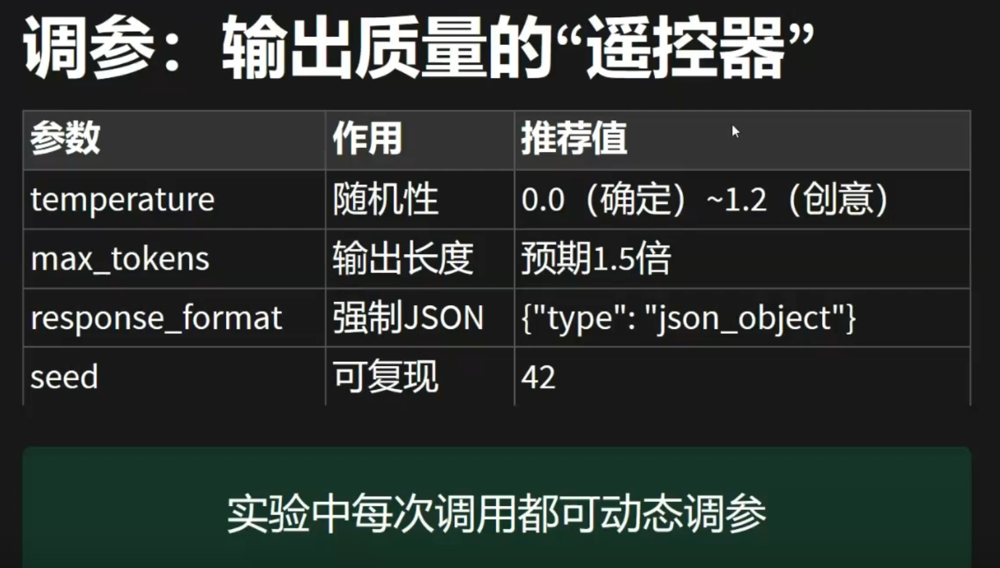
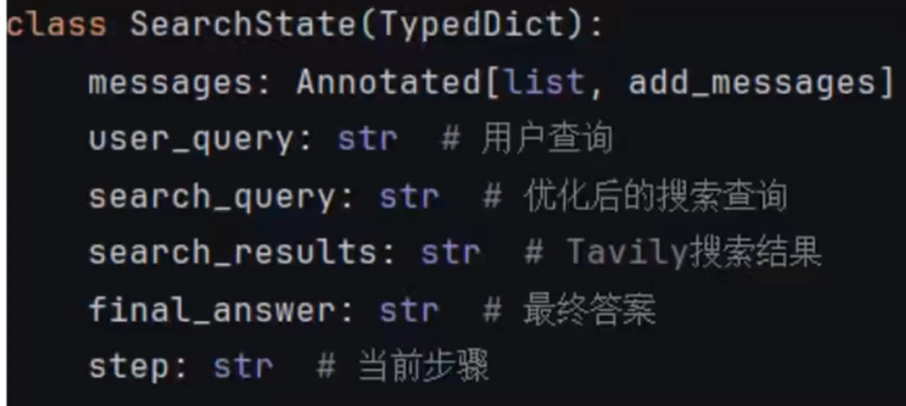
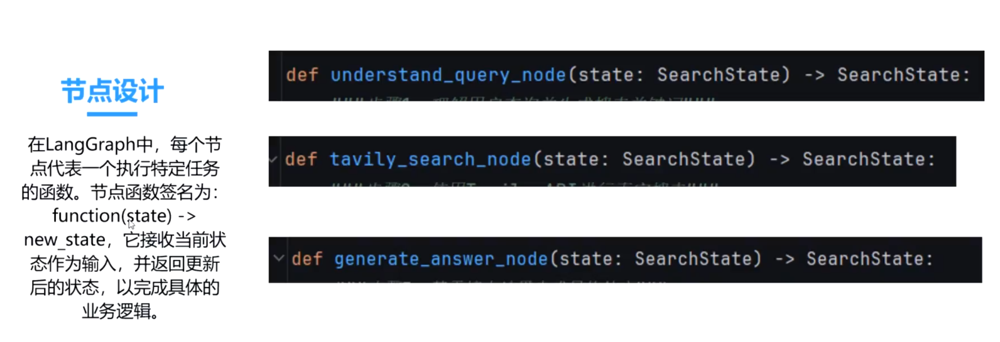
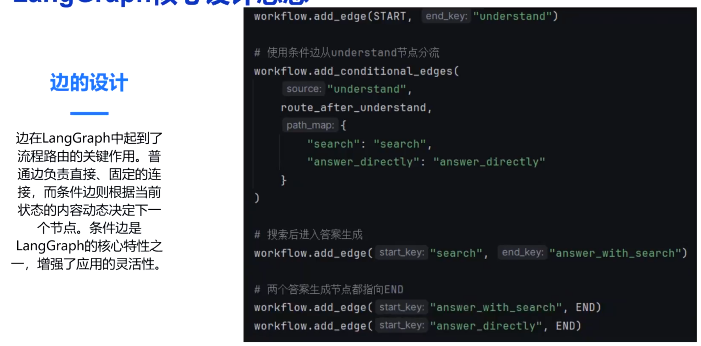
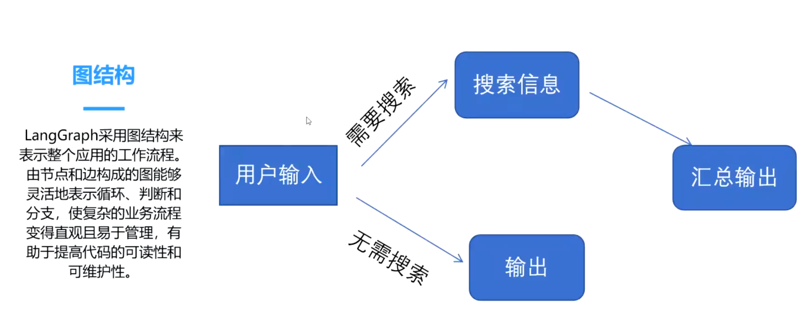

# 零

retrieve_knowledge

```shell
knowledge_base_results: [{
'score': 0.970687747001648, 
'chunk': '《原魔》是一款由米哈开发的开放世界冒险RPG游戏，玩家将在幻想世界“提瓦特”中探索、战斗和解谜。\n游戏背景\n《原魔》设定在一个名为“提瓦特”的幻想世界，玩家将探索九个不同的国家，邂逅各种性格和能力独特的角色。游戏的主要任务是探索大世界，同时与强敌作斗争，揭开世界的奥秘。 \n游戏玩法\n开放世界探索：玩家可以自由漫游，探索世界的每一个角落，发现隐藏的秘密和宝藏。\n角色收集与培养：游戏中有多位可操作角色，每个角色都有独特的技能和属性，玩家可以根据战斗需要进行组合和培养。\n战斗系统：采用实时战斗机制，玩家需要灵活运用角色技能和元素反应来击败敌人。\n任务与活动：游戏中有丰富的主线和支线任务，以及定期更新的活动和挑战，保持游戏的新鲜感和趣味性。', 
'metadata': {
	'hash': 'bc83881127540b923a4488eef3d739f5', 
	'name': '原魔', 
	'path': 'doc/原魔.md', 
	'position': 0, 
	'score': 0.970687747001648, 
	'type': 'code', 
	'url': 'https://cnb.cool/erzhuochen/my-knowledge-base/-/blob/79cb1b0681d45345ecd2cc5d219ded51e2094ecc/doc/原魔.md'}
}] 

context: 
[Source 1] (relevance: 0.97, path: doc/原魔.md)
《原魔》是一款由米哈开发的开放世界冒险RPG游戏，玩家将在幻想世界“提瓦特”中探索、战斗和解谜。
游戏背景
《原魔》设定在一个名为“提瓦特”的幻想世界，玩家将探索九个不同的国家，邂逅各种性格和能力独特的角色。游戏的主要任务是探索大世界，同时与强敌作斗争，揭开世界的奥秘。 
游戏玩法
开放世界探索：玩家可以自由漫游，探索世界的每一个角落，发现隐藏的秘密和宝藏。
角色收集与培养：游戏中有多位可操作角色，每个角色都有独特的技能和属性，玩家可以根据战斗需要进行组合和培养。
战斗系统：采用实时战斗机制，玩家需要灵活运用角色技能和元素反应来击败敌人。
任务与活动：游戏中有丰富的主线和支线任务，以及定期更新的活动和挑战，保持游戏的新鲜感和趣味性。

---

[Source 2] (relevance: 0.00, path: doc/社会支持、心理控制感和心理健康的关系研究.md)
...


sources_gathered: [{
'name': '原魔', 
'path': 'doc/原魔.md', 
'score': 0.970687747001648, 
'hash': 'bc83881127540b923a4488eef3d739f5'}, 

{'name': '社会支持、心理控制感和心理健康的关系研究', 'path': 'doc/社会支持、心理控制感和心理健康的关系研究.md', 'score': 0.0018675660248845816, 'hash': '9860f552c9b089053cb05a811ddbbaa6'}, {'name': '社会支持及其对心理健康的作用机制', 'path': 'doc/社会支持及其对心理健康的作用机制.md', 'score': 0.0016484829830005765, 'hash': '1fd96deaac0e468142002eda0c5a6899'}, {'name': '社会支持、心理控制感和心理健康的关系研究', 'path': 'doc/社会支持、心理控制感和心理健康的关系研究.md', 'score': 0.00033535013790242374, 'hash': '4f65e71aa3966b6f68d93e1a6c5303b7'}, {'name': '社会支持及其对心理健康的作用机制', 'path': 'doc/社会支持及其对心理健康的作用机制.md', 'score': 0.00033535013790242374, 'hash': 'b135dd77e2be5189f01be9c9cc39ad08'}]
```

generate_answer

```shell
response:
[content='原魔是一款由米哈开发的开放世界冒险RPG游戏，玩家可在“提瓦特”这个幻想世界中探索、战斗和解谜。以下是其核心特点的详细解释：\n\n1. **世界设定**  \n   原魔的幻想世界设定在一个包含九个国家的背景中，玩家需通过探索与角色互动完成任务，并与强敌作战。世界范围广，玩家可自由漫游，收集角色、培养技能，并参与实时战斗。\n\n2. **游戏玩法**  \n   - **开放世界探索**：玩家可自由漫游世界，收集角色、培养技能，并通过解谜任务推进剧情。  \n   - **战斗机制**：采用实时战斗系统，玩家需运用技能与角色互动进行战斗。  \n   - **角色培养系统**：玩家可培养角色技能，通过任务与互动提升角色实力。\n\n3. **游戏特色**  \n   - **动态世界**：游戏世界具有开放性和动态性，玩家可通过探索和互动影响世界状态。  \n   - **社交互动**：玩家可与角色互动，参与团队协作与战斗，增强角色互动体验。  \n   - **成就与奖励**：游戏设有成就系统和奖励机制，激励玩家不断探索与成长。\n\n原魔的核心玩法强调自由探索与互动，结合开放世界与战斗机制，为玩家提供了沉浸式的游戏体验。' ,
additional_kwargs={
	'reasoning_content': '好的，用户之前问过“原魔是什么”，我回答了基础信息。现在用户希望详细解释，所以需要更深入的说明。首先，我需要确认用户的需求，他们可能对原魔感兴趣，或者需要了解游戏的基本机制。原魔是一款RPG游戏，所以解释时要涵盖游戏的基本要素，比如世界设定、玩法、核心机制等。\n\n用户可能对游戏机制不太清楚，所以需要详细说明。比如，游戏中的世界设定，九个国家，玩家如何探索和战斗。另外，用户可能想知道游戏的特点，比如开放世界、战斗机制、角色培养等。文档中没有提到游戏与社会支持的关系，所以不需要涉及，但要确保解释清晰，避免混淆。\n\n需要检查是否有遗漏的信息，比如游戏的评分系统或成就系统，但文档中没有提到这些，所以可能不需要扩展。最后，保持回答简洁，使用分点说明，方便用户理解。\n'
} 
response_metadata={
	'model': 'qwen3:0.6b', 
	'created_at': '2025-12-04T06:51:14.545773947Z', 
	'done': True, 
	'done_reason': 'stop', 
	'total_duration': 5604930223, 
	'load_duration': 2871907403, 
	'prompt_eval_count': 2476, 
	'prompt_eval_duration': 156480973, 
	'eval_count': 482, 
	'eval_duration': 2276917662, 
	'logprobs': None, 
	'model_name': 'qwen3:0.6b', 
	'model_provider': 'ollama'
	} 
id='lc_run--9385b97e-f2dd-4b2c-8eb4-c9bd35e39b87' 
usage_metadata={
	'input_tokens': 2476, 
	'output_tokens': 482, 
	'total_tokens': 2958
	}
]
```





# 二、LangGraph

## 2.1 核心设计思想

### 2.1.1 状态



状态类型：

- InputState： 接收用户输入
- OverallState: 记录整体流程状态
- PrivateState: 维护私有变量
- OutputState: 返回最终处理结果

### 2.1.2 节点



### 2.1.3 边



### 2.1.4 图




# 三、演示
完成了场景一和场景二：
- 支持前端切换知识库
- 引用来源角标展示
- 加入了思考节点，能够反思是否上下文充足（最多reflection 3轮）
- 实时流式输出
- 支持显示当前步骤