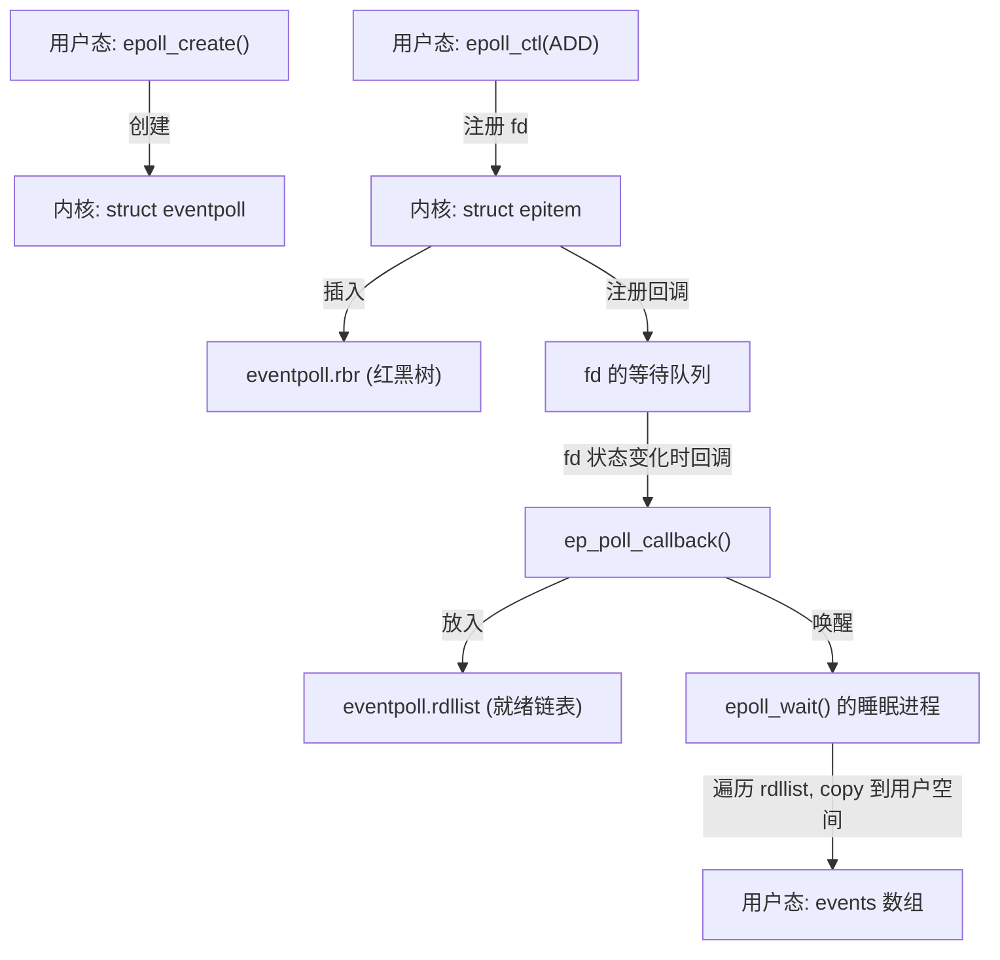
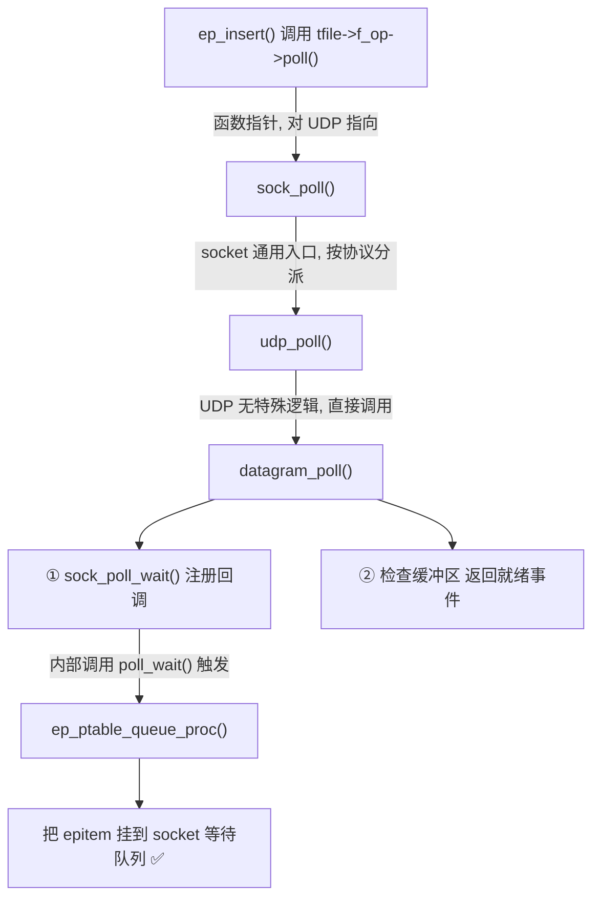

# Epoll 内核源码学习指南

本文档基于你的 [epoll.cpp](file:///d:/workspace/linux/epoll/epoll.cpp) 文件，引导你按照 **epoll 的生命周期** 逐步理解内核实现。

---

## 全局数据流一览



---

## 第一阶段：背景知识（必读前置）

> 📍 对应代码: [epoll.cpp:L13-L53](file:///d:/workspace/linux/epoll/epoll.cpp#L13-L53)

代码开头的注释介绍了理解 epoll 所需的 **3 个内核核心概念**：

### 1. 等待队列 (Wait Queue)

```
队列头 (wait_queue_head_t) → 资源的生产者 (例如 socket)
队列成员 (wait_queue_t)    → 资源的消费者 (例如 epoll)
```

- 当资源 ready 后，队列头会**逐个执行**每个成员注册的**回调函数**来通知它们
- 这是 epoll 得知 fd 状态变化的**核心机制**

### 2. 内核 Poll 机制

- 每个可被 poll 的 fd（如 socket），必须实现 `file_operations.poll`
- 该 fd 需要持有一个**等待队列头**
- 发起 poll 的进程需要将自己作为**等待队列成员**加入其中

### 3. epollfd 本身也是 fd

- epollfd 可以被另一个 epoll 实例监听（嵌套 epoll）

> [!IMPORTANT]
> **核心理解**：epoll 并不是什么"黑科技"，而是将已有的**等待队列 + poll 机制**重新组合，实现了比 select/poll 更高效的事件通知。

---

## 第二阶段：数据结构

> 📍 对应代码: [epoll.cpp:L54-L164](file:///d:/workspace/linux/epoll/epoll.cpp#L54-L164)

### `struct eventpoll` — epoll 实例的内核表示

> 📍 [epoll.cpp:L62-L98](file:///d:/workspace/linux/epoll/epoll.cpp#L62-L98)

| 字段 | 类型 | 作用 |
|------|------|------|
| `lock` | `spinlock_t` | 保护结构体访问的自旋锁 |
| `mtx` | `struct mutex` | 互斥锁，保证多线程安全操作 epoll |
| `wq` | `wait_queue_head_t` | `epoll_wait()` 的进程睡在这里 |
| `poll_wait` | `wait_queue_head_t` | 当 epollfd 本身被 poll 时使用 |
| `rdllist` | `struct list_head` | **就绪链表** — 已经有事件发生的 epitem 都在这 |
| `rbr` | `struct rb_root` | **红黑树根** — 所有被监听的 epitem 组织在此 |
| `ovflist` | `struct epitem *` | "溢出链表" — 在向用户空间传数据期间新到达的事件 |
| `user` | `struct user_struct *` | 当前用户的信息（如最大监听数） |

### `struct epitem` — 每个被监听 fd 的内核表示

> 📍 [epoll.cpp:L104-L136](file:///d:/workspace/linux/epoll/epoll.cpp#L104-L136)

| 字段 | 作用 |
|------|------|
| `rbn` | 红黑树节点，组织到 `eventpoll.rbr` 中 |
| `rdllink` | 链表节点，就绪时链到 `eventpoll.rdllist` |
| `ffd` | 保存 fd 和对应的 `struct file` |
| `ep` | 指向所属的 `eventpoll` |
| `event` | 用户关心的事件掩码（从用户态传入） |
| `next` | 用于 `ovflist` 溢出链表的单链指针 |

> [!TIP]
> **为什么用红黑树？** 因为 `epoll_ctl` 需要频繁地查找/插入/删除 epitem，红黑树对这三种操作都能保证 **O(log N)** 的时间复杂度。

---

## 第三阶段：`epoll_create` — 创建 epoll 实例

> 📍 对应代码: [epoll.cpp:L169-L214](file:///d:/workspace/linux/epoll/epoll.cpp#L169-L214)

### 调用链

```
用户态 epoll_create(size)
  └─→ sys_epoll_create1(0)        // size 参数其实没用！
        ├─→ ep_alloc(&ep)          // 分配并初始化 eventpoll
        └─→ anon_inode_getfd(...)  // 创建匿名 fd，返回 fd 编号
```

### 关键步骤

**1. `ep_alloc()`** ([L327-L352](file:///d:/workspace/linux/epoll/epoll.cpp#L327-L352))：分配并初始化 `eventpoll`

```c
spin_lock_init(&ep->lock);              // 初始化自旋锁
mutex_init(&ep->mtx);                   // 初始化互斥锁
init_waitqueue_head(&ep->wq);           // 初始化 epoll_wait 的等待队列
init_waitqueue_head(&ep->poll_wait);    // 初始化被 poll 时的等待队列
INIT_LIST_HEAD(&ep->rdllist);           // 初始化就绪链表（空的）
ep->rbr = RB_ROOT;                      // 初始化红黑树（空的）
ep->ovflist = EP_UNACTIVE_PTR;          // 溢出链表设为未激活
```

**2. `anon_inode_getfd()`**：为 epoll 创建一个"匿名 fd"

> 📍 [epoll.cpp:L209-L210](file:///d:/workspace/linux/epoll/epoll.cpp#L209-L210)

```c
error = anon_inode_getfd("[eventpoll]", &eventpoll_fops, ep,
                         O_RDWR | (flags & O_CLOEXEC));
```

> [!NOTE]
> **关于变量名 `error`**：这里 `error` 只是一个被复用的变量名。`anon_inode_getfd()` 成功时返回**正整数 fd 编号**（比如 3、4、5），失败时返回**负数错误码**（如 -ENOMEM）。所以第 213 行 `return error;` 成功时实际返回的是 fd 编号。用 `ret` 或 `fd` 命名可能更清晰，但内核代码中复用 `error` 变量是常见风格。

#### 为什么叫"匿名" fd？为什么 epollfd 没有真正的文件？

epoll 实例纯粹是一个**内核内存中的数据结构**（`struct eventpoll`），它不对应磁盘上的任何文件、不对应任何设备、也不对应网络连接——只是内核堆内存中的一块数据（红黑树 + 就绪链表 + 等待队列）。

但 Linux 的设计哲学是 **"一切皆文件"**——用户态程序必须通过 fd 来操作资源。所以内核用 `anon_inode_getfd()` 创建一个**没有目录项、没有文件名、不在任何文件系统中**的虚拟 `struct file`，作为 fd 到 `eventpoll` 的桥梁。因为没有文件名，所以叫"匿名"：

```
用户态看到的：    fd = 5 （一个普通的整数）
                    │
内核中的映射：    fd → struct file（虚拟文件，无文件名 → "匿名"）
                         ├── f_op = &eventpoll_fops（只支持 poll 和 close）
                         └── private_data = ep（指向真正的 eventpoll 结构）
```

这种模式在内核中非常常见：

| 机制 | 有真实磁盘文件？ | 使用匿名 fd？ |
|------|:---:|:---:|
| 普通文件 `/etc/passwd` | ✅ | ❌ |
| socket | ❌ | ✅ |
| **epoll** | ❌ | ✅ |
| timerfd / signalfd / eventfd | ❌ | ✅ |

> [!TIP]
> 这就是为什么后续可以通过 `file->private_data` 拿到 `eventpoll` 结构体。如果你熟悉 Linux 字符设备驱动开发，会发现这和驱动 `open()` 时把私有数据存到 `filp->private_data` 的模式一模一样。

---

## 第四阶段：`epoll_ctl` — 添加/修改/删除监听 fd

> 📍 对应代码: [epoll.cpp:L223-L325](file:///d:/workspace/linux/epoll/epoll.cpp#L223-L325)
### 调用链

```
用户态 epoll_ctl(epfd, op, fd, event)
  ├─→ fget(epfd)           // 获取 epollfd 的 struct file
  ├─→ fget(fd)             // 获取目标 fd 的 struct file
  ├─→ 安全检查：
  │     ├ fd 必须支持 poll（f_op->poll 不为 NULL）
  │     └ epoll ep不能自己监听自己
  ├─→ ep_find(ep, tfile, fd)  // 在红黑树中查找该 fd
  └─→ switch(op):
        ├ EPOLL_CTL_ADD → ep_insert()   // 插入新 fd
        ├ EPOLL_CTL_DEL → ep_remove()   // 删除 fd
        └ EPOLL_CTL_MOD → ep_modify()   // 修改关注的事件
```

### `ep_insert()` 详解 — 最核心的函数之一

> 📍 [epoll.cpp:L360-L464](file:///d:/workspace/linux/epoll/epoll.cpp#L360-L464)

这是理解 epoll 如何与 fd 建立联系的 **关键**：

```
ep_insert(ep, event, tfile, fd)
  │
  ├─① 分配 epitem，初始化各成员
  │
  ├─② 初始化 poll_table，指定回调函数 ep_ptable_queue_proc
  │
  ├─③ 调用 tfile->f_op->poll(tfile, &epq.pt)  ← 这一步是灵魂！
  │     （详见下方「poll 调用链详解」）
  │
  ├─④ 将 epitem 插入 eventpoll 的红黑树
  │
  └─⑤ 如果 fd 此刻已有事件就绪：
        ├ 将 epitem 加入 rdllist（就绪链表）
        └ 唤醒正在 epoll_wait 的进程
```

### `f_op->poll()` 调用链详解

> 📍 [epoll.cpp:L400-L409](file:///d:/workspace/linux/epoll/epoll.cpp#L400-L409)

第 409 行的这行代码是 ep_insert 的灵魂：

```c
revents = tfile->f_op->poll(tfile, &epq.pt);
```

它的意思是：**epoll 主动去问被监听的 fd："你现在有没有事件？顺便把我的回调注册到你那里。"**

`tfile->f_op->poll` 是一个**函数指针**（类似 C++ 的虚函数），不同类型的 fd 有不同的实现。以 UDP socket 为例，完整调用链如下：



#### 每个函数的职责

| 函数                       | 属于哪一层       | 干了什么                                        |
| ------------------------ | ----------- | ------------------------------------------- |
| `tfile->f_op->poll()`    | VFS 层       | 函数指针调用，对 socket 文件指向 `sock_poll`            |
| `sock_poll()`            | socket 通用层  | socket 的 poll 入口，根据类型（TCP/UDP/…）分派          |
| `udp_poll()`             | UDP 协议层     | UDP 的 poll，比较简单，直接转给 `datagram_poll`        |
| `datagram_poll()`        | 数据报通用层      | **做两件关键的事**（见下方）                            |
| `sock_poll_wait()`       | socket 通用层  | 调用 `poll_wait()`，把 epoll 的回调注册到 socket 等待队列 |
| `ep_ptable_queue_proc()` | **epoll 层** | epoll 自己的函数！在第②步中被设为回调                      |

#### `datagram_poll()` 做的两件关键事

```c
datagram_poll(file, poll_table) {
    // 第一件事：注册回调
    sock_poll_wait(file, socket的等待队列头, poll_table);
    //   └→ poll_wait()
    //        └→ poll_table 里的回调，即 ep_ptable_queue_proc()
    //             └→ 把 epitem 挂到 socket 的等待队列上 ✅

    // 第二件事：检查当前状态
    if (socket接收缓冲区有数据)  mask |= POLLIN;   // 可读
    if (socket发送缓冲区有空间)  mask |= POLLOUT;  // 可写
    return mask;  // 返回当前就绪的事件
}
```

#### 为什么需要这么长的调用链？

因为 Linux 内核是**分层设计**的。epoll 不需要知道它监听的是什么类型的 fd（socket、pipe、设备文件……），它只管调用 `f_op->poll()`，具体的 fd 自己知道怎么处理。这就是**多态**：

```
epoll 层        "我要监听这个 fd"           → 只管调用 f_op->poll()
VFS 层          "好，分派到具体实现"         → tfile->f_op->poll
socket 层       "我是 socket，再分派"        → sock_poll
协议层          "我是 UDP"                   → udp_poll → datagram_poll
                 做具体工作：1.注册回调  2.返回当前状态
```

#### 调用链执行完毕后的效果

```
执行前：epoll 和 socket 互不相识

执行后：
  socket 的等待队列 ──包含──→ epitem 的等待队列项
                                  └─ 回调函数 = ep_poll_callback

  效果：socket 收到数据 → 唤醒等待队列 → 触发 ep_poll_callback()
        → epitem 放入 rdllist → epoll_wait 进程被唤醒
```

### `ep_ptable_queue_proc()` — 回调函数的具体实现

> 📍 [epoll.cpp:L474-L496](file:///d:/workspace/linux/epoll/epoll.cpp#L474-L496)

上面调用链的最后一步会执行到这个函数，完成实际的"挂载"工作：

```c
// 初始化等待队列项，指定唤醒时的回调函数
init_waitqueue_func_entry(&pwq->wait, ep_poll_callback);  // ← 这里指定了回调！

// 将等待队列项加入到 fd 的等待队列头中
add_wait_queue(whead, &pwq->wait);
```

> [!IMPORTANT]
> 经过这一步，当 fd（比如 socket）收到数据时，它会唤醒自己等待队列中的所有成员，从而调用 `ep_poll_callback()`。**这就是 epoll 能"被动通知"而非"主动轮询"的秘密。**

---

## 第五阶段：`ep_poll_callback` — 事件到达时的回调

> 📍 对应代码: [epoll.cpp:L506-L571](file:///d:/workspace/linux/epoll/epoll.cpp#L506-L571)

当被监听的 fd 发生状态变化时，这个函数会被**自动调用**：

```
fd 发生事件（如 socket 收到数据）
  └─→ 唤醒 fd 的等待队列
        └─→ ep_poll_callback(wait, ...)
              │
              ├─① 从 wait 中取出对应的 epitem
              │
              ├─② 检查事件是否是我们关心的
              │
              ├─③ 如果 ovflist 已激活（正在向用户空间传数据）：
              │     └ 将 epitem 挂到 ovflist，下次再处理
              │
              ├─④ 否则：将 epitem 加入 rdllist（就绪链表）
              │
              └─⑤ 唤醒正在 epoll_wait 中睡眠的进程
```

> [!NOTE]
> `ovflist` 是一个精巧的设计：在 `epoll_wait` 向用户空间 copy 数据期间，新到的事件不能直接加入 `rdllist`（因为此时 `rdllist` 正被扫描），所以暂存到 `ovflist`，等 copy 完毕后再合并回去。

---

## 第六阶段：`epoll_wait` — 等待并获取事件

### 6.1 `sys_epoll_wait` — 入口

> 📍 [epoll.cpp:L576-L623](file:///d:/workspace/linux/epoll/epoll.cpp#L576-L623)

```
用户态 epoll_wait(epfd, events, maxevents, timeout)
  ├─ 参数校验
  ├─ access_ok() 验证用户空间内存可写
  ├─ fget(epfd) 获取 eventpoll
  └─ ep_poll(ep, events, maxevents, timeout)  ← 真正的等待逻辑
```

### 6.2 `ep_poll` — 睡眠等待事件

> 📍 [epoll.cpp:L625-L702](file:///d:/workspace/linux/epoll/epoll.cpp#L625-L702)

```
ep_poll():
  │
  ├─ 如果 rdllist 不为空 → 直接去收集事件，不用睡
  │
  └─ 如果 rdllist 为空 → 进入睡眠循环：
       │
       ├─ init_waitqueue_entry(&wait, current)      // 把自己初始化为等待队列项
       ├─ __add_wait_queue_exclusive(&ep->wq, &wait) // 挂到 ep 的等待队列
       │
       └─ for (;;) {
            set_current_state(TASK_INTERRUPTIBLE);  // 标记为"可中断睡眠"
            │
            ├─ rdllist 非空？ → break（有事件了！）
            ├─ 超时？ → break
            ├─ 收到信号？ → break（返回 -EINTR）
            └─ schedule_timeout(jtimeout)  ← 真正睡觉 💤
                 │
                 └─ 被唤醒的途径：
                      ① ep_poll_callback() 唤醒（fd 有事件）
                      ② 超时自动唤醒
                      ③ 信号唤醒
          }
       │
       ├─ 移出等待队列
       ├─ 设置状态为 TASK_RUNNING
       └─ 调用 ep_send_events() 将事件 copy 给用户空间
```

### 6.3 事件的收集与发送

> 📍 [epoll.cpp:L704-L867](file:///d:/workspace/linux/epoll/epoll.cpp#L704-L867)

```
ep_send_events()
  └─→ ep_scan_ready_list(ep, ep_send_events_proc, ...)
        │
        ├─① list_splice_init(rdllist → txlist)
        │     // 把 rdllist 整体"偷"到 txlist，rdllist 清空
        │
        ├─② ep->ovflist = NULL
        │     // 激活 ovflist，此后新事件暂存到 ovflist
        │
        ├─③ ep_send_events_proc(ep, txlist, ...)
        │     // 遍历 txlist，逐个 copy 事件到用户空间
        │
        ├─④ 合并 ovflist 中的新事件回 rdllist
        │
        └─⑤ 把 txlist 中未处理完的 epitem 也放回 rdllist
```

### 6.4 `ep_send_events_proc` — ET vs LT 的区别所在！

> 📍 [epoll.cpp:L813-L867](file:///d:/workspace/linux/epoll/epoll.cpp#L813-L867)

```c
// 遍历就绪链表中的每个 epitem
for (...; !list_empty(head) && eventcnt < maxevents;) {
    epi = list_first_entry(head, ...);
    list_del_init(&epi->rdllink);          // 从就绪链表移除

    revents = epi->ffd.file->f_op->poll(epi->ffd.file, NULL);  // 再读一次最新事件

    if (revents) {
        __put_user(revents, &uevent->events);   // copy 给用户
        __put_user(epi->event.data, &uevent->data);

        if (epi->event.events & EPOLLONESHOT)
            // ONESHOT: 触发一次后禁用
            epi->event.events &= EP_PRIVATE_BITS;

        else if (!(epi->event.events & EPOLLET))
            // ⭐ 非 ET（即 LT 水平触发）：重新放回 rdllist！
            list_add_tail(&epi->rdllink, &ep->rdllist);

        // ⭐ ET（边缘触发）：不放回！下次必须等 fd 再次发生状态变化
    }
}
```

> [!IMPORTANT]
> **ET vs LT 的本质区别就在这里**：
> - **LT (Level Triggered)**：事件通知后，epitem 被**放回就绪链表**，下次 `epoll_wait` 仍然会返回（即使你没处理完数据）
> - **ET (Edge Triggered)**：事件通知后，epitem **不放回**就绪链表，只有 fd 再次发生**新的状态变化**时，`ep_poll_callback` 才会再次把它加入就绪链表

---

## 附：`ep_free` — 关闭 epoll 时的清理

> 📍 [epoll.cpp:L870-L909](file:///d:/workspace/linux/epoll/epoll.cpp#L870-L909)

```
ep_free():
  ├─ 唤醒所有在 poll_wait 上等待的进程
  ├─ 遍历红黑树，注销所有 poll 回调
  ├─ 遍历红黑树，ep_remove() 删除所有 epitem
  ├─ 销毁互斥锁
  └─ 释放 eventpoll 内存
```

> [!TIP]
> 这就是为什么关闭 epollfd 之前**不需要手动调用 `epoll_ctl(DEL)`** 逐个移除 fd —— 内核在 `ep_free` 中会自动完成清理。

---

## 关键总结

### Epoll 的 6 步核心流程

| 步骤 | 用户态 API | 内核实现 | 作用 |
|------|-----------|---------|------|
| ① | `epoll_create()` | `ep_alloc()` + `anon_inode_getfd()` | 创建 eventpoll + 分配 fd |
| ② | `epoll_ctl(ADD)` | `ep_insert()` | 分配 epitem，插入红黑树，注册回调 |
| ③ | — | `ep_ptable_queue_proc()` | 将 epitem 挂到 fd 的等待队列 |
| ④ | — | `ep_poll_callback()` | fd 有事件时：加入就绪链表，唤醒 wait |
| ⑤ | `epoll_wait()` | `ep_poll()` → `ep_send_events()` | 睡眠等待 → 收集事件 → copy 到用户空间 |
| ⑥ | `close(epfd)` | `ep_free()` | 清理所有资源 |

### Epoll 高效的根本原因

1. **事件驱动，非轮询**：通过等待队列的回调机制，fd 有事件时**主动通知** epoll，而不是 epoll 去逐个检查
2. **红黑树管理 fd**：增删查都是 O(log N)
3. **就绪链表**：`epoll_wait` 返回时只需遍历**有事件的 fd**，复杂度 O(就绪数)，而非 O(所有 fd 数)
4. **内存映射优化**：事件数据只 copy 一次到用户空间

---

