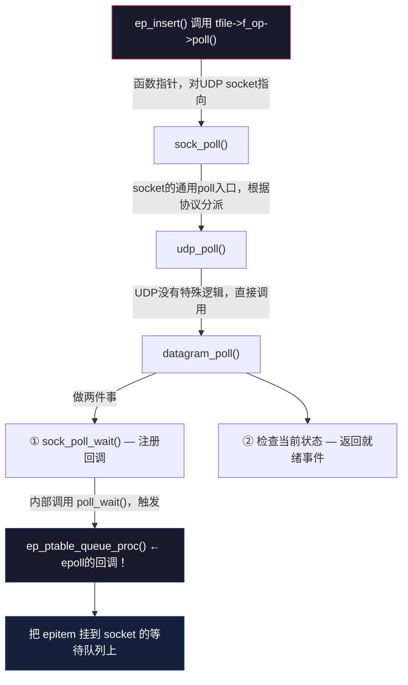
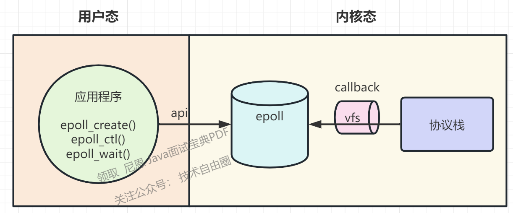

# 一、Linux 2.4.0 内核启动流程分析 (`init/main.c`)

这个文件是 Linux 内核的核心初始化文件，包含了从汇编代码跳转到 C 代码后的整个启动流程。

## 1.1 linux kernel中__setup()函数介绍
### 1.1.1 `__setup`使用示例
```c
static int __init skip_initramfs_param(char *str)
{
	if (*str)
		return 0;
	do_skip_initramfs = 1;
	return 1;
}
__setup("skip_initramfs", skip_initramfs_param);
```
### 1.1.2 `__setup`宏原理
```c
#define __setup(str, fn) \

static char __setup_str_##fn[] __initdata = str; \

static struct kernel_param __setup_##fn __attribute__((unused)) __initsetup = { __setup_str_##fn, fn }
```

| 属性                        | 作用                               |
| ------------------------- | -------------------------------- |
| `__initdata`              | 放入 `.data.init` 段，初始化期间使用，启动后可释放 |
| `__initsetup`             | 放入 `.setup.init` 段，初始化期间使用，供内核遍历 |
| `__attribute__((unused))` | 避免编译器"未使用变量"警告                   |
| `##`                      | 预处理器连接符，生成唯一变量名                  |
以 `main.c` 中的例子 `__setup("root=", root_dev_setup)` 为例，展开后变成：
```c
// 1. 创建一个字符串，存储参数名 "root="
static char __setup_str_root_dev_setup[] __initdata = "root=";

// 2. 创建一个 kernel_param 结构体，关联参数名和处理函数
static struct kernel_param __setup_root_dev_setup __initsetup = { 
    __setup_str_root_dev_setup,   // 参数字符串
    root_dev_setup                 // 处理函数
};
```
### 1.1.3   `__setup`注册的参数如何使用

```c
// 遍历所有注册的内核参数处理器，匹配并执行对应的处理函数。
static int __init checksetup(char *line)
{
    struct kernel_param *p;

    p = &__setup_start;           // 指向 .setup.init 段的起始地址
    do {
        int n = strlen(p->str);   // 获取参数名长度，如 "root=" 长度为 5
        if (!strncmp(line, p->str, n)) {  // 前 n 个字符是否匹配
            if (p->setup_func(line+n))    // 调用处理函数，传入参数值部分
                return 1;                  // 处理成功
        }
        p++;                       // 检查下一个注册项
    } while (p < &__setup_end);    // 直到段结束
    return 0;                      // 没有匹配的处理器
}
```
## 1.2 主要执行流程

### 1. `start_kernel()` - 内核主入口点（0号进程）

这是从架构相关汇编代码跳转过来的第一个 C 函数：
```c
asmlinkage void __init start_kernel(void){
    lock_kernel();              // 【新增】获取大内核锁，SMP 保护，防止多CPU同时执行内核初始化
    printk(linux_banner);
    setup_arch(&command_line);  // 架构相关初始化
    parse_options(command_line);// 解析命令行（类似0.11）
    
    trap_init();                // 初始化异常/陷阱（类似0.11）
    init_IRQ();                 // 初始化中断（类似0.11）
    sched_init();               // 调度器初始化（类似0.11）
    time_init();                // 时间初始化（类似0.11）
    softirq_init();             // 【新增】软中断初始化
    console_init();             // 控制台初始化
    
    kmem_cache_init();          // 【新增】slab 分配器
    mem_init();                 // 内存初始化
    fork_init(mempages);        // 进程创建初始化
    
    // ... 各子系统初始化 ...
    
    smp_init();                 // 【新增】启动其他 CPU
    kernel_thread(init, ...);   // 创建 init 内核线程（类似0.11的fork）
    unlock_kernel();
    cpu_idle();  // 空闲循环函数（在cpu空闲时运行的函数），仅在进程 PID 为0时进入无限循环
}
```
### 2. `init()` - 1号进程

由 `kernel_thread()` 创建，作为所有用户进程的祖先：
init()
    │
    ├── lock_kernel()
    ├── do_basic_setup()           // 设备和驱动初始化
    │       │
    │       ├── child_reaper = current  // 设置孤儿进程收割者
    │       ├── mtrr_init()             // MTRR 初始化
    │       ├── sysctl_init()           // sysctl 初始化
    │       │
    │       ├── pci_init()              // PCI 总线初始化
    │       ├── sbus_init()             // SBUS 初始化
    │       ├── mca_init()              // MCA 总线初始化
    │       ├── isapnp_init()           // ISA PnP 初始化
    │       │
    │       ├── sock_init()             // 网络套接字初始化
    │       ├── do_initcalls()          // 调用所有 __initcall 标记的函数
    │       ├── filesystem_setup()      // 文件系统设置
    │       ├── mount_root()            // 挂载根文件系统
    │       └── mount_devfs_fs()        // 挂载 devfs
    │
    ├── free_initmem()             // 释放 __init 段内存
    ├── unlock_kernel()
    │
    ├── open("/dev/console", ...)  // 打开控制台作为 stdin
    ├── dup(0)                     // 复制为 stdout
    ├── dup(0)                     // 复制为 stderr
    │
    └── execve(...)                // 尝试执行 init 程序
            ├── execute_command    // 命令行指定的 init=
            ├── /sbin/init         // 标准位置
            ├── /etc/init
            ├── /bin/init
            └── /bin/sh            // 最后尝试 shell

### 3. 重要辅助函数

|函数|作用|
|---|---|
|`calibrate_delay()`|校准 `loops_per_jiffy`，计算 BogoMIPS|
|`parse_options()`|解析内核命令行，设置环境变量和 init 参数|
|`name_to_kdev_t()`|将设备名 (如 `/dev/hda1`) 转换为设备号|
|`checksetup()`|检查并调用 `__setup()` 注册的参数处理函数|
|`do_initcalls()`|执行所有通过 `__initcall` 注册的初始化函数|

### 4. 启动参数处理

通过 `__setup()` 宏注册的命令行参数处理器：

- `root=` → 设置根设备
- `ro` → 只读挂载根文件系统
- `rw` → 读写挂载根文件系统
- `debug` → 提高日志级别
- `quiet` → 降低日志级别
- `init=` → 指定 init 程序路径
- `profile=` → 内核性能分析

### 5. 设备名映射表

`root_dev_names[]` 数组定义了设备名到设备号的映射：

- `hda`-`hdt`: IDE 硬盘
- `sda`-`sdp`: SCSI 硬盘
- `fd`: 软盘
- `md`: RAID 设备
- `ram`: 内存盘
- 等等...

## 流程总结图

 BIOS/Bootloader
        │
        ▼
 arch/xxx/boot/*  (汇编启动代码)
        │
        ▼
 start_kernel()   ──────────────────────────────────┐
        │                                           │
        │  [硬件初始化阶段]                          │
        ├── 中断、陷阱、调度器                       │
        ├── 内存管理                                │
        ├── 控制台                                  │
        │                                           │
        │  [子系统初始化]                            │
        ├── VFS、缓冲区、进程                        │
        │                                           │
        │  [多处理器启动]                            │
        ├── smp_init()                              │
        │                                           │
        ▼                                           │
 kernel_thread(init)  ◄─────────────────────────────┘
        │
        ▼
 init() [PID 1]
        │
        ├── 设备驱动初始化
        ├── 挂载根文件系统
        │
        ▼
 execve("/sbin/init")
        │
        ▼
 用户空间 init 进程


# 二、epoll
## 个人理解
- epoll 在等待队列中是成员？

## 前言

Linux内核提供了3个关键函数供用户来操作epoll，分别是：

- epoll_create(), 创建eventpoll对象
- epoll_ctl(), 操作eventpoll对象
- epoll_wait(), 从eventpoll对象中返回活跃的事件

而操作系统内部会用到一个名叫epoll_event_callback()的回调函数来调度epoll对象中的事件，这个函数非常重要，故本文将会对上述4个函数进行源码分析。

## 两个核心数据结构

### (1)[epitem](https://zhida.zhihu.com/search?content_id=210928563&content_type=Article&match_order=1&q=epitem&zhida_source=entity)


如图所示，epitem是中包含了两个主要的成员变量，分别是rbn和rdlink，前者是红黑树的节点，而后者是双链表的节点，也就是说一个epitem对象即可作为红黑树中的一个节点又可作为双链表中的一个节点。并且每个epitem中存放着一个event，对event的查询也就转换成了对epitem的查询。

```text
struct epitem {
	RB_ENTRY(epitem) rbn;
	/*  RB_ENTRY(epitem) rbn等价于
	struct {											
		struct type *rbe_left;		//指向左子树
		struct type *rbe_right;		//指向右子树
		struct type *rbe_parent;	//指向父节点
		int rbe_color;			    //该节点的颜色
	} rbn
	*/
 
	LIST_ENTRY(epitem) rdlink;
	/* LIST_ENTRY(epitem) rdlink等价于
	struct {									
		struct type *le_next;	//指向下个元素
		struct type **le_prev;	//前一个元素的地址
	}*/
 
	int rdy; //判断该节点是否同时存在与红黑树和双向链表中
	
	int sockfd; //socket句柄
	struct epoll_event event;  //存放用户填充的事件
};
```

### (2)[eventpoll](https://zhida.zhihu.com/search?content_id=210928563&content_type=Article&match_order=4&q=eventpoll&zhida_source=entity)


如图所示，eventpoll中包含了两个主要的成员变量，分别是rbr和rdlist，前者指向红黑树的[根节点](https://zhida.zhihu.com/search?content_id=210928563&content_type=Article&match_order=1&q=%E6%A0%B9%E8%8A%82%E7%82%B9&zhida_source=entity)，后者指向双链表的[头结点](https://zhida.zhihu.com/search?content_id=210928563&content_type=Article&match_order=1&q=%E5%A4%B4%E7%BB%93%E7%82%B9&zhida_source=entity)。即一个eventpoll对象对应二个epitem的容器。对epitem的检索，将发生在这两个容器上（红黑树和双链表）。

```text
struct eventpoll {
	/*
	struct ep_rb_tree {
		struct epitem *rbh_root; 			
	}
	*/
	ep_rb_tree rbr;      //rbr指向红黑树的根节点
	
	int rbcnt; //红黑树中节点的数量（也就是添加了多少个TCP连接事件）
	
	LIST_HEAD( ,epitem) rdlist;    //rdlist指向双向链表的头节点；
	/*	这个LIST_HEAD等价于 
		struct {
			struct epitem *lh_first;
		}rdlist;
	*/
	
	int rdnum; //双向链表中节点的数量（也就是有多少个TCP连接来事件了）
 
	// ...略...
	
};
```

## epoll的工作环境
应用程序只能通过三个api接口来操作epoll。当一个io准备就绪的时候，epoll是怎么知道io准备就绪了呢？是由协议栈将数据解析出来触发回调通知epoll的。也就是说可以把epoll的工作环境看出三部分，左边应用程序的api，中间的epoll，右边是协议栈的回调(协议栈当然不能直接操作epoll，中间的vfs在此不是重点，就直接省略vfs这一层了)。

## 协议栈触发回调通知epoll的时机
socket有两类，一类是监听listenfd（接受新的 TCP 连接请求），一类是客户端clientfd（负责具体业务数据的收发）。对于sockfd而言，我们一般比较关注EPOLLIN和EPOLLOUT这两个事件，所以如果是listenfd，我们通常的做法就是accept。对于clientfd来说，如果可读我们就recv，如果可写我们就send。

协议栈将数据解析出来触发回调通知epoll。epoll是怎么知道哪个io就绪了呢？我们从ip头可以解析出源ip，目的ip和协议，从tcp头可以解析出源端口和目的端口，此时五元组就凑齐了。socket fd --- < 源IP地址 , 源端口 , 目的IP地址 , 目的端口 , 协议 > 一个fd就是一个五元组，知道了fd，我们就能从红黑树中找到对应的结点。

那么这个回调函数做什么事情呢？我们传入**fd**和**具体事件**这两个参数，然后做下面两个操作

1. 通过fd找到对应的结点
    
2. 把结点加入到就绪队列
    

1、协议栈中，在三次握手完成之后，会往全连接队列中添加一个TCB结点，然后触发一个回调函数，通知到epoll里面有个EPOLLIN事件
2、客户端发送一个数据包，协议栈接收后回复ACK，之后触发一个回调函数，通知到epoll里面有个EPOLLIN事件
3、每个连接的TCB里面都有一个sendbuf，在对端接收到数据并返回ACK以后，sendbuf就可以将这部分确认接收的数据清空，此时sendbuf里面就有剩余空间，此时触发一个回调函数，通知到epoll里面有个EPOLLOUT事件
## 源码
```c
/* 
 * eventpoll: epoll 的核心实例，每个 epollfd 在内核中对应一个 eventpoll。
 */
struct eventpoll {
    spinlock_t lock;           // 保护就绪链表等核心数据的自旋锁
    struct mutex mtx;          // 保护红黑树等操作的互斥锁
    wait_queue_head_t wq;      // 核心等待队列：调用 epoll_wait() 的进程会挂载（睡眠）在这里
    struct list_head rdllist;  // 就绪链表 (Ready List)：所有已经发生事件的 fd 对应的 epitem 都在这里
    struct rb_root rbr;        // 红黑树根节点：用于存储所有被监听的 fd (epitem)，便于 O(logN) 增删改查
    struct epitem *ovflist;    // 溢出链表：在向用户空间拷贝数据时，暂存新到来的事件
};

/* 
 * epitem: 代表一个被监听的 fd 及其相关状态。
 */
struct epitem {
    struct rb_node rbn;        // 红黑树节点，挂载到 eventpoll->rbr
    struct list_head rdllink;  // 就绪链表节点，挂载到 eventpoll->rdllist
    struct epoll_filefd ffd;   // 记录被监听的 fd 及其对应的 struct file
    struct eventpoll *ep;      // 反向指针，指向所属的 eventpoll 实例
    struct epoll_event event;  // 记录用户关心的事件 (如 EPOLLIN, EPOLLOUT)
};
```

[epoll内核源码详解+自己总结的流程_牛客网](https://www.nowcoder.com/discuss/353154027972141056)
```c
/*
 *  fs/eventpoll.c (Efficient event retrieval implementation)
 *  Copyright (C) 2001,...,2009	 Davide Libenzi
 *
 *  This program is free software; you can redistribute it and/or modify
 *  it under the terms of the GNU General Public License as published by
 *  the Free Software Foundation; either version 2 of the License, or
 *  (at your option) any later version.
 *
 *  Davide Libenzi <davidel@xmailserver.org>
 *
 */
/*
 * 在深入了解epoll的实现之前, 先来了解内核的3个方面.
 * 1. 等待队列 waitqueue
 * 我们简单解释一下等待队列:
 * 队列头(wait_queue_head_t)往往是资源生产者,
 * 队列成员(wait_queue_t)往往是资源消费者,
 * 当头的资源ready后, 会逐个执行每个成员指定的回调函数,
 * 来通知它们资源已经ready了, 等待队列大致就这个意思.
 * 2. 内核的poll机制
 * 被Poll的fd, 必须在实现上支持内核的Poll技术,
 * 比如fd是某个字符设备,或者是个socket, 它必须实现
 * file_operations中的poll操作, 给自己分配有一个等待队列头.
 * 主动poll fd的某个进程必须分配一个等待队列成员, 添加到
 * fd的等待队列里面去, 并指定资源ready时的回调函数.
 * 用socket做例子, 它必须有实现一个poll操作, 这个Poll是
 * 发起轮询的代码必须主动调用的, 该函数中必须调用poll_wait(),
 * poll_wait会将发起者作为等待队列成员加入到socket的等待队列中去.
 * 这样socket发生状态变化时可以通过队列头逐个通知所有关心它的进程.
 * 这一点必须很清楚的理解, 否则会想不明白epoll是如何
 * 得知fd的状态发生变化的.
 * 3. epollfd本身也是个fd, 所以它本身也可以被epoll,
 * 可以猜测一下它是不是可以无限嵌套epoll下去... 
 *
 * epoll基本上就是使用了上面的1,2点来完成.
 * 可见epoll本身并没有给内核引入什么特别复杂或者高深的技术,
 * 只不过是已有功能的重新组合, 达到了超过select的效果.
 */
/* 
 * 相关的其它内核知识:
 * 1. fd我们知道是文件描述符, 在内核态, 与之对应的是struct file结构,
 * 可以看作是内核态的文件描述符.
 * 2. spinlock, 自旋锁, 必须要非常小心使用的锁,
 * 尤其是调用spin_lock_irqsave()的时候, 中断关闭, 不会发生进程调度,
 * 被保护的资源其它CPU也无法访问. 这个锁是很强力的, 所以只能锁一些
 * 非常轻量级的操作.
 * 3. 引用计数在内核中是非常重要的概念,
 * 内核代码里面经常有些release, free释放资源的函数几乎不加任何锁,
 * 这是因为这些函数往往是在对象的引用计数变成0时被调用,
 * 既然没有进程在使用在这些对象, 自然也不需要加锁.
 * struct file 是持有引用计数的.
 */
/* --- epoll相关的数据结构 --- */
/*
 * This structure is stored inside the "private_data" member of the file
 * structure and rapresent the main data sructure for the eventpoll
 * interface.
 */
/* 每创建一个epollfd, 内核就会分配一个eventpoll与之对应, 可以说是
 * 内核态的epollfd. */
struct eventpoll {
	/* Protect the this structure access */
	spinlock_t lock;
	/*
	 * This mutex is used to ensure that files are not removed
	 * while epoll is using them. This is held during the event
	 * collection loop, the file cleanup path, the epoll file exit
	 * code and the ctl operations.
	 */
	/* 添加, 修改或者删除监听fd的时候, 以及epoll_wait返回, 向用户空间
	 * 传递数据时都会持有这个互斥锁, 所以在用户空间可以放心的在多个线程
	 * 中同时执行epoll相关的操作, 内核级已经做了保护. */
	struct mutex mtx;
	/* Wait queue used by sys_epoll_wait() */
	/* 调用epoll_wait()时, 我们就是"睡"在了这个等待队列上... */
	wait_queue_head_t wq;
	/* Wait queue used by file->poll() */
	/* 这个用于epollfd本事被poll的时候... */
	wait_queue_head_t poll_wait;
	/* List of ready file descriptors */
	/* 所有已经ready的epitem都在这个链表里面 */
	struct list_head rdllist;
	/* RB tree root used to store monitored fd structs */
	/* 所有要监听的epitem都在这里 */
	struct rb_root rbr;
	/*
		这是一个单链表链接着所有的struct epitem当event转移到用户空间时
	 */
	 * This is a single linked list that chains all the "struct epitem" that
	 * happened while transfering ready events to userspace w/out
	 * holding ->lock.
	 */
	struct epitem *ovflist;
	/* The user that created the eventpoll descriptor */
	/* 这里保存了一些用户变量, 比如fd监听数量的最大值等等 */
	struct user_struct *user;
};
/*
 * Each file descriptor added to the eventpoll interface will
 * have an entry of this type linked to the "rbr" RB tree.
 */
/* epitem 表示一个被监听的fd */
struct epitem {
	/* RB tree node used to link this structure to the eventpoll RB tree */
	/* rb_node, 当使用epoll_ctl()将一批fds加入到某个epollfd时, 内核会分配
	 * 一批的epitem与fds们对应, 而且它们以rb_tree的形式组织起来, tree的root
	 * 保存在epollfd, 也就是struct eventpoll中. 
	 * 在这里使用rb_tree的原因我认为是提高查找,插入以及删除的速度.
	 * rb_tree对以上3个操作都具有O(lgN)的时间复杂度 */
	struct rb_node rbn;
	/* List header used to link this structure to the eventpoll ready list */
	/* 链表节点, 所有已经ready的epitem都会被链到eventpoll的rdllist中 */
	struct list_head rdllink;
	/*
	 * Works together "struct eventpoll"->ovflist in keeping the
	 * single linked chain of items.
	 */
	/* 这个在代码中再解释... */
	struct epitem *next;
	/* The file descriptor information this item refers to */
	/* epitem对应的fd和struct file */
	struct epoll_filefd ffd;
	/* Number of active wait queue attached to poll operations */
	int nwait;
	/* List containing poll wait queues */
	struct list_head pwqlist;
	/* The "container" of this item */
	/* 当前epitem属于哪个eventpoll */
	struct eventpoll *ep;
	/* List header used to link this item to the "struct file" items list */
	struct list_head fllink;
	/* The structure that describe the interested events and the source fd */
	/* 当前的epitem关系哪些events, 这个数据是调用epoll_ctl时从用户态传递过来 */
	struct epoll_event event;
};
struct epoll_filefd {
	struct file *file;
	int fd;
};
/* poll所用到的钩子Wait structure used by the poll hooks */
struct eppoll_entry {
	/* List header used to link this structure to the "struct epitem" */
	struct list_head llink;
	/* The "base" pointer is set to the container "struct epitem" */
	struct epitem *base;
	/*
	 * Wait queue item that will be linked to the target file wait
	 * queue head.
	 */
	wait_queue_t wait;
	/* The wait queue head that linked the "wait" wait queue item */
	wait_queue_head_t *whead;
};
/* Wrapper struct used by poll queueing */
struct ep_pqueue {
	poll_table pt;
	struct epitem *epi;
};
/* Used by the ep_send_events() function as callback private data */
struct ep_send_events_data {
	int maxevents;
	struct epoll_event __user *events;
};

/* --- 代码注释 --- */
/* 你没看错, 这就是epoll_create()的真身, 基本啥也不干直接调用epoll_create1了,
 * 另外你也可以发现, size这个参数其实是没有任何用处的... */
SYSCALL_DEFINE1(epoll_create, int, size)
{
        if (size <= 0)
                return -EINVAL;
        return sys_epoll_create1(0);
}
/* 这才是真正的epoll_create啊~~ */
SYSCALL_DEFINE1(epoll_create1, int, flags)
{
	int error;
	struct eventpoll *ep = NULL;//主描述符
	/* Check the EPOLL_* constant for consistency.  */
	/* 这句没啥用处... */
	BUILD_BUG_ON(EPOLL_CLOEXEC != O_CLOEXEC);
	/* 对于epoll来讲, 目前唯一有效的FLAG就是CLOEXEC */
	if (flags & ~EPOLL_CLOEXEC)
		return -EINVAL;
	/*
	 * Create the internal data structure ("struct eventpoll").
	 */
	/* 分配一个struct eventpoll, 分配和初始化细节我们随后深聊~ */
	error = ep_alloc(&ep);
	if (error < 0)
		return error;
	/*
	 * Creates all the items needed to setup an eventpoll file. That is,
	 * a file structure and a free file descriptor.
	 */
	/* 这里是创建一个匿名fd, 说起来就话长了...长话短说:
	 * epollfd本身并不存在一个真正的文件与之对应, 所以内核需要创建一个
	 * "虚拟"的文件, 并为之分配真正的struct file结构, 而且有真正的fd.
	 * 这里2个参数比较关键:
	 * eventpoll_fops, fops就是file operations, 就是当你对这个文件(这里是虚拟的)进行操作(比如读)时,
	 * fops里面的函数指针指向真正的操作实现, 类似C++里面虚函数和子类的概念.
	 * epoll只实现了poll和release(就是close)操作, 其它文件系统操作都有VFS全权处理了.
	 * ep, ep就是struct epollevent, 它会作为一个私有数据保存在struct file的private指针里面.
	 * 其实说白了, 就是为了能通过fd找到struct file, 通过struct file能找到eventpoll结构.
	 * 如果懂一点Linux下字符设备驱动开发, 这里应该是很好理解的,
	 * 推荐阅读 <Linux device driver 3rd>
	 */
	error = anon_inode_getfd("[eventpoll]", &eventpoll_fops, ep,
				 O_RDWR | (flags & O_CLOEXEC));
	if (error < 0)
		ep_free(ep);
	return error;
}
/* 
* 创建好epollfd后, 接下来我们要往里面添加fd咯
* 来看epoll_ctl
* epfd 就是epollfd
* op ADD,MOD,DEL
* fd 需要监听的描述符
* event 我们关心的events
*/
SYSCALL_DEFINE4(epoll_ctl, int, epfd, int, op, int, fd,
		struct epoll_event __user *, event)
{
	int error;
	struct file *file, *tfile;
	struct eventpoll *ep;
	struct epitem *epi;
	struct epoll_event epds;
	error = -EFAULT;
	/* 
	 * 错误处理以及从用户空间将epoll_event结构copy到内核空间.
	 */
	if (ep_op_has_event(op) &&
	    copy_from_user(&epds, event, sizeof(struct epoll_event)))
		goto error_return;
	/* Get the "struct file *" for the eventpoll file */
	/* 取得struct file结构, epfd既然是真正的fd, 那么内核空间
	 * 就会有与之对于的一个struct file结构
	 * 这个结构在epoll_create1()中, 由函数anon_inode_getfd()分配 */
	error = -EBADF;
	file = fget(epfd);
	if (!file)
		goto error_return;
	/* Get the "struct file *" for the target file */
	/* 我们需要监听的fd, 它当然也有个struct file结构, 上下2个不要搞混了哦 */
	tfile = fget(fd);
	if (!tfile)
		goto error_fput;
	/* The target file descriptor must support poll */
	error = -EPERM;
	/* 如果监听的文件不支持poll, 那就没辙了.
	 * 你知道什么情况下, 文件会不支持poll吗?
	 */
	if (!tfile->f_op || !tfile->f_op->poll)
		goto error_tgt_fput;
	/*
	 * We have to check that the file structure underneath the file descriptor
	 * the user passed to us _is_ an eventpoll file. And also we do not permit
	 * adding an epoll file descriptor inside itself.
	 */
	error = -EINVAL;
	/* epoll不能自己监听自己... */
	if (file == tfile || !is_file_epoll(file))
		goto error_tgt_fput;
	/*
	 * At this point it is safe to assume that the "private_data" contains
	 * our own data structure.
	 */
	/* 取到我们的eventpoll结构, 来自与epoll_create1()中的分配 */
	ep = file->private_data;
	/* 接下来的操作有可能修改数据结构内容, 锁之~ */
	mutex_lock(&ep->mtx);
	/*
	 * Try to lookup the file inside our RB tree, Since we grabbed "mtx"
	 * above, we can be sure to be able to use the item looked up by
	 * ep_find() till we release the mutex.
	 */
	/* 对于每一个监听的fd, 内核都有分配一个epitem结构,
	 * 而且我们也知道, epoll是不允许重复添加fd的,
	 * 所以我们首先查找该fd是不是已经存在了.
	 * ep_find()其实就是RBTREE查找, 跟C++STL的map差不多一回事, O(lgn)的时间复杂度.
	 */
	epi = ep_find(ep, tfile, fd);
	error = -EINVAL;
	switch (op) {
		/* 首先我们关心添加 */
	case EPOLL_CTL_ADD:
		if (!epi) {
			/* 之前的find没有找到有效的epitem, 证明是第一次插入, 接受!
			 * 这里我们可以知道, POLLERR和POLLHUP事件内核总是会关心的
			 * */
			epds.events |= POLLERR | POLLHUP;
			/* rbtree插入, 详情见ep_insert()的分析
			 * 其实我觉得这里有insert的话, 之前的find应该
			 * 是可以省掉的... */
			error = ep_insert(ep, &epds, tfile, fd);
		} else
			/* 找到了!? 重复添加! */
			error = -EEXIST;
		break;
		/* 删除和修改操作都比较简单 */
	case EPOLL_CTL_DEL:
		if (epi)
			error = ep_remove(ep, epi);
		else
			error = -ENOENT;
		break;
	case EPOLL_CTL_MOD:
		if (epi) {
			epds.events |= POLLERR | POLLHUP;
			error = ep_modify(ep, epi, &epds);
		} else
			error = -ENOENT;
		break;
	}
	mutex_unlock(&ep->mtx);
error_tgt_fput:
	fput(tfile);
error_fput:
	fput(file);
error_return:
	return error;
}
/* 分配一个eventpoll结构 */
static int ep_alloc(struct eventpoll **pep)
{
	int error;
	struct user_struct *user;
	struct eventpoll *ep;
	/* 获取当前用户的一些信息, 比如是不是root啦, 最大监听fd数目啦 */
	user = get_current_user();
	error = -ENOMEM;
	ep = kzalloc(sizeof(*ep), GFP_KERNEL);
	if (unlikely(!ep))
		goto free_uid;
	/* 这些都是初始化啦 */
	spin_lock_init(&ep->lock);
	mutex_init(&ep->mtx);
	init_waitqueue_head(&ep->wq);//初始化自己睡在的等待队列
	init_waitqueue_head(&ep->poll_wait);//初始化
	INIT_LIST_HEAD(&ep->rdllist);//初始化就绪链表
	ep->rbr = RB_ROOT;
	ep->ovflist = EP_UNACTIVE_PTR;
	ep->user = user;
	*pep = ep;
	return 0;
free_uid:
	free_uid(user);
	return error;
}
/*
 * Must be called with "mtx" held.
 */
/* 
 * ep_insert()在epoll_ctl()中被调用, 完成往epollfd里面添加一个监听fd的工作
 * tfile是fd在内核态的struct file结构
 */
static int ep_insert(struct eventpoll *ep, struct epoll_event *event,
		     struct file *tfile, int fd)
{
	int error, revents, pwake = 0;
	unsigned long flags;
	struct epitem *epi;
	struct ep_pqueue epq;
	/* 查看是否达到当前用户的最大监听数 */
	if (unlikely(atomic_read(&ep->user->epoll_watches) >=
		     max_user_watches))
		return -ENOSPC;
	/* 从著名的slab中分配一个epitem */
	if (!(epi = kmem_***_alloc(epi_***, GFP_KERNEL)))
		return -ENOMEM;
	/* Item initialization follow here ... */
	/* 这些都是相关成员的初始化... */
	INIT_LIST_HEAD(&epi->rdllink);
	INIT_LIST_HEAD(&epi->fllink);
	INIT_LIST_HEAD(&epi->pwqlist);
	epi->ep = ep;
	/* 这里保存了我们需要监听的文件fd和它的file结构 */
	ep_set_ffd(&epi->ffd, tfile, fd);
	epi->event = *event;
	epi->nwait = 0;
	/* 这个指针的初值不是NULL哦... */
	epi->next = EP_UNACTIVE_PTR;
	/* Initialize the poll table using the queue callback */
	/* 好, 我们终于要进入到poll的正题了 */
	epq.epi = epi;
	/* 初始化一个poll_table
	 * 其实就是指定调用poll_wait(注意不是epoll_wait!!!)时的回调函数,和我们关心哪些events,
	 * ep_ptable_queue_proc()就是我们的回调啦, 初值是所有event都关心 */
	init_poll_funcptr(&epq.pt, ep_ptable_queue_proc);
	/*
	 * Attach the item to the poll hooks and get current event bits.
	 * We can safely use the file* here because its usage count has
	 * been increased by the caller of this function. Note that after
	 * this operation completes, the poll callback can start hitting
	 * the new item.
	 */
	/* 这一部很关键, 也比较难懂, 完全是内核的poll机制导致的...
	 * 首先, f_op->poll()一般来说只是个wrapper, 它会调用真正的poll实现,
	 * 拿UDP的socket来举例, 这里就是这样的调用流程: f_op->poll(), sock_poll(),
	 * udp_poll(), datagram_poll(), sock_poll_wait(), 最后调用到我们上面指定的
	 * ep_ptable_queue_proc()这个回调函数...(好深的调用路径...).
	 * 完成这一步, 我们的epitem就跟这个socket关联起来了, 当它有状态变化时,
	 * 会通过ep_poll_callback()来通知.
	 * 最后, 这个函数还会查询当前的fd是不是已经有啥event已经ready了, 有的话
	 * 会将event返回. */
	revents = tfile->f_op->poll(tfile, &epq.pt);
	/*
	 * We have to check if something went wrong during the poll wait queue
	 * install process. Namely an allocation for a wait queue failed due
	 * high memory pressure.
	 */
	error = -ENOMEM;
	if (epi->nwait < 0)
		goto error_unregister;
	/* Add the current item to the list of active epoll hook for this file */
	/* 这个就是每个文件会将所有监听自己的epitem链起来 */
	spin_lock(&tfile->f_lock);
	list_add_tail(&epi->fllink, &tfile->f_ep_links);
	spin_unlock(&tfile->f_lock);
	/*
	 * Add the current item to the RB tree. All RB tree operations are
	 * protected by "mtx", and ep_insert() is called with "mtx" held.
	 */
	/* 都搞定后, 将epitem插入到对应的eventpoll中去 */
	ep_rbtree_insert(ep, epi);
	/* We have to drop the new item inside our item list to keep track of it */
	spin_lock_irqsave(&ep->lock, flags);
	/* If the file is already "ready" we drop it inside the ready list */
	/* 到达这里后, 如果我们监听的fd已经有事件发生, 那就要处理一下 */
	if ((revents & event->events) && !ep_is_linked(&epi->rdllink)) {
		/* 将当前的epitem加入到ready list中去 */
		list_add_tail(&epi->rdllink, &ep->rdllist);
		/* Notify waiting tasks that events are available */
		/* 谁在epoll_wait, 就唤醒它... */
		if (waitqueue_active(&ep->wq))
			wake_up_locked(&ep->wq);
		/* 谁在epoll当前的epollfd, 也唤醒它... */
		if (waitqueue_active(&ep->poll_wait))
			pwake++;
	}
	spin_unlock_irqrestore(&ep->lock, flags);
	atomic_inc(&ep->user->epoll_watches);
	/* We have to call this outside the lock */
	if (pwake)
		ep_poll_safewake(&ep->poll_wait);
	return 0;
error_unregister:
	ep_unregister_pollwait(ep, epi);
	/*
	 * We need to do this because an event could have been arrived on some
	 * allocated wait queue. Note that we don't care about the ep->ovflist
	 * list, since that is used/cleaned only inside a section bound by "mtx".
	 * And ep_insert() is called with "mtx" held.
	 */
	spin_lock_irqsave(&ep->lock, flags);
	if (ep_is_linked(&epi->rdllink))
		list_del_init(&epi->rdllink);
	spin_unlock_irqrestore(&ep->lock, flags);
	kmem_***_free(epi_***, epi);
	return error;
}
/*
 * This is the callback that is used to add our wait queue to the
 * target file wakeup lists.
 */
/* 
 * 该函数在调用f_op->poll()时会被调用.
 * 也就是epoll主动poll某个fd时, 用来将epitem与指定的fd关联起来的.
 * 关联的办法就是使用等待队列(waitqueue)
 */
static void ep_ptable_queue_proc(struct file *file, wait_queue_head_t *whead,
				 poll_table *pt)
{
	struct epitem *epi = ep_item_from_epqueue(pt);
	struct eppoll_entry *pwq;
	if (epi->nwait >= 0 && (pwq = kmem_***_alloc(pwq_***, GFP_KERNEL))) {
		/* 初始化等待队列, 指定ep_poll_callback为唤醒时的回调函数,
		 * 当我们监听的fd发生状态改变时, 也就是队列头被唤醒时,
		 * 指定的回调函数将会被调用. */
		init_waitqueue_func_entry(&pwq->wait, ep_poll_callback);
		pwq->whead = whead;
		pwq->base = epi;
		/* 将刚分配的等待队列成员加入到头中, 头是由fd持有的 */
		add_wait_queue(whead, &pwq->wait);
		list_add_tail(&pwq->llink, &epi->pwqlist);
		/* nwait记录了当前epitem加入到了多少个等待队列中,
		 * 我认为这个值最大也只会是1... */
		epi->nwait++;
	} else {
		/* We have to signal that an error occurred */
		epi->nwait = -1;
	}
}
/*
 * This is the callback that is passed to the wait queue wakeup
 * machanism. It is called by the stored file descriptors when they
 * have events to report.
 */
/* 
 * 这个是关键性的回调函数, 当我们监听的fd发生状态改变时, 它会被调用.
 * 参数key被当作一个unsigned long整数使用, 携带的是events.
 */
static int ep_poll_callback(wait_queue_t *wait, unsigned mode, int sync, void *key)
{
	int pwake = 0;
	unsigned long flags;
	struct epitem *epi = ep_item_from_wait(wait);//从等待队列获取epitem.需要知道哪个进程挂载到这个设备
	struct eventpoll *ep = epi->ep;//获取
	spin_lock_irqsave(&ep->lock, flags);
	/*
	 * If the event mask does not contain any poll(2) event, we consider the
	 * descriptor to be disabled. This condition is likely the effect of the
	 * EPOLLONESHOT bit that disables the descriptor when an event is received,
	 * until the next EPOLL_CTL_MOD will be issued.
	 */
	if (!(epi->event.events & ~EP_PRIVATE_BITS))
		goto out_unlock;
	/*
	 * Check the events coming with the callback. At this stage, not
	 * every device reports the events in the "key" parameter of the
	 * callback. We need to be able to handle both cases here, hence the
	 * test for "key" != NULL before the event match test.
	 */
	/* 没有我们关心的event... */
	if (key && !((unsigned long) key & epi->event.events))
		goto out_unlock;
	/*
	 * If we are trasfering events to userspace, we can hold no locks
	 * (because we're accessing user memory, and because of linux f_op->poll()
	 * semantics). All the events that happens during that period of time are
	 * chained in ep->ovflist and requeued later on.
	 */
	/* 
	 * 这里看起来可能有点费解, 其实干的事情比较简单:
	 * 如果该callback被调用的同时, epoll_wait()已经返回了,
	 * 也就是说, 此刻应用程序有可能已经在循环获取events,
	 * 这种情况下, 内核将此刻发生event的epitem用一个单独的链表
	 * 链起来, 不发给应用程序, 也不丢弃, 而是在下一次epoll_wait
	 * 时返回给用户.
	 */
	if (unlikely(ep->ovflist != EP_UNACTIVE_PTR)) {
		if (epi->next == EP_UNACTIVE_PTR) {
			epi->next = ep->ovflist;
			ep->ovflist = epi;
		}
		goto out_unlock;
	}
	/* If this file is already in the ready list we exit soon */
	/* 将当前的epitem放入ready list */
	if (!ep_is_linked(&epi->rdllink))
		list_add_tail(&epi->rdllink, &ep->rdllist);
	/*
	 * Wake up ( if active ) both the eventpoll wait list and the ->poll()
	 * wait list.
	 */
	/* 唤醒epoll_wait... */
	if (waitqueue_active(&ep->wq))
		wake_up_locked(&ep->wq);
	/* 如果epollfd也在被poll, 那就唤醒队列里面的所有成员. */
	if (waitqueue_active(&ep->poll_wait))
		pwake++;
out_unlock:
	spin_unlock_irqrestore(&ep->lock, flags);
	/* We have to call this outside the lock */
	if (pwake)
		ep_poll_safewake(&ep->poll_wait);
	return 1;
}
/*
 * Implement the event wait interface for the eventpoll file. It is the kernel
 * part of the user space epoll_wait(2).
 */
SYSCALL_DEFINE4(epoll_wait, int, epfd, struct epoll_event __user *, events,
		int, maxevents, int, timeout)
{
	int error;
	struct file *file;
	struct eventpoll *ep;
	/* The maximum number of event must be greater than zero */
	if (maxevents <= 0 || maxevents > EP_MAX_EVENTS)
		return -EINVAL;
	/* Verify that the area passed by the user is writeable */
	/* 这个地方有必要说明一下:
	 * 内核对应用程序采取的策略是"绝对不信任",
	 * 所以内核跟应用程序之间的数据交互大都是copy, 不允许(也时候也是不能...)指针引用.
	 * epoll_wait()需要内核返回数据给用户空间, 内存由用户程序提供,
	 * 所以内核会用一些手段来验证这一段内存空间是不是有效的.
	 */
	if (!access_ok(VERIFY_WRITE, events, maxevents * sizeof(struct epoll_event))) {
		error = -EFAULT;
		goto error_return;
	}
	/* Get the "struct file *" for the eventpoll file */
	error = -EBADF;
	/* 获取epollfd的struct file, epollfd也是文件嘛 */
	file = fget(epfd);
	if (!file)
		goto error_return;
	/*
	 * We have to check that the file structure underneath the fd
	 * the user passed to us _is_ an eventpoll file.
	 */
	error = -EINVAL;
	/* 检查一下它是不是一个真正的epollfd... */
	if (!is_file_epoll(file))
		goto error_fput;
	/*
	 * At this point it is safe to assume that the "private_data" contains
	 * our own data structure.
	 */
	/* 获取eventpoll结构 */
	ep = file->private_data;
	/* Time to fish for events ... */
	/* OK, 睡觉, 等待事件到来~~ */
	error = ep_poll(ep, events, maxevents, timeout);
error_fput:
	fput(file);
error_return:
	return error;
}
/* 这个函数真正将执行epoll_wait的进程带入睡眠状态... */
static int ep_poll(struct eventpoll *ep, struct epoll_event __user *events,
		   int maxevents, long timeout)
{
	int res, eavail;
	unsigned long flags;
	long jtimeout;
	wait_queue_t wait;//等待队列
	/*
	 * Calculate the timeout by checking for the "infinite" value (-1)
	 * and the overflow condition. The passed timeout is in milliseconds,
	 * that why (t * HZ) / 1000.
	 */
	/* 计算睡觉时间, 毫秒要转换为HZ */
	jtimeout = (timeout < 0 || timeout >= EP_MAX_MSTIMEO) ?
		MAX_SCHEDULE_TIMEOUT : (timeout * HZ + 999) / 1000;
retry:
	spin_lock_irqsave(&ep->lock, flags);
	res = 0;
	/* 如果ready list不为空, 就不睡了, 直接干活... */
	if (list_empty(&ep->rdllist)) {
		/*
		 * We don't have any available event to return to the caller.
		 * We need to sleep here, and we will be wake up by
		 * ep_poll_callback() when events will become available.
		 */
		/* OK, 初始化一个等待队列, 准备直接把自己挂起,
		 * 注意current是一个宏, 代表当前进程 */
		init_waitqueue_entry(&wait, current);//初始化等待队列,wait表示当前进程
		__add_wait_queue_exclusive(&ep->wq, &wait);//挂载到ep结构的等待队列
		for (;;) {
			/*
			 * We don't want to sleep if the ep_poll_callback() sends us
			 * a wakeup in between. That's why we set the task state
			 * to TASK_INTERRUPTIBLE before doing the checks.
			 */
			/* 将当前进程设置位睡眠, 但是可以被信号唤醒的状态,
			 * 注意这个设置是"将来时", 我们此刻还没睡! */
			set_current_state(TASK_INTERRUPTIBLE);
			/* 如果这个时候, ready list里面有成员了,
			 * 或者睡眠时间已经过了, 就直接不睡了... */
			if (!list_empty(&ep->rdllist) || !jtimeout)
				break;
			/* 如果有信号产生, 也起床... */
			if (signal_pending(current)) {
				res = -EINTR;
				break;
			}
			/* 啥事都没有,解锁, 睡觉... */
			spin_unlock_irqrestore(&ep->lock, flags);
			/* jtimeout这个时间后, 会被唤醒,
			 * ep_poll_callback()如果此时被调用,
			 * 那么我们就会直接被唤醒, 不用等时间了... 
			 * 再次强调一下ep_poll_callback()的调用时机是由被监听的fd
			 * 的具体实现, 比如socket或者某个设备驱动来决定的,
			 * 因为等待队列头是他们持有的, epoll和当前进程
			 * 只是单纯的等待...
			 **/
			jtimeout = schedule_timeout(jtimeout);//睡觉
			spin_lock_irqsave(&ep->lock, flags);
		}
		__remove_wait_queue(&ep->wq, &wait);
		/* OK 我们醒来了... */
		set_current_state(TASK_RUNNING);
	}
	/* Is it worth to try to dig for events ? */
	eavail = !list_empty(&ep->rdllist) || ep->ovflist != EP_UNACTIVE_PTR;
	spin_unlock_irqrestore(&ep->lock, flags);
	/*
	 * Try to transfer events to user space. In case we get 0 events and
	 * there's still timeout left over, we go trying again in search of
	 * more luck.
	 */
	/* 如果一切正常, 有event发生, 就开始准备数据copy给用户空间了... */
	if (!res && eavail &&
	    !(res = ep_send_events(ep, events, maxevents)) && jtimeout)
		goto retry;
	return res;
}
/* 这个简单, 我们直奔下一个... */
static int ep_send_events(struct eventpoll *ep,
			  struct epoll_event __user *events, int maxevents)
{
	struct ep_send_events_data esed;
	esed.maxevents = maxevents;
	esed.events = events;
	return ep_scan_ready_list(ep, ep_send_events_proc, &esed);
}
/**
 * ep_scan_ready_list - Scans the ready list in a way that makes possible for
 *                      the scan code, to call f_op->poll(). Also allows for
 *                      O(NumReady) performance.
 *
 * @ep: Pointer to the epoll private data structure.
 * @sproc: Pointer to the scan callback.
 * @priv: Private opaque data passed to the @sproc callback.
 *
 * Returns: The same integer error code returned by the @sproc callback.
 */
static int ep_scan_ready_list(struct eventpoll *ep,
			      int (*sproc)(struct eventpoll *,
					   struct list_head *, void *),
			      void *priv)
{
	int error, pwake = 0;
	unsigned long flags;
	struct epitem *epi, *nepi;
	LIST_HEAD(txlist);
	/*
	 * We need to lock this because we could be hit by
	 * eventpoll_release_file() and epoll_ctl().
	 */
	mutex_lock(&ep->mtx);
	/*
	 * Steal the ready list, and re-init the original one to the
	 * empty list. Also, set ep->ovflist to NULL so that events
	 * happening while looping w/out locks, are not lost. We cannot
	 * have the poll callback to queue directly on ep->rdllist,
	 * because we want the "sproc" callback to be able to do it
	 * in a lockless way.
	 */
	spin_lock_irqsave(&ep->lock, flags);
	/* 这一步要注意, 首先, 所有监听到events的epitem都链到rdllist上了,
	 * 但是这一步之后, 所有的epitem都转移到了txlist上, 而rdllist被清空了,
	 * 要注意哦, rdllist已经被清空了! */
	list_splice_init(&ep->rdllist, &txlist);
	/* ovflist, 在ep_poll_callback()里面我解释过, 此时此刻我们不希望
	 * 有新的event加入到ready list中了, 保存后下次再处理... */
	ep->ovflist = NULL;
	spin_unlock_irqrestore(&ep->lock, flags);
	/*
	 * Now call the callback function.
	 */
	/* 在这个回调函数里面处理每个epitem
	 * sproc 就是 ep_send_events_proc, 下面会注释到. */
	error = (*sproc)(ep, &txlist, priv);
	spin_lock_irqsave(&ep->lock, flags);
	/*
	 * During the time we spent inside the "sproc" callback, some
	 * other events might have been queued by the poll callback.
	 * We re-insert them inside the main ready-list here.
	 */
	/* 现在我们来处理ovflist, 这些epitem都是我们在传递数据给用户空间时
	 * 监听到了事件. */
	for (nepi = ep->ovflist; (epi = nepi) != NULL;
	     nepi = epi->next, epi->next = EP_UNACTIVE_PTR) {
		/*
		 * We need to check if the item is already in the list.
		 * During the "sproc" callback execution time, items are
		 * queued into ->ovflist but the "txlist" might already
		 * contain them, and the list_splice() below takes care of them.
		 */
		/* 将这些直接放入readylist */
		if (!ep_is_linked(&epi->rdllink))
			list_add_tail(&epi->rdllink, &ep->rdllist);
	}
	/*
	 * We need to set back ep->ovflist to EP_UNACTIVE_PTR, so that after
	 * releasing the lock, events will be queued in the normal way inside
	 * ep->rdllist.
	 */
	ep->ovflist = EP_UNACTIVE_PTR;
	/*
	 * Quickly re-inject items left on "txlist".
	 */
	/* 上一次没有处理完的epitem, 重新插入到ready list */
	list_splice(&txlist, &ep->rdllist);
	/* ready list不为空, 直接唤醒... */
	if (!list_empty(&ep->rdllist)) {
		/*
		 * Wake up (if active) both the eventpoll wait list and
		 * the ->poll() wait list (delayed after we release the lock).
		 */
		if (waitqueue_active(&ep->wq))
			wake_up_locked(&ep->wq);
		if (waitqueue_active(&ep->poll_wait))
			pwake++;
	}
	spin_unlock_irqrestore(&ep->lock, flags);
	mutex_unlock(&ep->mtx);
	/* We have to call this outside the lock */
	if (pwake)
		ep_poll_safewake(&ep->poll_wait);
	return error;
}
/* 该函数作为callbakc在ep_scan_ready_list()中被调用
 * head是一个链表, 包含了已经ready的epitem,
 * 这个不是eventpoll里面的ready list, 而是上面函数中的txlist.
 */
static int ep_send_events_proc(struct eventpoll *ep, struct list_head *head,
			       void *priv)
{
	struct ep_send_events_data *esed = priv;
	int eventcnt;
	unsigned int revents;
	struct epitem *epi;
	struct epoll_event __user *uevent;
	/*
	 * We can loop without lock because we are passed a task private list.
	 * Items cannot vanish during the loop because ep_scan_ready_list() is
	 * holding "mtx" during this call.
	 */
	/* 扫描整个链表... */
	for (eventcnt = 0, uevent = esed->events;
	     !list_empty(head) && eventcnt < esed->maxevents;) {
		/* 取出第一个成员 */
		epi = list_first_entry(head, struct epitem, rdllink);
		/* 然后从链表里面移除 */
		list_del_init(&epi->rdllink);
		/* 读取events, 
		 * 注意events我们ep_poll_callback()里面已经取过一次了, 为啥还要再取?
		 * 1. 我们当然希望能拿到此刻的最新数据, events是会变的~
		 * 2. 不是所有的poll实现, 都通过等待队列传递了events, 有可能某些驱动压根没传
		 * 必须主动去读取. */
		revents = epi->ffd.file->f_op->poll(epi->ffd.file, NULL) &
			epi->event.events;
		if (revents) {
			/* 将当前的事件和用户传入的数据都copy给用户空间,
			 * 就是epoll_wait()后应用程序能读到的那一堆数据. */
			if (__put_user(revents, &uevent->events) ||
			    __put_user(epi->event.data, &uevent->data)) {
				list_add(&epi->rdllink, head);
				return eventcnt ? eventcnt : -EFAULT;
			}
			eventcnt++;
			uevent++;
			if (epi->event.events & EPOLLONESHOT)
				epi->event.events &= EP_PRIVATE_BITS;
			else if (!(epi->event.events & EPOLLET)) {
				/* 嘿嘿, EPOLLET和非ET的区别就在这一步之差呀~
				 * 如果是ET, epitem是不会再进入到readly list,
				 * 除非fd再次发生了状态改变, ep_poll_callback被调用.
				 * 如果是非ET, 不管你还有没有有效的事件或者数据,
				 * 都会被重新插入到ready list, 再下一次epoll_wait
				 * 时, 会立即返回, 并通知给用户空间. 当然如果这个
				 * 被监听的fds确实没事件也没数据了, epoll_wait会返回一个0,
				 * 空转一次.
				 */
				list_add_tail(&epi->rdllink, &ep->rdllist);
			}
		}
	}
	return eventcnt;
}
/* ep_free在epollfd被close时调用,
 * 释放一些资源而已, 比较简单 */
static void ep_free(struct eventpoll *ep)
{
	struct rb_node *rbp;
	struct epitem *epi;
	/* We need to release all tasks waiting for these file */
	if (waitqueue_active(&ep->poll_wait))
		ep_poll_safewake(&ep->poll_wait);
	/*
	 * We need to lock this because we could be hit by
	 * eventpoll_release_file() while we're freeing the "struct eventpoll".
	 * We do not need to hold "ep->mtx" here because the epoll file
	 * is on the way to be removed and no one has references to it
	 * anymore. The only hit might come from eventpoll_release_file() but
	 * holding "epmutex" is sufficent here.
	 */
	mutex_lock(&epmutex);
	/*
	 * Walks through the whole tree by unregistering poll callbacks.
	 */
	for (rbp = rb_first(&ep->rbr); rbp; rbp = rb_next(rbp)) {
		epi = rb_entry(rbp, struct epitem, rbn);
		ep_unregister_pollwait(ep, epi);
	}
	/*
	 * Walks through the whole tree by freeing each "struct epitem". At this
	 * point we are sure no poll callbacks will be lingering around, and also by
	 * holding "epmutex" we can be sure that no file cleanup code will hit
	 * us during this operation. So we can avoid the lock on "ep->lock".
	 */
	/* 之所以在关闭epollfd之前不需要调用epoll_ctl移除已经添加的fd,
	 * 是因为这里已经做了... */
	while ((rbp = rb_first(&ep->rbr)) != NULL) {
		epi = rb_entry(rbp, struct epitem, rbn);
		ep_remove(ep, epi);
	}
	mutex_unlock(&epmutex);
	mutex_destroy(&ep->mtx);
	free_uid(ep->user);
	kfree(ep);
}
/* File callbacks that implement the eventpoll file behaviour */
static const struct file_operations eventpoll_fops = {
	.release	= ep_eventpoll_release,
	.poll		= ep_eventpoll_poll
};
/* Fast test to see if the file is an evenpoll file */
static inline int is_file_epoll(struct file *f)
{
	return f->f_op == &eventpoll_fops;
}
/* OK, eventpoll我认为比较重要的函数都注释完了... */

```


## fd和socket
在 Linux/Unix 系统中，理解 `fd`（文件描述符，File Descriptor）和 `socket`（套接字）的区别与联系，核心在于理解操作系统“一切皆文件”的设计哲学。

简单来说：**`fd` 是操作系统的“通用凭证”，而 `socket` 是具体的“网络通信资源”。**

以下是它们的详细区别与内在联系：

### 1. 区别：它们分别是什么？

| **特性**   | **fd (文件描述符)**                                           | **socket (套接字)**                                                     |
| -------- | -------------------------------------------------------- | -------------------------------------------------------------------- |
| **本质**   | 一个非负整数（如 0, 1, 3, 5）。                                    | 内核中的一组复杂数据结构（包含发送/接收缓冲区、IP、端口、状态机等）。                                 |
| **所属空间** | **用户态**和**内核态**的桥梁。对应用程序来说，它只是一个数字标签。                    | 完全存在于**内核态**中。应用程序无法直接操作它的内存。                                        |
| **作用范围** | **非常广**。不仅可以代表网络连接，还可以代表普通文件、目录、管道（pipe）、设备驱动（如终端、打印机）等。 | **专门**用于进程间通信（IPC）或网络通信（TCP/UDP 等）。                                  |
| **生命周期** | 进程级别的。进程关闭，对应的 fd 表就会被清理。                                | 系统级别的。如果配置了某些选项（如 `SO_LINGER`），即使进程关闭，内核中的 socket 可能还会存活一段时间来完成数据发送。 |

### 2. 联系：它们是如何协同工作的？

**① Socket 是一种“特殊的文件”**

在 Linux 的视界里，Socket 就是一种文件类型。当你调用 `socket()` 函数创建一个网络连接时，内核会在底层分配一块内存来存放这套网络数据结构（这就是真正的 Socket），同时会在当前进程的**文件描述符表**中找一个空闲的数字（这就是 fd）分配给它，并将这个数字与底层的 Socket 结构绑定起来。

**② `fd` 是操作 `socket` 的唯一把手**

用户态的应用程序是无法直接触碰内核里的 Socket 结构的。内核把 `fd` 返回给用户程序，意思是：_“你的网络资源我已经准备好了，代号是整数 5。以后你要发数据、收数据或者关闭连接，只要拿着代号 5 来找我（系统调用），我就知道你要操作哪个具体的网络连接。”_

**③ 接口的通用性**

因为 Socket 也被当成了文件，所以你可以像读写普通文本文件一样，使用最基础的 `read(fd)` 和 `write(fd)` 来进行网络数据的收发。当然，为了支持更复杂的网络特性，系统也提供了专属的 `send(fd)` 和 `recv(fd)`。

---

### 💡 一个通俗的生活比喻

假设你去一家大型酒店（**操作系统内核**）开房办业务：

- **Socket** 就像是酒店里一间**带有高级视频会议系统的房间**（拥有网络通信能力的实体资源）。
    
- **fd** 就像是前台发给你的一张带有数字号码的**房卡**（比如 808 号）。
    

**它们的联系与区别在于：**

1. 你手里拿的永远只是房卡（`fd`），你不可能把房间（`socket`）带在身上。
    
2. 你想进房间开会、放东西（发数据/收数据），必须刷这张房卡（系统调用传入 `fd`）。
    
3. 房卡不仅可以开会议室（网络 `socket`），还可以开储物间（普通文本文件）、厨房（管道 `pipe`）。它是一个**通用凭证**。
    
4. 如果你弄丢了房卡（在代码里不小心覆盖了 `fd` 变量的值），你就再也找不到那个房间了（内存泄漏/资源泄露）；如果酒店前台把你房卡注销了（`close(fd)`），房间就会被保洁阿姨清理并开放给下一个客人。