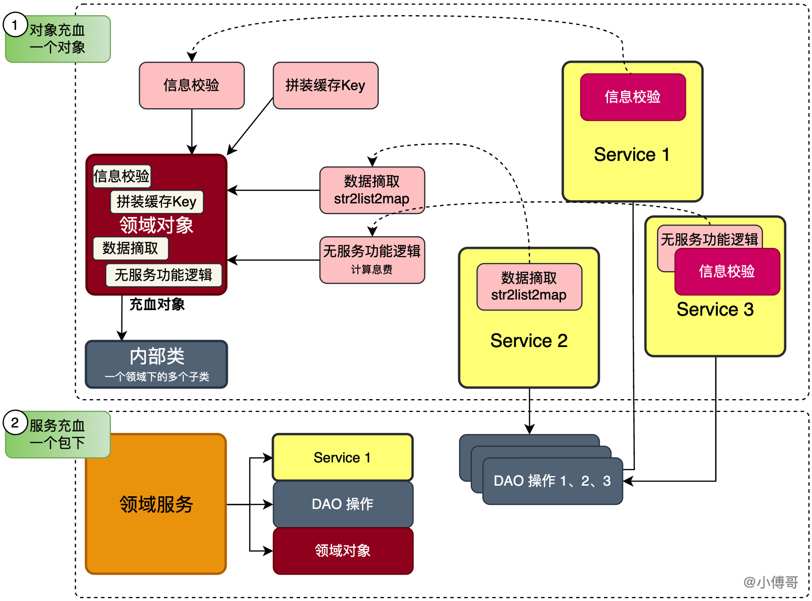
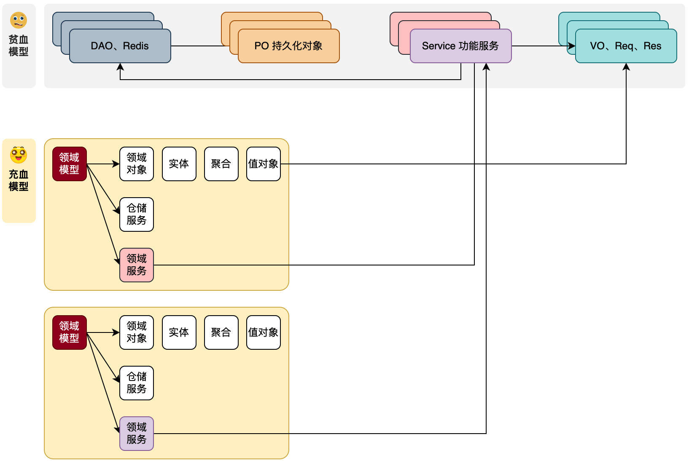
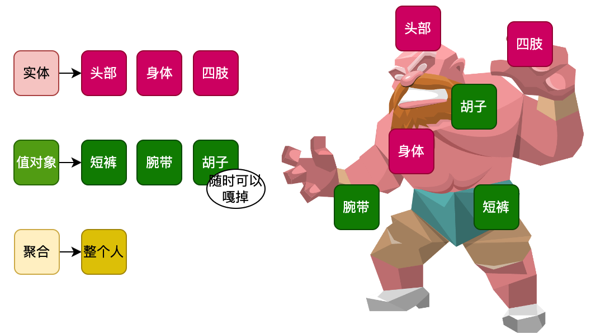

# 概念理论

## DDD是什么？

DDD是一种软件设计方法。

## DDD的概念
### 充血模型
- 充血模型：指将对象的属性信息与行为逻辑聚合到一个类中

- 这样的方法可以在使用一个对象时，就顺便拿到这个对象的提供的一系列方法信息，所有使用对象的逻辑方法，都不需要自己再次处理同类逻辑。
- 充血还可以是整个包结构，一个包下包含了用于实现此包Service服务所需的各类零部件（模型、仓储、工厂），也可以看做充血模型。
- 同时我们还会在一个同类的类下，提供对应的内部类。

### 领域模型
指特定业务领域内，业务规则、策略以及业务流程的抽象和封装。
最大的区别在于把原有的`众多Service + 数据模型`的方式，拆分为`独立的有边界的领域模块`。每个领域内创建自身所属的：领域对象（实体、聚合、值对象）、仓储服务（DAO操作）、工厂、端口适配器Port（调用外部接口的手段）等。

- 在原本的Service + 贫血的数据模型开发指导下，Service串联调用每个功能模块。这些基础设施（对象、方法、接口）是被互相调用的。这也是因为贫血模型并没有面向对象的设计，所有的需求开发只有详细设计。
- 换到充血模型下，现在我们以一个领域模型为聚合，拆分一个领域内所需的Service为领域服务，VO、Req、Res重新设计为领域对象，DAO、Redis等持久化操作为仓储等。举例：一套账户服务中的，授信认证、开户、提额降额等，每一个都是一个独立的领域，在每个独立的领域内，创建自身领域所需的各项信息。
- 领域模型还有一个特点，它自身只关注业务功能实现，**不与外部任何接口和服务直连**。而是通过仓库和端口适配器，定义调用外部数据的含有出入参对象的接口标准，让基础设施做具体的调用实现——通过这样的方式让领域只关心业务实现，同时做好防腐。

### 实体、聚合、值对象

- 实体：胳膊、腿、身体。和这个人的生命有关
- 值对象：帽子、手套、裤衩。不具有生命属性。
- 聚合：就是要写库一个事务，一次形成。

#### 实体
依托与持久化层数据以领域服务功能目标为指导设计的领域对象。
持久化PO对象是原子类对象，不具有业务语义，而实体对象是具有业务语义且有唯一标识的对象，跟随与领域服务方法的全生命周期对象。
