DDD通常可以分为战略设计和战术设计两部分。
**战略设计**关注**体统整体，包括领域、子域和限界上下文**。它主要解决“体统该如何拆分”的问题。
以外面系统为例，可以根据业务职责划分订单、商品、库存、支付、配送等上下文。

**战术设计**关注上下文内部结构的代码组织，常见概念包括：
- 实体：具有唯一标识，并且会随业务过程发生状态变化的对象，例如订单。
- 值对象：主要通过属性值描述、通常没有独立身份的对象，例如地址、金额
- 聚合与聚合根：用于确定业务规则和数据一致性的边界，外部对象通常通过聚合根修改聚合内部状态。
- 领域服务：当一项业务逻辑不适合放在某个实体或值对象中时，可以由领域服务承担。
- 领域事件：用于表达领域中已经发生的业务事实，例如“订单已创建”或“支付已完成”。
- 仓储：为领域模型提供持久化能力，使业务代码不必直接依赖具体数据库操作。

## 建模方法：四色建模
- 蓝色 - **决策命令**，是用户发起的行为动作，如：开始签到、开始抽奖、查看额度等。
- 黄色 - **领域事件**，过去时态描述。如：签到完成、抽奖完成、奖品发放完成。它所阐述的都是这个领域要完成的终态。
- 粉色 - 外部系统，如你的系统需要调用外部的接口完成流程。
- 红色 - **业务流程**，用于串联决策命令到领域事件，所实现的业务流程。一些简单的场景则直接由决策命令到领域事件就可以了。
- 绿色 - 只读模型，做一些读取数据的动作，没有写库的操作。
- 棕色 - **领域对象**，每个决策命令的发起，都是含有一个对应的领域对象。

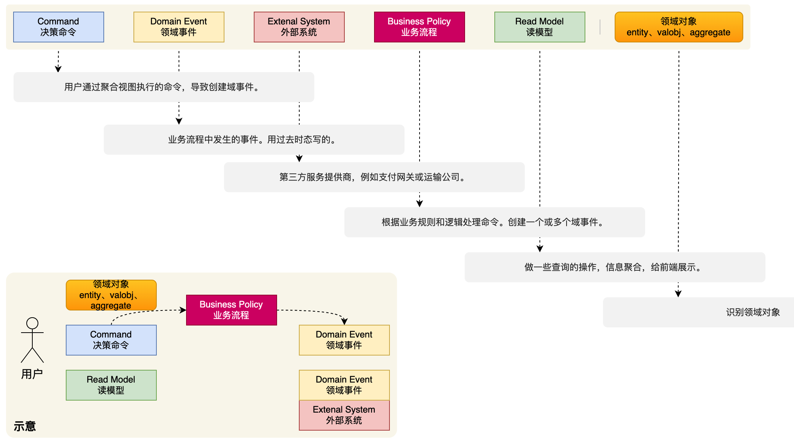

### 业务案例

#### 产品诉求
如图，是一个复杂的营销抽奖场景玩法需求，涵盖了；`活动配置`、`签到&奖励`、`活动账户`、`抽奖策略「责任链+规则树」`、`库存扣减`、`抽奖满N次后阶梯抽奖`等。面对这样的复杂系统，非常适合使用 DDD 落地。
分析需求；
1. 整体概率相加，总和为1或者分值计算，概率范围千分位
2. 抽奖为免费抽奖次数 + 用户消耗个人积分抽奖
3. 抽奖活动可给用户分配可抽奖次数，通过点击签到发放
4. 活动延伸配置用户库存消耗管理，单独提供表配置各类库存 用户可用总库存、用户可用日库存
5. 部分抽奖规则，需要抽奖n次后解锁，才能有机会抽取
6. 抽奖完成增加（运气值/积分值/抽奖次数）记录，让用户获得奖品。
7. 奖品对接，自身的积分、内部系统的奖品
8. 随机积分，发给你积分。
9. 黑名单用户抽奖，则给予固定的奖品。
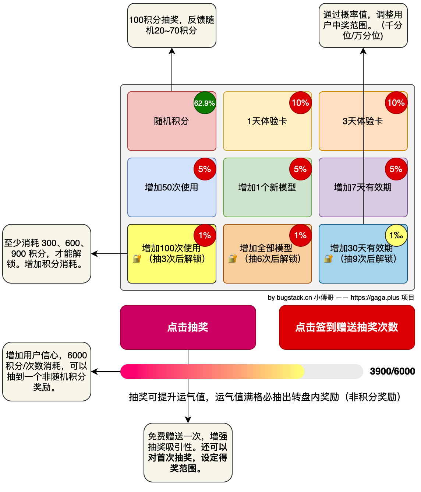

#### 2. 用例图
- 用例图（英语：use case diagram）是用户与系统交互的最简表示形式，展现了用户和与他相关的用例之间的关系。通过用例图，人们可以获知系统不同种类的用户和用例。用例图也经常和其他图表配合使用。
- 用例图，也可以等同于是用户故事（英语：User story）（软件开发和项目管理中的常用术语），主旨是以日常语言或商务用语撰写句子，是一段简单的功能表述。以客户或使用者的观点撰写下有价值的功能、引导、框架来与使用者进行互动，进而推动工作进程。可以被认为是一种规格文件，但更精确而言，它代表客户的需求与方向。以该用户故事来反应对象在组织内的其工作职责、范围、需要进行的任务等。用户故事在敏捷开发方法中用来定义系统需要提供的功能和实现需求管理。
- 尽管用例本身会涉及大量细节和各种可能性，用例图却能提纲挈领地让人了解系统概况。它为“系统做什么”提供了简化了的图形表示，因此被誉为“搭建系统的蓝图”。
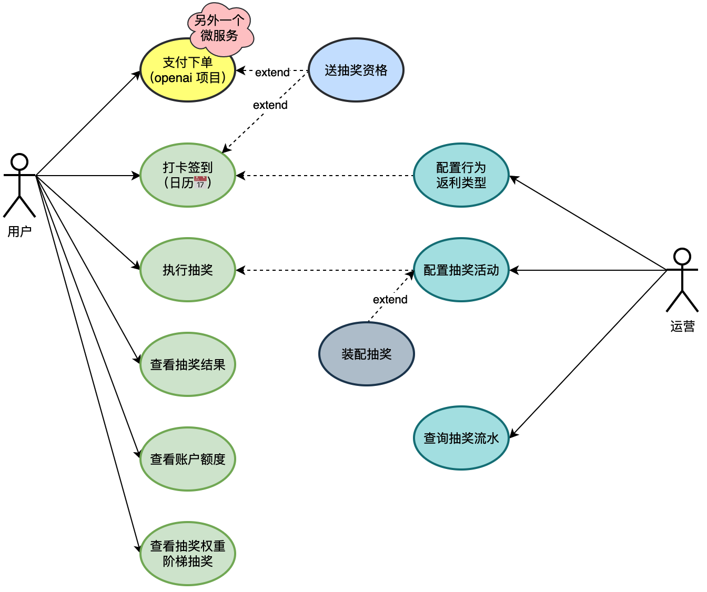
#### 3. 寻找领域事件
- 根据产品 PRD 文档，一起开会梳理有哪些领域事件。其实大多数领域事件一个人都可以想到，只是有些部分小的场景和将来可能产生的事件不一定覆盖全。所以要通过产品、测试、以及团队的架构师，一起讨论。
- 像是整个大营销的抽奖会包括如图所列举的事件。在列举这个阶段，你用在乎格式。也可以是每个人准备好黄色便签纸，想到一个就贴到黑板上一个，只是穷举完成。—— 实际做DDD中，也是这样用便签纸贴黑板，所以用不同的颜色做区分
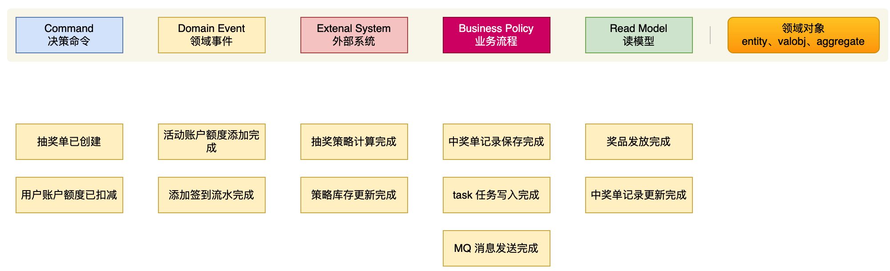

#### 4. 识别领域角色和对象
在确定了领域事件以后，接下来要做的就是通过决策命令串联领域事件，并填充上所需要的领域对象。这块的操作，新手可以分开处理，如先给领域事件添加决策命令、执行用户和领域对象，最后再串联流程。就像 `事件风暴定义` 中的示意一样。
- 首先，通过用户的行为动作，也就是**决策命令**，串联到对应的**领域事件**上。并对复杂的流程提供出红色的**业务流程**。
- 之后，为**决策命令**添加**领域对象**，每一个领域在整个流程中都起到了至关重要的作用。

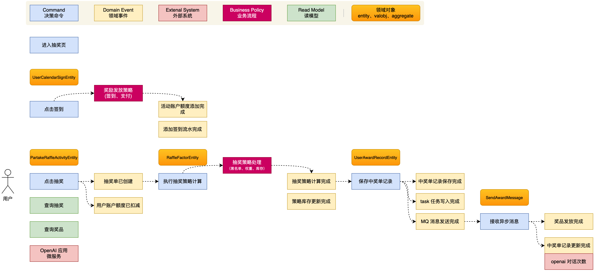

#### 5. 划分领域边界
有了识别出来的领域角色的流程，就可以非常容易的划分出领域边界了。先在事件风暴图上圈出领域边界，之后在单独提供领域划分。

##### 5.1 圈出领域
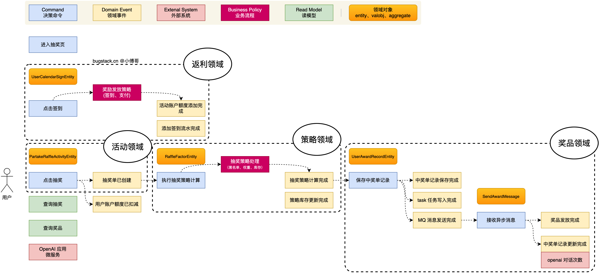

##### 5.2 领域边界
到这步咱们就可以获得整个项目中 DDD 的领域边界划分了。之后再往下就是具体的每个领域对象的详细设计和流程设计
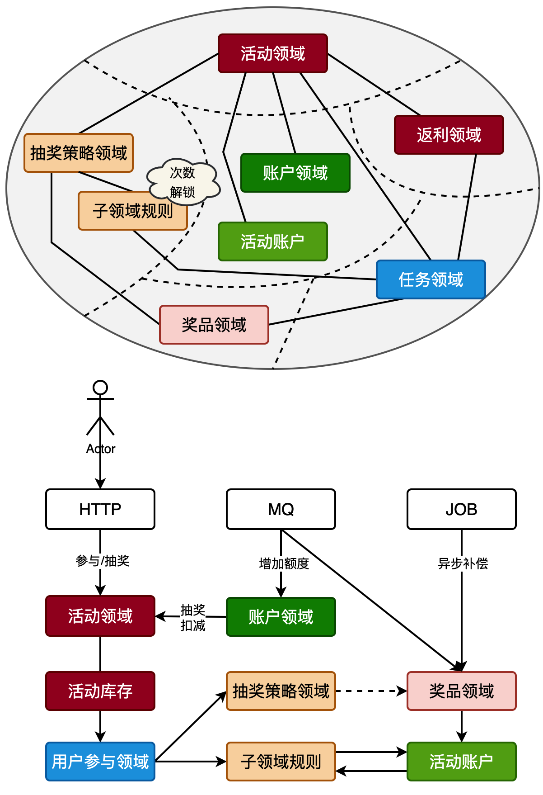

## 工程模型

### 工程结构
#### 1. 整洁架构
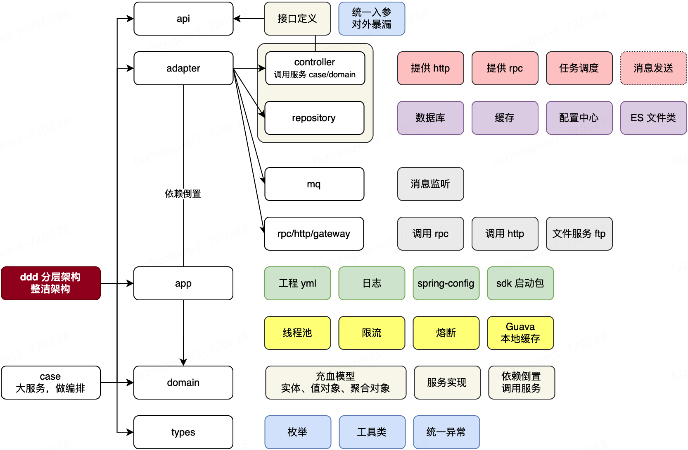

#### 2. 六边形架构
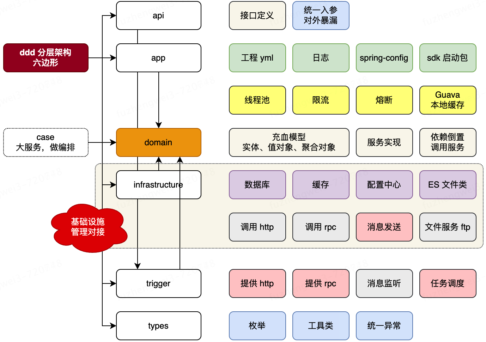

### 领域模型设计

#### 1. 分包方式

- 方式1；DDD 领域科目类型分包，类型之下写每个业务逻辑。
- 方式2；业务领域分包，每个业务领域之下有自己所需的 DDD 领域科目。

比如，你现在一个工程下有用户、积分、抽奖、支付，（紧凑的聚合类微服务有时候更易于维护），那么这些包一种是分为独立的业务包方式2这种，另外一种就是大家都在一个坛子里吃饭，要啥去各个地方找。所以你更倾向于那种呢？
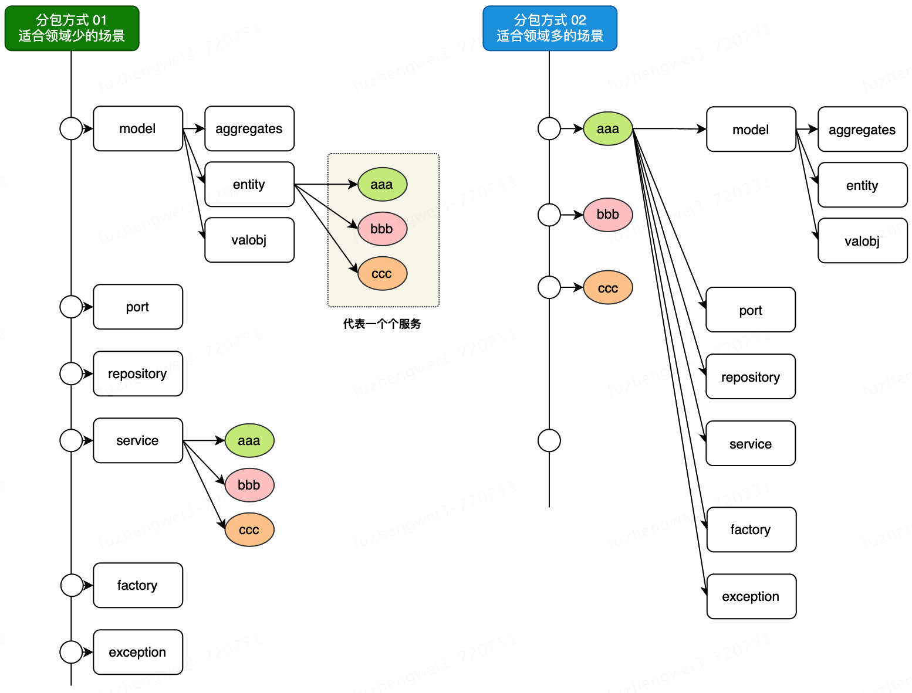

#### 2. 领域模型
DDD 领域驱动设计的中心，主要在于领域模型的设计，以领域所需驱动功能实现和数据建模。一个领域服务下面会有多个领域模型，每个领域模型都是一个充血结构。**一个领域模型 = 一个充血结构**
- **model** 模型对象；
    - **aggreate**：聚合对象，实体对象、值对象的协同组织，就是聚合对象。
    - **entity**：实体对象，大多数情况下，**实体对象(Entity)与数据库持久化对象(PO)是1v1的关系**，但也有为了封装一些属性信息，会出现1vn的关系。
    - **valobj**：值对象，通过对象属性值来识别的对象 By 《实现领域驱动设计》
- **repository** 仓储服务；从数据库等数据源中获取数据，传递的对象可以是聚合对象、实体对象，返回的结果可以是；实体对象、值对象。因为仓储服务是由基础层(infrastructure) 引用领域层(domain)，是一种依赖倒置的结构，但它可以天然的隔离PO数据库持久化对象被引用。
- **service** 服务设计；这里要注意，不要以为定义了聚合对象，就把超越1个对象以外的逻辑，都封装到聚合中，这会让你的代码后期越来越难维护。聚合更应该注重的是和本对象相关的单一简单封装场景，而把一些重核心业务方到 service 里实现。**此外；如果你的设计模式应用不佳，那么无论是领域驱动设计、测试驱动设计还是换了三层和四层架构，你的工程质量依然会非常差。**
- 对象解释
    - DTO 数据传输对象 (data transfer object)，DAO与业务对象或数据访问对象的区别是：DTO的数据的变异子与访问子（mutator和accessor）、语法分析（parser）、序列化（serializer）时不会有任何存储、获取、序列化和反序列化的异常。即DTO是简单对象，不含任何业务逻辑，但可包含序列化和反序列化以用于传输数据。
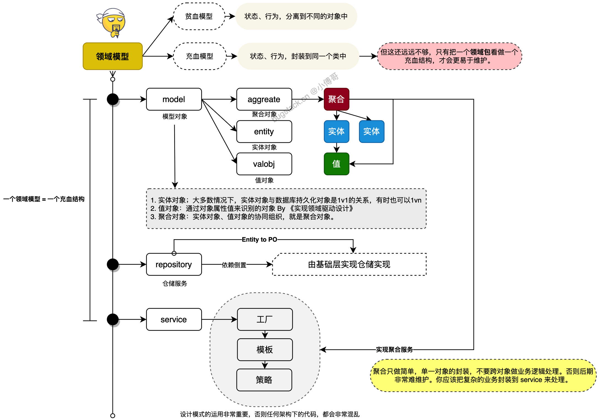

### 分层调用链路
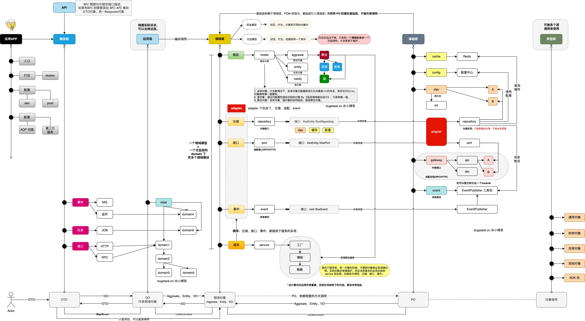

从APP层、触发器层、应用层，这三块主要对领域层的上下文逻辑封装、触发式(MQ、HTTP、JOB)使用，并最终在应用层中打包发布上线。这一部分的都是使用的处理，所以也不会有太复杂的操作。

当进入领域层开始，也是智力集中体现的开始了。所有你对工程的抽象能力，都在这一块区域体现。

**关于对象定义**；vo、po、dto、entity、aggregate、req、res、response

以下描述使用场景为，在 DDD 领域驱动架构下（六边形、整洁、COLA）

domain 领域层；

- **entity**，实体对象，如雇员用户的基本信息、订单信息、配送信息
- **vo**（value object），值对象，用于描述实体对象信息。如一个人，这个雇员用户的基本 level 枚举值对象、这个人居住地址四级信息对象。这些对象不具有唯一性，也就是不具有生命特征。就像你，之后你的衣服，你的胡子。
- **aggregate**，聚合对象，当我们要写一笔订单入口的时候，需要做事务，事务如果需要一组对象；订单记录、账户记录、库存记录等，这些实体对象+值对象，写入到聚合对象内，一起提交过去。

- 以前的 MVC 下的 XXXVo、XxxReq、XxxRes，现在被领域细分成各个模块下的，实体、聚合、值对象了。*

infrastructure 基础设施层；

- **po** 数据库持久化对象，用于映射数据库表字段的。这个对象不要做业务流程，只提供数据库数据
- **dto** 数据传输对象，这个对象也会在基础设施层出现，用于与外部的接口对接。比如 rpc 接口、http 接口，出入参的对象，都叫做数据传输对象。命名为 XxxRequestDTO、XxxResponseDTO 支付包的sdk包里就是这样命名的。

api 层：

- **dto** 对象，接口的出入参，数据传输对象。命名为 XxxRequestDTO、XxxResponseDTO
- **response**\<?> 对象，包装结果对象，提供 code、info、data，准确描述错误码以及data数据，data数据是泛型，用于包装 XxxResponseDTO 结果。当你f12浏览器，一些互联网的web服务，观察他的接口，就会看到这样的结构。

case 编排层：

- 这一层承接 web 的接口编排动作，串联 domain 领域流程。通常2个方案，一个是引入 api 层，定义的对象。另外一个就是多一层转换，在一层定义 api 层对应的 XxxRequestDTO -> XxxRequest、XxxResponseDTO -> XxxResponse

