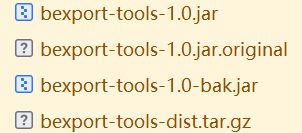
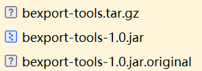
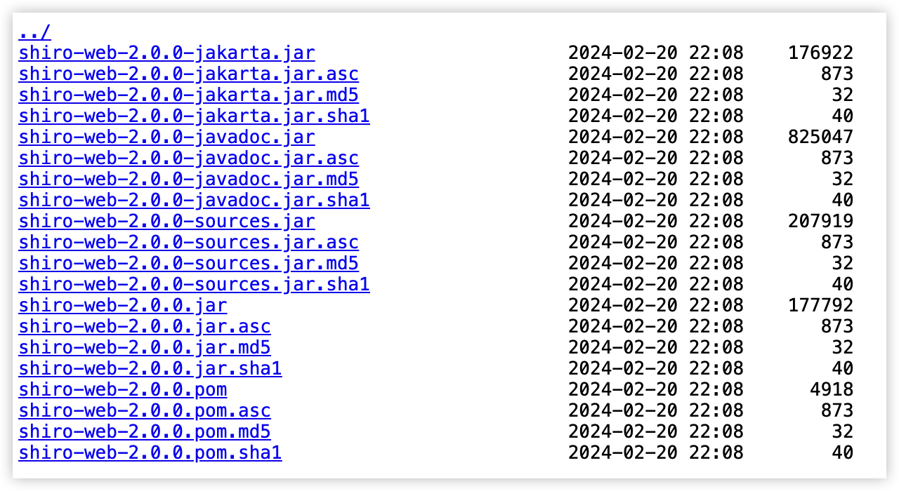
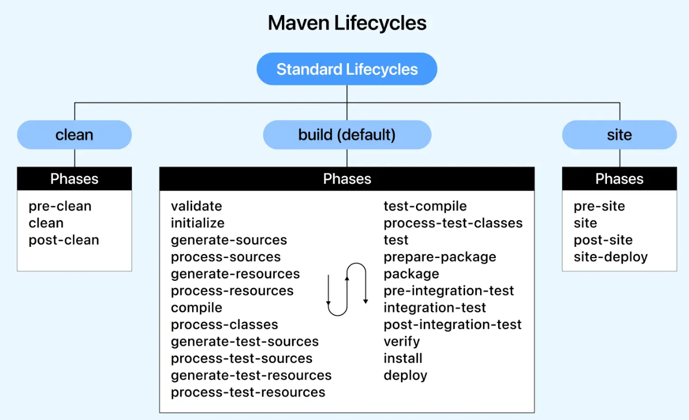
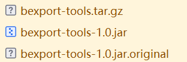

# 一、Classifier

## 1.1 Classifier属性的作用





用于区分同一artifact的不同版本或变种。

在Maven的坐标系中，一个artifact通常由groupid、artifactid和version三个基本元素确定。

然而，在某些情况下，我们可能需要为同一个artifact创建多个不同的版本或变种，比如源代码包、文档包或特定平台的二进制包等。这时，Classifier属性就派上了用场。

通过为artifact添加Classifier属性，我们可以为同一个artifact创建多个不同的附件（attachment）。这些附件可以是源代码、测试代码、文档、特定平台的二进制文件等。每个插件都有一个唯一的Classifier值，用于区分它们。这样，我们就可以在Maven仓库中存储和管理这些不同的artifact变种，并在构建过程中根据需要引用它们。

## 1.2 在依赖中引用Classifier

```java
<dependencies>  
    <dependency>  
        <groupId>com.example</groupId>  
        <artifactId>my-artifact</artifactId>  
        <version>1.0.0</version>  
        <classifier>sources</classifier>  
        <type>jar</type>  
        <scope>compile</scope>  
    </dependency>  
</dependencies>
```




如上图，如果要引用shiro-web-2.0.0-jakarta.jar

```java
<dependency>
    <groupId>org.apache.shiro</groupId>
    <artifactId>shiro-web</artifactId>
    <version>2.0.0</version>
    <classifier>jakarta</classifier>
</dependency>
```


## 1.3 自定义Classifier属性

如果我们要在自己的Maven项目中定义Classifier，那么我们需要在pom.xml文件中进行相应的配置。具体来说，我们需要在build标签下添加maven-jar-plugin插件，并为其配置classifier属性。例如，创建一个包含源代码的artifact变种，如下：

```java
<build>  
    <plugins>  
        <plugin>  
            <groupId>org.apache.maven.plugins</groupId>  
            <artifactId>maven-jar-plugin</artifactId>  
            <version>3.2.0</version>  
            <executions>  
                <execution>  
                    <goals>  
                        <goal>jar</goal>  
                    </goals>  
                </execution>  
                <execution>  
                    <id>attach-sources</id>  
                    <goals>  
                        <goal>jar</goal>  
                    </goals>  
                    <configuration>  
                        <classifier>sources</classifier>  
                    </configuration>  
                </execution>  
            </executions>  
        </plugin>  
    </plugins>  
</build>
```

在上面的示例中，我们为maven-jar-plugin插件添加了一个名为attach-sources的执行，并为其配置了classifier属性为sources。这表示我们将船创建一个包含源代码的artifact变种，其Classifier值为sources


# 二、 manifest

清单文件


# 三、Maven插件

Maven插件是扩展Maven功能的可执行组件，每个插件包含一个或多个目标（goals），用于执行特定任务（如编译、测试、打包等）。

## 3.1 插件与生命周期的关系

- 生命周期（Lifecycle）：定义构建阶段（phase）的顺序
- 插件（Plugin）：提供具体实现（goal）来完成这些阶段的任务




我们以`compile`这个phase为例，如果执行：

```plain
$ mvn compile
```


Maven将执行`compile`这个phase，这个phase会调用`compiler`插件执行关联的`compiler:compile`这个goal。

实际上，执行每个phase，都是通过某个插件（plugin）来执行的，Maven本身其实并不知道如何执行`compile`，它只是负责找到对应的`compiler`插件，然后执行默认的`compiler:compile`这个goal来完成编译。

Maven已经内置了一些常用的标准插件：

| 插件名称 | 对应执行的phase |
| -------- | --------------- |
| clean    | clean           |
| compiler | compile         |
| surefire | test            |
| jar      | package         |




## 3.2 maven-jar-plugin


### 3.2.1 使用方式

```java
<plugin>
	<groupId>org.apache.maven.plugins</groupId>
	<artifactId>maven-jar-plugin</artifactId>
	<version>2.4</version>
</plugin>
```

完整版：

```
<plugin>
    <groupId>org.apache.maven.plugins</groupId>
    <artifactId>maven-jar-plugin</artifactId>
    <executions>
        <execution>
            <phase>package</phase>
            <goals>
                <goal>jar</goal>
            </goals>
        </execution>
    </executions>
    <configuration>
        <excludes>
            <!--注意这玩意从编译结果目录开始算目录结构-->
            <!-- 排除文件 -->
            <exclude>*.xml</exclude>
            <exclude>*.yml</exclude>
            <exclude>*.json</exclude>
            <exclude>*.properties</exclude>
            <exclude>*.ttf</exclude>
        </excludes>
        <archive>
            <index>true</index>
            <manifest>
                <mainClass>fully.qualified.MainClass</mainClass>
                <addDefaultSpecificationEntries>true</addDefaultSpecificationEntries>
            </manifest>
            <manifestEntries>
                <url>${project.url}</url>
                <build-time>${maven.build.timestamp}</build-time>
                <build-Hostname>${env.COMPUTERNAME}</build-Hostname>
                <build-ip>${host.address}</build-ip>
            </manifestEntries>
        </archive>
    </configuration>
</plugin>
```

### 3.2.2 常用配置详解（\<configuration\>）

#### 1.classesDirectory

表示class文件的目录，默认值是：${project.build.outputDirectory}也就是target目录下的class目录


#### 2.outputDirectory

表示jar文件的输出目录，默认值是：${project.build.directory}，就是target目录，生成的jar文件就输出到这里。


#### 3. excludes

表示jar文件打包时，需要排除哪些文件


#### 4. includes

与excludes相反


#### 5. archive

这个属性配置很多，主要是用于定制化我们的jar包结构以及对Manifest文件的定制化。下面是举例：

- 添加**implementation**和**Specification**属性

  默认情况下，Manifest文件结构如下：

  ```java
  Manifest-Version: 1.0
  Created-By: Apache Maven ${maven.version}
  Build-Jdk: ${java.version}
  ```

  我们可配置下面属性：
  
  ```java
  <plugin>
    <groupId>org.apache.maven.plugins</groupId>
    <artifactId>maven-jar-plugin</artifactId>
    <version>2.4</version>
    <configuration>
      <archive>
        <manifest>
          <addDefaultImplementationEntries>true</addDefaultImplementationEntries>
          <addDefaultSpecificationEntries>true</addDefaultSpecificationEntries>
        </manifest>
      </archive>
    </configuration>
  </plugin>
  
  ```
  
  这样生成的Manifest如下：
  
  ```java
  Manifest-Version: 1.0
  Created-By: Apache Maven ${maven.version}
  Build-Jdk: ${java.version}
  Specification-Title: ${project.name}
  Specification-Version: ${project.artifact.selectedVersion.majorVersion}.${project.artifact.selectedVersion.minorVersion}
  Specification-Vendor: ${project.organization.name}
  Implementation-Title: ${project.name}
  Implementation-Version: ${project.version}
  Implementation-Vendor: ${project.organization.name}
  ```

- 添加**manifestEntries**

  这个属性可以添加以下项目信息到jar文件中。常用配置如下：

  ```java
  <configuration>
    <archive>
      <manifestEntries>
        <mode>prod</mode>
        <url>${project.url}</url>
      </manifestEntries>
    </archive>
  </configuration>
  ```

  生成的Manifest如下：

  ```java
  Manifest-Version: 1.0
  Created-By: Apache Maven ${maven.version}
  Build-Jdk: ${java.version}
  mode: prod
  url: http://project.url.com
  ```

- 添加键值对属性**Manifest Sections**

  这个功能可以添加多个键值属性，配置如下：

  ```java
  <archive>
      <manifestSections>
          <manifestSection>
              <name>value1</name>
              <manifestEntries>
                  <id>key1</id>
              </manifestEntries>
          </manifestSection>
          <manifestSection>
              <name>value2</name>
              <manifestEntries>
                  <id>key2</id>
              </manifestEntries>
          </manifestSection>
      </manifestSections>
  </archive>
  ```

  结果如下：

  ```java
  Manifest-Version: 1.0
  Created-By: Apache Maven ${maven.version}
  Build-Jdk: ${java.version}
   
  Name: value1
  id: key1
   
  Name: value2
  id: key2
  ```

- 自定义manifest配置

  可以根据下面的配置来定制化manifest文件的加载机制：

- 设置一个可执行的jar文件

  我们可以发布一个可执行的jar文件，就是可以通过命令行来启动一个jar。也可以把一个jar文件当作依赖库，提供给其他项目来使用。如果要发布一个可执行的jar，配置如下：
  ```java
  <configuration>
    <archive>
      <manifest>
        <mainClass>com.test.Main</mainClass> //运行jar包时，主类启动
      </manifest>
    </archive>
  </configuration>
  ```

  > 这里com.test.Main必须有一个main方法

- 精确设置Classpath
  就是将所有的jar文件全部枚举出来，配置如下：

  ```xml
  <project>
    <build>
      <plugins>
        <plugin>
          <groupId>org.apache.maven.plugins</groupId>
          <artifactId>maven-jar-plugin</artifactId>
          <configuration>
            <archive>
              <manifest>
                <addClasspath>true</addClasspath>
              </manifest>
            </archive>
          </configuration>
        </plugin>
      </plugins>
    </build>
    <dependencies>
      <dependency>
        <groupId>commons-lang</groupId>
        <artifactId>commons-lang</artifactId>
        <version>2.1</version>
      </dependency>
      <dependency>
          <groupId>commons-io</groupId>
          <artifactId>commons-io</artifactId>
          <version>2.11.0</version>
      </dependency>
    </dependencies>
  </project>
  ```

  依赖默认是jar包, 用以下形式可指定为pom等形式
  
  ```
  <dependency>
      <groupId>org.codehaus.mojo</groupId>
      <artifactId>versions-maven-plugin</artifactId>
      <version>${versions-maven-plugin.version}</version>
      <type>pom</type>
  </dependency>
  ```
  
  manifest生成结果如下：
  
  ```bash
  Manifest-Version: 1.0
  Created-By: Apache Maven ${maven.version}
  Build-Jdk: ${java.version}
  Class-Path: commons-io-2.11.0.jar commons-lang-2.1.jar
  ```
  
  > 注意这样运行这个jar文件时, 需要保证Class-Path的依赖jar在目录中保持平级
  
- 根据目录设置classpath

  需要用到属性classpathPrefix

  ```xml
  <configuration>
    <archive>
      <manifest>
        <addClasspath>true</addClasspath>
        <classpathPrefix>lib/</classpathPrefix>
      </manifest>
    </archive>
  </configuration>
  ```

  Manifest生成结果如下:

  ```bash
  Class-Path: lib/commons-io-2.11.0.jar lib/commons-lang-2.1.jar
  ```

  > 注意这样运行这个jar文件时，需要保证lib目录和执行jar保持平级。例如:
  >
  > project-root/
  > ├── your-app.jar      # 可执行 JAR
  > └── lib/              # 存放所有依赖的 JAR
  >     ├── commons-io-2.11.0.jar
  >     └── commons-lang-2.1.jar

- 配置classpath的加载样式

  加载样式意思是可以通过特定的配置来配置classpath的路径, 配置属性是: `classpathLayoutType`

  >自定义加载样式classpathLayoutType=custom

  配置如下:

  ```xml
  <configuration>
    <archive>
      <manifest>
        <addClasspath>true</addClasspath>
        <classpathLayoutType>custom</classpathLayoutType>
        <customClasspathLayout>lib/$${artifact.groupIdPath}/$${artifact.artifactId}-$${artifact.version}$${dashClassifier?}.$${artifact.extension}</customClasspathLayout>
      </manifest>
    </archive>
  </configuration>
  ```

  插入如下:

  ```bash
  Class-Path: lib/commons-io/commons-io-2.11.0.jar lib/commons-lang/commons-lang-2.1.jar
  ```

  设置maven风格的加载样式,如果目标机器上有maven库,我们可以这样设置:

  ```xml
  <configuration>
    <archive>
      <manifest>
        <addClasspath>true</addClasspath>
          //生成前缀:Maven仓库的地址(${user.home}/.m2/repository/)
        <classpathPrefix>${user.home}/.m2/repository</classpathPrefix>
          //根据本地Maven仓库的目录结构生成对应的依赖路径(commons-io/commons-io-2.11.0.jar)
        <classpathLayoutType>repository</classpathLayoutType> 
      </manifest>
    </archive>
  </configuration>
  ```

  ```bash
  Class-Path: ${user.home}/.m2/repository/commons-io/commons-io-2.11.0.jar ${user.home}/.m2/repository/commons-lang/commons-lang/2.1/commons-lang-2.1.jar
  ```

  > ${user.home} 会替换成你电脑上的绝对路径

- 强制使用SNAPSHOT版本的依赖

  默认情况SNAPSHOT版本的库文件是不会被加载的, 这里可以使用`useUniqueVersions`来启用:

  ```xml
  <configuration>
    <archive>
      <manifest>
        <useUniqueVersions>false</useUniqueVersions>
      </manifest>
    </archive>
  </configuration>
  ```

- 加载外部的manifest文件

  我们也可以将manifest编写好, 然后直接使用我们自己编写的文件, 配置如下:

  ```xml
  <configuration>
    <archive>
      <manifestFile>src/main/resources/META-INF/MANIFEST.MF</manifestFile>
    </archive>
  </configuration>
  ```

  这样就会直接加载我们自己编写的MANIFEST文件


# 四. scope

## 4.1 scope各种取值详解

| scope取值    | 有效范围（compile, runtime, test） | 依赖传递 | 例子        |
| :----------- | :--------------------------------- | :------- | :---------- |
| **compile**  | all                                | 是       | spring-core |
| **provided** | compile, test                      | **否**   | servlet-api |
| **runtime**  | runtime, test                      | 是       | JDBC驱动    |
| **test**     | test                               | **否**   | JUnit       |
| **system**   | compile, test                      | 是       |             |

正如上表所示，

**compile** ：为**默认的**依赖有效范围。如果在定义依赖关系的时候，没有明确指定依赖有效范围的话，则默认采用该依赖有效范围。

此种依赖，在编译、运行、测试时均有效。

**provided** ：在编译、测试时有效，但是在运行时无效。

provided意味着打包的时候可以不用包进去，别的设施(Web Container)会提供。

事实上该依赖理论上可以参与编译，测试，运行等周期。相当于compile，但是在打包阶段做了exclude的动作。

例如：servlet-api，运行项目时，容器已经提供，就不需要Maven重复地引入一遍了。

**runtime** ：在运行、测试时有效，但是在编译代码时无效。

说实话在终端的项目（非开源，企业内部系统）中，和compile区别不是很大。比较常见的如JSR×××的实现，对应的API jar是compile的，具体实现是runtime的，compile只需要知道接口就足够了。

例如：JDBC驱动实现，项目代码编译只需要JDK提供的JDBC接口，只有在测试或运行项目时才需要实现上述接口的具体JDBC驱动。

另外runntime的依赖通常和optional搭配使用，optional为true。我可以用A实现，也可以用B实现。

**test** ：只在测试时有效，包括测试代码的编译，执行。例如：JUnit。

PS: test表示只能在src下的test文件夹下面才可以使用，你如果在a项目中引入了这个依赖，在b项目引入了a项目作为依赖，在b项目中这个注解不会生效，因为scope为test时无法传递依赖。

**system** ：在编译、测试时有效，但是在**运行时无效**。

和provided的区别是，使用system范围的依赖时必须通过**systemPath元素显式地指定依赖文件的路径**。由于此类依赖**不是通过Maven仓库解析的，而且往往与本机系统绑定**，可能造成构建的不可移植，因此应该谨慎使用。

systemPath元素可以引用环境变量。例如：

```
          <dependency>
            <groupId>javax.sql</groupId>
            <artifactId>jdbc-stdext</artifactId>
            <version>2.0</version>
            <scope>system</scope>
            <systemPath>${java.home}/lib/rt.jar</systemPath>
        </dependency>
```


## 4.2 依赖传递

A–>B–>C。当前项目为A，A依赖于B，B依赖于C。知道B在A项目中的scope，那么怎么知道C在A中的scope呢？

答案是：

当C是test或者provided时，C直接被丢弃，A不依赖C； 否则A依赖C，C的scope继承于B的scope。


# 五. 构建流程

- lifecycle相当于Java的package，它包含一个或多个phase；
- phase相当于Java的class，它包含一个或多个goal；
- goal相当于class的method，它其实才是真正干活的。

| 执行的Phase | 对应执行的Goal                     |
| ----------- | ---------------------------------- |
| compile     | compiler:compile                   |
| test        | compiler:testCompile surefire:test |

Maven的生命周期由一系列阶段（phase）构成，以内置的生命周期`default`为例，它包含以下phase：

- validate
- initialize
- generate-sources
- process-sources
- generate-resources
- process-resources
- compile
- process-classes
- generate-test-sources
- process-test-sources
- generate-test-resources
- process-test-resources
- test-compile
- process-test-classes
- test
- prepare-package
- package
- pre-integration-test
- integration-test
- post-integration-test
- verify
- install
- deploy


