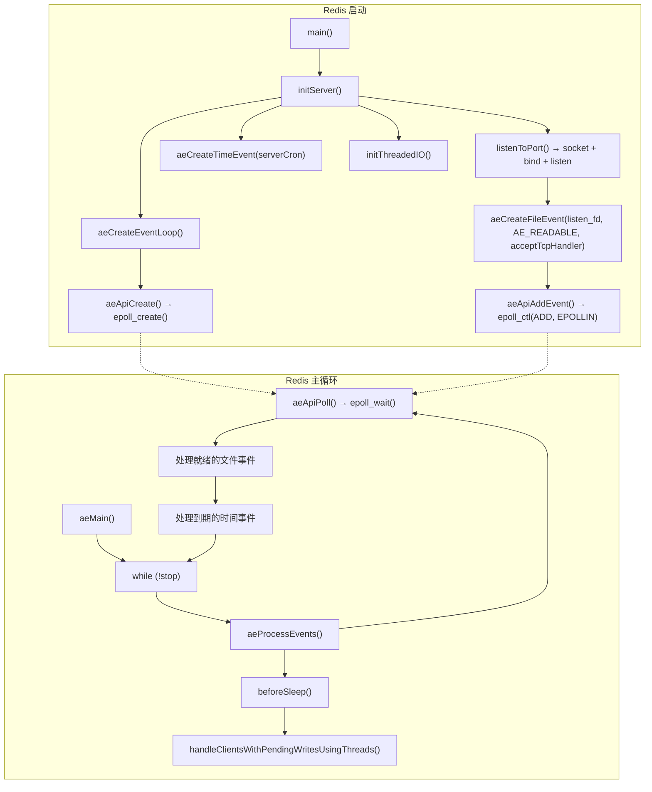

# 个人总结
### 混淆点：
- read()：tcp接收缓冲区有数据时把数据拷贝到用户态。
- write()：把用户态的数据拷贝到tcp发送缓冲区。
- AE_READABLE：接收缓冲区有数据了 → 通知你可以调 read() 了
- AE_WRITABLE：发送缓冲区有空间了 → 通知你可以调 write() 了

### redis数据类型：
- String：
	- int：如果字符串是纯整数。实现：指向实际对象的指针是8字节的，直接把整数放进去。
	- sds：embstr 嵌入式字符串（长度小于44字节） --> raw 原始字符串（长度大于44字节） 
- List：listpack+双向链表=quicklist
- Set：intset/listpack（小容量）--> dict（大容量）
- ZSet：listpack（小容量）--> skiplist+dict（大容量）
- Hash：listpack（小容量）--> dict（大容量）


### 持久化：RDB和AOF
#### 1. RDB (Redis DataBase) - 内存快照

- **底层机制：** 主线程调用 Linux `fork()` 系统调用创建子进程生成 `.rdb`（紧凑的二进制文件）。
    
- **核心考点（COW 写时复制）：** `fork` 瞬间并不复制几十 GB 的物理内存，只复制**页表（Page Table）**。主子进程共享物理内存，权限降级为只读。只有当主线程处理新写请求触发缺页中断（Page Fault）时，OS 才会为修改的数据分配新的物理页。
    
- **优缺点：**
    
    - _优：_ 二进制格式紧凑，直接 load 进内存，**恢复速度极快**。
        
    - _缺：_ 实时性差，两次快照之间宕机数据全丢。`fork` 操作在内存巨大或开启了 Linux 大页机制（THP）时，依然会阻塞单线程的主事件循环。
        

#### 2. AOF (Append Only File) - 命令日志

- **底层机制：** 记录每一次写命令。写入过程依赖 Linux 的 **VFS（虚拟文件系统）和 Page Cache**。
    
- **核心考点（刷盘策略与假死）：** 真正的实时性取决于 `appendfsync` 配置。生产默认 `everysec`（每秒由后台 BIO 线程调用 `fsync` 刷盘）。**注意陷阱**：如果宿主机磁盘 I/O 极差导致 `fsync` 阻塞超过 2 秒，主线程为了防止数据丢失会强行发起 `write` 产生 VFS inode 锁竞争，直接导致主线程（epoll 循环）假死。
    
- **AOF 重写：** 绕过旧文件，直接扫描当前内存状态生成最简命令。Redis 7.0 之前利用 AOF 重写缓冲区解决增量一致性；7.0 之后引入 Multi-Part AOF 彻底废弃了重写缓冲区，消除了双写的内存开销。
    
- **优缺点：**
    
    - _优：_ 实时性强，最多丢 1 秒数据。
        
    - _缺：_ 纯文本追加，文件膨胀快。故障恢复时需要重放大量命令，**恢复速度极慢**。
#### 3. 终极防御：混合持久化（面试绝杀话术）

不要孤立地评价这两个机制。在实际生产环境（Redis 4.0 之后），我们默认开启 **混合持久化 (`aof-use-rdb-preamble`)**。

- **回答话术：** “在 AOF 重写时，`fork` 出的子进程会先把当前内存数据以 **RDB 的二进制格式**写入新文件的头部，重写期间产生的新增命令则以 **AOF 文本格式**追加到尾部。这样在重启恢复时，既能享受 RDB 极快的加载速度，又能利用少量的 AOF 增量日志保证极高的数据完整性。”


#### 主从同步
**一、 建立连接与协商**

- 从库向主库发起 Socket 建连。
    
- 从库发送 `PING`、鉴权、同步端口，准备数据传输。
    

**二、 全量复制** (场景：从库初次启动，或断连太久增量失效)

1. **触发快照：** 主库收到全量同步请求，主线程触发 `bgsave`，`fork` 出子进程在后台生成 RDB 文件（利用 COW 机制）。
    
2. **专属缓冲：** 主库为从库单独开辟一个**复制缓冲区（Replication Buffer）**，记录从 RDB 生成开始，到从库加载完成期间的所有新写命令。
    
3. **传输 RDB：** 主库将 RDB 文件发送给从库。从库收到后，清空自身旧数据，将 RDB 加载进内存。
    
4. **发送增量：** 主库将复制缓冲区内的命令发送给从库执行，实现数据基线的完全对齐。
    

**三、 增量复制** (场景：网络短暂断开后重连)

- **环形队列：** 主库日常运行期间，会把所有写命令同时写入一个大小固定的**复制积压缓冲区（repl_backlog_buffer，环形队列）**。
    
- **断点续传：** 从库重连后，向主库发送自己记录的同步偏移量 `offset`。
    
- **主库裁决：** 主库根据 `offset` 去环形队列查找。
    
    - **命中：** 将 `offset` 之后的增量命令发送给从库执行。
        
    - **未命中（被覆盖）：** 说明断连太久，旧数据已被新数据覆盖，主库强制退化为**全量复制**。
        

**四、 命令传播 (常态)**

- 全量或增量完成后，主从维护 TCP 长连接。
    
- 主库将新的写命令持续异步发送给从库。
    
- 从库默认每秒发送 `ACK <offset>` 汇报同步进度，兼作网络心跳检查。

#### 哨兵模式
哨兵是一个基于分布式共识的高可用管理系统，核心职责分为四块：

1. **监控 (Monitoring)：**
    
    - 哨兵集群定期向 Master、Slave 以及其他 Sentinel 发送 PING 心跳，全方位监控整个网络拓扑的健康状态。
        
2. **自动故障转移 (Automatic Failover) - [最核心考点]：**
    
    - _主观下线 (SDOWN)：_ 单个哨兵发现 Master 心跳超时。
        
    - _客观下线 (ODOWN)：_ 超过 Quorum 配置数量的哨兵确认 Master 挂了。
        
    - _Leader 选举：_ 哨兵集群通过类似 Raft 算法选出一个 Leader 负责执行切换。
        
    - _新主登基：_ Leader 根据 `排除断线 -> 优先级 -> 复制偏移量 (数据最新) -> RunID` 的严格规则，将最优 Slave 提升为新 Master，并让其他 Slave 重新复制新 Master。
        
3. **配置提供者 (Configuration Provider)：**
    
    - 哨兵充当客户端的服务发现中心。客户端（Jedis/Redisson）直连哨兵获取当前 Master 地址，并通过订阅哨兵的 Pub/Sub 频道，实时感知主从切换并自动切换底层连接池。
        
4. **通知 (Notification)：**
    
    - 集群状态发生流转时，哨兵能通过 API 或执行预设脚本，向运维系统或管理员发送告警。


#### 集群（cluster）
- **数据分片 (Hash Slot)：** 集群预设了 16384 ($2^{14}$) 个哈希槽。
    
- **路由规则：** 对 Key 执行 `CRC16(key) mod 16384` 算出槽位号。槽位再与具体的 Master 节点绑定（例如主库 1 负责槽 0~5460）。
    
- **拓扑感知：** 客户端通过 `-MOVED` 和 `-ASK` 错误来进行路由重定向，并更新本地的槽位映射缓存。
    
- **实战痛点与解法 (跨节点事务)：**
    
    - _问题：_ 事务或 Lua 脚本操作的多个 Key 若被散列到不同主库，会直接报错。
        
    - _解法：_ 使用 **Hash Tags (哈希标签)**。在 Key 中加入 `{}`，例如 `{user123}:profile` 和 `{user123}:orders`。Redis 路由时**只会对 `{}` 内的字符串计算哈希**，从而强制这些相关的 Key 落入同一个槽位（同一个物理节点），完美保证原子操作。

### 面试问题
#### redis为什么快？
第一，它是一个纯**内存**数据库，从根本上避开了磁盘 I/O 的降级。 
第二，它在网络接入层使用了基于 **epoll 的 I/O 多路复用模型**，利用红黑树和就绪队列实现了对海量并发连接的高效事件分发。 
第三，它的核心数据操作采用了**单线程模型**，这不仅避免了多线程环境下的上下文切换开销，还彻底消除了锁竞争带来的性能损耗。 
第四，底层**数据结构**专门为高并发场景量身定制，比如 O(1) 长度查询的 SDS、渐进式 Rehash 的字典机制以及高效的跳表，保证了绝大多数命令的时间复杂度都维持在 O(1) 或 O(log N)。

#### 为什么redis是单线程？
- CPU不是redis的性能瓶颈，redis的指令操作大多是O(1)复杂度的，redis的瓶颈在网络IO上。
- 单线程可以避免多线程带来的上下文切换、锁的时间消耗
- 单线程可以避免并发操作导致的数据错误
# Redis 线程模型 & epoll 使用源码学习指南

本文档引导你学习 Redis 如何使用 epoll 构建其事件驱动的服务器模型，以及 Redis 6.0 多线程 I/O 的实现原理。配套源码文件已放在同目录下。

> [!NOTE]
> 本指南基于 **Redis 7.2** 源码。建议先阅读完 [epoll.md](file:///d:/workspace/linux/epoll/epoll.md) 再开始本文。

---

## 全局架构一览



---

## 第一阶段：事件循环抽象层 (ae)

> 📍 配套源码: [redis_ae_epoll.c](file:///d:/workspace/linux/epoll/redis_ae_epoll.c) + [redis_ae.c](file:///d:/workspace/linux/epoll/redis_ae.c)

### 1.1 为什么 Redis 要自己封装 epoll？

Redis 需要在 Linux/macOS/Solaris/BSD 上运行，不同系统有不同的 I/O 多路复用 API：

| 系统 | API | Redis 后端文件 |
|------|-----|---------------|
| Linux | epoll | `ae_epoll.c` |
| macOS/BSD | kqueue | `ae_kqueue.c` |
| Solaris | evport | `ae_evport.c` |
| 其他 | select | `ae_select.c` |

Redis 通过 `ae.c` 定义统一接口，然后用 **`#include "ae_epoll.c"`** 在编译时"内联"具体实现：

```c
// ae.c 中的平台选择
#ifdef HAVE_EVPORT
#include "ae_evport.c"
#elif defined(HAVE_EPOLL)
#include "ae_epoll.c"          // ← Linux 上走这里
#elif defined(HAVE_KQUEUE)
#include "ae_kqueue.c"
#else
#include "ae_select.c"
#endif
```

> [!TIP]
> 这里用 `#include ".c"` 而不是 `.h` + 链接。这使得 `ae_epoll.c` 中的 `static` 函数被直接编译进 `ae.c`，**避免了函数指针的间接调用开销**。这是一种编译期多态，比虚函数表更高效。

### 1.2 统一接口 → epoll 映射

| ae 统一接口 | epoll 实现 | 对应的 epoll 系统调用 |
|------------|-----------|---------------------|
| `aeApiCreate()` | 创建 epoll 实例 | `epoll_create(1024)` |
| `aeApiAddEvent()` | 注册/修改事件 | `epoll_ctl(ADD/MOD)` |
| `aeApiDelEvent()` | 删除事件 | `epoll_ctl(DEL/MOD)` |
| `aeApiPoll()` | 等待事件 | `epoll_wait()` |
| `aeApiResize()` | 调整大小 | `zrealloc(events)` |
| `aeApiFree()` | 释放资源 | `close(epfd)` |

### 1.3 核心数据结构

```
aeEventLoop (事件循环主结构)
  │
  ├── events[]        ── aeFileEvent 数组（以 fd 为索引）
  │                      每个元素: { mask, rfileProc, wfileProc, clientData }
  │
  ├── fired[]         ── aeFiredEvent 数组（epoll_wait 的结果）
  │                      每个元素: { fd, mask }
  │
  ├── timeEventHead   ── aeTimeEvent 链表（定时器）
  │                      每个元素: { id, when, timeProc }
  │
  ├── apidata         ── aeApiState* ← 指向 epoll 状态！
  │                      内含: { epfd, events[] }
  │
  ├── beforesleep     ── 每次 epoll_wait 前的回调
  └── aftersleep      ── 每次 epoll_wait 后的回调
```

> [!IMPORTANT]
> **与内核 epoll 的对比**：内核用**红黑树**管理所有被监听的 fd，但 Redis 用的是简单的**数组**（以 fd 为下标）。这是因为 Redis 在用户态已经知道 fd 的范围（maxclients + 128），用数组 O(1) 访问比红黑树 O(log N) 更快。

---

## 第二阶段：ae_epoll.c 逐函数解读

> 📍 配套源码: [redis_ae_epoll.c](file:///d:/workspace/linux/epoll/redis_ae_epoll.c)

### 2.1 `aeApiCreate()` — 创建 epoll

```c
static int aeApiCreate(aeEventLoop *eventLoop) {
    aeApiState *state = zmalloc(sizeof(aeApiState));
    state->events = zmalloc(sizeof(struct epoll_event) * eventLoop->setsize);
    state->epfd = epoll_create(1024);   // ← 你在 epoll.md 中学过的！
    anetCloexec(state->epfd);           // fork 时自动关闭
    eventLoop->apidata = state;
    return 0;
}
```

对比你之前学的内核 `epoll_create` 流程：
- 内核会分配 `struct eventpoll`（红黑树 + 就绪链表 + 等待队列）
- Redis 这边额外分配了 `events[]` 数组用于接收 `epoll_wait` 的结果

### 2.2 `aeApiAddEvent()` — ADD 还是 MOD？自动判断

```c
static int aeApiAddEvent(aeEventLoop *eventLoop, int fd, int mask) {
    // ⭐ 关键：自动判断用 ADD 还是 MOD
    int op = eventLoop->events[fd].mask == AE_NONE ?
            EPOLL_CTL_ADD : EPOLL_CTL_MOD;
    
    mask |= eventLoop->events[fd].mask;  // 合并新旧事件
    
    // 转换: AE_READABLE → EPOLLIN, AE_WRITABLE → EPOLLOUT
    if (mask & AE_READABLE) ee.events |= EPOLLIN;
    if (mask & AE_WRITABLE) ee.events |= EPOLLOUT;
    
    epoll_ctl(state->epfd, op, fd, &ee);
}
```

> [!NOTE]
> Redis **不使用 EPOLLET（边缘触发）**，使用的是默认的**水平触发 (LT)**。这与 Nginx 不同（Nginx 使用 ET）。原因：Redis 的单线程模型下，LT 更简单且不会丢事件。

### 2.3 `aeApiPoll()` — 事件循环的阻塞点

```c
static int aeApiPoll(aeEventLoop *eventLoop, struct timeval *tvp) {
    // ⭐ 整个 Redis 主线程在这里阻塞等待！
    retval = epoll_wait(state->epfd, state->events,
                        eventLoop->setsize,
                        tvp ? (tvp->tv_sec*1000 + ...) : -1);
    
    // 将 epoll 的事件格式转换为 Redis 的事件格式
    for (j = 0; j < numevents; j++) {
        if (e->events & EPOLLIN)  mask |= AE_READABLE;
        if (e->events & EPOLLOUT) mask |= AE_WRITABLE;
        if (e->events & EPOLLERR) mask |= AE_WRITABLE | AE_READABLE; // ⭐
        if (e->events & EPOLLHUP) mask |= AE_WRITABLE | AE_READABLE; // ⭐
        
        eventLoop->fired[j].fd = e->data.fd;
        eventLoop->fired[j].mask = mask;
    }
}
```

> [!IMPORTANT]
> **EPOLLERR 和 EPOLLHUP 的处理**：当 socket 出错或对端关闭时，Redis 将其同时标记为可读可写。这确保了读回调（`readQueryFromClient`）能检测到连接关闭，写回调（`sendReplyToClient`）能检测到写入失败。

---

## 第三阶段：一个请求的完整生命周期

> 📍 配套源码: [redis_networking.c](file:///d:/workspace/linux/epoll/redis_networking.c) + [redis_server.c](file:///d:/workspace/linux/epoll/redis_server.c)

以一个客户端执行 `SET mykey myvalue` 命令为例：

```mermaid
sequenceDiagram
    participant Client as 客户端
    participant Kernel as Linux 内核 (epoll)
    participant Main as Redis 主线程
    participant IO as I/O 线程池

    Note over Main: initServer() 已注册 listen_fd → EPOLLIN
    
    rect rgb(40, 40, 80)
    Note over Client,Main: 阶段 1: 建立连接
    Client->>Kernel: connect()
    Kernel->>Main: epoll_wait 返回: listen_fd 可读
    Main->>Main: acceptTcpHandler() → accept()
    Main->>Main: createClient() → 设置非阻塞
    Main->>Kernel: epoll_ctl(ADD, client_fd, EPOLLIN)
    Note over Main: 注册回调: readQueryFromClient
    end

    rect rgb(40, 80, 40)
    Note over Client,IO: 阶段 2: 读取请求
    Client->>Kernel: send("*3\r\n$3\r\nSET\r\n...")
    Kernel->>Main: epoll_wait 返回: client_fd 可读
    Main->>Main: readQueryFromClient() 被调用
    alt 单线程模式
        Main->>Main: read() + 解析 RESP 协议
    else 多线程 I/O
        Main->>IO: 分发到 I/O 线程
        IO->>IO: read() + 解析 RESP 协议
        IO->>Main: 完成通知
    end
    end

    rect rgb(80, 40, 40)
    Note over Main: 阶段 3: 执行命令 (始终单线程!)
    Main->>Main: processCommand()
    Main->>Main: setCommand() → dictAdd(db->dict, "mykey", "myvalue")
    Main->>Main: addReply(c, "+OK\r\n")
    Main->>Main: 标记 CLIENT_PENDING_WRITE
    end

    rect rgb(80, 80, 40)
    Note over Client,IO: 阶段 4: 发送响应
    Note over Main: beforeSleep() 被调用
    alt 单线程模式
        Main->>Main: handleClientsWithPendingWrites()
        Main->>Client: write("+OK\r\n") 直接写
    else 多线程 I/O
        Main->>IO: 分发待写客户端
        IO->>Client: 各线程并行 write()
        IO->>Main: 完成通知
    end
    Note over Main: 如果没写完 → epoll_ctl(ADD, EPOLLOUT)
    end
```



### 3.1 连接建立

```
initServer()
  └─ aeCreateFileEvent(listen_fd, AE_READABLE, acceptTcpHandler)
       └─ aeApiAddEvent() → epoll_ctl(epfd, EPOLL_CTL_ADD, listen_fd, {EPOLLIN})

客户端 connect() →
  → 内核 TCP 三次握手完成
  → listen socket 等待队列唤醒
  → epoll_wait() 返回 listen_fd 可读
  → acceptTcpHandler() 被调用
    ├─ accept() 获取 client_fd
    ├─ 设置非阻塞、TCP_NODELAY、keepalive
    └─ aeCreateFileEvent(client_fd, AE_READABLE, readQueryFromClient)
         └─ epoll_ctl(epfd, EPOLL_CTL_ADD, client_fd, {EPOLLIN})
```

### 3.2 响应发送的优化（beforesleep 直接写）

这是 Redis 6.0+ 的重要优化：

```
旧方式 (Redis 5.x):
  addReply() → epoll_ctl(ADD, EPOLLOUT) → epoll_wait → write()
  问题: 每个响应都需要 2 次系统调用 (epoll_ctl + epoll_wait)

新方式 (Redis 6.0+):
  addReply() → 加入 clients_pending_write 链表
  beforeSleep() → 直接 write()     ← 大部分响应在这里就写完了！
  只有写不完时 → epoll_ctl(ADD, EPOLLOUT) → epoll_wait → write()
```

> [!TIP]
> 大多数 Redis 响应（如 `+OK`、`$5\r\nhello`）都很小，一次 `write()` 就能完成。这个优化**避免了绝大部分 `epoll_ctl` 系统调用**，显著提升性能。

---

## 第四阶段：事件循环主逻辑

> 📍 配套源码: [redis_ae.c](file:///d:/workspace/linux/epoll/redis_ae.c) `aeProcessEvents()`

```
aeMain()                          ← Redis 的一生就是这个 while 循环
  └─ while (!stop) {
       aeProcessEvents()          ← 每次迭代处理所有事件
         │
         ├─ Step 1: 计算 epoll_wait 的超时时间
         │   找到最近的 aeTimeEvent（如 serverCron 100ms 后到期）
         │   → 超时值 = min(最近定时事件时间, 当前时间差)
         │
         ├─ Step 2: beforesleep(eventLoop)
         │   ├─ handleClientsWithPendingWritesUsingThreads()  ← 多线程写
         │   ├─ handleClientsWithPendingReadsUsingThreads()   ← 多线程读
         │   ├─ flushAppendOnlyFile()                        ← AOF 写入
         │   └─ handleClientsBlockedOnKeys()                 ← 解除阻塞客户端
         │
         ├─ Step 3: aeApiPoll() = epoll_wait() ← 阻塞等待！
         │
         ├─ Step 4: aftersleep(eventLoop)
         │
         ├─ Step 5: 遍历 fired[] 处理文件事件
         │   for (j = 0; j < numevents; j++) {
         │     fd = fired[j].fd
         │     mask = fired[j].mask
         │     if (可读) → rfileProc(fd)  // 如 acceptTcpHandler 或 readQueryFromClient
         │     if (可写) → wfileProc(fd)  // 如 sendReplyToClient
         │   }
         │
         └─ Step 6: processTimeEvents()
             遍历 timeEvent 链表
             if (te->when <= now) → te->timeProc()  // 如 serverCron
     }
```

### AE_BARRIER 标志

正常情况下，同一个 fd 同时可读可写时，Redis 先执行读回调再执行写回调。但有时需要反转顺序：

```c
// 场景: AOF always fsync 模式
// 1. beforeSleep 中 write() 把回复写给客户端
// 2. beforeSleep 中 fsync() 确保 AOF 落盘
// 3. epoll_wait 返回后，需要先确认写入完成，再处理新请求
// → 设置 AE_BARRIER 让写回调先于读回调执行
```

---


## 第五阶段：Redis 6.0 多线程 I/O

> 📍 配套源码: [redis_server.c](file:///d:/workspace/linux/epoll/redis_server.c) 下半部分

### 5.1 架构总览

```
                    ┌─────────────────────────────────────────────┐
                    │              Redis 主线程                    │
                    │                                             │
                    │  ┌─── beforesleep ──────────────────────┐   │
                    │  │                                      │   │
                    │  │  ① 多线程读: 分发待读客户端到 I/O 线程  │   │
                    │  │  ② 主线程也读自己分到的那份             │   │
                    │  │  ③ 等待所有线程完成                     │   │
                    │  │  ④ 主线程串行执行所有命令 ← 关键!       │   │
                    │  │  ⑤ 多线程写: 分发待写客户端到 I/O 线程  │   │
                    │  │  ⑥ 主线程也写自己分到的那份             │   │
                    │  │  ⑦ 等待所有线程完成                     │   │
                    │  └──────────────────────────────────────┘   │
                    │                                             │
                    │  epoll_wait() ← 阻塞等待下一批事件          │
                    │                                             │
                    │  处理就绪事件 + 定时事件                     │
                    └─────────────────────────────────────────────┘
                         ↕           ↕           ↕
                    ┌─────────┐ ┌─────────┐ ┌─────────┐
                    │ IO 线程1 │ │ IO 线程2 │ │ IO 线程3 │
                    │         │ │         │ │         │
                    │ 自旋等待 │ │ 自旋等待 │ │ 自旋等待 │
                    │ read()  │ │ read()  │ │ read()  │
                    │ write() │ │ write() │ │ write() │
                    └─────────┘ └─────────┘ └─────────┘
```

### 5.2 为什么命令执行必须单线程？

```
多线程执行命令的问题:
  线程 A: SET key 100
  线程 B: INCR key        ← 同时操作同一个 key！
  
  如果并行执行，需要对每个 key 加锁 → 锁竞争严重 → 反而更慢
  
Redis 的选择:
  I/O 是并行的（read/write 不访问共享数据）
  执行是串行的（不需要任何锁！）
  → 简洁、正确、高性能
```

### 5.3 I/O 线程的同步机制

Redis 没有使用 `pthread_mutex` 或 `pthread_cond` 来同步 I/O 线程，而是使用 **原子变量 + 自旋等待**：

```c
// I/O 线程: 自旋等待任务
while (1) {
    for (int j = 0; j < 1000000; j++)
        if (io_threads_pending[id] != 0) break;  // ← busy-wait
    // 有任务了 → 执行 read/write
    // 完成后: io_threads_pending[id] = 0
}

// 主线程: 自旋等待所有线程完成
while (1) {
    unsigned long pending = 0;
    for (int j = 1; j < io_threads_num; j++)
        pending += io_threads_pending[j];
    if (pending == 0) break;                      // ← busy-wait
}
```

> [!IMPORTANT]
> **为什么用自旋而不用 mutex/condition？** 因为 Redis 多线程 I/O 是"脉冲式"的——只在 `beforesleep` 中短暂并行，其余时间线程空闲。mutex 唤醒需要内核态切换（~微秒级），自旋在空闲 CPU 核上几乎零延迟。代价是线程空闲时会占用 CPU。

### 5.4 多线程 I/O 与 epoll 的关系

```
关键理解: I/O 线程完全不接触 epoll！

epoll_wait → 只有主线程调用
epoll_ctl  → 只有主线程调用

I/O 线程只做:
  read(client_fd, buf, len)    — 从 socket 读数据
  write(client_fd, buf, len)   — 往 socket 写数据
  解析 RESP 协议               — 纯内存操作

所有 epoll 操作都由主线程完成:
  注册新连接 → 主线程 epoll_ctl(ADD)
  注册写事件 → 主线程 epoll_ctl(MOD)
  删除事件   → 主线程 epoll_ctl(DEL)
  等待事件   → 主线程 epoll_wait()
```

---

## 第六阶段：Redis vs 内核 epoll 的对应关系

| 你在 epoll.md 学到的内核概念 | Redis 中的对应 |
|:---|:---|
| `epoll_create()` → `struct eventpoll` | `aeApiCreate()` → `aeApiState{epfd, events[]}` |
| `epoll_ctl(ADD)` → `ep_insert()` → 红黑树 + 回调注册 | `aeCreateFileEvent()` → `aeApiAddEvent()` → `epoll_ctl()` |
| `epoll_wait()` → `ep_poll()` → 睡眠 → 就绪链表 | `aeApiPoll()` → `epoll_wait()` → `fired[]` 数组 |
| `ep_poll_callback()` — fd 有事件时回调 | 内核自动处理，Redis 不需要关心 |
| 红黑树管理所有 fd | Redis 用 `events[fd]` 数组，O(1) 访问 |
| 就绪链表 `rdllist` | `fired[]` 数组（从 `epoll_wait` 填充） |
| LT vs ET（水平/边缘触发） | Redis 使用 **LT**（不设置 EPOLLET） |
| `ovflist` 溢出链表 | Redis 不需要（用户态不存在这个问题） |

---

## 关键总结

### Redis 使用 epoll 的 5 个关键点

1. **LT 模式，不用 ET** — 简单可靠，不丢事件
2. **只有主线程操作 epoll** — 所有 `epoll_ctl`/`epoll_wait` 都在主线程，I/O 线程只做 `read`/`write`
3. **beforesleep 直接写优化** — 大多数响应不经过 `epoll_ctl(EPOLLOUT) → epoll_wait` 的路径
4. **自动判断 ADD/MOD** — `aeApiAddEvent` 根据 fd 当前状态自动选择 `EPOLL_CTL_ADD` 或 `EPOLL_CTL_MOD`
5. **超时由定时事件驱动** — `epoll_wait` 的超时值 = 最近定时事件的触发时间

### Redis 线程模型的 3 个层次

| 层次 | 线程模型 | 说明 |
|:---|:---|:---|
| 事件监听 | **单线程** | 只有主线程调用 `epoll_wait` |
| 网络 I/O | **多线程**（6.0+） | `read()`/`write()` 可分发到 I/O 线程 |
| 命令执行 | **单线程** | `processCommand()` 始终在主线程，不需要锁 |

---

## 推荐阅读顺序

建议按以下顺序阅读配套源码文件：

1. **[redis_ae_epoll.c](file:///d:/workspace/linux/epoll/redis_ae_epoll.c)** — epoll 后端，最小最核心，~180 行
2. **[redis_ae.c](file:///d:/workspace/linux/epoll/redis_ae.c)** — 事件循环框架，重点看 `aeProcessEvents` 和 `aeMain`
3. **[redis_networking.c](file:///d:/workspace/linux/epoll/redis_networking.c)** — 网络事件处理，看 accept/read/write 如何与 epoll 集成
4. **[redis_server.c](file:///d:/workspace/linux/epoll/redis_server.c)** — 服务器初始化 + 多线程 I/O，看全局如何串联

> 如果你想进一步深入，可以问我关于以下主题：
> - Redis 如何处理 `BLPOP` 等阻塞命令（与 epoll 的交互）
> - Redis Cluster 模式下的事件循环
> - Redis 与 Nginx epoll 使用方式的对比（ET vs LT、多进程 vs 多线程）
> - `AE_BARRIER` 标志的完整工作原理
