redis 7.0.4

# 数据结构篇

## sds

### sds优点

- 安全的二进制存储 （\0）
- 减少CPU消耗
- sds扩缩容方便


### sds结构体

```c
struct __attribute__ ((__packed__)) sdshdr32 {
    uint32_t len; /* used */
    uint32_t alloc; /* excluding the header and null terminator */
    unsigned char flags; /* 3 lsb of type, 5 unused bits */
    char buf[];
};
```


`typedef char *sds;`

**sds**是一个指向buf数组的起始位置的**char指针**

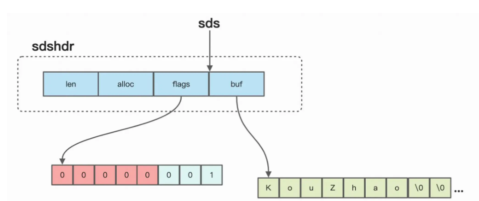


### 初始化字符串

sdstrynewlen()、sdsnew()、sdsempty()、sdsnewlen()

底层是`_sdsnewlen()`

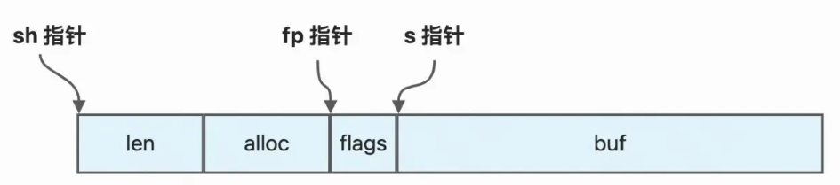


### 字符串扩容

`_sdsMakeRoomFor()`


### 字符串缩容

`sdsResize`

**对于 sdshdr8 以上的缩容，不做 sds 类型上面的变更**。(拷贝的代价大)

## List

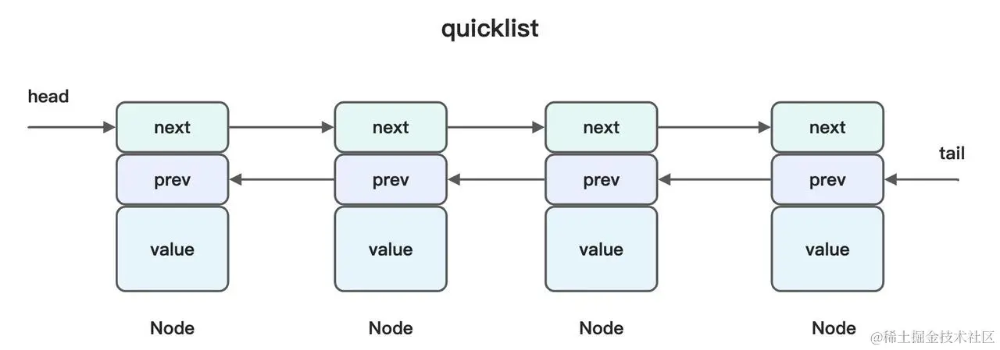


## ziplist


- zlbytes: 整个ziplist占的总字节数
- zltail: 最后一个entry在ziplist里面的偏移字节数
- zllen: entry的个数
- zlend: 始终是255, 标识ziplist结束
- entry: 见下图

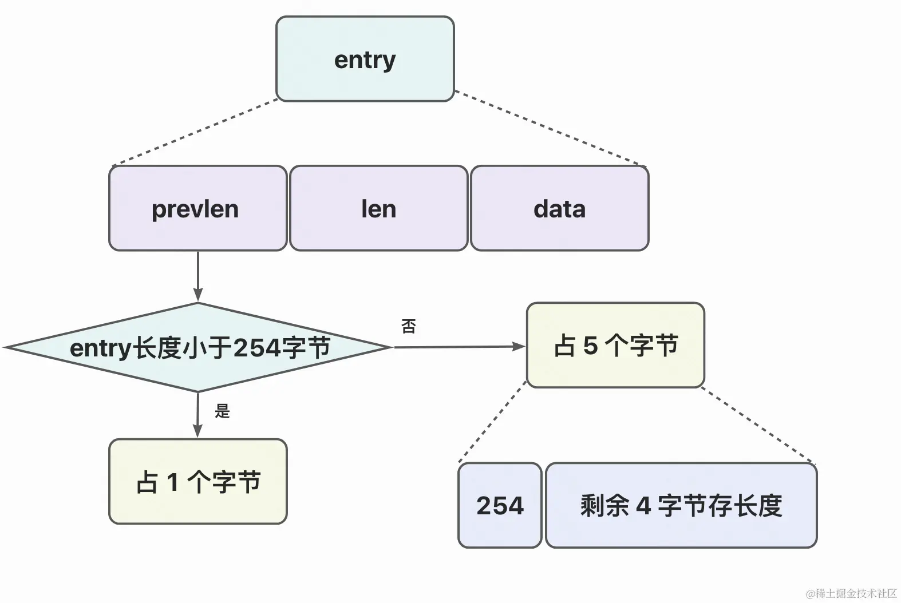

- prevlen: 记录前一个entry节点占了多少字节
- len: 记录当前entry节点里面data部分的长度
- data: 存储数据


## listpack

### 结构

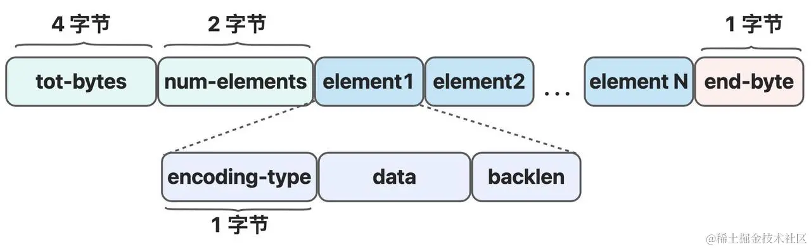

- tot-bytes: listpack占用的总字节数
- num-elements: 元素个数
- end-byte: 始终为255
- element: 见下

- **encoding-type: 存的是 element-data 部分的编码类型和长度**。

> - 0xxx xxxx：encoding-type 第一位是 0 的话，data 就是一个 7 位的无符号整数，encoding-type 和 data 会合并成一个字节，这个字节的后 7 位存的就是 data 部分。
>
> - 10xx xxxx：encoding-type 前 2 位是 10 的话，表示 data 是一个字符串，encoding-type 的低 6 位表示字符串的字节数，也就是说，data 字符串最长为 63 个字节。紧跟在 encoding-type 字节之后的，就是 data 字符串。
>
> - 110x xxxx：encoding-type 前 3 位是 110 的话，表示 data 是一个整数，encoding-type 的低 5 位以及下一个字节的 8 位，总共 13 位，共同来表示 data 这个整数值。
>
> - 1110 xxxx：encoding-type 前 4 位是 1110 的话，表示 data 是一个字符串，encoding-type 的低 4 位以及下一个字节的 8 位共同表示字符串的长度，也就是说，data 字符串最长就是 4095 个字节了。
>
> - 1111 0000：encoding-type 的值是 0xF0 的话，表示后面跟的 4 个字节表示字符串的长度，data 字符串最长 2^32 -1 个字节。紧跟字符串长度之后的部分，就是 data 字符串了。
>
> - 1111 0001：encoding-type 是 0xF1 话，表示 data 是一个 16 位的整型，encoding-type 后面紧跟的 2 个字节用来存 data 的具体值。
>
> - 1111 0010：encoding-type 是 0xF2 话，表示 data 是一个 24 位的整型，encoding-type 后面紧跟的 3 个字节用来存 data 的具体值。
>
> - 1111 0011：encoding-type 是 0xF3 话，表示 data 是一个 32 位的整型，encoding-type 后面紧跟的 4 个字节用来存 data 的具体值。
>
> - 1111 0100：encoding-type 是 0xF4 话，表示 data 是一个 64 位的整型，encoding-type 后面紧跟的 8 个字节用来存 data 的具体值。
>
> - 1111 0101 到 1111 1110 的 encoding-type 值目前还未使用。

- **backlen** : **backlen 记录的是 element 自身的长度，prevlen 记录的是前一个 element 的长度**

### 核心方法

`lpNew()`

`lpInsert()`: 插入, 删除, 替换


## quicklist

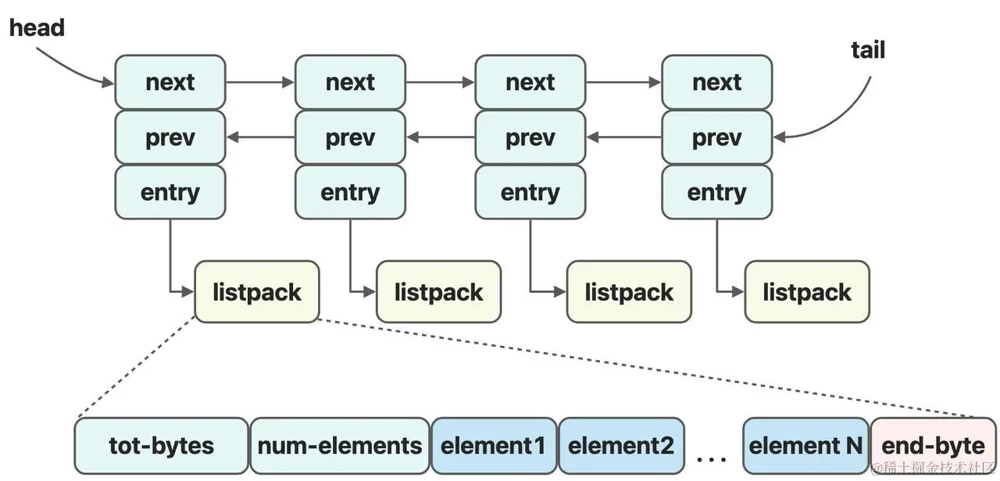

正如上文描述的这样，**quicklist 同时使用双向链表结构和 listpack 连续内存空间，主要是为了达到空间和时间上的折中**。

- 双向链表在首尾操作的场景里面，是 O(1) 的时间复杂度。但是，每个 quicklistNode 都保存了 prev、next 指针，要是每一个元素都比较短的话，内存的有效负载就会降；再加上 quicklistNode 节点所占的内存空间不连续，很容易产生内存碎片。而 listpack 是一块连续内存，既没有内存碎片，也没有指针这种无效负载，并且 entry 会使用变长编码，有效负载比双向链表高很多。
- 修改、新增、删除元素的时候，listpack 就会比双端链表的性能差。主要是因为 listpack 在这些场景里面，会有内存拷贝之类的事情发生，特别是在 listpack 这块连续空间比较大的时候，一次内存拷贝可能会涉及到大量的数据。

### 结构体

```c
typedef struct quicklistNode {
    struct quicklistNode *prev; // 指向前后quicklistNode节点的指针
    struct quicklistNode *next;
    unsigned char *entry; // 指向listpack或是quicklistLZF
    unsigned int sz;   // listpack占了多少字节
    unsigned int count : 16;    // listpack中的元素个数
    // encoding表示listpack是否压缩了（以及用了哪个压缩算法）。
    // 目前只有两种取值：2表示被压缩了（而且用的是LZF压缩算法），1表示没有压缩。
    unsigned int encoding : 2;
    unsigned int container : 2;  // container有PLAIN和PACKED两个可选值
    // 当我们使用类似lindex这样的命令查看了某一个已经被压缩的数据时，
    // 需要把数据暂时解压，这时就设置recompress=1做一个标记，
    // 等有机会再把数据重新压缩。
    unsigned int recompress : 1;
    unsigned int attempted_compress : 1;  //只在测试用例中使用，在实际生产环境没用
    unsigned int extra : 10; // 预留扩展字段，暂时无用 
} quicklistNode;
```

```c
typedef struct quicklist {
    quicklistNode *head; // 链表的头指针 
    quicklistNode *tail; // 链表的尾指针 
    // 整个quicklist中全部的元素个数，这是所有listpack中存储的元素个数之和 
    unsigned long count;
    unsigned long len;   // 整个quicklist中quicklistNode节点的个数 
    // fill（占用16bit）用来记录listpack大小设置，存放list-max-listpack-size 
    // 参数值，用于指定每个 quicklistNode 节点里面 listpack 的长度阈值
    int fill : QL_FILL_BITS;
    // compress（占用16bit）用来存放list-compress-depth参数值， 
    // 用来控制 quicklist 两端有多少个 quicklistNode 节点不被压缩的
    unsigned int compress : QL_COMP_BITS;
    // bookmark_count（占用4bit）用来存放bookmarks数组的长度 
    unsigned int bookmark_count: QL_BM_BITS;
    quicklistBookmark bookmarks[]; // 柔性数组 
} quicklist;
```

压缩后的结构体:

```c
typedef struct quicklistLZF {
    unsigned int sz; // 压缩后的字节数
    char compressed[]; // 压缩后的具体数据
} quicklistLZF;
```

迭代器:

```c
typedef struct quicklistIter {
    const quicklist *quicklist; // 指向当前quicklistIter所迭代的quicklist实例 
    quicklistNode *current; // 指向当前迭代到的quicklistNode节点 
    unsigned char *zi; // 指向当前迭代到的listpack节点 
    long offset; // 当前迭代到的entry在listpack中的偏移量，也就是第几个元素
    int direction; // 当前quicklistIter的迭代方向，AL_START_HEAD为正向遍历，AL_START_TAIL为反向遍历 
} quicklistIter;
```

在我们用 quicklistIter 迭代 quicklist 的时候，还会用到一个 quicklistEntry 结构体。它跟 listpack 里面 listpackEntry的作用有些类似，quicklistEntry 不会真实存在于 quicklist 中，只是用来存 quicklist 中元素的值以及这个元素的位置信息。

```c
typedef struct quicklistEntry {
    const quicklist *quicklist; // 所属的quicklist实例 
    quicklistNode *node; // 所属的quicklistNode节点 
    unsigned char *zi; // 指向对应的element（listpack中的elememt节点） 
    int offset; // 对应entry在listpack中的偏移量，也就是第几个元素
    
    unsigned char *value; // 如果对应值为字符串，则由value指针记录 
    unsigned int sz; // 如果对应值为字符串，则sz会记录该字符串的长度 
    
    long long longval; // 如果对应值为整数，则由longval进行记录 
} quicklistEntry;
```


## Hash


### 结构体


```c
typedef struct dictEntry {
    void *key; // 键值对中的Key，实际上指向一个sds实例
    union { // 用来存储键值对中的value值，因为是一个union，所以下面四个字段
            // 同时只会有一个有值
        void *val;     // 当value是一个非数字类型的值时，使用该指针
        uint64_t u64; // 当value值是一个无符号整数时，使用u64字段进行存储
        int64_t s64;  // 当value值是一个有符号整数时，使用s64字段进行存储
        double d;     // 当value值是一个浮点数时，使用d字段进行存储
    } v;
    struct dictEntry *next; // 指向下一个节点的指针
    void *metadata[];  // 额外的空间，这个跟Redis Cluster相关，后面再说
} dictEntry;
```

```c
struct dict {
    // 当前dict实例使用的一些特殊函数集合，通过这些函数可以改变当前dict的行为
    dictType *type;
    // 真正存储数据的hashtable，其中一个是在rehash的时候使用，实现渐进式的rehash
    dictEntry **ht_table[2];
    // 每个哈希table里面存了多少个元素
    unsigned long ht_used[2];
    // 渐进式rehash现在处理的哈希槽索引值
    long rehashidx; 
    // 用来暂停渐进式rehash的开关
    int16_t pauserehash;
    // 记录两个哈希table的长度，实际是是记录2的n次方中的 n 这个值
    signed char ht_size_exp[2]; 
};
```


```c
typedef struct dictIterator {
    dict *d;   // 当前迭代的dict实例
    long index; // 当前迭代到的槽位
    // table是当前迭代到的dictht，取值只能是0或1
    // 标识当前迭代器是否为安全模式迭代器
    int table, safe;
    // 指向当前迭代到的节点以及其下一个节点 
    dictEntry *entry, *nextEntry;
    // 为非安全模式迭代器设计的一个指纹标识 
    unsigned long long fingerprint;
} dictIterator;
```


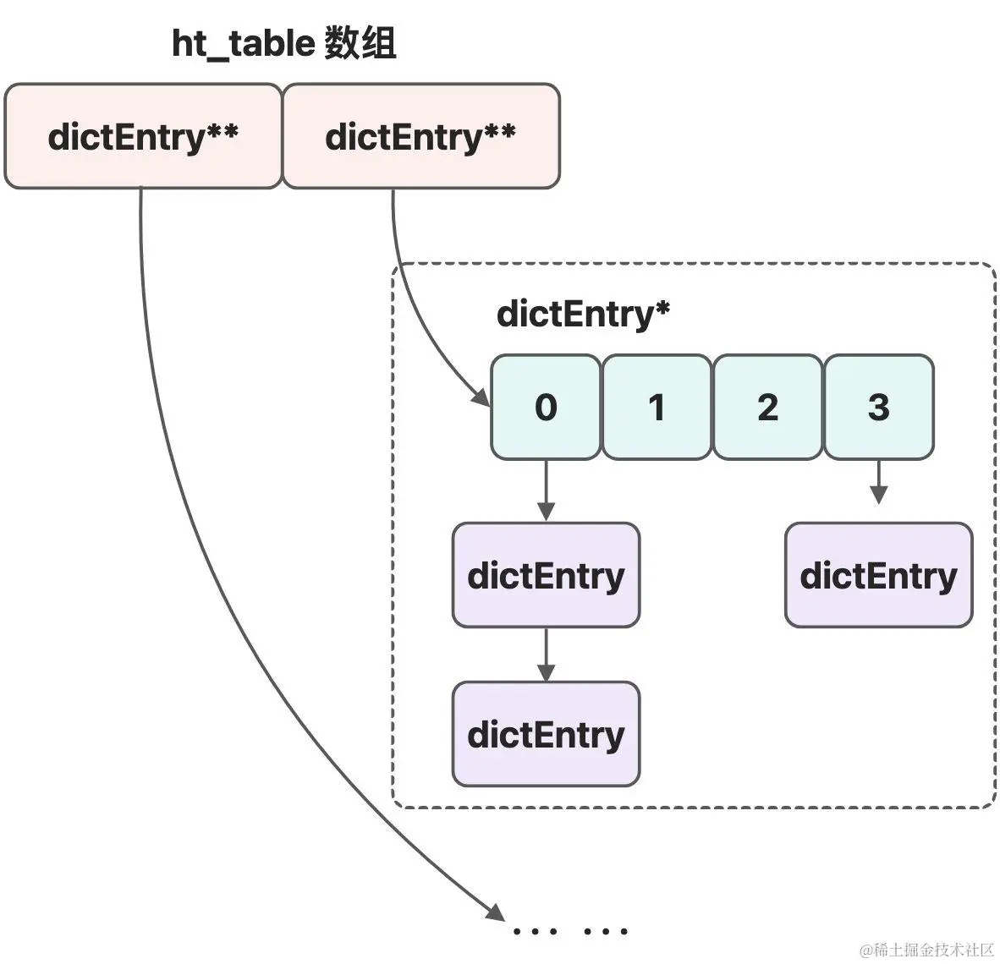

### dictType

```c
typedef struct dictType {
    // hashFunction函数用来计算key的hash值
    uint64_t (*hashFunction)(const void *key);
    // keyDup和valDup分别负责对key和value进行复制
    void *(*keyDup)(dict *d, const void *key);
    void *(*valDup)(dict *d, const void *obj);
    // 用来比较两个key是否相同
    int (*keyCompare)(dict *d, const void *key1, const void *key2);
    // keyDestructor和valDestructor分别负责销毁key和value 
    void (*keyDestructor)(dict *d, void *key);
    void (*valDestructor)(dict *d, void *obj);
    // 用来检查当前dict是否需要扩容 
    int (*expandAllowed)(size_t moreMem, double usedRatio);
    // 用来计算metadata那个柔性数组的长度，用来检查
    size_t (*dictEntryMetadataBytes)(dict *d);
} dictType;
```


### 迭代器


```c
typedef struct dictIterator {
    dict *d;   // 当前迭代的dict实例
    long index; // 当前迭代到的槽位
    // table是当前迭代到的dictht，取值只能是0或1
    // 标识当前迭代器是否为安全模式迭代器
    int table, safe;
    // 指向当前迭代到的节点以及其下一个节点 
    dictEntry *entry, *nextEntry;
    // 为非安全模式迭代器设计的一个指纹标识 
    unsigned long long fingerprint;
} dictIterator;
```


## intset

```c
typedef struct intset {
    uint32_t encoding; // 编码类型
    uint32_t length; // contents数组的长度
    int8_t contents[]; // 柔性数组，不使用时不占用空间
} intset;
```

insetNew()函数


## skiplist

### 结构体

```c
typedef struct zskiplistNode {

  sds ele; // 存储字符串类型的数据

  double score; // 用来排序的分数

  struct zskiplistNode *backward; // 指向当前层的前一个节点

  struct zskiplistLevel {

	struct zskiplistNode *forward; // 指向当前层的后一个节点

	unsigned long span; // 记录了当前层里面，我们按照forward指针向后走一步，

                            // 能扫过多少个元素

  } level[]; // skiplist中的层节点

} zskiplistNode;
```

```c
typedef struct zskiplist {

  struct zskiplistNode *header, *tail; // 指向skiplist结构的首节点和尾结点

  unsigned long length; // 当前zskiplist level0的节点个数，也是其中存储元素的个数

  int level; // 当前zskiplist的层级数

} zskiplist;
```


## Rax

在Redis需要**有序数据结构**的时候，都使用了Rax树。


```c
typedef struct raxNode {
    uint32_t iskey:1;  // 标识当前节点是否包含一个key，占用1位
    uint32_t isnull:1; // 标识当前节点是否需要存储value-ptr指针，占1位
    uint32_t iscompr:1;// 当前节点是否为压缩节点，占1位
    uint32_t size:29;  // 占29位，如果当前节点是压缩节点，则表示压缩的字符
                       // 串长度；如果当前节点是非压缩节点，则为子节点个数  
    unsigned char data[]; // 具体存储数据的地方
} raxNode;
```


**如果当前节点是非压缩节点**，size 字段存储的是子节点的个数，在 data 中会用 size 个字符来存储对应的节点信息，同时会存储 size 个 raxNode 节点指针，这些指针会指向子节点。例如，一个非压缩节点中存储了 a、b、c 三个子节点，那么其结构如下图所示：


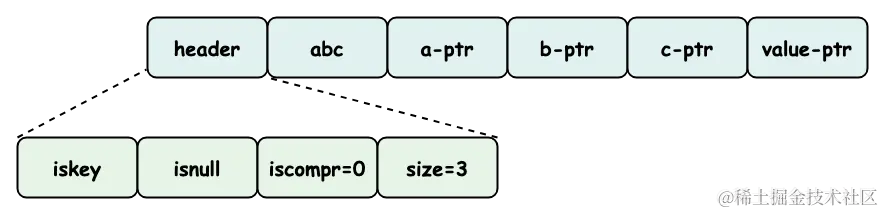

可以看到，在 size 字段之后，使用三个字节存储节点的数据，也就是 “a”“b”“c” 三个字符；之后是 a-ptr、b-ptr、c-ptr 三个 raxNode 指针，指向三个子节点；最后存储一个 value-ptr 指针，指向该节点表示 key 所对应的 value 值。上图展示的节点如果展开成树型结构，逻辑上就如下图所示，一个节点内的字符其实是树中的`兄弟关系`：


**如果当前节点是压缩节点**，当前节点只会有一个子节点，size 字段记录的是 data 中存储的字符串长度。例如，有 “x”“y”“z” 三个字符被压缩到了一个节点中，内存结构就如下图所示，其中 z-ptr 指针指向了下一个节点，value-ptr 指向该节点表示的 key 所对应的 value 值。

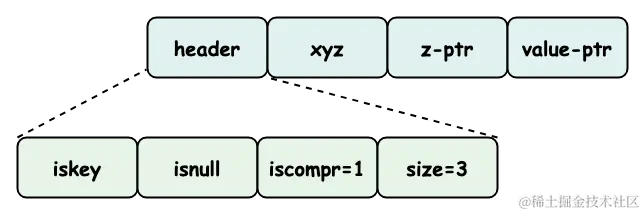

上图展示的节点如果展开成树型结构，逻辑上如下图所示，一个节点内的字符其实是树中的`父子关系`：


```c
typedef struct rax {
    raxNode *head; // 指向Rax树的根节点
    uint64_t numele; // 记录Rax树中有多少元素
    uint64_t numnodes; // 记录Rax树中有多少节点
} rax;
```


# 内核解析篇


## 1. Redis核心结构体


### 1.1 redisObject

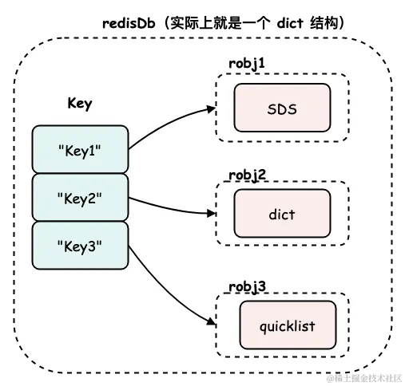

下面来看 robj 的核心字段及其含义，弄清了它们的含义，也就了解了`为何要使用 robj 对 value 值进行一层额外的包装`。

- **type 字段**：占用 4 个 bit 位，指定了 robj 包装数据的具体类型，具体可选值有 OBJ_STRING、OBJ_LIST、OBJ_SET、OBJ_ZSET、OBJ_HASH，对应的是前面介绍的 Redis 底层数据结构。
- **encoding 字段**：占用 4 个 bit 位，指定了 robj 包装数据的编码方式。对于相应的数据类型（即 type 值相同），因为存储的具体数据有所差异，对应的 encoding 编码方式也有所不同。
- **lru 字段**：占用 24 个 bit 位，用来记录 LRU 的相对时间，在后面使用的时候会展开说。
- **refcount 字段**：int 类型，用来记录当前 orbj 实例被引用的次数。有的时候，我们需要创建一个共享的 robj 对象，每新增一个使用方引用这个公共 robj 对象的时候，refcount 值就会加 1；每当引用减少一个的时候，refcount 值就会减 1；当 refcount 减到 0 的时候，就表示没人再使用这个 robj 对象了，也就可以释放这个公共 robj 对象的空间了。在效果上，这与我们 Java 里面的 GC 有点类似。
- **ptr 字段**：void* 指针类型，用来执行 robj 底层包装的真正数据。


**`OBJ_STRING`**: OBJ_ENCODING_INT, OBJ_ENCODING_EMBSTR, OBJ_ENCODING_RAW

**`OBJ_LIST`**: quicklist

**`OBJ_HASH`**: OBJ_ENCODING_LISTPACK, OBJ_ENCODING_HT

**`OBJ_SET`**: OBJ_ENCODING_INTSET, OBJ_ENCODING_HT

**`OBJ_ZSET`**: OBJ_ENCODING_LISTPACK , OBJ_ENCODING_SKIPLIST

**`OBJ_ENCODING_STREAM`**: OBJ_ENCODING_STREAM

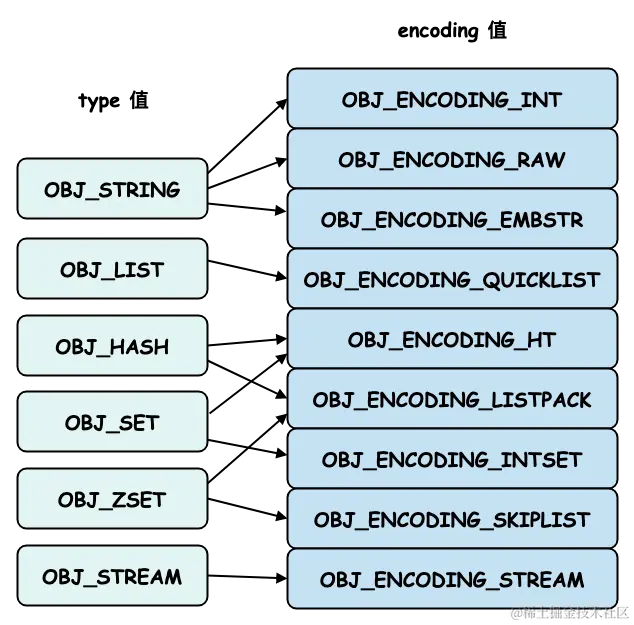


### 1.2 redisServer

```c
struct redisServer {

    char *configfile; // redis.conf配置文件的绝对路径

    redisDb *db; // 存储键值对数据的redisDb实例

    int dbnum; // db个数,可通过databases参数进行配置，默认为16，我们一般只使用0号DB

    

    // 当前redis实例能处理的命令列表，其中key是命令名，vaue是执行命令的入口

    dict *commands; 

    aeEventLoop *el; // 事件处理循环


    int port; // 当前redis实例监听的端口

    // 当前redis实例可以绑定的ip地址，默认会绑定当前机器的全部ip，最多16个ip

    char *bindaddr[CONFIG_BINDADDR_MAX]; 

    int bindaddr_count;


    list *clients;  // 连接到当前redis实例的客户端列表

    // 客户端最大的空闲时长，单位是秒。当客户端超过该时长未与服务器进行交互，

    // redis实例与该客户端的连接会自动超时断开。

    int maxidletime; 

}
```


### 1.3 redisDb

```c
typedef struct redisDb {

    // 用来存储键值对的dict实例

    dict *dict;

    // 用来存储每个key的过期时间

    dict *expires;

    // blocking_keys用来存储客户端阻塞等待的key，例如，客户端使用BLPOP命令阻

    // 塞等待弹出列表中的元素时，就会将key写入到blocking_keys中，value则是被阻

    // 塞的客户端。当下次PUSH命令发出时，Redis会检查blocking_keys中是否存在阻塞

    // 等待的key，如果存在，则将key添加到ready_keys链表当中，在下次Redis事件处

    // 理流程中，会遍历ready_keys链表，并从blocking_keys中拿到阻塞的客户端进行

    // 响应

    dict *blocking_keys;        

    dict *ready_keys;

    // 与WATCH命令相关的一个dict

    dict *watched_keys; 

    // 当前redisDb实例的唯一标识

    int id;             

    long long avg_ttl;  // 用来统计平均过期时间

    unsigned long expires_cursor; // 用来统计过期事件循环执行的次数

    list *defrag_later;         // 一个key的列表，这些key会参与碎片整理

} redisDb;
```


### 1.4 client

client 核心字段总结起来有 5 大类。

- 第一类是**客户端的基础信息**。例如：id 字段记录了 client 的唯一 id；conn 字段抽象了该 client 的客户端与 Server 端的网络连接；resp 字段是该 client 支持的协议；db 指针指向了该 client 当前操作的数据库编号，等等。
- 第二类是 Redis **读取该客户端请求**的相关字段。例如：Redis 服务读取该客户端发来请求时用的缓冲区，也就是这个 querybuf 字段；后面的 argc、argv 请求解析之后得到的结果；reqtype 字段则是请求的协议版本。
- 第三类是 Redis 服务**向该客户端返回响应**相关的字段。例如：响应的缓冲区、等待发送的字节数、已发送的字节数，分别对应了下面的 buf、bufpos、sentlen 等字段。
- 第四类是对这个 **client 状态信息记录**。例如， flags 字段，其中每一位都表示一个状态，具体每个状态位的含义，在后面用到的时候详细说明。
- 第五类就是针对这个**客户端的一些统计信息**。例如：lastinteraction 字段即这个客户端与当前 Redis Server 最后一次交互时间戳；ctime 字段记录了该 client 实例的创建时间，也就是这个客户端连到当前 Redis Server 的时间。


```c++


typedef struct client {

    // client实例的自增id，默认是通过server.next_client_id自增得到的，

    // 也可自定义。server.next_client_id是一个原子类型的整数，其自增是原子操作

    uint64_t id;

    // connection抽象了当前Redis实例与该客户端之间的网络连接

    connection *conn; 

    // resp记录当前客户端支持的RESP协议版本，可选值为2和3，分别代表RESP2协议

    // 和RESP3协议，这两个版本协议的差别我们后面展开

    int resp; 

    // 当前客户端操作的DB，默认是编号0的DB，实际生产中，我们一般只使用编号为0的DB

    redisDb *db;


    // 下面是与请求读取相关的字段，客户端通过connection连接发送请求时，请求会写入

    // querybuf缓冲区缓存，qb_pos记录了querybuf缓冲区中有效的字节数，

    // querybuf_peak记录了最近一段时间内querybuf的最大值

    sds querybuf;

    size_t qb_pos;  


    // querybuf缓冲区中累计了足够多的数据之后，会按照RESP协议解析成Redis命令，

    // 这里的argc字段记录了解析后Redis命令的参数个数(包括命令名称本身)，argv

    // 字段指向的robj*数组用来存储解析后的命令参数(以字符串类型存储)

    int argc;            

    robj **argv; 

    int argv_len;

    // 在Redis客户端与Server端交互的RESP协议中，请求有PROTO_REQ_INLINE、

    // PROTO_REQ_MULTIBULK两种格式，reqtype字段就是用来记录当前请求的格式

    // 下面的multibulklen、bulklen都是在解析PROTO_REQ_MULTIBULK格式请求时，

    // 使用到的辅助字段

    int reqtype; 

    int multibulklen;

    long bulklen;


    // Redis会根据解析得到的命令名称找到要执行的redisCommand，并用cmd、lastcmd

    // 两个字段进行记录

    struct redisCommand *cmd, *lastcmd; 


    // 下面是Redis Server端返回响应相关的字段，buf字段是返回响应时使用的缓冲区，

    // 默认是16K，bufpos字段记录buf数组的实际使用长度, buf_usable_size字段记录

    // 了buf缓冲区剩余的可用空间大小。当buf缓冲区写满之后，

    // 后续的数据将会追加到reply列表中，其中每个元素都是clientReplyBlock实例

    // (也是16K的缓冲区），写满其中一个clientReplyBlock实例之后才会再追加新

    // 的clientReplyBlock实例

    int bufpos;

    size_t buf_usable_size;

    char *buf;

    list *reply;

    unsigned long long reply_bytes; // 记录reply中的总字节数

    // sentlen发送一个缓冲区数据时，记录此次发送长度，从而帮助判断该缓冲区是

    // 否完全发送完毕

    size_t sentlen; 


    // 下面是一些统计信息，ctime记录了client实例的创建时间；duration用于

    // 记录一次命令的执行时长；lastinteraction用于记录该client实例表示

    // 的Redis客户端与当前Redis Server最近一次发生交互的时间戳，用于判断

    // 客户端是否超时

    time_t ctime;

    long duration;

    time_t lastinteraction; 


    // flags字段中记录了当前client的状态信息，其中每一位表示一个状态，例如，

    // CLIENT_PENDING_READ (1<<29)表示当前connection连接有请求需要读取和解析

    // CLIENT_PENDING_COMMAND (1<<30)表示有解析好的、待执行的命令

    // CLIENT_PENDING_WRITE (1<<21)表示有响应需要范围该client对应的客户端

    // CLIENT_MULTI (1<<3)表示当前处于一个事务上下文中

    // flags中还有非常非常多的状态位，这里不再一一展开介绍了，后面用到再说

    uint64_t flags;

} client;

```


### 1.5 redisCommand

在 redisServer 结构体中，维护了一个 commands 字段（dict* 指针类型），其中**维护了当前 Redis 实例能够执行的 Redis 命令**，其中的 key 是可执行的命令名称，value 是对应的 redisCommand 对象。


```c++
struct redisCommand {

    // declared_name记录了命令名称，也是redisServer.commands中的key

    const char *declared_name; 

    ... // 省略一些介绍性的字段，比如summary、complexity、since等等字段，分别说明

        // 了这条命令的大概功能、详细说明以及从Redis的哪个什么版本开始支持这条信息等等，

        // 这些字段中记录的只是命令介绍性的信息，与命令本身执行没什么关系。 

    const char **tips; // 给客户端使用的提示信息

    // proc指向了命令处理函数，也就是处理该命令的入口

    redisCommandProc *proc; 

    int arity;  // arity指定了命令参数的个数

    uint64_t flags; // 命令标识

    ...

    keySpec key_specs_static[STATIC_KEY_SPECS_NUM];

    // 一条命令可能操作多个Key，这个函数用来提取命令中所有Key的位置

    redisGetKeysProc *getkeys_proc;

    

    // 统计信息，microseconds是从Redis实例启动到现在该命令的总执行时间，

    // calls是该命令的总调用次数，rejected_calls、failed_calls分别是

    // 该命令的拒绝次数和失败次数

    long long microseconds, calls, rejected_calls, failed_calls;

    int id; // 命令的唯一ID，从0开始分配

    

    // 这里的key_specs、args、subcommand字段以及前面的key_specs_static都是用来

    // 描述命令的，这个我们下面简单说一下

    keySpec *key_specs;

    keySpec legacy_range_key_spec; 

    // 一条Redis命令下面可能还有子命令，这些子命令就记录在subcommands数组，

    // 相应的哈希结构存储在subcommands_dict这个字典中

    struct redisCommand *subcommands;

    dict *subcommands_dict; 

    struct redisCommandArg *args;

    struct redisCommand *parent; // 父命令指针   

};
```


#### redisCommand常见实例

```c
{"setnx", ..., setnxCommand,3,CMD_WRITE|CMD_DENYOOM|CMD_FAST, ..., {{NULL,CMD_KEY_OW|CMD_KEY_INSERT,KSPEC_BS_INDEX,.bs.index={1},KSPEC_FK_RANGE,.fk.range={0,1,0}}},.args=SETNX_Args},

{"zunion",...,zunionCommand,-3,CMD_READONLY,ACL_CATEGORY_SORTEDSET,{{NULL,CMD_KEY_RO|CMD_KEY_ACCESS,KSPEC_BS_INDEX,.bs.index={1},KSPEC_FK_KEYNUM,.fk.keynum={0,1,1}}},zunionInterDiffGetKeys,.args=ZUNION_Args},
```

- **declared_name**

  "setnx"

  "zunion"

- **proc**

  setnxCommand

  zunionCommand

- **arity**: 当 arity 取值为正时，表示命令有固定的参数；当 arity 取值为负时，表示参数个数的最小值，可能包含更多参数。

  3

  -3

- **flags**: 每一位就是一个标识符，每个标识符说明了这条命令的一个特性。

  CMD_WRITE|CMD_DENYOOM|CMD_FAST

  CMD_READONLY

- **id**: 动态分配, 不用配置

  `为啥有了 name 这个唯一标识之后，还需要将其转换成 id 呢？`id 字段主要是为了 ACL 使用的，Redis 为每个用户创建了一个 bitmap，其中每一位都标识这个用户是否有权限访问对应的命令，这里将命令转换成 id 这个整数，就是为了构建 bitmap。

- **keySpec key_specs_static[STATIC_KEY_SPECS_NUM]**: 描述命令行的规则

  {{NULL,CMD_KEY_OW|CMD_KEY_INSERT,KSPEC_BS_INDEX,.bs.index={1},KSPEC_FK_RANGE,.fk.range={0,1,0}}}

  {{NULL,CMD_KEY_RO|CMD_KEY_ACCESS,KSPEC_BS_INDEX,.bs.index={1},KSPEC_FK_KEYNUM,.fk.keynum={0,1,1}}}

- **tips**: 在 DBSIZE 命令中的 tips 字段，就是告诉 Proxy 如何处理 DBSIZE 命令


## 2. Redis线程模型与IO模型的进化史

我们常说的“Redis 是一个单线程应用”指的是 Redis 在处理客户端的请求时，都是由唯一的主线程进行处理的，其中包括了请求的读取和解析、命令的执行以及响应的返回。这个描述在 Redis 4.0 版本之前，是比较准确的。

从 4.0 版本开始，Redis 就已经不是纯粹的单线程应用了。除了主线程外，Redis 开始使用后台线程处理一些比较耗时的操作，例如，<u>清理脏数据、释放超时连接、删除大 key</u> 等，但是<u>网络读写、执行命令</u>还是只使用单线程来处理。Redis 4.0 以及之前版本的核心线程模型如下图所示：

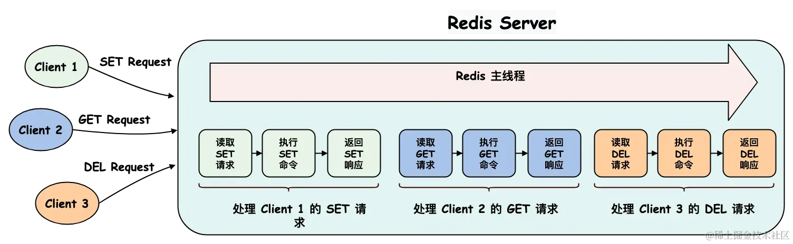

Redis 之所以使用单线程是**因为 Redis 执行的是纯内存的操作，Redis 服务的瓶颈不在 CPU，而是在网络和内存**。单线程避免了不必要的上下文切换和竞争条件，也无需考虑锁的问题，整个线程模型比较简单。

多线程模型虽然在某些方面表现优异，但是它却引入了程序执行顺序的不确定性，带来了并发读写的一系列问题，增加了系统复杂度、同时可能存在线程切换、甚至加锁解锁、死锁造成的性能损耗。Redis 通过事件模型以及 IO 多路复用等技术，处理性能非常高，因此没有必要使用多线程来执行命令。

从 Redis 官方介绍中来看，单线程模型下网络 IO 占用了 Redis 大部分的 CPU 时间，网络 IO 的瓶颈随着请求量的增加也逐渐凸显出来。Redis 6.0 开始支持多线程 IO，进而充分利用服务器多 CPU 的优势，提高 Redis 在网络 IO 方面的性能。下图为 Redis 6.0 之后的线程模型：

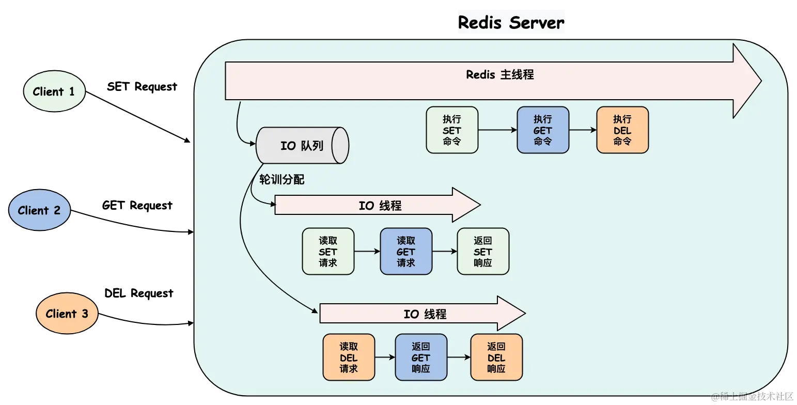

简单解释一下这张图的结构：当 Redis Server 收到一个请求的时候，先会进入 IO 队列，多条 IO 线程会从 IO 队列里面读取请求并进行解析，解析之后的命令就会交给 Redis 主线程进行执行；执行后的结果会重新进入 IO 队列，等待 IO 线程将响应返回给客户端。

Redis 6.0 虽然开始支持多线程，但是执行命令的线程还是只有主线程一个，我们还是认为单条命令是原子执行的；同时，Redis 6.0 又有多线程进行 IO，进而突破了单线程 IO 的瓶颈，发挥了多核的优势。


### 2.1 I/O 多路复用

Redis 采用 I/O 多路复用来解决这个问题。针对传统的阻塞 I/O 模型的缺点，I/O 复用的模型在性能方面有不小的提升。I/O 复用模型中的多个连接会共用一个 Selector 对象，由 Selector 感知连接的读写事件，而此时的线程数并不需要和连接数一致，只需要很少的线程定期从 Selector 上查询连接的读写状态即可，无须大量线程阻塞等待连接。当某个连接有新的数据可以处理时，操作系统会通知线程，线程从阻塞状态返回，开始进行读写操作以及后续的业务逻辑处理。

图中的"等待数据"是 `Selector`这货在等, 内核在处理数据

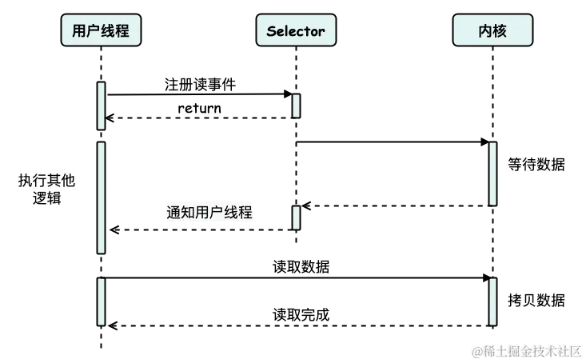

在 I/O 多路复用模型中**最核心就是 selector**，但是 selector 在各个操作系统上的实现机制各不相同，例如，Linux 系统中的实现是 epoll，Solaris 10 系统中的实现是evport，OS X、FreeBSD 等系统中的实现是 kqueue。

**epoll** 是 Linux 内核为处理大量网络连接而提出的解决方案，它能够同时监听多个网络连接（文件描述符）的读写情况，当其中的某些文件描述符，有可读事件或者可写事件时，epoll 会立刻返回这些可读可写的文件描述符个数。


### 2.2 文件描述符(AI给出)

**文件描述符（File Descriptor）** 是一个非负整数，是操作系统为了管理被打开的**文件**或**其他输入/输出资源**（如网络连接、设备等）而分配的一个抽象句柄（Handle）。

**核心比喻：文件描述符是“票”或“号码牌”**

想象一下你去**银行的办事大厅**：

1. 1.

   你需要办理业务（**读写文件**或**网络通信**）。

2. 2.

   大堂经理（**操作系统内核**）不会让你直接去柜台操作。他会给你一张**排队票**，上面有一个**号码**。

3. 3.

   你拿着这张票（**文件描述符**）等待叫号。

4. 4.

   当叫到你的号码时，你凭这张票去对应的柜台（**使用系统调用**）办理具体业务。

这张**票（文件描述符）** 本身不是业务，也不是柜台，它只是一个**代表你业务需求的标识**。


- **它是什么**： 一个简单的数字索引。
- **它指向什么**： 它指向操作系统内核内部维护的一个**文件描述符表**中的某一项。这个表项最终指向一个真正的资源（如一个打开的文件、一个网络套接字等）。

- 为什么需要文件描述符？操作系统为了**安全和统一管理**，绝不会让应用程序直接去操作硬盘上的文件或直接操作网卡。

| 文件描述符 (FD) | 名字     | 默认指向           | 用途                                   |
| :-------------- | :------- | :----------------- | :------------------------------------- |
| **0**           | `stdin`  | 键盘（或终端设备） | **标准输入**：程序读取输入的地方。     |
| **1**           | `stdout` | 屏幕（或终端设备） | **标准输出**：程序输出正常结果的地方。 |
| **2**           | `stderr` | 屏幕（或终端设备） | **标准错误**：程序输出错误信息的地方。 |

### 2.3 epoll基础

Linux 提供了 select、poll、epoll 三种多路复用的实现方式，其中 `epoll 是性能最好，也是我们最常用的一种`。

epoll 的3 个核心函数:

- `epoll_create(int size)` 函数，它会创建一个 epoll 专用的文件描述符（表示的是内核事件表）。
- `epoll_ctl(int epfd, int op, int fd, struct epoll_event *event)` 函数，它操作上面拿到的内核事件表，我们可以通过该函数注册、修改或删除需要监听的事件。这里展开介绍一下 epoll_ctl() 的参数。
  - epfd：要操作的内核事件表对应的文件描述符，也就是 epoll_create() 的返回值。
  - op：指定了此次操作的类型，主要分三种，EPOLL_CTL_ADD 表示向内核事件表中注册指定fd 相关的事件；EPOLL_CTL_MOD 表示修改指定 fd 上的注册事件；EPOLL_CTL_DEL 表示删除指定 fd 的注册事件。
  - fd：此次要操作的文件描述符，也就是要内核事件表中监听的 fd。
  - event：是一个 epoll_event 结构指针类型，指定所要监听的 fd 上的事件类型。
- `epoll_wait(int epfd, struct epoll_event* events, int maxevents, int timeout)` 函数，它会阻塞并等待监听到有事件发生。如果检测到事件发生，会将所有就绪的事件从内核事件表（epdf 参数）复制到第二个参数 events 指向的缓冲数组中返回。maxevents 参数指定了每次能处理的最大事件数目，timeout 参数指定了一次阻塞的超时时长。

```c
struct epoll_event {

    uint32_t     events;   // 记录了发生事件，按位区分不同事件

    epoll_data_t data;     // 记录了发生事件的相关信息

};


typedef union epoll_data {

    void    *ptr;

    int      fd; // 记录了发生事件的文件描述符

    uint32_t u32;

    uint64_t u64;

} epoll_data_t;
```

与 **epoll_event.events** 字段相关的几个宏定义以及含义如下。

- EPOLL**IN**：对应的文件描述符发生可读事件（包括对端 SOCKET 正常关闭）。
- EPOLL**OUT**：对应的文件描述符发生可写事件。
- EPOLL**PRI**：对应的文件描述符有紧急的数据可读。
- EPOLL**ERR**：对应的文件描述符发生错误。
- EPOLL**HUP**：对应的文件描述符被挂断。
- EPOLL**ET**： 将 EPOLL 设为边缘触发模式，默认是水平触发模式。
- EPOLL**ONESHOT**：只监听一次事件，当监听完这次事件之后，如果还需要继续监听对应描述符，需要再次注册这个文件描述符。

**epoll 的触发模式**，主要有两种。

- LT 模式：水平触发模式，这也是默认的触发模式。当 epoll_wait() 检测到事件发生并将通知给应用时，应用可以不立即处理这些事件，因为下次调用 epoll_wait() 函数时，会再次通知应用这些事件。
- ET模式：边缘触发模式。当 epoll_wait() 检测到事件发生并将通知给应用时，应用需要立即处理这些事件。如果不处理，下次调用 epoll_wait() 函数时，将不会再次进行通知。

**epoll 为什么比select、poll更高效？**

- epoll 采用红黑树管理文件描述符
  epoll使用红黑树管理文件描述符，红黑树插入和删除的都是时间复杂度 O(logN)，不会随着文件描述符数量增加而改变。
  select、poll采用数组或者链表的形式管理文件描述符，那么在遍历文件描述符时，时间复杂度会随着文件描述的增加而增加。
- epoll 将文件描述符添加和检测分离，减少了文件描述符拷贝的消耗
  select&poll 调用时会将全部监听的 fd 从用户态空间拷贝至内核态空间并线性扫描一遍找出就绪的 fd 再返回到用户态。下次需要监听时，又需要把之前已经传递过的文件描述符再读传递进去，增加了拷贝文件的无效消耗，当文件描述很多时，性能瓶颈更加明显。
  而epoll只需要使用epoll_ctl添加一次，后续的检查使用epoll_wait，减少了文件拷贝的消耗。

实例:

```c
int main(int argc, char *argv[]) {

    struct epoll_event event;

    struct epoll_event *events;

    // 创建并绑定TCP套接字

    int sfd = create_and_bind(argv[1]);

    // ... 将TCP套接字设置成非阻塞的(略)

    s = listen(sfd, SOMAXCONN); // 等待连接建立

    // 调用epoll_create()函数创建epoll用到的文件描述符

    int efd = epoll_create(0);

    event.data.fd = sfd;

    // 监听可读事件，使用边缘触发模式

    event.events = EPOLLIN | EPOLLET;

    // 添加对sfd的监听

    s = epoll_ctl(efd, EPOLL_CTL_ADD, sfd, &event);

    // 创建一个事件缓存缓冲队列

    events = calloc(MAXEVENTS, sizeof event);

    while (1) {

        int n, i;

        // 阻塞等待有事件发生，当有事件发生时，epoll_wait()函数会通过events参数返回事件

        n = epoll_wait(efd, events, MAXEVENTS, -1);

        for (i = 0; i < n; i++) { // 循环处理事件

            // 对于EPOLLERR、EPOLLHUP事件以及文件描述符关闭的场景进行处理(略)

            // 发生可读事件来自sfd这个连接，表示有连接创建请求

            if (sfd == events[i].data.fd){

                while (1) { // 可能有多个创建连接的请求，所以是while(1)

                    struct sockaddr in_addr;

                    socklen_t in_len;

                    int infd;

                    in_len = sizeof in_addr;

                    // 创建新连接，infd为新建连接对应的文件描述符

                    infd = accept(sfd, &in_addr, &in_len);

                    if (infd == -1) {

                        if ((errno == EAGAIN) ||

                            (errno == EWOULDBLOCK)) {

                            break; // 已经处理完全部新建连接请求

                        }

                    }

                    // 将infd连接设置为非阻塞

                    s = make_socket_non_blocking(infd);

                    // 监听infd连接的可读事件

                    event.data.fd = infd;

                    event.events = EPOLLIN | EPOLLET;

                    s = epoll_ctl(efd, EPOLL_CTL_ADD, infd, &event);

                }

                continue;

            } else {

                int done = 0;

                while (1) {  // 不确定有多少可读数据，需要循环读取

                    ssize_t count;

                    char buf[1024];

                    count = read(events[i].data.fd, buf, sizeof buf);

                    if (count == -1) {

                        // EAGAIN表示已经读取完可读数据，等待下次可读事件

                        if (errno != EAGAIN) {

                            done = 1;  

                        }

                        break;

                    }

                    else if (count == 0)  { 

                        done = 1; // 读取完成，对端关闭连接

                        break;

                    }

                    // ... 处理读取到buf中的数据(略)

                }

                if (done) { // 对端关闭连接或是发生异常，释放对应文件描述符

                    close(events[i].data.fd);

                }

            }

        }

    }

    free(events); // 释放events缓冲区

    close(sfd); // 释放sfd文件描述符

    return 1;

}
```


简单说一下这段示例代码的核心逻辑，首先是通过 create_and_bind() 来新建一个 Socket，并把它设置成非阻塞的模式。接下来就是 epoll 的使用了，这里会新建一个 epoll 实例，并开始监听 sfd 这个 Socket 上的事件。然后就是一个 while 循环，它里面会调用 epoll_wait() 方法阻塞线程，直到监听到事件发生。在监听到事件之后，epoll_wait() 方法会通过 event 参数返回相应的事件。

这里我们先来关注与客户端新建连接的场景，新建连接的时候，发生事件的 Socket 就是 sfd，此时就会进入下面的 if 分支，其中会通过 accept() 完成客户端连接的创建，并把新建的这个连接添加到 epoll 上进行监听，这里主要是监听读事件。

下面再来看 else 这个分支，这是在客户端连接触发可读事件的执行逻辑。在这个分支的 while 循环里面，会尝试从这个 Socket 里面读取数据，在 buf 缓冲区读取满了之后，我们 Server 端就会处理其中的数据。处理完成之后，就会继续读取，然后处理，循环往复，直到全部数据都读取完毕，最后我们 Server 端会关闭这个 Socket 连接。

### 2.4 Reactor模型

详见后面的Reactor

**一般 I/O 多路复用会和 Reactor 设计模式一起出现，Redis 也是使用 Reactor 模式来处理网络请求的。**

Redis 通过 Selector 这个多路复用模块同时监听多个网络连接，当监听到 accept、read、write 等事件时，I/O 多路复用模块会将事件通过 Dispatcher 转发给事件处理器进行处理，如下图所示。在整个运行过程中，网络连接也可能会出现连接不可读或不可写等情况，此时主线程会去执行其他 Handler 的逻辑处理其他网络连接的事件或是时间事件，而不是阻塞等待。

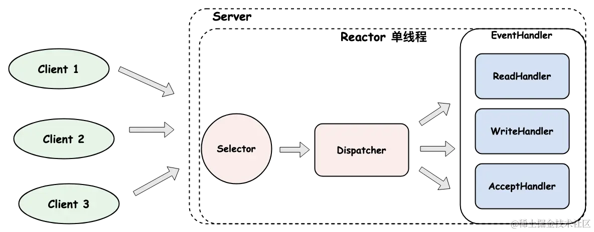


单 Reactor 单线程的优点就是线程模型简单，没有引入多线程，自然也就没有多线程并发和竞争的问题。但其缺点也非常明显，那就是性能瓶颈问题，一个线程只能跑在一个 CPU 上，能处理的连接数是有限的，无法完全发挥多核 CPU 的优势，这也是 Redis 从 单个线程转变成`单个主线程 + IO 多线程`的原因。

#### IO模型

##### 阻塞IO

用户线程发起 read 调用后就阻塞了，让出 CPU。内核等待网卡数据到来，把数据从网卡拷贝到内核空间，接着把数据拷贝到用户空间，再把用户线程叫醒
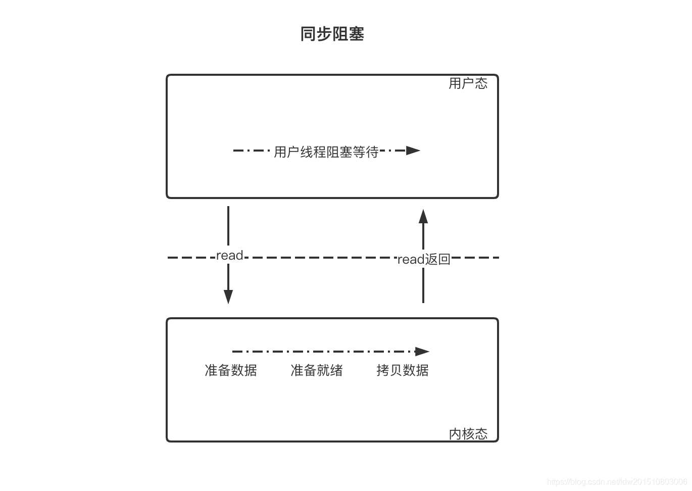

##### 非阻塞IO(java NIO)

其工作原理是通过使用通道(Channels)和缓冲区(Buffers)来实现数据的传输.NIO采用事件驱动的模型, 允许单个线程监听多个通道上的事件, 通过选择器(Selectors)来处理多个网络连接.

selector轮询Channels

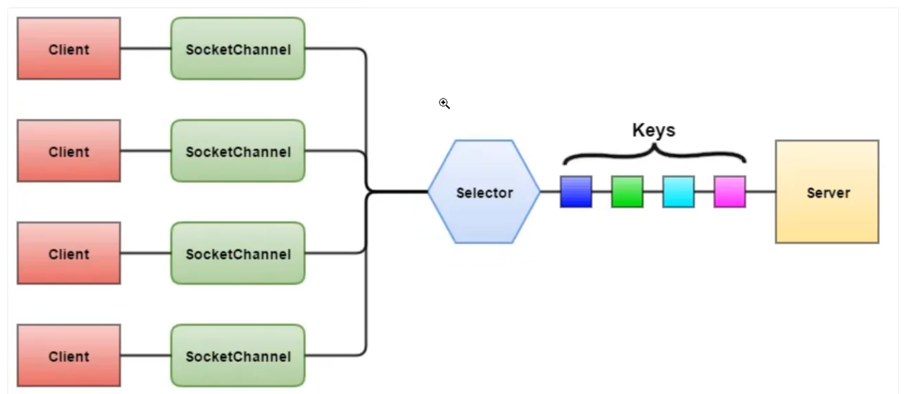

需要注意的是：这里通过用户线程自己去轮询读取数据，和I/O多路复用使用专用的线程去轮询处理(通常一个线程)不同

用户线程轮询发起read操作，如果数据未就绪，则立即返回；如正好数据准备就绪，则阻塞等待数据从内核拷贝到用户空间，再唤醒用户线程，read调用返回

##### 信号驱动IO
当进程发起一个IO操作，会向内核注册一个信号处理函数，然后进程返回不阻塞；当内核数据就绪时会发送一个信号给进程，进程便在信号处理函数中调用IO读取数据。

   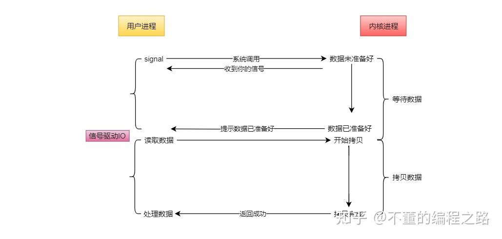

   特点：回调机制，实现、开发应用难度大；

##### 异步I/O

当进程发起一个IO操作，进程返回（不阻塞），但也不能返回果结；内核把整个IO处理完后，会通知进程结果。如果IO操作成功则进程直接获取到数据。

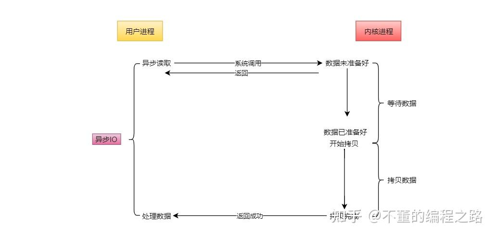

特点：

- 不阻塞，数据一步到位；Proactor模式；
- 需要操作系统的底层支持，LINUX 2.5 版本内核首现，2.6 版本产品的内核标准特性；
- 实现、开发应用难度大；
- 非常适合高性能高并发应用；


##### IO多路复用

- 多路: 多个socket网络连接
- 复用: 复用一个线程, 使用一个线程来检查多个文件描述符(socket)的就绪状态


大多数文件系统的默认IO操作都是缓存IO. 在Linux的缓存IO机制中，操作系统会将IO的数据缓存在文件系统的[页缓存](https://zhida.zhihu.com/search?content_id=169816432&content_type=Article&match_order=1&q=页缓存&zhida_source=entity)（page cache）。也就是说，数据会先被拷贝到操作系统内核的缓冲区中，然后才会从操作系统内核的缓存区拷贝到应用程序的地址空间中。这种做法的缺点就是，**需要在应用程序地址空间和内核进行多次拷贝，这些拷贝动作所带来的CPU以及内存开销是非常大的**。

至于为什么不能直接让磁盘控制器把数据送到应用程序的地址空间中呢？**最简单的一个原因就是应用程序不能直接操作底层硬件。**


##### 总结

1. 同步非阻塞与I/O多路复用区别

- 相同点：都通过轮询的方式尝试读取数据；不同的是 一个是由用户线程自己不断轮询，另一个是通过专用线程去轮询处理(专用线程数量可控)
- 同步非阻塞：用户线程不断轮询直到读取数据为止；这个过程中每个用户线程都是轮询读取，如果用户线程过多，耗费资源

- I/O多路复用：一般通过一个专用线程去轮询检查数据是否就绪，由于一个专用线程可以处理多个连接(channel通道)，也就称为I/O多路复用；Java NIO便是I/O多路复用的一个实现

2. 阻塞与非阻塞：指应用程序在发起 I/O 操作时，是立即返回还是等待

3. 同步与异步：指应用程序在与内核通信时，数据从内核空间到应用空间的拷贝，是由内核主动发起还是由应用程序来触发；内核主动发起则是异步，反之为同步


#### 网络IO进化史

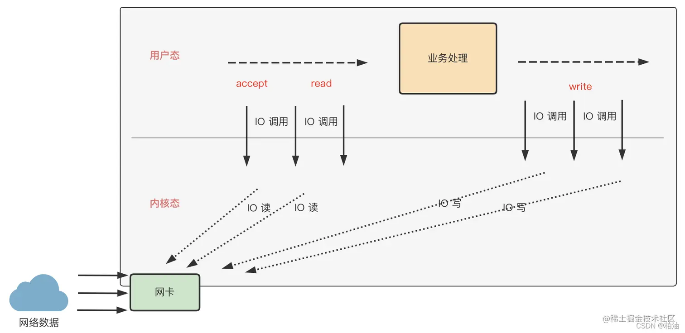

网络请求先后经历: 服务器网卡, 内核, 连接建立, 数据读取, 业务处理, 数据写回等.

其中，连接建立(accept)、数据读取(read)、数据写回(write)等操作都需要操作系统内核提供的系统调用，最终由内核与网卡进行数据交互，这些IO调用消耗一般是比较高的，比如 IO 等待、数据传输等。

#### 事件驱动

事件驱动核心: 以事件为连接点, 当有IO事件准备就绪时, 以事件的形式通知相关线程进行数据读写, 进而业务线程可以直接处理这些数据, 这一过程的后续操作方, 都是被动接收通知, 看起来有点像回调操作.


#### Reactor


Reactor模型核心是事件驱动,基于IO多路复用构建. 可以理解为Reactor模型中的反应器角色<u>类似</u>于事件转发器(Dispatcher)(承接连接建立, IO处理以及事件分发), 如下图

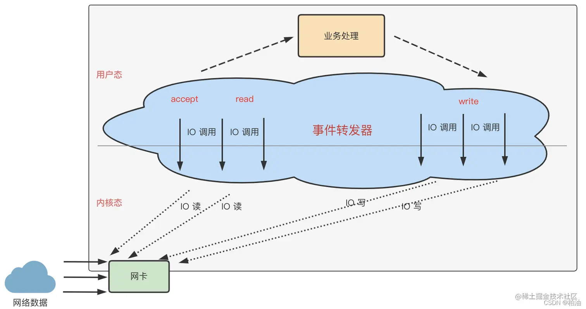

Reactor 模式由 `Reactor 线程`、`Handlers 处理器`两大角色组成，两大角色的职责分别如下：

- Reactor 线程的职责：主要负责连接建立、监听IO事件、IO事件读写以及将事件分发到Handlers 处理器。 
- Handlers 处理器（业务处理）的职责：非阻塞的执行业务处理逻辑。

多线程 Reactor 的演进分为两个方面：

- 升级 Handler。使用线程池去执行, 使一个Selector不会卡在一个handler上
- 升级 Reactor。可以考虑引入多个Selector

##### 0. 注意

**read也就是可读事件, 在监听套接字中一定是建连请求!!!**

**read也就是可读事件, 在监听套接字中一定是建连请求!!!**

**read也就是可读事件, 在监听套接字中一定是建连请求!!!**


##### 1.单线程模型

模型图如下： 

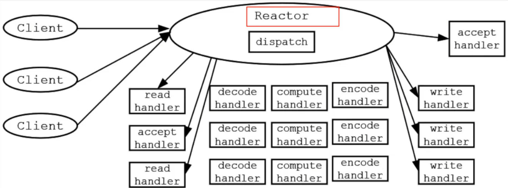

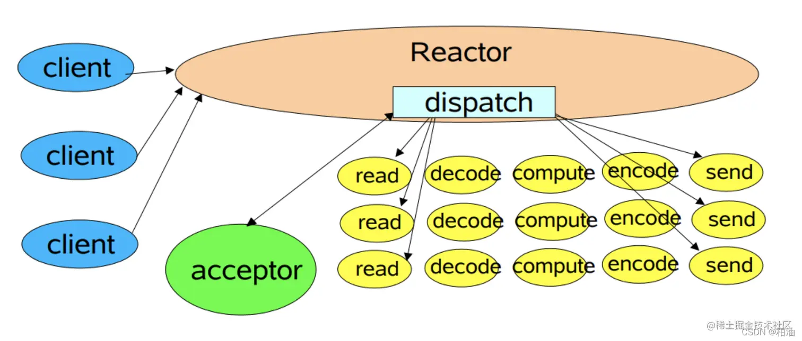

执行流程

1. **事件循环初始化**: 创建一个单线程的Reactor, 通常会注册一个Selector或epoll来监听I/O事件
2. **事件注册**: 服务器启动后, 将自己绑定到某个端口, 并注册为"accept事件", 等待客户端连接
3. **事件分发**: 一旦有I/O事件发生(如客户端连接, 读写操作), Reactor会从Selector中获取事件, 并调用相应的处理器(Handler)
4. **处理请求**: Handler执行处理逻辑, 包括读取客户端数据, 处理业务逻辑和发送响应. 因为是单线程, 所有操作都必须同步进行
5. **返回结果**: 将处理结果返回给客户端, 处理下一个事件

**优点**:  

- 结构简单, 适用于处理量不大, 请求处理时间短的场景

**缺点**:

- 因为所有I/O事件都在一个线程中完成, 若某个事件的处理时间较长, 会阻塞其他事件的处理, 导致性能瓶颈

在单线程 Reactor 模式中，Reactor 和 Handler 都在同一条线程中执行。这样，带来了一个问题：当其中某个 Handler 阻塞时，会导致其他所有的 Handler 都得不到执行。

在这种场景下，被阻塞的 Handler 不仅仅负责输入和输出处理的传输处理器，还包括负责新连接监听的 Acceptor 处理器，可能导致服务器无响应。这是一个非常严重的缺陷，导致单线程反应器模型在生产场景中使用得比较少。

##### 2.多线程模型


 由于单线程模型有性能方面的瓶颈，多线程模型作为解决方案就应运而生了。

Reactor 多线程模型将`业务逻辑`交给多个线程进行处理。除此之外，多线程模型其他的操作与单线程模型是类似的，比如<u>连接建立、IO事件读写以及事件分发</u>等都是由一个线程来完成。

当客户端有数据发送至服务端时，Select 会监听到可读事件，数据读取完毕后提交到业务线程池中并发处理。

一般的请求中，耗时最长的一般是业务处理，所以用一个线程池（worker 线程池）来处理业务操作，在性能上的提升也是非常可观的。

当然，这种模型也有明显缺点，连接建立、IO事件读取以及事件分发完全由单线程处理；比如当某个连接通过系统调用正在读取数据，此时相对于其他事件来说，完全是阻塞状态，新连接无法处理、其他连接的IO查询/IO读写以及事件分发都无法完成。

对于像 Nginx、Netty 这种对高性能、高并发要求极高的网络框架，这种模式便显得有些吃力了。因为，无法及时处理新连接、就绪的IO事件以及事件转发等。

>  主从多线程模型是如何解决这个问题的?
>
> 又增加一层工作Reactor, 主Reactor只负责连接建立

##### 3.主从多线程模型


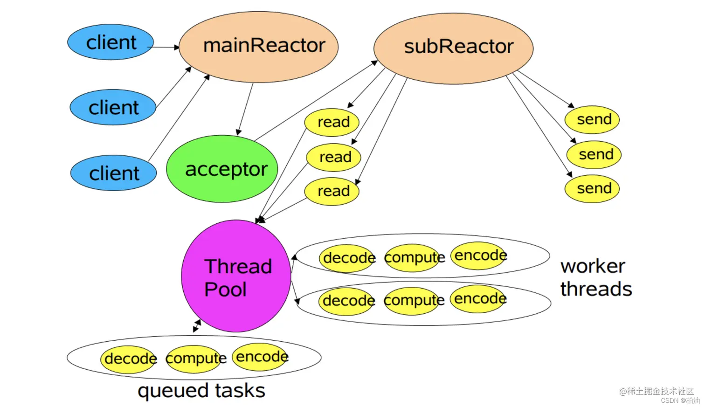 

**执行流程**:

1. **事件循环初始化**: 创建一个主Reactor线程, 用于监听accept事件. 主Reactor的Selector负责监听客户端的连接请求
2. **事件注册**: 主Reactor监听客户端连接请求, 并将连接的I/O事件注册到对应的工作线程的Selector上
3. **事件分发**: 当客户端连接建立后, 主Reactor将I/O操作交给工作线程(Sub Reactor)处理, 避免阻塞主线程
4. **处理请求**: 每个工作线程都有自己的Selector, 并独立处理其上注册的读写事件. 这样多个请求可以并行处理
5. **返回结果**: 处理完成后, 工作线程将结果返回给客户端, 同时继续监听新的I/O事件

让**唯一**的主线程负责 `accept()`，就彻底消除了多线程竞争的问题。`accept()`操作变成了一个无锁的、快速的串行过程，效率极高。


##### 总结

相信到这里，你已经很清楚 Reactor 模型扮演什么样的角色了。其核心是围绕`事件驱动`模型

- 一方面监听并处理IO事件。
- 另一方面将这些处理好的事件分发业务线程处理。

而几种 Reactor 模型的演进，不过是在这几个阶段中优化升级、层层递进。

我们再重点回顾多线程模式（`多线程模式`和`主从多线程模式`），其工作模式大致如下：

- 将负责数据传输处理的 IOHandler 处理器的执行放入独立的线程池中。这样，业务处理线程与负责新连接监听的反应器线程就能相互隔离，避免服务器的连接监听受到阻塞。
- 如果服务器为多核的 CPU，可以将反应器线程拆分为多个子反应器（SubReactor）线程；同时，引入多个选择器，并且为每一个SubReactor引入一个线程，一个线程负责一个选择器的事件轮询。这样充分释放了系统资源的能力，也大大提升了反应器管理大量连接或者监听大量传输通道的能力。


## 3 Redis事件驱动核心框架解析

接下来就展开分析一下 Redis 对 I/O 多路复用模块的封装。

正如前面在 epoll 示例中看到的，我们的程序代码其实是围绕 epoll 监听到的各种事件展开的，也就是我们常说的**事件驱动**。为了统一多种 IO 多路复用器的实现，Redis 构建了一个 **ae 库**，全称叫 `a simple event-driven programming library`，如下图所示：

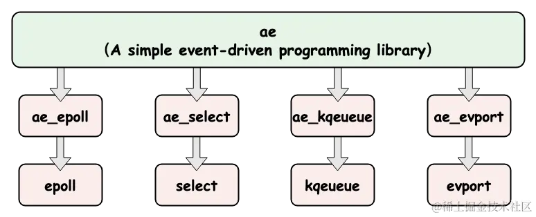

### 3.1 aeApiState解析

Redis**通过`aeApiState结构体`对epoll, select, kqueue, evport四种IO多路复用的实现进行了适配**, 让上层调用方感知不到不同系统在I/O多路复用实现上的差异性. 对上述四种 I/O 多路复用的适配分别对应 ae_epoll.c、ae_select.c、ae_kqueue.c、ae_evport.c 四个文件，后面我们依旧以最常用的 epoll 为例来介绍。

下面以epoll为例

```c
typedef struct aeApiState {
 int epfd; // epoll监听的内核注册表的文件描述符
 struct epoll_event *events; // 指向epoll_event缓冲区
} aeApiState;
```

接下来看 Redis 为 I/O 多路复用抽象出来的函数，**这些函数在每个对应的适配实现中都存在，类似于面向对象编程中的接口方法**。

- `aeApiCreate()`: 其核心功能是进行**初始化**。在 epoll 对应的实现中，会先<u>创建 aeApiStat 实例并记录到 eventLoop->apidata 字段</u>中，`eventLoop 是 Redis 事件驱动的核心结构体`，我们后面马上就会介绍。接下来初始化 aeApiStat->events 指向的 epoll_event 缓冲区（长度为 eventLoop->setsize 字段指定的长度），最后通过 epoll_create() 函数创建 epoll 专用文件描述符。
- `aeApiAddEvent(aeEventLoop *eventLoop, int fd, int mask)`: epoll_ctl()的封装, 添加(或修改)对fd的监听事件
- `aeApiDelEvent(aeEventLoop *eventLoop, int fd, int delmask)`: epoll_ctl()的封装
- `aeApiPoll(aeEventLoop *eventLoop, struct timeval *tvp)`: 调用epoll_wait()等待监听的事件发生, 当 epoll_wait() 函数返回的时候，已触发的事件会被存储到 aeApiState->events 缓冲区，紧接着会再次遍历 aeApiState->events 缓冲区将所有已触发事件转移到 eventLoop->fired 数组中（该数组中的元素是 aeFiredEvent 类型，其核心字段如下），后续在 aeEventLoop 事件循环中会处理 fired 数组。

```c
typedef struct aeFiredEvent {
 int fd; // 该事件关联的文件描述符
 int mask; // 触发的事件(AE_READABLE, AE_WRITABLE)
} aeFiredEvent;
```

另外，不同的 I/O 多路复用实现中使用的 mask 值也不同，例如，epoll 使用 EPOLLIN、EPOLLOUT 分别表示可读、可写事件，kqueue 中则使用 EVFILT_READ、EVFILT_WRITE。在 Redis 中`统一使用` AE_READABLE、AE_WRITABLE 两个宏来表示可读、可写事件，所以在调用上述接口函数时传入的 mask 参数都是 `AE_READABLE`、`AE_WRITABLE`。


### 3.2 aeEventLoop 结构体

Redis 中的事件可以分为两大类：一类就是上面介绍的**网络读写事件**（也被称为文件事件，毕竟 Linux 中的网络连接都是使用文件描述符表示的）；另一类事件是**时间事件**，也就是 Redis 中定时触发的事件，比如说 Redis 定时去检查 Key 是不是已经过期了。

**Redis 是通过事件循环 `aeEventLoop` 来统一处理网络事件和时间事件的。**

**fired**指针和**timeEventHead**指针, 分别维护了网络事件队列的头节点和时间事件队列的头节点.

```c
typedef struct aeEventLoop {
    int maxfd; // 当前注册的文件描述符的最大值
    int setsize; // 能够注册的文件描述符个数上限
    // 用于计算时间事件的唯一标识
    long long timeEventNextId; 
    // events指向了一个网络事件数组，记录了已经注册的网络事件，数组长度为setsize
    aeFileEvent *events; 
    // fired数组记录了被触发的网络事件
    aeFiredEvent *fired; 
    // timeEventHead指向了时间事件链表的头节点
    aeTimeEvent *timeEventHead;
    // 停止的标识符，设置为1表示aeEventLoop事件循环已停止
    int stop;
    // Redis在不同平台会使用4种不同的I/O多路复用模型（evport、epoll、kueue、select），
    // apidata字段是对这四种模型的进一步封装，指向aeApiState一个实例
    void *apidata;
    // Redis主线程阻塞等待网络事件时，会在阻塞之前调用beforesleep函数，
    // 在被唤醒之后调用aftersleep函数
    aeBeforeSleepProc *beforesleep;
    aeBeforeSleepProc *aftersleep;
    int flags;
} aeEventLoop;
```

- **aeFileEvent**结构体: 抽象了一个**网络事件**, 其中维护了监听的事件以及处理相应事件的函数指针

```c
typedef struct aeFileEvent {
 // 事件掩码，用来记录发生的事件，
 // 可选标志位为AE_READABLE(1)、AE_WRITABLE(2)、AE_BARRIER(4)
 int mask;
 // 如果发生可读事件，会调用rfileProc指向的函数进行处理
 aeFileProc *rfileProc;
 // 如果发生可写事件，会调用wfileProc指向的函数进行处理
 aeFileProc *wfileProc;
 // 指向对应的客户端对象
 void *clientData;
} aeFileEvent;
```

- **aeTimeEvent**结构体: 抽象了一个**时间事件**

```c
typedef struct aeTimeEvent {
    long long id; // 唯一标识，通过eventLoop->timeEventNextId字段计算得来
    monotime when; // 时间事件触发的时间戳（微秒级别）
    aeTimeProc *timeProc; // 处理该时间事件的函数
    aeEventFinalizerProc *finalizerProc; // 删除时间事件之前会调用该函数
    void *clientData; // 该时间事件关联的客户端实例
    struct aeTimeEvent *prev; // 前后指针
    struct aeTimeEvent *next;
    // 当前时间事件被引用的次数，要释放该aeTimeEvent实例，需要refcount为0
    int refcount; 
} aeTimeEvent;
```

### 3.3 aeCreateEventLoop, listenToPort

**初始化aeEventLoop** 

在 Redis 服务器启动时，会走 initServer() 函数，里面会调用 aeCreateEventLoop() 函数：

```c
server.el = aeCreateEventLoop(server.maxclients+CONFIG_FDSET_INCR);
```

在 aeCreateEventLoop() 函数中会初始化 aeEventLoop 实例的各个参数:

1. 其中的 **setsize** 参数设置为 maxclients + 128（预留），也就是说 aeEventLoop 中的 events 和 fired 字段指向的数组都是这个大小。
2. 同时，还会将 events 数组中所有 aeFileEvent 的 **mask** 字段初始化为 AE_NONE，表示不监听任何事件。

接下来，Redis 会调用 `listenToPort(server.port, &server.ipfd)` 函数监听指定的地址，底层依赖 socket()、bind(）、listen() 等网络编程库实现，并通过 fcntl() 函数将所有 Socket 设置为非阻塞。

```c
// 监听指定地址: 和指定地址建立连接, 并把对应socket接口的fd存入sfd, 在下文中createSocketAcceptHandler会把它们加入监听
int listenToPort(int port, socketFds *sfd) {
    int j;
    //指向 Redis 配置中 bind指令设置的地址数组（如 bind 127.0.0.1 192.168.1.1）
    char **bindaddr = server.bindaddr;
    if (server.bindaddr_count == 0) return C_OK; // 边界检查
    for (j = 0; j < server.bindaddr_count; j++) {
        char* addr = bindaddr[j];
        // 如果地址以 -开头（如 -127.0.0.1），表示该地址是可选的。
        // 即如果绑定这个地址失败，不会导致整个 Redis 启动失败，只是跳过这个地址并记录日志。
        // addr++用于跳过 -符号，获取真正的地址。
        int optional = *addr == '-'; 
        if (optional) addr++;
        if (strchr(addr,':')) { // 对IPv6地址的处理
            sfd->fd[sfd->count] = anetTcp6Server(server.neterr,port,addr,server.tcp_backlog);
        } else {  // 对IPv4地址的处理
            sfd->fd[sfd->count] = anetTcpServer(server.neterr,port,addr,server.tcp_backlog);
        }
        if (sfd->fd[sfd->count] == ANET_ERR) {
            ... // 省略异常处理逻辑
        }
        if (server.socket_mark_id > 0) anetSetSockMarkId(NULL, sfd->fd[sfd->count], server.socket_mark_id);
        // 设置成非阻塞
        anetNonBlock(NULL,sfd->fd[sfd->count]);
        anetCloexec(sfd->fd[sfd->count]);
        sfd->count++;
    }
    return C_OK;
}
```

Redis 里面把 TCP Socket 编程的一些工具方法写到了 anet.c 文件里面，对这一部分感兴趣的小伙伴们可以去看看该文件的具体内容，这里就不再展示了。

注意这个 listenToPort() 函数的两个参数：第一个 server.port 就是我们在 redis.conf 配置文件中 port 配置项指定的端口号，默认是 6379；第二个 server.ipdf 是一个 socketFds 实例，其中记录了当前这个 Redis Server 每个监听地址对应的文件描述符，也就是我们在 redis.conf 配置文件中，bind 字段指定监听的 IP 地址。

```c
typedef struct socketFds {
    int fd[CONFIG_BINDADDR_MAX]; // 记录了每个监听地址对应的文件描述符
    int count;  // fd数组的个数
} socketFds;
```


### 3.4 createSocketAcceptHandler

**注册监听**

在 initServer() 初始化中，完成 aeCreateEventLoop() 调用之后 ，Redis 还会调用 `createSocketAcceptHandler(&server.ipfd, acceptTcpHandler)` 函数为 ipdf 中所有地址注册监听，最底层依赖 aeApiAddEvent() 函数实现，调用关系如下图所示：

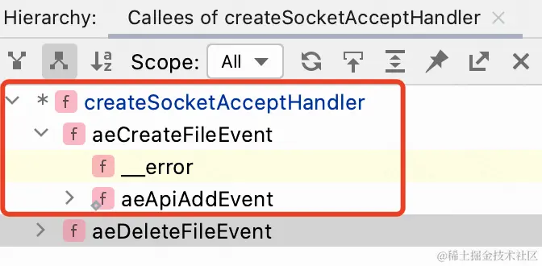

aeApiAddEvent() 函数我们在前面介绍 ae 库的时候已经说过了，就是用来添加监听事件。

这里还要注意的是，图中的 aeCreateFileEvent() 函数会将 acceptTcpHandler() 函数作为可读事件的处理函数记录到 ipfd 中所有文件描述符对应的 aeFileEvent 中，相关代码片段如下：

```c
int createSocketAcceptHandler(socketFds *sfd, aeFileProc *accept_handler){
    int j;
    for (j = 0; j < sfd->count; j++) {
        // 监听每个文件描述符上的可读事件
        if (aeCreateFileEvent(server.el, sfd->fd[j], AE_READABLE, 
              accept_handler, NULL) == AE_ERR) { // ...省略错误处理
        }
    }
    return C_OK;
}

int aeCreateFileEvent(aeEventLoop *eventLoop, int fd, int mask,
        aeFileProc *proc, void *clientData) {
    // 检查fd是否超过了aeEventLoop->setsize这个上限值
    aeFileEvent *fe = &eventLoop->events[fd];
    // 底层通过具体的I/O多路复用注册要监听的事件，例如，epoll_ctl()函数
    if (aeApiAddEvent(eventLoop, fd, mask) == -1)
        return AE_ERR;
    fe->mask |= mask;
    // 根据监听的事件，记录对应的处理函数
    if (mask & AE_READABLE) fe->rfileProc = proc;
    if (mask & AE_WRITABLE) fe->wfileProc = proc;
    fe->clientData = clientData;
    // 省略其他检查逻辑
    return AE_OK;
} 
```


### 3.5 aeProcessEvents()

`int aeProcessEvents(aeEventLoop *eventLoop, int flags)`

随着 initServer() 函数的调用完成，上述操作也会一并完成，ae 库里面最基础的东西都已经初始化好了。这个时候，Redis 已经可以做好了在 bind 地址上的监听，可以接收客户端的建连请求了。接下来，Redis 在 main() 函数会调用 aeMain() 函数，其中会<u>循环调用 aeProcessEvents() 函数来处理网络事件和时间事件</u>，**它也是 Redis 处理事件驱动的框架逻辑所在**。

这里首先关注 aeProcessEvents() 函数的第二个参数 flags，我们可以通过指定 flags 的值，控制 aeProcessEvents() 需要处理的事件类型，相关的取值如下：


下面是 flags 参数中标志位的具体含义。

- flags 参数为 0 时，aeProcessEvents() 函数不会执行任何逻辑，直接返回。
- 包含了 AE_FILE_EVENTS、AE_TIME_EVENTS、AE_ALL_EVENTS 标志位的时候，aeProcessEvents() 函数会分别处理网络事件、时间事件或者“网络事件+时间事件”。
- 包含 AE_DONT_WAIT 标志位的时候，aeProcessEvents() 函数在处理完能处理的事件之后，会立即返回，不会进行等待。
- 包含 AE_CALL_AFTER_SLEEP、AE_CALL_BEFORE_SLEEP 标志位时，aeProcessEvents() 函数在调用 aeApiPoll() 阻塞等待网络事件之前、之后，会分别执行 aeEventLoop 的 beforesleep/aftersleep 回调函数。

在 aeMain() 中使用的 flags 参数设置了AE_ALL_EVENTS、AE_CALL_BEFORE_SLEEP、 AE_CALL_AFTER_SLEEP 三个标记位，我们以此为例来看 aeProcessEvents() 函数的核心逻辑。

1. 因为要包含 AE_ALL_EVENTS 标记，这里的 aeProcessEvents() 调用是需要处理时间事件的，它会通过 usUntilEarliestTimer() 函数遍历时间事件链表，也就是前面介绍的 aeEventLoop->timeEventHead 指针，它指向时间事件列表的头节点，这个列表里的时间事件是无序的，所以 usUntilEarliestTimer() 会<u>遍历</u>整个列表，才能找到距离当前最近的、即将要触发的时间事件。

2. 接下来，因为包含 AE_CALL_BEFORE_SLEEP 标记位，aeProcessEvents() 会调用 aeEventLoop->beforesleep 函数，其中具体做了什么事情，后面我们会详细展开分析，这里小伙伴们可以先不必深入研究。

3. 然后，就是 aeProcessEvents() 函数**最核心一个操作 —— 调用 aeApiPoll() 函数**，阻塞监听文件事件。这里阻塞的超时时长，就是第一步中计算出来的、距离最近时间事件的时间差。

4. 在 aeApiPoll() 函数返回之后， aeProcessEvents() 还会调用 aftersleep() 函数，它一般与前面说的 beforesleep() 函数成对出现，做一些后置处理。aftersleep() 函数的内容我们放到后面的小节详细介绍。

5. 接下来我们要聚焦于网络事件的处理逻辑。首先要明确，在 aeApiPoll() 函数返回的时候，只可能是两个原因中的一个：要么是注册的 Socket 发生了我们监听的事件，要么是超时时间到了。如果是第一个原因的话，aeApiPoll() 函数返回就会返回监听到的事件个数，下面我们就可以开始处理 aeEventLoop->fired 数组中记录的事件了。

   默认情况下，这里会先处理一个 Socket 上的可读事件，也就是调用对应 aeFileEvent 的 rfileProc 函数，然后处理连接上的可写事件，也就是调用对应 aeFileEvent 的 wfileProc 函数。

   这里有个逻辑需要单独说明一下，前文介绍 aeFileEvent 中 mask 字段时提到，其中可以设置我们关注的事件，还可以设置一个 AE_BARRIER 标志位，它的功能就是`让可读、可写事件的处理顺序翻转，也就是先处理可写事件，再处理可读事件`。至于读写顺序为什么翻转，我们会在后面举例介绍，下面是这段处理网络事件的逻辑：

```c
    for (j = 0; j < numevents; j++) {
        int fd = eventLoop->fired[j].fd;
        aeFileEvent *fe = &eventLoop->events[fd];
        int mask = eventLoop->fired[j].mask;
        int fired = 0; 
        // 检查AE_BARRIER标志
        int invert = fe->mask & AE_BARRIER;

        if (!invert && fe->mask & mask & AE_READABLE) { 
            // 正常情况先会调用rfileProc函数处理可读事件
            fe->rfileProc(eventLoop,fd,fe->clientData,mask);
            fired++;
            fe = &eventLoop->events[fd];
        }
        
        if (fe->mask & mask & AE_WRITABLE) { 
            if (!fired || fe->wfileProc != fe->rfileProc) {
                // 调用wfileProc函数处理可写事件
                fe->wfileProc(eventLoop,fd,fe->clientData,mask);
                fired++;
            }
        }

        if (invert) { // 如果设置了AE_BARRIER标志，就会先处理可写时间，再处理可读事件
            fe = &eventLoop->events[fd]; 
            if ((fe->mask & mask & AE_READABLE) &&
                (!fired || fe->wfileProc != fe->rfileProc))
            {
                fe->rfileProc(eventLoop,fd,fe->clientData,mask);
                fired++;
            }
        }
        processed++;
    }
```

6. 完成网络事件的处理之后，aeProcessEvents() 紧接着会调用 processTimeEvents() 函数处理到期的时间事件。后面我们将单独拿出一节来介绍 Redis 中有哪些时间事件、各个时间事件触发的时机等相关细节，这里重点还是关注 processTimeEvents() 函数的实现框架。

**processTimeEvents() 函数的核心逻辑就是从 aeEventLoop->timeEventHead 链表里面，找到已经到期的时间事件，并进行处理**。在遍历 timeEventHead 链表的 while 循环里，我们看到了两个分支。

```c
  static int processTimeEvents(aeEventLoop *eventLoop) {
      int processed = 0;
      aeTimeEvent *te;
      long long maxId;
      te = eventLoop->timeEventHead;
      maxId = eventLoop->timeEventNextId-1;
      monotime now = getMonotonicUs();
      while(te) {
          long long id;
          // 时间事件已经被删除
          if (te->id == AE_DELETED_EVENT_ID) {
              aeTimeEvent *next = te->next;
              if (te->refcount) { // 是否还被引用，如果还被引用，则会被暂时忽略
                  te = next;
                  continue;
              }
              // 下面是链表删除的逻辑
              if (te->prev) 
                  te->prev->next = te->next;
              else
                  eventLoop->timeEventHead = te->next;
              if (te->next)
                  te->next->prev = te->prev;
              // 如果有finalizerProc函数，需要调一下，进行一些释放前的处理
              if (te->finalizerProc) { 
                  te->finalizerProc(eventLoop, te->clientData);
                  now = getMonotonicUs();
              }
              zfree(te);
              te = next;
              continue;
          }

          if (te->id > maxId) {
              te = te->next;
              continue;
          }

          if (te->when <= now) { // 与当前时间戳比较，决定是否触发该时间事件
              int retval;
              id = te->id;
              te->refcount++;
              // 触发事件
              retval = te->timeProc(eventLoop, id, te->clientData);
              te->refcount--;
              processed++;
              now = getMonotonicUs();
              if (retval != AE_NOMORE) { // 更新下次触发的时间戳
                  te->when = now + retval * 1000;
              } else { // 之后不再触发该事件
                  te->id = AE_DELETED_EVENT_ID;
              }
          }
          te = te->next;
      }
      return processed;
  }
  
```

在第一个 if 分支里面，Redis 会去检查每个 aeTimeEvent 元素的 id 值是否为 AE_DELETED_EVENT_ID（具体值是 -1 ），且 refcount 为 0，如果满足这两个条件，表示该时间事件之后不会再触发，且没有被其他逻辑使用，此时就可以将该 aeTimeEvent 元素从链表中删除并释放掉，删除的时候，还会调用 finalizerProc() 回调函数进行一些释放前的处理。

第二个分支里面，检查每个 aeTimeEvent 元素是否已到期，如果已到期，则触发其 timeProc 回调函数。timeProc() 函数返回的是一个 int 值，表示该时间事件下次的触发时间：如果返回 -1，我们就认为该时间事件是一次性的，之后不会再触发，此时就要将其 id 设置为 -1，等待之后再次遍历 timeEventHead 链表的时候删除；否则，更新其 when 字段，等待下次触发。

### 3.6 总结

在这一节中，我们重点介绍了 Redis 事件驱动框架（ae 库）的核心实现。

- 首先，我们深入分析了 ae 库的设计理念；

- 然后以 Linux 平台为例，分析了 aeApiState 结构体的实现；

- 接下来分析了 Redis 中对网络事件（`aeFileEvent`）以及时间事件（`aeTimeEvent`）的抽象，以及处理事件的抽象 —— aeEventLoop 结构体；

- 最后，我们深入剖析了 aeEventLoop 初始化、注册监听以及处理事件的核心逻辑。

在接下来的几节中，我将带领小伙伴们深入分析 Redis 的建连、读写请求处理以及响应返回的核心实现，在这个过程中，小伙伴们也会对 Redis 的事件驱动逻辑有更深的理解。

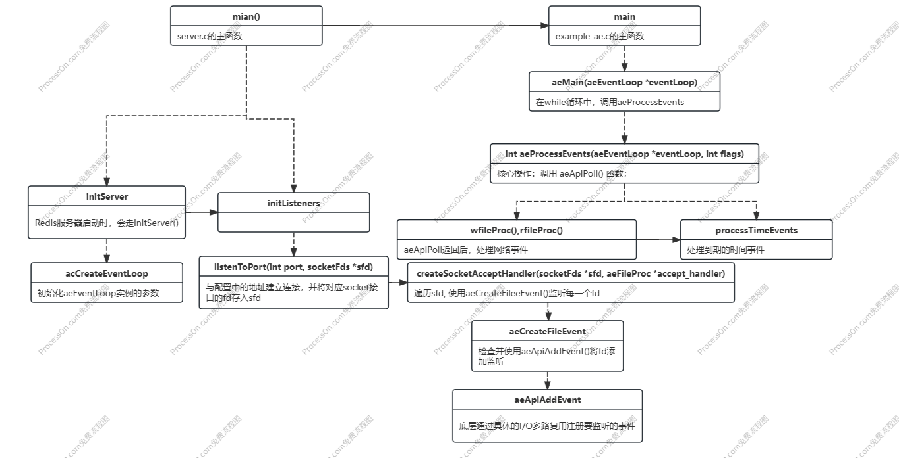

## 4 网络建连逻辑

通过前面两节的介绍，Redis 对网络事件、时间事件这两种事件的抽象和核心处理框架，我们已经都有所了解了。但是，我们现在还有几个细节部分是缺失的，例如：

- Redis 通过 initServer() 之后，已经在 6379 端口号上进行监听了，那 Redis 客户端发来建连请求的时候，Redis Server 是如何处理的呢？
- Redis 客户端与 Redis Server 创建连接成功之后，这些新建连接又是如何再注册到 I/O 多路复用模块上的呢？上面这两个问题呢，都可以在之前注册的 acceptTcpHandler() 回调函数中找到对应的答案。
- 客户端与 Redis Server 建连之后，必然是要执行命令的，前面介绍 Redis 线程模型的时候也说过，这些命令是由 IO 线程读取并解析的，具体的解析逻辑是什么样的？解析的命令是怎么交给主线程执行的呢？主线程执行完命令之后，是怎么把返回值交给 IO 线程的？IO 线程又是怎么返回到 Redis 客户端的呢？

上面这些问题我们将用接下来四节的篇幅，全部说清楚，并且在说明这些问题的时候，也会将之前留的坑填好，比如说：

- aeFileEvent 中的 rfileProc 和 wfileProc 字段都指向了哪些处理函数？
- 在 aeProcessEvents() 函数中回调的 beforesleep、aftersleep 函数具体做了什么事情呢？


### 4.0 建连流程

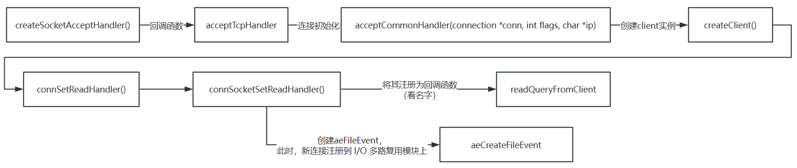


### 4.1 建连请求处理入口

通过上一节的介绍我们知道，Redis 初始化完成之后，默认就会在 6379 端口号上进行监听可读事件，也就是客户端发来的建连请求。在初始化中，createSocketAcceptHandler() 函数在注册监听的时候，只监听了可读事件，还会将 acceptTcpHandler() 函数作为处理可读事件的回调函数，记录到对应 aeFileEvent 事件的 rfileProc 字段中，wfileProc 字段没有初始化。这样的话，`处理客户端建连请求的逻辑我们就找到了，就是 acceptTcpHandler() 函数`。

下面我们就展开看一下 acceptTcpHandler() 函数，其核心是一个 while 循环，里面会处理连接建立请求，具体代码如下：

```c
void acceptTcpHandler(aeEventLoop *el, int fd, void *privdata, int mask) {

    // cport用于存储端口，cfd用于存储新建连接对应的文件描述符

    int cport, cfd, max = 1000; 

    char cip[NET_IP_STR_LEN]; // 存储ip地址的缓冲器

    while(max--) { // 可能存在多个客户端的建连请求，所以需要一直循环

        // anetTcpAccept()底层先通过accept()创建连接，然后通过inet_ntop()

        // 以及ntohs()等函数将ip和端口信息写入到cip和cport返回，

        // 同时anetTcpAccept()函数的返回值就是新建连接对应的文件描述符

        cfd = anetTcpAccept(server.neterr, fd, cip, sizeof(cip), 

                  &cport);

        if (cfd == -1) { return; } // 全部建连请求处理完毕，返回

        anetCloexec(cfd); // 设置FD_CLOEXEC标识

        // 先通过connCreateAcceptedSocket()创建connection实例表示新建的网络

        // 连接，然后使用acceptCommonHandler()进行初始化

        acceptCommonHandler(connCreateAcceptedSocket(cfd),0,cip);

    }

}
```

anetTcpAccept() 函数是在 anet.c 文件中的工具类，里面主要是依赖 accept()、inet_ntop()、ntohs() 等系统调用，上面的注释也解释清楚了其核心功能，这里不再展开分析。

### 4.2 connection 与 connectionType详解

`connCreateAcceptedSocket()`: 它里面会创建一个connection实例, 这个connection的fd字段指向我们新键连接对应的文件描述符. **connection结构体是Redis对一个网络连接的抽象**.

```c
struct connection {

    // 当前网络连接的类型，其中记录了非常多的回调函数，下面会展开介绍

    ConnectionType *type; 

    // 当前连接所处的状态，例如，在acceptTcpHandler()函数中刚刚创建的连接

    // 初始化为CONN_STATE_ACCEPTING状态，后续建连完成之后就切换为

    // CONN_STATE_CONNECTED状态。

    ConnectionState state; 

    short int flags; // 标识符

    short int refs; // 当前连接被引用的次数

    int last_errno; // 最后一次发生的错误码

    // 当前连接关联的信息，该字段指向客户端对应的client实例

    void *private_data; 

    // 下面是该连接在connect、read、write截断的回调函数，其实，aeFileEvent中的

    // rfileProc、wfileProc两个字段指向的就是read_handler、write_handler这两个函数

    ConnectionCallbackFunc conn_handler;

    ConnectionCallbackFunc write_handler;

    ConnectionCallbackFunc read_handler;

    int fd; // 该连接对应的文件描述符

};
```

```c
typedef struct ConnectionType {

    // 前面说createSocketAcceptHandler()的时候，aeFileEvent里面有rfileProc

    // 指向了acceptHandler这个函数，wfileProc指向null。而与客户端建连的connection

    // 里面，无论是监听可读事件还是可写事件，都是用这个ae_handler函数作为处理函数，也就是

    // 注册的aeFileEvent的rfileProc、wfileProc指针都指向这个ae_handler函数

    void (*ae_handler)(struct aeEventLoop *el, int fd, void *clientData, 

            int mask);

            

    // 封装了处理发起连接的逻辑，主要是作为客户端的时候用，比如说从库主动连接主库

    int (*connect)(struct connection *conn, const char *addr, int port,

            const char *source_addr, ConnectionCallbackFunc connect_handler);

            

    // 封装了从连接读取数据，以及向连接中写入数据的函数。这里的writev函数底层调用了Linux的

    // writev()，可以一次向Socket写入多块连续不同的buffer空间，可以减少系统调用的次数

    int (*write)(struct connection *conn, const void *data, size_t data_len);

    int (*writev)(struct connection *conn, const struct iovec *iov, 

            int iovcnt);

    int (*read)(struct connection *conn, void *buf, size_t buf_len);

    

    // 封装了Server处理建连请求的逻辑

    int (*accept)(struct connection *conn, 

            ConnectionCallbackFunc accept_handler);

    void (*close)(struct connection *conn);

    // 用于设置connection中的读写回调函数，也就是write_handler、read_handler函数

    int (*set_write_handler)(struct connection *conn, 

            ConnectionCallbackFunc handler, int barrier);

    int (*set_read_handler)(struct connection *conn, 

            ConnectionCallbackFunc handler);

    const char *(*get_last_error)(struct connection *conn);

    ... // 下面是阻塞版本的读写函数以及connect函数(略)

    

} ConnectionType;
```

这里先帮小伙伴们梳理一下 ConnectionType->ae_handler、connection. write_handler 和 read_handler 以及 aeFileEvent->rfileProc 和 wfileProc 之间的关系，读写请求关键调用链如下图所示：

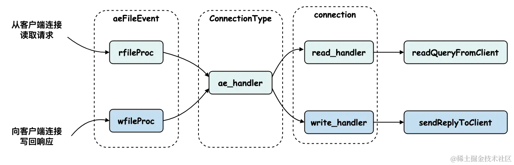

可以看到，在读取客户端请求的时候，触发的是 rfileProc 函数，它实际指向的 ConnectionType->ae_handler 函数，其中会调用 connection.read_hander 指针指向的函数，也就是 readQueryFromClient() 函数。Redis Server 向连接写回数据的时候，也是类似的调用链，这里就不再多说了。

### 4.3 连接初始化

说完 connection 以及 ConnectionType 这两个核心结构体之后，我们继续回到建连流程分析。在为新建连接创建完对应的 connection 实例之后，再来看 `acceptCommonHandler() 函数`，其核心操作以及详细的说明如下：

```c
static void acceptCommonHandler(connection *conn, int flags, char *ip) {

    client *c;

    char conninfo[100];

    UNUSED(ip);

    ... // 检查connection状态是否处于CONN_STATE_ACCEPTING(略)


    ... // 检查当前连接数是否已经达到server.maxclients指定的连接上限，这里的

    // maxclients是当前Redis实例与客户端以及集群其他实例之间的总连接数。(略)


    // 调用createClient()创建一个client实例，并注册监听新建连接的可读事件，

    // 对应的处理函数为ae_handler。同时将readQueryFromClient注册为

    // ConnectionType实例的set_read_handler回调函数，从名字可以看出，

    // readQueryFromClient函数可以读取客户端发来的请求数据。client实例创建

    // 完成之后，会被添加到当前Redis实例的客户端链表中，等待后续使用。

    if ((c = createClient(conn)) == NULL) {

        connClose(conn);

        return;

    }

    c->flags |= flags;


    // 这里有点绕，connAccept()函数会调用conn->type->accept()函数，

    // CT_Socket.accept字段指向的是connSocketAccept函数，该函数会将连接状态切

    // 换为CONN_STATE_CONNECTED状态，并直接调用传入的clientAcceptHandler

    // clientAcceptHandler()函数中并没有什么有用的功能，这里不展开

    if (connAccept(conn, clientAcceptHandler) == C_ERR) {

        ... // 省略错误处理逻辑

        return;

    }

}
```

我们先展开介绍一下 `createClient() 函数`，它创建 client 实例的步骤如下。

首先，创建一个 client 实例，并对 client 和 connection 进行一系列设置。比如，给 client 初始化一个 id，这个 id 是通过 server.next_client_id 字段的原子操作递增得到的，小伙伴们可以将它理解成 Java 里面的 AtomicLong；将新建连接设置为非阻塞的；将 client 的 conn 字段指向 connection 实例，将 connection.private_data 指向 client 实例，**两者就绑定起来了**。


之后，就是调用 CT_Socket->set_read_handler，也就是 connSocketSetReadHandler() 函数。它里面主要做了以下两件事。

- 一件事是将连接注册到 I/O 多路复用模块上，并监听可读事件，可读事件的处理函数注册为 CT_Socket->ae_handler 这个函数指针，当前这个流程里面指向的实际就是 connSocketEventHandler() 函数。
- 另一件事是将 readQueryFromClient() 函数注册为 connection 实例的 read_handler 回调函数，从名字可以看出，readQueryFromClient 函数可以读取客户端发来的请求数据。这样设置完之后，就符合我们前面给出的“读写请求关键调用链图”了。

完成上述初始化操作之后，Redis 就会将这个初始化好的 client 实例添加到客户端链表里面。注意，这里有`两个列表`：一个是 redisServer.clients 这个 adlist 链表，新建的 client 实例会加到链表末尾；另一个是 redisServer.clients_index，它是一个 rax 树，其中的 key 是 client 的 id 值，对应的 value 值是 client 实例的指针，通过这棵 rax 树，我们就可以按照 id 值迅速查找对应的 client 实例了。

下面是 createClient() 函数的核心代码片段：

```c
client *createClient(connection *conn) {

    client *c = zmalloc(sizeof(client)); // 创建client实例


    if (conn) { // 对新建连接进行一些列配置

        connNonBlock(conn); // 将连接设置为非阻塞

        connEnableTcpNoDelay(conn); // 设置TCP_NODELAY

        if (server.tcpkeepalive)

            connKeepAlive(conn,server.tcpkeepalive); // 设置keeplive

        // 调用CT_Socket->set_read_handler回调函数

        connSetReadHandler(conn, readQueryFromClient); 

        // 设置connection->private_data，与client绑定

        connSetPrivateData(conn, c); 

    }


    selectDb(c,0); // 默认使用0号DB

    uint64_t client_id; 

    atomicGetIncr(server.next_client_id, client_id, 1); // 自增生成client.id

    c->id = client_id;

    ... // 初始化client实例的各个字段(略)

    if (conn) linkClient(c); // 将client记录到server.clients列表中

    return c;

}
```

小伙伴们可能没看到新连接注册到 I/O 多路复用模块上的操作，其实这部分操作在 CT_Socket->set_read_handler 指向的 connSocketSetReadHandler() 函数中，入口位置是上面的 connSetReadHandler() 函数。下面是 `connSocketSetReadHandler() 函数`的核心代码片段和关键注释：

```c
static int connSocketSetReadHandler(connection *conn, 

      ConnectionCallbackFunc func) {

    ... // 省略检查

    // 设置read_handler这个函数指针，这里会指向readQueryFromClient()函数

    conn->read_handler = func; 

    if (!conn->read_handler) // 未设置read_handler就不再监听可读事件

        aeDeleteFileEvent(server.el,conn->fd,AE_READABLE);

    else 

        // 下面创建相应的aeFileEvent实例，并开始监听可读事件，

        // 监听到可读事件的回调是ae_handler这个函数，这里其实指向的就是

        // connSocketEventHandler()函数

        if (aeCreateFileEvent(server.el,conn->fd, AE_READABLE,

            conn->type->ae_handler,conn) == AE_ERR) return C_ERR;

    return C_OK;

}
```

建连过程的最后一步，也是 acceptTcpHandler() 函数的最后一步，是调用 conn->type->accept() 这个函数指针，实际就是调用 connSocketAccept() 函数。它里面会切换 connection 的状态，从初始化时候的 ACCEPTING 切换成 CONNECTED 状态。另外，这里还会回调 clientAcceptHandler()函数，其中没有什么特别关键的逻辑，这里就不展开分析了。

### 4.4 总结

这一节中，我们重点介绍了 Redis Server 网络层建连的流程。首先，我和小伙伴们一起找到了建连请求的处理入口；然后分析了建连过程中，使用到的 connection 以及 connectionType 结构体，介绍了其中涉及到的设计模式；最后，讲解了连接初始化过程中 connection 以及 client 的初始化。

下一节，我们将介绍建连之后，Redis Server 读取请求的逻辑。


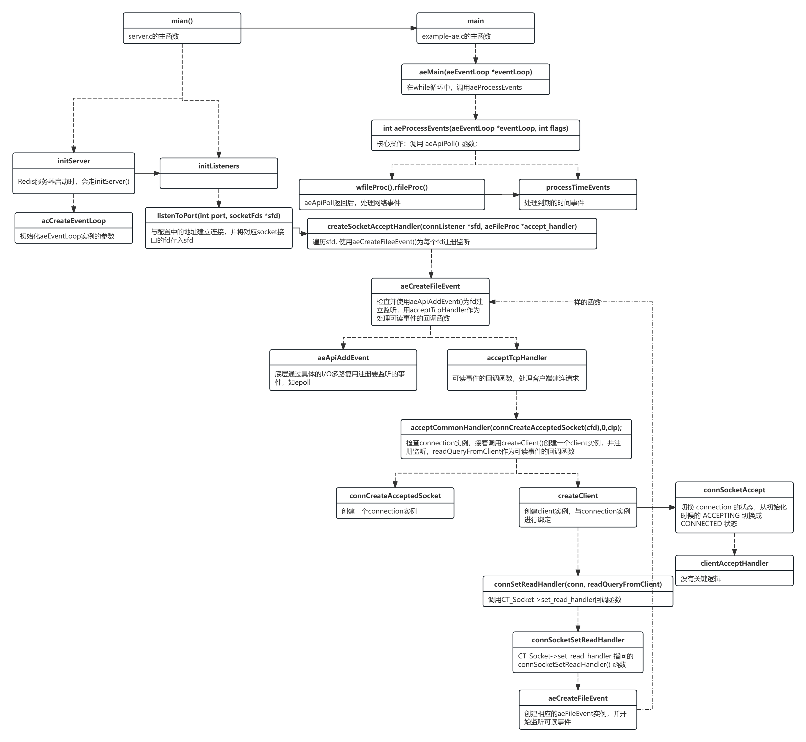

## 5. 读取与请求核心

通过上一节的介绍，我们已经了解了 Redis 在收到客户端建连请求时的核心处理逻辑。在建连成功之后，会封装相应的 connection 以及 client 对象，还会在 IO 多路复用器上注册可读事件的监听，为读取客户端发来的请求做好准备。

这一节，我们就重点来看 Redis 是如何`读取`和`解析`客户端发来的请求。

### 5.1 connSocketEventHandler() 与 readQueryFromClient()

在 Redis 客户端发来请求的时候，相应的底层连接会触发可读事件，通过上一节对建连过程的分析我们知道，客户端连接上可读事件的处理函数是 CT_Sokcet->ae_handler，它实际指向了 `connSocketEventHandler() 函数`。这也是我们本节第一个要介绍的函数。

connSocketEventHandler() 函数里可以同时处理可读事件和可写事件，默认会先处理可读事件，然后再处理可写事件。调用方可以在 connection->flags 字段中设置 `CONN_FLAG_WRITE_BARRIER` 标志位，来翻转可读可写事件的处理顺序，这与第 28 讲《内核解析篇：Redis 事件驱动核心框架解析》中介绍的 aeProcessEvents() 函数以及 AE_BARRIER 标志位有点类似。下面是相关核心代码：

```c
static void connSocketEventHandler(struct aeEventLoop *el, int fd, void *clientData, int mask)
{
    connection *conn = clientData;
    ... // 省略对connection状态的检查
    // 检查CONN_FLAG_WRITE_BARRIER标志位
    int invert = conn->flags & CONN_FLAG_WRITE_BARRIER;
    int call_write = (mask & AE_WRITABLE) && conn->write_handler;
    int call_read = (mask & AE_READABLE) && conn->read_handler;
    if (!invert && call_read) { // 正常顺序是先处理可读事件
        if (!callHandler(conn, conn->read_handler)) return;
    }
    if (call_write) { // 处理可写事件
        if (!callHandler(conn, conn->write_handler)) return;
    }
    if (invert && call_read) { 
        // 存在CONN_FLAG_WRITE_BARRIER标志的时候，先处理可写事件，再处理可读事件
        if (!callHandler(conn, conn->read_handler)) return;
    }
}
```

我们先来看可读事件的处理，从前面介绍的建连流程里面我们知道，connection->read_handler 指向的实际就是 `readQueryFromClient() 函数`。

readQueryFromClient() 中的**第一步就是调用 postponeClientRead() 函数**，从函数名里面的 postpone 单词，大概可以推测出它会进行**延迟读取**，那怎么延迟读取数据呢？其实，只有在 Redis 开启**多线程模式**之后，这个延迟读取才生效，postponeClientRead() 会将可读事件的client添加到redisServer.clients_pending_read队列里面，然后由IO线程消费该队列，完成请求的读取和解析。这相较于单线程模式直接在主线程完成请求的读取和解析，多线程模式下这种，主线程通过队列可读事件分配给 IO 线程进行处理的行为，就是前面说的“延迟读取”了。

下面来看 `postponeClientRead() 函数`的核心逻辑和分析：

```c
int postponeClientRead(client *c) {
    if (server.io_threads_active && // 是否开启了多线程模式
        server.io_threads_do_reads && // 是否使用IO线程读取和解析请求
         !ProcessingEventsWhileBlocked && // 默认为0
        !(c->flags & (CLIENT_MASTER|CLIENT_SLAVE|CLIENT_BLOCKED)) &&
        // 检查io_threads_op这个全局变量，此时IO线程全部空闲，执行到这里的一定是主线程
        io_threads_op == IO_THREADS_OP_IDLE) 
    {
        // 将client追加到server.clients_pending_read列表中，
        // 等待I/O线程去处理
        listAddNodeHead(server.clients_pending_read,c);
        // 记录当前client在clients_pending_read列表中关联的节点，要是client的空间被释放，
        // 也需要把这个节点的空间释放掉
        c->pending_read_list_node = listFirst(server.clients_pending_read);
        return 1;
        
    } else {
        return 0;
    }
}
```


### 5.2 启动IO多线程

Redis 6 版本已经推出一段时间了，很多线上 Redis 服务也已经升级到了 Redis 6 并开启了 IO 多线程的能力，从我自己的使用角度来看，的确性能提升非常大。既然这样，我们就按照 IO 多线程的模式，继续分析客户端请求的读取逻辑。

前面说到了，Redis 主线程会将可读事件延迟分配给 IO 线程进行处理。在继续分析 IO 线程是如何读取和解析客户端请求之前，我们先要了解一下 Redis IO 多线程的基础内容。

首先来看一下 redisServer 结构体中与 I/O 线程相关的字段：

```c
struct redisServer {
    // 创建多少个IO线程，由io-threads配置指定，默认值为1，即表示不开启
    // 多线程模式，只使用一个主线程来处理所有IO，取值范围在1到128之间
    int io_threads_num;      
    int io_threads_do_reads; // 是否使用IO线程处理可读事件
    int io_threads_active; // 是否有IO线程可用
}
```

除了 redisServer 的这三个字段之外，还有几个比较重要的全局变量：

```c
// io_threads数组中的元素是IO线程
pthread_t io_threads[IO_THREADS_MAX_NUM];

// io_threads_mutex数组中记录了io_threads数组中对应IO线程的锁
pthread_mutex_t io_threads_mutex[IO_THREADS_MAX_NUM];

// io_threads_list中每个元素都是一个列表，列表中存储的都是处理的client实例，
// io_threads中的IO线程会处理io_threads_list中对应下标的client列表
list *io_threads_list[IO_THREADS_MAX_NUM];

// io_threads_pending数组中记录了每个线程等待处理的clients个数，
// 即io_threads_list数组中对应待处理的clients列表长度
// 注意，后续分析中会看到主线程和IO线程都会读写该数组中的值，所以其中每个元素的
// 读写都使用atomicSetWithSync、atomicGetWithSync两个宏进行操作，保证每
// 次读写都是原子操作
redisAtomic unsigned long io_threads_pending[IO_THREADS_MAX_NUM];

// 用来标识当前队列中待处理的事件是可读事件还是可写事件，也可以把IO线程以及主线程划分为三个状态
// 可选值为IO_THREADS_OP_READ、IO_THREADS_OP_WRITE、IO_THREADS_OP_IDLE
// IO_THREADS_OP_READ表示所有IO线程以及主线程在处理可读事件，当前队列中待处理的事件都是可读事件
// IO_THREADS_OP_WRITE表示所有IO线程以及主线程在处理可写事件，当前队列中待处理的事件都是可写事件
// IO_THREADS_OP_IDLE表示所有IO线程空闲，此时主线程在执行命令
int io_threads_op;
```

介绍完基础的数据结构之后，我们再来看 IO 多线程相关的初始化逻辑。在 Redis Server 启动的最后，会**调用 `initThreadedIO() 函数`创建 IO 线程**，调用关系链如下图所示：

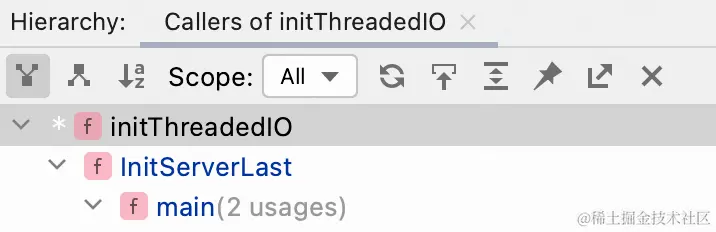

initThreadedIO() 函数的逻辑也不是很复杂，它的**核心逻辑**是根据 redis.config 文件中 io-threads 配置的 IO 线程数，初始化对应数量的 IO 线程数。注意`两个特殊值`，一个是 io-threads 配置成 1 的时候，表示不开启 IO 多线程，退化成了 Redis 6 之前的状态，也就是只通过主线程读取和解析请求；另一个是 io-threads 配置项上限值是 128，一旦超过 128，会直接报错。

在 initThreadedIO() 函数里面，除了创建 IO 的线程之外，还会初始化每个 IO 线程对应的锁、client 列表以及待处理 client 个数等一系列相关的配套结构。下面是 initThreadedIO() 函数的核心逻辑以及关键部分的注释：

```c
void initThreadedIO(void) {
    server.io_threads_active = 0; // IO线程当前不可用
    // 如果io_threads_num为1时，表示不开启多线程模式，只使用主线程处理所有IO
    if (server.io_threads_num == 1) return;
    // 检查io_threads_num配置是否超过128这个上限值(略)

    // 循环创建IO线程，并初始化io_threads_list数组中对应的client列表
    for (int i = 0; i < server.io_threads_num; i++) {
        // 初始化该线程对应的client列表
        io_threads_list[i] = listCreate();
        // 创建IO线程以及IO线程对应的锁
        pthread_t tid;
        pthread_mutex_init(&io_threads_mutex[i],NULL);
        // 将线程在io_threads_pending数组中的对应值初始化为0
        setIOPendingCount(i, 0);
        // 主线程获取所有IO线程关联的锁，IO线程执行的逻辑里面，也会去抢自己的锁，
        // 这就会导致所有IO线程阻塞住
        pthread_mutex_lock(&io_threads_mutex[i]); 
        // 初始化IO线程，IO线程执行的逻辑封装在IOThreadMain()函数中，
        // 并将IO线程编号i作为参数传入
        if (pthread_create(&tid,NULL,IOThreadMain,
              (void*)(long)i) != 0) { ... // 发生异常结束}
        io_threads[i] = tid; // 将新建IO线程记录到io_threads数组中
    }
}
```

完成初始化之后，我们看到了主线程拿到了每个 IO 线程关联的锁，后面我们会看到的 IO 线程执行的逻辑里面，也会去抢自己关联的锁，这就会导致 IO 线程全部阻塞住，那 `Redis 在何时释放这些锁，让 IO 线程跑起来呢？`

我们在[第 28 讲《内核解析篇：Redis 事件驱动核心框架解析》](https://juejin.cn/book/7144917657089736743/section/7147529834703847465)中介绍 aeEventLoop 结构体的时候提到，每次处理网络事件之前，都会调用 aeEventLoop->beforesleep 指向的函数，也就是 beforeSleep() 函数。如下图调用链所示，**beforeSleep() 底层调用的 startThreadedIO() 函数就是释放 IO 线程锁，让 IO 线程跑起来的地方**，同时，它里面还会将 io_threads_active 字段设置成 1，表示当前 I/O 线程已经可用。


下面是 startThreadIO() 函数以及调用的关键代码片段：

```c
int handleClientsWithPendingWritesUsingThreads(void) {
    ... // 省略其他逻辑
    // 通过io_threads配置决定当前是IO多线程模式，还是单线程模式
    if (server.io_threads_num == 1 || stopThreadedIOIfNeeded()) {
        return handleClientsWithPendingWrites();
    }
    // 通过io_threads_active字段方式多次调用startThreadedIO()函数
    if (!server.io_threads_active) startThreadedIO();
    ... // 省略其他逻辑
}

void startThreadedIO(void) {
    serverAssert(server.io_threads_active == 0);
    for (int j = 1; j < server.io_threads_num; j++) 
        pthread_mutex_unlock(&io_threads_mutex[j]); // 释放所有IO线程的锁
    server.io_threads_active = 1; // 设置io_threads_active为1，表示IO线程已经可用
}
```

到此为止，Redis 中的 IO 线程都已经跑起来了。下面我们就要来看 IO 线程里面具体在执行哪些逻辑。

在初始化 IO 线程的时候，其实我们就已经指定了每个 IO 线程都是执行 IOThreadMain() 函数，它里面是一个 while 循环，等待关联的 client 列表中会有出现可处理的事件，具体是处理可读事件，还是处理可写事件，是由 io_threads_op 这个全局变量控制的。下面是 `IOThreadMain() 函数`的核心代码：

```c
void *IOThreadMain(void *myid) {
    // 在pthread_create()函数传入的第四个参数，也就是IO线程编号
    long id = (unsigned long)myid;
    while(1) { // 死循环，持续处理事件
        for (int j = 0; j < 1000000; j++) { // 自旋等待可处理的client出现
            if (getIOPendingCount(id) != 0) break;
        }
        if (getIOPendingCount(id) == 0) {
            // 这里会尝试获取io_threads_mutex中对应的锁，如果主线程要暂停IO线程，
            // 主线程可以获取IO线程对应的锁，从而让IO线程阻塞等待锁
            pthread_mutex_lock(&io_threads_mutex[id]);
            pthread_mutex_unlock(&io_threads_mutex[id]);
            continue;
        }
        listIter li;
        listNode *ln;
        listRewind(io_threads_list[id],&li);
        // 迭代当前IO线程在io_threads_list数组中对应的client列表，
        // 并根据其io_threads_op这个全局变量调用相应的函数处理可读或可写事件
        while((ln = listNext(&li))) {
            client *c = listNodeValue(ln);
            if (io_threads_op == IO_THREADS_OP_WRITE) {
                writeToClient(c,0); // 处理可写事件
            } else if (io_threads_op == IO_THREADS_OP_READ) {
                readQueryFromClient(c->conn); // 处理可读事件
            } else { ... // 不支持其他事件，这里会输出错误日志 }
        }
        listEmpty(io_threads_list[id]);
        setIOPendingCount(id, 0); // 将当前IO线程负责的待处理连接数清零
    }
}
```

小伙伴们可能会发现一个断片的地方，我们在前面 postponeClientRead() 转发可读事件的时候，明明是把 client 实例写进了 redisServer.clients_pending_read 队列的啊，IO 线程则是从各自关联的 io_threads_list 列表里面取 client 实例，这能行吗？

这当然不行！下面我们就来看看这些 client 实例是如何从 clients_pending_read 队列分配给各个 IO 线程的（也就是进入 IO 线程关联的 io_threads_list 列表里面的）。

### 5.3 可读事件的分配

根据前文介绍，每个 IO 线程处理可读事件时都是从 io_threads_list 数组中获取其对应的待处理 client 列表，那 io_threads_list 数组中的待处理列表是何时填充的呢？

这个过程是在 handleClientsWithPendingReadsUsingThreads() 函数中完成的，而这个函数是在 aeEventLoop->beforeSleep 函数中被调用的，如下图所示：


这里又要涉及到[第 28 讲《内核解析篇：Redis 事件驱动核心框架解析》](https://juejin.cn/book/7144917657089736743/section/7147529834703847465)中提到的 aeEventLoop->beforeSleep 字段了，它指向的是 beforeSleep() 函数。在主线程每次进入 aeApiPoll() 函数阻塞等待可读可写事件之前，都会调用这个 beforeSleep() 函数。

下面我们来看 `handleClientsWithPendingReadsUsingThreads() 函数`的核心逻辑。

1. handleClientsWithPendingReadsUsingThreads() 函数首先会检查 IO 线程是否已激活，检查 redisServer.clients_pending_read 列表中是否存在等待读取的 client，这些 client 都是由主线程上次调用 readQueryFromClient() 函数时填充的。如果满足这两个条件，才会继续执行下面的逻辑，把这些 client 分配到各个 IO 线程关联的 io_threads_list 队列中。
2. 接下来，迭代 clients_pending_read 列表，使用 Round-Robin 算法将 clients_pending_read 列表中的可读连接分配给每个 IO 线程，也就是分配到 io_threads_list 数组的对应列表中，核心代码片段如下：

```c
listIter li;
listNode *ln;
// 初始化li迭代器，用来迭代redisServer.clients_pending_read这个adlist列表
listRewind(server.clients_pending_read,&li); 
int item_id = 0;
while((ln = listNext(&li))) {
    client *c = listNodeValue(ln);
    int target_id = item_id % server.io_threads_num; // 计算目标IO线程的编号
    // 将client添加到各个IO线程关联的io_threads_list队列中
    listAddNodeTail(io_threads_list[target_id],c); 
    item_id++;
}
```

3. 接下来，设置 io_threads_op 全局标识为 IO_THREADS_OP_READ，用来告诉 IO 线程此次处理的全部都是可读事件。同时，还会设置每个 IO 线程要处理的连接数，也就是为每个 IO 线程设置 io_threads_pending 数组中对应元素值，用来告诉每个 IO 线程此次的工作量，这也会让 IO 线程跳出自旋等待逻辑的关键。

到此为止，redisServer.clients_pending_read 队列中的 client 就被分配到了各个 IO 线程的 io_threads_list 之中。

4. 随后，各个 IO 线程就会开始读取自己负责的 io_threads_list，也就是前文介绍的 IOThreadMain() 的逻辑，这里不再重复。与此同时，主线程也不会闲着，它会处理 io_threads_list[0] 这个列表中的可读连接，主线程也就是通过 readQueryFrom() 函数读取并解析请求的。

```c
listRewind(io_threads_list[0],&li); // 初始化io_threads_list[0]这个列表的迭代器
while((ln = listNext(&li))) {
    client *c = listNodeValue(ln);
    // 主线程也是调用readQueryFromClient()处理io_threads_list[0]中的每个client来的请求
    readQueryFromClient(c->conn); 
}
listEmpty(io_threads_list[0]);
```

5. 主线程在完成 io_threads_list[0] 列表的处理之后，会阻塞等待全部 IO 线程完成自己负责的读取任务。

6. 待主线程阻塞结束，也就是说明所有 IO 线程的读取操作都完成了。主线程下面就会开始清理 redisServer.clients_pending_read 队列中的数据，表示这个 client 没有请求要处理了。

   在这个清理过程中，同时会调用 processPendingCommandAndInputBuffer() 函数执行解析好的命令。

下面这张图很好地总结了 `handleClientsWithPendingReadsUsingThreads() 函数`协调主线程和 IO 线程处理可读事件的过程：

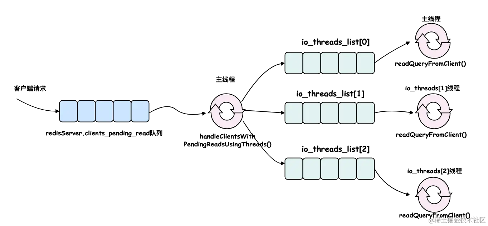


### 5.4 再探readQueryFromClient

通过前文分析我们可以知道，无论是单线程模型主线程处理可读事件，还是多线程模型下 IO 线程处理可读事件，都是通过 readQueryFromClient() 函数实现的。前面还说过，在 IO 多线程模式下，主线程首次调用 readQueryFromClient() 函数时，会通过 postponeClientRead() 把可读事件延迟到 IO 线程进行处理，也就是发生可读事件的 client 添加到 server.clients_pending_read 中，在 I/O 线程再次调用 readQueryFromClient() 函数时，就不会再执行 postponeClientRead() 中的延迟逻辑，而是 readQueryFromClient() 后续的、真正的读取数据。

好，我们下面来看 `readQueryFromClient() 函数`里面读取客户端请求的核心逻辑。

1. 准备缓冲区。每个 client 都关联了一个 querybuf 缓冲区（sds 类型）用来读取数据，同时还维护了一个 querybuf_peak 字段用来记录 querybuf 缓冲区的峰值大小，相关代码片段如下：

   ```c
    qblen = sdslen(c->querybuf); // qblen记录了querybuf的长度
    // 更新querybuf缓冲区的峰值大小
    if (c->querybuf_peak < qblen) c->querybuf_peak = qblen;
    // 准备client->querybuf缓冲区，用来接收读取到的数据
    c->querybuf = sdsMakeRoomFor(c->querybuf, readlen);
    // readlen默认16k，也就是说每次读取时，querybuf缓冲区至少有16k的空闲空间可使用
   ```

2. 执行 read() 系统调用，将网络连接中的数据读取到 querybuf 缓冲区中。

   ```c
    // 调用connection->read指向的connSocketRead()函数，从该连接
    // 中读取数据到querybuf中。底层执行的就是read()系统调用
    int nread = connRead(c->conn, c->querybuf+qblen, readlen);
   ```

3. 读取完成后，更新 querybuf 缓冲区大小，以及一些统计信息。

   ```c
    sdsIncrLen(c->querybuf,nread); // 更新querybuf已用长度
    c->lastinteraction = server.unixtime; // 更新client最后一次交互时间
    if (c->flags & CLIENT_MASTER) c->read_reploff += nread; // 主从统计信息
    // 更新Redis实例读取数据量的统计
    atomicIncr(server.stat_net_input_bytes, nread);
    if (sdslen(c->querybuf) > server.client_max_querybuf_len) {
      ... // querybuf缓冲区超过上限，打印警告日志，释放缓冲区以及client，结束调用
    }
   ```

4. 最后执行 processInputBuffer() 函数。在 processInputBuffer() 函数中封装了解析 Redis 命令的入口以及 Redis 命令执行的入口。但是注意，在 I/O 线程中只会完成命令解析，不会真正执行命令。

### 5.5 一图流

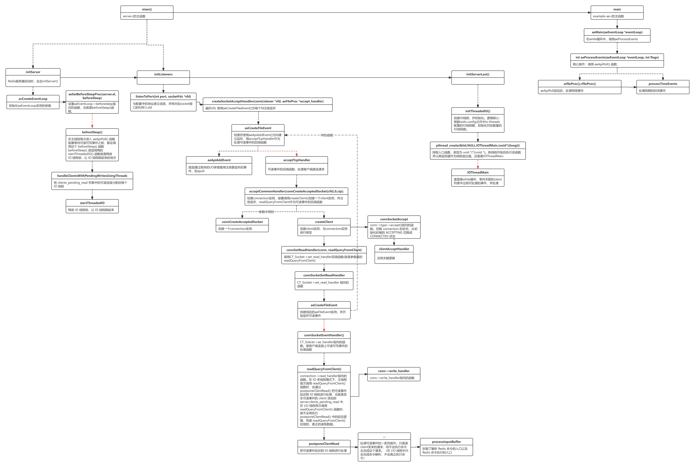


## 6. 命令解析与执行

在上一节中，我们详细分析了 IO 线程的一些内容以及 readQueryFromClient() 函数的逻辑，这些都是我们理解 Redis 多线程模式下读取客户端请求核心所在。

在 readQueryFromClient() 函数中读取到 client->querybuf 缓冲区的都是一个个的字节，Redis Server 接下来要做的就是，**把这个 byte 数组中的内容，按照一定的规则，解析成 Redis Server 能够理解的命令**。这部分逻辑就是在 readQueryFromClient() 函数最后调用的 `processInputBuffer() 函数`中完成的。

### 6.1 RESP协议基础知识

不过，在开始 processInputBuffer() 函数的介绍之前，我们需要先说一些 Redis 命令解析的基础知识。

**第一个基础知识点是 Redis 客户端的请求类型**，对应的是 client->reqtype 字段，它有两个可选值 PROTO_REQ_INLINE、PROTO_REQ_MULTIBULK。其中，INLINE 是内联请求类型，一般是 Telnet 这种客户端发出来的请求，会使用 INLINE 类型的请求；MULTIBULK 是协议请求类型，我们用的 redis-cli 客户端、Lettuce 客户端发送的都是 MULTIBULK 类型的请求。

**第二个知识点是 RESP 协议**。RESP 协议是客户端与 Redis Server 进行交互的基础协议，小伙伴们可以把它理解成客户端和 Redis Server 沟通的一种语言，比如汉语、英语，只有两边都说同一种语言，才能正常交互，RESP 协议现在有 v2 和 v3 两个版本。这两个版本的 RESP 协议的完整描述参考下面这两个链接。

- RESP v2 协议：[github.com/redis/redis…](https://link.juejin.cn/?target=https%3A%2F%2Fgithub.com%2Fredis%2Fredis-specifications%2Fblob%2Fmaster%2Fprotocol%2FRESP2.md)
- RESP v3 协议：[github.com/redis/redis…](https://link.juejin.cn/?target=https%3A%2F%2Fgithub.com%2Fredis%2Fredis-specifications%2Fblob%2Fmaster%2Fprotocol%2FRESP3.md)

对大多数小伙伴们来说，通读这两个版本的 RESP 协议，可能是一件非常枯燥、无趣且耗时的事情。为了减轻小伙伴们的痛苦呢，下面我们就结合几个示例，一起来分析一下 RESP 2 和 RESP 3 里面常见的一些内容。

无论是 RESP 2 还是 RESP 3 里面，客户端都是以字符串数组的形式把命令以及命令参数等信息发到 Redis Server，大概的格式如下：

```c
*<number of arguments> \r\n
$<number of bytes of argument 1> \r\n
<argument data> \r\n
...
$<number of bytes of argument N> \r\n
<argument data> \r\n
```

在 Redis 客户端发送“SET testKey testValue” 这条请求的时候，实际上发送的是：`*3\r\n$3\r\nSET\r\n$7\r\ntestKey\r\n$9\r\ntestValue\r\n` 。

其中，`*` 表示一个 Array（数组）的开头，Array 是 RESP 中定义的一种类型，`*` 后面需要紧跟数组的长度，然后后面再跟数组的具体元素，每个元素都可以是下面四种类型的一种。

- Simple String 表示的是一个非二进制安全字符串，里面不能携带 `\r\n` 这些字符，所以说是非二进制安全的。Simple String 使用 “+” 开头，后面紧跟具体的字符串内容。
- Error 表示的是一个非二进制安全的错误信息。其实，Error 和 Simple String 差不多，唯一的区别就是：Error 是以 “-” 这个字符开头的。
- Integer 表示的是一个整数，它的第一个字符是“:”，后面紧跟具体的整数值。
- Bulk String 表示的是一个二进制安全的字符串，它由两行构成，第一行以“$”字符开头，后面紧跟字符串长度，然后 `\r\n` 结束；第二行就是具体的字符串内容，然后也是以 `\r\n` 结束。

经过上面的介绍，我们就大概知道“SET testKey testValue”这条请求的换分方式了，如下图所示：

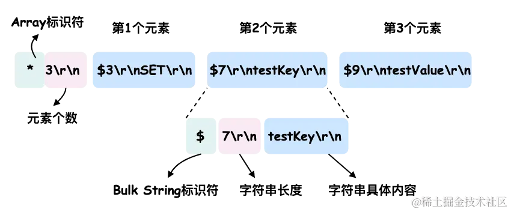

上面这些数据类型，在 RESP 2 中其实就已经支持了，在 RESP 3 中也是兼容的。在 Redis 6 中为了支持客户端缓存，也为了让 RESP 的语义更加丰富，引入了 RESP 3 协议。在 Redis 6 中，redis-cli 客户端默认还是 RESP 2 协议，我们可以使用 HELLO 命令查看当前客户端使用的 RESP 协议版本：

```c
127.0.0.1:6379> hello
 1) "server"
 2) "redis"
 3) "version"
 4) "7.0.0"
 5) "proto"
 6) (integer) 2 // 这里就是当前使用的RESP版本
... // 省略后续输出
```

我们可以执行 HELLO 3 命令将当前客户端切换到 RESP 3 协议，如下，不仅返回的 proto 值变了，整个输出格式也都变了：

```c
127.0.0.1:6379> hello 3
1# "server" => "redis"
2# "version" => "7.0.0"
3# "proto" => (integer) 3 // 这里就是当前使用的RESP版本
... // 省略后续输出
```

RESP 3 协议不仅兼容了 RESP 2 中的数据类型，还新增了十多种的数据类型。这里结合几个例子来介绍一下 RESP 3 中的新类型，比如，在 RESP 3 中引入了 Map 这种新类型，它的格式如下：

```c
*<number of key-value> \r\n
<key-type><key> \r\n
<value-type><value> \r\n
<key-type><key> \r\n
<value-type><value> \r\n
```

假设我们在 Redis 里面存储了一个叫 testMap 的哈希表结构，用 JSON 表示其具体内容的话，是下面这样一段 JSON：

```json
{
    "name":"kouzhao",
    "age":2
}
```

我们用 HGETALL 命令查询 testMap 中全部键值对的时候，会返回下图展示的结构。其中，“%” 表示一个 Map 类型的结构，后面紧跟键值对的个数，然后依次是各组键值对，每个 Key 和 Value 都是 Bulk String 类型的值。

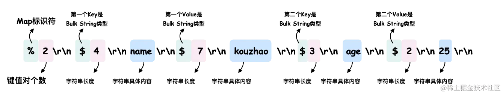

再比如说，我们在 Redis 里面存储了一个叫 testZset 的有序集合，用 JSON 表示其具体内容的话，是下面这段 JSON：

```json
[
    [
        "first" ,
        1
    ],
    [
        "second" ,
        2
    ]
]
```

我们用 `ZRANGE testZSet 0 -1 WITHSCORES` 命令查询 testZset 中全部元素以及 score 值的时候，会返回下图展示的结构。其中需要注意的是，Double 类型使用 “,” 开头。

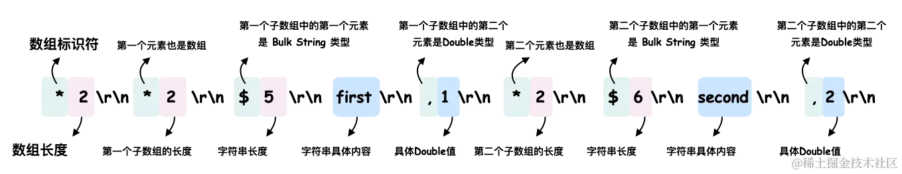

RESP 3 中除了引入 Map、Double 这两个新类型之外，还引入了 Set、Attribute、Push、NULL、Stream String，等等。这里我们就不再一一展开介绍了，想要深入了解 RESP 3 协议中所有新类型的小伙伴，可以参考[这篇文档](https://link.juejin.cn/?target=https%3A%2F%2Fgithub.com%2Fredis%2Fredis-specifications%2Fblob%2Fmaster%2Fprotocol%2FRESP3.md)。

### 6.2 命令解析

介绍完 Redis 命令解析的前置基础之后，我们就可以开始详细讲解命令解析的逻辑了。

正如前文所述，**processInputBuffer() 函数是命令解析和命令执行的入口，其中会通过一个 while 循环不停地解析命令，直到把 client->querybuf 缓冲区中所有的命令处理完**，下面是其核心流程图：

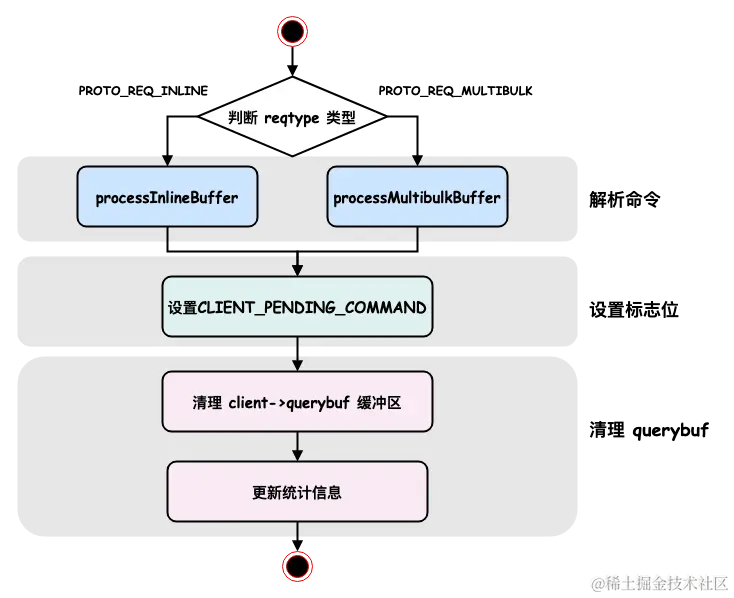

下面是 processInputBuffer() 函数的核心代码和注释：

```c
void processInputBuffer(client *c) {
    // qb_pos字段用来记录querybuf的读取位置
    while(c->qb_pos < sdslen(c->querybuf)) { 
        ... // 忽略其他异常处理逻辑
        if (!c->reqtype) {
            // reqtype字段指定了该客户端发出的请求协议类型
            if (c->querybuf[c->qb_pos] == '*') {
                c->reqtype = PROTO_REQ_MULTIBULK;
            } else {
                c->reqtype = PROTO_REQ_INLINE;
            }
        }
        // 不同协议类型走不同的命令解析函数
        if (c->reqtype == PROTO_REQ_INLINE) { 
            if (processInlineBuffer(c) != C_OK) break; 
            ... // 省略非核心逻辑
        } else if (c->reqtype == PROTO_REQ_MULTIBULK) {
            if (processMultibulkBuffer(c) != C_OK) break;
        } else { // 未知请求类型，输出日志并结束进程 }

        // 在IO线程读取请求的时候，io_threads_op这个全局变量的值是IO_THREADS_OP_READ，
        // 所以正常解析请求的时候，一定会走进下面的分支。里面会给client添加
        // CLIENT_PENDING_COMMAND标志位，表示该client中有一条待执行的命令，
        // 同时，里面的break会结束当前这条命令的解析过程
        if (io_threads_op != IO_THREADS_OP_IDLE) {
            serverAssert(io_threads_op == IO_THREADS_OP_READ);
            c->flags |= CLIENT_PENDING_COMMAND;
            break;
        }
        // 因为上面CLIENT_PENDING_READ标记为的处理，IO线程中不会执行到这里
        if (processCommandAndResetClient(c) == C_ERR) { return; }
    }
    ... // 省略了针对主从复制对querybuf复用的一些优化逻辑，这个优化点在主从复制的小节里面再说
    if (c->qb_pos) { // 将已经解析的命令从querybuf缓冲区中删除
        sdsrange(c->querybuf,c->qb_pos,-1);
        c->qb_pos = 0; // 重置qb_pos
    }
}
```

我们在实际生产中，使用最多的还是 redis-cli 以及 Lettuce 这类客户端，所以这里我们重点关注 MULTIBULK 请求的解析流程，也就是 `processMultibulkBuffer() 函数`。

首先，processMultibulkBuffer() 会读取请求中第一行，确定数组中有多少个，相应的代码片段如下：

```c
// multibulklen字段用来记录此次multibulk请求中剩余要读取的参数个数，
// 此时是0，表示还未初始化，我们要读取第一行数据
if (c->multibulklen == 0) {
    // 在querybuf缓冲区中搜索'\r'这个分隔字符
    newline = strchr(c->querybuf+c->qb_pos,'\r');
    ... // 省略异常处理
    // 将第一行数据转换成整数，并记录到multibulklen这个字段中
    ok = string2ll(c->querybuf+1+c->qb_pos,
              newline-(c->querybuf+1+c->qb_pos),&ll);
    c->multibulklen = ll; 
    c->qb_pos = (newline-c->querybuf)+2; // 后移qb_pos值
    // argv字段用来记录解析后的参数
    c->argv_len = min(c->multibulklen, 1024);
    c->argv = zmalloc(sizeof(robj*)*c->multibulklen);
    c->argv_len_sum = 0; // argv_len_sum字段用来记录请求参数解析后的总长度
}
```

确定元素个数之后， processMultibulkBuffer() 会开始逐个解析数组中的元素。根据 RESP 协议，请求中每个数组元素都是 Bulk String 类型，这里会一个个数组元素进行解析。我们以第一个元素的解析为例：

- 首先是读取第一个元素的第一行，确定它是以 “$” 字符开头的，然后通过这行的数字，也就确定了这个字符串的具体长度，该长度值会记录到 client->bulklen 字段中；
- 然后，根据字符串长度，读取第二行，拿到字符串的具体内容，并对请求进行解析。

下面是 processMultibulkBuffer() 函数解析请求的核心代码片段，其中删除了很多不重要的分支，只保留了最关键的逻辑：

```c
while(c->multibulklen) {
    // bulklen字段记录当前bulk的长度，为-1时表示未初始化，
    // 需要我们读取当前bulk的第一行进行初始化
    if (c->bulklen == -1) { 
         // 从qb_pos位置开始，查找querybuf缓冲区中的第一个'\r'分隔符。
         newline = strchr(c->querybuf+c->qb_pos,'\r');
         if (c->querybuf[c->qb_pos] != '$') {...} // 如果不是以"$"开头，直接抛异常
         // 读取这一行中的数字，也就是该元素的字符串的长度
         ok = string2ll(c->querybuf+c->qb_pos+1,
                 newline-(c->querybuf+c->qb_pos+1),&ll);
        c->bulklen = ll; // 字符串长度记录到client->bulklen字段中
    }
    
    // 下面开始读取字符串的具体内容
    if (sdslen(c->querybuf)-c->qb_pos < (size_t)(c->bulklen+2)) {
        // querybuf缓冲区中数据不足以构造当前元素，
        // 则停止读取，等待连接下次可读事件
        break;
    } else {
        // 解析字符串的具体内容，得到对应的robj对象，并记录到argv数组中。
        // 这里使用的argc字段用来记录请求中元素个数
        c->argv[c->argc++] =
            createStringObject(c->querybuf+c->qb_pos,c->bulklen);
        c->argv_len_sum += c->bulklen; // 参数长度增加
        c->qb_pos += c->bulklen+2; // 后移qb_pos
        c->bulklen = -1; // 当前字符串读取完毕，重置bulklen
        c->multibulklen--; // 读完一个元素，multibulklen值递减1 
    }
}
```

分析完 processMultibulkBuffer() 解析命令的逻辑之后，我们回到 processInputBuffer() 函数主流程继续往下看，这里循环调用 processMultibulkBuffer() 函数的 while 循环末尾，会有这么一段代码：

```c
if (io_threads_op != IO_THREADS_OP_IDLE) {
    serverAssert(io_threads_op == IO_THREADS_OP_READ);
    c->flags |= CLIENT_PENDING_COMMAND;
    break;
}
// 因为上面CLIENT_PENDING_READ标记为的处理，IO线程中不会执行到这里
if (processCommandAndResetClient(c) == C_ERR) { return; }
```

在 IO 线程读取请求的时候，io_threads_op 这个全局变量被设置成了 IO_THREADS_OP_READ，所以 IO 线程能够正常解析请求、不抛异常的时候，一定会走进这个 if 分支里面，这里面就是给 client 添加 CLIENT_PENDING_COMMAND 标志位，它是用来说明这个 client 实例里面已经有解析好的命令，等待主线程进行处理。关键就在这个 break，会直接跳出当前的这个 while 循环，结束当前这条命令的解析过程。

小伙伴们可以 Debug 一下代码，会发现随着这个 while 循环的退出，此次 processInputBuffer()、readQueryFromClient() 函数调用也都会结束，其实这也就是结束了 IO 线程对当前这个 client 上可读事件的处理。

### 6.3 命令执行

分析完命令解析的核心逻辑之后，我们回到 handleClientsWithPendingReadsUsingThreads() 函数，随着 IO 线程以及主线程处理完所有可读的 client 之后，主线程就不再阻塞等待，继续执行下面的逻辑来执行命令。

主线程从阻塞中恢复的第一件事情，就是**把 io_threads_op 这个全局变量改成 IO_THREADS_OP_IDLE 状态，表示 IO 线程全部空闲了**。然后，主线程开始进入一个 while 循环，从 server.clients_pending_read 队列的队头开始弹出 client 实例，每弹出一个 client 元素，就调用一次 processPendingCommandAndInputBuffer() 函数，执行这个 client 里面解析好的命令。

processCommandAndResetClient() 函数底层调用了 processCommand() 和 commandProcessed() 函数，调用栈如下图所示，其中 **processCommand() 函数是命令执行的核心，commandProcessed() 函数是命令执行后的善后处理**。


先来看 processCommand() 函数的核心逻辑。

1. client->argv[0] 中维护了当前命令的名称，所以我们要做的第一件事就是确定当前处理的是哪条命令。这里会通过 lookupCommand() 函数进行查找，它底层会查找 server.commands 这个命令字典，获取对应的 redisCommand 实例。client->cmd 字段会记录当前正在执行这个 redisCommand 实例。

1. 接下来，对 client->cmd 进行多项检查检查，如下。
   - 检查 client->cmd 字段是否为空。
   - 检查命令与命令参数是否一致。
   - 检查客户端权限。
   - 检查当前的 Redis Server 是否达到内存上限，达到了之后，就不能继续写入数据了。
   - 如果是 Cluster 模式下运行，会检查命令操作的 key 是否位于当前 Redis 实例上，如果不是，会返回给 Redis 客户端重定向的响应。
   - 如果是在主从模式下运行，还会检查主从复制状态是否正常，如果不正常，就无法写入数据。
   - 还有很多检查，这些检查各有各的目的，这里就不一一列举了。总之，检查不通过时，直接通过 rejectCommandFormat() 函数给客户端返回错误信息。
2. 通过上述检查之后，我们就可以开始执行命令了，这里分为两个分支。
   - 如果客户端在一个事务上下文中，那么当前命令（特殊命令除外）会入队等待，直至后续有 EXEC 命令到达时，才会将整个队列中的命令一起执行。
   - 要是不在一个事务上下文里面，就会直接调用 call() 函数执行命令。如果当前命令操作了某个客户端阻塞等待的 key，该 key 会添加到 server.ready_keys 列表中，这里会对 ready_keys 进行检查，并调用 handleClientsBlockedOnKeys() 函数唤醒阻塞的客户端。关于阻塞命令的逻辑，我们后面会专门介绍。

下面是 processCommand() 函数触发命令执行的核心代码片段：

```c
if (c->flags & CLIENT_MULTI &&
    c->cmd->proc != execCommand ... // 省略其他不能入队等待执行的命令 ) {
    queueMultiCommand(c); // 将当前命令入队，等待后续执行
    addReply(c, shared.queued); // 给客户端返回"+QUEUED"字符串
} else {
    call(c, CMD_CALL_FULL); // 调用call()函数执行命令
    c->woff = server.master_repl_offset;
    if (listLength(server.ready_keys))
        handleClientsBlockedOnKeys(); // 唤醒阻塞的客户端
}
```

在 call() 函数中最核心的逻辑就是**调用 client->cmd->proc() 函数**，来真正执行命令的处理逻辑，具体执行什么逻辑，就要看具体执行的命令是什么了。比如我们执行 SET 命令，对应的 proc 函数指针指向的就是 setCommand() 函数，其实，我们在 Redis 源码里面看到很多“命令名称 + Command” 结尾的函数，这些都是相应命令的处理逻辑。

除了调用命令的处理逻辑之外，call() 函数中还有很多辅助逻辑和统计操作。

- 统计命令执行的时间，如果超过 server.slowlog_log_slower_than 指定的慢查询阈值，会被记录到慢查询日志中。
- 更新命令对应 redisCommand 实例的各个统计信息。比如，我们执行一条 SET 命令，我们就将所有 SET 命令执行的总耗时（microseconds）、执行的次数（calls）等信息进行累加。同时还会更新 server 相关的统计信息。
- 根据当前 Redis 实例、命令以及各个客户端的状态，做一些额外的操作。例如，如果当前 Redis 实例是主从模式中的主库或是需要写入 AOF 日志，就需要将带有修改属性的命令传播到从节点或是写入 AOF 文件。

这些额外的操作和统计这里就不再一一展开分析了，在后面介绍别的主题的时候，还会展开介绍。小伙伴在这里只要知道 call() 函数是真正调用 client->cmd-proc() 函数执行命令的地方即可。


## 补充：线程的生命周期

#### 启动顺序

**注：下面的main函数由主线程启动，但运行到aeMain时，这个主线程扮演的转变为redis服务中的主线程**

下面介绍三个函数，关于子线程的启动与停止。问题：主线程和子线程谁先启动？

1. 虽然主线程是在 `initServer`函数中完成初始化，但是启动还是需要等待` aeMain`函数被调用

2. 子线程是通过`initThreadedIO()`完成创建，并开始执行子线程入口函数`IOThreadMain`，这一切都是在`server.c`

   中的`InitServerLast()`中完成

   ```
   void InitServerLast() {
       bioInit();
       initThreadedIO();
       set_jemalloc_bg_thread(server.jemalloc_bg_thread);
       server.initial_memory_usage = zmalloc_used_memory();
   }
   ```

   REdis服务器的主程序中

   ```
   int main(int argc, char **argv) { 
       // ... 
       initServer();		// 主线程完成初始化
       // ...	
       InitServerLast();	// 子线程完成初始化并开始运行
       // ...
       aeMain(server.el);	// 主程序启动
       aeDeleteEventLoop(server.el);
       return 0;
   } 
   ```

因此，可以得出的结论是先运行子线程，再运行主线程。那么下面开始分析线程的生命周期。

#### 生命周期

在函数 `handleClientsWithPendingWritesUsingThreads` 中使用函数`startThreadedIO`来启动线程，其关键在于 `startThreadedIO`函数中用`for`循环来逐个解锁。整个流程如下：

1. 子线程先启动，因此`initThreadedIO`函数中对每个子线程先加上锁

   ```
   pthread_mutex_lock(&io_threads_mutex[i]); /* Thread will be stopped. */
   ```

   由于此时主线程还没启动，没有任务分发给子线程。这会导致在子线程执行函数 `IOThreadMain` 会进入下whiie(1)循环中的条件分支，并阻塞在再次加锁位置：

   ```
   if (io_threads_pending[id] == 0) {
       pthread_mutex_lock(&io_threads_mutex[id]); 	// 阻塞于此
       pthread_mutex_unlock(&io_threads_mutex[id]);
       continue;
   }
   ```

2. 当主线程启动时，`handleClientsWithPendingWritesUsingThreads`函数第一次会调用 `startThreadedIO`函数

   ```
   if (server.io_threads_num == 1 || stopThreadedIOIfNeeded()) {
       return handleClientsWithPendingWrites();
   }
   
   // 不满足上面的if分支，才会启动子线程
   if (!io_threads_active) startThreadedIO(); 
   ```

   在 `startThreadedIO` 函数的`for`循环会对每个子线程依次解锁

   ```
   for (int j = 1; j < server.io_threads_num; j++)
       pthread_mutex_unlock(&io_threads_mutex[j]); 
   ```

   此时，使得子线程执行函数 `IOThreadMain`解除阻塞状态 ，能够继续运行 下去，并且往后都不会再进入 `if (io_threads_pending[id] == 0) `分支。

3. 当需要停止子线程时，在子线程停止函数`stopThreadedIO`中又对每个子线程进行了一次加锁操作，结束整个过程。

   ```
   for (int j = 1; j < server.io_threads_num; j++)
       pthread_mutex_lock(&io_threads_mutex[j]);		
   ```

一个线程池来处理任务。


在redisServer中，`io_threads_num`字段定义了REdis的线程数，

```
struct redisServer {
    // ...
    int io_threads_num;    /* Number of IO threads to use. */
    // ...
};
```

REdis6.0默认还是单线程，可以在配置文件`config.c`中修改，REdis6.0的线程数上限是128。

```
createIntConfig("io-threads", 
                NULL, 
                IMMUTABLE_CONFIG, 
                1, 128, server.io_threads_num, 1,  // 最后一个数字设置线程数，默认是单线程
                INTEGER_CONFIG, 
                NULL, NULL), 
```

### 线程变量

```
// in networking.c 
int tio_debug = 1;				// only for debug

#define IO_THREADS_MAX_NUM 128   // IO_threads_max_num
#define IO_THREADS_OP_READ  0    // io_threads_op_read
#define IO_THREADS_OP_WRITE 1    // io_threads_op_write

pthread_t               io_threads[IO_THREADS_MAX_NUM];		     // 存储线程tid
pthread_mutex_t         io_threads_mutex[IO_THREADS_MAX_NUM];	  
_Atomic unsigned long   io_threads_pending[IO_THREADS_MAX_NUM];	// 每个线程待处理的任务数，实现同步关系
int                     io_threads_active;  // 线程是否启动了
int                     io_threads_op;      // 主线程写，子线程读io_threads_op

list* io_threads_list[IO_THREADS_MAX_NUM];  // 待处理的客户端任务列表
```

### beforeSleep

`beforeSleep`函数，是在EventLoop中进入阻塞之前调用（`EventLoop`怎么运转可参考[EventLoop](https://szza.github.io/2021/01/26/Redis/Threads/1_EventLoop.md)小节描述）。每次在进入阻塞之前，都会先执行 `handleClientsWithPendingReadsUsingThreads` 和 `handleClientsWithPendingWritesUsingThreads`，使得子线程在阻塞期间也能正常运行。

```
void beforeSleep(struct aeEventLoop *eventLoop)  { 
	// ...
	/* We should handle pending reads clients ASAP after event loop. */
    handleClientsWithPendingReadsUsingThreads();
    // ...
    /* Handle writes with pending output buffers. */
    handleClientsWithPendingWritesUsingThreads();
    // ...
}
```

#### handleClientsWithPendingReadsUsingThreads

详细分析见[InputBuffer](https://szza.github.io/2021/01/26/Redis/Threads/3_InputBuffer.md)

#### handleClientsWithPendingWritesUsingThreads

在正式进入线程部分之前，先介绍下 `handleClientsWithPendingWritesUsingThreads`函数，因为它作为主线程中的生产者，将任务分发到子线程执行。

- 在单线程模式下，`handleClientsWithPendingWritesUsingThreads`函数就是个 `handleClientsWithPendingWrites`的wrapper。
- 在多线程模式下，有如下6个基本步骤：
  1. 将`server.clients_pending_write`中待处理的客户端，按照**轮询**的方式分发到 `server.io_threads_num`个线程的任务列表 `io_threads_list[id]` 中
  2. 设置原子变量 **`io_threads_op`** 为写操作，并将每个子线程的任务数记录到 `io_threads_pending[id]`中
  3. 第2步骤设置完，子线程可以去执行了（如何实现线程间的同步，见后文分析）
  4. 主线程去执行自己任务列表 `io_threads_list[0]` 中的任务
  5. 等待所有的子线程完成写任务
  6. 如果，还要某个客户端的output buffer中还有数据，则再注册可写事件，并设置写回调函数为 `sendReplyToClient`

整个函数流程如下：

```
// 客户端的可写事件, 在 beforeSleep 中处理
int handleClientsWithPendingWritesUsingThreads(void) {
    int processed = listLength(server.clients_pending_write); // 待处理的客户端数量
    if (processed == 0) return 0; /* Return ASAP if there are no clients. */

    /* If I/O threads are disabled or we have few clients to serve, don't
     * use I/O threads, but thejboring synchronous code. */
    // 单线程模式，直接调用 handleClientsWithPendingWrites()
    if (server.io_threads_num == 1 || stopThreadedIOIfNeeded()) {
        return handleClientsWithPendingWrites();
    }

    /* Start threads if needed. */
    // 没有启动线程，启动线程
    // 能启动线程的原因见下文分析
    if (!io_threads_active) startThreadedIO(); 

    if (tio_debug) printf("%d TOTAL WRITE pending clients\n", processed);

    /* Distribute the clients across N different lists. */
    // 在主线程中，按照轮询的方式将任务分发到主线程和子线程的任务列表 io_threads_list[id]
    listIter li;
    listNode *ln;
    listRewind(server.clients_pending_write, &li);
    int item_id = 0;
    while((ln = listNext(&li))) {
        client *c = listNodeValue(ln);
        c->flags &= ~CLIENT_PENDING_WRITE;
        int target_id = item_id % server.io_threads_num;  // 采用轮询的方式选择子线程来服务这个客户端
        listAddNodeTail(io_threads_list[target_id], c);
        item_id++;
    }
	
    // 分发完毕
  
    /****************************子线程处理**************************/

    /* Give the start condition to the waiting threads, by setting the start condition atomic var. */
    // 设置原子变量 io_threads_op 为写模式，使写线程工作
    io_threads_op = IO_THREADS_OP_WRITE;
    
    // 计算每个子线程需要处理的客户端数量，存放在 io_threads_pending[j]
    // 这个数量，即上面轮询分发的
    for (int j = 1; j < server.io_threads_num; j++) {
        int count = listLength(io_threads_list[j]); // 子线程的客户端数
        io_threads_pending[j] = count;
    }

    /******上面两步设置完, 子线程才会去执行（原因见下面线程函数分析）****/

    /* Also use the main thread to process a slice of clients. */
    // 主线程也执行一部分任务，这部分任务是也是上面轮询方式分发的
    listRewind(io_threads_list[0], &li);
    while((ln = listNext(&li))) {
        client *c = listNodeValue(ln);
        writeToClient(c,0);			
    }
    listEmpty(io_threads_list[0]);	// 执行完

    /***********下面while(1)中，等待所有的子线程都处理完任务***********/
    /* Wait for all the other threads to end their work. */
    while(1) {
        unsigned long pending = 0;
        for (int j = 1; j < server.io_threads_num; j++)
            pending += io_threads_pending[j];
        if (pending == 0) break; 	// 当pending ==0时，即子线程任务都执行完毕
    }
    if (tio_debug) printf("I/O WRITE All threads finshed\n");
	
    /** 如果还有数据没有发送完毕，就再次注册可写事件（原理和单线程一致）***/
    /* Run the list of clients again to install the write handler where needed. */
    listRewind(server.clients_pending_write,&li);
    while((ln = listNext(&li))) {
        client *c = listNodeValue(ln);

        /* Install the write handler if there are pending writes in some of the clients. */
        // 为还没有发送完数据的客户端，注册可写事件
        if (clientHasPendingReplies(c) && connSetWriteHandler(c->conn, sendReplyToClient) == AE_ERR)
        {
            freeClientAsync(c);
        }
    }
    
    listEmpty(server.clients_pending_write);
    return processed;
}
```

在多线程模式下，`handleClientsWithPendingWrites/ReadUsingThreads`函数运行和单线程模式下还是有区别：

- 在单线程中，对于客户端的请求，在`beforeSleep`函数中是先运行`handleClientsWithPendingReads`，再处理 `handleClientsWithPendingWrites`，这对于客户端的简单请求可以直接回复

- 在多线程下，第一次必须先运行 `xxx_Write_xxx`，因为先运行 `xxx_Reads_xxx`会因为第一个if判断条件不满足而直接退出

  ```
  if (!io_threads_active || !server.io_threads_do_reads) return 0;
  ```

  当处理任务较少时，有可能还是使用使用单线程来处理。

  在 `handleClientsWithPendingWritesUsingThreads` 函数中的第二个`if`判断分支中，`stopThreadedIOIfNeeded`函数判断当前待执行任务`server.clients_pending_write`的数量`pengding`和线程数`server.io_threads_num`之间的关系，若`stopThreadedIOIfNeeded`返回1，则继续使用单单线程 `handleClientsWithPendingWrites`

  ```
  if (server.io_threads_num == 1 || stopThreadedIOIfNeeded()) {
         return handleClientsWithPendingWrites();
     }
  ```

  - 如果第一次执行`handleClientsWithPendingWritesUsingThreads`，`stopThreadedIOIfNeeded`就返回1，子线程不会启动
  - 如果非首次执行，`stopThreadedIOIfNeeded`返回1，则会停止所有的子线程，变成单线程工作

### initThreadedIO

创建并初始化 `server.io_threads_num-1`个子线程

```
void initThreadedIO(void) {
    io_threads_active = 0; /* We start with threads not active. */

    /* Don't spawn any thread if the user selected a single thread:
     * we'll handle I/O directly from the main thread. */
    //  在配置文件 config.c 中修改，最大支持128个线程
    if (server.io_threads_num == 1) return;
	// 超过限制， REdis服务器无法启动
    if (server.io_threads_num > IO_THREADS_MAX_NUM) {
        serverLog(LL_WARNING,
                  "Fatal: too many I/O threads configured. The maximum number is %d.",
                   IO_THREADS_MAX_NUM);
        exit(1);
    }

    /* Spawn and initialize the I/O threads. */
    // 下面初始化主线程和 server.io_threads_num-1 个子线程
    for (int i = 0; i < server.io_threads_num; i++) {
        /* Things we do for all the threads including the main thread. */
        // 为主线程和所有的子线程都创建一个客户端链表，即任务列表
        io_threads_list[i] = listCreate();
        if (i == 0) continue; /* Thread 0 is the main thread. */ // 下面的初始化仅针对子线程
		
        /* Things we do only for the additional threads. */
        // 为所有的子线程：创建执行线程
        pthread_t tid;
        pthread_mutex_init(&io_threads_mutex[i],NULL);
        io_threads_pending[i] = 0;				 // 初始化时，每个线程的待处理任务数为0
        
        pthread_mutex_lock(&io_threads_mutex[i]); /* Thread will be stopped. */
        
        // 启动线程， 并执行在线程中执行函数IOThreadMain
        if (pthread_create(&tid, NULL, IOThreadMain, (void*)(long)i) != 0) {
            serverLog(LL_WARNING,"Fatal: Can't initialize IO thread.");
            exit(1);
        }
        io_threads[i] = tid;	// 记录tid
    }
}
```

### IOThreadMain

子线程函数入口，在 `IOThreadMain` 里与客户端进行数据发送与接受。执行流程大致如下：

1. 至多循环100w次，等待主线程将任务分配到子线程的任务列表`io_threads_list[id]`中

2. 若待处理的任务数`pending`和线程数 `server.io_threads_num`之间满足 `pending < (server.io_threads_num*2)`，则停止多线程。检测任务数和多线程之间的关系，是在定时器事件中检测的，

   ```
   int serverCron(struct aeEventLoop *eventLoop, long long id, void *clientData) { 
       //....
       /* Stop the I/O threads if we don't have enough pending work. */
       stopThreadedIOIfNeeded();
       // ...
   } 
   ```

3. 若有任务可处理，则通过判断原子变量 `io_threads_op`状态，来进行相应的读写操作

   - `IO_THREADS_OP_WRITE`：发送 OutBuffer 中的数据
   - `IO_THREADS_OP_READ`：读取并处理 InputBuffer 数据

4. `io_threads_list[id]` 中的任务执行完，主线程中`while(1)` 才能跳出。

在主线程和子线程之间，是通过原子变量 `io_threads_pending[id]`实现**同步**关系：

1. 在主线程中，计算了每个子线程的任务数`io_threads_pending[id]`后，子线程才去执行，然后就会阻塞在whiile(1)中，等待 `io_threads_pending[id]` 都变为0。
2. 在子线程中，while(1)循环体需要等待`io_threads_pending[id] !=0`才能向下执行。执行完任务后，清空`io_threads_pending[id]`，主线程中while(1)才会跳出。

关键！！！ 变量 `io_threads_pending` 是个原子变量。因此不用`mutex`即可实现同步关系，即这个是基于`lock-free`的生产-消费模式的多线程。

```
void* IOThreadMain(void *myid) {
    /* The ID is the thread number (from 0 to server.iothreads_num-1), and is
     * used by the thread to just manipulate a single sub-array of clients. */
    long id = (unsigned long)myid;
    char thdname[16];				// 线程名

    snprintf(thdname, sizeof(thdname), "io_thd_%ld", id); // 为每个线程的名字
    redis_set_thread_title(thdname);
    redisSetCpuAffinity(server.server_cpulist);
	
    // 线程循环体
    while(1) {
        /* Wait for start */
        // 循环 100w次，等待当前线程有任务可处理，
        // 即 io_threads_pending[id] 不是0
        for (int j = 0; j < 1000000; j++) {
            if (io_threads_pending[id] != 0) break;
        }

        /* Give the main thread a chance to stop this thread. */
        // 循环了 100w 次仍然没有任务可以处理，
        // 可能待处理的任务较少，有可能停止本线程
        if (io_threads_pending[id] == 0) {
            pthread_mutex_lock(&io_threads_mutex[id]); 
            pthread_mutex_unlock(&io_threads_mutex[id]);
            continue;
        }

        // 有任务可处理
        serverAssert(io_threads_pending[id] != 0);

        if (tio_debug) printf("[%ld] %d to handle\n", id, (int)listLength(io_threads_list[id]));

        /* Process: note that the main thread will never touch our list
         * before we drop the pending count to 0. */
        // 开始遍历每个线程的任务列表
        listIter  li;
        listNode* ln;
        listRewind(io_threads_list[id], &li);
        while((ln = listNext(&li))) {
            client *c = listNodeValue(ln);
            // io_threads_op 是个线程间变量，主线程设置，子线程读
            if (io_threads_op == IO_THREADS_OP_WRITE) {
                writeToClient(c,0); 		 // 发送缓冲区
            } else if (io_threads_op == IO_THREADS_OP_READ) {
                readQueryFromClient(c->conn); // 从InputBuffer中处理数据
            } else {
                serverPanic("io_threads_op value is unknown");
            }
        }
        
        listEmpty(io_threads_list[id]); 	// 将任务列表清空
        io_threads_pending[id] = 0;		 	// 待处理任务数清空，让主线程能跳出 while(1) 循环

        if (tio_debug) printf("[%ld] Done\n", id);
    }
}
```

### 线程的生命周期

#### 启动顺序

下面介绍三个函数，关于子线程的启动与停止。问题：主线程和子线程谁先启动？

1. 虽然主线程是在 `initServer`函数中完成初始化，但是启动还是需要等待` aeMain`函数被调用

2. 子线程是通过

    

   ```
   initThreadedIO()
   ```

   完成创建，并开始执行子线程入口函数

    

   ```
   IOThreadMain
   ```

   ，这一切都是在

   ```
   server.c
   ```

   中的

    

   ```
   InitServerLast()
   ```

   中完成

   ```
   void InitServerLast() {
       bioInit();
       initThreadedIO();
       set_jemalloc_bg_thread(server.jemalloc_bg_thread);
       server.initial_memory_usage = zmalloc_used_memory();
   }
   ```

   REdis服务器的主程序中

   ```
   int main(int argc, char **argv) { 
       // ... 
       initServer();		// 主线程完成初始化
       // ...	
       InitServerLast();	// 子线程完成初始化并开始运行
       // ...
       aeMain(server.el);	// 主程序启动
       aeDeleteEventLoop(server.el);
       return 0;
   } 
   ```

因此，可以得出的结论是先运行子线程，再运行主线程。那么下面开始分析线程的生命周期。

#### 生命周期

在函数 `handleClientsWithPendingWritesUsingThreads` 中使用函数`startThreadedIO`来启动线程，其关键在于 `startThreadedIO`函数中用`for`循环来逐个解锁。整个流程如下：

1. 子线程先启动，因此`initThreadedIO`函数中对每个子线程先加上锁

   ```
   pthread_mutex_lock(&io_threads_mutex[i]); /* Thread will be stopped. */
   ```

   由于此时主线程还没启动，没有任务分发给子线程。这会导致在子线程执行函数 `IOThreadMain` 会进入下whiie(1)循环中的条件分支，并阻塞在再次加锁位置：

   ```
   if (io_threads_pending[id] == 0) {
       pthread_mutex_lock(&io_threads_mutex[id]); 	// 阻塞于此
       pthread_mutex_unlock(&io_threads_mutex[id]);
       continue;
   }
   ```

2. 当主线程启动时，`handleClientsWithPendingWritesUsingThreads`函数第一次会调用 `startThreadedIO`函数

   ```
   if (server.io_threads_num == 1 || stopThreadedIOIfNeeded()) {
       return handleClientsWithPendingWrites();
   }
   
   // 不满足上面的if分支，才会启动子线程
   if (!io_threads_active) startThreadedIO(); 
   ```

   在 `startThreadedIO` 函数的`for`循环会对每个子线程依次解锁

   ```
   for (int j = 1; j < server.io_threads_num; j++)
       pthread_mutex_unlock(&io_threads_mutex[j]); 
   ```

   此时，使得子线程执行函数 `IOThreadMain`解除阻塞状态 ，能够继续运行 下去，并且往后都不会再进入 `if (io_threads_pending[id] == 0) `分支。

3. 当需要停止子线程时，在子线程停止函数`stopThreadedIO`中又对每个子线程进行了一次加锁操作，结束整个过程。

   ```
   for (int j = 1; j < server.io_threads_num; j++)
       pthread_mutex_lock(&io_threads_mutex[j]);		
   ```

#### startThreadedIO

```
void startThreadedIO(void) {
    if (tio_debug) {printf("S"); fflush(stdout); }
    if (tio_debug) {printf("--- STARTING THREADED IO ---\n");}
    serverAssert(io_threads_active == 0);

    for (int j = 1; j < server.io_threads_num; j++)
        pthread_mutex_unlock(&io_threads_mutex[j]);  
    io_threads_active = 1;
}
```

#### stopThreadedIOIfNeeded

判断是否要停止多线程、恢复单线程。条件即： `pending < (server.io_threads_num*2 && io_threads_active ==1 `。

```
int stopThreadedIOIfNeeded(void) {
    int pending = listLength(server.clients_pending_write);

    /* Return ASAP if IO threads are disabled (single threaded mode). */
    if (server.io_threads_num == 1) return 1;

    if (pending < (server.io_threads_num*2)) {
        if (io_threads_active) stopThreadedIO();
        return 1;
    } else {
        return 0;
    }
}
```

#### stopThreadedIO

停止所有的子线程

```
void stopThreadedIO(void) {
    /* We may have still clients with pending reads when this function
     * is called: handle them before stopping the threads. */
    // 当关闭线程IO时, 可能还有待处理的读操作
    handleClientsWithPendingReadsUsingThreads();
    if (tio_debug) { printf("E"); fflush(stdout); }
    if (tio_debug) { printf("--- STOPPING THREADED IO [R%d] [W%d] ---\n",
                          (int) listLength(server.clients_pending_read),
                          (int) listLength(server.clients_pending_write));}
    serverAssert(io_threads_active == 1);
    for (int j = 1; j < server.io_threads_num; j++)
        pthread_mutex_lock(&io_threads_mutex[j]);		
    io_threads_active = 0;
}
```


