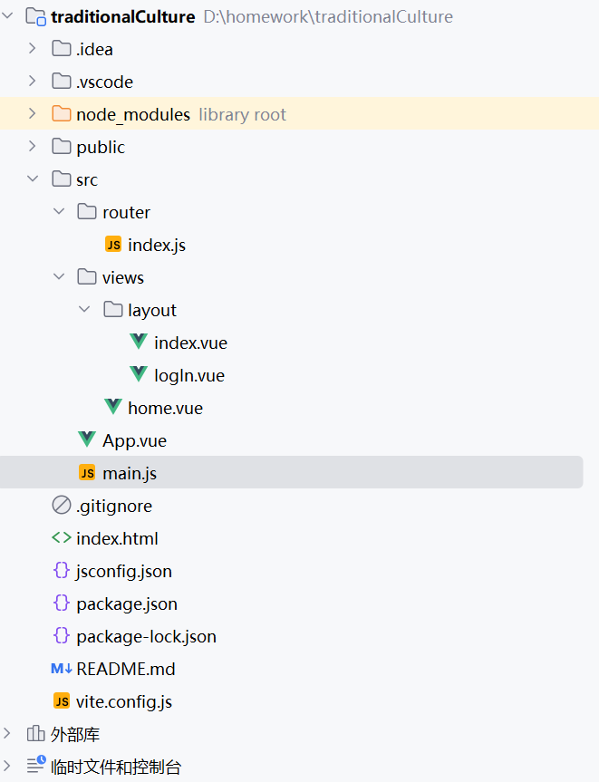
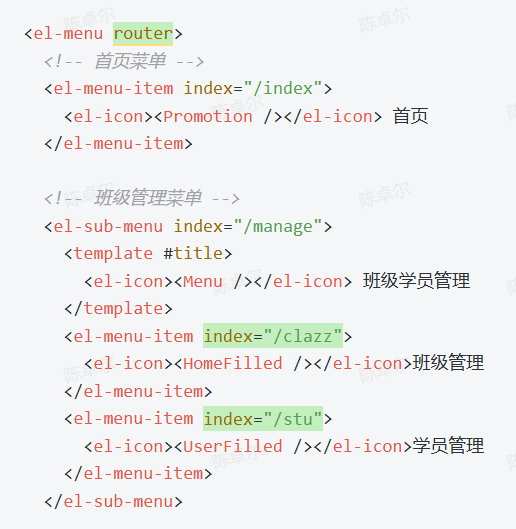
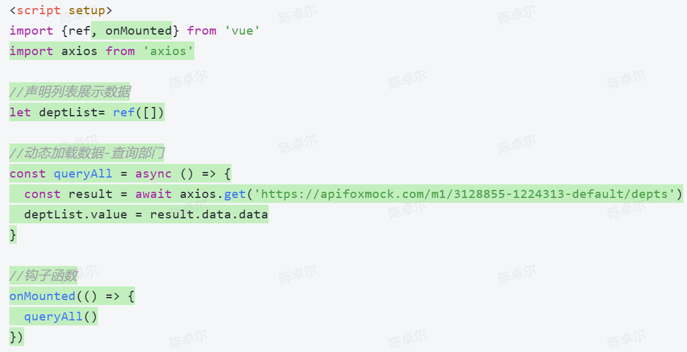
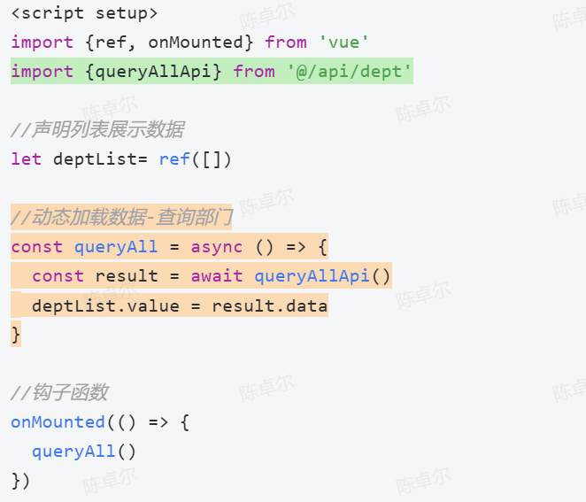

# 一、构建框架



## 1.1 main.js中导入需要的组件

```javascript
import { createApp } from 'vue'
import ElementPlus from 'element-plus'
import 'element-plus/dist/index.css'
import router from './router' //注意此处需要的是包含路由文件的文件夹位置
import App from './App.vue'

createApp(App)
    .use(ElementPlus)
    .use(router)
    .mount('#app')
```

## 1.2 在app.vue中加入路由

```javascript
<script setup>
</script>

<template>
  <router-view></router-view>
</template>

<style scoped></style>
```

## 1.3 下载所需的依赖

```shell
npm install router 
element-plus 
vue-router
```

## 1.4 在src/views/layout/index.vue中配置布局框架（未配置登录拦截）

```javascript
<script setup>
</script>

<template>
  <div class="common-layout">
    <el-container>
      <el-header>
        <el-row>
          <el-menu
              :default-active="activeIndex"
              class="el-menu-demo"
              mode="horizontal"
              @select="handleSelect"
              style="width: 100%; justify-content: space-between;"
          >
            <el-menu-item index="1">首页</el-menu-item>
            <el-menu-item index="2">医学百家</el-menu-item>
            <el-menu-item index="3">传统节日</el-menu-item>
            <el-menu-item index="3">健康文化</el-menu-item>
            <el-menu-item index="3">人文地理</el-menu-item>
            <el-menu-item index="3">文学艺术</el-menu-item>
            <el-menu-item index="3">华夏历史</el-menu-item>
          </el-menu>
        </el-row>
      </el-header>
      <el-main>Main</el-main>
      <el-footer>Footer</el-footer>
    </el-container>
  </div>
</template>


<style scoped></style>
```

```javascript
<script setup></script>

<template>
  <div class="common-layout">
    <el-container>
      <el-header class="header">
        <el-row justify="space-between" align="middle">
          <el-col :span="16">
            <span class="title">智能购物车系统</span>
          </el-col>
          <el-col :span="3">
            <el-button>用户中心</el-button>
            <el-button>设置</el-button>
          </el-col>
        </el-row>
      </el-header>

      <el-container>
        <el-aside>
          <el-row class="tac">
            <el-menu class="el-menu-vertical-demo" router>
              <el-menu-item index="/home">
                <span>首页</span>
              </el-menu-item>
              <el-menu-item index="/shopping">
                <span>购物车</span>
              </el-menu-item>
            </el-menu>
          </el-row>
        </el-aside>
        <el-main>
          <router-view></router-view>
        </el-main>
      </el-container>
    </el-container>
  </div>
</template>

<style scoped></style>
```



## 1.5 配置路由

```javascript
import { createRouter, createWebHistory } from 'vue-router'
import HomeView from '@/views/home.vue'
import IndexView from '@/views/layout/index.vue'
import LogInView from '@/views/layout/logIn.vue'


const router = createRouter({
    history: createWebHistory(import.meta.env.BASE_URL),
    routes: [
        {
            path: '/',
            component: IndexView,
            redirect: '/home',
            children: [
                {path: 'home', component: HomeView},
                {path: 'index', component: IndexView},
            ]
        },
        {path: '/logIn', component: LogInView}
    ]
})

export default router
```


# 访问接口

## 1. 初版




## 2. 优化

### `src/utils/request.js`文件：

```javas
import axios from 'axios'

//创建axios实例对象
const request = axios.create({
  baseURL: '/api',
  timeout: 600000
})

//axios的响应 response 拦截器
request.interceptors.response.use(
  (response) => { //成功回调
    return response.data
  },
  (error) => { //失败回调
    return Promise.reject(error)
  }
)

export default request
```

### `src/api/dept.js`文件:

```javascript
import request from "@/utils/request"

//列表查询
export const queryAllApi = () => request.get('/depts')
```

### 修改 `src/views/dept/index.vue` 中的代码:



###  在 `vite.config.js` 中配置前端请求服务器的信息:

```javascript
import { fileURLToPath, URL } from 'node:url'

import { defineConfig } from 'vite'
import vue from '@vitejs/plugin-vue'
import vueJsx from '@vitejs/plugin-vue-jsx'

// https://vitejs.dev/config/
export default defineConfig({
  plugins: [
    vue(),
    vueJsx(),
  ],
  resolve: {
    alias: {
      '@': fileURLToPath(new URL('./src', import.meta.url))
    }
  },
  // 下面的是新加的代码
  server: {
    proxy: {
      '/api': {
        target: 'http://localhost:8080',
        secure: false,
        changeOrigin: true,
        rewrite: (path) => path.replace(/^\/api/, ''),
      }
    }
  }
})

```

