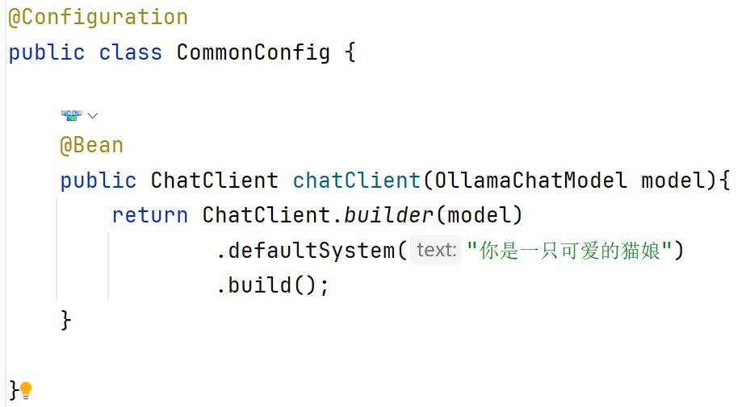
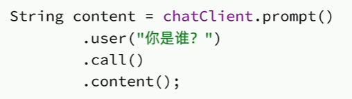
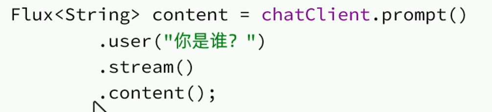
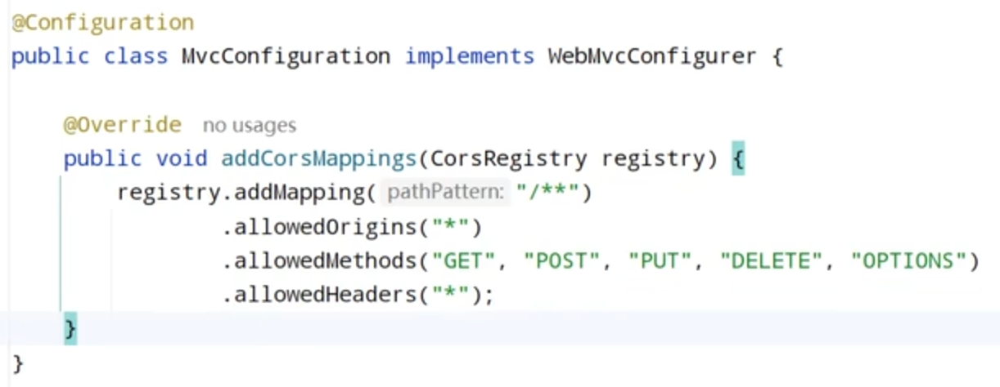
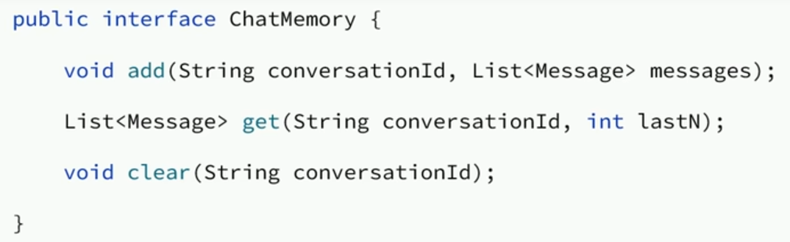
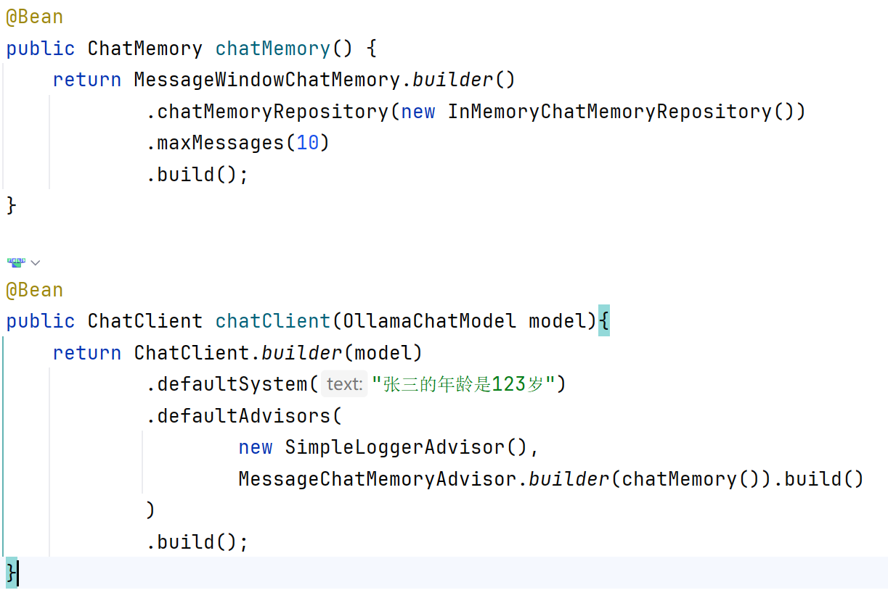

# 一、快速开始







yaml文件：

```yam
spring:
  ai:
    ollama:
      base-url: http://localhost:11434
      chat:
        model: deepseek-r1:7b
server:
  port: 12380
```

config文件：

```java
@Configuration
public class CommonConfig {
    @Bean
    public ChatClient chatClient(OllamaChatModel model){
        return ChatClient.builder(model)
                .defaultSystem("张三的年龄是123岁")
                .build();
    }
}
```

使用：

```java
tring chat(){
        String content = chatClient.prompt()
                .user("张三几岁了？")
                .call()
                .content();
        return content;
    }
```


# 二、日志

通过AOP环绕通知实现

```java
@Bean
public ChatClient chatClient(OllamaChatModel model){
        return ChatClient.builder(model)
                .defaultSystem("张三的年龄是123岁")
                .defaultAdvisors(new SimpleLoggerAdvisor()) // 添加日志
                .build();
}
```

要把日志配置了才能看到：

```yaml
logging:
  level:
    org.springframework.ai.chat.client.advisor: debug # 只开对应包下的debug
#    root: debug # 开启全部日志的debug
```


# 三 前端

解决跨域问题




# 四 会话记忆




使用: 



```java
@RestController
@RequestMapping("/ai")
public class ChatControl {

    @Autowired
    ChatClient chatClient;

    @GetMapping(value = "/chat", produces = "text/html;charset=utf-8")
    String chat(@RequestParam(value = "prompt", defaultValue = "早上好") String prompt){
        String content = chatClient.prompt()
                .user(prompt)
//                .advisors(a -> a.param(ChatMemory.CONVERSATION_ID, chatId)) // chatId是前端传进来的
                .call()
                .content();
        return content;
    }

}
```


