### 虚拟机与Java虚拟机简介

**虚拟机**：一台虚拟的计算机。它是一款**软件**，用来执行一系列虚拟计算机指令。可分为系统虚拟机和程序虚拟机。
- **系统虚拟机**：例如 Visual Box, VMware。它们完全是对物理计算机的仿真，提供了一个可运行完整操作系统的软件平台。
- **程序虚拟机**：例如 Java虚拟机。它**专门为执行单个计算机程序而设计**，在Java虚拟机中执行的指令我们称为Java字节码指令。

> *问："Java字节码指令"就是".class"文件中的内容吗?*
> 
> 答：不完全是。.class文件包含以下几个部分：元数据、常量池、类信息、字段表、**方法表**、属性表。
> **方法表**：这里定义了有什么方法（如`main`, 'solve'）。每个方法的结构里有一个叫`Code`属性的区域，**“字节码指令”就放在这个`Code`属性里**。

**Java虚拟机**：一台执行Java字节码的虚拟计算机，它拥有独立运行机制，其运行的Java字节码也未必由Java语言编译而成。
特点：
- 一次编译，到处运行
- 自动内存管理
- 自动垃圾回收功能


### JVM的位置

**用户**提供**字节码文件**，**字节码文件**在**JVM**中运行，**JVM**在**操作系统**上运行
系统虚拟机：对硬件的模拟
程序虚拟机：如JVM

JDK：JRE+开发人员用的功能


### JVM的整体结构
简略版

详细版

中文版


### Java代码执行流程


### JVM的架构模型
Java编译器输入的指令流基本上是基于**栈的指令集架构**，另一种指令集架构则是基于**寄存器的指令集架构**。
区别：
- **基于栈式架构**的特点：
	- 设计和实现更简单，适用于资源受限的系统
	- 避开了寄存器的分配难题；使用零地址指令方式分配
	- 指令流中的指令大部分是零地址指令，其执行过程依赖于操作栈。指令集更小，编译器容易实现
	- 不需要硬件支持，可移植性更好，更好实现跨平台
```bash
# 2+3
iconst_2 // 常量2入栈
istore_1
iconst_3 // 常量3入栈
istore_2
iload_1
iload_2
iadd // 常量2、3出栈，执行相加
istore_3 // 结果5入栈
```
- **基于寄存器架构**的特点：
	- 典型的应用是x86的二进制指令集，比如传统的pc以及Android的Davlik虚拟机
	- 指令集架构则完全依赖硬件，可移植性差
	- 性能优秀和执行更高效
	- 花费更少的指令去完成一项操作
	- 在大部分情况下，基于寄存器架构的指令集往往都以一地址指令、二地址指令和三地址指令为主，而基于栈式架构的指令集却是以零地址指令为主
```bash
mov eax,2 // 将eax寄存器的值设为2
add eax,3 // 使eax寄存器的值增加3
```
> 问：零地址指令是什么？
> 
> 答：指令中不包含地址，只有操作数

总结：
由于跨平台性的设计，Java的指令都是根据栈来设计的。不同平台CPU架构不同，所以不能设计为基于寄存器的。优点是**跨平台、指令集小，编译器容易实现**，缺点是**性能下降，实现同样的功能需要更多的指令**。


### JVM的生命周期

**虚拟机的启动**：
Java虚拟机的启动是通过引导类加载器（bootstrap class loader）创建一个初始类（initial class）来完成的，这个类是由虚拟机的具体实现指定的。

**虚拟机的执行**：
- 一个运行中的Java虚拟机有着一个清晰的任务：执行Java程序
- 程序开始执行时它才执行，程序结束时它就停止
- ==执行一个所谓的Java程序的时候，真真正正在执行的是一个叫作Java虚拟机的进程==

**虚拟机的退出**：
有如下几种情况：
- 程序正常执行结束
- 程序在执行过程中遇到了异常或错误而异常终止
- 由于操作系统出现错误而导致Java虚拟机进程终止
- 某线程调用Runtime类或System类的exit方法，或Runtime类的halt方法，并且Java安全管理器也允许这次exit或halt操作
- 除此之外，JNI（Java Native Interface）规范描述了用JNI Invocation API来加载或卸载Java虚拟机时，Java虚拟机的退出情况

### JVM的发展历程

**Sun Classic VM**：
- 世界上第一款商用Java虚拟机
- 内部只提供解释器（效率差）
- 如果使用JIT编译器，就需要进行外挂。但是一旦使用了JIT编译器，JIT就会接管虚拟机的执行系统。解释器就不再工作。解释器和编译器不能配合工作。
- hotspot内置了此虚拟机

**Exact VM**：
- Exact Memory Management: 准确式内存管理
	- 也可以叫Non-Conservative/Accurate Memory Management
	- 虚拟机可以知道内存中某个位置的数据具体是什么类型
- 具备现代高性能虚拟机的雏形
	- 热点探测
	- 编译器与解释器混合工作模式
- 只在Solaris平台短暂使用，其他平台上还是classic vm

**Hotspot VM**:
- 从服务器、桌面到移动端、嵌入式都有应用
- 名称中的HotSpot指的就是它的热点代码探测技术。

**JRockit**：
- 专注于服务端应用
	- 不太关注程序启动速度，全部代码都靠即时编译器编译后执行
- JRockit JVM是世界上最快的JVM
- 优势：全面的Java运行时解决方案组合
	- JRockit面向延迟敏感型应用的解决方案JRockit Real Time提供以毫秒或微秒级的JVM响应时间，适合财务、军事指挥、电信网络的需要
	- MissionControl服务套件，它是一组以极低的开销来监控、管理和分析生产环境中的应用程序的工具

**J9**：
- 全称：IBM Technology for Java Virtual Machine，简称IT4J，内部称号：J9
- 市场定位与HotSpot接近，服务器端、桌面应用、嵌入式等多用途VM


## 2. 类加载子系统

### 概述类的加载器及类加载过程

**类加载器子系统作用**：
- 类加载器子系统负责从文件系统或网络中加载Class文件，class文件在文件开头有特定的文件标识。
- ClassLoader只负责class文件的加载，至于它是否可以运行，则由Execution Engine决定
- 加载的类信息存放在一块称为方法区的内存空间。除了类的信息外，方法区中还会存放运行时常量池信息，可能还包含字符串字面量和数字常量（这部分常量信息是Class文件中常量池部分的内存映射）

**类加载器ClassLoader例子**：

1. class file（Car.class文件） 存在本地硬盘上，可以理解为设计师画在纸上的模板，而最终这个模板在执行的时候是要加载到JVM当中根据这个文件实例化出n个一摸一样的示例
2. class file 加载到JVM中，被称为DNA元数据模板（Car Class），放在方法区
3. 在`.class`文件->JVM->最终成为元数据模板，此过程就要一个运输工具（类装载器 Class Loader），扮演一个快递员的角色
### 类的加载子系统过程一：Loading
**加载阶段：**
1. 通过一个类的全限定名获取定义此类的二进制字节流
2. 将这个字节流所代表的静态结构转化为方法区的运行时数据结构
3. ==在内存中生成一个代表这个类的java.lang.Class对象==，作为方法区这个类的各种数据的访问入口

**补充：加载.class文件的方式**
- 从本地系统中直接加载
- 通过网络获取，典型场景：Web Applet
- 从zip压缩包中读取，成为日后jar、war格式的基础
- 运行时计算生成，使用最多的是：动态代理技术
- 由其他文件生成，典型场景：JSP应用
- 从专有数据库中提取.class文件，比较少见
- 从加密文件中获取，典型的防Class文件被反编译的保护措施

### 类的加载子系统过程二：Linking


> Q: “类变量”和”实例变量“的区别?
> 反思：出现这个问题的主要原因是把类/实例变量 和 类/实例对象 混一起了。类对象是在Loading阶段创建的。
> A: 
> - **类变量 (Class Variable)**：
>    
    - **标识**：被 `static` 关键字修饰的变量（静态变量）。
>        
    - **归属**：属于**类（Class）**本身，而不是某个具体的对象。
>        
>    - **特性**：无论你创建了多少个对象，类变量在内存中**只有一份**，所有对象共享这个变量。
>        
>- **实例变量 (Instance Variable)**：
>    
    - **标识**：没有被 `static` 修饰的普通成员变量。
>        
>    - **归属**：属于具体的**对象实例（Object Instance）**。
>        
>    - **特性**：每当你 `new` 一个新对象，系统就会为这个对象分配一个新的实例变量副本。对象之间互不影响。

### 类的加载子系统过程三：Intialization
- **初始化阶段就是执行类构造器方法`<clinit>()`的过程。**
- 此方法不需定义，自动生成，是javac编译器自动收集类中的**所有类变量的赋值动作和静态代码块中的语句**合并而来。（如果没有类变量和静态代码块，就不会生成`clinit()`方法）
- 构造器方法中指令按语句在源文件中出现的顺序执行
- **`<clinit>()`不同于类的构造器**（关联：构造器是虚拟机视角下的`<init>()`）
- 若该类具有父类，JVM会保证子类的`<clinit>()`执行前，父类的`<clinit>()`已经执行完毕
- 虚拟机必须保证一个类的`<clinit>()`方法在多线程下被同步加锁

总结一下：上述总共涉及.class文件中的两个方法（参考下图）：
- `clinit()`：自动生成，按顺序执行类变量的赋值动作和静态代码块中的语句
- `init()`：类的构造器方法在.class文件中的名字


```java
// 例子
// 在Linking 阶段，初始化类变量num
// 在Intialization阶段，运行clinit()方法按顺序执行赋值动作
public class ClassInitTest {  
    static {  
        num = 2;  
        // System.out.println(num); 会报错，不能前向引用
    }    
    private static int num = 10;  
  
    public static void main(String[] args) {  
        System.out.println(ClassInitTest.num);    
    }
}
```

### 类的加载器的分类
- JVM支持两种类型的类加载器，分别为**引导类加载器**（Bootstrap ClassLoader）和**自定义类加载器**（User-Defined ClassLoader）
- 从概念上来讲，自定义类加载器一般指的是程序中由开发人员自定义的一类类加载器，但是Java虚拟机规范却没有这么定义，而是**将所有派生于抽象类ClassLoader的类加载器都划分为自定义类加载器**
- 无论类加载器的类型如何划分，在程序中我们最常见的类加载器始终只有3个，如下所示：
	- Bootstrap Class Loader：引导类加载器
	- Extension Class Loader：自定义类加载器
	- System Class Loader：自定义类加载器

代码示例：
```java
public class ClassLoaderTest {  
    public static void main(String[] args){  
  
        // 获取系统类加载器  
        ClassLoader systemClassLoader = ClassLoader.getSystemClassLoader();  
        System.out.println(systemClassLoader); //sun.misc.Launcher$AppClassLoader@18b4aac2  
  
        // 获取其上层，扩展类加载器  
        ClassLoader extClassLoader = systemClassLoader.getParent();  
        System.out.println(extClassLoader); // sun.misc.Launcher$ExtClassLoader@1b6d3586  
  
        // 获取上层，获取不到引导类加载器  
        ClassLoader bootstrapClassLoader = extClassLoader.getParent();  
        System.out.println(bootstrapClassLoader); // null  
  
        // 对于用户自定义类来说，默认使用系统类加载器进行加载  
        ClassLoader classLoader = ClassLoaderTest.class.getClassLoader();  
        System.out.println(classLoader);// sun.misc.Launcher$AppClassLoader@18b4aac2  
  
        // String类使用引导类加载器进行加载的 --> Java的核心类都是使用引导类加载器进行加载的
        ClassLoader classLoader1 = String.class.getClassLoader();  
        System.out.println(classLoader1); // null  
    }  
}
```

#### 虚拟机自带的加载器
- **启动类加载器**（引导类加载器，Bootstrap ClassLoader）
	- 这个类加载使用C/C++语言实现的，嵌套在JVM内部
	- 它用来加载Java的核心库（JAVA_HOME/jre/lib/rt.jar、resources.jar或sun.boot.class.path路径下的内容），用于提供JVM自身需要的类
	- 并不继承自java.lang.ClassLoader，没有父加载器
	- 加载**扩展类和应用程序类加载器**，并指定为他们的父类加载器
	- 出于安全考虑，Bootstrap启动类加载器只加载包名为java、javax、sun等开头的类
- **扩展类加载器**（Extension ClassLoader）
	- Java语言编写，由sun.misc.Launcher$ExtClassLoader实现
	- 派生于ClassLoader类
	- 父类加载器为启动类加载器
	- 从java.ext.dirs系统属性所指定的目录中加载类库，或从JDK的安装目录的jre/lib/ext子目录（扩展目录）下加载类库。**如果用户创建的JAR放在此目录下，也会自动由扩展类加载器加载**
- **应用程序类加载器**（系统类加载器，AppClassLoader）
	- java语言编写，由sun.misc.Launcher$AppClassLoader实现
	- 派生于ClassLoader类
	- 父类加载器为扩展类加载器
	- 它负责加载环境变量classpath或系统属性 java.class.path 指定路径下的类库 
	- 该类加载是程序中默认的类加载器，一般来说，Java应用的类都是由它来完成加载
	- 通过ClassLoader#getSytemClassLoader()方法可以获取到该类加载器
- **用户自定义加载器**
	- 作用：
		- 隔离加载类
		- 修改类加载的方式
		- 扩展加载源
		- 防止源码泄漏

```java
public class ClassLoaderTest1 {  
    public static void main(String[] args) {  
        System.out.println("******************启动类加载器******************");  
        // 获取BootstrapClassLoader能够加载的api的路径  
        URL[] urLs = sun.misc.Launcher.getBootstrapClassPath().getURLs();  
        for(URL element: urLs)  
            System.out.println(element.toExternalForm());  
        System.out.println("******************扩展类加载器******************");  
        String extDirs = System.getProperty("java.ext.dirs");  
        for(String path: extDirs.split(";")){  
            System.out.println(path);        }    }  
}
// 输出结果
******************启动类加载器******************
file:/C:/Program%20Files/Java/jdk1.8.0_201/jr5e/lib/resources.jar
file:/C:/Program%20Files/Java/jdk1.8.0_201/jre/lib/rt.jar
file:/C:/Program%20Files/Java/jdk1.8.0_201/jre/lib/sunrsasign.jar
file:/C:/Program%20Files/Java/jdk1.8.0_201/jre/lib/jsse.jar
file:/C:/Program%20Files/Java/jdk1.8.0_201/jre/lib/jce.jar
file:/C:/Program%20Files/Java/jdk1.8.0_201/jre/lib/charsets.jar
file:/C:/Program%20Files/Java/jdk1.8.0_201/jre/lib/jfr.jar
file:/C:/Program%20Files/Java/jdk1.8.0_201/jre/classes
******************扩展类加载器******************
C:\Program Files\Java\jdk1.8.0_201\jre\lib\ext
C:\WINDOWS\Sun\Java\lib\ext
```

### 关于ClassLoader
ClassLoader类，它是一个抽象类，其后所有的类加载器都继承自ClassLoader（不包括启动类加载器）

| 方法名称                                                 | 描述                                                     |
| ---------------------------------------------------- | ------------------------------------------------------ |
| getParent()                                          | 返回该类加载器的超类加载器                                          |
| loadClass(String name)                               | 加载名称为name的类，返回结果为java.lang.Class类的实例                   |
| findClass(String name)                               | 查找名称为name的类，返回结果为java.lang.Class类的实例。常与defineClass搭配使用 |
| findLoadedClass(String name)                         | 查找名称为name的已经被加载过的类，返回结果为java.lang.Class类的实例            |
| defineClass(String name, byte[] b, int off, int len) | 把字节数组b中的内容转换为一个Java类，返回结果为java.lang.Class类的实例          |
| resolveClass(Class\<?\> c)                           | 连续指定的一个Java类                                           |

**sun.misc.Launcher 它是一个java虚拟机的入口应用**
	JVM本身（即 `java.exe` 或 linux 下的 `java` 命令）大部分是用 **C++** 写的。
- **在 Launcher 运行之前（C++ 阶段）**： 当你输入 `java MyProgram` 时，操作系统调用的是 C++ 代码。这时候，JVM 加载了核心库，初始化了堆内存，启动了垃圾回收器，并且创建了**启动类加载器 (Bootstrap ClassLoader)**。但此时，JVM 还只是一个空的引擎，它还不知道你的 `MyProgram` 在哪，也不知道怎么去加载它。
    
- **Launcher 登场（交接棒）**： C++ 代码做完底层硬件和内存的准备后，需要把控制权交给 Java 代码。它调用的**第一个 Java 类**就是 `sun.misc.Launcher`。
    
    **这就是“入口”的含义**：它是 JVM 启动后运行的**第一行 Java 代码**。在它之前全是 C++，在它之后才是你的 `public static void main`。
    
> Q: sun.misc.Launcher 和图中类的关系
> A: `ExtClassLoader`和`AppClassLoader`是`sun.misc.Launcher`类的静态内部类

**获取ClassLoader的途径**

|                           |                                                |
| ------------------------- | ---------------------------------------------- |
| 方式一：获取当前类的ClassLoader     | clazz.getClassLoader                           |
| 方式二：获取当前线程上下文的ClassLoader | Thread.currentThread().getContextClassLoader() |
| 方式三：获取系统的ClassLoader      | ClassLoader.getSystemClassLoader()             |
| 方式四：获取调用者的ClassLoader     | DriverManager.getCallerClassLoader()           |
```java
public class ClassLoaderTest2 {  
    public static void main(String[] args) {  
        try {  
            // 1. 获取 String 类的类加载器  
            ClassLoader classLoader = Class.forName("java.lang.String").getClassLoader();  
            System.out.println(classLoader); // 输出: null，表示引导类加载器  
  
            // 2. 获取当前线程的上下文类加载器  
            ClassLoader classLoader1 = Thread.currentThread().getContextClassLoader();  
            System.out.println(classLoader1); // 输出: sun.misc.Launcher$AppClassLoader@18b4aac2 应用类加载器  
  
            // 3. 获取系统类加载器及其父类加载器  
            ClassLoader systemClassLoader = ClassLoader.getSystemClassLoader();  
            System.out.println(systemClassLoader); // 输出: sun.misc.Launcher$AppClassLoader@18b4aac2 应用类加载器  
            ClassLoader parent = systemClassLoader.getParent();  
            System.out.println(parent); // 输出: sun.misc.Launcher$ExtClassLoader@1b6d3586 扩展类加载器  
            ClassLoader grandParent = parent.getParent();  
            System.out.println(grandParent); // 输出: null，表示引导类加载器  
        } catch (ClassNotFoundException e) {  
            e.printStackTrace();  
        }  
    }  
}
```

### 双亲委派机制
Java虚拟机对class文件采用的是**按需加载**的方式，也就是说当需要使用该类时才会将它的class文件加载到内存生成class对象。而且加载某个类的class文件时，Java虚拟机采用的是**双亲委派模式**，即把请求交由父类处理，它是一种任务委派模式。
#### 工作原理
1. 如果一个类加载器收到了类加载请求，它并不会自己先去加载，而是把这个请求委派给父类的加载器去执行
2. 如果父类加载器还存在其父类加载器，则进一步向上委托，依次递归，请求最终将到达顶层的启动类加载器
3. 如果父类加载器可以完成类加载任务，就成功返回，倘若父类加载器无法完成此加载任务，子加载器才会尝试自己去加载，这就是双亲委派模式


#### 举例

原因：运行main方法需要加载对应的类，通过双亲委派机制委派给引导类加载器，引导类加载器找到了系统中java.lang中的String类，并加载了它，但它没有main方法，所以报错。详细原因见 《沙箱安全机制》


#### 优势
- 避免类的重复加载
- 保护程序安全，防止核心API被随意篡改
	- 自定义类：java.lang.String
	- 自定义类：java.lang.ShkStart（由于安全限制，不会让你自定义类，和双亲委派好像没啥关联）

### 沙箱安全机制
自定义String类，但是在加载自定义String类时会率先使用引导类加载器加载，而引导类加载器在加载的过程中会先加载jdk自带的文件（rt.jar包中java\lang\String.class），报错信息说没有main方法就是因为加载的是rt.jar包中的String类。这样可以保证对java核心源代码的保护，这就是**沙箱安全机制**

### 其他
- 在JVM中表示两个class对象是否为同一个类存在两个必要条件：
	- 类的完整类名必须一致，包括包名
	- 加载这个类的ClassLoader（指ClassLoader实例对象）必须相同。
- 换句话说，在JVM中，即使这两个类对象（class对象）来源同一个Class文件，被同一个虚拟机所加载，但只要加载它们的ClassLoader实例对象不同，那么这两个类对象也是不相等的。

JVM必须知道一个类型是由启动类加载器加载的还是用户类加载器加载的。如果一个类型是由用户类加载器加载的，那么==JVM会将这个类加载器的一个引用作为类型信息的一部分保存在方法区中==。当解析一个类型到另一个类型的引用的时候，JVM需要保证这两个类型的类加载器是相同的。（TODO）

### 类的主动使用和被动使用
Java程序对类的使用方式分为：主动使用和被动使用
- 主动使用，分为七种情况：
	- 创建类的实例
	- 初始化一个类的子类
	- 访问某个类或接口的静态变量，或者对该静态变量赋值
	- 调用类的静态方法
	- 反射（比如：Class.forName("com.atguigu.Test")）
	- Java虚拟机启动时被表明为启动类的类
	- JDK 7开始提供的动态语言支持：
	  java.lang.invoke.MethodHandle实例的解析结果
	  REF_getStatic、REF_putStatic、REF_invokeStatic句柄对应的类没有初始化，则初始化
- 除以上七种情况，其他使用Java类的方式都被看作是对**类的被动使用**，都不会导致**类的初始化**


## 3. 运行时数据区概述及线程

### 运行时数据区内部结构


如下图所示，每个线程都有程序计数器（Program Counter Register）、本地方法栈（Native Method Stack）、虚拟机栈（Java Virtual Machine Stack）
线程间共享：堆、堆外内存（永久代或元空间、代码缓存）

每个JVM只有一个Runtime实例。即为运行时环境，相当于内存结构的运行时环境

### JVM中的线程说明
- 线程是一个程序里的运行单元。JVM允许一个应用有多个线程并行的执行
- 在Hotpot JVM里，每个线程都与操作系统的本地线程直接映射
	- 当一个Java线程准备好执行以后，此时一个操作系统的本地线程也同时创建。Java线程执行终止后，本地线程也会回收
- 操作系统负责所有线程的安排调度到任何一个可用的CPU上。一旦本地线程初始化成功，它就会调用Java线程中的run()方法

如果你使用jconsole或者是任何一个调试工具，都能看到后台有许多线程在运行。这些后台线程不包括调用public static void main(String\[]) 的main线程以及所有这个main线程自己创建的线程
这些主要的后台系统线程在Hotspot JVM里主要是以下几个：
- **虚拟机线程**：这种线程的操作是需要JVM达到安全点才会出现。这些操作必须在不同的线程中发生的原因是它们都需要JVM达到安全点，这样堆才不会变化。这种线程的执行类型包括"stop-the-world"的垃圾收集，线程栈收集，线程挂起以及偏向锁撤销
- **周期任务线程**：这种线程是时间周期事件的体现（比如中断），它们一般用于周期性操作的调度执行
- **CG线程**：这种线程对在JVM里不同种类的垃圾收集行为提供了支持
- **编译线程**：这种线程在运行时会将字节码编译到本地代码
- **信号调度线程**：这种线程接收信号并发送给JVM，在它内部通过调用适当的方法进行处理

## 4. 程序计数器（PC寄存器）
#### 概述
JVM中的PC寄存器是对物理PC寄存器的一种抽象模拟
PC寄存器用来存储指向下一条指令的地址，也即将要执行的指令代码。由执行引擎读取下一条指令。
任何时间一个线程都只有一个方法在执行，也就是所谓的当前方法。程序计数器会存储当前线程正在执行的Java方法的JVM指令地址；或者，如果是在执行native方法，则是未指定值（undefined）
它是唯一一个在Java虚拟机规范中没有规定任何OutOfMemoryError情况的区域

## 5. 虚拟机栈

#### 0）常用调优工具
- JDK命令行(jinfo, jstat, javap)
- Eclipse:Memory Analyzer Tool
- Jconsole
- VisualVM
- Jprofiler
- Java Filght Recorder
- GCViewer
- GC Easy
#### 1）内存中的栈与堆
**栈是运行时的单位，而堆是存储的单位**。即栈解决程序的运行问题，即程序如何执行，或者说如何处理数据。堆解决的是数据存储问题，即数据怎么放、放在哪儿。

#### 2）基本介绍
**是什么？**：Java虚拟机栈（Java Virtual Machine Stack），早期也叫Java栈。每个线程在创建时都会创建一个虚拟机栈，其内部保存一个个的**栈帧**（Stack Frame），对应着一次次的Java**方法**调用。
是线程私有的。
**生命周期**：和线程一致
**作用**：主管Java程序的运行，它保存方法的**局部变量**、部分结果，并参与方法的调用和返回
- 局部变量 vs 成员变量（或属性）
- 基本数据变量 vs 引用类型变量

#### 3）栈的特点
- 栈是一种快速有效的分配存储方式，访问速度仅次于程序计数器
- JVM直接对Java栈的操作只有两个：
	- 每个方法执行，伴随着进栈（入栈、压栈）
	- 执行结束后的出栈工作
- 对于栈来说不存在垃圾回收问题，存在OOM（out of memory）

#### 4）栈中可能出现的异常
- Java虚拟机规范允许**Java栈的大小是动态的或者是固定不变的**
	- 如果采用固定大小的Java虚拟机栈，那每一个线程的Java虚拟机栈容量可以在线程创建的时候独立选定。如果线程请求分配的栈容量超过Java虚拟机栈允许的最大容量，Java虚拟机栈允许的最大容量，Java虚拟机将会抛出一个`StackOverflowError`异常
	- 如果Java虚拟机栈可以动态扩展，并且在尝试扩展的时候无法申请到足够的内存，或者在创建新的线程时没有足够的内存去创建对应的虚拟机栈，那Java虚拟机将会抛出一个`OutOfMemoryError`异常

#### 5）设置栈的大小
使用`-Xss`来设置线程的最大栈空间，栈的大小直接决定了函数调用的最大可达深度
```java
public class StackTest {  
  
    private static int count = 1;  
  
    public static void main(String[] args) {  
        System.out.println("count:"+count);  
        count++;        
        main(args);    
    }    
    /*默认输出：  
     ...    
     count:6492    
     count:6493    
     Exception in thread "main" java.lang.StackOverflowError
     ...*/
}
```
如下图所示设置栈的大小

重新运行程序后：


#### 5）栈中存储什么？
- 每个线程都有自己的栈，栈中的数据都是以**栈帧**(Stack Frame)的格式存在。
- 在这个线程上正在执行的每个方法都各自对应一个栈帧（Stack Frame）
- 栈帧是一个内存区块，是一个数据集，维系着方法执行过程中的各种数据信息

#### 6）运行原理
- JVM直接对Java栈的操作只有两个，就是对栈帧的压栈和出栈
- 在一条活动线程中，一个时间点上，只会有一个活动的栈帧。即只有当前正在执行的方法的栈帧（栈顶栈帧）是有效的，这个栈帧被称为**当前栈帧**（Current Frame），与当前栈帧相对应的方法是**当前方法**（Current Method），定义这个方法的类就是**当前类**（Current Class）。
- 执行引擎运行的所有字节码指令只针对当前栈帧进行操作
- 如果在该方法中调用了其他方法，对应的新的栈帧会被创建出来，放在栈的顶端，成为新的当前栈
- 不同线程中所包含的栈帧是不允许存在相互引用的，即不可能在一个栈帧之中引用另一个线程的栈帧
- 如果当前方法调用了其他方法，方法返回之际，当前栈帧会传回此方法的执行结果给前一个栈帧，接着，虚拟机会丢弃当前栈帧，使得前一个栈帧重新成为当前栈帧
- Java方法有两种返回函数的方法，**一种是正常的函数返回，使用return指令；另一种是抛出异常**。不管使用哪种方式，都会导致栈帧被弹出。


#### 7）栈帧的内部结构
每个栈帧中存储着：
- **局部变量表**（Local Variables）
- **操作数栈**（Operand Stack）（或表达式栈）
- 动态链接（Dynamic Linking）（或指向运行时常量池的方法引用）
- 方法返回地址（Return Address）（或方法正常退出或者异常退出的定义）
- 一些附加信息

#### 8）局部变量表（local variables）
##### 基本信息
- 局部变量表也被称为局部变量数组或本地变量表
- 定义为一个**数字数组**，主要用于存储方法参数和定义在方法体内的局部变量。这些数据类型包括各类基本数据类型、对象引用（reference），以及returnAddress类型。
- 由于局部变量表是建立在线程的栈上，是线程的私有数据，因此不存在数据安全问题
- 局部变量表所需的容量大小是在编译期确定下来的，并保存在方法的Code属性的maximum local variables数据项中。在方法运行期间是不会改变局部变量表的大小的。
- 方法最大嵌套调用的次数由栈的大小决定。一般来说，栈越大，方法能够嵌套的次数越多。
- 局部变量表中的变量只在当前方法调用中有效。在方法执行时，虚拟机通过使用局部变量表完成**参数值**到**参数变量列表**的传递过程。当方法调用结束后，随着方法栈帧的销毁，局部变量表也会随之销毁。
- 在栈帧中，与性能调优关系最为密切的就是前面提到的局部变量表。在方法执行时，虚拟机使用局部变量表完成方法的传递。
- **局部变量表中的变量也是重要的垃圾回收根节点，只要被局部变量表中直接或间接引用的对象都不会被回收**。


> Q: 参数值和参数变量列表的定义
> 
> A: 1. **参数值** (Argument Values) —— 也就是“实参”
>
>- **定义**：这是 **调用者（Caller）** 在调用方法时，实际传递给方法的数据。
 >   
>- **性质**：它们是**具体的值**（或者是指向对象的引用地址）。
  >  
>- **存在位置**：在方法调用指令执行前，它们存在于**调用者**的操作数栈中。
>    
>- **例子**： 如果你调用 `add(10, 20);` 那么 `10` 和 `20` 就是 **参数值**。
>    
>2. **参数变量列表** (Parameter Variable List) —— 也就是“形参”
>
>- **定义**：这是 **被调用者（Callee）** 在定义方法时，声明的一组变量。
  >  
>- **性质**：它们是**占位符**，定义了方法需要什么类型的数据，以及在方法内部叫什么名字。它们构成了局部变量表的前几个位置。
 >   
>- **存在位置**：它们存在于**被调用方法**的 `.class` 文件的方法签名中，并在运行时刻映射到**局部变量表**的起始索引位置。
 >   
>- **例子**： 如果你定义方法 `public void add(int a, int b) { ... }` 那么 `int a` 和 `int b` 组成的序列就是 **参数变量列表**。


##### Slot
- 参数值的存放总是在局部变量数组的index0开始，到数组长度-1的索引结束
- 局部变量表，最基本的存储单元时Slot（变量槽）
- 局部变量表中存放编译器可知的各种基本类型（8种），引用类型（reference），returnAddress类型的变量
- 在局部变量表里，32位以内的类型只占用一个slot（包括returnAddress类型），64位的类型（long和double）占用两个slot。即一个槽4个字节
	- byte、short、char、boolean在存储前被转换为int
	- long和double则占据两个Slot
- JVM会为局部变量表中的每一个Slot都分配一个访问索引，通过这个索引即可成功访问到局部变量表中指定的局部变量值。（占据两个槽的局部变量值通过第一个槽的索引访问）
- 当一个实例方法被调用的时候，它的方法参数和方法体内部定义的局部变量将会**按照顺序被复制**到局部变量表中的每一个Slot上
- 如果需要访问局部变量表中一个64bit的局部变量值时，只需要使用前一个索引即可。
- 如果当前帧是由构造方法或者实例方法创建的，那么**该对象引用this将会存放在index为0的slot处**，其余的参数表顺序继续排列
- 栈帧中的局部变量表中的槽位是可以重用的。

| 索引  | 类型        | 参数       |
| --- | --------- | -------- |
| 0   | int       | int k    |
| 1   | long      | long m   |
| 3   | float     | float p  |
| 4   | double    | double p |
| 6   | reference | Object t |

#### 9）操作数栈
- 每一个独立的栈帧中除了包含局部变量表以外，还包含一个**后进先出**的操作数栈，也可以称之为**表达式栈**
- 操作数栈，在方法执行过程中，根据字节码指令，往栈中写入数据或提取数据，即入栈/出栈
	- 某些字节码指令将值压入操作数栈，其余的字节码指令将操作数取出栈。使用它们后再把结果压入栈
	- 比如：执行复制、交换、求和等操作
- 操作数栈，主要用于保存计算过程的中间结果，同时作为计算过程中变量临时的存储空间
- 操作数栈就是JVM执行引擎的一个工作区，当一个方法刚开始执行的时候，一个新的栈帧也会随之被创建出来，这个方法的操作数栈是空的。
- 每一个操作数栈都会拥有一个明确的栈深度用于存储数值，其所需的最大深度在编译期就定义好了，保存在方法的Code属性中，为max_stack的值
- 栈中的任何一个元素都是可以任意的Java数据类型
	- 32bit的类型占用一个栈单位深度
	- 64bit的类型占用两个栈单位深度
- 操作数栈并非采用访问索引的方式来进行数据访问的，而是只能通过标准的入栈和出栈操作来完成一次数据访问
- 如果被调用的方法带有返回值的话，其返回值将会被压入当前栈帧的操作数栈中，并更新PC寄存器中下一条需要执行的字节码指令。
- 操作数栈中元素的数据类型必须与字节码指令的序列严格匹配，这由编译器在编译器期间进行验证，同时在类加载过程中的类校验阶段的数据流分析阶段要再次验证
- 另外，我们说Java虚拟机的**解释引擎是基于栈的执行引擎**，其中的栈指的就是操作数栈

##### 栈顶缓存技术
前面提过，基于栈式架构的虚拟机所使用的零地址指令更加紧凑，但完成一项操作的时候必须需要使用更多的入栈和出栈指令，这同时也就意味着将需要更多的指令分派（instruction dispatch）次数和内存读/写次数。
由于操作数是存储在内存中的，因此频繁地执行内存读/写操作必然会影响执行速度。为了解决这个问题，HotSpot JVM的设计者们提出了**栈顶缓存**（ToS，Top-of-Stack Cashing）技术，**将栈顶元素全部缓存在物理CPU的寄存器中**，以此降低对内存的读/写次数，提升执行引擎的执行效率


#### 10）动态链接（或指向运行时常量池的方法引用）

- 每个栈帧内部都包含一个指向**运行时常量池**中该栈帧所属方法的引用。包含这个引用的目的就是为了支持当前方法的代码能够实现**动态链接**（Dynamic Linking）。比如：invokedynamic指令。
- 在Java源文件被编译到字节码文件中时，所有的变量和方法引用都作为符号引用（Symbolic Reference）保存在class文件的常量池里。比如：描述一个方法调用了另外的其他方法时，就是通过常量池中指向方法的符号引用来表示的，那么**动态链接的作用就是为了将这些符号引用转换为调用方法的直接引用**。
 
 上图中虚拟栈（stack）中的栈帧（Stack Frame）包含动态链接（Current Class Constant Pool Reference），动态链接指向运行时常量池的方法引用（method references)
 > Q:符号引用 和 动态链接
 > - **符号引用**：就是字节码里的 `#4`，以及它顺藤摸瓜找到的字符串 `"Calculator.add"`. 它仅仅是个**名字**。
> - **动态链接**：就是**JVM 在运行时**，看着这个名字，去内存里找到**真正的代码位置**（直接引用）的过程。

**为什么需要常量池？**：常量池的作用，就是为了提供一些符号和常量，便于指令识别

#### 11）补充：方法的调用

##### 绑定机制
在JVM中，将符号引用转换为调用方法的直接引用与方法的绑定机制相关
- 静态链接：当一个字节码文件被装载进JVM内部时，如果被调用的**目标方法在编译期可知**，且运行期保持不变时。这种情况下将调用方法的符号引用转换为直接引用的过程称之为静态链接
- 动态链接：如果**被调用的方法在编译期无法被确定下来**，只能在程序运行期将调用方法的符号引用转换为直接引用，就叫动态链接

对应的方法的**绑定机制**为：**早期绑定**（Early Binding）和**晚期绑定**（Late Binding）。**绑定是一个 *字段、方法或者类* 在符号引用被替换为直接引用的过程，这仅仅发生一次**。
- 早期绑定：指被调用的**目标方法在编译期可知，且运行期保持不变**时，即可将这个方法与所属的类型进行绑定。这样一来，由于明确了被调用的目标方法究竟是哪一个，因此也就可以使用静态链接的方式将符号引用转换为直接引用
- 晚期绑定：被调用的**方法在编译期无法被确定，只能在程序运行期根据实际的类型绑定相关的方法**。

##### 非虚方法和虚方法
非虚方法：
- 如果方法在编译期就确定了具体的调用版本，这个版本在运行时是不可变的。这样的方法叫**非虚方法**。
- 静态方法、私有方法、final方法、实例构造器、父类方法都是非虚方法。（不可能被子类重写的方法）
- 其他方法称为**虚方法**


> Q: 子类对象的多态性的使用前提：
>A:1. 类的继承关系；
>2. 方法的重写

> Q: 父类方法为什么不能被子类重写
> A:父类方法通过super调用。通常子类重写父类方法后，调用时会执行子类的版本（这是虚方法行为）。 但是，如果你在代码中显式地写了 `super.method()`，你的意图非常明确：“我**不要**多态，我**不要**看当前对象的类型，我就要强制调用父类的那段代码”。

虚拟机中调用了以下几条方法调用指令：
- **普通调用指令**：

| 指令                | 说明                              |
| ----------------- | ------------------------------- |
| `invokestatic`    | 调用静态方法，解析阶段确定唯一方法版本             |
| `invokespecial`   | 调用`init`方法、私有及父类方法，解析阶段确定唯一方法版本 |
| `invokeVirtual`   | 调用所有虚方法（除了final方法，它是非虚方法）       |
| `invokeinterface` | 调用接口方法                          |

- **动态调用指令**：

| 指令              | 说明                |
| --------------- | ----------------- |
| `invokedynamic` | 动态解析出需要调用的方法，然后执行 |


普通调用指令固化在虚拟机内部，方法的调用执行不可人为干预，而动态调用指令则支持由用户确定方法版本。其中**invokestatic指令和invokespecial指令调用的方法称为非虚方法，其余的（final修饰的除外）称为虚方法**。

##### 动态类型语言和静态类型语言
区别：对类型的检查是在编译期还是在运行期。满足前者的是静态类型语言，反之是动态类型语言

静态类型语言是判断**变量自身**的类型信息。（String info = "233"; // 通过info前面的Stirng，判断info是String类型的）
动态类型语言是判断**变量值**的类型语言（info = “233”; // 通过info的值“233”，判断info的值是Stirng类型的）

##### 方法重写的本质
1. 找到操作数栈顶的第一个元素所执行的对象的实际类型，记作`C`。
2. 如果在类型`C`中找到与常量中的描述符 和 简单名称都相符的方法，则进行权限校验，如果通过则返回这个方法的直接引用，查找过程结束；如果不通过没有权限，则返回`java.lang.IllegalAccessError`异常
3. 否则，按照继承关系从下往上依次对`C`的各个父类进行第2步的搜索和验证过程
4. 如果始终没有找到合适的方法，则抛出`java.lang.AbstractMethodError`异常

##### 虚函数表
- 在面向对象的编程中，会很频繁的使用到动态分派。因此，为了提高性能，JVM采用在类的方法区建立一个虚方法表来使用。非虚方法不会出现在表中。使用索引表来代替查找。
- 每个类都有一个虚方法表
- 虚方法表什么时候被创建？
  虚方法表会在类加载的**链接阶段**被创建并开始初始化，类的变量初始值准备完成之后，JVM会把该类的方法表也初始化完毕

#### 12）方法返回地址
- 存放调用该方法的pc寄存器的值（方法A调用了B后，B完成后要返回给执行引擎A的地址）
- 一个方法的结束，有两种方式：
	- 正常执行完成
	- 出现未处理的异常，非正常退出
- 无论通过哪种方式退出，在方法退出后都返回到该方法被调用的位置。方法正常退出时，调用者的pc计数器的值作为返回地址，即调用该方法的指令的下一条指令的地址。而通过异常退出的，返回地址是要通过异常表来确定，栈帧中一般不会保存这部分信息。

当一个方法开始执行后，只有两种方式可以退出这个方法：
1. 执行引擎遇到任意一个方法返回的字节码指令（return），会有返回值传递给上层的方法调用者，简称**正常完成出口**。
- 一个方法在正常调用完成之后究竟需要使用哪一个返回指令还需要根据方法返回值的实际数据类型而定。
- 在字节码指令中，返回指令包括ireturn（当返回值为boolean, byte, char, short, int）、lreturn (long)、freturn (float)、dreturn (double)、areturn(引用类型)、return（void方法，实例初始化方法，类和接口的初始化方法）
1.  在方法执行的过程中遇到了异常（Exception），并且这个异常没有在方法内进行处理，也就是只要在本方法的异常表中没有搜索到匹配的异常处理器，就会导致方法退出。简称**异常完成出口**。

本质上，方法的退出就是当前栈帧出栈的过程。此时，需要恢复上层方法的局部变量表、操作数栈、将返回值压入调用者栈帧的操作数栈、设置PC寄存器值等，让调用者方法继续执行下去。

正常完成出口和异常完成出口的区别在于：通过异常完成出口退出的不会给他的上层调用者产生任何的返回值。

## 6. 补充：本地方法接口的理解
##### 什么是本地方法
简单地讲，一个Native Method就是一个Java调用非Java代码接口。一个Native Method是这样一个方法：该方法的实现由非Java语言实现，比如C。这个特征并非Java所特有，很多其他的编程语言都有这样一个机制，比如在C++中，你可以用extern“C”告知C++编译器去调用一个C的函数。

在定义一个native method时，并不提供实现体（有些像定义一个Java interface），因为其实现体是由非java语言在外面实现的。

本地接口的作用是融合不同的编程语言为Java所用，它的初衷是融合C/C++程序。

标识符native可以与所有其他的java标识符连用，但是abstract除外。

## 7. 本地方法栈
略

## 8. 堆
##### 基本介绍
- 这个名字和数据结构中的“堆”没有关联，但JVM中的堆使用了数据结构的堆来存储
- 一个JVM实例只存在一个堆内存，堆也是Java内存管理的核心区域
- Java堆区在JVM启动的时候即被创建，其空间大小也就确定了。是JVM管理的最大一块内存空间
	- 堆内存大小是可以调节的
- 《Java虚拟机规范》规定，堆可以处于物理上不连续的内存空间中，但在逻辑上它应该被视为连续的。
- 所有的线程共享Java堆，在这里还可以划分线程私有的缓冲区（Thread Local Allocation Buffer，TLAB）
- 所有的对象实例以及数组都应当在运行时分配在堆上。（其实也有分配到栈上的）
- 在方法结束后，堆中的对象不会马上被移除，仅仅在垃圾收集的时候才会被移除。
- 堆，是GC执行垃圾回收的重点区域

##### 堆空间细分
- Java 8及之后堆内存逻辑上分为三部分：**新生区+养老区+元空间**（Java 7及之前是永久区）
	- Young Generation Space 新生区
		- 又被划分为Eden区和Survivor区
	- Tenure generation space 养老区
	- Meta Space 元空间
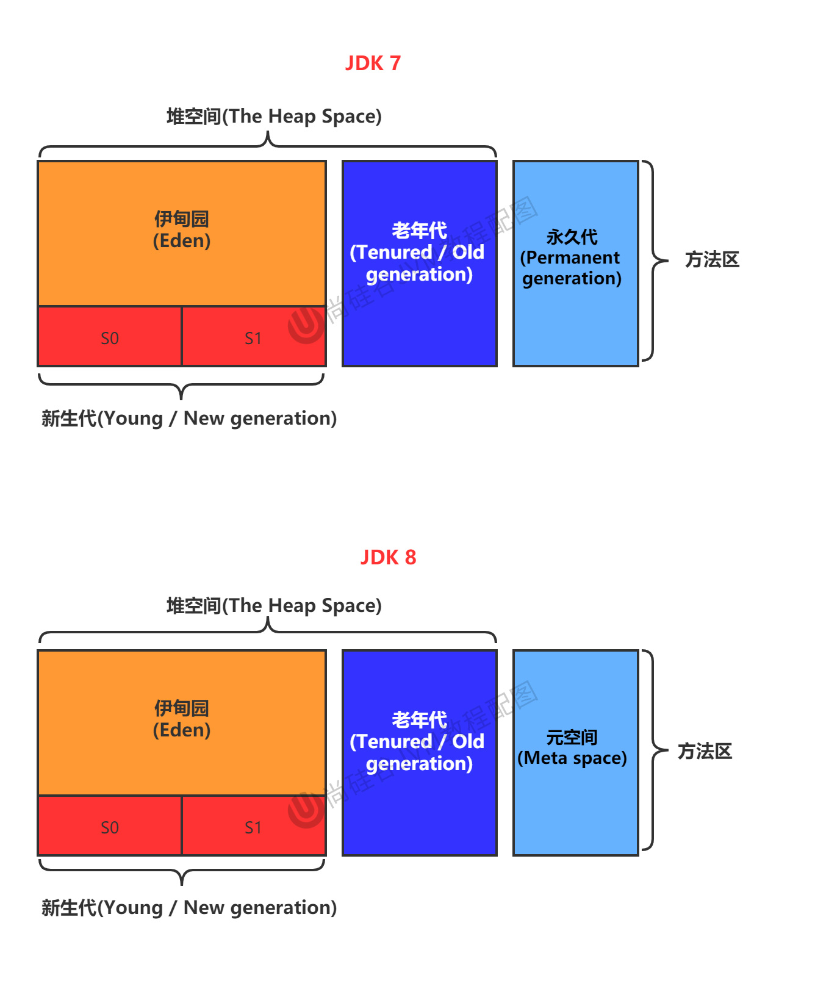
##### 堆空间大小的设置
- 堆的大小在JVM启动时就已经设定好了
	- "-Xms", "-XX:InitialHeapSize" 设置堆区的起始内存
	- "-Xmx", "-XX:MaxHeapSize" 设置堆区的最大内存
- 一旦堆区中的内存大小超过"-Xmx"所指定的最大内存时，将会抛出OutOfMemoryError异常
- 通常会将 -Xms 和 -Xmx 配置相同的值，其目的是为了能够在java垃圾回收机制清理完堆区后不需要重新分隔计算堆区的大小，从而提高性能
- 默认情况下，初始内存大小：物理电脑内存大小/64
             最大内存大小：物理电脑内存大小/4

查看设置的参数：方法一： jps   /   jstat -gc 进程id
				方法二： -XX:+PrintGCDetails


##### 年轻代和老年代
- 存储在JVM中的Java对象可以被划分为两类：
	- 一类是生命周期较短的瞬时对象，这类对象的创建和消亡都非常迅速
	- 另外一类对象的生命周期却非常长，在某些极端的情况下还能够与JVM的生命周期保持一致
- Java堆区进一步细分的话，可以划分为年轻代（YoungGen）和老年代（OldGen）
- 其中年轻代又可以划分为Eden空间、Survivor0空间和Survivor1空间（有时也叫做from区、to区）

- 配置新生代与老年代在堆结构的占比
	- 默认-XX:NewRatio=2，表示新生代占1，老年代占2，新生代占整个堆的1/3
	- 可以修改-XX:NewRatio=4，表示新生代占1，老年代占4，新生代占整个堆的1/5

- 在HotSpot中，Eden空间和另外两个Survivor空间缺省所占的比例是8：1：1（-XX:SurvivorRatio=8）
- 几乎所有Java对象都是在Eden区被new出来的
- 绝大部分的Java对象的销毁都在新生代进行了
- 可以使用“-Xmn”设置新生代最大内存大小

##### 对象分配过程
为新对象分配内存是一件非常严谨和复杂的任务。JVM的设计者们不仅需要考虑内存如何分配、在哪里分配等问题，并且由于内存分配算法与内存回收算法密切相关，所以还需要考虑GC执行完内存回收后是否会在内存空间中产生内存碎片。
1. new的对象先放伊甸园区。此区有大小限制。
2. 当伊甸园的空间填满时，程序又需要创建对象，JVM的垃圾回收器将对伊甸园区进行垃圾回收(Minor GC)，将伊甸园区中的不再被其他对象所引用的对象进行销毁。再加载新的对象放到伊甸园区
3. 然后将伊甸园中的剩余对象移动到幸存者0区。
4. 如果再次触发垃圾回收，此时上次幸存下来的放到幸存者0区的，如果没有回收，就会放到幸存者1区。
5. 如果再次经历垃圾回收，此时会重新放回幸存者0区，接着再去幸存者1区。
6. 啥时候能去养老区呢?可以设置次数。默认是15次。
- 可以设置参数:-XX:MaxTenuringThreshold=\<N>进行设置。
7. 在养老区，相对悠闲。当养老区内存不足时，再次触发GC:Major GC，进行养老区的内存清理。
8. 若养老区执行了Major GC之后发现依然无法进行对象的保存，就会产生OOM异常(java.lang.OutOfMemoryError: Java heap space)

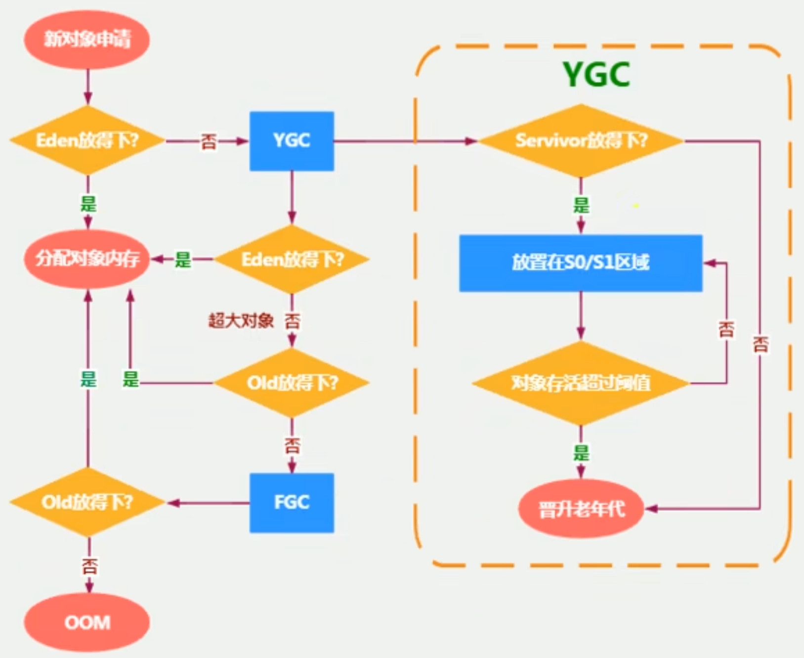


##### Minor GC, Major GC, Full GC
###### 基本介绍
JVM在进行GC时，并非每次都对上面三个内存区域（新生代，老年代，元空间）一起回收的，大部分回收的都是指新生代。
针对HotSpot VM的实现，它里面的GC按照回收区域又分为两大种类型：一种是部分收集（Partial GC），一种是整堆收集（Full GC）

- 部分收集：不是完整收集整个Java堆的垃圾收集。其中又分为：
	- 新生代收集（Minor GC/Young GC）：只是新生代（Eden，S0, S1）的垃圾收集
	- 老年代收集（Major GC/Old GC）：只是老年代的垃圾收集
		- 目前，只有CMS GC会有单独收集老年代的行为
		- 注意，**很多时候Major GC会和Full GC混淆使用**，需要具体分辨是老年代回收还是整堆回收
	- 混合收集（Mixed GC）：收集整个新生代以及部分老年代的垃圾收集
		- 目前，只有G1 GC会有这种行为
- 整堆回收（Full GC）：收集整个java堆和方法区的垃圾收集

###### 年轻代GC（Minor GC）触发机制
- 当年轻代空间不足时，就会触发Minor GC，这里的年轻代满指的是Eden代满，Survivor满不会引发GC。
- Minor GC会引发STW，暂停其他用户的线程，等垃圾回收结束，用户线程才恢复运行

###### 老年代GC（Major GC/Full GC）触发机制
- 指发生在老年代的GC，对象从老年代消失时，我们说“Major GC”或“Full GC”发生了
- 出现了Major GC，经常会伴随至少一次的Minor GC（但非绝对，在Parallel Scavenge收集器的收集策略里就有直接进行Magor GC的策略选择过程）
	- 也就是老年代空间不足时，会先尝试触发Minor GC。如果之后空间还不足，则触发Major GC
- Major GC的速度一般会比Minor GC慢10倍以上，STW的时间更长
- 如果Major GC后，内存还不足，就报OOM了

###### Full GC触发机制（后面细讲）
触发情况五种：
1. 调用System.gc()时，系统建议执行Full GC，但是不必然执行
2. 老年代空间不足
3. 方法区空间不足
4. 通过Minor GC后进入老年代的平均大小大于老年代的可用内存
5. 由Eden区、survivor space0区向1区复制时，对象大小大于To Space可用内存，则把该对象转存到老年代，且老年代的可用内存小于该对象大小
**Full GC是开发或调优中尽量要避免的。这样暂停时间会短一些**。


##### TLAB
为什么会有TLAB？
- 堆区是线程共享区域，任何线程都可以访问到堆区中的共享数据
- 由于对象实例创建在JVM中非常频繁，因此在并发环境下从堆区中划分内存空间是线程不安全的
- 为避免多个线程操作同一地址，需要使用加锁等机制，进而影响分配速度

什么是TLAB？
- 从内存模型而不是垃圾收集的角度，对Eden区域继续进行划分，JVM为**每个线程分配了一个私有缓存区域**，它包含在Eden空间内
- 多个线程同时分配内存时，使用TLAB可以避免一系列的非线程安全问题，同时还能够提升内存分配的吞吐量，因此我们可以将这种内存分配方式称之为**快速分配策略**。
- 尽管不是所有的对象实例都能够在TLAB中成功分配内存，但**JVM确实是将TLAB作为内存分配的首选**。
- 在程序中，可通过选项“-XX:UseTLAB"设置是否开启TLAB空间。
- 默认情况下，TLAB空间的内存非常小，仅占有整个Eden空间的1%，当然我们可以通过选项"-XX:TLABWasteTargetPercent"设置TLAB空间所占Eden空间的百分比大小
- 一旦对象在TLAB空间分配内存失败时，JVM就会尝试通过使用加锁机制确保数据操作的原子性，从而直接在Eden空间中分配内存
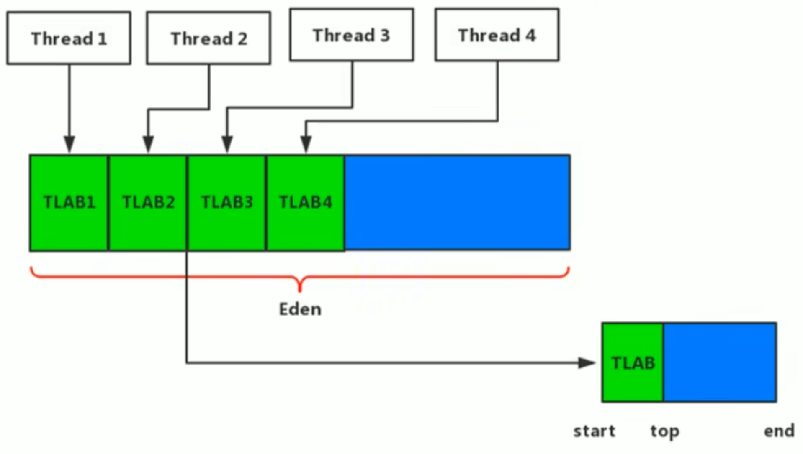
##### 堆空间的常用参数
| jvm参数                               | 说明                    |
| ----------------------------------- | --------------------- |
| -XX:+PrintFlagsInitial              | 查看所有参数的默认初始值          |
| -XX:+PrintFlagsFinal                | 查看所有参数的最终值            |
| -Xms                                | 初始堆空间内存（默认为物理内存的1/64） |
| -Xmx                                | 最大堆空间内存（默认为物理内存的1/4）  |
| -Xmn                                | 设置新生代的大小（初始值及最大值）     |
| -XX:NewRatio                        | 设置新生代与老年代在对结构中的占比     |
| -XX:SurvivorRatio                   | 设置新生代中Eden和S0/S1空间的比例 |
| -XX:MaxTenuringThreshold            | 设置新生代垃圾的最大年龄          |
| -XX:+PrintGCDetails                 | 输出详细的GC处理日志           |
| -XX:+PrintGC                        | 打印gc简要信息              |
| -XX:HandlePromotionFailure（jdk7后失效） | 是否设置空间分配担保            |

在发生Minor GC之前，虚拟机会**检查老年代最大可用的连续空间是否大于新生代所有对象的总空间**。
- 如果大于，则此次Minor GC 是安全的
- 如果小于，则虚拟机会查看-XX:HandlePromotionFailure设置值是否允许担保失败
	- 如果HandlePromotionFailue=true，那么会继续**检查老年代最大可用连续空间是否大于历次晋升到老年代的对象的平均大小
		- 如果大于，则尝试进行一次Minor GC，但这次Minor GC有风险；
		- 如果小于，则改为进行一次Full GC
	- 如果handlePromotionFailure=false，则改为进行一次Full GC
JDK7之后，规则变为**只要老年代的连续空间大于新生代对象总大小或者历次晋升的平均大小就会进行Minor GC，否则进行Full GC**。

##### 逃逸分析
如果经过逃逸分析（Escape Analysis）后发现，一个对象并没有逃逸出方法的话，那么就可能被优化成栈上分配。

- 如何将堆上的对象分配到栈，需要使用逃逸分析手段
- 这是一种可以有效减少Java程序中同步负载和内存堆分配压力的跨函数全局数据流分析算法

- 通过逃逸分析，Java Hotspot编译器能够分析出一个新的对象的引用的使用范围从而决定是否要将这个对象分配到堆上

- 逃逸分析的基本行为就是分析对象动态作用域：
	- 当一个对象在方法中被定义后，对象只在方法内部使用，则认为没有发生逃逸
	- 当一个对象在方法中被定义后，它被外部方法所引用，则认为发生逃逸。例如作为调用参数传递到其他地方中
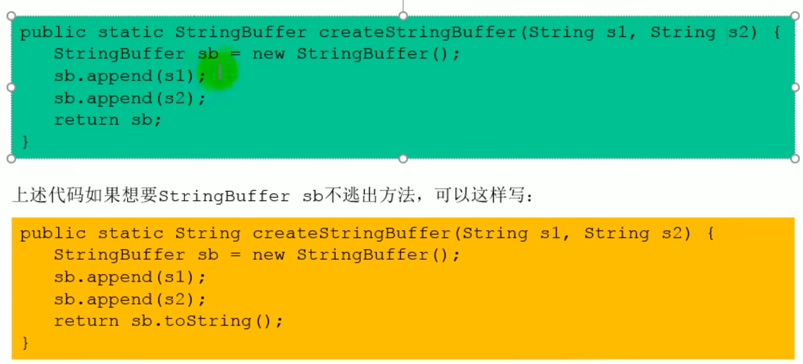

使用逃逸分析，编译器可以对代码做如下优化：
1. 栈上分配：将堆分配转化为栈分配。
2. 同步省略。如果一个对象被发现只能从一个线程被访问到，那么对于这个对象的操作可以不考虑同步
3. 分离对象或标量替换。有的对象可能不需要作为一个连续的内存结构存在也可以被访问到，那么对象的部分（或全部）可以不存储在内存，而是存储在CPU寄存器中。
**标量替换**
标量：指一个无法再分解成更小的数据的数据。Java中的原始数据类型就是标量。
聚合量：还可以分解的数据。Java中的对象就是聚合量。
在JIT阶段，如果经过逃逸分析，发现一个对象不会被外界访问的话，那么经过JIT优化，就会把这个对象拆解成若干个其中包含的若干个成员变量来代替。这个过程就是**标量替换**。
好处：不用创建对象，就不需要分配堆内存了。大大减少堆内存的占用。
设置标量替换： -XX:+EliminateAllocations
`-server -Xmx100m -Xms100m -XX:+DoEscapeAnalysis -XX:+PrintGC -XX:+EliminateAllocations`
这里使用参数如下：
- server：启动Server模式，因为在Server模式下，才可以启用逃逸分析
- -XX:+DoEscapeAnalysis：启用逃逸分析
- -XX:+EliminateAllocations：开启标量替换

## 9. 方法区
#### 0）个人理解
- 方法区是规范，元空间是物理实现
- 静态变量，字符串常量池在物理上在堆中，不在元空间中；逻辑上仍属于方法区
- 运行时常量池和字符串常量池的关系(ai):
> ### 1. 运行时常量池 (Runtime Constant Pool) —— 类的“记账本”
> 
> - **它的前身：** 当你写完 Java 代码编译成 `.class` 文件时，Class 文件里有一块区域叫**Class文件常量池（静态常量池）**，里面记录了这个类用到的各种字面量（比如数字 `1`、字符串 `"hello"`）和符号引用（比如类名、方法名）。
>     
> - **它的诞生：** 当 JVM 加载这个类的时候，就会把 Class 文件常量池里面的内容，加载到内存中，这块内存区域就叫**运行时常量池**。
>     
> - **它的位置：** 属于**方法区**（JDK 8+ 也就是元空间 Metaspace 中）。
>     
> - **它的归属：** **每个类各有一份**（Per-Class）。如果你加载了 100 个类，就有 100 个运行时常量池。
>     
> - **它存什么：** 它无所不包，除了字符串的符号引用，还包含数字常量、类和接口的全局限定名、字段名、方法名等。
>     
> 
> ### 2. 字符串常量池 (String Pool / String Table) —— 唯一的“全局仓库”
> 
> - **它是啥：** 它底层其实是一个 C++ 实现的哈希表（`StringTable`），专门用来缓存字符串对象的**引用**，避免在内存中创建出大量内容相同的字符串对象。
>     
> - **它的位置：** 从 JDK 7 开始，被物理转移到了**堆（Heap）**中。
>     
> - **它的归属：** **全局唯一共享**。整个 JVM 实例中只有这一张表。
>     
> - **它存什么：** 它**只存** `String` 对象的引用（这些 String 对象本身也在堆里）。
>     
> 
> ### 3. 核心：它们俩是如何“联动”的？
> 
> 我们可以把“运行时常量池”想象成你去饭店点菜的**菜单**，把“字符串常量池”想象成厨房的**出餐口（缓存区）**。
> 
> 当 JVM 执行到需要使用字符串字面量的代码时（例如 `String s = "hello";`），底层的交互流程如下：
> 
> 1. **查菜单（运行时常量池）：** JVM 首先在当前类的**运行时常量池**中，找到 `"hello"` 这个字符串的符号引用。
>     
> 2. **去出餐口拿菜（字符串常量池）：** 运行时常量池自己并没有真正的字符串对象，它会顺藤摸瓜，去全局的**字符串常量池（String Pool）**中查找，看是否已经有 `"hello"` 这个对象的引用了（类似于一种**解析**过程，把符号引用转为直接引用）。
>     
> 3. **如果池子里有：** 直接返回字符串常量池中缓存的那个堆内存地址。
>     
> 4. **如果池子里没有：** JVM 会在堆（Heap）中真正 `new` 一个内容为 `"hello"` 的 String 对象，然后把这个新对象的**引用地址**记录到全局的字符串常量池中，最后再把引用返回给你。


#### 1）结构图
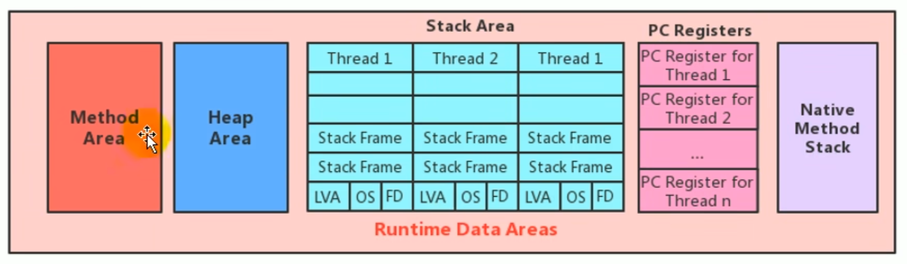
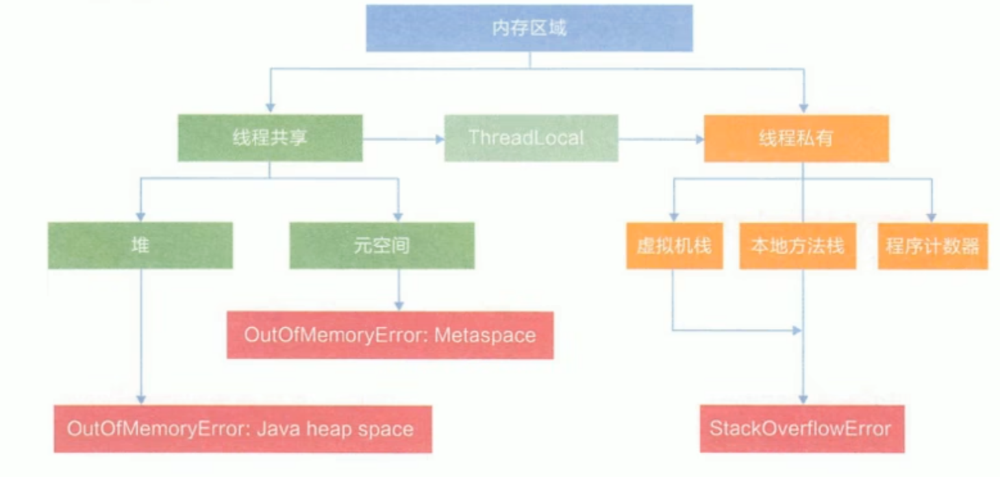

#### 2） 栈、堆、方法区的交互关系
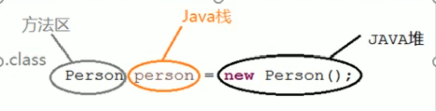
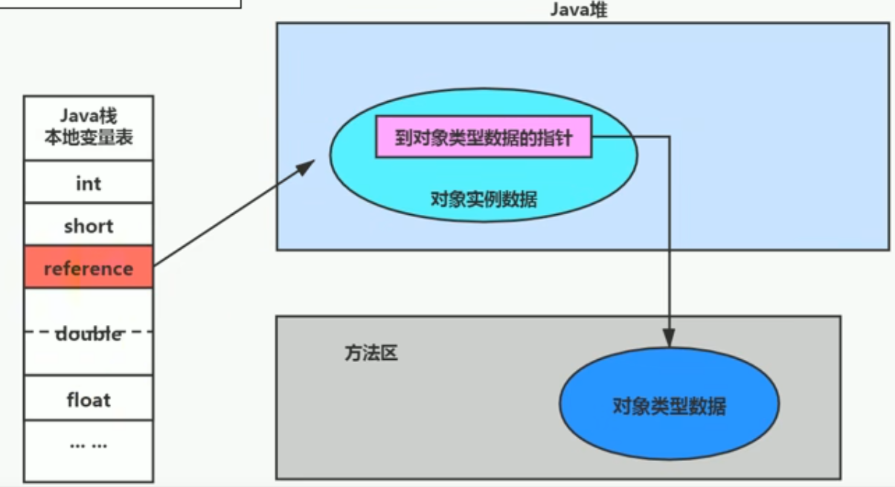


#### 3）简介
尽管所有的方法区在逻辑上是属于堆的一部分，但一些简单的实现可能不会选择去进行垃圾收集或者进行压缩。
方法区还有一个别名叫Non-Heap(非堆)，目的就是要和堆分开。所以**方法区看作是一块独立于Java堆的内存空间**

- 方法区（Method Area）与Java堆一样，是各个线程共享的内存区域。
- 方法区在JVM启动的时候就被创建，并且它的实际的物理内存空间中和Java堆区一样都可以是不连续的。
- 方法区的大小，跟堆空间一样，可以选择固定大小或者可扩展。
- 方法区的大小决定了系统可以保存多个类，如果系统定义了太多的类，导致方法区溢出，虚拟机同样会抛出内存溢出错误：`java.lang.OutOfMemoryError:PermGen space`或者`java.lang.OutOfMemoryError:Metaspace`
	- 加载大量的第三方jar包
	- Tomcat部署的工程过多（30-50个）
	- 大量动态的生成反射类
- 关闭JVM就会释放这个区域的内存

> java中永久代，元空间和方法区之间的关系?
> 
> - **方法区** = 规范（理想）。
>    
>- **永久代** = 过去式的实现（住在堆里，容易因空间不足而报错; 只有hotspot中有过永久代）。
  >  
>- **元空间** = 现在的实现（住在本地内存里，空间大，更稳定）。（注意：方法区的静态变量等存在java堆中）
>  
>  **元空间不在虚拟机设置的内存中，而是使用本地内存。**

#### 4）设置方法区大小的参数
- 方法区的大小不必是固定的，jvm可以根据应用的需要动态调整。
- 元数据区大小可以使用参数-XX:MetaspaceSize（初始分配空间）和-XX:MaxMetaspaceSize（最大可分配空间）
- 默认值依赖于平台。windows下，-XX:MetaspaceSize是21M，-XX:MaxMetaspaceSize的值是一个巨大的数字，即没有限制
- 与永久代不同，如果不指定大小，默认情况下，虚拟机会耗尽所有的可用系统内存。
  如果元数据区发生溢出，虚拟机一样会抛出异常OutOfMemoryError:Metaspace
- -XX:MetaspaceSize：设置初始的元空间的大小。对于一个64位的服务器端JVM来说，其默认的-XX:MetaspaceSize值为21MB。这就是初始的高水位线，一旦触及这个水位线，Full GC将会触发并卸载没用的类（即这些类对应的类加载器不再存活），然后这个高水位线将会重置。新的高水位线的值取决于GC后释放了多少元空间。如果释放的元空间不足，那么在不超过MaxMetaspaceSize时，适当提高该值。如果释放空间过多，则适当降低该值。
- 如果初始化的高水位线设置过低，上述高水位线调整情况会发生很多次。通过垃圾回收器的日志可以观察到Full GC多次调用。为了避免频繁地GC，建议将`-XX:MetaspaceSize`设置为一个相对较高的值
#### 5) 如何解决OOM
1. 要解决OOM异常或heap space异常，一般的手段是首先通过内存映像分析工具（如Eclipse Memory Analyzer）对dump出来的堆转储快照进行分析，重点是确认内存中的对象是否是必要的，也就是要先分清楚到底是出现了内存泄漏（Memory Leak）还是内存溢出（Memory Overflow）
2. 如果是内存泄漏，可进一步通过工具查看泄漏对象到GC Roots的引用链。于是就能找到泄漏对象是通过怎样的路径与GC Roots相关联并导致垃圾收集器无法自动回收它们的。掌握了泄漏对象的类型信息，以及GC Roots引用链的信息，就可以比较准确地定位出泄漏代码的位置。
3. 如果不存在内存泄漏。扩大堆的大小设置；检查对象生命周期是否有过长的；等优化代码。

#### 6）方法区的内部结构
##### 方法区存储什么？
存储已被虚拟机加载的**类型信息、常量、静态变量、即时编译器（JIT）编译后的代码缓存**等。


##### 类型信息
对每个加载的类型（类class、接口interface、枚举enum、注解annotation），JVM必须在方法区中存储以下类型信息：
1. 这个类型的完整有效名称（全名=包名.类名)
2. 这个类型直接父类的完整有效名（对于interface或是java.lang.Object，都没有父类）
3. 这个类型的修饰符（public，abstract，final的某个子集）
4. 这个类型实现接口的一个有序列表

##### 域（Field/属性/字段）信息
- JVM必须在方法区中保存类型的所有域的相关信息以及域的声明顺序
- 域的相关信息包括：域名称、域类型、域修饰符（public、private、protected、static、final、volatile、transient的某个子集）

##### 方法（Method）信息
JVM必须保存所有方法的以下信息，同域信息一样包括声明顺序：
- 方法名称
- 方法的返回类型（或void）
- 方法参数的数量和类型（按顺序）
- 方法的修饰符（public，private，protected，static，final，synchronized，native，abstract的一个子集）
- 方法的字节码（bytecodes）、操作数栈、局部变量表及大小（abstract和native方法除外）
- 异常表（abstract和native方法除外）
	- 每个异常处理的开始位置、结束位置、代码处理在程序计数器中的偏移地址、被捕获的异常类的常量池索引

##### non-final的类变量
- 静态变量和类关联在一起，随着类的加载而加载 ，它们成为类数据在逻辑上的一部分
- 类变量被类的所有实例共享，即使没有类实例时你也可以访问它

##### static final：全局常量
被声明为final的类变量的处理方法则不同，每个全局常量在编译的时候就会被分配了。


##### class文件中常量池的理解
- 方法区，内部包含了运行时常量池
- 字节码文件，内部包含了常量池
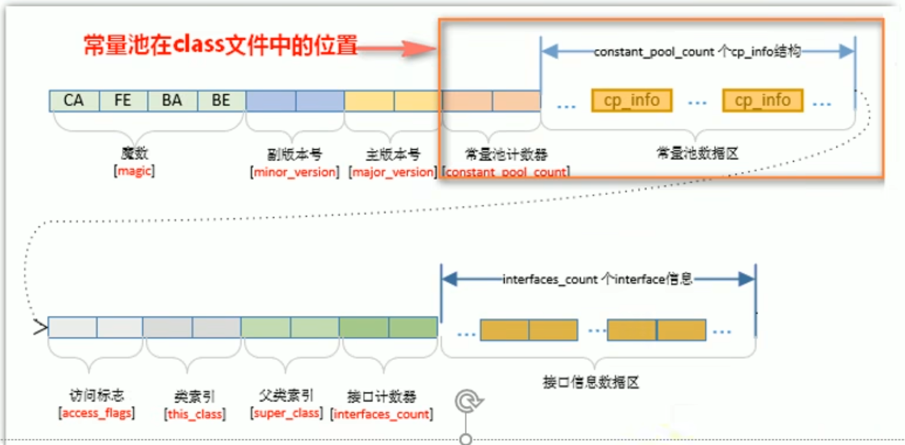
一个有效的字节码文件中除了包含类的版本信息、字段、方法以及接口等描述信息外，还包含一项信息那就是常量池表（Constant Pool Table），包括各种字面量和对类型、域和方法的符号引用。

**为什么需要常量池？**
一个java源文件中的类、接口，编译后产生一个字节码文件。而java中的字节码需要数据支持，通常这种数据会很大以至于不能直接存到字节码里，换另一种方式，可以存到常量池，这个字节码包含了指向常量池的引用。在动态链接的时候会用到运行时常量池，之前有介绍。
比如，如下的代码：
```java
public class SimpleClass{
	public void sayHello() {
		System.out.println("hello");
	}
}
```
虽然只有194字节，但是里面却使用了String、System、PrintStrea及Object等结构。这里代码量其实已经很小了。如果代码多，引用到的结构会更多，这里就需要常量池了。

**小结**
常量池，可以看作是一张表，虚拟机指令根据这张常量表找到要执行的类名、方法名、参数类型、字面量等类型。

##### 运行时常量池
- 运行时常量池（Runtime Constant Pool）是方法区的一部分。
- 常量池表（Constant Pool Table）是Class文件的一部分，**用于存放编译期生成的各种字面量与符号引用，这部分内容将在类加载后存放到方法区的运行时常量池中**。
- 运行时常量池，在加载类和接口到虚拟机后，就会创建对应的运行时常量池。
- JVM为每个已加载的类型（类或接口）都维护一个常量池。池中的数据项像数组项一样，是通过索引访问的。
- 运行时常量池中包含多种不同的常量，包括编译期就已经明确的数值字面量，也包括到运行期解析后才能够获得的方法或字段引用。此时不再是常量池中的符号地址了，这里换为真实地址。
	- 运行时常量池，相对于Class文件常量池的另一重要特征是：具备动态性。
- 运行时常量池类似于传统编程语言中的符号表（symbol table），但是它所包含的数据却比符号表要更加丰富一些。
- 当创建类或接口的运行时常量池时，如果构造运行时常量池所需的内存空间超过了方法区所能提供的最大值，则JVM会抛OutOfMemoryError异常。

##### hotspot中方法区的变化
|           |                                               |
| --------- | --------------------------------------------- |
| jdk1.6及之前 | 有永久代（permanent generation），静态变量存放在永久代上        |
| jdk1.7    | 有永久代，但已逐步“去永久代”，字符串常量池、静态变量移除，保存在堆中           |
| jdk1.8及之后 | 无永久代，类型信息、字段、方法、常量保存在本地内存的元空间，但字符串常量池、静态变量仍在堆 |

**StringTable为什么要调整？**
jdk7中将StringTable放到了堆空间中。因为永久代的回收效率很低，在full gc的时候才会触发。而full gc是老年代的空间不足、永久代不足时才会触发。这就导致StringTable回收效率不高。而我们开发中会有大量的字符串被创建，回收效率低，导致永久代内存不足。放到堆里，能及时回收内存。

##### 如何证明静态变量存在哪？
```java
public class StaticObjTest {  
    static class Test {  
        static ObjectHolder staticObj = new ObjectHolder();  // staricObj随着Test的类型信息存放在方法区（不在元空间，在java堆中）
        ObjectHolder instanceObj = new ObjectHolder();  //instanceObj随着Test的对象实例存放在Java堆
  
        void foo() {  
            ObjectHolder localObj = new ObjectHolder();  //localObject则是存放在foo（）方法栈的局部变量表中
            System.out.println("done");  
        }  
    }  
  
    private static class ObjectHolder {  
    }  
  
    public static void main(String[] args) {  
        Test test = new StaticObjTest.Test();  
        test.foo();  
    }  
}
// 三个对象的数据在内存中的地址都落在Eden区范围内，所以结论：只要是对象实例必然会在Java堆中分配
```

##### 方法区垃圾回收
方法区的垃圾回收主要回收两部分内容：常量池中废弃的常量和不再使用的类型。

- 先来说说方法区内常量池之中主要存放的两大类常量：字面量和符号引用。字面量比较接近Java语言层次的常量概念，如文本字符串、被声明为final的常量值等。而符号引用则属于编译原理方面的概念，包括下面三类常量：
	1. 类和接口的全限定名
	2. 字段的名称和描述符
	3. 方法的名称和描述符
- HotSpot虚拟机对常量池的回收策略是很明确的，**只要常量池中的常量没有被任何地方引用，就可以被回收**。
- 回收废弃常量与回收Java堆中的对象非常类似。

- 判断一个常量是否废弃简单，判断一个类型是否废弃比较难，需要满足以下三个条件
	- 该类所有的实例都已经被回收，也就是Java堆中不存在该类及其任何派生子类的实例
	- 加载该类的类加载器已经被回收，这个条件除非是经过精心设计的可替换类加载器的场景，如OSGi、JSP的重加载等，否则通常是很难达成的。
	- 该类对应的java.lang.Class对象没有在任何地方被引用，无法在任何地方通过反射访问该类的方法
- Java虚拟机被允许对满足上述三个条件的无用类进行回收，这里说的仅仅是“被允许”，而并不是和对象一样，没有引用了就必然会被回收。关于是否要对类型进行回收，HotSpot虚拟机提供了`-Xnoclassgc`参数进行控制，还可以使用`-verbose:class`以及`-XX:+TraceClass-Loading`, `-XX:+TraceClassUnLoading`查看类加载和卸载信息
- 在大量使用反射、动态代理、CGLib等字节码框架，动态生成JSP以及OSGi这类频繁自定义类加载器的场景中，通常都需要Java虚拟机具备类型卸载的能力，以保证不会对方法区造成过大的内存压力。

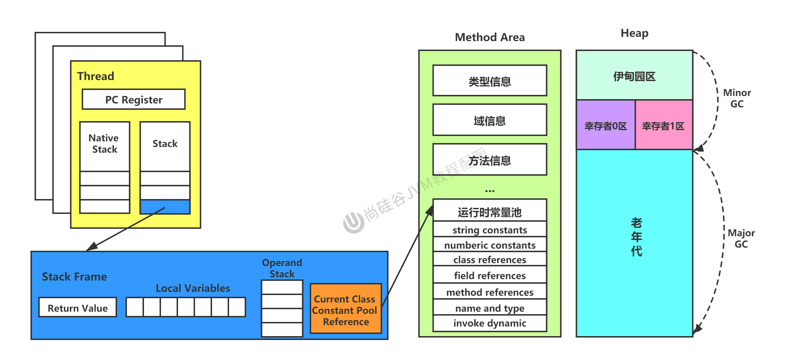

## 10. 对象的实例化、内存布局与访问定位
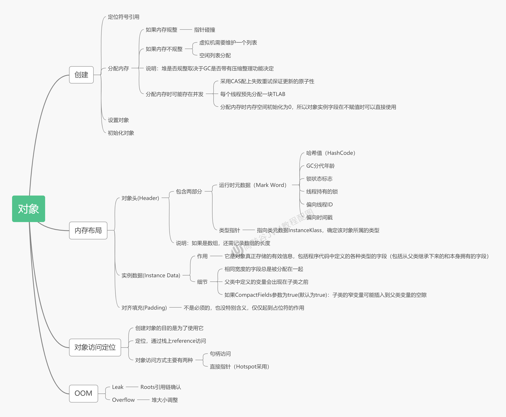
### 对象的实例化
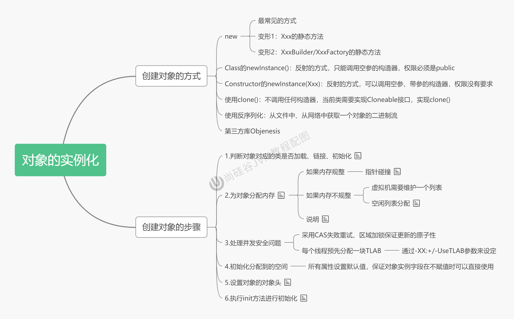

### 对象的内存布局
```java
public class CustomerTest {  
    public static void main(String[] args) {  
        Customer cust = new Customer();  
    }  
}
```

```java
public class Customer{  
    int id = 1001;  
    String name;  
    Account acct;  
  
    {  
        name = "匿名客户";  
    }  
    public Customer(){  
        acct = new Account();  
    }  
  
}  
class Account{  
  
}
```
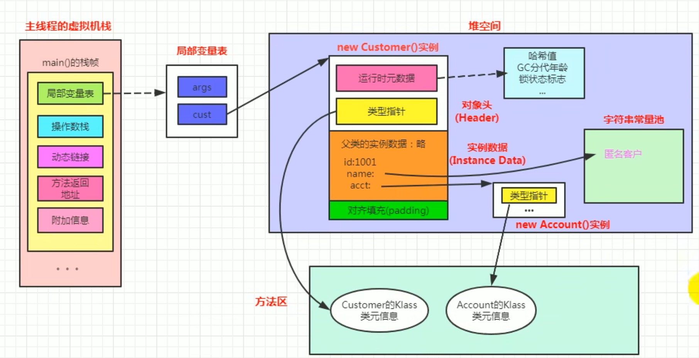

### 对象的访问定位

**JVM是如何通过栈帧中的对象引用访问到其内部的对象实例的呢？**
把堆中对象实例的地址赋给栈帧中的对象引用

## 11. 直接内存
- 不是虚拟机运行时数据区的一部分，也不是《规范》中定义的内存区域
- 直接内存是在Java堆外的、直接向系统申请的内存空间
- 来源于NIO，通过存在堆中的DirectByteBuffer操作Native内存
- 通常，访问直接内存的速度会优于Java堆。即读写性能高。
	- 因此处于性能考虑，读写频繁的场合可能会考虑使用直接内存
	- Java的NIO库允许Java程序使用直接内存，用于数据缓冲区

- 也可能导致OutOfMemoryError异常
- 由于直接内存在Java堆外，因此它的大小不会直接受限于-Xmx指定的最大堆大小，但是系统内存是有限的，Java堆和直接内存的总和依然受限于操作系统能给出的最大内存。
- 缺点：
	- 分配回收成本较高
	- 不受JVM内存回收管理
- 直接内存大小可以通过MaxDirectMemorySize设置
- 如果不指定，默认与堆的最大值-Xmx参数值一致（元空间默认为本地内存大小）

## 12. 执行引擎
### 图
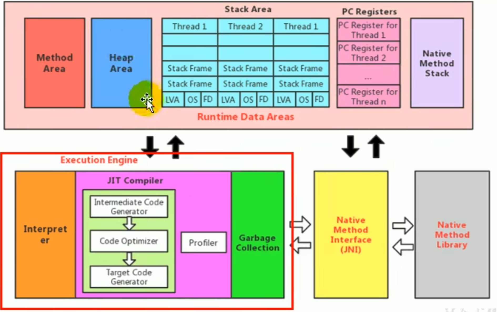
### 概述
- 执行引擎是Java虚拟机核心的组成部分之一
- “虚拟机”是一个相对于“物理机”的概念，这两种机器都有代码执行能力，其区别是物理机的执行引擎是直接建立在处理器、缓存、指令集和操作系统层面上的，而虚拟机的执行引擎则是由软件自行实现的，能执行不被硬件直接支持的指令集格式。

JVM的主要任务是**负责装载字节码到其内部**，但字节码并不能直接运行在操作系统之上，因为字节码指令并非等价于本地机器指令，它内部包含的仅仅只是一些能被JVM所识别的字节码指令、符号表，以及其他辅助信息。
那么，如果想要让一个Java程序运行起来，执行引擎（Execution Engine）的任务就是**将字节码指令解释/编译为对应平台上的本地机器指令才可以**。

### 执行引擎的工作过程
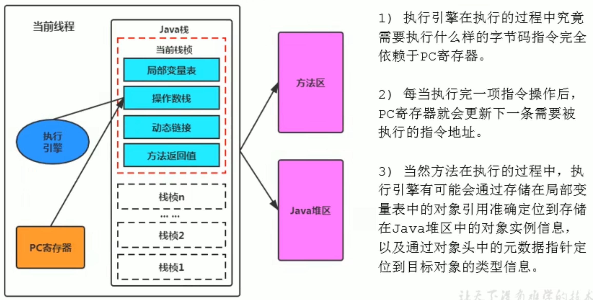

### Java代码编译和执行的过程
大部分的程序代码转换成物理机的目标代码或虚拟机能执行的指令集之前，都需要经过下图的各个步骤。
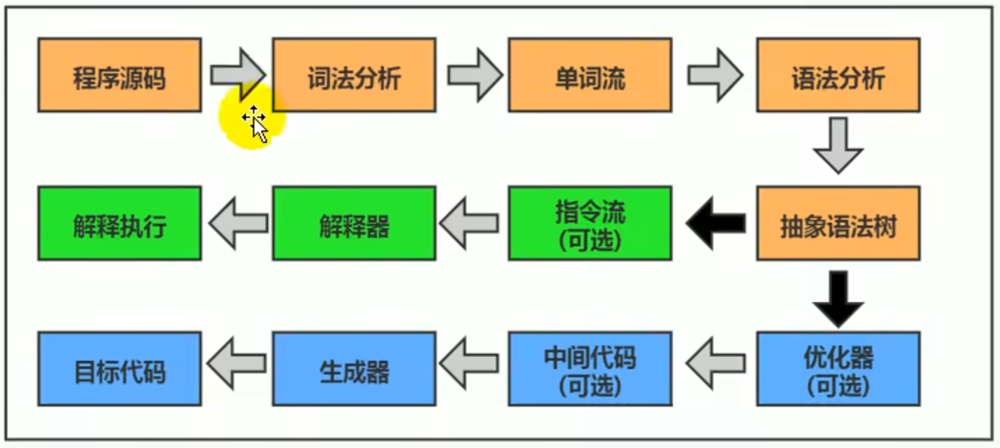

Java代码编译是由Java源码编译器来完成，流程图如下所示：
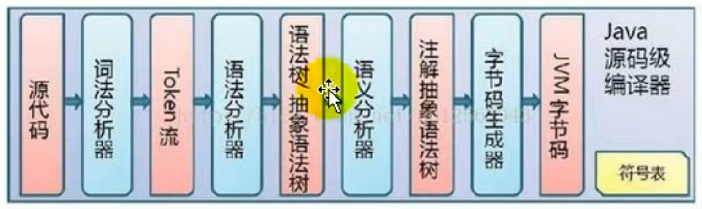

Java字节码的执行是由JVM执行引擎来完成，流程图如下所示：
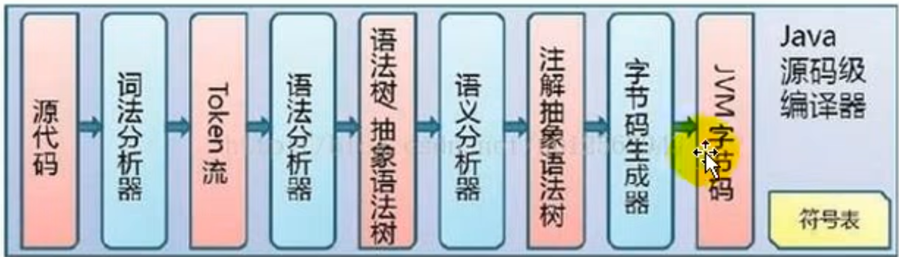

**Q:什么是解释器（Interpreter），什么是JIT编译器**？
A: 解释器：当Java虚拟机启动时会根据预定义的规范对字节码采用逐行解释的方式执行，将每条字节码文件中的内容“翻译”为对应平台的本地机器指令执行。
JIT（Just In Time Compiler）编译器：就是虚拟机将源代码直接编译成本地机器平台相关的机器语言。

### 机器码、指令、汇编、高级语言理解与执行过程
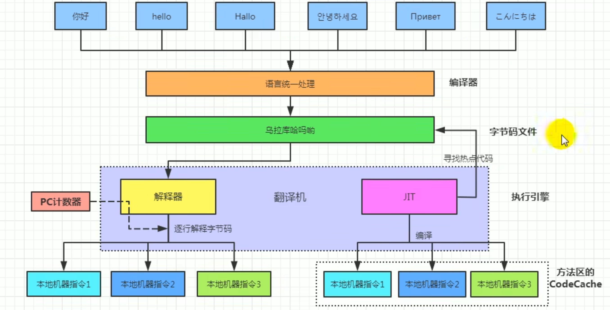
字节码：
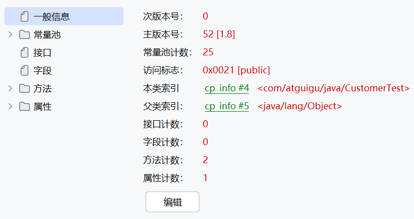
机器码：给机器运行的码

### 解释器
- 解释器是一个运行时的“翻译者”，将字节码文件中的内容“翻译”为对应平台的本地机器指令执行。
- 当一条字节码指令被解释执行完成后，接着再根据PC寄存器中记录的下一条需要被执行的字节码指令执行解释操作

**字节码解释器**（过去）：执行时通过**纯软件代码**模拟字节码的执行，效率非常低下。
**模板解释器**（现在）：将**每一条字节码和一个模板函数相关联**，模板函数中直接产生这条字节码执行时的机器码，从而很大程度上提高了解释器的性能。在HotSpot VM中，解释器主要由Interpreter模块和Code模块构成。
	- Interpreter模块：实现了解释器的核心功能
	- Code模块：用于管理HotSpot VM在运行时生成的本地机器指令

为了解决解释器低效的问题，JVM平台支持一种叫作**即使编译**的技术。即使编译的目的是避免函数被解释执行，**将整个函数体编译成为机器码，每次函数执行时，只执行编译后的机器码即可**，这种方式可以使执行效率大幅度提高。

### JIT编译器
HotSpot采用解释器与即使编译器并存的架构。

“编译器”概念解释：
- Java语言的“编译期”其实是一段“不确定”的操作过程，因为它可能是指一个**前端编译器**（或“编译器的前端”），把.java文件转变成.class文件
- 也可能是指虚拟机的**后端运行期编译器**(JIT编译器，Just In Time Compiler)把字节码转变成机器码的过程
- 还可能是指使用**静态提前编译器**（AOT编译器，Ahead Of Time Compiler）直接把.java文件编译成本地机器码代码的过程。（即时编译器在运行时编译，AOT在运行前编译）

### 热点代码探测确定何时JIT
#### 1）概述
热点代码：一个被多次调用的代码，或者一个方法体内部循环次数较多的循环体
热点探测：HotSpot VM采用的是**基于计数器的热点探测**。HotSpot VM将会为每一个方法都建立2个不同类型的计数器，分别为方法调用计数器（Invocation Counter）和回边计数器（Back Edge Counter）
	- **方法调用计数器**用于统计方法的调用次数
	- **回边计数器**则用于统计循环体执行的循环次数

#### 2）方法计数器
- 这个计数器就用于统计方法被调用的次数，它的默认阈值在Client模式下是1500次，在Server模式下是10000次。超过这个阈值，就会触发JIT编译
- 这个阈值可以通过虚拟机参数`-XX:CompileThreshold`来人为设定
- 当一个方法被调用时，会先检查该方法是否存在被JIT编译过的版本，如果存在，则优先使用编译后的本地代码来执行。如果不存在已被编译过的版本，则将此方法的调用计数器值加1. 然后判断**方法调用计数器与回边计数器值之和**是否超过方法调用计数器的阈值。如果已经超过阈值，那么将会向即时编译器提交一个该方法的代码编译请求。
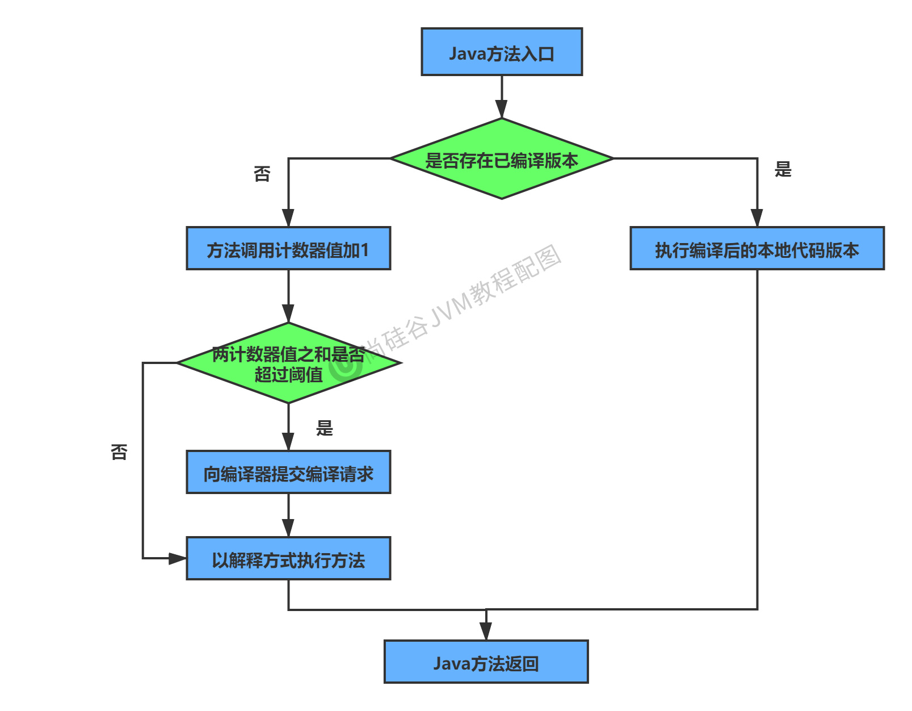

#### 3）热度衰减
- 如果不做任何设置，方法调用计数器统计的并不是方法被调用的绝对次数，而是一个相对的执行频率，即一**段时间之内方法被调用的次数**。当超过一定的时间限度，如果方法的调用次数仍然不足以让它提交给即时编译器编译，那这个方法的调用计数器就会被**减少一半**，这个过程称为方法调用计数器热度的**衰减**（Counter Decay），而这段时间就称为此方法统计的**半衰周期**（Counter Half Life Time）。
- 进行热度衰减的动作是在虚拟机进行垃圾收集时顺便进行的，可以使用虚拟机参数`XX:-UseCounterDecay`来关闭热度衰减，让方法计数器统计方法调用的绝对次数，这样，只要系统运行时间足够长，绝大部分方法都会被编译成本地代码。
- 另外，可以使用`XX:CounterHalfLifeTime`参数设置半衰周期的时间，单位是秒。

#### 4）回边计数器
它的作用是统计一个方法中**循环体代码执行的次数**，在字节码中遇到控制流向后跳转的指令称为”回边“（Back Edge）。显然，建立回边计数器统计的目的就是为了触发OSR（On-Stack Replacement，栈上替换，是 JIT 编译器的一项关键优化技术，用于在程序运行过程中，将正在解释执行的热点代码，尤其是长时间运行的循环，动态替换为已编译的机器码，从而显著提升性能）编译。

### 设置关于解释器和编译器的参数
缺省情况下，HotSpot VM采用解释器与即时编译器并存的架构，当然开发人员可以根据具体的应用场景，通过命令显示地为Java虚拟机指定在运行时到底是**完全采用解释器**执行，还是**完全采用即时编译器**执行。如下所示：
- `-Xint`：完全采用解释器模式执行程序。
- `-Xcomp`：完全采用即时编译器模式执行程序。如果即时编译器出现问题，解释器会介入执行。
- `-Xmixed`：采用解释器+即时编译器的混合模式共同执行程序
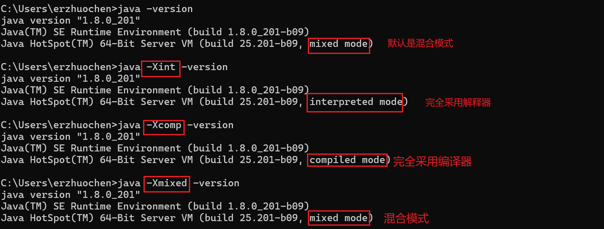

### JIT分类
#### 1）概述
在HotSpot VM中内嵌有两个JIT编译器，分别为Client Compiler和Server Compiler，但大多数情况下我们简称为C1编译器和C2编译器。开发人员可以通过如下命令显示指定Java虚拟机在运行时到底使用哪一种即时编译器，如下所示：
- `-client`：指定Java虚拟机运行在Client模式下，并使用C1编译器。
	- C1编译器会对字节码进行**简单和可靠的优化，耗时短**，以达到更快的编译速度。
- `-server`：指定Java虚拟机运行在Server模式下，，并使用C2编译器。（64位jdk中默认为server，就算使用client参数也会被忽视）
	- C2进行**耗时较长的优化，以及激进优化**。但优化的代码执行效率更高。
#### 2）C1和C2编译器的优化策略
- C1编译器上主要有方法内联，去虚拟化、冗余消除。
	- 方法内联：将引用的函数代码编译到引用点处，这样可以减少栈帧的生成，减少参数传递以及跳转过程
	- 去虚拟化：对唯一的实现类进行内联
	- 冗余消除：在运行期间把一些不会执行的代码折叠掉
- C2的优化主要是在全局层面，逃逸分析是优化的基础。基于逃逸分析在C2上有如下几种优化：
	- 标量替换：用标量值代替聚合对象的属性值
	- 栈上分配：对于未逃逸的对象分配对象在栈而不是在堆
	- 同步消除：清除同步操作，通常指synchronized

**分层编译**（Tiered Compilation）策略：程序解释执行（不开启性能监控）可以触发C1编译，将字节码编译成机器码，可以进行简单优化，也可以加上性能监控，C2编译会根据性能监控信息进行激进优化。

在Java7版本之后，一旦显示指定命令”-server"时，默认将会开启分层编译策略。

## 13. StringTable

### 个人理解
- 常量池中存储的是引用。
- StringBuilder的toString方法不会把字符串加入到常量池中
- String tem = new String("ab") 做了什么？（当常量池中没有”ab“时）
	- 通过new，在堆中创建String对象（对象1）
	- 在堆中创建”ab“（对象2），在堆中的字符串常量池中存入”ab“的引用。此时，即为常量池中加入了”ab“
	- 使用常量池中的"ab"初始化String对象
	- 上述步骤总共创建了2个对象

### String的基本特性
- String：字符串
	- String s1 = "hello"; // 字面量的定义方式，存储在字符串常量池，字符串常量池在堆中
		- **0或1个对象**:可能创建0个（已存在时）或1个（不存在时）对象
		- **在常量池中**：对象在常量池中
		- **可能共享**：相同字面量共享同一个对象
	- String s2 = new String("hello"); // 创建类的定义方式，存储在堆空间
		- **1或2个对象**：一定创建1个堆对象 + 可能创建1个常量池对象（如果常量池不存在该字面量）
		- **堆中对象**：s2指向的是堆中新创建的对象
		- **不共享**：每次都创建新的堆对象
- String被声明为final，不可被继承
- String实现了Serializable接口：表示字符串是支持序列化的。实现了Comparable接口：表示String可以比较大小
- jdk1.9后，String不再使用char[]，改成了使用byte[]加上编码标记，节省了一些空间

- String：代表不可变的字符序列。简称：**不可变性**。
	- 当对字符串重新赋值时，需要重新指定内存区域赋值，不能使用原有的value进行赋值。
	- 当对现有的字符串进行拼接操作时，也需要重新指定内存区域赋值，不能使用原有的value进行赋值。
	- 当调用String的replace()方法修改字符或字符串时，也需要重新指定内存区域赋值，不能使用原有的value进行赋值
- 通过字面量的方式（区别于new）给一个字符串赋值，此时的字符串值声明在字符串常量池中。
```java
public class StringTest1 {  
    @Test  
    public void test1() {  
        String s1 = "abc";//字面量定义的方式，"abc"存储在字符串常量池中  
        String s2 = "abc";  
  
        System.out.println(s1 == s2); // true  
  
        s1 = "hello";  
  
        System.out.println(s1 == s2);// false  
  
        System.out.println(s1);//hello  
        System.out.println(s2);//abc  
  
    }  
  
    @Test  
    public void test2() {  
        String s1 = "abc";  
        String s2 = "abc";  
        s2 += "def";  
        System.out.println(s1 == s2);// false  
        System.out.println(s2);//abcdef  
        System.out.println(s1);//abc  
    }  
  
    @Test  
    public void test3() {  
        String s1 = "abc";  
        String s2 = s1.replace('a', 'm');  
        System.out.println(s1 == s2);//false  
        System.out.println(s1);//abc  
        System.out.println(s2);//mbc  
    }  
}
```

```java
public class StringExer {  
    String str = new String("good");  
    char[] ch = {'t', 'e', 's', 't'};  
  
    public void change(String str, char ch[]) {  // java是值传递
        str = "test ok";  
        ch[0] = 'b';  
    }  
  
    public static void main(String[] args) {  
        StringExer ex = new StringExer();  
        ex.change(ex.str, ex.ch);  
        System.out.println(ex.str);//good，change修改了引用指向的值
        System.out.println(ex.ch);//best，change修改了引用指向的地址中的值
    }  
  
}
```

- **字符串常量池是不会存储相同内容的字符串的**。

- String的String Pool是一个固定大小的Hashtable，默认值大小长度是60013(jdk8)。 如果放进String Pool的String非常多，就会造成Hash冲突严重，从而导致链表很长，而链表长了后直接会造成的影响就是当调用String.intern时性能会大幅下降
- 使用`-XX:StringTableSize`可设置StringTable的长度
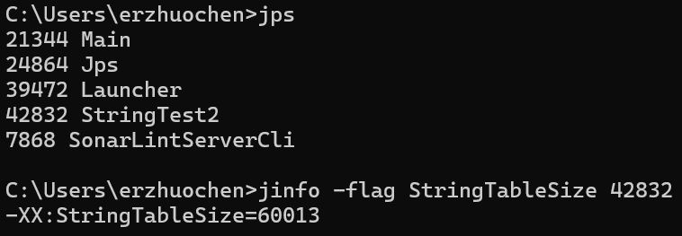
### String的内存分配
- 在java语言中有8种基本数据类型和一种比较特殊的类型String。这些类型为了使它们在运行过程中速度更快、更节省内存，都提供了一种**常量池的概念**。
- 常量池就类似一个Java系统级别提供的缓存。8种基本数据类型的常量池都是系统协调的，**String类型的常量池比较特殊**。它的主要使用方法有两种。
	- 直接使用双引号声明出来的String对象直接存储在常量池中。
	- 如果不是用双引号声明的String对象，可以使用String提供的intern()方法。
- java 7之后，字符串常量池被放到了堆中

- Java规范里要求**完全相同**的**字符串字面量**，应该包含**同样的Unicode字符序列**（包含同一份码点序列的常量），并且必须是指向**同一个String类实例**。


### 字符串拼接操作
1. 常量与常量的拼接结果在常量池，原理是编译期优化
2. 常量池中不会存在相同内容的常量
3. 只要其中有一个是变量，结果就在堆中（指堆中不是常量池的区域）。变量拼接的原理是StringBuilder
4. 如果拼接的结果调用intern()方法，则主动将常量池中还没有的字符串对象放入池中，并返回此对象地址

**一些例子**：
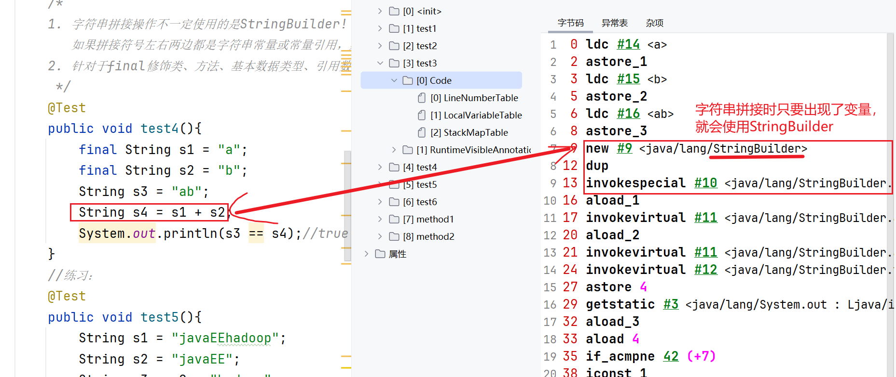
```java
public class StringTest5 {  
    @Test  
    public void test1(){  
        String s1 = "a" + "b" + "c";//编译期优化：等同于"abc"  
        String s2 = "abc"; //"abc"一定是放在字符串常量池中，将此地址赋给s2  
        /*         
         * 最终.java编译成.class,再执行.class  
         * String s1 = "abc";         
         * String s2 = "abc"         
         */        
        System.out.println(s1 == s2); //true  
        System.out.println(s1.equals(s2)); //true  
    }  
  
    @Test  
    public void test2(){  
        String s1 = "javaEE";  
        String s2 = "hadoop";  
  
        String s3 = "javaEEhadoop";  
        String s4 = "javaEE" + "hadoop";//编译期优化  
        //如果拼接符号的前后出现了变量，则相当于在堆空间中new String()，具体的内容为拼接的结果：javaEEhadoop  
        String s5 = s1 + "hadoop";  
        String s6 = "javaEE" + s2;  
        String s7 = s1 + s2;  
  
        System.out.println(s3 == s4);//true  
        System.out.println(s3 == s5);//false  
        System.out.println(s3 == s6);//false  
        System.out.println(s3 == s7);//false  
        System.out.println(s5 == s6);//false  
        System.out.println(s5 == s7);//false  
        System.out.println(s6 == s7);//false  
        //intern():判断字符串常量池中是否存在javaEEhadoop值，如果存在，则返回常量池中javaEEhadoop的地址；  
        //如果字符串常量池中不存在javaEEhadoop，则在常量池中加载一份javaEEhadoop，并返回次对象的地址。  
        String s8 = s6.intern();  
        System.out.println(s3 == s8);//true  
    }  
  
    @Test  
    public void test3(){  
        String s1 = "a";  
        String s2 = "b";  
        String s3 = "ab";  
        /*  
        （相关字节码见上图）
	        如下的s1 + s2 的执行细节：(变量s是我临时定义的）  
	        ① StringBuilder s = new StringBuilder();        
	        ② s.append("a")        
	        ③ s.append("b")        
	        ④ s.toString()  --> 约等于 new String("ab")  
	        补充：在jdk5.0之后使用的是StringBuilder,在jdk5.0之前使用的是StringBuffer  
         */        
         
        String s4 = s1 + s2;
        // s3指向常量池中的"ab", s4指向堆中的String实例对象（由StringBuffer的toString方法产生）
        System.out.println(s3 == s4);//false  
    }  
    /*  
    1. 字符串拼接操作不一定使用的是StringBuilder!  
       如果拼接符号左右两边都是字符串常量或常量引用，则仍然使用编译期优化，即非StringBuilder的方式。  
    2. 针对于final修饰类、方法、基本数据类型、引用数据类型的量的结构时，能使用上final的时候建议使用上。  
     */    
    @Test  
    public void test4(){  
        final String s1 = "a";  
        final String s2 = "b";  
        String s3 = "ab";  
        String s4 = s1 + s2;  
        System.out.println(s3 == s4);//true  
    }  
    //练习：  
    @Test  
    public void test5(){  
        String s1 = "javaEEhadoop";  
        String s2 = "javaEE";  
        String s3 = s2 + "hadoop";  
        System.out.println(s1 == s3);//false  
  
        final String s4 = "javaEE";//s4:常量  
        String s5 = s4 + "hadoop";  
        System.out.println(s1 == s5);//true  
  
    }  
  
    /*  
    体会执行效率：通过StringBuilder的append()的方式添加字符串的效率要远高于使用String的字符串拼接方式！  
    详情：① StringBuilder的append()的方式：自始至终中只创建过一个StringBuilder的对象  
          使用String的字符串拼接方式：创建过多个StringBuilder和String的对象  
         ② 使用String的字符串拼接方式：内存中由于创建了较多的StringBuilder和String的对象，内存占用更大；如果进行GC，需要花费额外的时间。  
  
     改进的空间：在实际开发中，如果基本确定要前前后后添加的字符串长度不高于某个限定值highLevel的情况下,建议使用构造器实例化：  
               StringBuilder s = new StringBuilder(highLevel);//new char[highLevel]     
    */    
    @Test  
    public void test6(){  
  
        long start = System.currentTimeMillis();  
  
//        method1(100000);//4014  
        method2(100000);//7  
  
        long end = System.currentTimeMillis();  
  
        System.out.println("花费的时间为：" + (end - start));  
    }  
  
    public void method1(int highLevel){  
        String src = "";  
        for(int i = 0;i < highLevel;i++){  
            src = src + "a";//每次循环都会创建一个StringBuilder、String  
        }  
//        System.out.println(src);  
  
    }  
  
    public void method2(int highLevel){  
        //只需要创建一个StringBuilder  
        StringBuilder src = new StringBuilder();  
        for (int i = 0; i < highLevel; i++) {  
            src.append("a");  
        }  
//        System.out.println(src);  
    }  
}
```

### intern()的使用
如果不是双引号声明的String对象，可以使用String提供的intern方法；inter方法会从字符串常量池中查询当前字符串是否存在，若不存在就会将当前字符串放入常量池中（指**在常量池中放入当前字符串的引用**）。
- 比如：String myInfo = new String("hello").intern();
也就是说，如果在任意字符串上调用String.intern方法，那么其返回结果所指向的那个类实例，必须和直接以常量形式出现的字符串实例完全相同。因此，下列表达式的值必定是true：`("a"+"b"+"c").intern() == "abc"`
**注意：字符串常量池中存的是引用**。

**例1**：
Q: new String("ab")会创建几个对象？
A: 堆中对象1个（new创建的）+字符串常量池1个（可能）

Q: new String("a") + new String("b")呢？
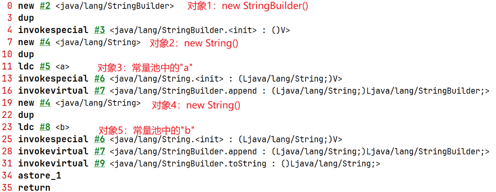
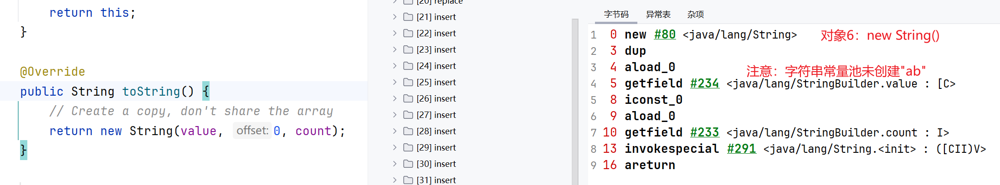

**例2**：
```java
public class StringIntern {  
    public static void main(String[] args) {  
  
        String s = new String("1");  
        s.intern();//调用此方法之前，字符串常量池中已经存在了"1" 
        String s2 = "1";  
        System.out.println(s == s2);//jdk6：false   jdk7/8：false  
  
  
        String s3 = new String("1") + new String("1");//s3变量记录的地址为：new String("11")  
        //执行完上一行代码以后，字符串常量池中，是否存在"11"呢？答案：不存在！！  
        s3.intern();//在字符串常量池中生成"11"。如何理解：jdk6:创建了一个新的对象"11",也就有新的地址。  
                                            //         jdk7:此时常量中并没有创建"11",而是创建一个指向堆空间中new String("11")的地址  
        String s4 = "11";//s4变量记录的地址：使用的是上一行代码代码执行时，在常量池中生成的"11"的地址  
        System.out.println(s3 == s4);//jdk6：false  jdk7/8：true  
    }  
  
  
}
```
不明不白的图示：
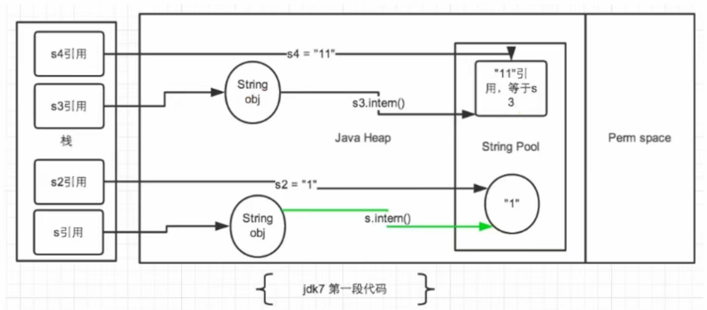

**例3**：
```java
public class StringIntern1 {  
    public static void main(String[] args) {  
        //StringIntern.java中练习的拓展：  
        String s3 = new String("1") + new String("1");//new String("11")  
        //执行完上一行代码以后，字符串常量池中，是否存在"11"呢？答案：不存在！！  
        String s4 = "11";//在字符串常量池中生成对象"11"  
        String s5 = s3.intern();  
        System.out.println(s3 == s4);//false  
        System.out.println(s5 == s4);//true  
    }  
}
```
### G1垃圾收集器的String去重操作
- 当垃圾回收器工作的时候，会访问堆上存活的对象。**对每一个访问的对象都会检查是否是候选的要去重的String对象**。
- 如果是，把这个对象的一个引用插入到队列中等待后续的处理。一个去重的线程在后台运行，处理这个队列。处理队列的一个元素意味着从队列删除这个元素，然后尝试去重它引用的String对象
- 使用一个hashtable来记录所有的被String对象使用的不重复的char数组。当去重的时候，会查这个hashtable，来看堆上是否存在一个一模一样的char数组。
- 如果存在，String对象会被调整引用那个数组，释放对原来的数组的引用，最终会被垃圾收集器回收掉。
- 如果查找失败，char数组会被插入到hashtable，这样以后的时候就可以共享这个数组了。

**命令行选项**
- UseStringDeduplication（bool）：开启String去重，默认不开启，需要手动开启。
- PrintStringDeduplicationStatistics（bool）：打印详细的去重统计信息。
- StringDeduplicationAgeThreshold（uintx）：达到这个年龄的String对象被认为是去重的候选对象。

## 15. 垃圾回收相关算法
引用计数算法: 无法解决循环引用问题
可达性分析算法:下面讲

#### GC Roots
在Java语言中,GC Roots包括以下几类元素:
- 虚拟机栈中引用的对象
	- 比如:各个线程被调用的方法中使用到的参数, 局部变量等.
- 本地方法栈内JNI(通常说的本地方法)引用的对象
- 方法区中类静态属性引用的对象
	- 比如:Java类的引用类型静态变量
- 方法区中常量引用的对象
	- 比如:字符串常量池(String Table)里的引用
- 所有被同步锁synchronized持有的对象
- Java虚拟机内部的引用
	- 基本数据类型对应的Class对象, 一些常驻的异常对象(如:NullPointerException、OutOfMemoryError), 系统类加载器.
- 反映java虚拟机内部情况的JMXBean、JVMTI中注册的回调、本地代码缓存等。

## 16. 垃圾回收相关概念

## 17. 垃圾回收器


