### 虚拟机与Java虚拟机简介

**虚拟机**：一台虚拟的计算机。它是一款**软件**，用来执行一系列虚拟计算机指令。可分为系统虚拟机和程序虚拟机。
- **系统虚拟机**：例如 Visual Box, VMware。它们完全是对物理计算机的仿真，提供了一个可运行完整操作系统的软件平台。
- **程序虚拟机**：例如 Java虚拟机。它**专门为执行单个计算机程序而设计**，在Java虚拟机中执行的指令我们称为Java字节码指令。

> *问："Java字节码指令"就是".class"文件中的内容吗?*
> 
> 答：不完全是。.class文件包含以下几个部分：元数据、常量池、类信息、字段表、**方法表**、属性表。
> **方法表**：这里定义了有什么方法（如`main`, 'solve'）。每个方法的结构里有一个叫`Code`属性的区域，**“字节码指令”就放在这个`Code`属性里**。

**Java虚拟机**：一台执行Java字节码的虚拟计算机，它拥有独立运行机制，其运行的Java字节码也未必由Java语言编译而成。
特点：
- 一次编译，到处运行
- 自动内存管理
- 自动垃圾回收功能


### JVM的位置
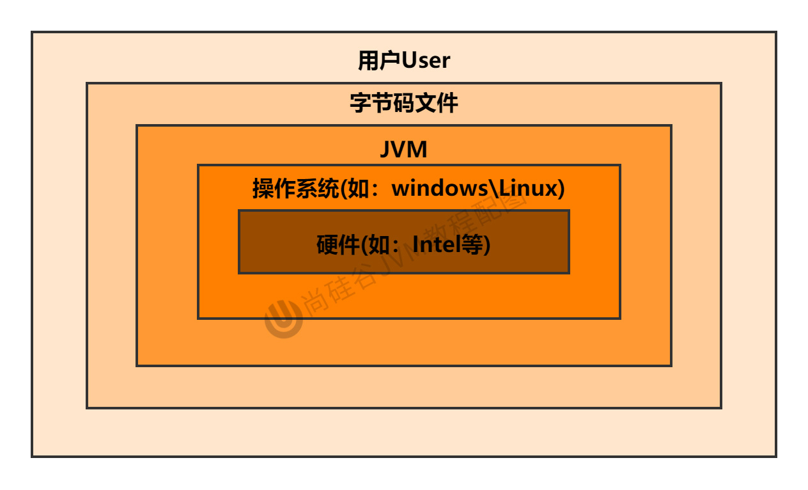
**用户**提供**字节码文件**，**字节码文件**在**JVM**中运行，**JVM**在**操作系统**上运行
系统虚拟机：对硬件的模拟
程序虚拟机：如JVM
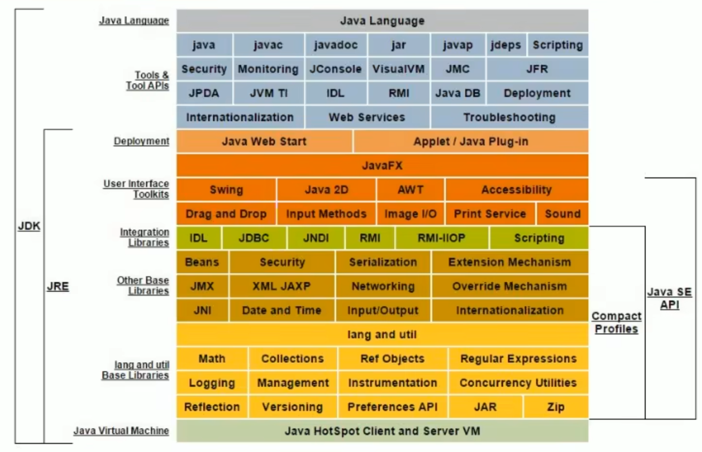
JDK：JRE+开发人员用的功能


### JVM的整体结构
简略版
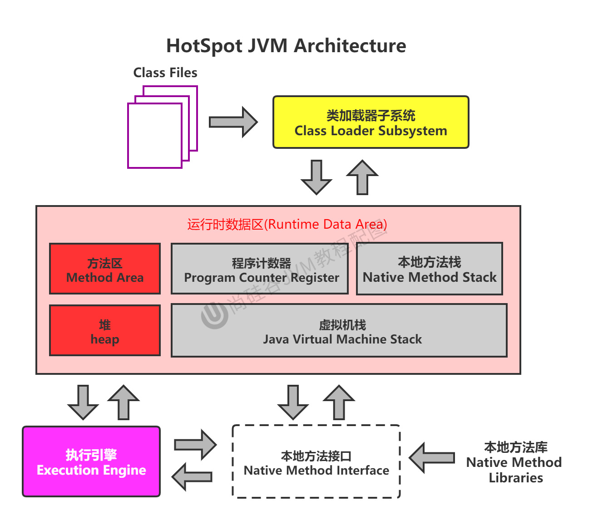
详细版
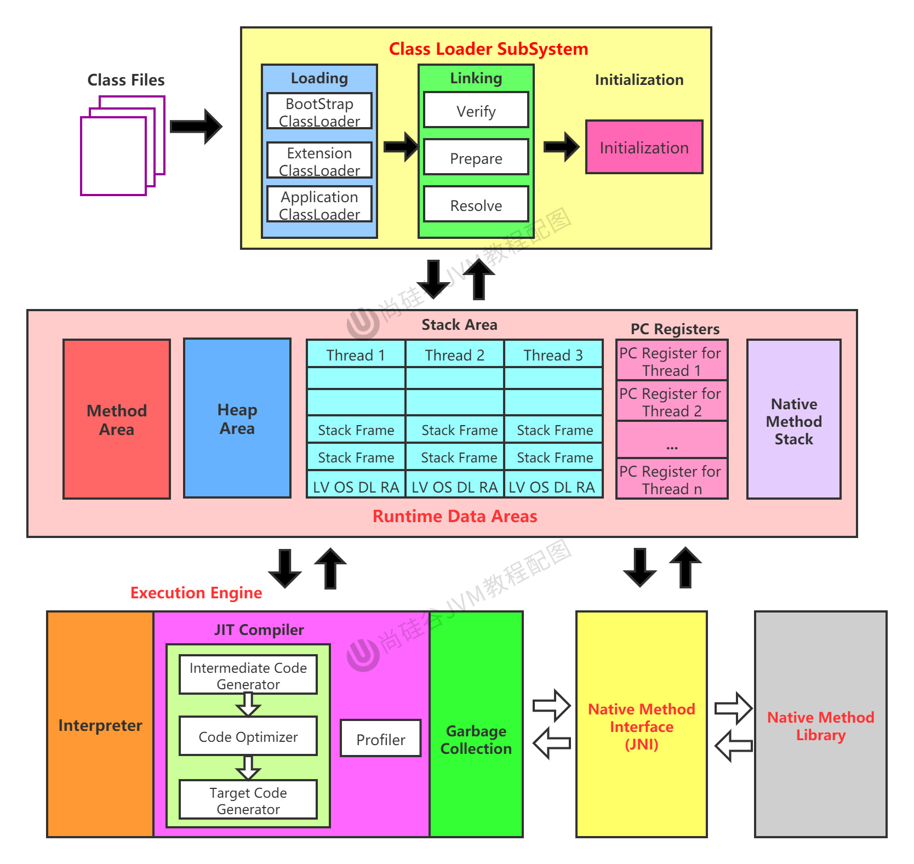
中文版
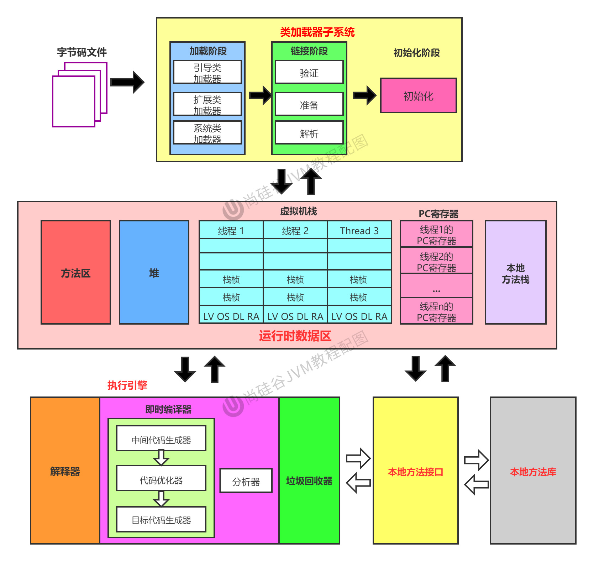

### Java代码执行流程
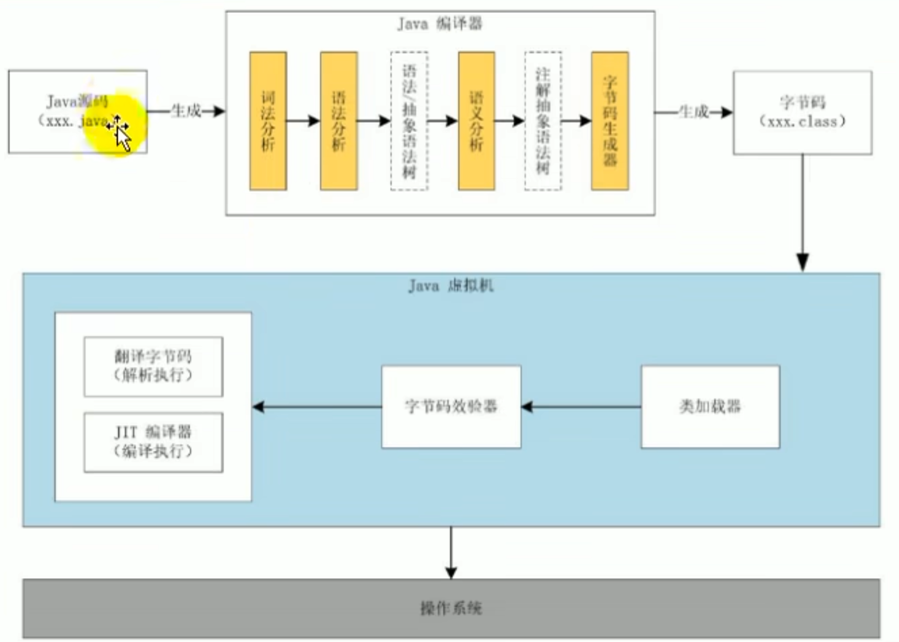

### JVM的架构模型
Java编译器输入的指令流基本上是基于**栈的指令集架构**，另一种指令集架构则是基于**寄存器的指令集架构**。
区别：
- **基于栈式架构**的特点：
	- 设计和实现更简单，适用于资源受限的系统
	- 避开了寄存器的分配难题；使用零地址指令方式分配
	- 指令流中的指令大部分是零地址指令，其执行过程依赖于操作栈。指令集更小，编译器容易实现
	- 不需要硬件支持，可移植性更好，更好实现跨平台
```bash
# 2+3
iconst_2 // 常量2入栈
istore_1
iconst_3 // 常量3入栈
istore_2
iload_1
iload_2
iadd // 常量2、3出栈，执行相加
istore_3 // 结果5入栈
```
- **基于寄存器架构**的特点：
	- 典型的应用是x86的二进制指令集，比如传统的pc以及Android的Davlik虚拟机
	- 指令集架构则完全依赖硬件，可移植性差
	- 性能优秀和执行更高效
	- 花费更少的指令去完成一项操作
	- 在大部分情况下，基于寄存器架构的指令集往往都以一地址指令、二地址指令和三地址指令为主，而基于栈式架构的指令集却是以零地址指令为主
```bash
mov eax,2 // 将eax寄存器的值设为2
add eax,3 // 使eax寄存器的值增加3
```
> 问：零地址指令是什么？
> 
> 答：指令中不包含地址，只有操作数

总结：
由于跨平台性的设计，Java的指令都是根据栈来设计的。不同平台CPU架构不同，所以不能设计为基于寄存器的。优点是**跨平台、指令集小，编译器容易实现**，缺点是**性能下降，实现同样的功能需要更多的指令**。


### JVM的生命周期

**虚拟机的启动**：
Java虚拟机的启动是通过引导类加载器（bootstrap class loader）创建一个初始类（initial class）来完成的，这个类是由虚拟机的具体实现指定的。

**虚拟机的执行**：
- 一个运行中的Java虚拟机有着一个清晰的任务：执行Java程序
- 程序开始执行时它才执行，程序结束时它就停止
- ==执行一个所谓的Java程序的时候，真真正正在执行的是一个叫作Java虚拟机的进程==

**虚拟机的退出**：
有如下几种情况：
- 程序正常执行结束
- 程序在执行过程中遇到了异常或错误而异常终止
- 由于操作系统出现错误而导致Java虚拟机进程终止
- 某线程调用Runtime类或System类的exit方法，或Runtime类的halt方法，并且Java安全管理器也允许这次exit或halt操作
- 除此之外，JNI（Java Native Interface）规范描述了用JNI Invocation API来加载或卸载Java虚拟机时，Java虚拟机的退出情况

### JVM的发展历程

**Sun Classic VM**：
- 世界上第一款商用Java虚拟机
- 内部只提供解释器（效率差）
- 如果使用JIT编译器，就需要进行外挂。但是一旦使用了JIT编译器，JIT就会接管虚拟机的执行系统。解释器就不再工作。解释器和编译器不能配合工作。
- hotspot内置了此虚拟机

**Exact VM**：
- Exact Memory Management: 准确式内存管理
	- 也可以叫Non-Conservative/Accurate Memory Management
	- 虚拟机可以知道内存中某个位置的数据具体是什么类型
- 具备现代高性能虚拟机的雏形
	- 热点探测
	- 编译器与解释器混合工作模式
- 只在Solaris平台短暂使用，其他平台上还是classic vm

**Hotspot VM**:
- 从服务器、桌面到移动端、嵌入式都有应用
- 名称中的HotSpot指的就是它的热点代码探测技术。

**JRockit**：
- 专注于服务端应用
	- 不太关注程序启动速度，全部代码都靠即时编译器编译后执行
- JRockit JVM是世界上最快的JVM
- 优势：全面的Java运行时解决方案组合
	- JRockit面向延迟敏感型应用的解决方案JRockit Real Time提供以毫秒或微秒级的JVM响应时间，适合财务、军事指挥、电信网络的需要
	- MissionControl服务套件，它是一组以极低的开销来监控、管理和分析生产环境中的应用程序的工具

**J9**：
- 全称：IBM Technology for Java Virtual Machine，简称IT4J，内部称号：J9
- 市场定位与HotSpot接近，服务器端、桌面应用、嵌入式等多用途VM


## 2. 类加载子系统
### 概述类的加载器及类加载过程
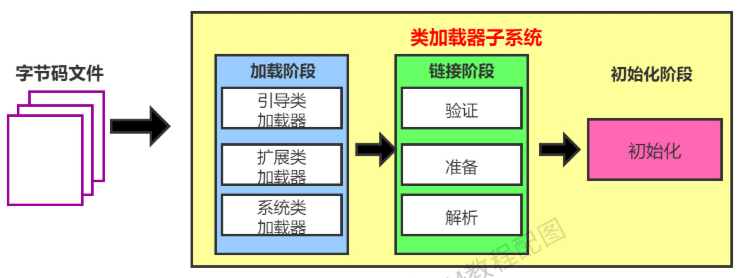
**类加载器子系统作用**：
- 类加载器子系统负责从文件系统或网络中加载Class文件，class文件在文件开头有特定的文件标识。
- ClassLoader只负责class文件的加载，至于它是否可以运行，则由Execution Engine决定
- 加载的类信息存放在一块称为方法区的内存空间。除了类的信息外，方法区中还会存放运行时常量池信息，可能还包含字符串字面量和数字常量（这部分常量信息是Class文件中常量池部分的内存映射）

**类加载器ClassLoader例子**：
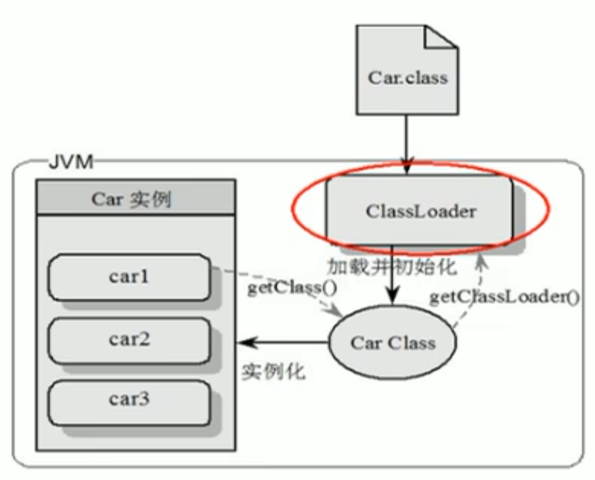
1. class file（Car.class文件） 存在本地硬盘上，可以理解为设计师画在纸上的模板，而最终这个模板在执行的时候是要加载到JVM当中根据这个文件实例化出n个一摸一样的示例
2. class file 加载到JVM中，被称为DNA元数据模板（Car Class），放在方法区
3. 在`.class`文件->JVM->最终成为元数据模板，此过程就要一个运输工具（类装载器 Class Loader），扮演一个快递员的角色
### 类的加载子系统过程一：Loading
**加载阶段：**
1. 通过一个类的全限定名获取定义此类的二进制字节流
2. 将这个字节流所代表的静态结构转化为方法区的运行时数据结构
3. ==在内存中生成一个代表这个类的java.lang.Class对象==，作为方法区这个类的各种数据的访问入口

**补充：加载.class文件的方式**
- 从本地系统中直接加载
- 通过网络获取，典型场景：Web Applet
- 从zip压缩包中读取，成为日后jar、war格式的基础
- 运行时计算生成，使用最多的是：动态代理技术
- 由其他文件生成，典型场景：JSP应用
- 从专有数据库中提取.class文件，比较少见
- 从加密文件中获取，典型的防Class文件被反编译的保护措施

### 类的加载子系统过程二：Linking
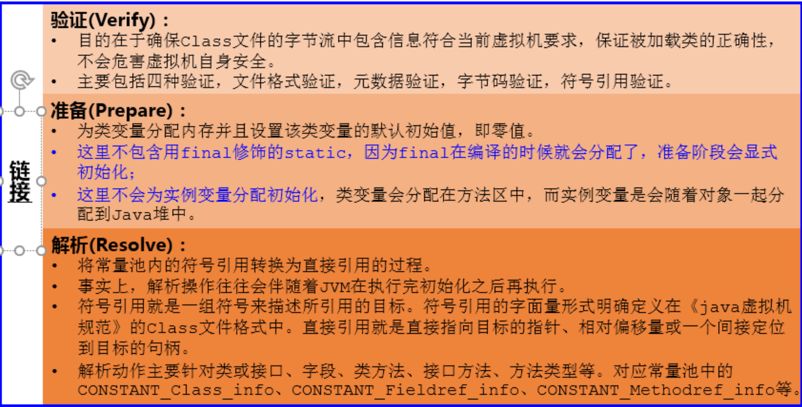

> Q: “类变量”和”实例变量“的区别?
> 反思：出现这个问题的主要原因是把类/实例变量 和 类/实例对象 混一起了。类对象是在Loading阶段创建的。
> A: 
> - **类变量 (Class Variable)**：
>    
    - **标识**：被 `static` 关键字修饰的变量（静态变量）。
>        
    - **归属**：属于**类（Class）**本身，而不是某个具体的对象。
>        
>    - **特性**：无论你创建了多少个对象，类变量在内存中**只有一份**，所有对象共享这个变量。
>        
>- **实例变量 (Instance Variable)**：
>    
    - **标识**：没有被 `static` 修饰的普通成员变量。
>        
>    - **归属**：属于具体的**对象实例（Object Instance）**。
>        
>    - **特性**：每当你 `new` 一个新对象，系统就会为这个对象分配一个新的实例变量副本。对象之间互不影响。

### 类的加载子系统过程三：Intialization
- **初始化阶段就是执行类构造器方法`<clinit>()`的过程。**
- 此方法不需定义，自动生成，是javac编译器自动收集类中的**所有类变量的赋值动作和静态代码块中的语句**合并而来。（如果没有类变量和静态代码块，就不会生成`clinit()`方法）
- 构造器方法中指令按语句在源文件中出现的顺序执行
- **`<clinit>()`不同于类的构造器**（关联：构造器是虚拟机视角下的`<init>()`）
- 若该类具有父类，JVM会保证子类的`<clinit>()`执行前，父类的`<clinit>()`已经执行完毕
- 虚拟机必须保证一个类的`<clinit>()`方法在多线程下被同步加锁

总结一下：上述总共涉及.class文件中的两个方法（参考下图）：
- `clinit()`：自动生成，按顺序执行类变量的赋值动作和静态代码块中的语句
- `init()`：类的构造器方法在.class文件中的名字
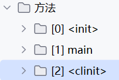

```java
// 例子
// 在Linking 阶段，初始化类变量num
// 在Intialization阶段，运行clinit()方法按顺序执行赋值动作
public class ClassInitTest {  
    static {  
        num = 2;  
        // System.out.println(num); 会报错，不能前向引用
    }    
    private static int num = 10;  
  
    public static void main(String[] args) {  
        System.out.println(ClassInitTest.num);    
    }
}
```

### 类的加载器的分类
- JVM支持两种类型的类加载器，分别为**引导类加载器**（Bootstrap ClassLoader）和**自定义类加载器**（User-Defined ClassLoader）
- 从概念上来讲，自定义类加载器一般指的是程序中由开发人员自定义的一类类加载器，但是Java虚拟机规范却没有这么定义，而是**将所有派生于抽象类ClassLoader的类加载器都划分为自定义类加载器**
- 无论类加载器的类型如何划分，在程序中我们最常见的类加载器始终只有3个，如下所示：
	- Bootstrap Class Loader：引导类加载器
	- Extension Class Loader：自定义类加载器
	- System Class Loader：自定义类加载器
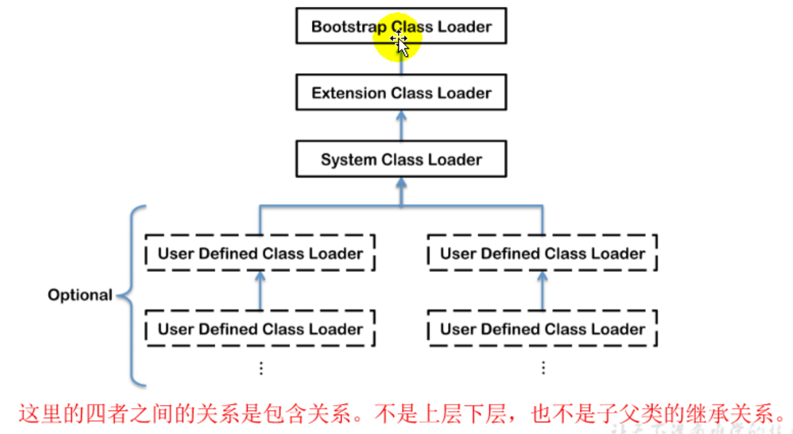
代码示例：
```java
public class ClassLoaderTest {  
    public static void main(String[] args){  
  
        // 获取系统类加载器  
        ClassLoader systemClassLoader = ClassLoader.getSystemClassLoader();  
        System.out.println(systemClassLoader); //sun.misc.Launcher$AppClassLoader@18b4aac2  
  
        // 获取其上层，扩展类加载器  
        ClassLoader extClassLoader = systemClassLoader.getParent();  
        System.out.println(extClassLoader); // sun.misc.Launcher$ExtClassLoader@1b6d3586  
  
        // 获取上层，获取不到引导类加载器  
        ClassLoader bootstrapClassLoader = extClassLoader.getParent();  
        System.out.println(bootstrapClassLoader); // null  
  
        // 对于用户自定义类来说，默认使用系统类加载器进行加载  
        ClassLoader classLoader = ClassLoaderTest.class.getClassLoader();  
        System.out.println(classLoader);// sun.misc.Launcher$AppClassLoader@18b4aac2  
  
        // String类使用引导类加载器进行加载的 --> Java的核心类都是使用引导类加载器进行加载的
        ClassLoader classLoader1 = String.class.getClassLoader();  
        System.out.println(classLoader1); // null  
    }  
}
```

#### 虚拟机自带的加载器
- **启动类加载器**（引导类加载器，Bootstrap ClassLoader）
	- 这个类加载使用C/C++语言实现的，嵌套在JVM内部
	- 它用来加载Java的核心库（JAVA_HOME/jre/lib/rt.jar、resources.jar或sun.boot.class.path路径下的内容），用于提供JVM自身需要的类
	- 并不继承自java.lang.ClassLoader，没有父加载器
	- 加载**扩展类和应用程序类加载器**，并指定为他们的父类加载器
	- 出于安全考虑，Bootstrap启动类加载器只加载包名为java、javax、sun等开头的类
- **扩展类加载器**（Extension ClassLoader）
	- Java语言编写，由sun.misc.Launcher$ExtClassLoader实现
	- 派生于ClassLoader类
	- 父类加载器为启动类加载器
	- 从java.ext.dirs系统属性所指定的目录中加载类库，或从JDK的安装目录的jre/lib/ext子目录（扩展目录）下加载类库。**如果用户创建的JAR放在此目录下，也会自动由扩展类加载器加载**
- **应用程序类加载器**（系统类加载器，AppClassLoader）
	- java语言编写，由sun.misc.Launcher$AppClassLoader实现
	- 派生于ClassLoader类
	- 父类加载器为扩展类加载器
	- 它负责加载环境变量classpath或系统属性 java.class.path 指定路径下的类库 
	- 该类加载是程序中默认的类加载器，一般来说，Java应用的类都是由它来完成加载
	- 通过ClassLoader#getSytemClassLoader()方法可以获取到该类加载器
- **用户自定义加载器**
	- 作用：
		- 隔离加载类
		- 修改类加载的方式
		- 扩展加载源
		- 防止源码泄漏

```java
public class ClassLoaderTest1 {  
    public static void main(String[] args) {  
        System.out.println("******************启动类加载器******************");  
        // 获取BootstrapClassLoader能够加载的api的路径  
        URL[] urLs = sun.misc.Launcher.getBootstrapClassPath().getURLs();  
        for(URL element: urLs)  
            System.out.println(element.toExternalForm());  
        System.out.println("******************扩展类加载器******************");  
        String extDirs = System.getProperty("java.ext.dirs");  
        for(String path: extDirs.split(";")){  
            System.out.println(path);        }    }  
}
// 输出结果
******************启动类加载器******************
file:/C:/Program%20Files/Java/jdk1.8.0_201/jr5e/lib/resources.jar
file:/C:/Program%20Files/Java/jdk1.8.0_201/jre/lib/rt.jar
file:/C:/Program%20Files/Java/jdk1.8.0_201/jre/lib/sunrsasign.jar
file:/C:/Program%20Files/Java/jdk1.8.0_201/jre/lib/jsse.jar
file:/C:/Program%20Files/Java/jdk1.8.0_201/jre/lib/jce.jar
file:/C:/Program%20Files/Java/jdk1.8.0_201/jre/lib/charsets.jar
file:/C:/Program%20Files/Java/jdk1.8.0_201/jre/lib/jfr.jar
file:/C:/Program%20Files/Java/jdk1.8.0_201/jre/classes
******************扩展类加载器******************
C:\Program Files\Java\jdk1.8.0_201\jre\lib\ext
C:\WINDOWS\Sun\Java\lib\ext
```

### 关于ClassLoader
ClassLoader类，它是一个抽象类，其后所有的类加载器都继承自ClassLoader（不包括启动类加载器）

| 方法名称                                                 | 描述                                                     |
| ---------------------------------------------------- | ------------------------------------------------------ |
| getParent()                                          | 返回该类加载器的超类加载器                                          |
| loadClass(String name)                               | 加载名称为name的类，返回结果为java.lang.Class类的实例                   |
| findClass(String name)                               | 查找名称为name的类，返回结果为java.lang.Class类的实例。常与defineClass搭配使用 |
| findLoadedClass(String name)                         | 查找名称为name的已经被加载过的类，返回结果为java.lang.Class类的实例            |
| defineClass(String name, byte[] b, int off, int len) | 把字节数组b中的内容转换为一个Java类，返回结果为java.lang.Class类的实例          |
| resolveClass(Class\<?\> c)                           | 连续指定的一个Java类                                           |
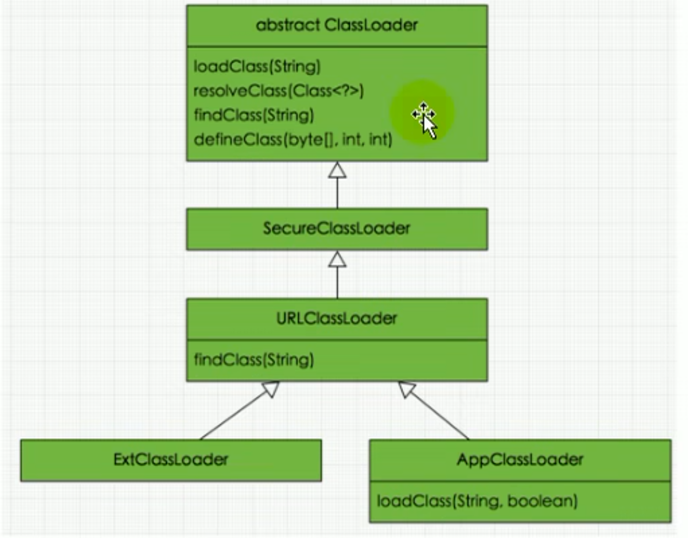
**sun.misc.Launcher 它是一个java虚拟机的入口应用**
	JVM本身（即 `java.exe` 或 linux 下的 `java` 命令）大部分是用 **C++** 写的。
- **在 Launcher 运行之前（C++ 阶段）**： 当你输入 `java MyProgram` 时，操作系统调用的是 C++ 代码。这时候，JVM 加载了核心库，初始化了堆内存，启动了垃圾回收器，并且创建了**启动类加载器 (Bootstrap ClassLoader)**。但此时，JVM 还只是一个空的引擎，它还不知道你的 `MyProgram` 在哪，也不知道怎么去加载它。
    
- **Launcher 登场（交接棒）**： C++ 代码做完底层硬件和内存的准备后，需要把控制权交给 Java 代码。它调用的**第一个 Java 类**就是 `sun.misc.Launcher`。
    
    **这就是“入口”的含义**：它是 JVM 启动后运行的**第一行 Java 代码**。在它之前全是 C++，在它之后才是你的 `public static void main`。
    
> Q: sun.misc.Launcher 和图中类的关系
> A: `ExtClassLoader`和`AppClassLoader`是`sun.misc.Launcher`类的静态内部类

**获取ClassLoader的途径**

|                           |                                                |
| ------------------------- | ---------------------------------------------- |
| 方式一：获取当前类的ClassLoader     | clazz.getClassLoader                           |
| 方式二：获取当前线程上下文的ClassLoader | Thread.currentThread().getContextClassLoader() |
| 方式三：获取系统的ClassLoader      | ClassLoader.getSystemClassLoader()             |
| 方式四：获取调用者的ClassLoader     | DriverManager.getCallerClassLoader()           |
```java
public class ClassLoaderTest2 {  
    public static void main(String[] args) {  
        try {  
            // 1. 获取 String 类的类加载器  
            ClassLoader classLoader = Class.forName("java.lang.String").getClassLoader();  
            System.out.println(classLoader); // 输出: null，表示引导类加载器  
  
            // 2. 获取当前线程的上下文类加载器  
            ClassLoader classLoader1 = Thread.currentThread().getContextClassLoader();  
            System.out.println(classLoader1); // 输出: sun.misc.Launcher$AppClassLoader@18b4aac2 应用类加载器  
  
            // 3. 获取系统类加载器及其父类加载器  
            ClassLoader systemClassLoader = ClassLoader.getSystemClassLoader();  
            System.out.println(systemClassLoader); // 输出: sun.misc.Launcher$AppClassLoader@18b4aac2 应用类加载器  
            ClassLoader parent = systemClassLoader.getParent();  
            System.out.println(parent); // 输出: sun.misc.Launcher$ExtClassLoader@1b6d3586 扩展类加载器  
            ClassLoader grandParent = parent.getParent();  
            System.out.println(grandParent); // 输出: null，表示引导类加载器  
        } catch (ClassNotFoundException e) {  
            e.printStackTrace();  
        }  
    }  
}
```

### 双亲委派机制
Java虚拟机对class文件采用的是**按需加载**的方式，也就是说当需要使用该类时才会将它的class文件加载到内存生成class对象。而且加载某个类的class文件时，Java虚拟机采用的是**双亲委派模式**，即把请求交由父类处理，它是一种任务委派模式。
#### 工作原理
1. 如果一个类加载器收到了类加载请求，它并不会自己先去加载，而是把这个请求委派给父类的加载器去执行
2. 如果父类加载器还存在其父类加载器，则进一步向上委托，依次递归，请求最终将到达顶层的启动类加载器
3. 如果父类加载器可以完成类加载任务，就成功返回，倘若父类加载器无法完成此加载任务，子加载器才会尝试自己去加载，这就是双亲委派模式
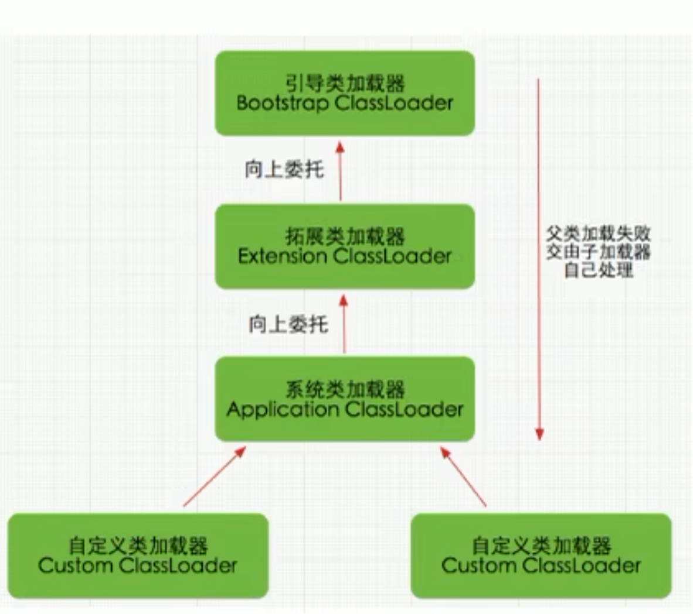

#### 举例
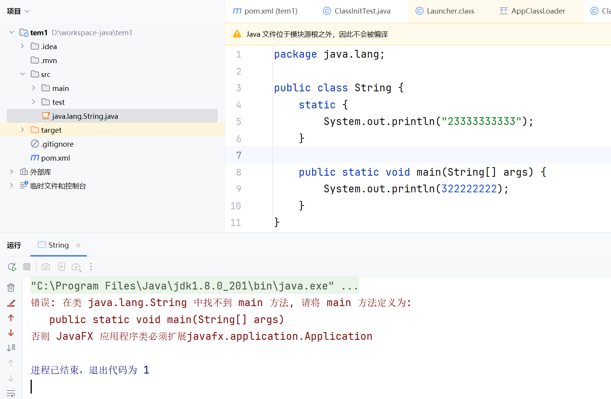
原因：运行main方法需要加载对应的类，通过双亲委派机制委派给引导类加载器，引导类加载器找到了系统中java.lang中的String类，并加载了它，但它没有main方法，所以报错。详细原因见 《沙箱安全机制》

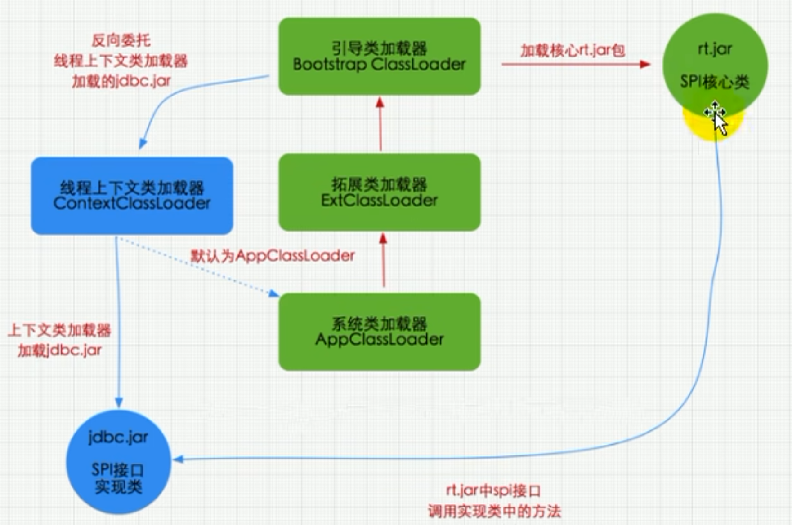
#### 优势
- 避免类的重复加载
- 保护程序安全，防止核心API被随意篡改
	- 自定义类：java.lang.String
	- 自定义类：java.lang.ShkStart（由于安全限制，不会让你自定义类，和双亲委派好像没啥关联）

### 沙箱安全机制
自定义String类，但是在加载自定义String类时会率先使用引导类加载器加载，而引导类加载器在加载的过程中会先加载jdk自带的文件（rt.jar包中java\lang\String.class），报错信息说没有main方法就是因为加载的是rt.jar包中的String类。这样可以保证对java核心源代码的保护，这就是**沙箱安全机制**

### 其他
- 在JVM中表示两个class对象是否为同一个类存在两个必要条件：
	- 类的完整类名必须一致，包括包名
	- 加载这个类的ClassLoader（指ClassLoader实例对象）必须相同。
- 换句话说，在JVM中，即使这两个类对象（class对象）来源同一个Class文件，被同一个虚拟机所加载，但只要加载它们的ClassLoader实例对象不同，那么这两个类对象也是不相等的。

JVM必须知道一个类型是由启动类加载器加载的还是用户类加载器加载的。如果一个类型是由用户类加载器加载的，那么==JVM会将这个类加载器的一个引用作为类型信息的一部分保存在方法区中==。当解析一个类型到另一个类型的引用的时候，JVM需要保证这两个类型的类加载器是相同的。（TODO）

### 类的主动使用和被动使用
Java程序对类的使用方式分为：主动使用和被动使用
- 主动使用，分为七种情况：
	- 创建类的实例
	- 初始化一个类的子类
	- 访问某个类或接口的静态变量，或者对该静态变量赋值
	- 调用类的静态方法
	- 反射（比如：Class.forName("com.atguigu.Test")）
	- Java虚拟机启动时被表明为启动类的类
	- JDK 7开始提供的动态语言支持：
	  java.lang.invoke.MethodHandle实例的解析结果
	  REF_getStatic、REF_putStatic、REF_invokeStatic句柄对应的类没有初始化，则初始化
- 除以上七种情况，其他使用Java类的方式都被看作是对**类的被动使用**，都不会导致**类的初始化**


## 3. 运行时数据区概述及线程

### 运行时数据区内部结构

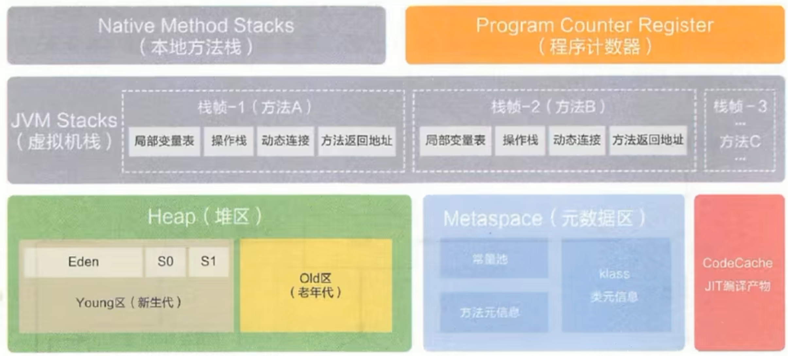

如下图所示，每个线程都有程序计数器（Program Counter Register）、本地方法栈（Native Method Stack）、虚拟机栈（Java Virtual Machine Stack）
线程间共享：堆、堆外内存（永久代或元空间、代码缓存）
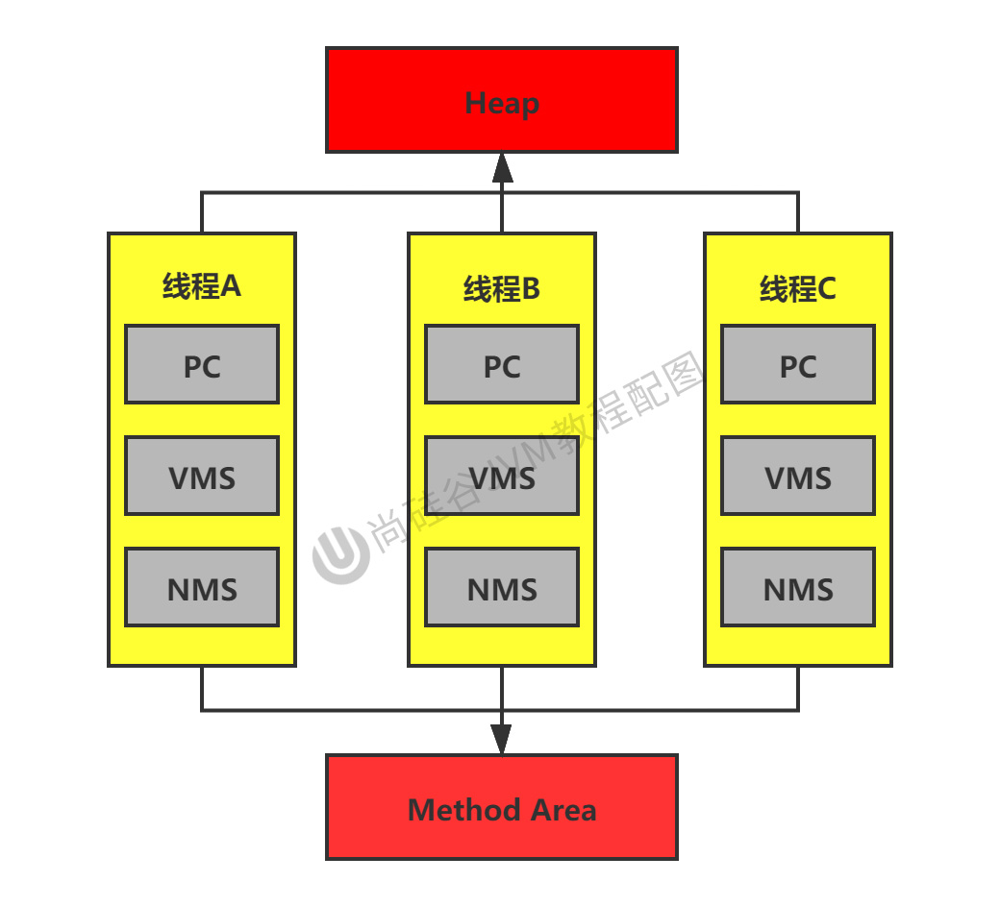
每个JVM只有一个Runtime实例。即为运行时环境，相当于内存结构的运行时环境

### JVM中的线程说明
- 线程是一个程序里的运行单元。JVM允许一个应用有多个线程并行的执行
- 在Hotpot JVM里，每个线程都与操作系统的本地线程直接映射
	- 当一个Java线程准备好执行以后，此时一个操作系统的本地线程也同时创建。Java线程执行终止后，本地线程也会回收
- 操作系统负责所有线程的安排调度到任何一个可用的CPU上。一旦本地线程初始化成功，它就会调用Java线程中的run()方法

如果你使用jconsole或者是任何一个调试工具，都能看到后台有许多线程在运行。这些后台线程不包括调用public static void main(String\[]) 的main线程以及所有这个main线程自己创建的线程
这些主要的后台系统线程在Hotspot JVM里主要是以下几个：
- **虚拟机线程**：这种线程的操作是需要JVM达到安全点才会出现。这些操作必须在不同的线程中发生的原因是它们都需要JVM达到安全点，这样堆才不会变化。这种线程的执行类型包括"stop-the-world"的垃圾收集，线程栈收集，线程挂起以及偏向锁撤销
- **周期任务线程**：这种线程是时间周期事件的体现（比如中断），它们一般用于周期性操作的调度执行
- **CG线程**：这种线程对在JVM里不同种类的垃圾收集行为提供了支持
- **编译线程**：这种线程在运行时会将字节码编译到本地代码
- **信号调度线程**：这种线程接收信号并发送给JVM，在它内部通过调用适当的方法进行处理

### 程序计数器（PC寄存器）
#### 概述
JVM中的PC寄存器是对物理PC寄存器的一种抽象模拟
PC寄存器用来存储指向下一条指令的地址，也即将要执行的指令代码。由执行引擎读取下一条指令。
任何时间一个线程都只有一个方法在执行，也就是所谓的当前方法。程序计数器会存储当前线程正在执行的Java方法的JVM指令地址；或者，如果是在执行native方法，则是未指定值（undefined）
它是唯一一个在Java虚拟机规范中没有规定任何OutOfMemoryError情况的区域
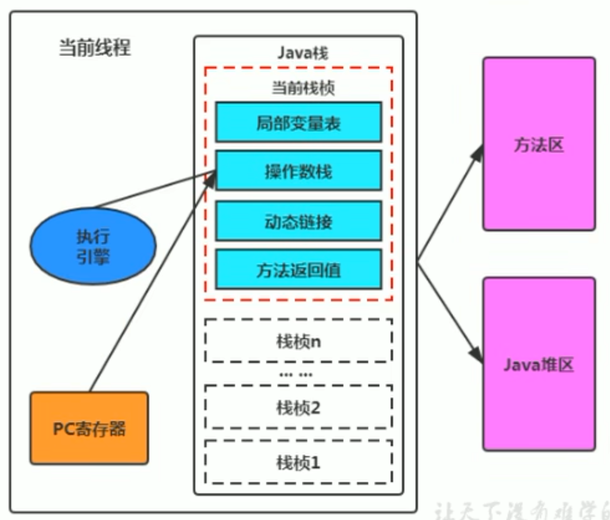
### 虚拟机栈
#### 1）内存中的栈与堆
**栈是运行时的单位，而堆是存储的单位**。即栈解决程序的运行问题，即程序如何执行，或者说如何处理数据。堆解决的是数据存储问题，即数据怎么放、放在哪儿。

#### 2）基本介绍
**是什么？**：Java虚拟机栈（Java Virtual Machine Stack），早期也叫Java栈。每个线程在创建时都会创建一个虚拟机栈，其内部保存一个个的**栈帧**（Stack Frame），对应着一次次的Java**方法**调用。
是线程私有的。
**生命周期**：和线程一致
**作用**：主管Java程序的运行，它保存方法的**局部变量**、部分结果，并参与方法的调用和返回
- 局部变量 vs 成员变量（或属性）
- 基本数据变量 vs 引用类型变量

#### 3）栈的特点
- 栈是一种快速有效的分配存储方式，访问速度仅次于程序计数器
- JVM直接对Java栈的操作只有两个：
	- 每个方法执行，伴随着进栈（入栈、压栈）
	- 执行结束后的出栈工作
- 对于栈来说不存在垃圾回收问题，存在OOM（out of memory）

#### 4）栈中可能出现的异常
- Java虚拟机规范允许**Java栈的大小是动态的或者是固定不变的**
	- 如果采用固定大小的Java虚拟机栈，那每一个线程的Java虚拟机栈容量可以在线程创建的时候独立选定。如果线程请求分配的栈容量超过Java虚拟机栈允许的最大容量，Java虚拟机栈允许的最大容量，Java虚拟机将会抛出一个`StackOverflowError`异常
	- 如果Java虚拟机栈可以动态扩展，并且在尝试扩展的时候无法申请到足够的内存，或者在创建新的线程时没有足够的内存去创建对应的虚拟机栈，那Java虚拟机将会抛出一个`OutOfMemoryError`异常

#### 5）设置栈的大小
使用`-Xss`来设置线程的最大栈空间，栈的大小直接决定了函数调用的最大可达深度
```java
public class StackTest {  
  
    private static int count = 1;  
  
    public static void main(String[] args) {  
        System.out.println("count:"+count);  
        count++;        
        main(args);    
    }    
    /*默认输出：  
     ...    
     count:6492    
     count:6493    
     Exception in thread "main" java.lang.StackOverflowError
     ...*/
}
```
如下图所示设置栈的大小
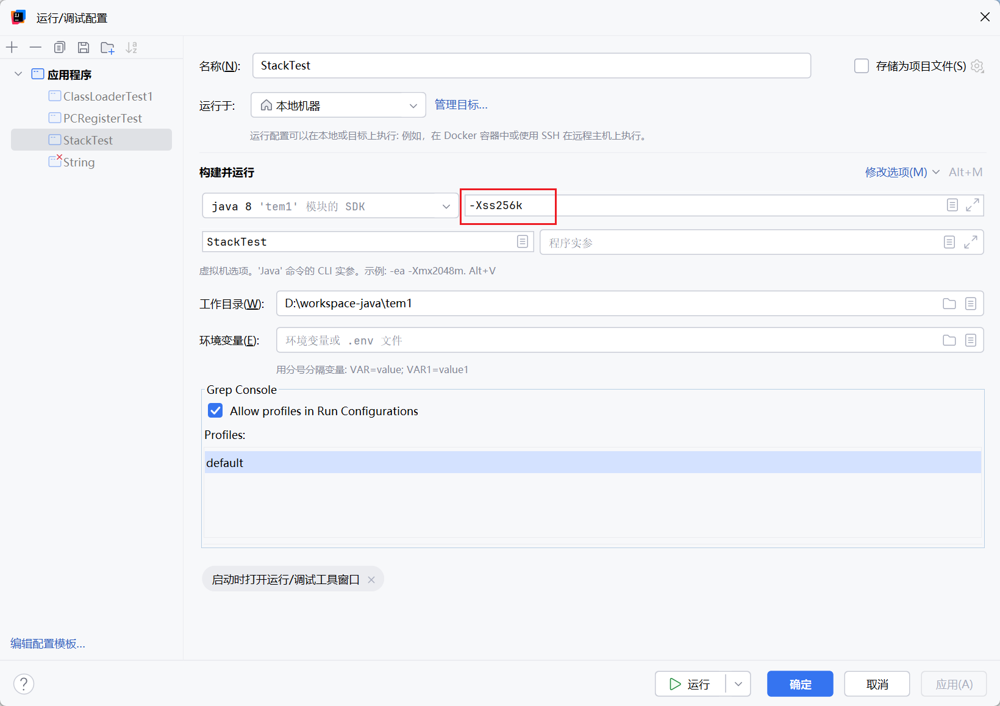
重新运行程序后：
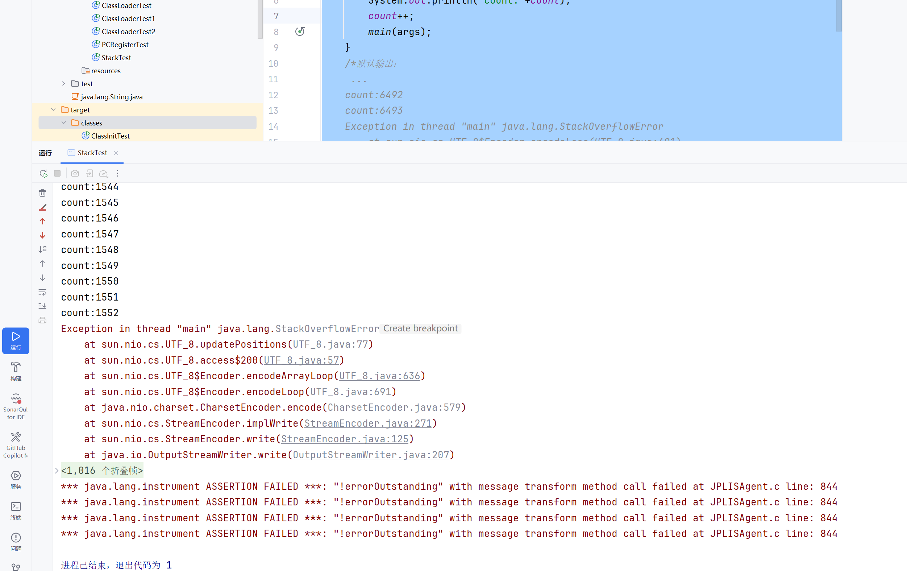


#### 5）栈中存储什么？
- 每个线程都有自己的栈，栈中的数据都是以**栈帧**(Stack Frame)的格式存在。
- 在这个线程上正在执行的每个方法都各自对应一个栈帧（Stack Frame）
- 栈帧是一个内存区块，是一个数据集，维系着方法执行过程中的各种数据信息

#### 6）运行原理
- JVM直接对Java栈的操作只有两个，就是对栈帧的压栈和出栈
- 在一条活动线程中，一个时间点上，只会有一个活动的栈帧。即只有当前正在执行的方法的栈帧（栈顶栈帧）是有效的，这个栈帧被称为**当前栈帧**（Current Frame），与当前栈帧相对应的方法是**当前方法**（Current Method），定义这个方法的类就是**当前类**（Current Class）。
- 执行引擎运行的所有字节码指令只针对当前栈帧进行操作
- 如果在该方法中调用了其他方法，对应的新的栈帧会被创建出来，放在栈的顶端，成为新的当前栈
- 不同线程中所包含的栈帧是不允许存在相互引用的，即不可能在一个栈帧之中引用另一个线程的栈帧
- 如果当前方法调用了其他方法，方法返回之际，当前栈帧会传回此方法的执行结果给前一个栈帧，接着，虚拟机会丢弃当前栈帧，使得前一个栈帧重新成为当前栈帧
- Java方法有两种返回函数的方法，**一种是正常的函数返回，使用return指令；另一种是抛出异常**。不管使用哪种方式，都会导致栈帧被弹出。


#### 7）栈帧的内部结构
每个栈帧中存储着：
- **局部变量表**（Local Variables）
- **操作数栈**（Operand Stack）（或表达式栈）
- 动态链接（Dynamic Linking）（或指向运行时常量池的方法引用）
- 方法返回地址（Return Address）（或方法正常退出或者异常退出的定义）
- 一些附加信息
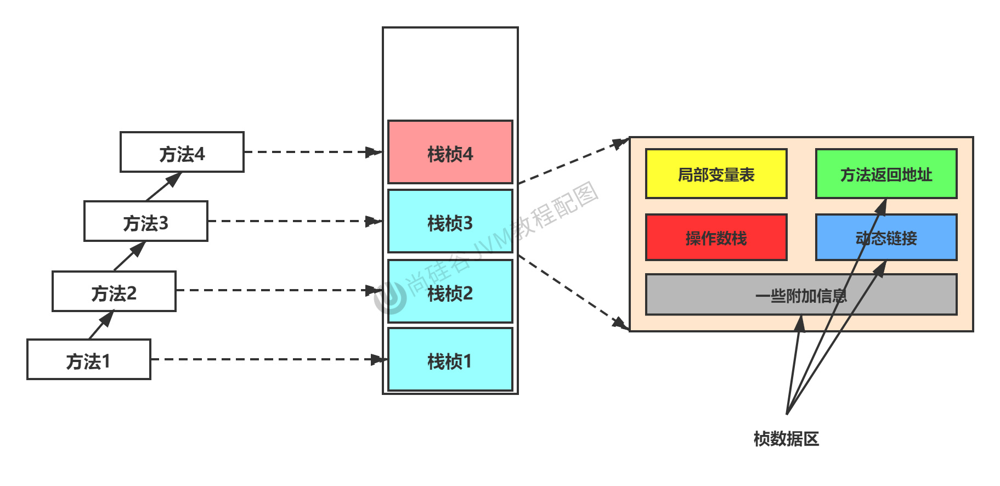
#### 8）局部变量表（local variables）
##### 基本信息
- 局部变量表也被称为局部变量数组或本地变量表
- 定义为一个**数字数组**，主要用于存储方法参数和定义在方法体内的局部变量。这些数据类型包括各类基本数据类型、对象引用（reference），以及returnAddress类型。
- 由于局部变量表是建立在线程的栈上，是线程的私有数据，因此不存在数据安全问题
- 局部变量表所需的容量大小是在编译期确定下来的，并保存在方法的Code属性的maximum local variables数据项中。在方法运行期间是不会改变局部变量表的大小的。
- 方法最大嵌套调用的次数由栈的大小决定。一般来说，栈越大，方法能够嵌套的次数越多。
- 局部变量表中的变量只在当前方法调用中有效。在方法执行时，虚拟机通过使用局部变量表完成**参数值**到**参数变量列表**的传递过程。当方法调用结束后，随着方法栈帧的销毁，局部变量表也会随之销毁。
- 在栈帧中，与性能调优关系最为密切的就是前面提到的局部变量表。在方法执行时，虚拟机使用局部变量表完成方法的传递。
- **局部变量表中的变量也是重要的垃圾回收根节点，只要被局部变量表中直接或间接引用的对象都不会被回收**。


> Q: 参数值和参数变量列表的定义
> 
> A: 1. **参数值** (Argument Values) —— 也就是“实参”
>
>- **定义**：这是 **调用者（Caller）** 在调用方法时，实际传递给方法的数据。
 >   
>- **性质**：它们是**具体的值**（或者是指向对象的引用地址）。
  >  
>- **存在位置**：在方法调用指令执行前，它们存在于**调用者**的操作数栈中。
>    
>- **例子**： 如果你调用 `add(10, 20);` 那么 `10` 和 `20` 就是 **参数值**。
>    
>2. **参数变量列表** (Parameter Variable List) —— 也就是“形参”
>
>- **定义**：这是 **被调用者（Callee）** 在定义方法时，声明的一组变量。
  >  
>- **性质**：它们是**占位符**，定义了方法需要什么类型的数据，以及在方法内部叫什么名字。它们构成了局部变量表的前几个位置。
 >   
>- **存在位置**：它们存在于**被调用方法**的 `.class` 文件的方法签名中，并在运行时刻映射到**局部变量表**的起始索引位置。
 >   
>- **例子**： 如果你定义方法 `public void add(int a, int b) { ... }` 那么 `int a` 和 `int b` 组成的序列就是 **参数变量列表**。


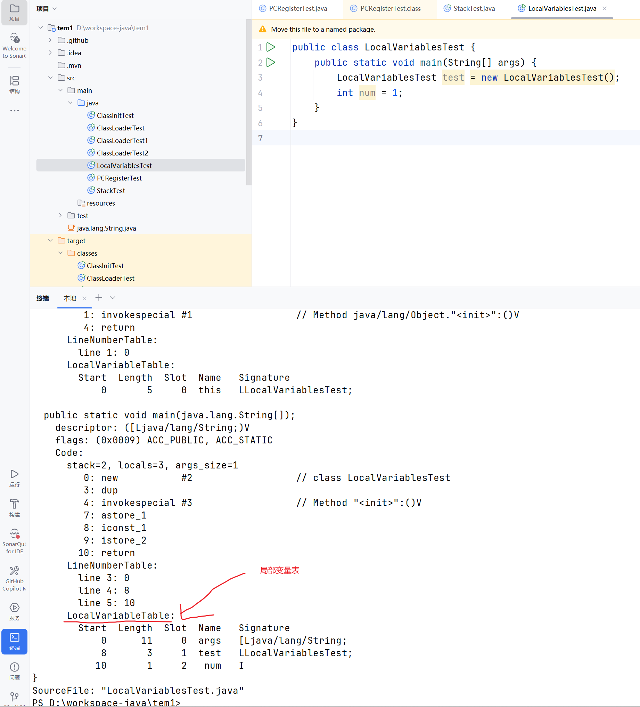

##### Slot
- 参数值的存放总是在局部变量数组的index0开始，到数组长度-1的索引结束
- 局部变量表，最基本的存储单元时Slot（变量槽）
- 局部变量表中存放编译器可知的各种基本类型（8种），引用类型（reference），returnAddress类型的变量
- 在局部变量表里，32位以内的类型只占用一个slot（包括returnAddress类型），64位的类型（long和double）占用两个slot。即一个槽4个字节
	- byte、short、char、boolean在存储前被转换为int
	- long和double则占据两个Slot
- JVM会为局部变量表中的每一个Slot都分配一个访问索引，通过这个索引即可成功访问到局部变量表中指定的局部变量值。（占据两个槽的局部变量值通过第一个槽的索引访问）
- 当一个实例方法被调用的时候，它的方法参数和方法体内部定义的局部变量将会**按照顺序被复制**到局部变量表中的每一个Slot上
- 如果需要访问局部变量表中一个64bit的局部变量值时，只需要使用前一个索引即可。
- 如果当前帧是由构造方法或者实例方法创建的，那么**该对象引用this将会存放在index为0的slot处**，其余的参数表顺序继续排列
- 栈帧中的局部变量表中的槽位是可以重用的。

| 索引  | 类型        | 参数       |
| --- | --------- | -------- |
| 0   | int       | int k    |
| 1   | long      | long m   |
| 3   | float     | float p  |
| 4   | double    | double p |
| 6   | reference | Object t |

#### 9）操作数栈
- 每一个独立的栈帧中除了包含局部变量表以外，还包含一个**后进先出**的操作数栈，也可以称之为**表达式栈**
- 操作数栈，在方法执行过程中，根据字节码指令，往栈中写入数据或提取数据，即入栈/出栈
	- 某些字节码指令将值压入操作数栈，其余的字节码指令将操作数取出栈。使用它们后再把结果压入栈
	- 比如：执行复制、交换、求和等操作
- 操作数栈，主要用于保存计算过程的中间结果，同时作为计算过程中变量临时的存储空间
- 操作数栈就是JVM执行引擎的一个工作区，当一个方法刚开始执行的时候，一个新的栈帧也会随之被创建出来，这个方法的操作数栈是空的。
- 每一个操作数栈都会拥有一个明确的栈深度用于存储数值，其所需的最大深度在编译期就定义好了，保存在方法的Code属性中，为max_stack的值
- 栈中的任何一个元素都是可以任意的Java数据类型
	- 32bit的类型占用一个栈单位深度
	- 64bit的类型占用两个栈单位深度
- 操作数栈并非采用访问索引的方式来进行数据访问的，而是只能通过标准的入栈和出栈操作来完成一次数据访问
- 如果被调用的方法带有返回值的话，其返回值将会被压入当前栈帧的操作数栈中，并更新PC寄存器中下一条需要执行的字节码指令。
- 操作数栈中元素的数据类型必须与字节码指令的序列严格匹配，这由编译器在编译器期间进行验证，同时在类加载过程中的类校验阶段的数据流分析阶段要再次验证
- 另外，我们说Java虚拟机的**解释引擎是基于栈的执行引擎**，其中的栈指的就是操作数栈

##### 栈顶缓存技术
前面提过，基于栈式架构的虚拟机所使用的零地址指令更加紧凑，但完成一项操作的时候必须需要使用更多的入栈和出栈指令，这同时也就意味着将需要更多的指令分派（instruction dispatch）次数和内存读/写次数。
由于操作数是存储在内存中的，因此频繁地执行内存读/写操作必然会影响执行速度。为了解决这个问题，HotSpot JVM的设计者们提出了**栈顶缓存**（ToS，Top-of-Stack Cashing）技术，**将栈顶元素全部缓存在物理CPU的寄存器中**，以此降低对内存的读/写次数，提升执行引擎的执行效率


#### 10）动态链接（或指向运行时常量池的方法引用）

- 每个栈帧内部都包含一个指向**运行时常量池**中该栈帧所属方法的引用。包含这个引用的目的就是为了支持当前方法的代码能够实现**动态链接**（Dynamic Linking）。比如：invokedynamic指令。
- 在Java源文件被编译到字节码文件中时，所有的变量和方法引用都作为符号引用（Symbolic Reference）保存在class文件的常量池里。比如：描述一个方法调用了另外的其他方法时，就是通过常量池中指向方法的符号引用来表示的，那么**动态链接的作用就是为了将这些符号引用转换为调用方法的直接引用**。
 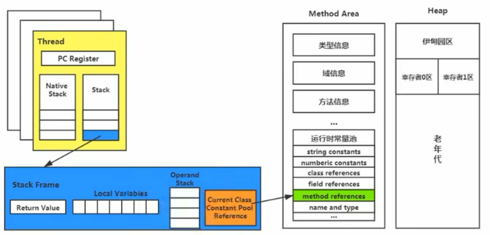
 上图中虚拟栈（stack）中的栈帧（Stack Frame）包含动态链接（Current Class Constant Pool Reference），动态链接指向运行时常量池的方法引用（method references)
 > Q:符号引用 和 动态链接
 > - **符号引用**：就是字节码里的 `#4`，以及它顺藤摸瓜找到的字符串 `"Calculator.add"`. 它仅仅是个**名字**。
> - **动态链接**：就是**JVM 在运行时**，看着这个名字，去内存里找到**真正的代码位置**（直接引用）的过程。

**为什么需要常量池？**：常量池的作用，就是为了提供一些符号和常量，便于指令识别

#### 11）补充：方法的调用

##### 绑定机制
在JVM中，将符号引用转换为调用方法的直接引用与方法的绑定机制相关
- 静态链接：当一个字节码文件被装载进JVM内部时，如果被调用的**目标方法在编译期可知**，且运行期保持不变时。这种情况下将调用方法的符号引用转换为直接引用的过程称之为静态链接
- 动态链接：如果**被调用的方法在编译期无法被确定下来**，只能在程序运行期将调用方法的符号引用转换为直接引用，就叫动态链接

对应的方法的**绑定机制**为：**早期绑定**（Early Binding）和**晚期绑定**（Late Binding）。**绑定是一个 *字段、方法或者类* 在符号引用被替换为直接引用的过程，这仅仅发生一次**。
- 早期绑定：指被调用的**目标方法在编译期可知，且运行期保持不变**时，即可将这个方法与所属的类型进行绑定。这样一来，由于明确了被调用的目标方法究竟是哪一个，因此也就可以使用静态链接的方式将符号引用转换为直接引用
- 晚期绑定：被调用的**方法在编译期无法被确定，只能在程序运行期根据实际的类型绑定相关的方法**。

##### 非虚方法和虚方法
非虚方法：
- 如果方法在编译期就确定了具体的调用版本，这个版本在运行时是不可变的。这样的方法叫**非虚方法**。
- 静态方法、私有方法、final方法、实例构造器、父类方法都是非虚方法。（不可能被子类重写的方法）
- 其他方法称为**虚方法**


> Q: 子类对象的多态性的使用前提：
>A:1. 类的继承关系；
>2. 方法的重写

> Q: 父类方法为什么不能被子类重写
> A:父类方法通过super调用。通常子类重写父类方法后，调用时会执行子类的版本（这是虚方法行为）。 但是，如果你在代码中显式地写了 `super.method()`，你的意图非常明确：“我**不要**多态，我**不要**看当前对象的类型，我就要强制调用父类的那段代码”。

虚拟机中调用了以下几条方法调用指令：
- **普通调用指令**：

| 指令                | 说明                              |
| ----------------- | ------------------------------- |
| `invokestatic`    | 调用静态方法，解析阶段确定唯一方法版本             |
| `invokespecial`   | 调用`init`方法、私有及父类方法，解析阶段确定唯一方法版本 |
| `invokeVirtual`   | 调用所有虚方法（除了final方法，它是非虚方法）       |
| `invokeinterface` | 调用接口方法                          |

- **动态调用指令**：

| 指令              | 说明                |
| --------------- | ----------------- |
| `invokedynamic` | 动态解析出需要调用的方法，然后执行 |


普通调用指令固化在虚拟机内部，方法的调用执行不可人为干预，而动态调用指令则支持由用户确定方法版本。其中**invokestatic指令和invokespecial指令调用的方法称为非虚方法，其余的（final修饰的除外）称为虚方法**。

##### 动态类型语言和静态类型语言
区别：对类型的检查是在编译期还是在运行期。满足前者的是静态类型语言，反之是动态类型语言

静态类型语言是判断**变量自身**的类型信息。（String info = "233"; // 通过info前面的Stirng，判断info是String类型的）
动态类型语言是判断**变量值**的类型语言（info = “233”; // 通过info的值“233”，判断info的值是Stirng类型的）

##### 方法重写的本质
1. 找到操作数栈顶的第一个元素所执行的对象的实际类型，记作`C`。
2. 如果在类型`C`中找到与常量中的描述符 和 简单名称都相符的方法，则进行权限校验，如果通过则返回这个方法的直接引用，查找过程结束；如果不通过没有权限，则返回`java.lang.IllegalAccessError`异常
3. 否则，按照继承关系从下往上依次对`C`的各个父类进行第2步的搜索和验证过程
4. 如果始终没有找到合适的方法，则抛出`java.lang.AbstractMethodError`异常

##### 虚函数表
- 在面向对象的编程中，会很频繁的使用到动态分派。因此，为了提高性能，JVM采用在类的方法区建立一个虚方法表来使用。非虚方法不会出现在表中。使用索引表来代替查找。
- 每个类都有一个虚方法表
- 虚方法表什么时候被创建？
  虚方法表会在类加载的**链接阶段**被创建并开始初始化，类的变量初始值准备完成之后，JVM会把该类的方法表也初始化完毕

#### 12）方法返回地址
- 存放调用该方法的pc寄存器的值（方法A调用了B后，B完成后要返回给执行引擎A的地址）
- 一个方法的结束，有两种方式：
	- 正常执行完成
	- 出现未处理的异常，非正常退出
- 无论通过哪种方式退出，在方法退出后都返回到该方法被调用的位置。方法正常退出时，调用者的pc计数器的值作为返回地址，即调用该方法的指令的下一条指令的地址。而通过异常退出的，返回地址是要通过异常表来确定，栈帧中一般不会保存这部分信息。

当一个方法开始执行后，只有两种方式可以退出这个方法：
1. 执行引擎遇到任意一个方法返回的字节码指令（return），会有返回值传递给上层的方法调用者，简称**正常完成出口**。
- 一个方法在正常调用完成之后究竟需要使用哪一个返回指令还需要根据方法返回值的实际数据类型而定。
- 在字节码指令中，返回指令包括ireturn（当返回值为boolean, byte, char, short, int）、lreturn (long)、freturn (float)、dreturn (double)、areturn(引用类型)、return（void方法，实例初始化方法，类和接口的初始化方法）
1.  在方法执行的过程中遇到了异常（Exception），并且这个异常没有在方法内进行处理，也就是只要在本方法的异常表中没有搜索到匹配的异常处理器，就会导致方法退出。简称**异常完成出口**。

本质上，方法的退出就是当前栈帧出栈的过程。此时，需要恢复上层方法的局部变量表、操作数栈、将返回值压入调用者栈帧的操作数栈、设置PC寄存器值等，让调用者方法继续执行下去。

正常完成出口和异常完成出口的区别在于：通过异常完成出口退出的不会给他的上层调用者产生任何的返回值。

#### 13）补充：本地方法接口的理解
##### 什么是本地方法
简单地讲，一个Native Method就是一个Java调用非Java代码接口。一个Native Method是这样一个方法：该方法的实现由非Java语言实现，比如C。这个特征并非Java所特有，很多其他的编程语言都有这样一个机制，比如在C++中，你可以用extern“C”告知C++编译器去调用一个C的函数。

在定义一个native method时，并不提供实现体（有些像定义一个Java interface），因为其实现体是由非java语言在外面实现的。

本地接口的作用是融合不同的编程语言为Java所用，它的初衷是融合C/C++程序。

标识符native可以与所有其他的java标识符连用，但是abstract除外。

#### 14）本地方法栈

#### 15）堆
##### 基本介绍
- 一个JVM实例只存在一个堆内存，堆也是Java内存管理的核心区域
- Java堆区在JVM启动的时候即被创建，其空间大小也就确定了。是JVM管理的最大一块内存空间
	- 堆内存大小是可以调节的
- 《Java虚拟机规范》规定，堆可以处于物理上不连续的内存空间中，但在逻辑上它应该被视为连续的。
- 所有的线程共享Java堆，在这里还可以划分线程私有的缓冲区（Thread Local Allocation Buffer，TLAB）

## 4. 程序计数器

## 5. 虚拟机栈

## 6. 本地方法接口

## 7. 本地方法栈

## 8. 堆

## 9. 方法区

## 10. 直接内存

## 11. 执行引擎

## 12. StringTable

## 13. 垃圾回收概述

## 14. 垃圾回收相关算法

## 15. 垃圾回收相关概念

## 16. 垃圾回收器

