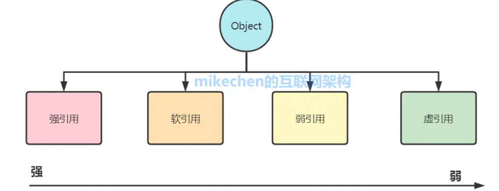
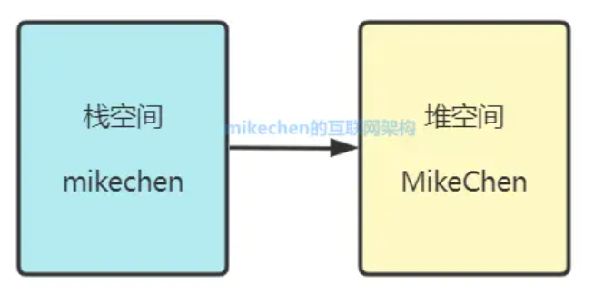
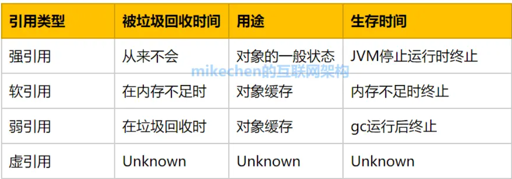
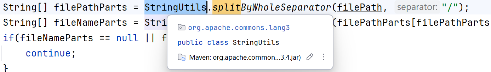

# 其他

当参数类型是基本数据类型时，传递的是实参的值，因此无法对实参进行修改。
当参数类型是非基本数据类型时，传递的是实参内存地址的拷贝，此时形参和实参都可以对此对象的字段进行修改，但是互相无法影响对方本身。

java只有值传递，没有引用传递。

向函数传递参数，java会把内存地址拷贝一份再把拷贝传递过去。


# java中的类型转换

##### 类对象转json：

```java
JSONUtil.toJsonStr(redisData)
```


##### json转类对象

```java
Shop shop = JSONUtil.toBean(shopJson, Shop.class);
```


##### Hash转类对象

```java
UserDTO userDTO = BeanUtil.fillBeanWithMap(userMap, new UserDTO(), false);
```


##### 类对象转Hash

 ```java
 //代码使用的为stringRedisTemplate要求所有字段都是字符串,所以要把Map中的值转为string
 Map<String, Object> userMap = BeanUtil.beanToMap(userDTO, new HashMap<>(),
         CopyOptions.create()//允许自定义map中的字段
                 .setIgnoreNullValue(true) //忽略空值
                 .setFieldValueEditor((fieldName, fieldValue) -> fieldValue.toString()));
 //这是不转换的版本
 Map <String, Object> userMap = BeanUtil.beanToMap(userDTO);
 ```


##### 方法需要 Resource scriptLocation： 

```java
UNLOCK_SCRIPT.setLocation(new ClassPathResource("unlock.lua"));
```


##### 转集合

```java
Collections.singletonList(a);
```


##### ArrayList转数组

 T[] toArray(T[] a)


## LocalDateTime、LocalDate、Date的相互转换

LocalDateTime 及 LocalDate 是 Java8 的新特性，有时为了兼容 Date 类型需要进行转换。

[回到顶部](https://www.cnblogs.com/CF1314/p/13884530.html#_labelTop)

### LocalDateTime 转 LocalDate

直接调用 toLocalDate() 方法

```
1
2
LocalDateTime localDateTime = LocalDateTime.now();
LocalDate localDate = localDateTime.toLocalDate();
```

[回到顶部](https://www.cnblogs.com/CF1314/p/13884530.html#_labelTop)

### LocalDateTime 转 Date

在LocalDateTime 转 Date 时，需要使用到 Java 8的几个类

- ZoneId/ZoneOffset：表示时区
- ZonedDateTime： 表示特定时区的日期和时间
- Instant：表示时刻，不直接对应年月日信息，需要通过时区转换

```
1
2
3
4
5
6
7
8
9
10
11
12
LocalDateTime localDateTime = LocalDateTime.now();
//获取系统默认时区
ZoneId zoneId = ZoneId.systemDefault();
//时区的日期和时间
ZonedDateTime zonedDateTime = localDateTime.atZone(zoneId);
//获取时刻
Date date = Date.from(zonedDateTime.toInstant());
System.out.println("格式化前：localDateTime:" + localDateTime + "  Date:" + date);
//格式化LocalDateTime、Date
DateTimeFormatter localDateTimeFormat = DateTimeFormatter.ofPattern("yyyy-MM-dd HH:mm:ss");
SimpleDateFormat dateFormat = new SimpleDateFormat("yyyy-MM-dd HH:mm:ss");
System.out.println("格式化后：localDateTime:" + localDateTimeFormat.format(localDateTime) + "  Date:" + dateFormat.format(date));
```

输出结果如下：

```
1
2
格式化前：localDateTime:2020-10-27T11:35:09.969  Date:Tue Oct 27 11:35:09 CST 2020
格式化后：localDateTime:2020-10-27 11:35:09  Date:2020-10-27 11:35:09
```

[回到顶部](https://www.cnblogs.com/CF1314/p/13884530.html#_labelTop)

### LocalDate 转 LocalDateTime

一般调用 atTime() 方法进行赋值

```
1
2
3
4
LocalDate localDate = LocalDate.now();
LocalDateTime localDateTime1 = localDate.atStartOfDay();
LocalDateTime localDateTime2 = localDate.atTime(8,20,33);
LocalDateTime localDateTime3 = localDate.atTime(LocalTime.now());
```

[回到顶部](https://www.cnblogs.com/CF1314/p/13884530.html#_labelTop)

### LocalDate 转 Date

先调用 atStartOfDay() 方法转 LocalDateTime 再转 Date

```
1
2
3
LocalDate localDate = LocalDate.now();
ZoneId zoneId = ZoneId.systemDefault();
Date date = Date.from(localDate.atStartOfDay().atZone(zoneId).toInstant());
```

[回到顶部](https://www.cnblogs.com/CF1314/p/13884530.html#_labelTop)

### Date 转 LocalDateTime

先转 ZonedDateTime 再转 LocalDateTime

```
1
2
3
Date date = new Date();
ZoneId zoneId = ZoneId.systemDefault();
LocalDateTime localDateTime = date.toInstant().atZone(zoneId).toLocalDateTime();
```

[回到顶部](https://www.cnblogs.com/CF1314/p/13884530.html#_labelTop)

### Date 转 LocalDate

跟 LocalDate 同理

```
复制1
2
3
Date date = new Date();
ZoneId zoneId = ZoneId.systemDefault();
LocalDate localDate = date.toInstant().atZone(zoneId).toLocalDate();
```


# 静态常量初始化

1. 在staic块中初始化


# hashMap怎么遍历

```java
mport java.io.IOException;
import java.util.HashMap;
import java.util.Map;
 
public class Test {
	public static void main(String[] args) throws IOException {
		Map<Integer, Integer> map = new HashMap<Integer, Integer>();
		map.put(1, 10);
		map.put(2, 20);
 
		// 使用entrySet
		for (Map.Entry<Integer, Integer> entry : map.entrySet()) {
			System.out.println("Key = " + entry.getKey() + ", Value = " + entry.getValue());
		}
        
        // 迭代键
		for (Integer key : map.keySet()) {
			System.out.println("Key = " + key);
		}
 
		// 迭代值
		for (Integer value : map.values()) {
			System.out.println("Value = " + value);
		}
		// 使用带泛型的迭代器
 		Iterator<Map.Entry<Integer, Integer>> entries = map.entrySet().iterator();
		while (entries.hasNext()) {
			Map.Entry<Integer, Integer> entry = entries.next();
			System.out.println("Key = " + entry.getKey() + ", Value = " + entry.getValue());
		}
		// 使用不带泛型的迭代器
        Iterator<Map.Entry> entries = map.entrySet().iterator();
		while (entries.hasNext()) {
			Map.Entry entry = (Map.Entry) entries.next();
			Integer key = (Integer) entry.getKey();
			Integer value = (Integer) entry.getValue();
			System.out.println("Key = " + key + ", Value = " + value);
		}
		
        // 使用Lambda
        map.forEach((k, v) -> System.out.println("key: " + k + " value:" + v));
        

	}
}
```


# classpath

## 什么是classpath

classpath是JVM用到的一个环境变量，它用来指示JVM如何搜索class。

因为Java是编译型语言，源码文件是`.java`，而编译后的`.class`文件才是真正可以被JVM执行的字节码。因此，JVM需要知道，如果要加载一个`abc.xyz.Hello`的类，应该去哪搜索对应的`Hello.class`文件。

所以，`classpath`就是一组目录的集合，它设置的搜索路径与操作系统相关. 例如, 在Windows系统上, 用`;`分隔, 带空格的目录用`""`括起来, 可能长这样:

`C:\work\project1\bin;C:\shared;"D:\My Documents\project1\bin"`

在Linux系统上, 用`:`分隔, 可能长这样:

`/usr/shared:/usr/local/bin:/home/liaoxuefeng/bin`

## JVM如何根据classpath找到class

现在我们假设`classpath`是`.;C:\work\project1\bin;C:\shard`, 当JVM在加载`abc.xyz.Hello`这个类时,会依次查找:

- <当前目录> \abc\xyz\Hello.class
- C:\work\project1\bin\abc\xyz\Hello.class
- C:\shared\abc\xyz\Hello.class

如果JVM在某个路径下找到了对应的`class`文件,就不再往后继续搜索. 如果所有路径下都没有找到, 就报错.


## classpath设定方法

- 在系统环境变量中设置`classpath`环境变量(不推荐, 会污染整个系统环境)

- 在启动JVM时设置`classpath`变量:

  `java -classpath .;C:\work\project1\bin;C:\shared abc.xyz.Hello`

  或者使用`-cp`的简写:

  `java -cp .;C:\work\project1\bin;C:\shared abc.xyz.Hello`

**注意:** 不要把任何Java核心库添加到classpath中, JVM根本不依赖classpath加载核心库

## 默认的cp配置

没有设置环境变量,也没有传入`-cp`参数,那么JVM默认的`classpath`为`.`, 即当前目录

在**IDE**中运行Java程序, IDE自动传入的`-cp`参数是当前工程的`bin`目录和引入的jar包


## jar包

如果有很多`.class`文件, 散落在各层目录中,肯定不便于管理. 如果能把目录打一个包, 变成一个文件, 就方便多了.

jar包可以把`package`组织的目录层级, 以及各个目录下的所有文件(包括`.class`文件和其他文件)都打成一个jar文件.

jar包实际上就是一个<u>zip格式的压缩文件</u>, 而jar包相当于目录. 如果我们要执行一个jar包的`class`, 就可以把jar包放到`classpath`中:

`java -cp ./hello.jar abc.xyz.Hello`

这样JVM会自动在`hello.jar`文件里去搜索某个类.


jar包还可以包含一个特殊的`/META-INF/MANIFEST.MF`文件, `MANIFEST.MF`文件, 如果存在`MainClass`, 我们就不必在命令行指定启动的类名,而是用更方便的命令:

```java
java -jar hello.jar
```


#  四大引用

- 强引用
- 软引用
- 弱引用
- 虚引用




## 强引用

一般把一个对象赋给一个引用变量, 这个引用变量就是强引用

```java
MikeChen mikechen = new MikeChen();
```

在一个方法的内部有一个强引用, 这个引用保存在Java栈中, 而真正的引用内容(MikeChen)保存在Java堆中.



如果一个对象具有强引用, 垃圾回收器不会回收该对象, 当内存空间不足时, JVM

宁愿抛出OutOfMemoryError异常.

如果强引用不使用时,需要弱化从而使GC能够回收, 如下:

```java
mikechen = null;
```

显示的设置mikechen对象为null, 或让其超出对象的生命周期范围, 则GC认为该对象不存在引用, 这时就可以回收这个对象.

举例:

```java
package com.mikechen.java.refenence;

/**
* 强引用举例
*
* @author mikechen
*/
public class StrongRefenenceDemo {

    public static void main(String[] args) {
        Object o1 = new Object();
        Object o2 = o1;
        o1 = null;
        System.gc();
        System.out.println(o1);  //null
        System.out.println(o2);  //java.lang.Object@2503dbd3
    }
}
```

StrongRefenenceDemo中尽管o1已经被回收, 但是o2强引用o1, 一直存在, 所以不会被GC回收.


## 软引用

```java
String str=new String("abc");                                     // 强引用
SoftReference<String> softRef=new SoftReference<String>(str);     // 软引用
```

如果一个对象只具有软引用, 则内存空间足够, 垃圾回收器就不会回收它, 如果内存空间不足了, 就会回收这些对象的内存.

先通过一个例子来了解以下软引用:

```java
/**
* 弱引用举例
*
* @author mikechen
*/
Object obj = new Object();
SoftReference softRef = new SoftReference<Object>(obj);
obj = null;//删除强引用
System.gc();//调用gc
System.out.println("gc之后的值：" + softRef.get());// 对象依然存在
```

软引用可以和一个引用队列(ReferenceQueue) 联合使用, 如果软引用所引用对象被垃圾回收, Java虚拟机就会把这个软引用加入到与之关联的引用队列中.

```java
ReferenceQueue<Object> queue = new ReferenceQueue<>();
Object obj = new Object();
SoftReference softRef = new SoftReference<Object>(obj,queue);
obj = null;//删除强引用
System.gc();//调用gc
System.out.println("gc之后的值: " + softRef.get()); // 对象依然存在
//申请较大内存使内存空间使用率达到阈值，强迫gc
byte[] bytes = new byte[100 * 1024 * 1024];//如果obj被回收，则软引用会进入引用队列
Reference<?> reference = queue.remove();
if (reference != null){
    System.out.println("对象已被回收: "+ reference.get());  // 对象为null
}
```

软引用通常在对内存敏感的程序中, 比如高速缓存.

注意：软引用对象是在jvm内存不够的时候才会被回收，我们调用System.gc()方法只是起通知作用，JVM什么时候扫描回收对象是JVM自己的状态决定的，就算扫描到软引用对象也不一定会回收它，只有内存不够的时候才会回收。


## 弱引用

```java
MikeChen mikechen = new MikeChen();
WeakReference<MikeChen> wr = new WeakReference<MikeChen>(mikechen );
```

弱引用的特定是不管内存是否足够, 只要发生GC, 都会被回收

举例:

```java
package com.mikechen.java.refenence;

import java.lang.ref.WeakReference;

/**
* 弱引用
*
* @author mikechen
*/
public class WeakReferenceDemo {
    public static void main(String[] args) {
        Object o1 = new Object();
        WeakReference<Object> w1 = new WeakReference<Object>(o1);

        System.out.println(o1);
        System.out.println(w1.get());

        o1 = null;
        System.gc();

        System.out.println(o1);
        System.out.println(w1.get());
    }
}
```


### 弱引用的应用

#### WeakHashMap

```java
public class WeakHashMapDemo {

    public static void main(String[] args) throws InterruptedException {
        myHashMap();
        myWeakHashMap();
    }

    public static void myHashMap() {
        HashMap<String, String> map = new HashMap<String, String>();
        String key = new String("k1");
        String value = "v1";
        map.put(key, value);
        System.out.println(map);

        key = null;
        System.gc();

        System.out.println(map);
    }

    public static void myWeakHashMap() throws InterruptedException {
        WeakHashMap<String, String> map = new WeakHashMap<String, String>();
        //String key = "weak"; 
        // 刚开始写成了上边的代码
        //思考一下，写成上边那样会怎么样？ 那可不是引用了. 
        //常量池会强引用"weak",WeakHashMap无法自主移除键值对
        String key = new String("weak");
        String value = "map";
        map.put(key, value);
        System.out.println(map);
        //去掉强引用
        key = null;
        //
        System.gc();
        Thread.sleep(1000);
        System.out.println(map);
    }}
```

当key只有弱引用时，GC发现后会自动清理键和值，作为简单的缓存表解决方案。


### ThreadLocal

```java
static class ThreadLocalMap {

    static class Entry extends WeakReference<ThreadLocal<?>> {
        Object value;

        Entry(ThreadLocal<?> k, Object v) {
            super(k);
            value = v;
        }
    }
    //......}
```

ThreadLocal.ThreadLocalMap.Entry 继承了弱引用, key为当前线程实例, 和WeakHashMap基本相同.


## 虚引用

虚引用不会决定对象的生命周期. 如果一个对象仅持有虚引用, 那么它就和没有任何引用一样, 在任何时候都可能被垃圾回收器回收.

```java
A a = new A();
ReferenceQueue<A> rq = new ReferenceQueue<A>();
PhantomReference<A> prA = new PhantomReference<A>(a, rq);
```

虚引用主要用来跟踪对象被垃圾回收器回收的活动.

虚引用与软引用和弱引用的一个区别在于: 虚引用必须和引用队列(ReferenceQueue) 联合使用


## Java引用总结

引用的级别由高到低: 强引用 > 软引用 > 弱引用 > 虚引用




# Split 的使用




# 锁

```
public interface Lock {

    /**
     * 阻塞式锁
     * @author wangjw
     * @create 2020-02-02 11:32
     */
    void lock();

    /**
     * 非阻塞式锁
     * @author wangjw
     * @create 2020-02-02 11:19
     */
    boolean tryLock();

    /**
     * 带超时时间的阻塞式锁
     * @param time
     * @param unit
     * @author wangjw
     * @create 2020-02-02 11:18
     */
    boolean tryLock(long time, TimeUnit unit);

    /**
     * 解锁
     * @author wangjw
     * @throws Exception
     * @create 2020-02-02 11:18
     */
    void unLock() throws Exception;

}
```

```java
public class ZkLock implements Lock {

    private static final String DEFAULT_LOCK_NODE = "/lock";
    private static final String ZK_SEPARATOR = "/";

    private final InterProcessMutex lock;
    private final String path;

    public ZkLock(String key) {
        this.path = DEFAULT_LOCK_NODE + ZK_SEPARATOR + key;
        ZkWrapper zkWrapper = SpringUtil.getBean(ZkWrapper.class);
        this.lock = new InterProcessMutex(zkWrapper.getCurator(), this.path);
    }

    @Override
    public void lock() {
        try {
            this.lock.acquire();
        } catch (Exception e) {
            log.error("[{}]获取锁失败", this.path, e);
        }
    }

    @Override
    public boolean tryLock() {
        return tryLock(0, TimeUnit.MILLISECONDS);
    }

    @Override
    public boolean tryLock(long timeout, TimeUnit unit) {
        try {
            return this.lock.acquire(timeout, TimeUnit.MILLISECONDS);
        } catch (Exception e) {
            log.error("[{}]尝试获取锁失败", this.path, e);
            return false;
        }
    }

    @Override
    public void unLock() throws Exception {
        this.lock.release();
    }

}
```


## 一、锁的相关概念

1.3 Java中锁的分类

内置锁： 

使用关键字synchronized实现。

可以对方法或代码块进行同步，被同步的代码同一时刻只有一个线程可以执行其中的代码。

显式锁：

使用java.util.concurrent.locks包下锁机制实现，比如ReentrantLock。

提供了更加灵活的控制，需要显式的用lock()方法加锁和unlock()方法释放锁。

条件锁：

使用java.util.concurrent.locks包下的Condition接口和ReentrantLock实现

允许线程在某个特定条件满足时等待或唤醒

读写锁：

使用java.util.concurrent.locks包下的ReentrantReadWriteLock实现。

允许多个线程同时读共享资源，但只允许一个线程进行写操作。

StampedLock：

在Java8中引入的新型锁机制，也是在java.util.concurrent.locks包下。

提供了三种模式：写锁、悲观读锁和乐观读锁。

无锁

也就是我们常说的乐观锁，基于原子操作实现的锁机制，比如CAS算法。
避免了传统锁机制的线程阻塞和切换开销。
下面将逐个详细介绍。

二、synchronized关键字
在多线程并发编程中synchronized一直是元老级角色，下面介绍一下它的三种表现形式、实现原理、在JDK1.6中的优化以及锁的八种场景。

2.1 三个特点
互斥性：同一时间，只有一个线程可以获得锁，获得锁的线程才能执行被synchronized保护的代码片段。
阻塞性：未获得锁的线程只能阻塞，等待锁释放
可重入性：如果一个线程已经获得锁，在锁未释放前，再次请求锁的时候，是必然可以获取到的。
2.2 三种表现形式（🙋‍♂️）
修饰普通方法：锁的是当前实例
public synchronized void doSomething(){
}
AI运行代码
java
修饰静态方法：锁的是当前类的Class对象
public static synchronized void doSomething(){
}
AI运行代码
java
修饰代码块：锁的是括号里面的内容
synchronized (任意对象){
}
AI运行代码
java
2.3 sychronized是怎么实现的（🙋‍♂️）
上面也提到synchronized可以修饰方法和代码块，JVM基于进入和退出Monitor来实现方法和代码块同步，但两者实现细节不一样，下面就介绍一下它俩的不同之处。

修饰方法：也就成了同步方法，它的常量池中会有一个ACC_SYNCHRONIZED标志。当某个线程要访问某个方法的时候，会检查是否有设置ACC_SYNCHRONIZED，如果有设置，则需要先获得监视器锁（Monitor），然后开始执行方法，方法执行之后再释放监视器锁（Monitor）。这时如果其它线程来请求执行方法，会因为无法获得监视器（Monitor）锁而被阻塞住。（ps：如果在方法执行过程中，发生了异常，并且方法内部并没有处理该异常，那么在异常被抛到方法外面之前监视器锁（Monitor）会被自动释放）

深入JVM字节码：

public class SyncDemo {
    public synchronized void doSomething(){
        System.out.println("do Something");
    }
}
AI运行代码
java
javac SyncDemo`命令编译成Class文件。
javap -v SyncDemo.class命令查看.class文件的信息。


修饰代码块：同步代码块是使用monitorenter和monitorexit两个指令实现的。我们可以把执行monitorenter理解为加锁，执行monitorexit理解为释放锁。每个对象维护着一个记录被锁次数的计数器，未被锁定的对象的计数器为0，当一个线程获得锁（执行了monitorenter指令）后，计数器会自增为1，当同一个线程再次获得该对象的锁时，计数器会再次自增。同一个线程释放锁（执行monitorexit指令）时，计数器自减，当计数器为0的时候，锁被释放，其他线程才能获得锁。

深入JVM字节码：

public class SyncDemo {
    public void doSomething(){
        synchronized (this){
            System.out.println("do Something");
        }
    }
}
AI运行代码
java
1.javac SyncDemo命令编译成Class文件

2.javap -v SyncDemo.class命令查看.class文件的信息


ps：第一个monitorexit是程序正常情况释放锁，第二个monitorexit是程序出现异常情况释放锁（防止在第一个monitorexit执行之前程序发生异常，导致锁不会被释放的情况）

2.4 JDK1.6中的优化（🙋‍♂️）
高效并发是从JDK1.5到JDK1.6的一个重要改进，HotSpot虚拟机开发团队在这个版本中花费了很大的精力取对Java中的锁进行优化，比如锁消除、锁粗化、轻量级锁和偏向锁等。

2.4.1 锁消除
概念： 在没有操作共享数据的位置加锁，JVM会直接优化掉，没有锁。

就拿去银行取钱这个例子来说，平常的流程大概是先去取号，然后等待叫号，轮到你的时候再去柜台取钱。所有的情况都如此吗？其实不是，当银行办理业务的人不多的时候，可能根本不需要取号，直接去柜台办理就行（前提是没人跟你抢着办业务）。这就是我们说的“锁消除”，是JIT编译器对内部锁的一种优化。相当于下面代码：

优化前：

public void doSomething(){
     Object o=new Object();
     synchronized (o){
        System.out.println(o);
    }
}
AI运行代码
java
优化后：

public void doSomething(){
     Object o=new Object();
     System.out.println(o);
}
AI运行代码
java
2.4.2 锁粗化
概念：将锁的覆盖范围提升，避免频繁的竞争和释放锁资源。

很多时候，我们在加锁的时候，一般会尽量把锁的粒度降到最低，以避免不必要的阻塞，这也是很多人愿意用同步代码块来代替同步方法的原因，因为它的粒度往往要小一些，但这也不是绝对的。

还是银行的例子：假如你去银行办业务，你为了减少每次办理的时间，你把要办理的N个业务分成N次去办，这反而适得其反了。因为这平白的增加了很多你重新取号、排队、被唤醒的时间。这就相当于对同一个对象进行了反复加锁，其实是相对耗费资源的，这种情况应该适当放宽加锁的范围，减少性能消耗。相当于下面代码：

优化前：

public void doSomething(){
    for (int i = 0; i < 1000; i++) {
        synchronized (this){
            System.out.println("do something");
        }
    }
}
AI运行代码
java
优化后：

public void doSomething(){
    synchronized (this) {
        for (int i = 0; i < 1000; i++) {
            System.out.println("do something");
        }
    }
}
AI运行代码
java
2.4.3 自适应自旋锁、自旋锁
概念：

自旋锁（JDK1.4）：当线程尝试获取锁时，如果锁已经被其他线程占用，那么该线程会不断地循环检查锁是否可用（自旋），而不是放弃CPU的执行权。

自适应自旋锁（JDK1.6）：自适应就意味着自旋的时间不再是固定的了，而是由前一次在同一把锁上的自旋时间及锁的拥有者的状态来决定的。

读到这有没有发现“银行叫号”这种方式是不是不太好，取号后就一直在休息区等待叫号，这个过程是比较浪费时间的，那怎么改进呢？那就是自动取款机，这种直接在后面排着就行了，减少了听叫号和跑去对应柜台的时间。

ps：Java虚拟机的开发工程师在分析大量数据后发现，共享数据的锁定状态一般只会持续很短一段时间，为了这段时间去挂起和恢复线程其实并不值得。

在多线程执行的情况下，我们可以让后面来的线程“稍微等一下”，但是并不放弃处理器的执行时间，看看持有锁的线程能不能很快地释放锁。这个“稍微等一下”的过程就是自旋。（自旋锁在JDK1.4.2引入——默认关闭，JDK1.6——默认开启）

这么听上去是不是和阻塞没啥区别了，反正都是等着，但区别还是很大的：

如果是“叫号”方式，那就在休息区等着被唤醒就行了。

在取款机面前，那就得时刻关注自己的前面还有没有人，因为没人会唤醒你。

很明显，直接去自动取款机排队的效率还是比较高的。多以，最大的区别还是要不要放弃处理器的执行时间。阻塞锁是放弃了CPU时间，进入了等待区，知道被唤醒。而自旋锁是一直“自旋”在那，时刻检查共享资源是否可以被访问。

那么自旋锁和自适应自旋锁有什么区别呢？看下面自动取款机取钱的例子：

假如我们去自动取款机取钱时，发现自动取款机正在被使用，那么

自旋锁：会乖乖的一直自旋等待，直到轮到它为止。

自适应自旋锁：它就相对很“聪明”了，它不会立即决定是否要等待，而是去观察前面人使用自动取款机的时间来决定，如果前面的人都是很短时间就完成了取款操作，那么它可能会稍微等一下；反之，它就会先去忙其它的事，这样做可以更加有效地利用自己的时间和资源了。（这就是JDK1.6对自旋锁的优化）

2.4.4 锁升级（无锁->偏向锁->轻量级锁->重量级锁）
在JDK1.6之前，如果当前对象没有被锁住，线程会获取锁并继续执行，反之，线程就会进入阻塞状态，直到锁被释放。这种锁的实现方式就被成为“重量级锁”，因为锁的获取和释放都需要在操作系统层面上进行线程的阻塞和唤醒，而这些操作会带来很大的开销。

在JDK1.6之后，synchronized引入了“偏向锁”、“轻量级锁”和“重量级锁”三种不同的状态，来应用于不同场景下的锁竞争情况。下面是Java锁在32位虚拟机中的四种状态及字节分配（ps：由于无锁和偏向锁都是01，所以在第三位引入偏向锁标记位）：

Mark Word的存储结构：


锁升级的过程如下：

无锁：当第一个线程第一次访问一个对象的同步块时，JVM会在对象头中设置该线程的Thread ID，并将对象头的状态位设置为“偏向锁”。这个过程称为“偏向”，表示对象当前偏向于第一个访问它的线程。
偏向锁：指在只有一个线程访问对象的情况下，也就是没有竞争，可以直接执行代码，并在对象头中记录该线程的ID作为偏向锁的持有者，如果出现竞争，那就升级为轻量级锁。
轻量级锁：当一个线程访问该对象时，JVM会将对象头中的Mark Word复制一份到线程栈中，并在对象头中存储线程栈中的指针。此时如果另外一个线程想要访问该对象，会发现该对象已经处于轻量级锁状态，于是开始尝试使用CAS操作将对象头中的指针替换成自己的指针。自旋一定次数后(JDK1.8最多自旋15次），如果替换成功，则该线程获取锁成功，反之，升级为重量级锁。
重量级锁：当锁升级到重量级锁时，JVM会将该对象的锁编程一个重量级锁，并在对象头中记录指向等待队列的指针。此时如果一个线程想要获取锁，需要先进入等待队列，等待锁被释放。当锁被释放时，JVM会从等待队列中选择一个线程唤醒，并将该线程设置为“就绪”状态。
锁升级示意图：


2.5 八种案例演示（🙋‍♂️）
这个我印象很深，因为这块我跟着尚硅谷的周阳老师学过，而且在面试的时候还被问到了，但答的不是很好😓，这里再重温一下：

public class Phone {
    public synchronized void sendEmail() {
        try {
            TimeUnit.SECONDS.sleep(3);
        } catch (InterruptedException e) {
            e.printStackTrace();
        }
        System.out.println("------sendEmail");
    }

    public synchronized void sendSMS() {
        System.out.println("------sendSMS");
    }
    
    public void hello() {
        System.out.println("------hello");
    }
    
    public static void main(String[] args) {
        Phone phone = new Phone();
        new Thread(() -> {
            phone.sendEmail();
        }, "a").start();
    
        try {
            TimeUnit.MILLISECONDS.sleep(200);
        } catch (InterruptedException e) {
            e.printStackTrace();
        }
    
        new Thread(() -> {
            phone.sendSMS();
        }, "b").start();
    }
}
AI运行代码
java

现象描述：a、b两个线程访问

两个都是同步方法，先打印邮件还是短信？-------------先邮件再短信，共用一个对象锁。
sendEmail()休眠3秒，先打印邮件还是短信？----------先邮件再短信，共用一个对象锁。
添加一个普通的hello方法，先打印普通方法还是邮件？------先hello，再邮件。
两部手机，一个发短信，一个发邮件，先打印邮件还是短信？----先短信后邮件 资源没有争抢，不是同一个对象锁。
两个静态同步方法，一部手机，先打印邮件还是短信？-----先邮件再短信，共用一个类锁。
两个静态同步，两部手机，一个发短信，一个发邮件，先打印邮件还是短信？-----先邮件后短信，共用一个类锁。
邮件静态同步，短信普通同步，先打印邮件还是短信？---先短信再邮件，一个类锁一个对象锁。
邮件静态同步，短信普通同步，两部手机，先打印邮件还是短信？------先短信后邮件，一个类锁一个对象锁。
三、ReentrantLock
使用synchronized关键字将会隐式地获取或释放，这种方式简化了同步管理，但扩展性没有显式的好。例如，针对一个场景，手把手锁释放和获取，先获取锁A，然后再获取锁B，当锁B获得后，释放锁A同时获取锁C...在这种场景下，synchronized就不那么容易实现了，而Lock却容易许多。接下来重点介绍一下它的是实现类——ReentrantLock。

3.1 ReentrantLock类实现及常用方法
ReentrantLock内部是基于AbstractQueuedSynchronizer(简称AQS)实现的，其内部是一个双向队列，还有一个volatile修饰的int类型的state，state=0表示当前锁没有被占有，state>0表示当前已有线程持有锁，AQS暂时就先介绍这么多，后续会详解。

ReentrantLock类的常用方法：

void lock():获取锁，如果锁被占用，当前线程则进入等待状态。
boolen tryLock()：尝试获取锁（成功返回true，失败返回false，不阻塞）
void unlock()：释放锁
void lockInterruptibly() throws Interrupt：可中断地获取锁，即在锁的获取中可以中断当前线程。
boolean tryLock(long time,TimeUnit unit) throws InterruptedException：当前线程在以下3中情况下会返回：①当前线程在超时时间内获得了锁 ②当前线程在超时时间内被中断 ③超时时间结束，返回false。
Condition newCondition()：获取等待通知组件，该组件和当前锁绑定。
一个小demo：

public static void main(String[] args) {
     Lock lock = new ReentrantLock();
     //获取锁
     lock.lock();
     try {
        //代码逻辑
     } finally {
         //释放锁
         lock.unlock();
    }
}
AI运行代码
java

3.2 公平锁和非公平锁（🙋‍♂️）
syncchronized关键字只有非公平锁，而ReentrantLock可实现非公平锁和公平锁。

3.2.1 什么是公平锁和非公平锁
非公平锁：多个线程不按照申请锁的顺序去获得锁，而是同时直接去尝试获取锁，获取不到，再进入队列等待。
公平锁：多个线程按照申请锁的顺序去获得锁，所有线程都在队列里排队，这样就保证队列中的第一个线程先获得锁。
实现起来也比较简单，可以通过构造方法来指定：

//默认非公平锁
public ReentrantLock() {
   sync = new NonfairSync();
}
AI运行代码
java
//只需要在new的时候指定其构造函数为true，就是公平锁
public ReentrantLock(boolean fair) {
   sync = fair ? new FairSync() : new NonfairSync();
}
AI运行代码
java
3.2.2 公平锁和非公平锁的优缺点
非公平锁：优点是减少了cpu唤醒线程的开销，整体的吞吐量会高一点。但它可能会导致队列中排队的线程一直获取不到锁或长时间获取不到，活活饿死。
公平锁：优点是所有的线程都能得到资源，不会饿死在队列中。但它的吞吐量相较非公平锁而言，就下降了很多，队列里面除了第一个线程，其它线程都会阻塞，cpu唤醒阻塞线程的开销是很大的缺点。
3.2.3 公平锁和非公平锁的源码分析（JDK1.8)
非公平锁的lock的核心逻辑在NonFairSync中，如下：

static final class NonfairSync extends Sync {
     private static final long serialVersionUID = 7316153563782823691L;
     /**
      * Performs lock.  Try immediate barge, backing up to normal
      * acquire on failure.
      */
     final void lock() {
          if (compareAndSetState(0, 1))
             setExclusiveOwnerThread(Thread.currentThread());
          else
              acquire(1);
     }
       
     protected final boolean tryAcquire(int acquires) {
          return nonfairTryAcquire(acquires);
     }
}
//这是AQS的方法，这里面的tryAcquire()会调用它子类重写的方法
public final void acquire(int arg) {
    if (!tryAcquire(arg) &&
        acquireQueued(addWaiter(Node.EXCLUSIVE), arg))
        selfInterrupt();
}

//....
final boolean nonfairTryAcquire(int acquires) {
    final Thread current = Thread.currentThread();
    int c = getState();
    if (c == 0) {
        if (compareAndSetState(0, acquires)) {
            setExclusiveOwnerThread(current);
            return true;
        }
    }
    else if (current == getExclusiveOwnerThread()) {
        int nextc = c + acquires;
        if (nextc < 0) // overflow
            throw new Error("Maximum lock count exceeded");
        setState(nextc);
        return true;
    }
    return false;
}
AI运行代码
java

从代码可以看到，lock方法执行的时候会先用cas来判断当前锁是否有线程占有，如果cas成功，就将state设置为1，如果不成功，则去排队。

公平锁的lock核心逻辑在FairSync中，如下：

static final class FairSync extends Sync {
        private static final long serialVersionUID = -3000897897090466540L;

        final void lock() {
            acquire(1);
        }
    
        /**
         * Fair version of tryAcquire.  Don't grant access unless
         * recursive call or no waiters or is first.
         */
        protected final boolean tryAcquire(int acquires) {
            final Thread current = Thread.currentThread();
            int c = getState();
            if (c == 0) {
                if (!hasQueuedPredecessors() &&
                    compareAndSetState(0, acquires)) {
                    setExclusiveOwnerThread(current);
                    return true;
                }
            }
            else if (current == getExclusiveOwnerThread()) {
                int nextc = c + acquires;
                if (nextc < 0)
                    throw new Error("Maximum lock count exceeded");
                setState(nextc);
                return true;
            }
            return false;
        }
    }
AI运行代码
java

公平锁的lock方法在cas时多了一个hasQueuedPredecessors()的判断，解释一下，就是如果当前线程前面还有线程，那就继续排队，如果没有或者队列为空就申请锁。

3.3 可重入性解释及应用
所谓重入锁，是指一个线程拿到锁后，还可以多次获取同一把锁，而不会因为该锁已经被持有（尽管是自己持有的）而陷入等待状态。之前说的sychronized也是可重入锁。
ReentrantLock加锁的时候，看下当前持有锁的线程和当前请求的线程是否同一个，一样就可重入了。只需要简单的讲state加1，记录当前重入的次数即可。同时，在锁释放的时候，需要确保state=0的时候才执行释放的动作，简单的说就是重入多少次就得释放多少次。
举个两个人拿筷子吃饭的例子：

public class Chopsticks {
    boolean getOne=false;
    boolean getAnother=false;
    //拿筷子，获取锁，该锁是当前Chopsticks对象
    public synchronized void getOne() {
        getOne=true;
        System.out.println(Thread.currentThread().getName()+"拿到了一根筷子。");
        //if语句块调用了另外的同步方法，需要再次获取锁，而该锁也是当前Chopsticks对象
        if(getAnother) {
            //有两根筷子，吃饭
            canEat();
            //吃完放下两根筷子
            getOne=false;
            getAnother=false;
        }else {
            //只有一根筷子，去拿另一根，然后吃饭
            getAnother();
        }       
    }
    public synchronized void getAnother() {
        getAnother=true;
        System.out.println(Thread.currentThread().getName()+"拿到了一根筷子。");
        if(getOne) {
            //有两根筷子，吃饭
            canEat();
            //吃完放下两根筷子
            getOne=false;
            getAnother=false;
        }else {
            //只有一根筷子，去拿另一根，然后吃饭
            getOne();
        }       
    }
    public synchronized void canEat() {
            System.out.println(Thread.currentThread().getName()+"拿到了两根筷子，开恰！");
    }
}
AI运行代码
java

在这个筷子类中，拿第一根筷子的时候获取了一把锁，锁对象是this，也就是当前Chopsticks对象；拿第二根筷子的时候又获取了一次锁，锁对象是this，也是当前Chopsticks对象。测试类如下，说明在后面：

public class testChopstick {
    public static void main(String[] args) {
        Chopsticks chopsticks=new Chopsticks();
        //线程A,模拟人A
        Thread A=new Thread(new Runnable() {        
            @Override
            public void run() {
                chopsticks.getOne();
            }
        });
        //线程B，模拟人B
        Thread B=new Thread(new Runnable() {        
            @Override
            public void run() {
                chopsticks.getAnother();
            }
        });
        A.start();
        B.start();
    }
}
AI运行代码
java

两个线程都执行的是同一个对象chopsticks中的方法，这两个同步方法在执行时将会获取同样的锁；当线程1抢到CPU进入getOne时获取锁然后执行代码，如果线程1还未执行完毕就被线程2抢占了CPU，当线程2进入getAnother时发现锁在线程1那里，于是线程2等待；线程1重新拿到CPU继续执行代码，进入getAnother方法获取锁，发现锁就在自己这里，于是继续执行，这就是可重入锁。可重入锁避免了死锁的发生，避免线程因获取不了锁而进入永久等待状态。

3.4 与synchronized的对比（🙋‍♂️）
两个的相同点是，都是用于线程同步控制，且都是可重入锁，但也有很多不同点：

synchronized是Java内置特性，而ReentrantLock是通过Java代码实现的。
synchronized可以自动获取/释放锁，而ReentrantLock需要手动获取/释放锁。
synchronized的锁状态无法判断，而ReentrantLock可以用tryLock()方法判断。
synchronized同过notify()和notifyAll()唤醒一个和全部线程，而ReentrantLock可以结合Condition选择性的唤醒线程。
在3.1小节提到过ReentrantLock的常用方法，所以它还具有响应中断、超时等待、tryLock()非阻塞尝试获取锁等特性。
ReentrantLock可以实现公平锁和非公平锁，而synchronized只是非公平锁。
相比下来，很明显ReentrantLock功能明显要丰富的多。

四、Condition接口
上面在介绍ReentrantLock的时候就提到过了Condition接口，它可以结合ReentrantLock选择性地唤醒线程，从而实现更复杂的线程同步操作。

4.1 什么是Condition接口
同样，Conditon接口也来自java.util.concurrent.locks包下，任意一个Java对象，都拥有一组监视器方法（Object），主要包括wait、wait(long timeout)、notify()和notifyAll()方法，这些方法与sychronized关键字配合，可以实现等待/通知模式。Condition接口也提供了类似Object的监视器方法，与Lock配合可以实现等待/通知模式，但是这两者在使用方式上还是有差异的。

4.2 与Object监视器方法对比
ps：表格来自《Java并发编程的艺术》 表5-12

对比项	Object	Condition
前置条件	获取对象的锁	
调用Lock.lock()获取锁

调用Lock.newCondition()获取Condition对象

调用方式	直接调用，如：object.wait()	直接调用，如condition.await()
等待队列个数	一个	多个
当前线程释放锁并进入等待状态	支持	支持
当前线程释放锁并进入等待状态，在等待状态中不响应中断	不支持	支持
当前线程释放锁并进入超时等待状态	支持	支持
当前线程释放锁并进入等待状态到将来某个时间	不支持	支持
唤醒等待队列中的一个线程	支持	支持
唤醒等待队列中的全部线程	支持	支持
4.3 Condition接口常用方法
void await() throws InterruptedException：当前线程释放锁，并进入Condition的等待队列中等待，直到被其它线程调用signal()唤醒它、或调用signalAll()、或被线程中断。
void awaitUniterruptibly()：与await()方法类似，但它不会响应中断。也就是即使其它线程调用了当前线程的中断方法，当前线程也会继续等待，直到被唤醒。
boolean await(long time,TimeUnit unit)：
void signal()：唤醒一个等待在Conditon上的线程，该线程从等待方法返回前必须获得与Condition相关联的锁。
void signalAll()：唤醒所有等待在Condition上的线程，能够从等待方法返回的线程必须获得与Conditon相关联的锁。
4.4 与ReentrantLock实现三个线程交替输出“ABC”（🙋‍♂️）
这是个曾经考过的笔试题，可以用ReentrantLock和Condition实现，如下：

public class ABC {
    //1表示A 2表示B 3表示C
    private int num=1;
    //创建Lock
    private Lock lock=new ReentrantLock();
    //创建Condition
    Condition conditionA=lock.newCondition();
    Condition conditionB=lock.newCondition();
    Condition conditionC=lock.newCondition();

    //打印A
    public void printA() {
        //上锁
        lock.lock();
        try {
            if (num!=1){
                //如果不是A
                try {
                    //当前线程进入队列等待，并释放锁（也就是不往下走了，直到被唤醒）
                    conditionA.await();
                } catch (InterruptedException e) {
                    e.printStackTrace();
                }
            }
            //打印A
            System.out.println("A");
            //将标记该为“B”
            num=2;
            //唤醒B
            conditionB.signal();
        }finally {
            lock.unlock();
        }
    }
    //B和C的打印就不一一介绍了
    public void printB() {
        lock.lock();
        try {
            if (num!=2){
                try {
                    conditionB.await();
                } catch (InterruptedException e) {
                    e.printStackTrace();
                }
            }
            System.out.println("B");
            num=3;
            conditionC.signal();
        }finally {
            lock.unlock();
        }
    }
    //打印C
    public void printC(){
        lock.lock();
        try {
            if (num!=3){
                try {
                    conditionC.await();
                } catch (InterruptedException e) {
                    e.printStackTrace();
                }
            }
            System.out.println("C");
            num=1;
            conditionA.signal();
        }finally {
            lock.unlock();
        }
    }
}
AI运行代码
java

接下来测试一下：

public static void main(String[] args) {
        ABC abc=new ABC();
        new Thread(()->{
            for (int i = 0; i < 20; i++) {
                abc.printA();
            }
        }).start();

        new Thread(()->{
            for (int i = 0; i < 20; i++) {
                abc.printB();
            }
        }).start();
    
        new Thread(()->{
            for (int i = 0; i < 20; i++) {
                abc.printC();
            }
        }).start();
}
AI运行代码
java

效果（只截取了一部分）：


五、ReentrantReadWriteLock（读写锁）
无论是synchronized还是ReentrantLock，同一时刻只能有一个线程访问临界资源，但是我们知道，读线程并不会导致并发问题，那么在读多写少的场景下，这两种锁就不太适合了，所以针对这个“痛点”，JUC中提供了另一种锁的实现——ReentrantReadWriteLock。

5.1 读写锁简介与特性
简介：之前提到的锁都是排他锁，这些锁在同一时刻只允许一个线程进行访问，而读写锁在同一时刻可以允许多个读线程访问，但是写线程访问时，所有的读线程和其它线程均被阻塞。内部维护了一对锁，一个读锁和一个写锁，通过读写锁分离，相比其他一般的排他锁，性能有了很大的提升。

特性：

公平性选择：支持非公平和公平锁的获取。

重入性：读线程在获取读锁之后，能够再次获取读锁。而写线程在获取了写锁之后能够再次获取写锁，同时也可以获取读锁

锁降级：遵循获取写锁、获取读锁再释放写锁的次序，写锁能够降级为读锁。（指把当前拥有的写锁，再获取读锁，随后释放先前拥有的写锁的过程）

5.2 读写锁的互斥规则
5.1提到写线程访问时，读线程和其它线程均被阻塞，所以可以把它分成三种情况：

写——写：互斥，一个线程在写的同时，其它线程会被阻塞。
读——写：互斥，读的时候不能写，写的时候不能读。
读——读：不互斥，不阻塞。
ps：在读操作远高于写操作的环境中，可以在保证线程安全的情况下，提高运行效率。

5.3 接口与示例
接口ReadWriteLock仅定义了获取读锁和写锁的两个方法——readLock()和writeLock()，而其实现类ReentrantReadWriteLock，还提供了一些便于监控其内部工作状态的方法，如下：

int getReadLock()：返回当前读锁被获取的次数。
int getReadHoldCount()：返回当前线程获取的次数。
boolean isWriteLocked()：判断写锁是否被获取。
int getWriteHoldCount()：返回当前写锁被获取的次数。
下面是一个读写锁的示例：

public class ReadWriteDemo {
    //创建读写锁
    ReentrantReadWriteLock readWriteLock=new ReentrantReadWriteLock();
    private int value;
    //设置
    public void setValue(int value){
        //上锁
        readWriteLock.writeLock().lock();
        try {
            Thread.sleep(1000);
            this.value=value;
            System.out.println(Thread.currentThread().getId()+"修改了value:"+this.value);
        }catch (Exception e){
            e.printStackTrace();
        }
        finally {
            readWriteLock.writeLock().unlock();
        }
    }
    public int getvalue(){
        readWriteLock.readLock().lock();
        try {
            Thread.sleep(1000);
            System.out.println(Thread.currentThread().getId()+"读取了value:"+this.value);
            return value;
        } catch (InterruptedException e) {
            e.printStackTrace();
        }
        finally {
            readWriteLock.readLock().unlock();
        }
        return -1;
    }

    //测试代码
    public static void main(String[] args) {
        ReadWriteDemo readWriteDemo=new ReadWriteDemo();
        //修改
        for (int i = 0; i < 2; i++) {
            new Thread(()->{
                readWriteDemo.setValue(new Random().nextInt(100));
            }).start();
        }
        //读取
        for (int i = 0; i < 8; i++) {
            new Thread(()->{
                readWriteDemo.getvalue();
            }).start();
        }
    }
}
AI运行代码
java

运行结果：


通过sleep可以观察到，只有在读写交替和两个写操作的时候程序是互斥执行，而读操作使线程之间使并发执行（可以在自己本地感受一下，图片看不出什么😁）。

六、StampedLock（读写性能之王且Java 8特性之一）🙋‍♂️
上面介绍了ReentrantReadWriteLock（读写锁），它可以保证最多同时有一个线程写数据，或者同时有多个线程读数据，但是读写线程之间互斥，不能同时进行。

假设有一个日志场景，有一个线程在写日志，但在写日志的时候你可能需要把日志集中转移到日志服务，但是此时读线程不能读数据（写线程阻塞了）。

很显然，ReentrantReadWriteLock在这个场景下并不完美，但在Java 8时新增的StampedLock类，可以更好的应对这种场景，下面来一起看看😁。

6.1 什么是StampedLock（邮戳锁）
StampedLock是Java8提供的一种乐观读写锁。相比于ReentrantReadWriteLock，StampedLock引入了乐观读的概念，就是在已经有写线程加锁的同时，仍然允许读线程进行读操作，这相对于对读模式进行了优化，但是可能会导致数据不一致的问题，所以当使用乐观读时，必须对获取结果进行校验。

6.2 StampedLock的常用方法
ps：哪位hxd知道怎么在有序列表下插入无序列表的子序列啊，再次求助😵。

long readLock()：

获取读锁并返回一个表示锁状态的标记（stamp）。

如果写锁被持有，则方法将阻塞当前线程，直到可以获取读锁。

long tryReadLock()：

尝试非阻塞地获取读锁并返回一个表示锁状态的标记（stamp）。

如果有写锁被持有，则方法立即返回0，而不会阻塞线程。

long writeLock()：

获取写锁并返回一个表示锁状态的标记（stamp）。

如果当前没有线程持有读锁或写锁，则立即返回，反之，阻塞当前线程。

void unlockRead(long stamp)：

释放读锁。

使用获取读锁时返回的标记（Stamp）进行匹配，如果匹配，释放读锁，反之则抛异常。

void unlockWrite(long stamp)：

释放写锁。

使用获取写锁时返回的标记（Stamp）进行匹配，如果匹配，释放写锁，反之则抛异常。

long tryConvertToReadLock(long stamp)：

尝试将写锁转换为读锁。

如果转换成功，则新标记表示读锁；否则，返回0表示失败。

boolean tryConvertToWriteLock(long stamp)：

尝试将读锁转换为写锁。

如果当前只有一个读锁被持有，并且当前标记与获取读锁时一直，则将读锁转换为写锁，并返回true，反之返回false。

boolean tryUnlockRead()：

尝试非阻塞释放读锁。

如果当前没有线程持有读锁，并且释放成功，则返回true，否则返回false表示失败。

long tryOptimisticRead()：

尝试使用乐观读，并返回一个stamp。

方法立即返回，不阻塞，可以和写操作同时进行。

boolean validate(long stamp)：

检查乐观读的有效性。

如果在乐观读取后，没有其它线程成功获取写锁，则返回true，否则返回false。

6.3 StampedLock的三种模式
读模式：在读模式下，多个线程可以同时获取读锁，不互相阻塞。但当写线程请求获取写锁时，读线程会被阻塞。与ReentrantReadWriteLock类似。
写模式：写模式时独占的，当一个写线程获取写锁时，其它线程无法同时持有写或读锁。写锁请求会阻塞其它线程的读锁。与ReentrantReadWriteLock类似。
乐观读模式：注意，上述两个模式均加了锁，所以它们之间读写互斥，乐观读模式是不加锁的读。这样就有两个好处，一是不加锁意味着性能会更高一点，二是写线程在写的同时，读线程仍然可以进行读操作。（如果对数据的一致性要求，那么在使用乐观读的时候需要进行validate()校验，可以看一下下面示例）
乐观读示例：

public class StampedLockDemo {
    //假设这是需要操作的数据
    Map<String,String> map=new HashMap<>();
    //邮戳锁
    StampedLock lock=new StampedLock();
    public String optimisticRead(String key){
        //乐观读
        long stamp = lock.tryOptimisticRead();
        //读数据
        String value = map.get(key);
        //校验数据是否是最新版本
        if (!lock.validate(stamp)) {
            //校验失败（出现了数据不一致的情况），获取读锁（锁升级）
            stamp = lock.readLock();
            try {
                //重新读取数据并返回
                return map.get(key);
            }finally {
                lock.unlock(stamp);
            }
        }
        //没有出现数据不一致的情况，直接返回
        return value;
    }
}
AI运行代码
java

6.4 StampedLock VS ReentrantReadWriteLock
ReentrantReadWriteLock以下简称RRW。

锁的类型

RRW：传统读写锁，提供了读锁和写锁两个类型。读锁支持多个线程同时读取共享资源，而写锁独占共享资源。读-读不互斥，读-写和写-写互斥。

StampedLock：RRW的升级版，提供了读锁、写锁和乐观读三种类型的锁，其中读锁和写锁与RRW类似，乐观读则是对读操作的一个优化。

互斥规则：

RRW：读-读不互斥，读-写和写-写互斥。

StampedLock：读锁和写锁之间互斥，但乐观读和写锁之间不互斥。

并发性能：

RRW：只有读-读才能并发，其它情况均互斥，所以性能良好。

StampedLock：有乐观读，读-写可以并发，性能优秀。

可重入性

RRW：可重入，当持有读锁的线程获取后，可以再次获取同一把读锁，持有写锁的线程获取锁后，可以再次获取写锁，同时也能获取读锁。

StampedLock：不可重入，不论读锁还是写锁，都不可再次获取同一把锁。

锁升级

RRW：支持锁降级，但要遵循获取写锁，获取读锁在释放写锁的次序，写锁才能降级为读锁。

StampedLock：读锁和写锁之间可以通过tryConvertToReadLock(long stamp)和tryConvertToWriteLock(long stamp)方法之间相互转换。

锁实现：

RRW：基于AQS实现。

StampedLock：基于CLH锁，一种自旋锁，保证没有饥饿且FIFO。

ps：CLH锁维护着一个等待线程队列，所有申请锁且失败的线程都记录在队列里。一个节点代表一个线程，保存着一个标记为locked，用来判断当前线程是否已经释放锁。当一个线程试图获取锁时，从队列尾节点作为前序节点，循环判断所有的前序节点是否已经成功获取锁。

6.5 StampedLock停车场示例

大家感兴趣可以看一下。

public class StampedLockDemo {
    // 用于存储停车位信息的Map
    private Map<String, String> parkingSlots;
    // 邮戳锁
    private final StampedLock lock;

    public StampedLockDemo() {
        parkingSlots = new HashMap<>();
        lock = new StampedLock();
    }
    
    //停车
    public void parkCar(String slot, String carNumber) {
        // 获取写锁
        long stamp = lock.writeLock();
        try {
            // 停车
            parkingSlots.put(slot, carNumber);
        } finally {
            // 释放写锁
            lock.unlockWrite(stamp);
        }
    }
    
    //找车
    public String findCar(String slot) {
        // 尝试获取乐观读锁
        long stamp = lock.tryOptimisticRead();
        String carNumber = parkingSlots.get(slot);
        // 校验乐观读锁的有效性
        if (lock.validate(stamp)) {
            return carNumber;
        } else {
            // 获取悲观读锁
            stamp = lock.readLock();
            try {
                carNumber = parkingSlots.get(slot);
                return carNumber;
            } finally {
                // 释放悲观读锁
                lock.unlockRead(stamp);
            }
        }
    }
    
    //移移除停车车辆
    public void removeCar(String slot) {
        // 获取写锁
        long stamp = lock.writeLock();
        try {
            // 移除停车车辆
            parkingSlots.remove(slot);
        } finally {
            // 释放写锁
            lock.unlockWrite(stamp);
        }
    }
}
AI运行代码
java

七、CAS（乐观锁）
前面提到的都是悲观锁，悲观锁就是认定冲突一定发生，所以提前上把锁，而乐观锁认为一般情况下不会造成冲突，所以在进行提交更新的时候，才会正式检测数据的冲突与否，如果冲突，则返回用户错误信息，让用户决定如何去做。

就好像古代皇帝出巡，无非两种方式，一种先通知地方官员XX天后到你那巡查，那么地方官员就会把当地的安保措施做到极致，以确保皇帝的安全，这就是悲观锁的表现，认定一定有贼人想害朕。那么另外一种方式就是微服私巡了，皇帝认为一般情况下不会有歹人谋害朕，遇到了再说😊。

7.1 什么是CAS（🙋‍♂️）
CAS全称Compare And Swap，顾名思义就是先比较再交换。主要应用就是实现乐观锁和锁自旋。CAS操作包含三个操作数——内存位置（V）、预期值（A）和新值（B）。在并发修改的时候，会先比较A和V的值是否相等，如果相等，则会把值替换成B，否则就不做任何操作。

当多个线程尝试使用CAS同时更新同一个变量时，只有其中一个线程能更新变量的值，而其它线程都失败，失败的线程不会被挂起，而是被告知这次竞争失败，并可以再次尝试。

在JDK1.5中新增的java.util.concurrent（JUC)就是建立在CAS之上的。相对于synchronized这种阻塞型的同步，CAS是非阻塞算法的一种常见实现，所以JUC在性能上有了很大的提升。

7.2 CAS在操作系统层面的原子性
CAS操作的原理是基于硬件提供的原子操作指令——cmpxchg指令实现：

cmpxchg指令是一条原子指令。在cpu执行cmpxchg指令时，处理器会自动锁定总线，防止其它cpu访问共享变量，然后执行比较和交换操作，最后释放总线。

cmpxchg指令在执行期间，cpu会自动禁止中断。这样可以确保CAS操作的原子性，避免中断或其它干扰对操作的影响。

cmpxchg指令是硬件实现的，可以保证其原子性和正确性。cpu中的硬件电路确保了cmpxchg指令的正确执行，以及对共享变量的访问原子性。

ps：同样是因为cmpxchg指令，这个指令基于cpu缓存一致性协议实现的。在多个cpu中，所有核心的缓存都是一致的。当一个cpu核心执行cmpxchg指令时，其它cpu核心的缓存会自动更新，以确保对共享变量的访问是一致的。

7.3 CAS存在的问题
7.3.1 ABA问题（🙋‍♂️）
CAS算法实现一个重要前提是需要取出内存中某时刻的数据，而在下个时刻进行比较和交换，那么这个时间差会导致数据的变化。

比如，当线程1要修改A时，会先读取A的值，如果此时有一个线程2，经过一系列操作，将A修改为B，再由B修改为A，然后线程1在比较A时，发现A的值没有改变，于是就修改了。但此时A的版本已经不是最先读取的版本了，这就时ABA问题。

如何解决？解决这个问题的办法也很简单，就是添加版本号，修改数据时带上一个版本号，如果版本号我数据的版本号一致就修改（同时修改版本号），否则就失败。

7.3.2 忙等待问题（🙋‍♂️）
因为CAS基本都是要自旋的，这种情况，如果并发冲突比较大的话，就会导致CAS一致不断地重复执行，导致进入忙等待。

ps：忙等待是一种进程的执行状态，进程执行一段循环程序的时候，由于循环判断条件不能满足而导致处理器反复循环，处于繁忙状态，该进程虽然繁忙但无法前进。

所以，一旦CAS进入忙等待状态一直执行不成功的话，就会对CPU造成很大的性能开销。

如何解决？可以换用LongAdder类，它是Java 8中退出一个新的类，主要为了解决CAS在并发冲突比较激烈的情况下性能并不高的问题，它主要采用分段+CAS的方式来提升原子操作的性能，内部维护了一个cell[]数组和一个base变量，CAS失败的操作先存储到此数组中用于分散计数，最后返回的值为base+cell数组中的个数，但有最终值不准确的情况。先讲这么多，之后的篇章里会详解😁。

八、总结
本篇文章主要讲Java中的锁，通过一些示例介绍了这些API和组件的使用方式以及需要注意的地方，在此基础上又介绍了这些API和组件的常用方法和面试中常问的问题。（除了“轻量级锁”volatile关键字外（我想单独拿出来讲），我认为还是比较全面的😉。）
————————————————
版权声明：本文为CSDN博主「橡 皮 人」的原创文章，遵循CC 4.0 BY-SA版权协议，转载请附上原文出处链接及本声明。
原文链接：https://blog.csdn.net/weixin_45433817/article/details/132216383
