# 一、Bean的管理


## 1.1 springboot官方配置been

@Component衍生

- @Controller
- @Service
- @Repository


## 1.2 第三方bean的配置

> - 通过**@Bean**注解的name或value属性可以声明bean的名称，如果不指定，默认bean的名称就是方法名。
> - 如果第三方bean需要依赖其他bean对象，**直接在bean定义方法中设置形参即可**，容器会根据类型自动装配


以阿里云bean的配置为例

### 1.2.1 在启动类中直接声明

不建议使用（项目中要保证启动类的纯粹性）

```java
@ServletComponentScan
@EnableScheduling
@SpringBootApplication
public class TliasWebManagementApplication {

    public static void main(String[] args) {
        SpringApplication.run(TliasWebManagementApplication.class, args);
    }
	
    // 在启动类中直接声明
    @Bean
    public AliyunOSSOperator aliyunOSSOperator(AliyunOSSProperties ossProperties) {
        return new AliyunOSSOperator(ossProperties);
    }
}
```


### 1.2.2 通过@Configuration注解声明一个配置类

```java
@Configuration
public class OSSConfig {
    @Bean
    public AliyunOSSOperator aliyunOSSOperator(AliyunOSSProperties ossProperties) {
        return new AliyunOSSOperator(ossProperties);
    }
}
```


## 1.3 引入进来的第三方依赖当中的bean以及配置类没有生效

背景：

1.引入依赖

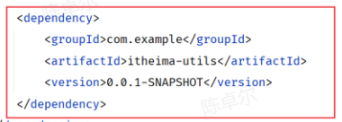

2.在引入的依赖itheima-utils中有一个配置类：

```java
@Component
public class TokenParser {
    public void parse(){
        System.out.println("TokenParser ... parse ...");
    }
}
```


**问题：无法使用TokenParser这个bean**

解决：

- 方案一：@ComponentScan组件扫描
- 方案二：@Import导入

### 1.3.1 方案一：@ComponentScan组件扫描

```java
@SpringBootApplication //具备组件扫描功能，但扫描的是启动类所在包及其子包
@ComponentScan({"com.itheima","com.example"}) //指定要扫描的包，@SpringbootApplication默认扫描的范围不再生效

public class SpringbootWebConfigApplication {
    public static void main(String[] args) {
        SpringApplication.run(SpringbootWebConfigApplication.class, args);
    }
}
```

缺点：

1. 使用繁琐
2. 性能低


### 1.3.2 方案二：@Import导入普通类

@import导入，导入形式主要有以下几种：

- 导入普通类
- 导入配置类
- 导入ImportSelector接口实现类


#### 1）使用@Import导入普通类

```java
@Import(TokenParser.class) //导入的类会被Spring加载到IOC容器中
@SpringBootApplication
public class SpringbootWebConfigApplication {
    public static void main(String[] args) {
        SpringApplication.run(SpringbootWebConfigApplication.class, args);
    }
}
```


#### 2）使用@Import导入配置类

- 配置类

```java
@Configuration
public class HeaderConfig {
    @Bean
    public HeaderParser headerParser(){//在这里配置依赖的bean
        return new HeaderParser();
    }

    @Bean
    public HeaderGenerator headerGenerator(){
        return new HeaderGenerator();
    }
}
```

- 启动类

```java
@Import(HeaderConfig.class) //导入配置类
@SpringBootApplication
public class SpringbootWebConfig2Application {
    public static void main(String[] args) {
        SpringApplication.run(SpringbootWebConfig2Application.class, args);
    }
}
```


#### 3）使用@Import导入ImportSelector接口实现类

- ImportSelector接口实现类

```java
public class MyImportSelector implements ImportSelector {
    public String[] selectImports(AnnotationMetadata importingClassMetadata) {
        //返回值字符串数组（数组中封装了全限定名称的类）
        return new String[]{"com.example.HeaderConfig"};
    }
}
```

- 启动类

```java
@Import(MyImportSelector.class) //导入ImportSelector接口实现类
@SpringBootApplication
public class SpringbootWebConfig2Application {
    public static void main(String[] args) {
        SpringApplication.run(SpringbootWebConfig2Application.class, args);
    }
}
```


#### 4) 使用第三方依赖提供的@EnableXxxx注解

- 第三方依赖中提供的注解

```java
@Retention(RetentionPolicy.RUNTIME)
@Target(ElementType.TYPE)
@Import(MyImportSelector.class)//指定要导入哪些bean对象或配置类
public @interface EnableHeaderConfig { 
}
```

- 在使用时只需在启动类上加上@EnableXxxx注解即可

```java
@EnableHeaderConfig  //使用第三方依赖提供的Enable开头的注解
@SpringBootApplication
public class SpringbootWebConfig2Application {
    public static void main(String[] args) {
        SpringApplication.run(SpringbootWebConfig2Application.class, args);
    }
}
```

# 二、启动类相关（自动配置）

## 2.1 SpringApplication.run()

```java
@SpringBootApplication
public class BqueryMain {
    public static void main(String[] args) {
        SpringApplication.run(BqueryMain.class, args);
    }
}
```

```java
public ConfigurableApplicationContext run(String... args) {
		long startTime = System.nanoTime();
		DefaultBootstrapContext bootstrapContext = createBootstrapContext();
		ConfigurableApplicationContext context = null;
    	// 设置系统属性headless的值
		configureHeadlessProperty();
    	// 创建监听器
		SpringApplicationRunListeners listeners = getRunListeners(args);
    	// 启动监听器
		listeners.starting(bootstrapContext, this.mainApplicationClass);
		try {
            // 配置容器参数，将启动容器时的命令进行封装
			ApplicationArguments applicationArguments = new DefaultApplicationArguments(args);
            // 加载外部配置到环境容器变量（包括配置类要使用的PropertySource以及Profile），并通知监听器容器需要的环境变量配置好了
			ConfigurableEnvironment environment = prepareEnvironment(listeners, bootstrapContext, applicationArguments);
            // 跳过对BeanInfo类的搜索（通常用于首先没有为应用程序中的bean定义此类的情况）
			configureIgnoreBeanInfo(environment);
            // 判断环境变量中是否有打印banner的标识，有则打印
			Banner printedBanner = printBanner(environment);
            /** 1. 创建ApplicationContext容器 **/
			context = createApplicationContext();
            // 统一处理的异常信息
			context.setApplicationStartup(this.applicationStartup);
            // 创建容器的一些操作
			prepareContext(bootstrapContext, context, environment, listeners, applicationArguments, printedBanner);
            /** 2. 刷新ApplicationContext容器 **/
			refreshContext(context);
			afterRefresh(context, applicationArguments);
            // 容器创建结束
			Duration timeTakenToStartup = Duration.ofNanos(System.nanoTime() - startTime);
			if (this.logStartupInfo) {
				new StartupInfoLogger(this.mainApplicationClass).logStarted(getApplicationLog(), timeTakenToStartup);
			}
			listeners.started(context, timeTakenToStartup);
			callRunners(context, applicationArguments);
		}
		catch (Throwable ex) {
			handleRunFailure(context, ex, listeners);
			throw new IllegalStateException(ex);
		}
		try {
			Duration timeTakenToReady = Duration.ofNanos(System.nanoTime() - startTime);
			listeners.ready(context, timeTakenToReady);
		}
		catch (Throwable ex) {
			handleRunFailure(context, ex, null);
			throw new IllegalStateException(ex);
		}
		return context;
	}
```

### 2.1.1 createApplicationContext

```java
protected ConfigurableApplicationContext createApplicationContext() {
    	// 通过applicationContextFactory来决定创建哪种applicationcontext容器
    	// 根据用户是否明确设置了ApplicationContextClass类型以及初始化阶段的判断结果，决定当前Springboot应用创建什么类型的ApplicationContext
		return this.applicationContextFactory.create(this.webApplicationType);
	}
```


### 2.1.2 prepareContext

```java
private void prepareContext(DefaultBootstrapContext bootstrapContext, ConfigurableApplicationContext context,
       ConfigurableEnvironment environment, SpringApplicationRunListeners listeners,
       ApplicationArguments applicationArguments, Banner printedBanner) {
    // 为容器设置环境变量
    context.setEnvironment(environment);
    // 判断是否需要使用自定义的BeanNameGenerator
    postProcessApplicationContext(context);
    // 加载classpath下的所有Initializer，进行遍历，进行初始化
    applyInitializers(context);
    // 所有监听器执行初始化事件
    listeners.contextPrepared(context);
    bootstrapContext.close(context);
    // 从profile中获取启动日志配置
    if (this.logStartupInfo) {
       logStartupInfo(context.getParent() == null);
       logStartupProfileInfo(context);
    }
    // 创建beanFactory
    // Add boot specific singleton beans
    ConfigurableListableBeanFactory beanFactory = context.getBeanFactory();
    beanFactory.registerSingleton("springApplicationArguments", applicationArguments);
    if (printedBanner != null) {
       beanFactory.registerSingleton("springBootBanner", printedBanner);
    }
    if (beanFactory instanceof AbstractAutowireCapableBeanFactory) {
       ((AbstractAutowireCapableBeanFactory) beanFactory).setAllowCircularReferences(this.allowCircularReferences);
       if (beanFactory instanceof DefaultListableBeanFactory) {
          ((DefaultListableBeanFactory) beanFactory)
             .setAllowBeanDefinitionOverriding(this.allowBeanDefinitionOverriding);
       }
    }
    if (this.lazyInitialization) {
       context.addBeanFactoryPostProcessor(new LazyInitializationBeanFactoryPostProcessor());
    }
    context.addBeanFactoryPostProcessor(new PropertySourceOrderingBeanFactoryPostProcessor(context));
    /** 这里加载配置，注意sources加载出来就是XxxxApplication这个启动类，从这里开始加载注解了 **/
    // Load the sources
    Set<Object> sources = getAllSources();
    Assert.notEmpty(sources, "Sources must not be empty");
    // 加载启动类
    load(context, sources.toArray(new Object[0]));
    // 所有监听器开始加载到ApplicationContext容器中
    listeners.contextLoaded(context);
}
```

在SpringApplication的run()方法中，通过调用自己的`prepareContext()`方法，在`prepareContext()`方法中又调用`getAllSources()`方法，在这个方法中，获取到的source就是启动类。然后通过`load()`方法把启动类加载到容器中。后面再通过`listeners.contextLoaded(context)`将所有监听器加载到ApplicationContext容器中。


### 2.1.3 refreshContext

上面代码加载启动类到容器后，通过`refreshContext()`刷新容器，将启动类上的**注解配置**刷新到当前运行的容器环境中。

```java
private void refreshContext(ConfigurableApplicationContext context) {
    if (this.registerShutdownHook) {
       shutdownHook.registerApplicationContext(context);
    }
    refresh(context);
}
```


## 2.2 启动类上的注解

启动类上初始只有一个注解`@SpringBootApplication`

```java
@Target(ElementType.TYPE)
@Retention(RetentionPolicy.RUNTIME)
@Documented
@Inherited
@SpringBootConfiguration // 里面就是一个@Configuration，说明启动类就是一个配置类
@EnableAutoConfiguration // 见下详细分析
// 默认扫描当前包以及子包下面的spring的注解
@ComponentScan(excludeFilters = { @Filter(type = FilterType.CUSTOM, classes = TypeExcludeFilter.class),
       @Filter(type = FilterType.CUSTOM, classes = AutoConfigurationExcludeFilter.class) }) 
public @interface SpringBootApplication {
	// ...
}
```


### 2.2.1 @EnableAutoConfiguration

```java
@Target(ElementType.TYPE)
@Retention(RetentionPolicy.RUNTIME)
@Documented
@Inherited
@AutoConfigurationPackage // 自动配置包
@Import(AutoConfigurationImportSelector.class) // 自动引入组件
public @interface EnableAutoConfiguration {
	// ...
}
```


#### 1）@AutoConfigurationPackage

```
@Target(ElementType.TYPE)
@Retention(RetentionPolicy.RUNTIME)
@Documented
@Inherited
@Import(AutoConfigurationPackages.Registrar.class)
public @interface AutoConfigurationPackage {
	// ...
}
```

AutoConfigurationPackages.Registrar.class:

```java
static class Registrar implements ImportBeanDefinitionRegistrar, DeterminableImports {

    @Override
    public void registerBeanDefinitions(AnnotationMetadata metadata, BeanDefinitionRegistry registry) {
        // 用来自动注册一些组件中的配置，例如JPA的@Entity这个注解。这里就是会自动扫描这类注解的功能
       register(registry, new PackageImports(metadata).getPackageNames().toArray(new String[0]));
    }

    @Override
    public Set<Object> determineImports(AnnotationMetadata metadata) {
       return Collections.singleton(new PackageImports(metadata));
    }

}
```


#### 2）@Import(AutoConfigurationImportSelector.class)

- AutoConfigurationImportSelector类

`AutoConfigurationImportSelector`类是`ImportSelector`接口的实现类。(DeferredImportSelector接口实现了`ImportSelector`接口)

```java
public class AutoConfigurationImportSelector implements DeferredImportSelector, BeanClassLoaderAware,
       ResourceLoaderAware, BeanFactoryAware, EnvironmentAware, Ordered {
	// ...
           
    @Override
	public String[] selectImports(AnnotationMetadata annotationMetadata) {
		if (!isEnabled(annotationMetadata)) {
			return NO_IMPORTS;
		}
        // 重点是getAutoConfigurationEntry方法
		AutoConfigurationEntry autoConfigurationEntry = getAutoConfigurationEntry(annotationMetadata);
		return StringUtils.toStringArray(autoConfigurationEntry.getConfigurations());
	}
           
    // ...
}
```


- `getAutoConfigurationEntry()`方法

```java
protected AutoConfigurationEntry getAutoConfigurationEntry(AnnotationMetadata annotationMetadata) {
    if (!isEnabled(annotationMetadata)) {
       return EMPTY_ENTRY;
    }
    AnnotationAttributes attributes = getAttributes(annotationMetadata);
    // 重点：getCandidateConfigurations方法
    List<String> configurations = getCandidateConfigurations(annotationMetadata, attributes);
    configurations = removeDuplicates(configurations);
    Set<String> exclusions = getExclusions(annotationMetadata, attributes);
    checkExcludedClasses(configurations, exclusions);
    configurations.removeAll(exclusions);
    configurations = getConfigurationClassFilter().filter(configurations);
    fireAutoConfigurationImportEvents(configurations, exclusions);
    return new AutoConfigurationEntry(configurations, exclusions);
}
```

- `getCandidateConfigurations()`方法

```java
protected List<String> getCandidateConfigurations(AnnotationMetadata metadata, AnnotationAttributes attributes) {
    List<String> configurations = new ArrayList<>(
        // 关键：loadFactoryNames
        SpringFactoriesLoader.loadFactoryNames(getSpringFactoriesLoaderFactoryClass(), getBeanClassLoader()));
    ImportCandidates.load(AutoConfiguration.class, getBeanClassLoader()).forEach(configurations::add);
    Assert.notEmpty(configurations,
          	"No auto configuration classes found in META-INF/spring.factories "
                    + "nor in META-INF/spring/org.springframework.boot."
                    + "autoconfigure.AutoConfiguration.imports."
                    + " If you are using a custom packaging, make sure that file is correct.");
    return configurations;
}
```


- `loadFactoryNames()`方法

```java
public static List<String> loadFactoryNames(Class<?> factoryType, @Nullable ClassLoader classLoader) {
    ClassLoader classLoaderToUse = classLoader;
    if (classLoaderToUse == null) {
       classLoaderToUse = SpringFactoriesLoader.class.getClassLoader();
    }
    String factoryTypeName = factoryType.getName();
    // 关键：loadSpringFactories
    return loadSpringFactories(classLoaderToUse).getOrDefault(factoryTypeName, Collections.emptyList());
}
```


- `loadSpringFactories()`方法

```java
private static Map<String, List<String>> loadSpringFactories(ClassLoader classLoader) {
    Map<String, List<String>> result = cache.get(classLoader);
    if (result != null) {
       return result;
    }

    result = new HashMap<>();
    try {
        // 启动的时候会扫描所有jar包下META-INF/spring.factories这个文件
       Enumeration<URL> urls = classLoader.getResources(FACTORIES_RESOURCE_LOCATION);
       while (urls.hasMoreElements()) {
          URL url = urls.nextElement();
          UrlResource resource = new UrlResource(url);
          // 将这些扫描的文件转成Properties对象
          Properties properties = PropertiesLoaderUtils.loadProperties(resource);
          for (Map.Entry<?, ?> entry : properties.entrySet()) {
             String factoryTypeName = ((String) entry.getKey()).trim();
             String[] factoryImplementationNames =
                   StringUtils.commaDelimitedListToStringArray((String) entry.getValue());
             for (String factoryImplementationName : factoryImplementationNames) {
                result.computeIfAbsent(factoryTypeName, key -> new ArrayList<>())
                      .add(factoryImplementationName.trim());
             }
          }
       }

       // Replace all lists with unmodifiable lists containing unique elements
       result.replaceAll((factoryType, implementations) -> implementations.stream().distinct()
             .collect(Collectors.collectingAndThen(Collectors.toList(), Collections::unmodifiableList)));
        // 将加载到的Properties对象放入到缓存中
       cache.put(classLoader, result);
    }
    catch (IOException ex) {
       throw new IllegalArgumentException("Unable to load factories from location [" +
             FACTORIES_RESOURCE_LOCATION + "]", ex);
    }
    return result;
}
```

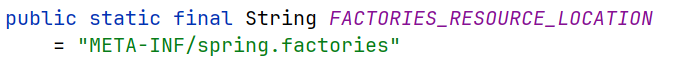


- META-INF/spring.factories（在外部库里）

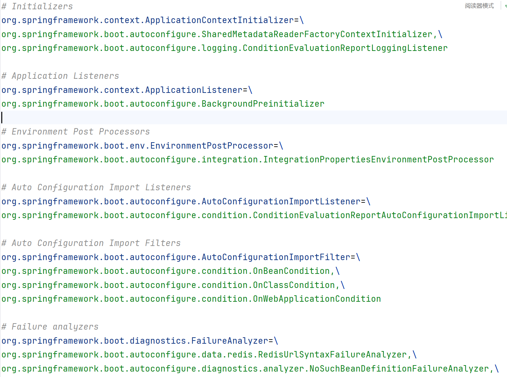

- META-INF/spring/org.springframework.boot

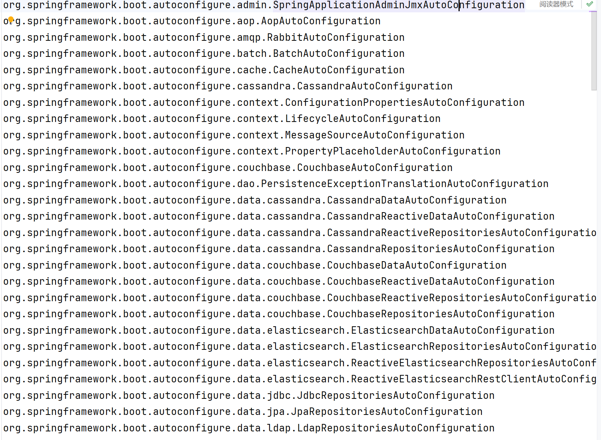

### 2.2.2 自动配置小结

自动配置的核心就在@SpringBootApplication注解上，SpringBootApplication这个注解底层包含了3个注解，分别是：

- @SpringBootConfiguration
- @ComponentScan
- @EnableAutoConfiguration

@EnableAutoConfiguration这个注解才是自动配置的核心。

- 它封装了一个@Import注解，Import注解里面指定了一个ImportSelector接口的实现类。
- 在这个实现类中，重写了ImportSelector接口中的selectImports()方法。
- 而selectImports()方法中会去读取两份配置文件，并将配置文件中定义的配置类做为selectImports()方法的返回值返回，返回值代表的就是需要将哪些类交给Spring的IOC容器进行管理。
- 那么所有自动配置类的中声明的bean都会加载到Spring的IOC容器中吗? 其实并不会，因为这些配置类中在声明bean时，通常都会添加@Conditional开头的注解，这个注解就是进行条件装配。而Spring会根据Conditional注解有选择性的进行bean的创建。
- @Enable 开头的注解底层，它就封装了一个注解 import 注解，它里面指定了一个类，是 ImportSelector 接口的实现类。在实现类当中，我们需要去实现 ImportSelector  接口当中的一个方法 selectImports 这个方法。这个方法的返回值代表的就是我需要将哪些类交给 spring 的 IOC容器进行管理。
- 此时它会去读取两份配置文件，一份儿是 spring.factories，另外一份儿是 autoConfiguration.imports。而在  autoConfiguration.imports 这份儿文件当中，它就会去配置大量的自动配置的类。
- 而前面我们也提到过这些所有的自动配置类当中，所有的 bean都会加载到 spring 的 IOC 容器当中吗？其实并不会，因为这些配置类当中，在声明 bean 的时候，通常会加上这么一类@Conditional 开头的注解。这个注解就是进行条件装配。所以SpringBoot非常的智能，它会根据 @Conditional 注解来进行条件装配。只有条件成立，它才会声明这个bean，才会将这个 bean 交给 IOC 容器管理。


# 三、依赖注入


## 3.1 Autowired用法

### 1）属性注入

```Java
@RestController
public class UserController {

    //方式一: 属性注入
    @Autowired
    private UserService userService;
    
  }
```

- 优点：代码简洁、方便快速开发
- 缺点：隐藏了类之间的依赖关系、可能会破坏类的封装性


### 2）构造函数注入（官方推荐）

```Java
@RestController
public class UserController {

    //方式二: 构造器注入（推荐加final）
    private final UserService userService;
    
    @Autowired //如果当前类中只存在一个构造函数, @Autowired可以省略
    public UserController(UserService userService) {// 好像spring会自动注入入参
        this.userService = userService;
    }
    
 }   
```

- 优点：能清晰地看到类的依赖关系，提高了代码的安全性
- 缺点：代码繁琐，如果构造参数过多，可能导致构造函数臃肿
- 注意：如果只有一个构造函数，@Autowired注解可以省略。


### 3）setter注入

```Java
/**
 * 用户信息Controller
 */
@RestController
public class UserController {
    
    //方式三: setter注入
    private UserService userService;
    
    @Autowired
    public void setUserService(UserService userService) {
        this.userService = userService;
    }
    
}    
```

- 优点：保持了类的封装性，依赖关系更清晰
- 缺点：需要额外编写setter方法，增加了代码量


## 3.2 存在多个相同类型的bean对象

### 方案一：使用@Primary注解

```Java
@Primary //确定默认的实现
@Service
public class UserServiceImpl implements UserService {
}
```


### 方案二：使用@Qualifier注解

```Java
@RestController
public class UserController {

    @Qualifier("userServiceImpl") //指定注入的bean的名称，必须配合@Autowired使用
    @Autowired
    private UserService userService;
```


### 方案三：使用@Resource注解

```Java
@RestController
public class UserController {
        
    @Resource(name = "userServiceImpl")//通过name属性指定要注入的bean的名称
    private UserService userService;
```


### @Autowired和Resource的区别

- @Autowired是spring框架提供的注解，而@Resource是JDK提供的注解
- @Autowired默认是按照类型注入，而@Resource是按照名称注入


# 四、常见状态码

| 状态码 | 英文描述                        | 解释                                                         |
| ------ | ------------------------------- | ------------------------------------------------------------ |
| 200    | OK                              | 客户端请求成功，即处理成功，这是我们最想看到的状态码         |
| 302    | Found                           | 指示所请求的资源已移动到由Location响应头给定的 URL，浏览器会自动重新访问到这个页面 |
| 304    | Not Modified                    | 告诉客户端，你请求的资源至上次取得后，服务端并未更改，你直接用你本地缓存吧。隐式重定向 |
| 400    | Bad Request                     | 客户端请求有语法错误，不能被服务器所理解                     |
| 403    | Forbidden                       | 服务器收到请求，但是拒绝提供服务，比如：没有权限访问相关资源 |
| 404    | Not Found                       | 请求资源不存在，一般是URL输入有误，或者网站资源被删除了      |
| 405    | Method Not Allowed              | 请求方式有误，比如应该用GET请求方式的资源，用了POST          |
| 428    | Precondition Required           | 服务器要求有条件的请求，告诉客户端要想访问该资源，必须携带特定的请求头 |
| 429    | Too Many Requests               | 指示用户在给定时间内发送了太多请求（“限速”），配合 Retry-After(多长时间后可以请求)响应头一起使用 |
| 431    | Request Header Fields Too Large | 请求头太大，服务器不愿意处理请求，因为它的头部字段太大。请求可以在减少请求头域的大小后重新提交。 |
| 500    | Internal Server Error           | 服务器发生不可预期的错误。服务器出异常了，赶紧看日志去吧     |
| 503    | Service Unavailable             | 服务器尚未准备好处理请求，服务器刚刚启动，还未初始化好       |


# 五、读取application.yml中参数的三种方式

## 5.1 @Value("${}")注解

使用频率高，但一次只能接收一个字段


## 5.2 Environment对象中获取

使用频率低，逐个获取


## 5.3 @ConfigurationProperties("")注解

一次可以接收多个字段的值，将多个字段映射成一个javaBean

```java
@Component
@ConfigurationProperties(prefix = "person") // 需要配合@Component或其他Spring管理注解使用
@Data // Lombok注解，自动生成getter/setter等
public class PersonIOC {
    private String name;
    private int age;
    private int gender;
    private String address;
}
```


## 测试用例

### 1. pom

```objective-c
<parent>
        <artifactId>spring-boot-starter-parent</artifactId>
        <groupId>org.springframework.boot</groupId>
        <version>2.4.11</version>
</parent>
<dependencies>
        <dependency>
            <groupId>org.projectlombok</groupId>
            <artifactId>lombok</artifactId>
            <version>1.18.22</version>
        </dependency>
        <dependency>
            <groupId>org.springframework</groupId>
            <artifactId>spring-context</artifactId>
        </dependency>
        <dependency>
            <groupId>org.springframework.boot</groupId>
            <artifactId>spring-boot-starter-web</artifactId>
        </dependency>
        <dependency>
            <groupId>org.springframework.boot</groupId>
            <artifactId>spring-boot-starter-test</artifactId>
        </dependency>
        <dependency>
            <groupId>junit</groupId>
            <artifactId>junit</artifactId>
            <scope>test</scope>
        </dependency>
    </dependencies>

```

### 2. application.yml

```yaml
spring:
  application:
    name: java8-demo

thread:
  pool:
    core-pool-size: 10

person:
  name: zhangsan
  age: 18
  gender: -1
  address: XXX看守所
```


### 3. 测试类

```java
@RunWith(SpringRunner.class)
@SpringBootTest(classes = App.class)
public class AppTest {
    @Autowired
    private Environment environment;//spring-core
    
    @Value("${spring.application.name}")
    private String applicationName;

    @Value("${spring.application.name}")//spring-beans
    private static String name;// 不能用staitc

    @Resource
    private PersonIOC personIOC;

    @Test
    public void testPropertiesIOC() {
        System.out.println("core-pool-size:" + environment.getProperty("thread.pool.core-pool-size"));
        System.out.println("core-pool-size:" + environment.getProperty("thread.pool.corePoolSize"));//格式不对接收不到
        System.out.println("=====");
        System.out.println("applicationName:" + applicationName);
        System.out.println("applicationName:" + name);//使用static修饰接收不到
        System.out.println("====");
        System.out.println(personIOC);
    }
}
```


### 4. 运行结果

```
core-pool-size:10
core-pool-size:null
=====
applicationName:java8-demo
applicationName:null
====
PersonIOC(name=zhangsan, age=18, gender=-1, address=XXX看守所)
```


# 六、SecurityUtils

java系统安全工具类


# 七、servlet

## 7.1 Servlet是什么？

Java Servlet 是运行在 Web 服务器或应用服务器上的程序，它是作为来自 Web 浏览器或其他 HTTP 客户端的请求和 HTTP 服务器上的数据库或应用程序之间的中间层。

使用 Servlet，您可以收集来自网页表单的用户输入，呈现来自数据库或者其他源的记录，还可以动态创建网页。

Java Servlet 通常情况下与使用 CGI（Common Gateway Interface，公共网关接口）实现的程序可以达到异曲同工的效果。但是相比于 CGI，Servlet 有以下几点优势：

- 性能明显更好。
- Servlet 在 Web 服务器的地址空间内执行。这样它就没有必要再创建一个单独的进程来处理每个客户端请求。
- Servlet 是独立于平台的，因为它们是用 Java 编写的。
- 服务器上的 Java 安全管理器执行了一系列限制，以保护服务器计算机上的资源。因此，Servlet 是可信的。
- Java 类库的全部功能对 Servlet 来说都是可用的。它可以通过 sockets 和 RMI 机制与 applets、数据库或其他软件进行交互。

## 7.2 Servlet架构


## 7.3 Servlet任务

Servlet 执行以下主要任务：

- 读取客户端（浏览器）发送的显式的数据。这包括网页上的 HTML 表单，或者也可以是来自 applet 或自定义的 HTTP 客户端程序的表单。
- 读取客户端（浏览器）发送的隐式的 HTTP 请求数据。这包括 cookies、媒体类型和浏览器能理解的压缩格式等等。
- 处理数据并生成结果。这个过程可能需要访问数据库，执行 RMI 或 CORBA 调用，调用 Web 服务，或者直接计算得出对应的响应。
- 发送显式的数据（即文档）到客户端（浏览器）。该文档的格式可以是多种多样的，包括文本文件（HTML 或 XML）、二进制文件（GIF 图像）、Excel 等。
- 发送隐式的 HTTP 响应到客户端（浏览器）。这包括告诉浏览器或其他客户端被返回的文档类型（例如 HTML），设置 cookies 和缓存参数，以及其他类似的任务。


## 7.4 DispatcherServlet

- `org.springframework.web.servlet.DispatcherServlet` 是一个 `Servlet`，它接收所有的 `HTTP` 请求，并根据请求的信息将其分发给相应的处理器（`Handler`）进行处理。
- 它是 `Spring MVC` 架构模式中的关键部分，将请求处理逻辑与实际的业务**逻辑解耦**，使得**代码结构**更加清晰和易于维护。

> https://github.com/spring-projects/spring-framework/blob/v5.2.15.RELEASE/spring-webmvc/src/main/java/org/springframework/web/servlet/DispatcherServlet.java

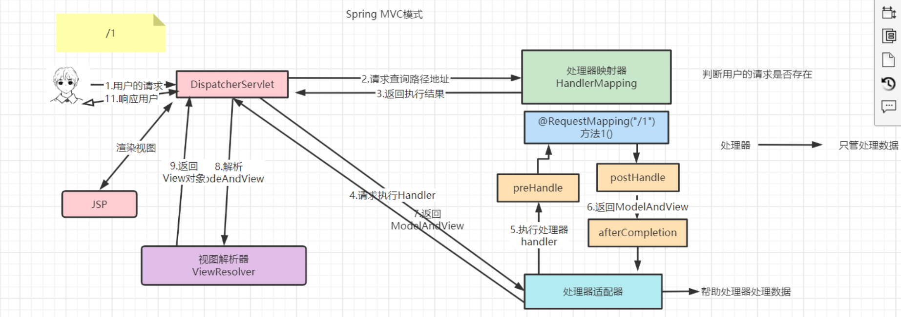

### 7.4.2 DispatcherServlet的初始化

#### Step1 Servlet 容器启动

- 当 Web 应用启动时，`Servlet` 容器（如 Tomcat）会加载和初始化所有配置的 `Servlet`。
- 对于 `DispatcherServlet`，它的**初始化过程**在这个阶段开始。

#### Step2 读取配置

##### Step2.1 Servlet 初始化参数

- `DispatcherServlet` 可以从 `web.xm`l（**传统方式**）或者基于 `Java` 的配置（如使用`@WebServlet`注解）中获取初始化参数。

> 这些参数可以指定配置文件的位置、Spring 应用上下文的名称等信息。
> 例如，在传统的 web.xml 配置中，可以如下设置：

```xml
<servlet>
    <servlet-name>dispatcher</servlet-name>
    <servlet-class>org.springframework.web.servlet.DispatcherServlet</servlet-class>
    <init-param>
        <param-name>contextConfigLocation</param-name>
        <param-value>/WEB-INF/springmvc-config.xml</param-value>
    </init-param>
    <load-on-startup>1</load-on-startup>
</servlet>
```

- 这里指定了`contextConfigLocation`参数，告诉 `DispatcherServlet` 去哪里寻找 `Spring MVC` 的配置文件。

> `load-on-startup`参数的值大于 `0`，表示在容器启动时就初始化该 `Servlet`。

##### Step2.2 加载 Spring 配置文件

- 根据配置的`contextConfigLocation`参数，`DispatcherServlet` 会加载 `Spring` 的配置文件。

> 在这个配置文件中，可以定义各种 Spring 组件，如视图解析器、处理器映射器、处理器适配器等。
> 这些组件对于后续的请求处理至关重要。

#### Step3 创建 Web 应用上下文

##### 根上下文与子上下文

- `DispatcherServlet` 会创建自己的 `Web` 应用上下文（通常是`WebApplicationContext`类型）。

> 这个**上下文**是整个 `Spring MVC` **应用**的核心。
> 在一些复杂的应用中，可能还存在**根上下文**（由`ContextLoaderListener`创建），而 `DispatcherServlet` 的上下文是**根上下文**的子上下文。

##### 组件扫描与初始化

- 在创建 `Web` **应用上下文**的过程中，会根据**配置**进行**组件扫描**。
- 它会查找并实例化所有配置的 Spring 组件，包括**控制器**（Controller）、**服务**（Service）等相关类。
- 同时，会初始化在配置文件中定义的各种 bean，如视图解析器（ViewResolver）会被创建并配置好相应的视图解析策略。

#### 深入分析：Spring Web DispatcherServlet 注册 Serlvet 的过程

##### Servlet 的注册： 传统 Servlet vs. Servlet 3

- 传统的`Servlet`注册是配置在`/WEB-INF/web.xml`下，在容器启动的时候注册`Servlet`。
- `Servlet 3`规范为我们又提供了一种更加方便的注册方法————容器启动的时候扫描jar包，找到jar包下一个为如下文件路径的文件。

```properties
META-INF/services/javax.servlet.ServletContainerInitializer
```

该文件的内容必须是一个实现了`javax.servlet.ServletContainerInitializer`接口的实现类，该接口下有一个方法会自动被调用。

```java
public void onStartup(@Nullable Set<Class<?>> webAppInitializerClasses, ServletContext servletContext)
			throws ServletException 
```

其中第一个参数是一个`Set`，当该实现类上有注解`@HandlesTypes`，注解的`value`属性是一个`Class[]`，这个数组及其子类(或实现类)会被注入到`webAppInitializerClasses`参数中。

#### Spring Web DispatcherServlet 注册过程

下面我们看看`Spring`是如何利用`Servlet 3`这种方式完成`DispatcherServlet`的注册。

##### ServletContainerInitializer

- 在`spring-web`模块下，`META-INF/services/javax.servlet.ServletContainerInitializer`文件中的内容为:

```properties
org.springframework.web.SpringServletContainerInitializer
```

##### SpringServletContainerInitializer

- 该类实现了`ServletContainerInitializer`接口，并标有`@HandlesTypes`注解。

```java
//
// Source code recreated from a .class file by IntelliJ IDEA
// (powered by Fernflower decompiler)
//
 
package org.springframework.web;
 
import java.lang.reflect.Modifier;
import java.util.Iterator;
import java.util.LinkedList;
import java.util.List;
import java.util.Set;
import javax.servlet.ServletContainerInitializer;
import javax.servlet.ServletContext;
import javax.servlet.ServletException;
import javax.servlet.annotation.HandlesTypes;
import org.springframework.core.annotation.AnnotationAwareOrderComparator;
import org.springframework.lang.Nullable;
import org.springframework.util.ReflectionUtils;
 
@HandlesTypes({WebApplicationInitializer.class}) // 关键注解 : HandlesTypes
public class SpringServletContainerInitializer implements ServletContainerInitializer { // 关键接口 ： 实现了 Servlet 3 规范的 ServletContainerInitializer 接口
    public SpringServletContainerInitializer() {
    }
 
    //关键方法: onStartup 
    public void onStartup(@Nullable Set<Class<?>> webAppInitializerClasses, ServletContext servletContext) throws ServletException {
        List<WebApplicationInitializer> initializers = new LinkedList();
        Iterator var4;
        if (webAppInitializerClasses != null) {
            var4 = webAppInitializerClasses.iterator();
 
            while(var4.hasNext()) {
                Class<?> waiClass = (Class)var4.next();
                if (!waiClass.isInterface() && !Modifier.isAbstract(waiClass.getModifiers()) && WebApplicationInitializer.class.isAssignableFrom(waiClass)) {
                    try {
                        initializers.add((WebApplicationInitializer)ReflectionUtils.accessibleConstructor(waiClass, new Class[0]).newInstance());
                    } catch (Throwable var7) {
                        throw new ServletException("Failed to instantiate WebApplicationInitializer class", var7);
                    }
                }
            }
        }
 
        if (initializers.isEmpty()) {
            servletContext.log("No Spring WebApplicationInitializer types detected on classpath");
        } else {
            servletContext.log(initializers.size() + " Spring WebApplicationInitializers detected on classpath");
            AnnotationAwareOrderComparator.sort(initializers);
            var4 = initializers.iterator();
 
            while(var4.hasNext()) {
                WebApplicationInitializer initializer = (WebApplicationInitializer)var4.next();
                initializer.onStartup(servletContext);
            }
 
        }
    }
}
```

> `onStartup`方法：
>
> - 会将`WebApplicationInitializer`的实现类实例放到`List`中排序，依次调用`onStartup()`方法。
> - `Spring`为我们提供了一个`WebApplicationInitializer`的抽象实现类`AbstractAnnotationConfigDispatcherServletInitializer`，通常我们只需要继承此类来完成`DispatcherServlet`与`spring context`的注册。

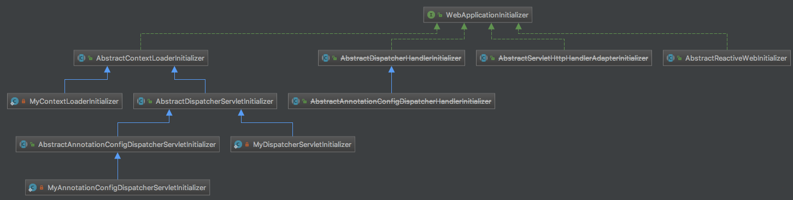

##### AbstractDispatcherServletInitializer#onStartup

`AbstractAnnotationConfigDispatcherServletInitializer`的父类`AbstractDispatcherServletInitializer`覆盖了`onStartup()`方法：

```java
//org.springframework.web.servlet.support.AbstractDispatcherServletInitializer
 
public void onStartup(ServletContext servletContext) throws ServletException {
   super.onStartup(servletContext);
   registerDispatcherServlet(servletContext);
}
```

首先，调用父类的方法完成`root WebApplicationContext`的初始化；
然后，调用`registerDispatcherServlet()`方法完成`DispatcherServlet`的注册。

##### AbstractDispatcherServletInitializer#registerDispatcherServlet

```java
//org.springframework.web.servlet.support.AbstractDispatcherServletInitializer
 
protected void registerDispatcherServlet(javax.servlet.ServletContext servletContext) {
   String servletName = getServletName();
   Assert.hasLength(servletName, "getServletName() must not return empty or null");
   WebApplicationContext servletAppContext = createServletApplicationContext();
   Assert.notNull(servletAppContext,
         "createServletApplicationContext() did not return an application " +
         "context for servlet [" + servletName + "]");
   FrameworkServlet dispatcherServlet = createDispatcherServlet(servletAppContext);
   dispatcherServlet.setContextInitializers(getServletApplicationContextInitializers());
   ServletRegistration.Dynamic registration = servletContext.addServlet(servletName, dispatcherServlet);
   Assert.notNull(registration,
         "Failed to register servlet with name '" + servletName + "'." +
         "Check if there is another servlet registered under the same name.");
   registration.setLoadOnStartup(1);
   registration.addMapping(getServletMappings());
   registration.setAsyncSupported(isAsyncSupported());
   Filter[] filters = getServletFilters();
   if (!ObjectUtils.isEmpty(filters)) {
      for (Filter filter : filters) {
         registerServletFilter(servletContext, filter);
      }
   }
   customizeRegistration(registration);
}
```

暂时只关注`Servlet`的注册，`Spring`容器相关的以后介绍，`createDispatcherServlet()`方法创建了一个`DispatcherServlet`实例，然后通过`servletContext.addServlet()`方法完成`DispatcherServlet`的注册。

```java
protected FrameworkServlet createDispatcherServlet(WebApplicationContext servletAppContext) {
   return new DispatcherServlet(servletAppContext);
}
```

以上就是`DispatcherServlet`的注册过程。


# 3 DispatcherServlet 的工作流程

## Step1 接收请求

当一个 HTTP 请求到达 Servlet 容器时，容器会根据请求的 URL 将其路由到相应的 Servlet。对于匹配 DispatcherServlet 的请求（通常是通过 Servlet 映射配置），DispatcherServlet 开始处理这个请求。

## Step2 请求处理准备

### 请求的解析与封装

- DispatcherServlet 首先会对请求进行解析，将 HTTP 请求中的信息（如请求方法、请求参数、请求头、请求路径等）封装到HttpServletRequest对象中。这个对象将在整个请求处理过程中传递和使用。

### 获取处理器映射器（HandlerMapping）

- DispatcherServlet 会从其初始化创建的 Web 应用上下文中获取处理器映射器。处理器映射器的作用是根据请求的信息（主要是 URL）找到处理该请求的处理器（Handler）。Spring 提供了多种类型的处理器映射器，如RequestMappingHandlerMapping等，它们通过不同的策略来确定处理器。

## Step3 查找处理器

### 根据请求查找处理器

- 处理器映射器会根据请求的 URL、请求方法等信息在已经注册的处理器中查找匹配的处理器。例如，如果使用@RequestMapping注解来定义控制器方法的映射，处理器映射器会根据请求的 URL 模式和请求方法（如 GET、POST 等）来确定对应的@RequestMapping注解标注的方法。

### 返回处理器执行链（HandlerExecutionChain）

- 一旦找到匹配的处理器，处理器映射器会返回一个包含处理器和相关拦截器（Interceptor）的处理器执行链。拦截器可以在处理器执行前后执行一些额外的逻辑，如权限验证、日志记录等。

## Step4 获取处理器适配器（HandlerAdapter）

### 选择合适的适配器

- DispatcherServlet 根据处理器的类型从 Web 应用上下文中获取合适的处理器适配器。不同类型的处理器（如基于方法的处理器、基于控制器类的处理器等）需要不同的适配器来执行。

> 例如，对于使用@RequestMapping注解的处理器方法，会使用RequestMappingHandlerAdapter。

### 调用处理器适配器执行处理器

- 处理器适配器负责调用处理器的具体方法，并将请求相关的参数传递给处理器。

> 在执行过程中，处理器（通常是控制器方法）会执行业务逻辑，可能涉及到调用服务层、数据访问层等，最终返回一个模型和视图（ModelAndView）对象或者其他类型的结果（如直接返回数据等情况）。

## Step5 视图解析

### 获取视图解析器（ViewResolver）

- 如果处理器返回了一个ModelAndView对象，DispatcherServlet 会从 Web 应用上下文中获取视图解析器。视图解析器根据ModelAndView中指定的视图名称和其他相关信息来确定实际的视图实现。

### 解析视图

- 不同的视图解析器有不同的解析策略。例如，InternalResourceViewResolver可以将视图名称解析为 JSP 文件的路径。视图解析器会返回一个View对象，这个对象负责渲染最终的视图。

## Step6 视图渲染与响应返回

### 渲染视图

- View对象会根据模型数据（如果有）和请求信息对视图进行渲染。如果是 JSP 视图，会将模型数据填充到 JSP 页面中，然后生成最终的 HTML 内容。

### 返回响应

- 渲染后的视图内容会被封装到HttpServletResponse对象中，并通过 Servlet 容器返回给客户端，完成整个请求处理流程。

## 小结

- 总之，DispatcherServlet 在 Spring MVC 应用中起着至关重要的作用，它的初始化过程构建了整个请求处理的基础架构，而其工作流程则有条不紊地处理每个请求，将用户的请求转化为最终的响应，为开发高效、可维护的 Web 应用提供了有力的支持。


# 八、视图

视图是对数据的逻辑上的组织和展示方式。它提供了一种虚拟的表结构，该结构是基于一个或多个表的查询结果而创建的。视图本身并不实际存储数据，而是通过查询操作来获取所需的数据。


# 九、通过Jeecg导出excel表格

ModelAndView是给浏览器下载的

workbook适合作为附件发送邮件

## 9.0 如何使用

使用注解@ExcelProperty

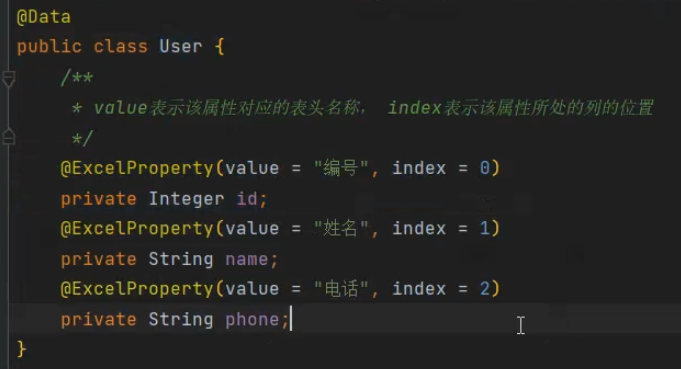


## 9.1 一对一

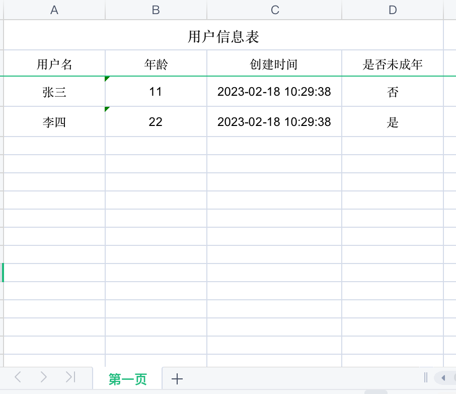

```java
import org.jeecgframework.poi.excel.annotation.Excel;
 
@Data
@NoArgsConstructor
@AllArgsConstructor
public class User  implements Serializable {
    @Excel(name = "用户名", width = 15) //width列宽
    private String userName ;
 
    @Excel(name = "年龄", width = 15)
    private int age ;
 
    @Excel(name = "创建时间", width = 20, format = "yyyy-MM-dd HH:mm:ss") //格式化日期
    private Date createTime;
 
    @Excel(name = "是否未成年", width = 15,dicCode = "yn") //获取字典名称
    private int isUnderAge;
}
```


```java
import org.jeecgframework.poi.excel.view.JeecgEntityExcelView;
 
  @RequestMapping(value = "/export")
public ModelAndView export(HttpServletRequest request) {
          //用户信息
          List<User> userList =  new ArrayList<>();
          userList.add(new User("张三",11,new Date(),0));
          userList.add(new User("李四",22,new Date(),1));
         // 导出Excel
         ModelAndView mv = new ModelAndView(new JeecgEntityExcelView());
         mv.addObject(NormalExcelConstants.FILE_NAME, "用户信息表.xlsx");  //文件名称，但是前端会重新命名
         mv.addObject(NormalExcelConstants.CLASS, User.class); //实体类型
         mv.addObject(NormalExcelConstants.PARAMS, new ExportParams("用户信息表", "第一页")); //标题，sheet名称
         mv.addObject(NormalExcelConstants.DATA_LIST, userList); //list数据
 
         return mv;
     }
```

workbook也可以

```java
import org.jeecgframework.poi.excel.ExcelExportUtil;
import org.jeecgframework.poi.excel.entity.ExportParams;
import org.apache.poi.ss.usermodel.Workbook;
 
 
public void getFile{
      ExportParams exportParams = new ExportParams("用户信息表", "第一页");
      Workbook workbook  = ExcelExportUtil.exportExcel(exportParams,User.class,userList);
 
     FileOutputStream fileOutputStream =  new FileOutputStream("D://TMP/用户信息.xlsx");
     workbook.write(fileOutputStream);
     File excelTmpfile = new File("D://TMP/用户信息.xlsx");
}
```


## 9.2 一对多

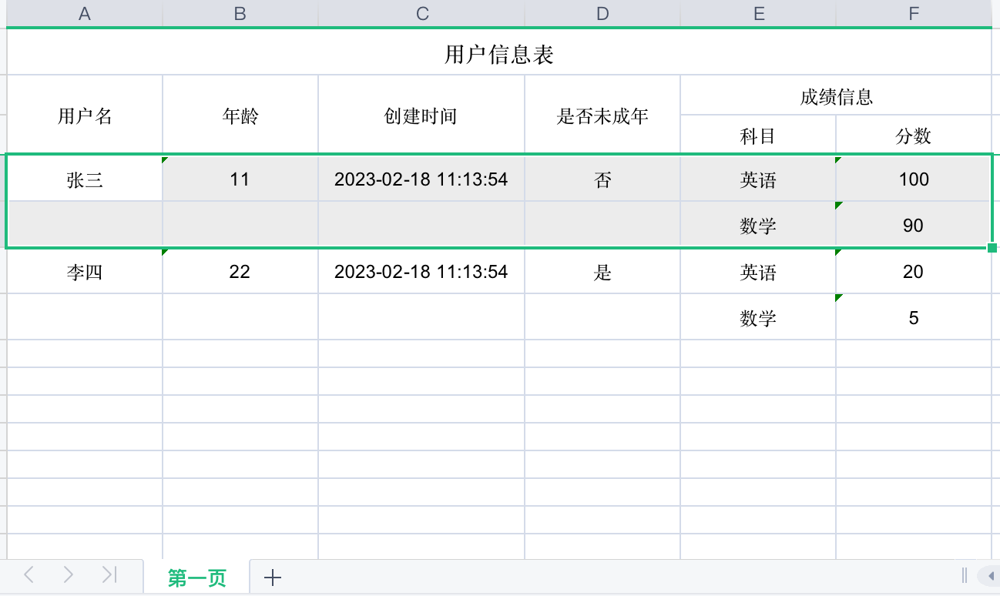

```java
import org.jeecgframework.poi.excel.annotation.Excel;
import org.jeecgframework.poi.excel.annotation.ExcelCollection;
 
@Data
@NoArgsConstructor
@AllArgsConstructor
public class User  implements Serializable {
    @Excel(name = "用户名", width = 15)
    private String userName ;
 
    @Excel(name = "年龄", width = 15)
    private int age ;
 
    @Excel(name = "创建时间", width = 20, format = "yyyy-MM-dd HH:mm:ss")
    private Date createTime;
 
    @Excel(name = "是否未成年", width = 15,dicCode = "yn")
    private int isUnderAge;
 
    @ExcelCollection(name = "成绩信息")
    private List<SubjectScore> list; //加了这个。。。。。。。。。。。。。。。。。。。。。。。。。。
}
```

```java
@Data
@NoArgsConstructor
@AllArgsConstructor
public class SubjectScore {
    @Excel(name = "科目", width = 15)
    private String subjectName ;
    @Excel(name = "分数", width = 15)
    private int score ;
}
```


```java
     @RequestMapping(value = "/exporttXls")
public ModelAndView exporttXls(HttpServletRequest request) {
          List<User> userList =  new ArrayList<>();
          List<SubjectScore> scoreList1  = new  ArrayList<>();
          scoreList1.add(new SubjectScore("英语",100));
          scoreList1.add(new SubjectScore("数学",90));
          userList.add(new User("张三",11,new Date(),0,scoreList1));
          
         List<SubjectScore> scoreList2 = new  ArrayList<>();
         scoreList2.add(new SubjectScore("英语",20));
         scoreList2.add(new SubjectScore("数学",5));
          userList.add(new User("李四",22,new Date(),1,scoreList2));
 
         // 导出Excel
         ModelAndView mv = new ModelAndView(new JeecgEntityExcelView());
         mv.addObject(NormalExcelConstants.FILE_NAME, "用户信息表.xlsx");
         mv.addObject(NormalExcelConstants.CLASS, User.class);
         mv.addObject(NormalExcelConstants.PARAMS, new ExportParams("用户信息表", "第一页"));
         mv.addObject(NormalExcelConstants.DATA_LIST, userList);
 
         return mv;
     }
```


## 9.3 多sheet

 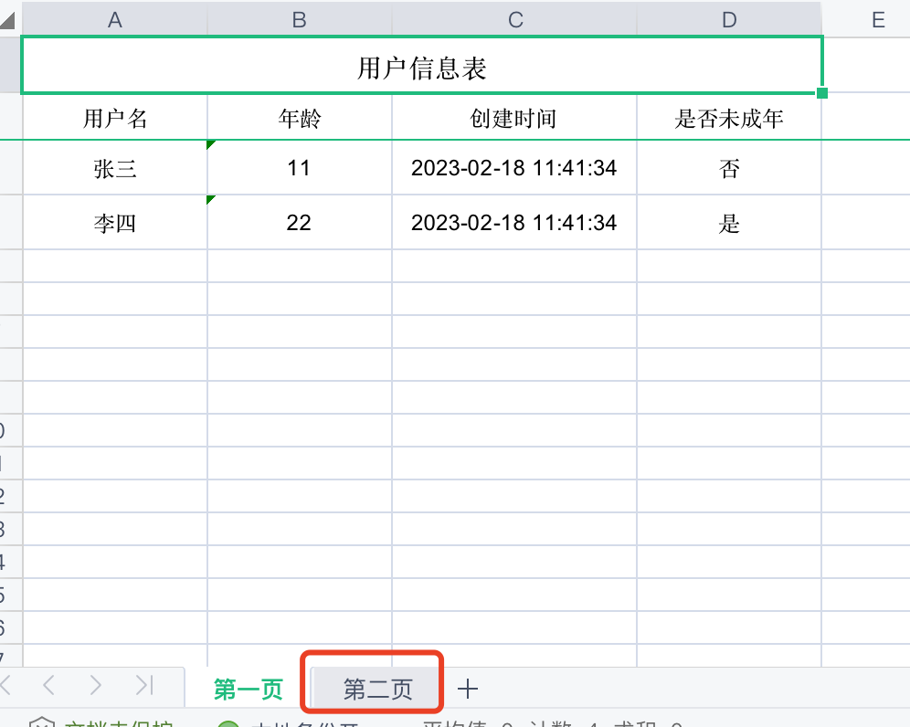


```java
     @RequestMapping(value = "/exportXls")
     public ModelAndView exporttXls(HttpServletRequest request) {
          List<User> userList =  new ArrayList<>();
          userList.add(new User("张三",11,new Date(),0));
          userList.add(new User("李四",22,new Date(),1));
 
         List<Map<String, Object>> list = new ArrayList<>();
            //学生页
         Map<String, Object> map1 = new HashMap<>();
         map1.put(NormalExcelConstants.CLASS, User.class);
         map1.put(NormalExcelConstants.PARAMS, new ExportParams("用户信息表", "第一页"));
         map1.put(NormalExcelConstants.DATA_LIST, userList);
         list.add(map1);
            //老师页
         Map<String, Object> map2 = new HashMap<>();
         map2.put(NormalExcelConstants.CLASS, Teacher.class);
         map2.put(NormalExcelConstants.PARAMS, new ExportParams("老师信息表", "第二页"));
         map2.put(NormalExcelConstants.DATA_LIST, teacherList);
         list.add(map2);
 
         // 导出Excel
         ModelAndView mv = new ModelAndView(new JeecgEntityExcelView());
         mv.addObject(NormalExcelConstants.FILE_NAME, "信息表.xlsx");
         mv.addObject(NormalExcelConstants.MAP_LIST, list);
 
         return mv;
     }
```

如果使用workbook

```java
 import org.jeecgframework.poi.excel.ExcelExportUtil;
import org.jeecgframework.poi.excel.entity.ExportParams;
import org.apache.poi.ss.usermodel.Workbook;
 
 
        List<Map<String, Object>> list = new ArrayList<>();
            //学生页
         Map<String, Object> map1 = new HashMap<>();
         map1.put("title", new ExportParams("用户信息表", "第一页"));
         map1.put(NormalExcelConstants.CLASS, User.class);
         map1.put(NormalExcelConstants.DATA_LIST, userList);
         list.add(map1);
            //老师页
         Map<String, Object> map2 = new HashMap<>();
         map2.put("title", new ExportParams("老师信息表", "第二页"));
         map2.put(NormalExcelConstants.CLASS, Teacher.class);
         map2.put(NormalExcelConstants.DATA_LIST, teacherList);
         list.add(map2);
 
   Workbook workbook  = ExcelExportUtil.exportExcel(list, ExcelType.HSSF);
```


# 十、MetaObjectHandler 自动填充字段

配置：

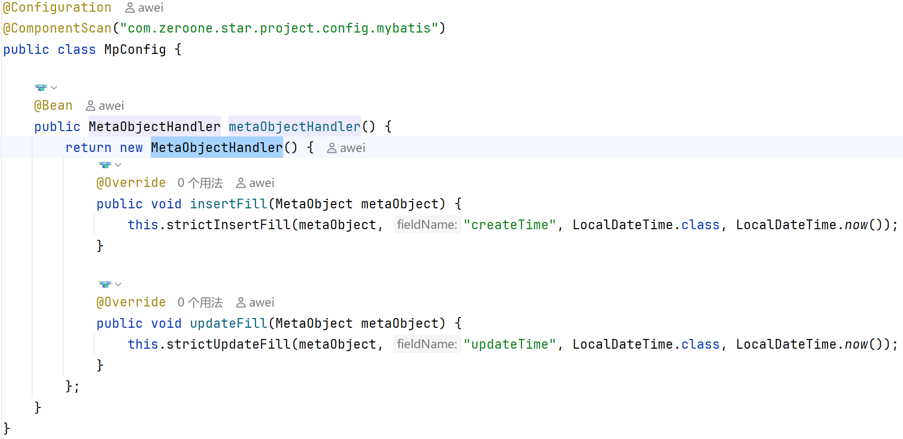

使用例子（自动填充创建人和修改人还没写）：

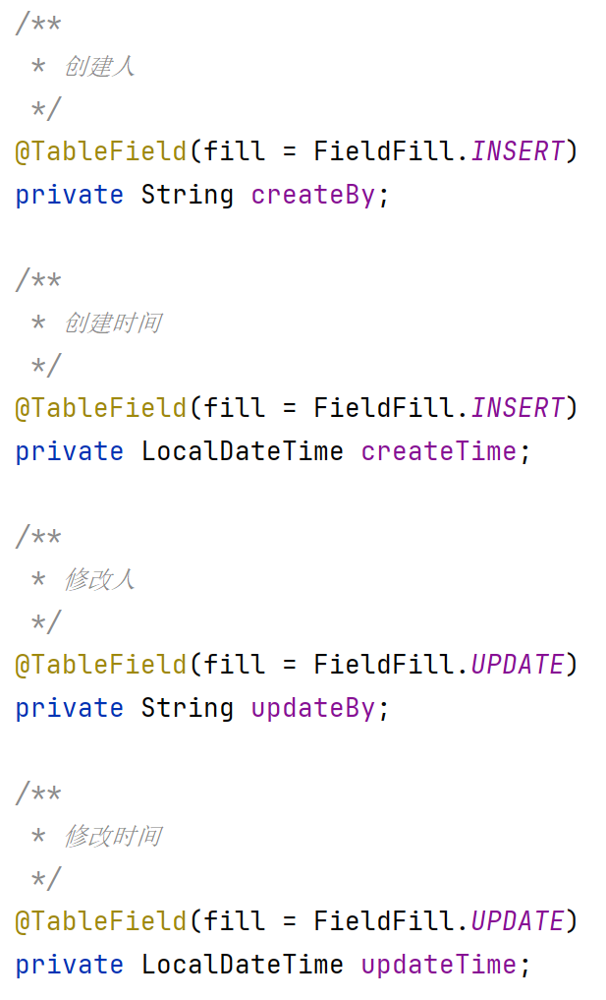


# 十一、@Autowired @Resource区别

待补充


# 十二、数据校验

## 12.1 依赖检查

在domain里面必须依赖spring-boot-starter-validation 


## 12.2 实体类注解

@NotBlank, @Pattern, @Range 等等

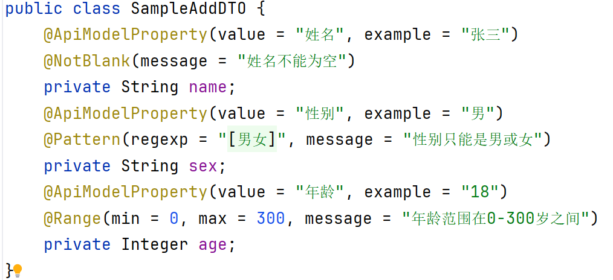

## 12.3 全局异常捕获器

详见 “十三”

```java
/**
 * <p>
 * 描述：全局异常捕获处理
 * </p>
 * <p>版权：&copy;01星球</p>
 * <p>地址：01星球总部</p>
 * @author 阿伟学长
 * @version 1.0.0
 */
@RestControllerAdvice
public class GlobalExceptionHandler {
    /**
     * 系统通用异常处理
     * @param e 异常类型
     * @return 返回异常信息回显数据
     */
    @ExceptionHandler(value = Exception.class)
    public JsonVO<String> exceptionHandler(Exception e) {
        if (e instanceof HttpMediaTypeException) {
            return JsonVO.create(e.getMessage(), ResultStatus.CONTENT_TYPE_ERR);
        }
        return JsonVO.create(e.getMessage(), ResultStatus.SERVER_ERROR);
    }

    /**
     * requestBody参数校验异常处理
     * @param e 异常类型
     * @return 返回异常信息回显数据
     */
    @ExceptionHandler(value =
            {MethodArgumentNotValidException.class, BindException.class})
    public JsonVO<String> methodArgumentNotValidHandler(Exception e) {
        BindingResult bindingResult;
        if (e instanceof MethodArgumentNotValidException) {
            //@RequestBody参数校验
            bindingResult = ((MethodArgumentNotValidException) e).getBindingResult();
        } else {
            //@ModelAttribute参数校验
            bindingResult = ((BindException) e).getBindingResult();
        }
        FieldError fieldError = bindingResult.getFieldError();
        String data = "";
        if (fieldError != null) {
            data = "[" + fieldError.getField() + "]" + fieldError.getDefaultMessage();
        }
        return JsonVO.create(data, ResultStatus.PARAMS_INVALID);
    }

    /**
     * requestParam参数校验异常处理
     * @param e 异常类型
     * @return 返回异常信息回显数据
     */
    @ExceptionHandler(value = {
            ConstraintViolationException.class,
            MissingServletRequestParameterException.class})
    public JsonVO<String> constraintViolationHandler(Exception e) {
        String field = "";
        String msg = "";
        if (e instanceof ConstraintViolationException) {
            ConstraintViolation<?> constraint = ((ConstraintViolationException) e)
                    .getConstraintViolations().stream().findFirst().orElse(null);
            if (constraint != null) {
                List<Path.Node> pathList = StreamSupport.stream
                                (constraint.getPropertyPath().spliterator(), false)
                        .collect(Collectors.toList());
                field = pathList.get(pathList.size() - 1).getName();
                msg = constraint.getMessage();
            }
        } else {
            // 非JSR标准返回的异常，要自定义提示文本
            field = ((MissingServletRequestParameterException) e).getParameterName();
            msg = "参数值缺失";
        }
        return JsonVO.create("[" + field + "]" + msg, ResultStatus.PARAMS_INVALID);
    }
}
```

## 12.4 在控制器（control）中加注解

@Validated加在：

- 类上
- 要校验的字段上

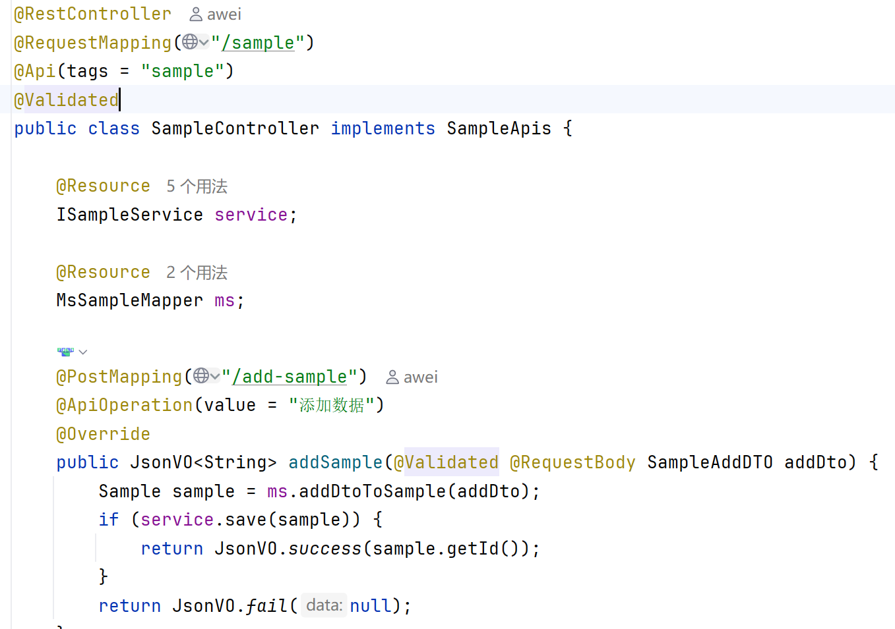


# 十三、@RestControllerAdvice：全局异常捕获与处理

在Spring Boot应用中，统一异常处理是构建健壮RESTful API的关键。`@RestControllerAdvice`是Spring框架提供的强大工具，结合`@ExceptionHandler`可实现全局异常拦截。这篇文章我们会聚焦这一点，谈谈这种实现业务与异常解耦的策略。

------

### 一、@RestControllerAdvice 基础使用

#### 1. 定义全局异常处理器

```java
@RestControllerAdvice
public class GlobalExceptionHandler {
	// 指定当前方法用于处理特定的异常类型（这里是 UserNotFoundException）
    @ExceptionHandler(UserNotFoundException.class)  
    // 强制设置 HTTP 响应的状态码（这里是 404 NOT_FOUND）
    @ResponseStatus(HttpStatus.NOT_FOUND)
    public ErrorResponse handleUserNotFound(UserNotFoundException ex) {
        return new ErrorResponse(ex.getMessage(), HttpStatus.NOT_FOUND.value());
    }
}
```

#### 2. 自定义异常类

```java
public class UserNotFoundException extends RuntimeException {
    public UserNotFoundException(String message) {
        super(message);
    }
}
```

#### 3. 测试Controller

```java
@RestController
@RequestMapping("/users")
public class UserController {
    
    @GetMapping("/{id}")
    public String getUser(@PathVariable Long id) {
        if (id == 0) {
            throw new UserNotFoundException("用户不存在");
        }
        return "用户信息";
    }
}
```

#### 4. 统一响应体

```java
@Data
@AllArgsConstructor
public class ErrorResponse {
    private String message;
    private int statusCode;
}
```

访问`/users/0`将触发异常，返回：

```json
{
  "message": "用户不存在",
  "statusCode": 404
}
```

------

### 二、问题解答

#### 1. 为什么@RestControllerAdvice常与@RestController配合使用？

- **响应格式统一性**：二者均基于`@ResponseBody`，确保异常处理结果与业务逻辑返回同为JSON格式。
- **作用域明确**：`@RestControllerAdvice`默认处理所有`@RestController`控制器抛出的异常，保持REST API异常处理的专一性。
- **避免视图解析**：传统`@Controller`可能返回视图，而`@RestControllerAdvice`专注于数据响应。

#### 2. @RestControllerAdvice的依赖来源？

该注解属于**Spring Web模块**，在项目中需引入：

```xml
<!-- Maven -->
<dependency>
    <groupId>org.springframework.boot</groupId>
    <artifactId>spring-boot-starter-web</artifactId>
</dependency>
```

或Gradle：

```groovy
implementation 'org.springframework.boot:spring-boot-starter-web'
```

------

### 三、核心机制解析

- **组合注解**：`@RestControllerAdvice = @ControllerAdvice + @ResponseBody`
- **AOP代理**：通过动态代理技术拦截控制器方法调用，在异常抛出时匹配处理策略。
- **优先级规则**：更具体的异常处理器优先于通用处理器。

------

### 四、总结

`@RestControllerAdvice`通过集中管理异常处理逻辑，显著提升代码可维护性。结合`@RestController`使用时，能够有效统一REST API的错误响应格式，是构建企业级应用不可或缺的组件。理解其底层依赖和协作机制，有助于更灵活地进行定制化开发。


# 十四、 @ComponentScan

### 零、个人理解

当启动类和所需组件不在同一文件路径时，使用ComponentScan把组件扫进来

### 一、组件扫描的核心价值

在Spring框架中，组件扫描机制是现代Spring应用开发的基石。通过自动检测和注册Bean，它彻底改变了传统的XML配置方式。`@ComponentScan`注解作为这一机制的核心控制器，决定了Spring IoC容器如何发现和装配组件。

### 二、底层实现原理剖析

### 2.1 扫描机制核心流程

1. **启动阶段**：当容器初始化时，`ConfigurationClassPostProcessor`解析配置类
2. **路径解析**：根据`basePackages`或`basePackageClasses`确定扫描根路径
3. **类文件遍历**：使用`ClassPathScanningCandidateComponentProvider`进行递归扫描
4. **条件过滤**：应用include/exclude过滤器（默认包含`@Component`及其衍生注解）
5. **Bean定义注册**：符合条件的类被转化为`BeanDefinition`存入容器

### 2.2 关键技术实现

- **ASM字节码分析**：避免加载类即可获取注解信息
- **路径匹配算法**：Ant风格路径匹配（如`com.example.**.dao`）
- **JAR文件处理**：针对不同文件系统优化扫描性能

### 三、实战用法大全

### 3.1 基础配置示例

```java
@Configuration
@ComponentScan(
    basePackages = "com.example.service",
    basePackageClasses = SecurityConfig.class)
public class AppConfig {
    // 明确指定扫描根包
}
```

### 3.2 高级过滤配置

```java
@Configuration
@ComponentScan(
    basePackages = "com.example",
    excludeFilters = @Filter(type = FilterType.REGEX, pattern = ".*Test"),
    includeFilters = @Filter(type = FilterType.ANNOTATION, classes = Repository.class))
public class AdvancedConfig {
    // 包含Repository注解类，排除所有Test结尾的类
}
```

### 3.3 多扫描策略组合

```java
@Configuration
@ComponentScans({
    @ComponentScan("com.example.service"),
    @ComponentScan(
        basePackageClasses = WebController.class,
        useDefaultFilters = false,
        includeFilters = @ComponentScan.Filter(Controller.class))
})
public class MultiScanConfig {
    // 多个独立扫描策略共存
}
```

### 四、企业级最佳实践

### 4.1 包结构规范

推荐的多模块项目结构：

```text
src/
├── main/
│   ├── java/
│   │   └── com/
│   │       └── example/
│   │           ├── Application.java        # 主类
│   │           ├── config/                 # 配置类目录
│   │           ├── domain/                 # 领域模型
│   │           ├── service/                # 服务层
│   │           └── web/                    # 控制器层
```

### 4.2 性能优化策略

- 使用精确的包路径而非通配符
- 在大型项目中启用并行扫描： `properties spring.component-scan.parallel=true`
- 缓存扫描结果（适用于测试环境）

### 4.3 安全扫描策略

```java
@Configuration
@ComponentScan(
    basePackages = "com.example",
    excludeFilters = {
        @Filter(type = ASSIGNABLE_TYPE, classes = ExperimentalFeature.class),
        @Filter(pattern = ".*\\.internal\\..*")
    })
public class SecureConfig {
    // 排除内部实现类和实验性功能
}
```

### 五、典型问题排查指南

### 5.1 Bean未被扫描的排查流程

1. 检查`@ComponentScan`是否生效
2. 确认组件在扫描路径的子包中
3. 使用`-Ddebug`参数查看扫描日志
4. 检查是否被其他过滤规则排除

### 5.2 冲突解决示例

当出现Bean重复时：

```java
@ComponentScan(
    basePackages = "com.example",
    excludeFilters = @Filter(type = ASSIGNABLE_TYPE, 
                           classes = ConflictComponent.class))
public class ConflictSolverConfig {
    // 显式排除冲突组件
}
```

### 六、[Spring Boot](https://zhida.zhihu.com/search?content_id=255256138&content_type=Article&match_order=1&q=Spring+Boot&zhida_source=entity)特殊处理

### 6.1 自动扫描机制

`@SpringBootApplication`组合了： - `@ComponentScan`（当前包及其子包） - `@EnableAutoConfiguration`（自动配置） - `@SpringBootConfiguration`（配置声明）

### 6.2 自定义扫描策略

```java
@SpringBootApplication
@ComponentScan(
    basePackages = "com.example",
    exclude = {DataSourceAutoConfiguration.class})
public class CustomBootApp {
    // 覆盖默认扫描行为
}
```

### 七、性能对比测试数据

| 扫描策略             | 1000类耗时 | 5000类耗时 |
| -------------------- | ---------- | ---------- |
| 默认扫描             | 420ms      | 2100ms     |
| 精确包路径           | 150ms      | 680ms      |
| 并行扫描             | 90ms       | 380ms      |
| 启用缓存（二次启动） | 30ms       | 120ms      |

### 八、延伸扩展

### 8.1 条件化扫描

结合`@Conditional`实现动态扫描：

```java
@Configuration
@ConditionalOnProperty(name = "module.enabled", havingValue = "true")
@ComponentScan("com.example.special.module")
public class ConditionalScanConfig {}
```

### 8.2 自定义扫描器

实现自定义扫描逻辑：

```java
public class CustomScanner extends ClassPathBeanDefinitionScanner {
    @Override
    protected boolean isCandidateComponent(MetadataReader metadataReader) {
        // 自定义过滤逻辑
    }
}
```

### 九、总结建议

1. **明确优于隐式**：始终显式指定扫描路径
2. **模块化扫描**：不同功能模块使用独立配置
3. **防御式编程**：添加必要的排除规则
4. **持续监控**：定期检查Bean注册情况

> 在微服务架构下，合理的组件扫描策略可以使应用启动速度提升40%以上。建议每季度进行一次扫描配置审计，确保随着业务增长保持最佳实践。


# 十五、mapstruct


