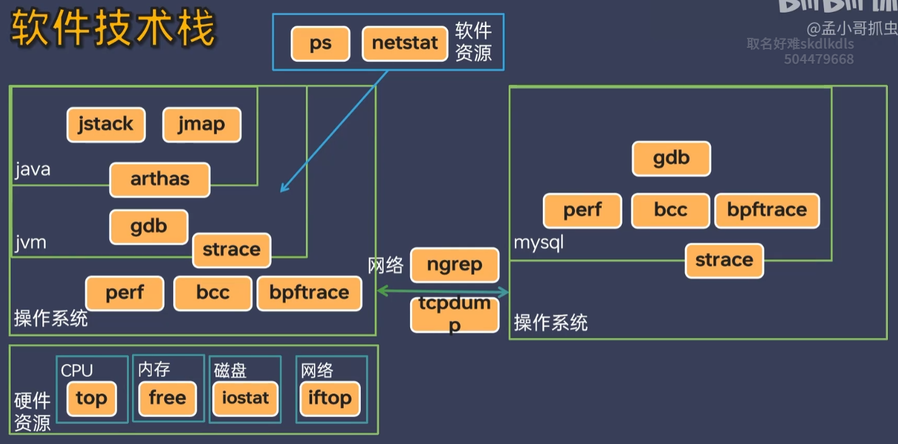
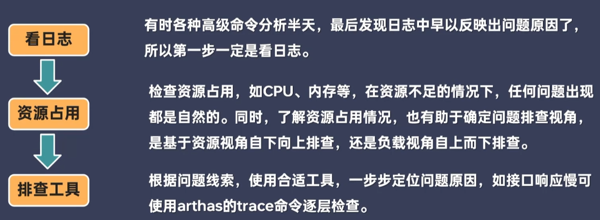
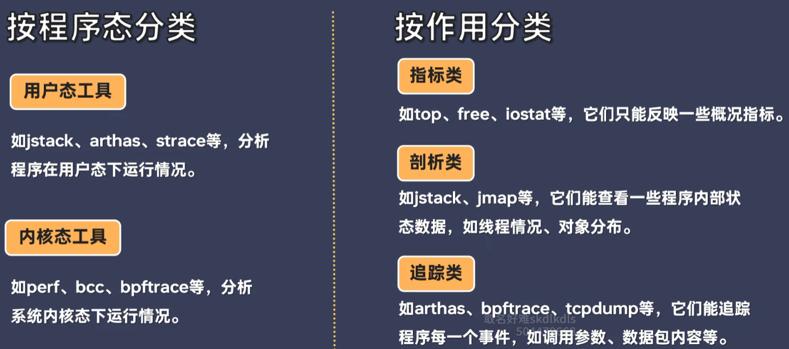
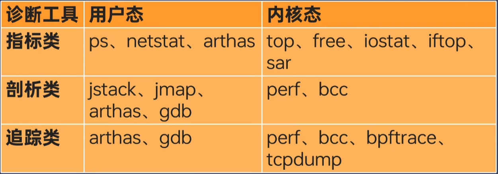
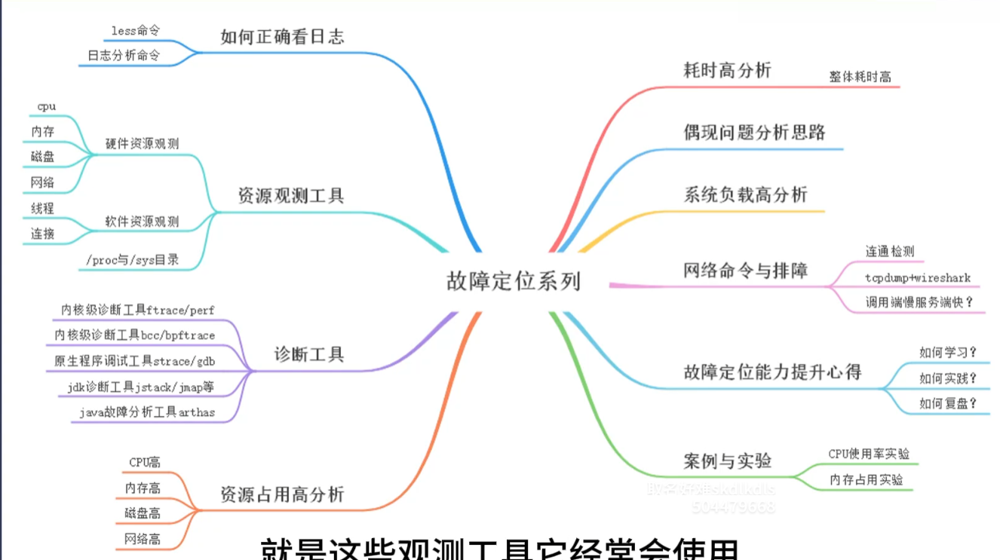
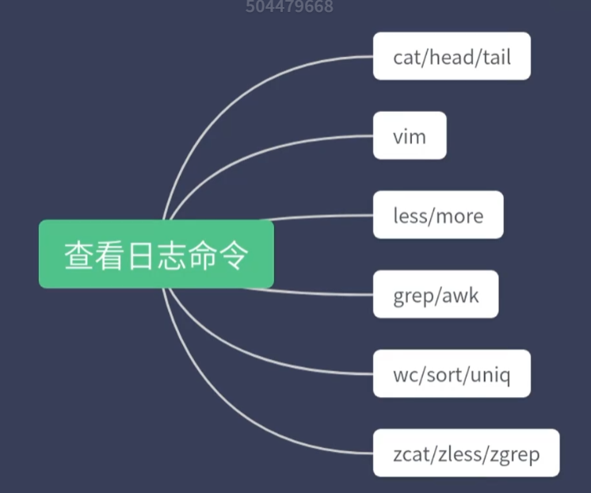

# 一、整体分析思路

## 1.1 整体分析思路

### 1.1.1 软件技术栈

### 1.1.2 两种分析视角

- 资源分析视角

自底向上分析，硬件资源使用率如何？如何发现CPU资源占用高。

1. 什么进程占用CPU多
2. 什么线程占用CPU多
3. 什么代码占用CPU多

- 负载分析视角

自顶向下分析，接口QPS多少，耗时怎样，有多少报错？如发现接口耗时高。

1. controller层耗时高吗
2. mapper层处理耗时高吗
3. SQL执行耗时高吗

### 1.1.3 常规排查思路

 

### 1.1.4 诊断工具分类

## 1.2 查看日志命令

### 1.2.1 cat/head/tail命令

cat命令用于将文件内容输出

head命令用于查看文件前几行

tail命令用于查看文件后几行，-f不断查看新内容