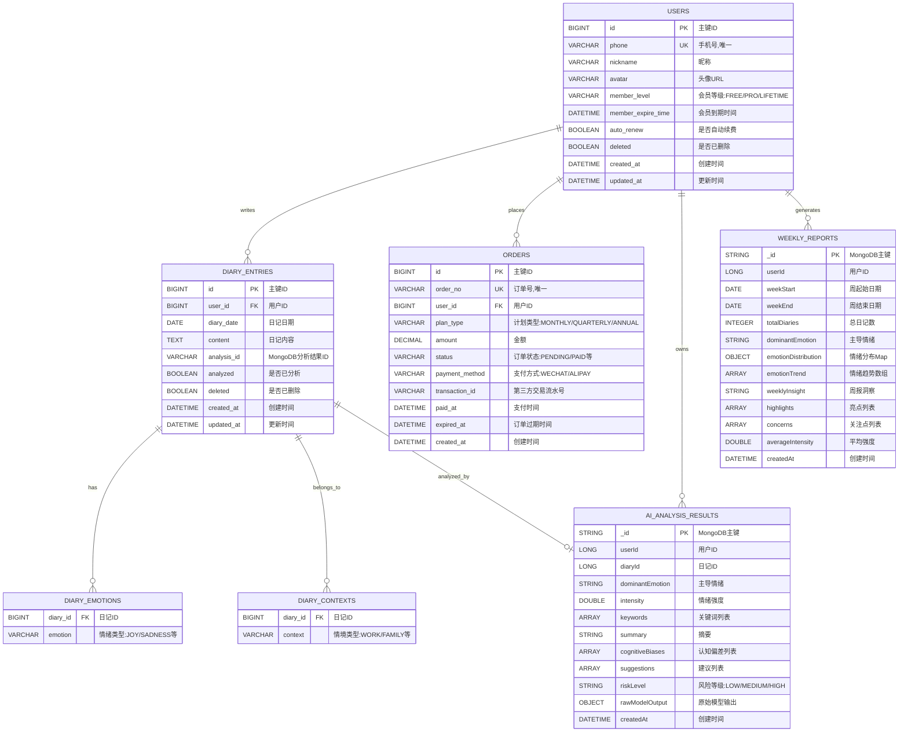

# 心迹（Xiniji）心理健康服务系统 - 设计方案

  

## 五、设计方案

  

### 1. 系统业务流程图

  

#### 1.1 用户注册登录流程

  


  

#### 1.2 情绪日记记录与AI分析流程

  


  

#### 1.3 周报生成流程

  


  

#### 1.4 会员订阅与支付流程

  


  

#### 1.5 定时任务流程

  

```mermaid

graph TD

A[系统启动] --> B[注册定时任务<br/>@Scheduled]

B --> C[等待触发时间]

C --> D[每周一凌晨1点]

D --> E[定时任务触发]

E --> F[获取所有活跃用户列表]

F --> G[遍历每个用户]

G --> H[计算上周日期范围<br/>周一到周日]

H --> I[生成上周周报]

I --> J{是否还有用户?}

J -->|是| G

J -->|否| K[定时任务完成]

K --> L[等待下次触发]

L --> C

```

  

---

  

### 2. 系统功能结构图

  

```

心迹心理健康服务系统

│

├── 用户认证模块

│ ├── 手机号验证码登录

│ │ ├── 发送短信验证码

│ │ ├── 验证码校验

│ │ └── JWT Token生成

│ ├── 用户注册（自动）

│ └── 退出登录

│

├── 用户管理模块

│ ├── 个人信息管理

│ │ ├── 查看个人信息

│ │ ├── 修改昵称

│ │ └── 上传头像

│ ├── 数据管理

│ │ ├── 导出用户数据

│ │ └── 注销账号

│ └── 会员状态查询

│

├── 情绪日记模块

│ ├── 日记管理

│ │ ├── 创建日记

│ │ ├── 编辑日记

│ │ ├── 删除日记

│ │ └── 查看日记详情

│ ├── 日记查询

│ │ ├── 分页列表查询

│ │ ├── 关键词搜索

│ │ ├── 日期范围查询

│ │ └── 获取今日日记

│ ├── 情绪标签选择

│ │ ├── 喜悦 (JOY)

│ │ ├── 悲伤 (SADNESS)

│ │ ├── 愤怒 (ANGER)

│ │ ├── 恐惧 (FEAR)

│ │ ├── 惊讶 (SURPRISE)

│ │ ├── 厌恶 (DISGUST)

│ │ ├── 焦虑 (ANXIETY)

│ │ └── 平静 (CALM)

│ ├── 情境分类选择

│ │ ├── 工作 (WORK)

│ │ ├── 家庭 (FAMILY)

│ │ ├── 社交 (SOCIAL)

│ │ ├── 健康 (HEALTH)

│ │ ├── 学习 (STUDY)

│ │ └── 其他 (OTHER)

│ └── 日记统计

│ ├── 总日记数

│ ├── 已分析日记数

│ ├── 本月日记数

│ └── 连续打卡天数

│

├── AI情绪分析模块

│ ├── 情绪识别

│ │ ├── 主导情绪识别

│ │ ├── 情绪强度评估

│ │ └── 多情绪混合分析

│ ├── 文本分析

│ │ ├── 关键词提取

│ │ ├── 情绪摘要生成

│ │ └── 认知偏差识别

│ ├── 个性化建议

│ │ ├── 心理调节建议

│ │ ├── 行为改善建议

│ │ └── 资源推荐

│ ├── 风险评估

│ │ ├── 低风险 (LOW)

│ │ ├── 中风险 (MEDIUM)

│ │ └── 高风险 (HIGH)

│ └── 异步分析处理

│ ├── Mock模式（开发环境）

│ └── AI模型调用（生产环境）

│

├── 周报生成模块

│ ├── 周报数据统计

│ │ ├── 本周日记数量

│ │ ├── 情绪分布统计

│ │ ├── 主导情绪计算

│ │ └── 平均强度计算

│ ├── 趋势分析

│ │ ├── 情绪趋势曲线

│ │ ├── 强度变化分析

│ │ └── 情绪波动识别

│ ├── 洞察生成

│ │ ├── 周报总结

│ │ ├── 亮点提取

│ │ └── 关注点标注

│ ├── 周报查询

│ │ ├── 当前周报

│ │ └── 历史周报列表

│ └── 定时任务

│ └── 每周一自动生成

│

├── 会员订阅模块

│ ├── 会员计划管理

│ │ ├── 月度会员（¥29/30天）

│ │ ├── 季度会员（¥78/90天）

│ │ └── 年度会员（¥288/365天）

│ ├── 订单管理

│ │ ├── 创建订单

│ │ ├── 查询订单状态

│ │ ├── 订单历史记录

│ │ └── 订单过期处理

│ ├── 支付集成

│ │ ├── 微信支付

│ │ ├── 支付宝

│ │ └── 支付回调处理

│ ├── 会员权益管理

│ │ ├── 深度洞察报告

│ │ ├── 个性化成长计划

│ │ ├── 情绪预警提醒

│ │ ├── 正念练习推荐

│ │ └── 长期趋势追踪

│ └── 自动续费设置

│ ├── 开启自动续费

│ └── 关闭自动续费

│

├── 危机干预模块

│ ├── 24小时心理热线

│ ├── 专业咨询服务

│ ├── 自助资源推荐

│ └── 紧急联系方式

│

└── 系统管理模块

├── 安全管理

│ ├── JWT认证

│ ├── 接口权限控制

│ ├── CORS配置

│ └── 数据加密

├── 异常处理

│ ├── 全局异常捕获

│ ├── 业务异常处理

│ └── 参数验证

├── 日志管理

│ ├── 操作日志记录

│ ├── 错误日志记录

│ └── 访问日志记录

└── 第三方服务集成

├── 阿里云短信服务

├── 阿里云OSS存储

└── AI模型服务

```

  

---

  

### 3. 类图（实体类图）

  


  

---

  

### 4. 数据库E-R图

  



  

#### 数据库设计说明：

  

**MySQL数据库（关系型数据）**

1. **users表**：存储用户基本信息、会员状态

- 索引：phone（唯一索引）、member_level

2. **diary_entries表**：存储日记核心数据

- 索引：user_id、diary_date、(user_id, diary_date)组合索引

- 外键：user_id → users.id

3. **diary_emotions表**：日记与情绪的多对多关系

- 索引：diary_id

- 外键：diary_id → diary_entries.id（级联删除）

4. **diary_contexts表**：日记与情境的多对多关系

- 索引：diary_id

- 外键：diary_id → diary_entries.id（级联删除）

5. **orders表**：存储订单信息

- 索引：order_no（唯一索引）、user_id、status

- 外键：user_id → users.id

  

**MongoDB数据库（文档型数据）**

1. **ai_analysis_results集合**：存储AI分析结果

- 索引：userId、diaryId

- 特点：结构灵活，支持嵌套数组和对象

2. **weekly_reports集合**：存储周报数据

- 复合索引：(userId, weekStart)

- 特点：支持复杂的嵌套结构（情绪趋势点数组）

  

**设计原则**

- 关系型数据使用MySQL，保证事务一致性

- 非结构化分析数据使用MongoDB，提高灵活性

- 通过analysisId字段关联MySQL和MongoDB数据

- 合理使用索引提高查询性能

- 软删除设计（deleted字段）保留数据历史

  

---

  

## 附录：技术架构图

  

```

┌─────────────────────────────────────────────────────────┐

│ 前端层 (Vue 3) │

│ ┌──────────┐ ┌──────────┐ ┌──────────┐ ┌─────────┐ │

│ │ 日记管理 │ │ AI分析 │ │ 周报展示 │ │ 会员中心 │ │

│ └──────────┘ └──────────┘ └──────────┘ └─────────┘ │

│ │ HTTP/HTTPS (Axios) │

└────────────────────┼───────────────────────────────────┘

│

▼

┌─────────────────────────────────────────────────────────┐

│ API网关层 (Spring Security) │

│ ┌────────────────────────────────────────────────────┐ │

│ │ JWT认证 │ CORS配置 │ 权限控制 │ 全局异常处理 │ │

│ └────────────────────────────────────────────────────┘ │

└────────────────────┬───────────────────────────────────┘

│

▼

┌─────────────────────────────────────────────────────────┐

│ 业务逻辑层 (Spring Boot 3) │

│ ┌──────────┐ ┌──────────┐ ┌──────────┐ ┌─────────┐ │

│ │AuthService│ │DiaryService│ │AIAnalysis│ │MemberSvc│ │

│ └──────────┘ └──────────┘ │ Service │ └─────────┘ │

│ ┌──────────┐ ┌──────────┐ └──────────┘ ┌─────────┐ │

│ │UserService│ │WeeklyRpt │ │SmsService│ │

│ └──────────┘ │ Service │ └─────────┘ │

│ └──────────┘ │

└────────────────────┬───────────────────────────────────┘

│

┌────────────┼────────────┐

│ │ │

▼ ▼ ▼

┌─────────────┐ ┌──────────┐ ┌──────────┐

│ MySQL │ │ MongoDB │ │ Redis │

│ (关系数据) │ │(分析数据) │ │ (缓存) │

│ │ │ │ │ │

│ • users │ │• analysis│ │• 验证码 │

│ • diaries │ │• reports │ │• session │

│ • orders │ │ │ │ │

└─────────────┘ └──────────┘ └──────────┘

│ │

└────────┬───┘

│

┌────────┴────────┐

▼ ▼

┌─────────────┐ ┌──────────────┐

│ 阿里云短信 │ │ AI模型服务 │

│ 服务 │ │(ChatGLM/BERT)│

└─────────────┘ └──────────────┘

```

  

此设计方案完整展示了心迹系统的业务流程、功能结构、类图和数据库设计，为系统的开发、测试和维护提供了完整的技术文档支撑。