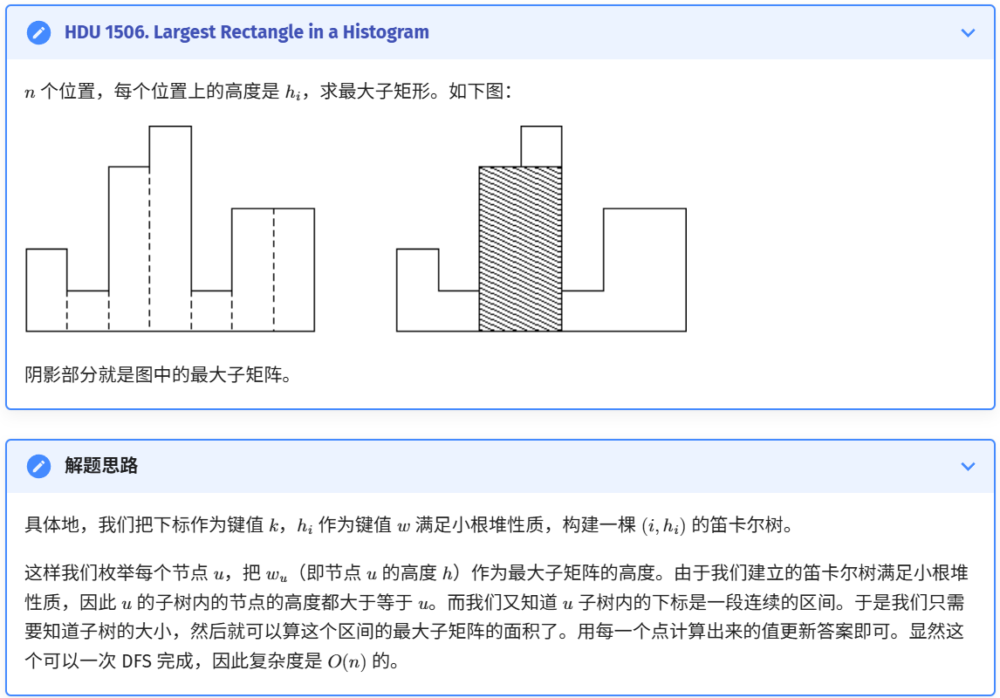

# 零、其他

```bash
g++ -std=c++20 -o2 -Wall $1.cpp -o main
./main < in.txt > out.txt
cat out.txt
```

```c++
int a[N],pos[N];
for(int i=1; i<=n; i++){
    pos[i]=i;
}
sort(a+1, a+1+n, [&](int x, int y)->bool{
    return a[x] < a[y];
})
//a=2,1,13,19,11
//pos=2 1 5 3 4
```


# 一、DP

## 1.1 状压dp

子集枚举

```c++
// 枚举mask的所有子集（包括空集和mask本身）
void enumerateSubsets(int mask) {
    for (int sub = mask; ; sub = (sub - 1) & mask) {
        // 处理子集sub
        System.out.println(sub);
        if (sub == 0) break; // 终止条件
    }
}

// 枚举mask的所有非空子集
void enumerateNonEmptySubsets(int mask) {
    for (int sub = mask; sub > 0; sub = (sub - 1) & mask) {
        // 处理非空子集sub
        System.out.println(sub);
    }
}
```


# 二、图

## 2.1 最小祖宗树

```cpp
#include<bits/stdc++.h>
using namespace std;

const int N = 5e5 + 100;
int n, m, s; // n是树的节点个数，s是树根节点
int lg[N];

struct node
{
	int to, ne;
}e[N << 1];
int head[N], cnt;
void add(int u, int v)
{
	e[++cnt].to = v;
	e[cnt].ne = head[u];
	head[u] = cnt;
}

int fa[N][20], depth[N]; // 根节点depth为1
void dfs(int now, int fath)
{
	fa[now][0] = fath, depth[now] = depth[fath] + 1;
	for (int i = 1; i <= lg[depth[now]]; i++)
	{
		fa[now][i] = fa[fa[now][i - 1]][i - 1];
	}
	for (int i = head[now]; i; i = e[i].ne)
	{
		if (e[i].to != fath)
		{
			dfs(e[i].to, now);
		}
	}
}
int LCA(int a, int b)
{
	if (depth[a] < depth[b]) swap(a, b);
	while (depth[a] > depth[b])
	{
		a = fa[a][lg[depth[a] - depth[b]] - 1];
	}
	if (a == b) return a;
	for (int i = lg[depth[a]] - 1; i >= 0; i--)
	{
		if (fa[a][i] != fa[b][i])
		{
			a = fa[a][i];
			b = fa[b][i];
		}
	}
	a = fa[a][0];
	return a;
}

signed main()
{
	ios::sync_with_stdio(0), cin.tie(0), cout.tie(0);
	cin >> n >> m >> s; // 树的结点个数， 询问的个数， 树根节点的序号
	for (int i = 1; i < n; i++)
	{
        int u,v;
		cin >> u >> v;
		add(u, v), add(v, u);
	}
	for (int i = 1; i < N; i++)
	{
		lg[i] = lg[i - 1] + (1 << lg[i-1] == i); //获得log2(i)+1,其中log2(i)向下取整
	}
	dfs(s, 0);
	while (m--)
	{
        int a,b;
		cin >> a >> b;
		cout << LCA(a, b) << "\n";
	}
}
```

## 2.2 树上启发式合并

> 给出一棵 𝑛 个节点以 1 为根的树，节点 𝑢 的颜色为 𝑐~𝑢~，现在对于每个结点 𝑢 询问以 𝑢 为根的子树里一共出现了多少种不同的颜色。
>
> 𝑛 ≤ 2 ×10^5^。

```cpp
#include <cstdio>
#include <vector>
using namespace std;

constexpr int N = 2e5 + 5;

int n, m;

// g[u]: 存储与 u 相邻的结点
vector<int> g[N];

// sz: 子树大小
// big: 重儿子
// col: 结点颜色 （题目用）
// L[u]: 结点 u 的 DFS 序
// R[u]: 结点 u 子树中结点的 DFS 序的最大值
// Node[i]: DFS 序为 i 的结点
// totdfn: 节点计数器，也是当前遍历过节点的 DFS 序最大值
// ans: 存答案
// cnt[i]: 颜色为 i 的结点个数
// totColor: 目前出现过的颜色个数 （题目用）
int sz[N], big[N], col[N], L[N], R[N], Node[N], totdfn;
int ans[N], cnt[N], totColor;

void add(int u) {
  if (cnt[col[u]] == 0) ++totColor;
  cnt[col[u]]++;
}

void del(int u) {
  cnt[col[u]]--;
  if (cnt[col[u]] == 0) --totColor;
}

int getAns() { return totColor; }

void dfs0(int u, int p) {
  L[u] = ++totdfn;
  Node[totdfn] = u;
  sz[u] = 1;
  for (int v : g[u])
    if (v != p) {
      dfs0(v, u);
      sz[u] += sz[v];
      if (!big[u] || sz[big[u]] < sz[v]) big[u] = v;
    }
  R[u] = totdfn;
}

void dfs1(int u, int p, bool keep) {
  // 计算轻儿子的答案
  for (int v : g[u])
    if (v != p && v != big[u]) {
      dfs1(v, u, false);
    }
  // 计算重儿子答案并保留计算过程中的数据（用于继承）
  if (big[u]) {
    dfs1(big[u], u, true);
  }
  for (int v : g[u])
    if (v != p && v != big[u]) {
      // 子树结点的 DFS 序构成一段连续区间，可以直接遍历
      for (int i = L[v]; i <= R[v]; i++) {
        add(Node[i]);
      }
    }
  add(u);
  ans[u] = getAns();
  if (!keep) {
    for (int i = L[u]; i <= R[u]; i++) {
      del(Node[i]);
    }
  }
}

int main() {
  scanf("%d", &n);
  for (int i = 1; i < n; i++) {
    int u, v;
    scanf("%d%d", &u, &v);
    g[u].push_back(v);
    g[v].push_back(u);
  }
  for (int i = 1; i <= n; i++) scanf("%d", &col[i]);
  dfs0(1, 0);
  dfs1(1, 0, false);
  scanf("%d", &m);
  for (int i = 1; i <= m; i++) {
    int q;
    scanf("%d", &q);
    printf("%d\n", ans[q]);
  }
  return 0;
}
```


## 2.3 笛卡尔树

笛卡尔树由k,v两部分组成，上面的例子中k为数组下标,所以天然是升序排序，v为数组元素。
笛卡尔树=堆+基于数组下标的二叉搜索树.以下拿最小堆为例:

1.单纯实现一个最小堆，我们使用栈作为辅助空间来构造堆.当一个数组元素要构造节点时,他可以成为栈顶元素的子节点(比栈顶元素大),或者成为栈顶元素的父节点(比栈顶元素小)

2.还要将最小堆变成二叉搜索树。一个已入栈元素的下标<后入栈元素的下标,所以在第一步中,变成子节点的元素必须要成为右节点;变成父节点的元素,栈中的元素必须成为他的左子树,这样才保持了基于下标的二叉搜索树性质




```cpp
#include <algorithm>
#include <cstring>
#include <iostream>
using namespace std;
using ll = long long;
constexpr int N = 100000 + 10, INF = 0x3f3f3f3f;

struct node {
  int idx, val, par, ch[2];// ch:子节点

  friend bool operator<(node a, node b) { return a.idx < b.idx; }

  void init(int _idx, int _val, int _par) {
    idx = _idx, val = _val, par = _par, ch[0] = ch[1] = 0;
  }
} tree[N];

int root, top, stk[N];
ll ans;

int cartesian_build(int n) {  // 建树，满足小根堆性质
  for (int i = 1; i <= n; i++) {
    int k = i - 1;
    while (tree[k].val > tree[i].val) k = tree[k].par;
    tree[i].ch[0] = tree[k].ch[1];
    tree[k].ch[1] = i;
    tree[i].par = k;
    tree[tree[i].ch[0]].par = i;
  }
  return tree[0].ch[1]; // 返回0的右节点（真正的根节点，0只是为了构造而写的临时节点）
}

int dfs(int x) {  // 一次dfs更新答案就可以了
  if (!x) return 0;
  int sz = dfs(tree[x].ch[0]);
  sz += dfs(tree[x].ch[1]);
  ans = max(ans, (ll)(sz + 1) * tree[x].val);
  return sz + 1;
}

int main() {
  cin.tie(nullptr)->sync_with_stdio(false);
  int n, hi;
  while (cin >> n, n) {
    tree[0].init(0, 0, 0);
    for (int i = 1; i <= n; i++) {
      cin >> hi;
      tree[i].init(i, hi, 0);
    }
    root = cartesian_build(n);
    ans = 0;
    dfs(root);
    cout << ans << '\n';
  }
  return 0;
}
```

上面的没用栈，时间可能被卡

```cpp
#include<bits/stdc++.h>
using namespace std;
#define int long long

const int N = 5e4+10;
int n, k;
int b[N]; 

int gcd(int x, int y){
	return y==0? x: gcd(y, x%y);
}
//---------主要代码--------------------------------------
// sta[1]是该笛卡尔树的根节点
vector<int> ls(N), rs(N), val(N), sta(N);
void build(int n){
    int top = 0;
    for(int i=1; i<=n; i++){
        int pos = top;
        while(pos>0 && val[sta[pos]] > val[i]){
            pos--;
        }
        if(pos>0){
            rs[sta[pos]] = i;
        }
        if(pos < top){
            ls[i] = sta[pos+1];
        }
        sta[++pos] = i;
        top = pos;
    }
}
//-------------------------------------------------------------

bool dfs(int l, int r, int x, int pa){
    if(l>r) return 1;
    if(pa!=0 && val[x]%val[pa]!=0) {
        return 0;
    }
    return dfs(l, x-1, ls[x], x)&dfs(x+1, r, rs[x], x);
}

bool check(int x){
    for(int i=1; i<=n; i++){
        val[i] = b[i]+x;
        ls[i] = rs[i] = 0;
    }
    build(n);
    return dfs(1, n, sta[1], 0);
}

void solve(){
    cin>>n>>k;
    int Min = 1e9;
    for(int i=1; i<=n; i++){
    	cin>>b[i];
    	Min = min(Min, b[i]);
	}
	int g = 0;
    for(int i=1; i<n; i++){
        g = gcd(g, abs(b[i]-b[i+1]));
    }
	if(g == 0){
		cout<<k<<" "<<(1+k)*k/2<<"\n";
		return;
	}

    vector<int> d;
    for(int i=1; i*i<=g; i++){
        if(g%i==0){
            d.push_back(i);
            if(i*i!=g) d.push_back(g/i);
        }
    }

	int cnt = 0, ans=0;
	for(auto i: d){
        int x = i-Min;
        if(x<1 || x>k) continue;
        if(check(x)){
            cnt ++ ;
            ans+=x;
        }
	}
	cout<<cnt<<" "<<ans<<"\n";
}

signed main(){
	ios::sync_with_stdio(0); cin.tie(0);
    int T; cin>>T;
    while(T--) solve();
} 
```


## 2.4 线段树

```c++
#include<bits/stdc++.h>
using namespace std;
#define int long long
const int N = 1e5+10;
int a[N];
int tree[N<<2];
int tag[N<<2];

int ls(int p) {return p<<1;}
int rs(int p) {return p<<1|1;}

void push_up(int p)
{
    tree[p]=tree[ls(p)]+tree[rs(p)];
}

void build(int p,int l,int r)
{
    tag[p]=0;
    int mid = l+r>>1;
    if(l==r) 
    {
        tree[p]=a[l]; ///tree[l]=a[l];
        return ;
    }
    build(ls(p), l, mid);
    build(rs(p), mid+1, r);
    push_up(p);
}

void addtag(int p,int k,int l,int r)
{
    tag[p]+=k;
    tree[p]+=(r-l+1)*k;
}

void push_down(int p, int l, int r)
{
    //if(l==r) return;
    if(tag[p])
    {
        int mid = l+r>>1;
        addtag(ls(p),tag[p],l,mid);
        addtag(rs(p),tag[p],mid+1,r);
        tag[p]=0;///
    }
}
void update(int p, int L, int R, int l, int r, int k)
{
    if(L<=l && R>=r)
    {
        addtag(p,k,l,r);
        return;
    }
    push_down(p,l,r);//////////
    int mid  = l+r>>1;
    if(L<=mid) update(ls(p), L, R, l, mid, k);
    if(R>=mid+1) update(rs(p), L, R, mid+1, r, k);
    push_up(p);////
}

int query(int p, int L, int R, int l, int r)
{
    int ans = 0;
    if(L<=l && R>=r)
    {
        return tree[p];
    }
    push_down(p,l,r);
    int mid = l+r>>1;
    if(L<=mid) ans += query(ls(p),L,R,l,mid);
    if(R>=mid+1) ans +=query(rs(p),L,R,mid+1,r);
    return ans;
}

signed main()
{
    int n,m;
    cin>>n>>m;
    for(int i=1;i<=n;i++) cin>>a[i];
    build(1,1,n);
    while(m--)
    {
        
        int u,v,w;
        cin>>u>>v>>w;
        if(u == 1) 
        {
            int k;
            cin>>k;
            update(1,v,w,1,n,k);
        }
        else 
        {
            //for(int i=1;i<=20;i++) cout<<tree[i]<<" ";
            cout<<query(1,v,w,1,n)<<"\n";
        }
    }
}
```


# 三、数论

## 3.1 最大公约数与最小公倍数

最大公约数有如下性质：

- (𝑎~1~,…,𝑎~𝑛~) =(|𝑎~1~|,…,|𝑎~𝑛~|)；
- (𝑎,𝑏) =(𝑏,𝑎)；
- 若 𝑎 ≠0，则 (𝑎,0) =(𝑎,𝑎) =|𝑎|；
- (𝑏𝑞 +𝑟,𝑏) =(𝑟,𝑏)；
- (𝑎~1~,…,𝑎~𝑛~) =((𝑎~1~,𝑎~2~),𝑎~3~,…,𝑎~𝑛~)。进而 ∀1 <𝑘 <𝑛 −1, (𝑎~1~,…,𝑎~𝑛~) =((𝑎~1~,…,𝑎~𝑘~),(𝑎~𝑘+1~,…,𝑎~𝑛~))；
- 对不全为 0 的整数 𝑎~1~,…,𝑎~𝑛~ 和非零整数 𝑚，(𝑚𝑎~1~,…,𝑚𝑎~𝑛~) =|𝑚|(𝑎~1~,…,𝑎~𝑛~)；
- 对不全为 0 的整数 𝑎~1~,…,𝑎~𝑛~，若 (𝑎~1~,…,𝑎~𝑛~) =𝑑，则 (𝑎~1~/𝑑,…,𝑎~𝑛~/𝑑) =1；
- (𝑎^𝑛^,𝑏^𝑛^) =(𝑎,𝑏)^𝑛^。
- (a, b, c)  |（|a-b|, |b-c|, |c-a|)
- (a, b, c) = (|a-b|, |b-c|,  c)

最大公约数还有如下与互素相关的性质：

- 若 𝑏|𝑎𝑐 且 (𝑎,𝑏) =1，则 𝑏 ∣𝑐；
- 若 𝑏|𝑐、𝑎|𝑐 且 (𝑎,𝑏) =1，则 𝑎𝑏 ∣𝑐；
- 若 (𝑎,𝑏) =1，则 (𝑎,𝑏𝑐) =(𝑎,𝑐)；
- 若 (𝑎~𝑖~,𝑏~𝑗~) =1, ∀1 ≤𝑖 ≤𝑛,1 ≤𝑗 ≤𝑚，则 (∏~𝑖~𝑎~𝑖~,∏~𝑗~𝑏~𝑗~) =1。特别地，若 (𝑎,𝑏) =1，则 (𝑎^𝑛^,𝑏^𝑚^) =1；
- 对整数 𝑎~1~,…,𝑎~𝑛~，若 ∃𝑣 ∈𝐙, ∏~𝑖~𝑎~𝑖~ =𝑣^𝑚^，且 (𝑎~𝑖~,𝑎~𝑗~) =1, ∀𝑖 ≠𝑗，则 ∀1 ≤𝑖 ≤𝑛, ^𝑚^√𝑎~𝑖~ ∈𝐙![\forall 1\leq i\leq n,~\sqrt[m]{a_i}\in\mathbf{Z}](data:image/gif;base64,R0lGODlhAQABAIAAAAAAAP///yH5BAEAAAAALAAAAAABAAEAAAIBRAA7)。
  (eg. a={4,9,25}, v=30, m=2)

最小公倍数有如下性质：

- [𝑎~1~,…,𝑎~𝑛~] =[|𝑎~1~|,…,|𝑎~𝑛~|]![[a_1,\dots,a_n]=[|a_1|,\dots,|a_n|]](data:image/gif;base64,R0lGODlhAQABAIAAAAAAAP///yH5BAEAAAAALAAAAAABAAEAAAIBRAA7)；
- [𝑎,𝑏] =[𝑏,𝑎]![[a,b]=[b,a]](data:image/gif;base64,R0lGODlhAQABAIAAAAAAAP///yH5BAEAAAAALAAAAAABAAEAAAIBRAA7)；
- 若 𝑎 ≠0，则 [𝑎,1] =[𝑎,𝑎] =|𝑎|![[a,1]=[a,a]=|a|](data:image/gif;base64,R0lGODlhAQABAIAAAAAAAP///yH5BAEAAAAALAAAAAABAAEAAAIBRAA7)；
- 若 𝑎 ∣𝑏，则 [𝑎,𝑏] =|𝑏|![[a,b]=|b|](data:image/gif;base64,R0lGODlhAQABAIAAAAAAAP///yH5BAEAAAAALAAAAAABAAEAAAIBRAA7)；
- [𝑎~1~,…,𝑎~𝑛~] =[[𝑎~1~,𝑎~2~],𝑎~3~,…,𝑎~𝑛~]。进而 ∀1 <𝑘 <𝑛 −1, [𝑎~1~,…,𝑎~𝑛~] =[[𝑎~1~,…,𝑎~𝑘~],[𝑎~𝑘+1~,…,𝑎~𝑛~]]
- 若 𝑎~𝑖~ ∣𝑚, ∀1 ≤𝑖 ≤𝑛，则 [𝑎1,…,𝑎𝑛] ∣𝑚![[a_1,\dots,a_n]\mid m](data:image/gif;base64,R0lGODlhAQABAIAAAAAAAP///yH5BAEAAAAALAAAAAABAAEAAAIBRAA7)；
- [𝑚𝑎~1~,…,𝑚𝑎~𝑛~] =|𝑚|[𝑎~1~,…,𝑎~𝑛~]![[ma_1,\dots,ma_n]=|m|[a_1,\dots,a_n]](data:image/gif;base64,R0lGODlhAQABAIAAAAAAAP///yH5BAEAAAAALAAAAAABAAEAAAIBRAA7)；
- [𝑎,𝑏,𝑐]\[𝑎𝑏,𝑏𝑐,𝑐𝑎\] =\[𝑎,𝑏\]\[𝑏,𝑐\][𝑐,𝑎]![[a,b,c][ab,bc,ca]=[a,b][b,c][c,a]](data:image/gif;base64,R0lGODlhAQABAIAAAAAAAP///yH5BAEAAAAALAAAAAABAAEAAAIBRAA7)；
- [𝑎^𝑛^,𝑏^𝑛^] =[𝑎,𝑏]^𝑛^![[a^n,b^n]=[a,b]^n](data:image/gif;base64,R0lGODlhAQABAIAAAAAAAP///yH5BAEAAAAALAAAAAABAAEAAAIBRAA7)。

最大公约数和最小公倍数可以组合出很多奇妙的等式，如：

- (𝑎,𝑏)[𝑎,𝑏] =|𝑎𝑏|![(a,b)[a,b]=|ab|](data:image/gif;base64,R0lGODlhAQABAIAAAAAAAP///yH5BAEAAAAALAAAAAABAAEAAAIBRAA7)；
- (𝑎𝑏,𝑏𝑐,𝑐𝑎)[𝑎,𝑏,𝑐] =|𝑎𝑏𝑐|![(ab,bc,ca)[a,b,c]=|abc|](data:image/gif;base64,R0lGODlhAQABAIAAAAAAAP///yH5BAEAAAAALAAAAAABAAEAAAIBRAA7)；
- (𝑎,𝑏,𝑐)^2^/(𝑎,𝑏)(𝑏,𝑐)(𝑎,𝑐) =[𝑎,𝑏,𝑐]^2^/\[𝑎,𝑏\]\[𝑏,𝑐\][𝑎,𝑐]![\dfrac{(a,b,c)^2}{(a,b)(b,c)(a,c)}=\dfrac{[a,b,c]^2}{[a,b][b,c][a,c]}](data:image/gif;base64,R0lGODlhAQABAIAAAAAAAP///yH5BAEAAAAALAAAAAABAAEAAAIBRAA7)。

这些性质均可通过定义或 [唯一分解定理](https://oi-wiki.org/math/number-theory/basic/#算术基本定理) 证明，其中使用唯一分解定理的证明更容易理解。


## 3.2 矩阵快速幂

```cpp
struct Matrix
{
    int a[MM][MM];
    Matrix()
    {
        memset(a,0,sizeof(a));
    }
    void init()
    {
        memset(a,0,sizeof(a));
    }
    Matrix operator *(const Matrix &X)
    {
        Matrix res;
 
        for(int i = 0; i < (1 << n); ++i)
        {
            for(int j = 0; j < (1 << n); ++j)
            {
                res.a[i][j] = -1e18;
                for(int k = 0; k < (1 << n); ++k)
                {
                    // 个人理解：先找到这个关系，再把它套进矩阵里
                    res.a[i][j] = max(res.a[i][j],a[i][k] + X.a[k][j]);
                }
            }
        }
        return res;
    }
    int getmax()
    {
        int res = 0;
        for(int i = 0; i < (1 << n); ++i)
        {
            for(int j = 0; j < (1 << n); ++j)
            {
                res = max(res,a[i][j]);
            }
        }
        return res;
    }
    void print()
    {
        for(int i = 0; i < (1 << n); ++i)
        {
            for(int j = 0; j < (1 << n); ++j)
            {
                if(a[i][j] >= 0) cout << a[i][j] << " ";
                else cout << "-1 ";
            }
            cout << endl;
        }
    }
};
inline Matrix ksm(Matrix x,int k)
{
    Matrix ans;ans.init();
    while(k)
    {
        if(k&1) ans = ans * x;
        x = x * x;
        k >>= 1;
    }
    return ans;
}
```

```cpp
struct Matrix{
    int mat[MN][MN];

    Matrix(int x=0){
        memset(mat,0,sizeof(mat));
        if(!x) return;
        for(int i=0;i<MN;i++) mat[i][i]=x;
    }

    Matrix operator*(const Matrix x)const{
        Matrix ret;
        for(int i=0;i<MN;i++){
            for(int j=0;j<MN;j++){
                for(int k=0;k<MN;k++){
                    ret.mat[i][j]+=mat[i][k]*x.mat[k][j];
                }
            }
        }
        return ret;
    }

};

Matrix ksm(Matrix a,int b){
    Matrix ret(1);
    while(b){
        if(b&1) ret=ret*a;
        a=a*a;
        b>>=1;
    }
    return ret;
}

```


## 3.3 逆元

```cpp
// Binary exponentiation.
int pow(int a, int b, int m) {
  long long res = 1, po = a;
  for (; b; b >>= 1) {
    if (b & 1) res = res * po % m;
    po = po * po % m;
  }
  return res;
}

// Returns the modular inverse of a prime modulo p.
int inverse(int a, int p) { return pow(a, p - 2, p); }
```

