# 零、其他问题

## 性能指标

- 时延带宽积
- 往返时延（RTT）
- 信道利用率

### 传输速率

即速率，数据率，数据传输率，比特率

单位：比特/秒（ bit/s , 或 bps )

### 时延

#### 1、处理时延(processing delay)

- 检查分组首部和决定将该分组导向何处所需要的时间
- 检查比特级别的差错所需要的时间

#### 2、排队时延（queuing delay)

分组在链路上等待传输的时间。

#### 3、传输时延（transmission delay)

假设分组以先到先服务的方式传输，用L表示该分组的长度，用R表示从<u>路由器A</u>到<u>路由器B的链路</u>传输速率。eg.对于10Mbps的以太网链路，速率R=10Mbps。

传输时延是**L/R**。这是将所有分组的比特推向链路（即传输，或者说==发射==）所需要的时间。

#### 4、传播时延（propagation delay)

一个比特从该链路的起点到路由器传播所需要的时间。

传播时延 等于 两台路由器之间的距离 除以 传播速率。

#### 5、媒体分组化时延

### 带宽

网络设备所支持的最高传播速率。

### 吞吐量

**瞬时吞吐量**是主机==接收==到该文件的速率（以bps计）。

主机接收到所有F bit用了Ts,**平均吞吐量**是*F/T* bps。

吞吐量不仅取决于数据流过的链路的传播速率，还取决于干扰流量。当没有其他干扰流量时，吞吐量能够近似为沿着原和目的地之间路径的最小传播速率。

eg. 如下图， R~s~=2Mbps, R~c~=1Mbps, R=5Mbps,并且公共链路为10个下载平等划分传输速率。这时每个下载的瓶颈位于核心中的共享链路，该路径仅能为每个下载提供500kbps的吞吐量。因此每个下载的端到端吞吐量现在减少到500kbps。

个人理解：“接收”表示丢包的数据不算在吞吐量内

## 端口和套接字

> 一个进程有一个或多个套接字，每个套接字都有唯一的标识符。标识符的格式取决于它是UDP套接字还是TCP套接字。
>
> 运输层多路复用要求：1. 套接字有唯一标识符；2. 每个报文段有**特殊字段**来指示该报文段所要交付的套接字。这些特殊字段是**源端口号字段**和**目的端口号字段**。
>
> UDP套接字由二元组（目的IP地址，目的端口号）
>
> TCP套接字由四元组（源IP地址，源端口号，目的IP地址，目的端口号）
>
> 注：两个具有不同源IP地址或源端口号的到达TCP报文段将被定向到两个不同的套接字，除非TCP报文段携带了初始创建连接的请求（eg. TCP服务器应用程序有一个“欢迎套接字”，它在12000端口上等待来自TCP客户的连接建立请求）
>
> 当报文段从网络到达时，接收主机通过检查报文段中的端口号等（UDP是二元组，TCP是四元组），将每个报文段定向（分解）到相应的套接字。

套接字是传输层和应用层的接口
和网络层和传输层使用的端口是有区别的。

套接字可理解为：==IP+端口==。

如果一个网络节点希望向网络发送TCP数据，它首先创建一个套接字，将该套接字连接到远程节点上的一个套接字，然后将数据发送到该套接字。如果一个网络节点想要接收TCP数据，首先要创建一个套接字，然后监听套接字上的传入连接。当接收到连接时，它可以(可选地)创建一个新的套接字来处理连接，然后接收新套接字上的数据——这样可以让原来的套接字继续侦听额外的传入连接。
由此可以看出，任何一个网络节点都可以同时参与多个网络会话（ network conversations）——每个唯一会话的每一端都使用一个套接字。

套接字作为应用程序进程和运输层协议之间的接口。在发送端的应用程序将报文推进该套接字。在该套接字的另一侧，运输层协议负责使该 报文进入接受进程的套接字。

*其他见（应用层，套接字）（传输层，端口）*

tcp客户端代码：

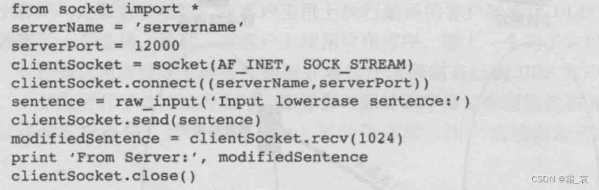

tcp服务端代码：

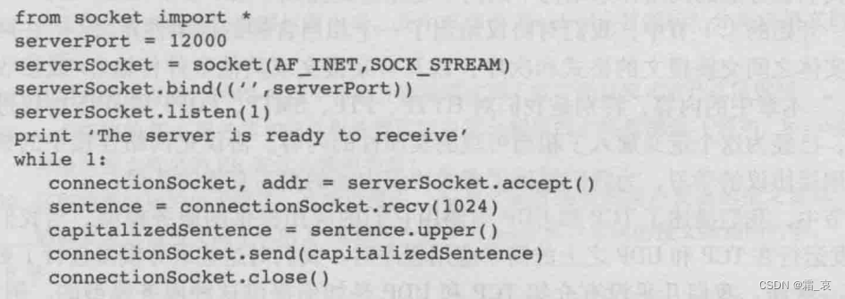

## MAC地址、IP地址

有IP没MAC——>ARP

有MAC没IP------DHCP时会有这种情况，否则，没有IP会找不到目的地

## cookie,session,token

### 1 概述

我们都知道 [HTTP 协议](https://zhida.zhihu.com/search?content_id=228431327&content_type=Article&match_order=1&q=HTTP+协议&zhida_source=entity)是[无状态](https://zhida.zhihu.com/search?content_id=228431327&content_type=Article&match_order=1&q=无状态&zhida_source=entity)的，所谓的无状态就是客户端每次想要与服务端通信，都必须重新与服务端链接，意味着请求一次客户端和服务端就连接一次，下一次请求与上一次请求是没有关系的。

这种无状态的方式就会存在一个问题：如何判断两次请求的是同一个人？就好比用户在页面 A 发起请求获取个人信息，然后在另一个页面同样发起请求获取个人信息，我们如何确定这俩个请求是同一个人发的呢？

为了解决这种问题，我们就迫切需要一种方式知道发起请求的客户端是谁？此时，cookie、token、[session](https://zhida.zhihu.com/search?content_id=228431327&content_type=Article&match_order=1&q=session&zhida_source=entity) 就出现了，它们就可以解决客户端标识的问题，在扩大一点就是解决权限问题。

它们就好比让每个客户端或者说登录用户有了自己的身份证，我们可以通过这个身份证确定发请求的是谁！

### 2 什么是cookie

#### 2.1 概念

[Cookie](https://zhida.zhihu.com/search?content_id=228431327&content_type=Article&match_order=1&q=Cookie&zhida_source=entity) 是一种在客户端存储数据的技术，它是由服务器发送给客户端的小型文本文件，存储在客户端的浏览器中,大小限制大致在 4KB 左右。在客户端发送请求时，浏览器会自动将相应的 Cookie 信息发送给服务器，服务器通过读取 Cookie 信息，就可以判断该请求来自哪个客户端。Cookie 可以用于存储用户的登录状态、购物车信息等。

在以前很多开发人员通常用 cookie 来存储各种数据，后来随着更多浏览器存储方案的出现，cookie 存储数据这种方式逐渐被取代，主要原因有如下:

1、cookie 有存储大小限制，4KB 左右。

2、浏览器每次请求会携带 cookie 在请求头中。

3、字符编码为 Unicode，不支持直接存储中文。

4、数据可以被轻易查看。

#### 2.2 cookie的主要属性

| 属性名     | 描述                                                         |
| ---------- | ------------------------------------------------------------ |
| name       | cookie 的名称                                                |
| value      | cookie 的值                                                  |
| comment    | cookie 的描述信息                                            |
| domain     | 可以访问该 cookie 的域名                                     |
| expires    | cookie 的过期时间，具体某一时间                              |
| maxAge     | cookie 的过期时间                                            |
| path       | cookie 的使用路径                                            |
| secure     | cookie 是否使用安全协议传输，比如 SSL 等                     |
| version    | cookie 使用的版本号                                          |
| isHttpOnly | 指定该 Cookie 无法通过 JavaScript 脚本拿到，比如 Document.cookie 属性、XMLHttpRequest 对象和 Request API 都拿不到该属性。这样就防止了该 Cookie 被脚本读到，只有浏览器发出 HTTP 请求时，才会带上该 Cookie。 |

#### 2.3 使用流程

那么我们是如何通过 cookie 来实现用户确定或者权限的确定呢？看下图：

接下来说说大体流程

1. 客户端发送请求到服务端（比如登录请求）。
2. 服务端收到请求后生成一个 session 会话。
3. 服务端响应客户端，并在响应头中设置 Set-Cookie。Set-Cookie 里面包含了 sessionId，它的格式如下：Set-Cookie: value[; expires=date][; domain=domain][; path=path][; secure]。其中 sessionId 就是用来标识客户端的，类似于去饭店里面，服务员给你一个号牌，后续上菜通过这个号牌来判断上菜到哪里。
4. 客户端收到该请求后，如果服务器给了 Set-Cookie，那么下次浏览器就会在请求头中自动携带 cookie。
5. 客户端发送其它请求，自动携带了 cookie，cookie 中携带有用户信息等。
6. 服务端接收到请求，验证 cookie 信息，比如通过 sessionId 来判断是否存在会话，存在则正常响应。

#### 2.4cookie 主要特点

1. cookie 存储在客户端
2. cookie 不可跨域，但是在如果设置了 domain，那么它们是可以在一级域名和二级域名之间共享的。

### 3 **什么是 session**

#### **3.1 概念**

session 由服务端创建，当一个请求发送到服务端时，服务器会检索该请求里面有没有包含 sessionId 标识，如果包含了 sessionId，则代表服务端已经和客户端创建过 session，然后就通过这个 sessionId 去查找真正的 session，如果没找到，则为客户端创建一个新的 session，并生成一个新的 sessionId 与 session 对应，然后在响应的时候将 sessionId 给客户端，通常是存储在 cookie 中。如果在请求中找到了真正的 session，验证通过，正常处理该请求。

每一个客户端与服务端连接，服务端都会为该客户端创建一个 session，并将 session 的唯一标识 sessionId 通过设置 Set-Cookie 头的方式响应给客户端，客户端将 sessionId 存到 cookie 中。

#### 3.2 流程图

通常情况下，cookie 和 session 都是结合着来用，当然你也可以单独只使用 cookie 或者单独只使用 session，这里我们就将 cookie 和 session 结合着来用。如下图，具体流程介绍看上面cookie流程即可。

#### 3.2 与cookie的区别

cookie 和 session，它们两者之间主要是通过 sessionId 关联起来的，所以总结出：sessionId 是 cookie 和 session 之间的桥梁。

session 是基于 cookie 实现的，它们两个主要有以下特点：

1. session 比 cookie 更加安全，因为它是存在服务端的，cookie 是存在客户端的。
2. cookie 只支持存储字符串数据，session 可以存储任意数据。
3. cookie 的有效期可以设置较长时间，session 有效期都比较短。
4. session 存储空间很大，cookie 有限制。

系统想要实现鉴权，可以单独使用 cookie，也可以单独使用 session，但是建议结合两者使用。

### 4 **token 是什么**

#### **4.1 概念**

[Token](https://zhida.zhihu.com/search?content_id=228431327&content_type=Article&match_order=1&q=Token&zhida_source=entity) 是一种在客户端和服务端之间传递身份信息的方式。当用户登录成功后，服务端会生成一个 Token，将其发送给客户端。客户端在后续的请求中，需要将 Token 携带在请求头或请求参数中。服务端通过验证 Token 的合法性，就可以确定该请求来自哪个用户，并且可以根据用户的权限进行相应的操作。Token 可以有效地避免了 Cookie 的一些安全问题，比如 [CSRF 攻击](https://zhida.zhihu.com/search?content_id=228431327&content_type=Article&match_order=1&q=CSRF+攻击&zhida_source=entity)。

#### 4.2 token的组成

Token是一个由一串字符组成的令牌，用于在计算机系统中进行身份验证和授权。它通常由三个部分组成：标头、有效载荷、签名。

1. 标头（Header）：包含了算法和类型，用于指定如何对有效载荷进行编码和签名。常用的算法有[HMAC](https://zhida.zhihu.com/search?content_id=228431327&content_type=Article&match_order=1&q=HMAC&zhida_source=entity)、[RSA](https://zhida.zhihu.com/search?content_id=228431327&content_type=Article&match_order=1&q=RSA&zhida_source=entity)、[SHA](https://zhida.zhihu.com/search?content_id=228431327&content_type=Article&match_order=1&q=SHA&zhida_source=entity)等。
2. 有效载荷（Payload）：包含了一些信息，如用户ID、角色、权限等，用于验证身份和授权。有效载荷可以是加密的，也可以是明文的。
3. 签名（Signature）：是对标头和有效载荷进行签名后得到的值，用于验证token的完整性和真实性。签名通常使用私钥进行签名，并使用公钥进行验证。

一个完整的token包含了标头、有效载荷和签名三个部分，它们一起构成了一个安全的令牌，用于进行身份验证和授权。

#### 4.3 token认证流程

1. 客户端发起登录请求，比如用户输入用户名和密码后登录。
2. 服务端校验用户名和密码后，将用户 id 和一些其它信息进行加密，生成 token。
3. 服务端将 token 响应给客户端。
4. 客户端收到响应后将 token 存储下来。
5. 下一次发送请求后需要将 token 携带上，比如放在请求头中或者其它地方。
6. 服务端 token 后校验，校验通过则正常返回数据。

看下图:

### 5 三者对比

cookie、session、token三者最终的目的都是一样：鉴权和认证，下面使用表格的方式直观的描述下三者的优缺点。

| 方式    | 特点                                                    | 优点                                                         | 缺点                                                         |
| ------- | ------------------------------------------------------- | ------------------------------------------------------------ | ------------------------------------------------------------ |
| cookie  | 1.存储在客户端。2.请求自动携带 cookie。3.存储大小 4KB。 | 1.兼容性好，因为是比较老的技术。2.很容易实现，因为 cookie 会自动携带和存储。 | 1.需要单独解决跨域携带问题，比如多台服务器如何共享 cookie。2.会遭受 CSRF 攻击。3.存储在客户端，不够安全。 |
| session | 1.存储在服务端。2.存储大小无限制。                      | 1.查询速度快，因为是个会话，相当于是在内存中操作。2.结合 cookie 后很容易实现鉴权。3.安全，因为存储在服务端。 | 1.耗费服务器资源，因为每个客户端都会创建 session。2.占据存储空间，session 相当于存储了一个完整的用户信息。 |
| token   | 1.体积很小。2.自由操作存储在哪里。                      | 1.安全，因为 token 一般只有用户 id，就算被截取了也没什么用。2.无需消耗服务器内存资源，它相当于只存了用户 id，session 相当于存储了用户的所有信息。3.跨域处理较为方便，比如多台服务器之间可以共用一个 token。 | 1.查询速度慢，因为 token 只存了用户 id，每次需要去查询数据库。 |

总结下来就是session 是空间换时间，token 是时间换空间。

# 2、应用层

## 套接字(socket)

套接字是同一台主机内==应用层与运输层==之间的接口。由于该套接字是建立网络应用程序的可编程接口，因此套接字也称为应用程序和网络之间的==应用编程接口==（Application Programming Interface, ==API== ).

应用程序开发者对于传输层的控制仅限于：                   

1. 选择运输层协议
2. 也许能设定几个运输层参数，如最大缓存和最大报文段长度等

在网络中通过IP地址来标识和区别不同的主机，通过端口号来标识和区分一台主机中的不同应用进程，端口号拼接到IP地址即构成套接字。在网络中采用发送方和接收方的套接字来识别端点。套接字，实际上是一个通信端点，即 ==套接字（Socket）=（IP地址：端口号）== 它唯一地标识网络中的一台主机上的一个应用进程。

在网络通信中，主机A发给主机B的报文包含目的端口号和源端口号，源端口号是“返回地址”的一部分，即当主机B需要发回一个报文给主机A时，主机B到主机A的报文中的目的端口号便是主机A到主机B的报文中的源端口号（完全的返回地址是主机A的IP地址和源端口号）。

## DNS：因特网的目录服务

DNS：域名系统（Domain Name System）

DNS是：

1. 一个由分层的**DNS服务器（DNS server）**实现的==分布式数据库==。
2. 一个使得主机能够查询分布式数据库的==应用层协议==。

DNS服务器通常是运行BIND软件的UNIX机器。DNS协议运行在UDP之上，使用53号端口

### 提供的服务

1. 将用户提供的主机名解析为IP地址
2. 主机别名：应用程序可以调用DNS来获得主机别名对应的规范主机名以及主机的IP地址
3. 邮件服务器别名：MX记录允许一个公司的邮件服务器和web服务器使用相同（别名化）的主机名。
4. 负载分配：使一个IP地址集合与同一个规范主机名相联系（DNS数据库中存储着这些IP地址集合。当客户对映射到某地址集合的名字发出一个DNS请求时，该服务器用IP地址的整个集合进行响应，但在每个回答中循环这些地址次序。因为客户通常向IP地址排在最前面的服务器发送HTTP请求报文，所以DNS就在所有这些冗余的web服务器之间循环分配了负载。

### 工作机理

#### 1.分布式、层次数据库

假设一个DNS客户要确认主机名www.amazon.com的IP地址，将发生以下事件

- **根DNS服务器**：客户与根服务器之一联系，返回顶级域名com的TLD服务器的IP地址
- **顶级域（Top-Level Domain，TLD）DNS服务器**：与这些TLD服务器之一联系，它将为amazon.com返回权威服务器的IP地址
- **权威DNS服务器**：与amazon.com权威服务器之一联系，它为主机名www.amazon.com返回其IP地址。（在因特网上具有公共可访问主机的每个组织机构必须提供公共可访问的DNS记录，这些记录将这些主机的名字映射为IP地址。一个组织的权威DNS服务器收藏了这些DNS记录。）

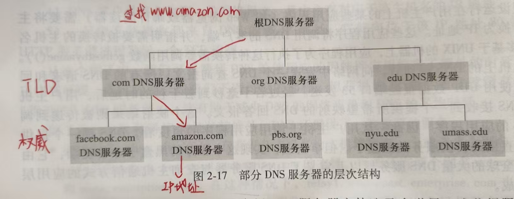

**本地DNS服务器**：严格来讲，一个本地DNS服务器并不属于该服务器的层次结构。每个ISP都有一台本地DNS服务器（也叫默认名字服务器）。当主机发出DNS请求时，该请求被发往本地DNS服务器，它起着代理的作用，并将该请求转发到DNS服务器层次结构中。

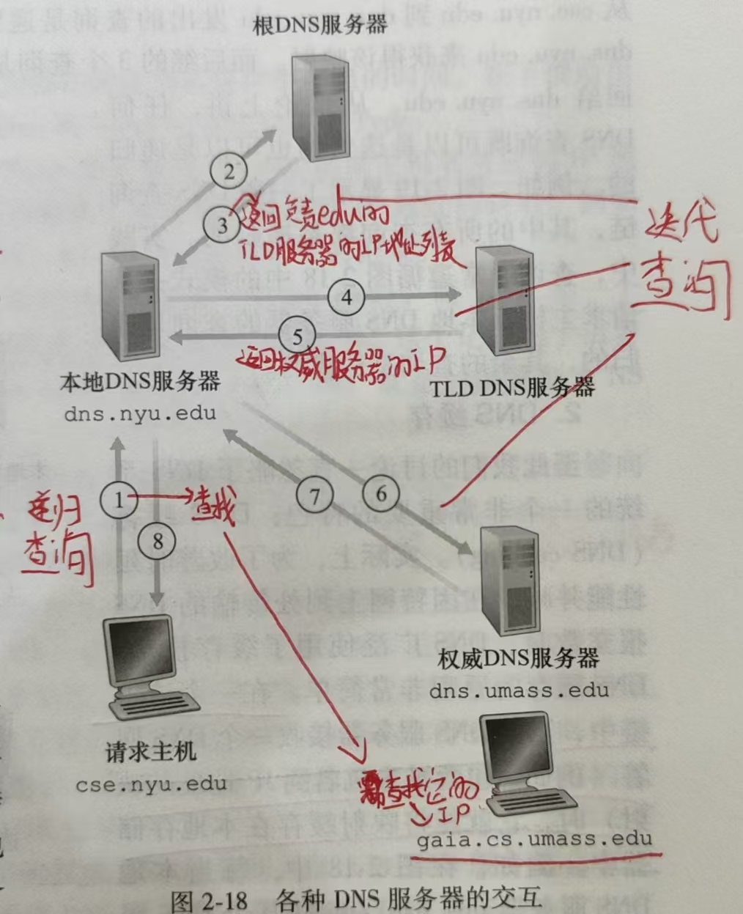

**DNS缓存**：在一个请求链中，当某DNS服务器接收一个DNS回答时，它就能将映射缓存到==本地DNS服务器==中。（能直接缓存主机IP地址，也能缓存TLD服务器的IP地址，因而允许本地DNS服务器绕过查询链中的根DNS服务器。

### DNS记录

资源记录：（Resource Record，RR），RR提供了主机名到IP地址的映射。

资源记录是一个包含下列字段的四元组：

**（Name，Value，Type，TTL）**
TTL是该记录的生存时间。在下面例子中，将忽略TTL字段。

- Type=A  <u>Name是主机名，Value是该主机名对应的IP地址</u>。eg. (relay1.bar.foo.com, 145.37.93.126, A)
- Type=NS  <u>Name是域（如foo.com），Value是一个知道如何获得该域中主机IP地址的权威DNS服务器的主机名</u>。(foo.com, dns.foo.com, NS)
- Type=CNAME  <u>Name是主机别名，Value是规范主机名</u>。(foo.com, relay1.bar.foo.com, CNAME)
- Type=MX  <u>Name是邮件服务器的别名，Value是规范主机名</u>。通过使用MX记录，一个公司的邮件服务器其他服务器（如它的web服务器）可以使用相同的别名。为了获得邮件服务器的规范主机名，使用MX记录；为了获得其他服务器的规范主机名，使用CNAME记录。

# 3、传输层

## 概述

运输层协议为运行在不同主机上的应用进程之间提供了==逻辑通信==功能。

UDP和TCP的<u>基本责任</u>：将两个端系统间IP的交付服务扩展为运行在端系统上的两个进程之间的交付服务。将主机间交付扩展到进程间交付被称为运输层的<u>多路复用</u>和<u>多路分解</u>。

## 端口

### 关于端口的误解

误解一：一个端口只能建立一个TCP连接。事实上Linux内核对TCP连接的识别是**通过四元组来区分**，即（源ip，源port，目标ip，目标port）。这个四元组只要任意一个不同，就是完全不同的连接！所以说，只要建立的连接是不同的，一个端口是可以建立多个TCP连接的！

误解二：客户端connect建立的端口不可重用。在一篇讨论这个问题的知乎专栏中作者说“当Linux作为客户端建立连接的时候，最大连接数量是受内核参数net.ipv4.ip_local_port_range限制 ip_local_port_range是可配置的，最大理论范围是0-65535”。更准确的说：**对于有1个Ip的客户端来说，受限于ip_local_port_range参数，也受限于65535。但单Linux可以配置多个ip，有几个ip，最大理论值就翻几倍**

### 端口作用

端口能让应用层的各种进程将其数据通过端口向下交付给传输层，以及让传输层知道应当将其报文段中的数据向上通过端口交付给应用层相应的进程。端口在传输层的作用类似于IP地址在网络层的作用，只不过IP地址标识的是主机，而端口标识的是主机中的应用进程。

数据链路层的服务访问点为帧的“类型”字段，网络层的服务访问点为IP数据报的“协议”字段，传输层的服务访问点为“端口号”字段，应用层的服务访问点为“用户界面”。

在协议栈层间的抽象的协议端口是软件端口，它与路由器或交换机上的硬件端口是完全不同的概念。硬件端口是不同硬件设备进行交互的接口，而软件端口是应用层的各种协议进程与传输实体进行层间交互的一种地址。传输层使用的是软件端口。

### 端口号

应用进程通过端口号进行标识，端口号长度为16比特，能够表示65536（2^16^）个不同的端口号。端口号只具有本地意义，即端口号只标识本计算机应用层中的各进程，在因特网中不同计算机的相关端口号是没有联系的。根据端口号范围可将端口分为两类：

1. 服务器使用的端口号。它又分为两类，最重要的一类是*熟知端口号*，数值为0\~1023，IANA（互联网地址指派机构）把这些端口号指派给了TCP/IP最重要的一些应用程序，让所有的用户都知道。另一类称为*登记端口号*，数值为1024\~49151,它是供给没有熟知端口号的应用程序使用的，使用这些端口号必须在IANA登记，以防止重复。

   一些常用的熟知端口号如下：

   | 应用程序     | FTP  | TELNET | SMTP | DNS  | TFTP | HTTP | SNMP |
   | ----------------- | ------ | ------------ | --------- | -------- | -------- | -------- | --------- |
   | 熟知端口号 | 21   | 23           |     25    |    53   |    69   |    80   |    161  |

2. 客户端使用的端口号，数值为49152\~65535。因为这类端口号仅在客户进程运行时才动态地选择，所以又称*短暂端口号*。当服务器进程收到客户进程的报文时，就知道了客户进程所使用的端口号，因而可以把数据发给客户进程。通信结束后，刚用过的客户端口号就不复存在，这个端口号就可以供其他客户进程使用。

### 端口与名称服务(naming service)

广义上讲,端口层也可以视作一个 ==naming service(名称服务)==, 这与比如 [spring cloud](https://zhida.zhihu.com/search?content_id=138306798&content_type=Article&match_order=1&q=spring+cloud&zhida_source=entity) 中的 eureka 里的机制本质上是一样的, 只是这个 name 就是一个抽象的数字, 比如 80. 80 就代表了一个 web 服务, Nginx 之类的 web server 绑定并监听就相当于把自身提供的 web 服务注册于其上.

> [DNS 域名系统](https://zhida.zhihu.com/search?content_id=138306798&content_type=Article&match_order=1&q=DNS+域名系统&zhida_source=entity)其实也是 naming service, 你通过 [http://xiaogd.net](https://link.zhihu.com/?target=http%3A//xiaogd.net) 这个名字(name), 就能获取到我所提供给你的网页服务.
> 类似的还有 java 里的 [JNDI](https://zhida.zhihu.com/search?content_id=138306798&content_type=Article&match_order=1&q=JNDI&zhida_source=entity) 等, 把一个名字与一个服务关联起来, 比如一个名字就代表一个数据源(数据库连接)之类的.

### 端口与 IoC(控制反转)

广义上, 端口的上述机制也是==控制反转== ==(Ioc==: Inversion of Control)思想的一种体现, 如果客户端需要知道服务端的进程 ID, 实际上就被服务端控制了, 毕竟我服务端在哪个 ID 上提供服务, 你就得把你的请求发到相应的 ID 上来;

而有了端口这一中间层呢? 作为客户端, 总是把请求发到对应端口上, 并要求服务端绑定并监听那些端口以及作出响应, 你服务端是反过来被我客户端所控制, 我客户端发到哪个端口, 你服务端就要去相应端口上监听并响应.

> 大家可以体会一下这种转变. 这种设计或思想在编程领域其实是特别重要的, 在很多其它地方都有体现.

​	因为浏览器总是把 web 请求发到了 80 或 443 端口, 这就要求一个 web server 进程去监听这些端口. 比如在我的服务器上, web server 是 Nginx, 它启动之后就会去监听 80 和 443 端口, 任何想要访问我的主页的人, 并不需要知道我的 Nginx 进程 ID 是啥, 借助于端口这一间接层, 你就能够与我的 Nginx 进程通讯, 并获取你想要的东西.

> 事实上你可以这么认为, 浏览器实际上只是在与端口通讯, 端口层再把这些请求委托(delegate)或代理(proxy)给相应的 web server 去处理, 端口的角色就是一个中间人, 一个间接层.

### 端口与 TCP/UDP 协议

前面一直在说, 什么 3306 端口, 80 端口, 443 端口, 其实严格来说, 端口是分 TCP 端口和 UDP 端口的, 不过多数时候遇到的都是 TCP 端口, 但 TCP 80 端口和 UDP 80 端口是不同的端口.

> UDP 的 80 端口, 包括 443 端口其实被保留了, 目前的 http 协议只构建在 TCP 协议之上.
> 当然, 理论上讲, 在 UDP 上构建 http 也不能说就完全不行, 毕竟, 无论 UDP 还是 TCP 都是构建在 IP 协议之上, 总之呢, 计算机的世界没什么是不可能的, 而且似乎真有人在做这些尝试, 不过这就属于两小母牛对屁股--比较牛逼的范畴了, 深水区了, 咱也不懂, 不多说了.

还有一点, 对于进程间的端口通讯, 实际上是对称的, 也即是说, 服务器的响应也是先回到一个客户端的端口上.

> 如果你用 Windows 10 系统, 可以在 任务管理器 > 性能 > 打开资源监视器 > 网络 > TCP 连接, 点击下远程端口可以按照从小到大排列, 通常就可以看到 443 的相关连接了, 可以看到左边有一栏本地端口, 一个 TCP 连接总是有一个远程端口, 一个本地端口:

当发起一个 TCP 连接时, 客户端首先自己先随机挑选一个没有被使用的端口作为服务器响应的接收端口, 比如 38672. 在一个 TCP 的包里, 无论是握手包还是后续的数据包, 包头部分最重要的两个字段, 一个就是源端口(source port), 比如 38672; 另一个就是目标端口(destination port), 比如 80, 或者 443.

> 可以这样看, 服务器的响应也是先回到源端口, 比如 38672 上, 源端口再转给最终的进程, 比如浏览器.

而对于一个 IP 包, 同样的, 包头部分最重要的两个字段, 一个就是源IP(source IP); 另一个就是目标 IP(destination IP).

> 而 TCP 包会作为 IP 包的数据包被打包到 IP 包里面, 也一个 IP 包里其实包含了 IP + 端口.

IP 加端口再加上端口与进程间的关联, 分属两个不同主机间的进程就能通过 TCP(UDP)/IP 协议愉快地进行进程间的通讯(IPC)了.

> 当然了, 同一个主机间的进程也同样可以利用这套机制. 但同一个主机间还可以有其它选择, 这个具体看各个操作系统是否提供相关机制及支持. 而 TCP/IP 属于广泛应用的标准协议, 从而得到了广泛支持.

## UDP

### 什么应用适合用UDP

- 对最小速率有要求，不希望过分地延迟报文段的传送，且能容忍一些数据丢失
- 无须连接建立
- 无连接状态（eg. 接收和发送缓存、拥塞控制参数以及序号与确认号的参数）
- 分组首部开销小（TCP 20字节首部开销，UDP 8字节）

### UDP报文段结构

### UDP检验和

回卷：进位溢出的数字加到末尾（作用：使得“先求反再求和”于“先求和再求反”所得结果一致。

发送方的UDP对报文段中的所有16比特字的和进行反码运算，求和时遇到的任何溢出都被回卷。得到的结果被放在UDP报文段中的检验和字段。

在接收方，全部的16比特字（包括校验和）加在一起。如果没有差错，则和为1111 1111 1111 1111。如果不是，说明出现错误。

## 可靠数据传输协议

### 回退N步（GBN）

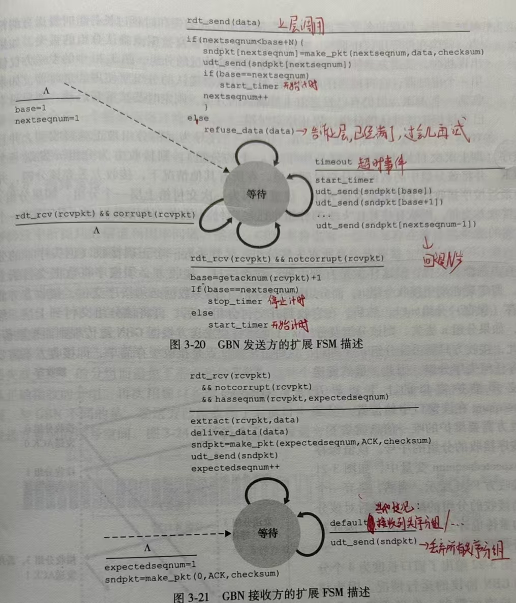

### 选择重传（SR）

#### SR发送方的事件与操作

1. *从上层收到数据。*当从上层接收到数据后，SR发送方检查下一个可用于该分组的序号。如果序号位于发送方的窗口内，则将数据打包并发送；否则就像GBN中一样，要么将数据缓存，要么将其返回给上层以便以后传输。
2. *超时。*定时器再次被用来防止丢失分组。然而，现在每个分组必须拥有自己的逻辑定时器，因为超时发生后只能发送一个分组。可以使用单个硬件定时器模拟多个逻辑定时器的操作。
3. *收到ACK。*如果收到ACK，倘若该分组序号在窗口内，则SR发送方将那个被确认的分组标记为已接收。如果该分组的序号等于send_base，则窗口基序号向前移动到具有最小序号的未确认分组处。如果窗口移动了并且有序号落在窗口内的未发送分组，则发送这些分组。

#### SR接收方的事件与操作

1. *序号在[rcv_base, rcv_base+N-1]内的分组被正确接收。*在此情况下，收到的分组落在接收方的窗口内，一个选择ACK被回送给发送方。如果该分组以前没收到过，则缓存该分组。如果该分组的序号等于接收窗口的基序号，则该分组以及以前缓存的序号连续的（起始于rcv_base的）分组交付给上层。然后，接收窗口按向前移动分组的编号向上交付这些分组。举例子来说，考虑图3-26。当收到一个序列号为rcv_base=2的分组时，该分组及分组3、4、5可被交付给上层。
2. *序号在[rcv_base-N,rcv_base-1]内的分组被正确收到。*在此情况下，必须产生一个ACK，即使该分组是接收方以前确认过的分组。
3. *其他情况。*忽略该分组。

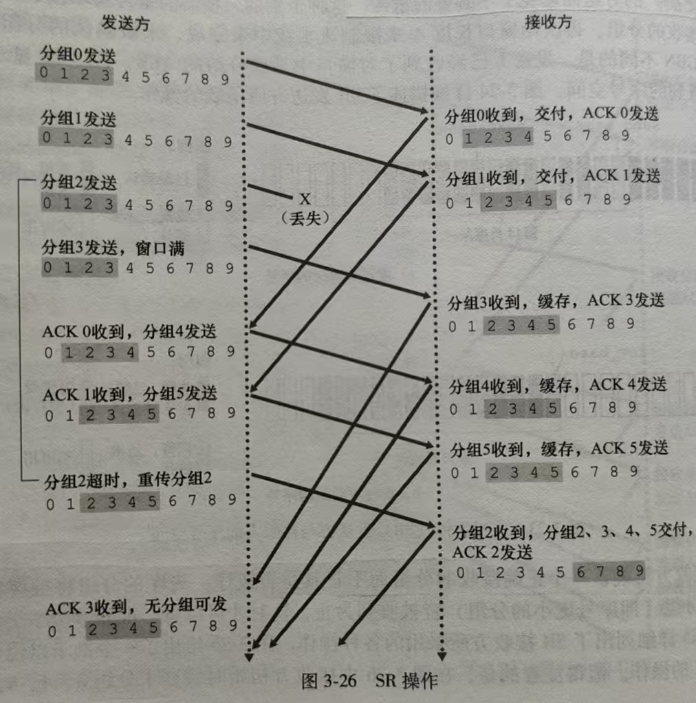

注：窗口长度必须小于或等于序号空间大小的一半。

## TCP

TCP有一个32比特的序号字段，其中的TCP序号是按字节流中的字节进行基数的，而不是按分组计数

### TCP特点

- TCP是面向连接的

### TCP连接管理

#### 1.三次握手

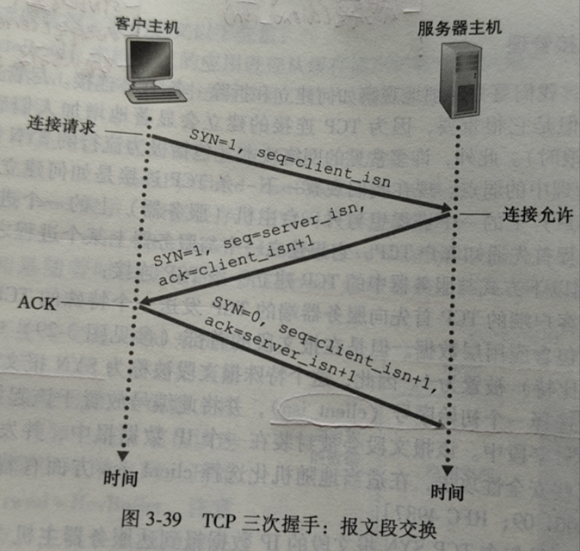

- 第一步：客户端的TCP向服务端TCP发送**SYN报文段**。客户会随机选择一个初始序列号（client_isn）。

- 第二部：服务器主机收到后，为该TCP连接分配TCP缓存和变量（SYN洪泛！），向客户发送**SYNACK报文段**。其中，SYN比特被置1，确认号字段被置为client_isn+1，服务器选择自己的初始序号（server_isn）。表明，我收到了你发起建立连接的SYN分组

#### 2. 关闭连接

### 拥塞控制

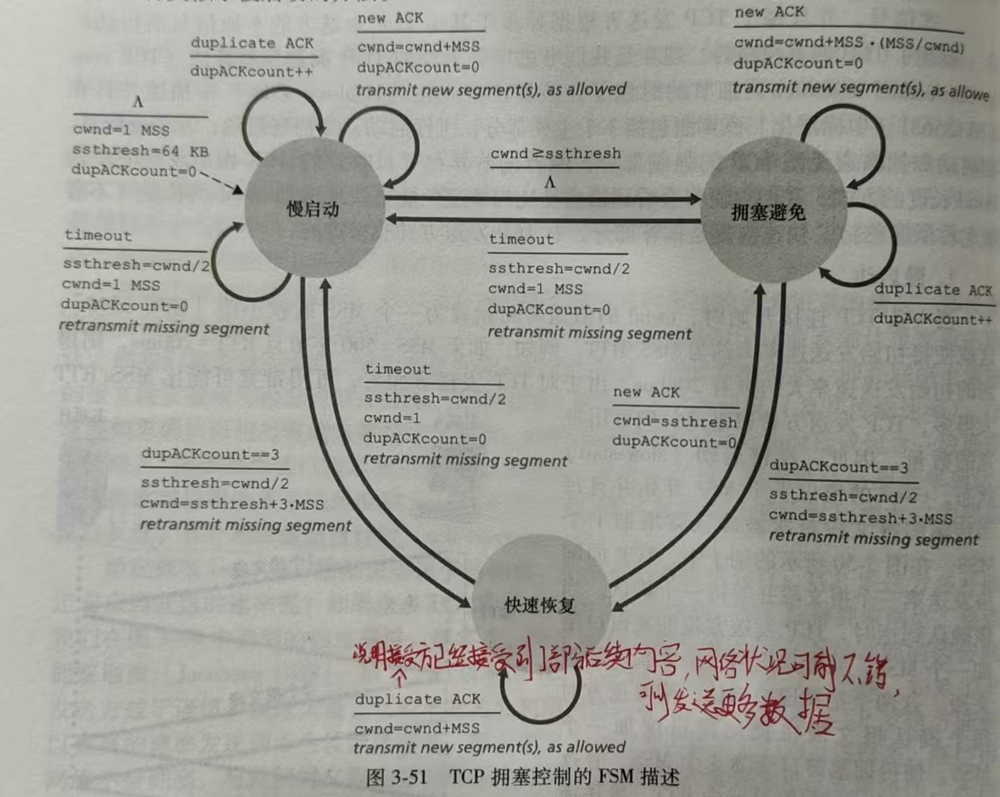

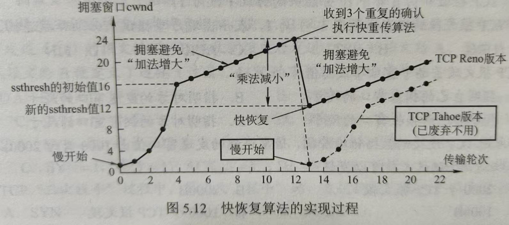

# 4\5.网络层

## 网络层概述

### 网络层功能

- 转发（数据平面）：指将分组从一个输入链路接口转移到适当的输出链路接口的路由器本地操作。转发在很短的时间尺寸（通常为几纳秒）发生，因此常用硬件实现。
- 路由选择（控制平面）：指确定分组从源目的地所采取的端到端路径的网络范围处理过程。路由选择在长得多的时间尺度（通常为几秒）发生，因此通常用软件实现。

二者关系：路由选择算法决定了插入路由器转发表的内容。

### 分组交换机定义

分组交换机：指一台通用分组交换设备，它根据分组首部字段中的值，从输入链路接口到输出链路接口转移分组。某些分组交换机称为**链路层交换机（link-layer switch)**，基于链路层帧中的字段值做出转发决定；其他分组交换机称为**路由器（router）**。

### SDN定义

软件定义网络（Software-Defined Networking, ==SDN==): 一种控制平面方法。路由选择设备仅执行转发，而远程控制器计算并分发转发表。计算转发表并与路由器交互的控制器是用软件实现的。

## 路由器工作原理

下图是通用路由器体系结构的总体视图。

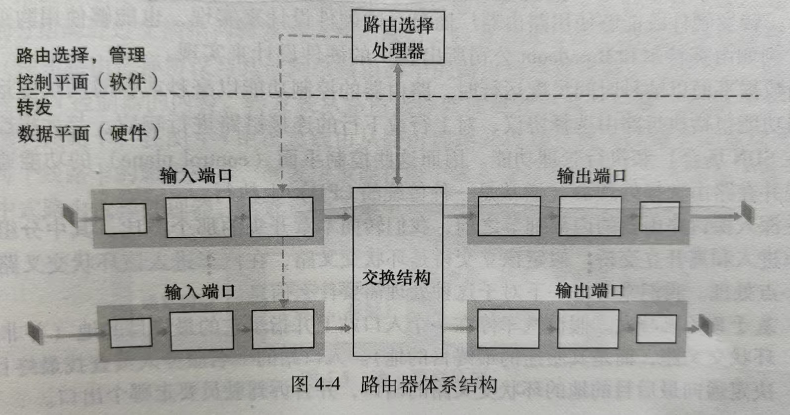

路由器的四个组件：

- 输入端口
- 交换结构
- 输出端口
- 路由选择处理器

### 输入端口处理和基于目的地转发

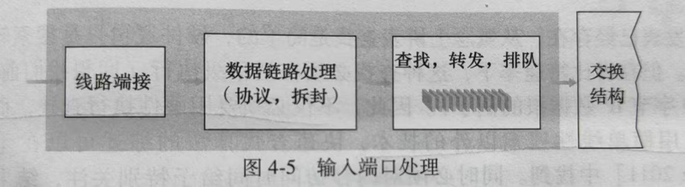

目的地转发的特征：

- 查找目的IP的地址（”匹配“）

- 将分组发送到有特定输出端口的交换结构（”操作“）

  

#### 转发表定义

在每个路由器中，路由器检查到达分组首部的一个或多个字段值，进而使用这些首部值在其转发表中索引，通过这种方式来转发分组。这些值对应存储在转发表项中的值，指出了该分组将被转发的路由器的输出链路接口。

| 前缀匹配    | 链路接口 |
| ----------- | -------- |
| 010000110   | 3        |
| 10010100110 | 2        |
| 10111       | 1        |
| ...         | ...      |

#### 转发表内容怎么形成

1. 由路由选择处理器计算和更新（使用路由选择协议与其他网络路由器中的路由选择器进行交互）
2. 接收来自远程SDN控制器的内容

#### 查找规则

路由器用分组目的地址的前缀与该表中的表项进行匹配，使用**最长前缀匹配**规则。

#### 如何实现查找？

这种查找必须在纳秒级执行。因此，不仅要用硬件执行查找，而且需要对大型转发表使用简单线性搜索以外的技术。

#### 输入端口的其他操作

尽管“查找”在输入端口处理中可认为是最为重要的操作，但必须采取许多其他操作：

1. 必须出现物理层和链路层处理
2. 必须检查分组的版本号、检验和以及寿命字段，并且重写后两个字段
3. 必须更新用于网络管理的计数器（如接收到的IP数据报的数目）

### 交换

不同的交换方式：

- 经内存交换：早期，在CPU（路由选择处理器）的直接控制下完成；现代，目的地址的查找和将分组存储（交换）进适当的内存存储位置是由输入线路卡来处理的
- 经总线交换。
- 经互联网络交换。非阻塞的。

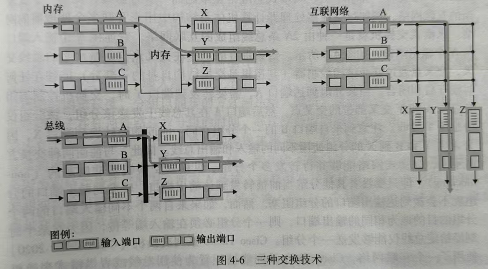

### 输出端口处理

输出端口处理取出已经存放在输出端口内存中的分组并将其发送到输出链路上。

## 网际协议

### IPv4数据报格式

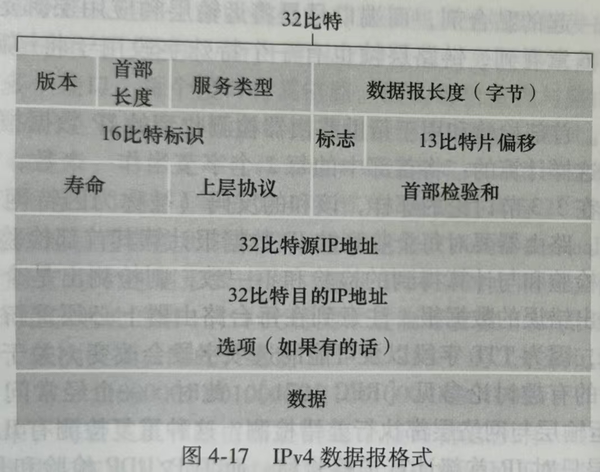

### IPv4编址

#### 主机与路由器接入网络的方法

主机通常只有一条链路连接到网络，当主机中的IP想发送一个数据报时，它就该在链路上发送。主机与物理链路之间的边界就叫**接口（interface）**现在考虑一台路由器及其接口。路由器有两条或更多链路与它连接。路由器与它任意一条链路之间的边界也叫接口。

IP要求每台主机和路由器接口拥有自己的IP地址。从技术上讲，==一个IP地址与一个接口相关联==，而不是与包含该接口的主机或路由器相关联。

#### 点分十进制记法（dotted-decimal notation)

每个IP地址长度为32比特（4字节），地址中的每个字节用它的十进制形式书写，各字节间以句点隔开。

#### 子网

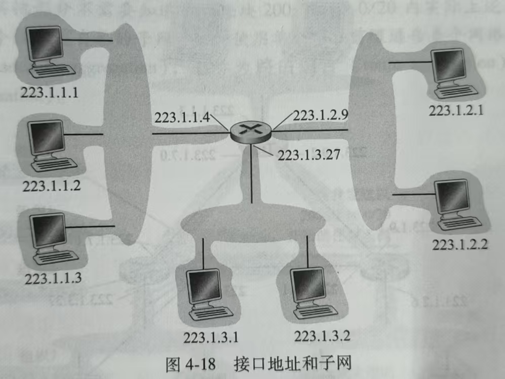

用IP的术语说，互联这3个主机接口与1个路由器接口的网络形成一个**子网（subnet)**。IP编址为这个子网分配一个地址223.1.1.0/24，其中的/24（slash-24）记法，有时称为**子网掩码（network mask）**，指示32比特中的最左侧24比特定义了子网地址。上图中有三个子网（223.1.1.0/24, 223.1.2.0/24, 233.1.3.0/24）。

##### 子网定义

为了确定子网，分开主机和路由器的每个接口，产生几个隔离的网络岛，使用接口端接这些隔离的网络中的端点。这些隔离的网络中的每一个都叫作一个子网（subnet）。

##### 无类别域间路由选择（Classless Interdomain Routing, CIDR）

一种地址分配策略，将子网寻址的概念一般化。形式为 a.b.c.d/x 的地址的x最高比特构成了IP地址的网络部分，常被称为该地址的**前缀（prefix）**。

##### 子网的分配

一个组织通常被分配一块连续的地址，即具有相同前缀的一段地址。

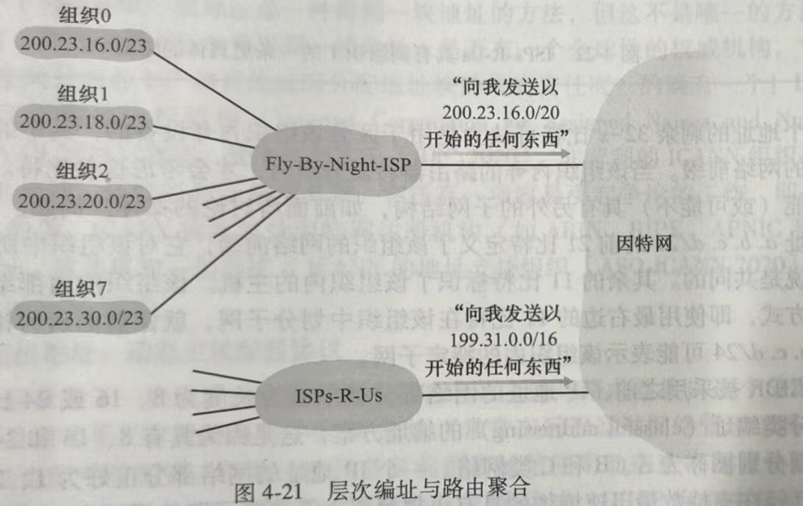

假设该ISP（Fly-By-Night-ISP）向外界通告，它应该发送所有地址的前20比特与200.23.16.0/20相符的数据报。外界的其他部分不需要知道在地址块200.23.16.0/20内实际上还存在8个其他组织，其中每个组织有自己的子网。这种使用单个网络前缀通告多个网络的能力通称为**地址聚合**（address aggregation），也称为**路由聚合**（route aggregation）或**路由摘要**（route summarization）。

把组织1与ISPs-R-Us相连，如下图。运用了**最大前缀匹配**。

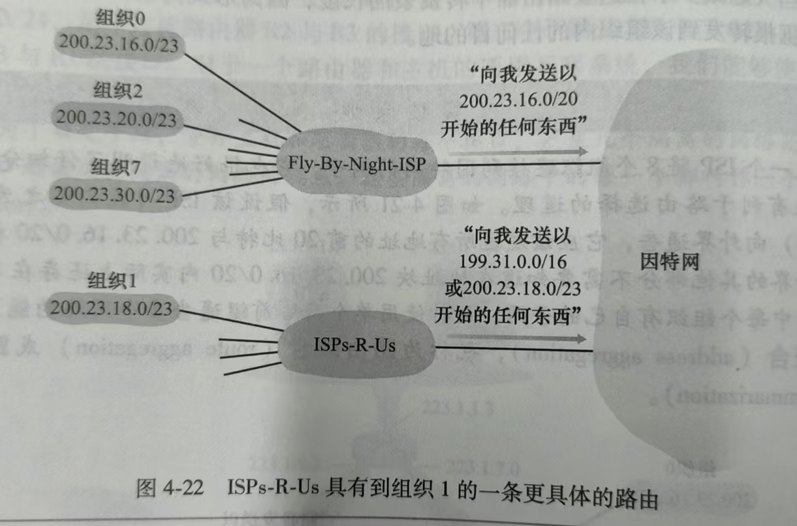

##### 其他编址方案

IP地址的网络部分被限制为长度为8、16或24比特，这种称为**分类编址**（classful addressing）的编址方案，这是因为具有8、16和24比特子网地址的子网分别被称为A、B和C类网络。

#### 广播地址

当一台主机发出一个目的地址为**255.255.255.255**的数据报时，该报文会交付给同一网络中的所有主机。路由器也会选择地向邻近的子网转发该报文。

#### 1.获取一块地址

- 从一个ISP获取一组地址

- 因特网名字和编号分配机构（Internet Corporation for Assigned Names and Numbers, ICANN）-> 作用：分配IP地址；管理DNS根服务器；分配域名与解决域名纷争。

  

#### 2.获取主机地址：动态主机配置协议（DHCP）

- 路由器中的IP地址通常由系统管理员手动配置
- 主机地址也能手动配置，但更多使用**动态主机配置协议（Dynamic Host Configuration Protocol，DHCP）**。

DHCP相关：

- 允许主机自动获取（被分配）一个IP地址。
- 网络管理员能配置DHCP，以使主机每次与网络连接时能得到一个相同的IP地址，或者某主机将被分配一个**临时的IP地址（temporary IP address)**。
- 允许主机得知其他信息，例如它的子网掩码、它的第一跳路由器地址（常称为默认网关）与它的本地DNS服务器的地址。
- DHCP具有将主机连接到一个网络的网络相关方面的自动化能力，故它又常被称为**即插即用协议（plus-and-play protocol）**或**零配置协议**（zeroconf）协议。

DHCP是一个客户-服务器协议。客户通常是新到达的主机。每个子网具有一台DHCP服务器或DHCP中继代理（通常是一台路由器，这个代理知道DHCP服务器的位置）。																																											

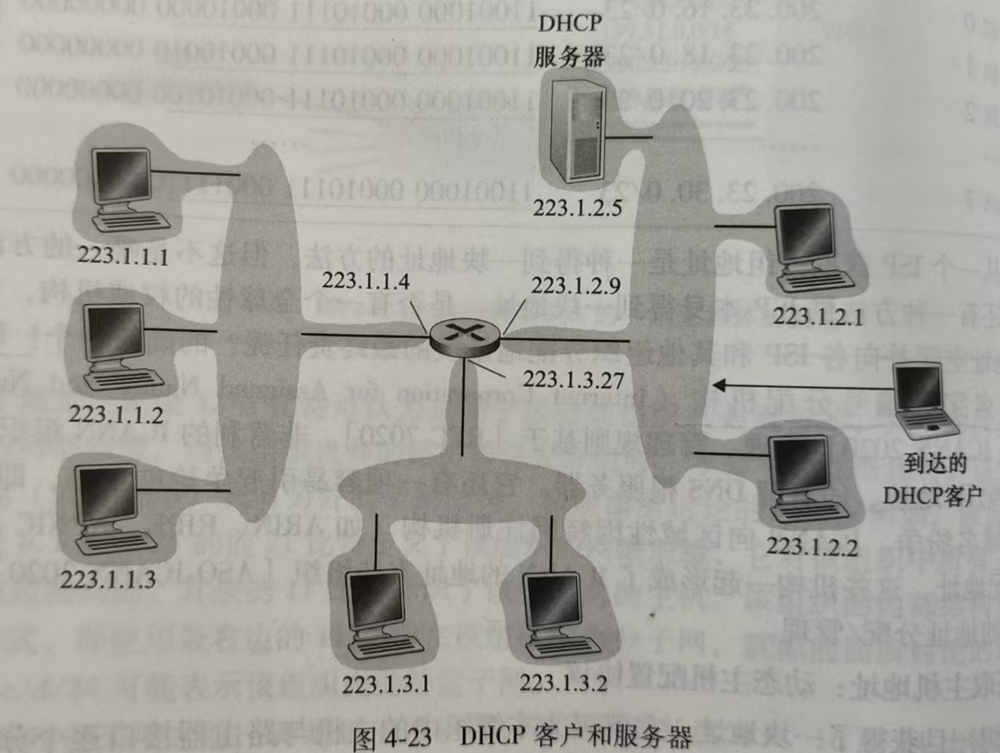

对于一台新到达的主机而言，DHCP是一个4个步骤的过程，如下图所示：

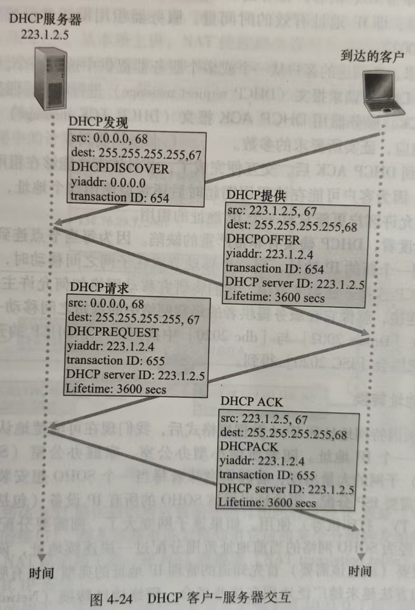

这4个步骤是：

1. **DHCP服务器发现**。一台新到达主机的首要任务是发现一个要与其交互的DHCP服务器，这可通过**DHCP发现报文**（DHCP discover message）来完成。DHCP客户生成包含DHCP发现报文的IP数据报，其中使用广播目的地址255.255.255.255并且使用“本主机”源IP地址0.0.0.0 。DHCP客户端将该IP数据报传递给链路层，链路层然后将该帧广播到所有与该子网连接的节点。

2. **DHCP服务器提供**。DHCP服务器收到一个DHCP发现报文时，用**DHCP提供报文**（DHCP offer message）向客户做出相应，该报文向该子网的所有节点广播，仍然使用IP广播地址255.255.255.255 。因为在子网中可能存在几个DHCP服务器，客户能在几个提供者之间进行选择

   > DHCP提供报文使用广播原因：
   >
   > - 客户端还未分配到正式ID。
   > - 应对多服务器情况。

3. **DHCP请求**。新到达的用户从一个或多个服务器中选择一个，并向选中的服务器提供用**DHCP请求报文**（DHCP request message）进行相应，回显配置的参数。
4. **DHCP ACK**。服务器用**DHCP ACK报文**对DHCP请求进行相应，证实所要求的参数。

### 网络地址转换（NAT）

SOHO：Small Office，Home Office

网络地址转换（Network Address Translation，NAT）

地址空间 10.0.0.0/8 时保留的三部分IP地址空间之一，这些地址用于家庭网络等**专用网络**或**具有专用地址的地域**（指其地址仅对该网络中的设备有意义的网络。

NAT路由器对外界的行为就如同一个具有<u>单一IP地址的单一设备</u>。

路由器从ISP的DHCP服务器得到它的地址，并且路由器运行一个DHCP服务器，为位于NAT-DHCP路由器控制的家庭网络地址空间中的计算机提供地址。

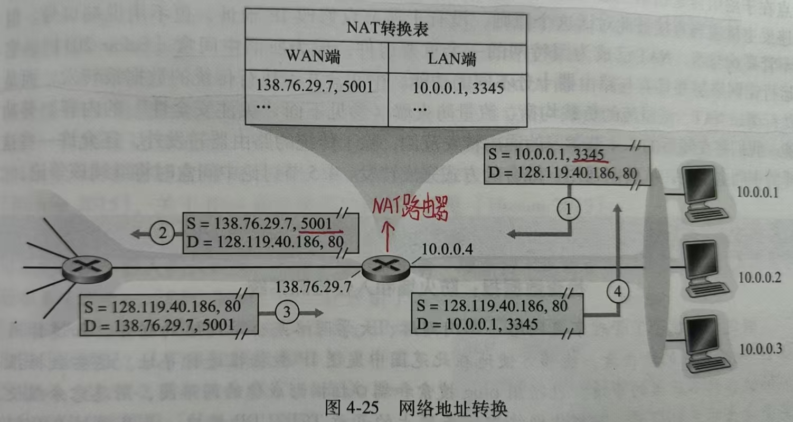

一个栗子：

如上图，假设一个用户坐在家庭网络主机10.0.0.1后

1. 请求IP地址为128.119.40.186的某台Web服务器（端口80）上的一个Web页面。主机10.0.0.1为其指派了（任意）源端口号3345并将该数据报发送到LAN中。
2. NAT路由器收到该数据报，为该数据报生成一个新的源端口号5001，将源IP替代为其广域网一侧接口的IP地址138.76.29.7，并将源端口3345更换为新端口5001 。当生成新端口号时，NAT路由器可选择任意一个当前未在NAT转换表中的源端口号。路由器中的NAT也在它的NAT转换表中增加一表项。
3. web服务器发回一个响应报文，其目的地址是NAT路由器的IP地址，其目的端口是5001
4. 该报文到达NAT路由器时，路由器使用目的IP地址与目的端口号从NAT转换表中检索出家庭网络浏览器使用的适当IP地址（10.0.0.1）和目的端口号（3345）。于是，路由器重写该数据报的目的地址与目的端口号，并向家庭网络转发该数据报

关于NAT的一些批评：

- 端口号是用于进程寻址的，不是用来主机寻址的。解决方法：NAT穿越工具和通用即插即用（UPnP）
- 路由器是指网络层设备，应当处理只能达到网络层的分组。NAT违反主机应当直接彼此对话这个原则

### IPv6

#### 1.IPv6数据报格式

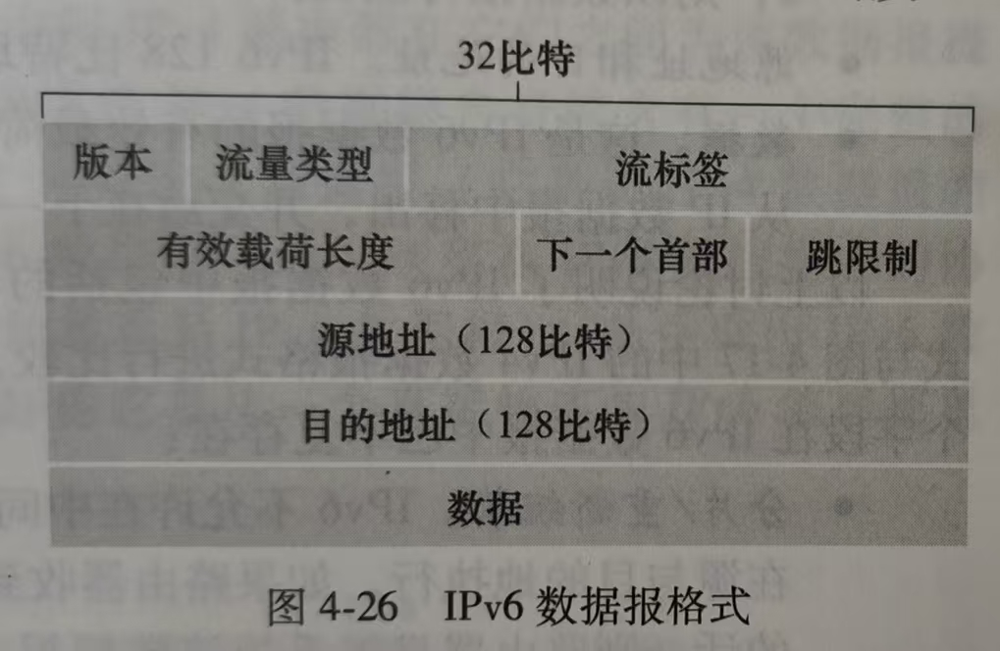

IPv6的一些变化：

- **扩大的地址容量**。地址长度从32比特增加到128比特。IPv6还引入了**任播地址**（anycast address），这种地址可以使数据报交付給一组主机中的任意一个。（例如，这种特性可以向一组包含给定文档中的最近一个发送HTTP GET 报文。）
- **简化高效的40字节首部**。
- **流标签**。该字段可用于“给属于特殊流的分组加上标签，这些特殊流是发送方要求进行特殊处理的流，如一种非默认服务质量或需要实时服务的流“。流的确切含义还未完全确定。

IPv4中出现的几个字段IPv6已不复存在：

- 分片/重新组装。IPv6不允许在中间路由器上进行分片与重新组装。这种操作只能在源于目的地执行。
- 首部检验和。运输层和链路层都有检验操作，再检验有点多余了。
- 选项。它没有消失，而是可能出现在”下一个首部“指出的位置上。

#### 2.从IPv4到IPv6的迁移

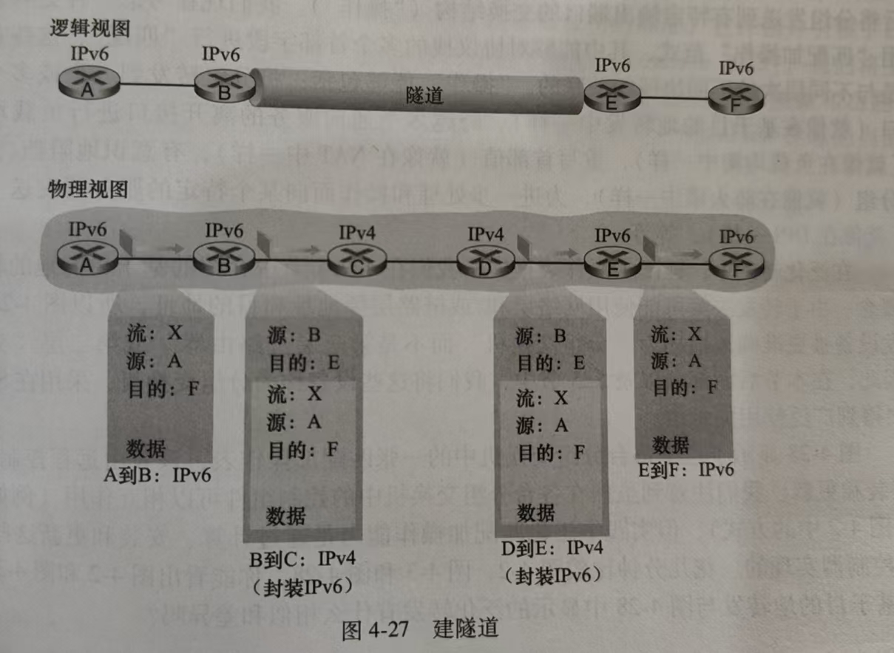

## 泛化转发和SDN

前面将基于目的地转发的特征总结为两个步骤：查找目的IP地址（”匹配“），然后将分组发送到有特定输出端口的交换结构（”操作“）。我们现在考虑一种更有意义的通用”匹配加操作“范式，其中能对协议栈的多个首部字段进行“匹配”，这些首部字段是与不同层次的不同协议相关联的。”操作“能够包括：将分组转发到一个或多个输出端口（就像在基于目的地转发一样），跨越多个通向服务的离开接口进行负载均衡分组（就像在负载均衡中一样），重写首部值（就像在NAT中一样），有意识的阻挡/丢弃某个分组（就像在防火墙中一样），为进一步处理和操作而向某个特定的服务器发送一个分组（就像在DPI一样），等等。

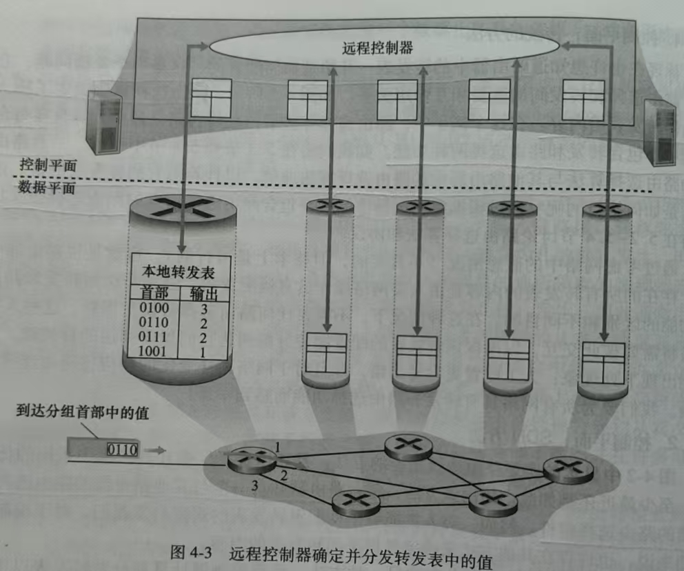

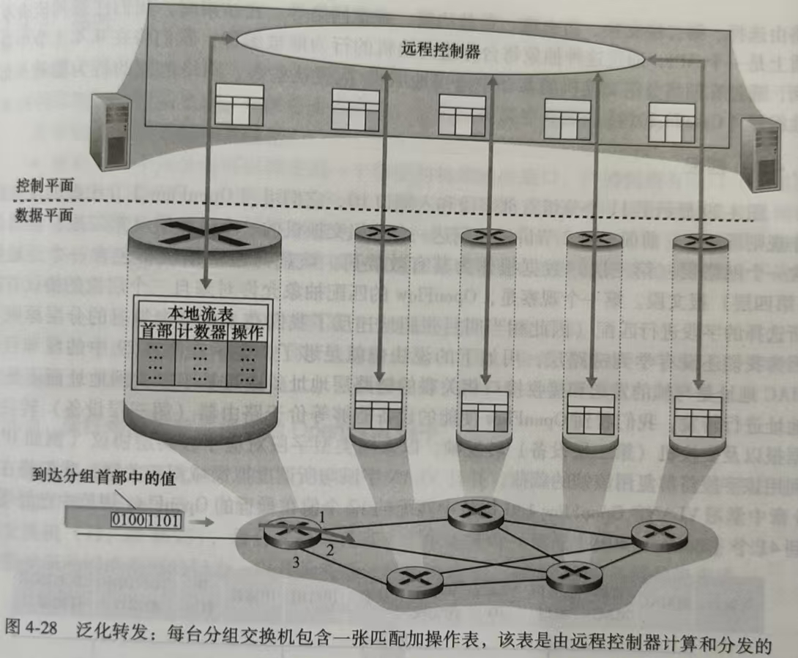

匹配加操作转发表在OpenFlow中称为**流表**（flow table），它的表项包含：

- 首部字段值的集合
- 计数器集合（当分组与流表项匹配时更新计数器）
- 操作集合。

流表本质是一个API

#### 匹配

OpenFlow的匹配抽象允许对来自三个层面的协议首部所选择的字段进行匹配（明目张胆地违反了分层原则）

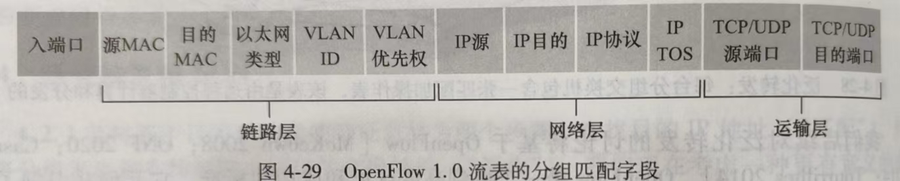

#### 操作

最为重要的操作：

- 转发
- 丢弃
- 修改字段

#### 运行中的匹配加操作的OpenFlow例子

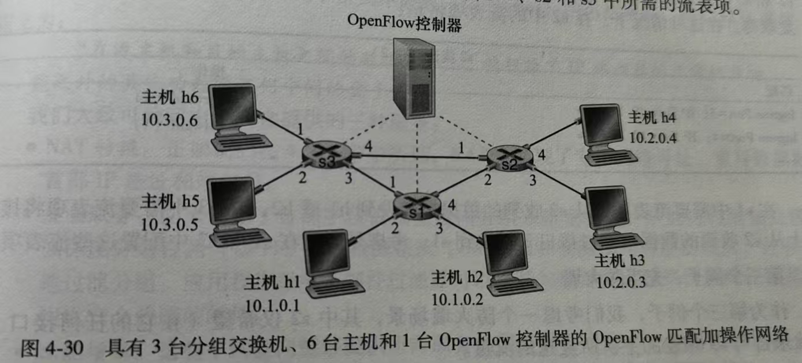

##### 第一个例子：简单转发

假定希望转发行为是：来自h5或h6发往h3或h4的分组从s3转发到s1，然后从s1转发到s2（完全避免使用s3和s2之间的链路）。在s1,s3,s2中的流表项将是：

<table>
    <tr>
        <td colspan="2">s1流表</td>
    </tr>
    <tr>
        <td>匹配</td>
        <td>操作</td>
    </tr>
    <tr>
        <td>Ingress Port=1; IP Src=10.3.*.*; IP Dst=10.2.*.*</td>
        <td>Forward(4)</td>
    </tr>
    <tr>
        <td>......</td>
        <td>......</td>
    </tr>
</table>

<table>
    <tr>
        <td colspan="2">s3流表</td>
    </tr>
    <tr>
        <td>匹配</td>
        <td>操作</td>
    </tr>
    <tr>
        <td>IP Src=10.3.*.*; IP Dst=10.2.*.*</td>
        <td>Forward(3)</td>
    </tr>
    <tr>
        <td>......</td>
        <td>......</td>
    </tr>
</table>

<table>
    <tr>
        <td colspan="2">s2流表</td>
    </tr>
    <tr>
        <td>匹配</td>
        <td>操作</td>
    </tr>
    <tr>
        <td>Ingress Port=2; IP Dst=10.2.0.3</td>
        <td>Forward(3)</td>
    </tr>
    <tr>
        <td>Ingress Port=2; IP Dst=10.2.0.4</td>
        <td>Forward(4)</td>
    </tr>
    <tr>
        <td>......</td>
        <td>......</td>
    </tr>
</table>

##### 第二个例子：负载均衡

来自h3发往 10.1.\*.\* 的数据报经过s1和s2之间的直接链路转发，于此同时来自h4发往 10.1.\*.\* 的数据报经过s2和s3（于是从s3到s1）之间的链路转发。注意这种行为不能通过基于IP的目的地转发取得。

<table>
    <tr>
        <td colspan="2">s2流表</td>
    </tr>
    <tr>
        <td>匹配</td>
        <td>操作</td>
    </tr>
    <tr>
        <td>Ingress Port=3; IP Dst=10.1.*.*</td>
        <td>Forward(2)</td>
    </tr>
    <tr>
        <td>Ingress Port=4; IP Dst=10.1.*.*</td>
        <td>Forward(1)</td>
    </tr>
    <tr>
        <td>......</td>
        <td>......</td>
    </tr>
</table>

在s1中需要流表项将从s2收到的数据转发到h1或h2，在s3中需要流表项将接口4上从s2收到的数据报经过接口3转发到s1。

##### 第三个例子：充当防火墙

s2仅希望（在它的任何接口上）接收来自s3相连的主机所发送的流量。

<table>
    <tr>
        <td colspan="2">s2流表</td>
    </tr>
    <tr>
        <td>匹配</td>
        <td>操作</td>
    </tr>
    <tr>
        <td>IP Src=10.3.*.*; IP Dst=10.2.0.3</td>
        <td>Forward(3)</td>
    </tr>
    <tr>
        <td>IP Src=10.3.*.*; IP Dst=10.2.0.4</td>
        <td>Forward(4)</td>
    </tr>
    <tr>
        <td>......</td>
        <td>......</td>
    </tr>
</table>

如果在s2的流表中没有其他表项，则仅有来自 10.3.\*.\* 的流量将被转发到与s2相连的主机。

##### 其他

我们在本节中看到的匹配加操作流表实际上是一种有限形式的可编程性，它基于数据报的首部值和匹配条件之间的匹配，指定路由器应该如何转发和操作数据报。

## 中间盒

Web缓存，TCP连接分岔器，网络地址转换器（NAT），防火墙以及入侵检测系统等都是**中间盒**。

**定义**：在源主机和目标主机之间的数据路径上，执行除了IP路由器的正常标准功能之外的其他功能的任何中间的盒子。

中间盒提供的三种服务：

- NAT转换
- 安全服务
- 性能增强

## 路由选择算法

### 链路状态路由选择算法（Link State，LS）

在链路状态算法中，网络拓扑和所有链路开销都是已知的，实践中这是通过让每个节点向网络中所有节点广播链路状态分组来完成的，其中每个链路状态分组包含它所连接的链路的标识和开销。在实践中经常由**链路状态广播算法**来完成。

链路状态路由算法：

- Dijkstra算法
- Prim算法

产生震荡的原因：x节点，y节点同时检测到一条开销更小的链路，一起改变路径，导致该链路开销变得很大。这个过程不断反复，就是震荡。

如何防止震荡：

- 强制链路开销不依赖与所承受的流量（不可接收的）
- 确保并非所有路由器都同时运行LS算法

### 距离向量路由选择算法（Distance-Vector, DV)

DV算法特点：

- 分布式的：每个节点都要从一个或多个直接相连邻居接收某些信息
- 迭代的：此过程一直持续到邻居之间无更多信息要交换为止
- 自我终止的：没有计算应该停止的信号，它就停止了
- 异步的：它不要求所有节点相互之间步伐一致地操作

令d~x~(y)是从节点x到节点y的最低开销路径的开销。则最低开销与Bellman-Ford方程有关，即

> d~x~(y) = min~v~{ c(x,v) + d~v~(y) }

方程中的min~v~是对于x的所有邻居的。

在该算法中，每个节点不时地向它的每个邻居发送它的距离向量副本。当一个节点接收到后，更新自己的距离向量

**路由选择环路**（routing loop）：目的地为x的分组在t1时刻到达y或z后，将在这两个节点之间不停地（或直到转发表发生改变为止）来回反复。

**毒性逆转**：如果z通过y路由选择到目的地x，则z将通告y，z到x的距离无穷大（D~z~(x)=∞）。只要z经过y路由选择到x，z就持续地向y讲述这个谎言。因为y相信z没有到x的路径，故只要z继续经y路由选择到x，y将永远不会试图经由z路由选择到x。

涉及3个或更多节点的环路无法用毒性逆转技术检测到

## 因特网中自治系统内部的路由选择：OSPF

​     

在实践中，该模型和这种一组执行同样路由选择算法的同质路由器集合的观点有一点简单化，有以下两个重要原因：

- 规模。互联网规模大，在所有路由器之间广播连通性和链路开销更新所要求的负担是巨大的。
- 管理自治。因特网是ISP的网络，其中每个ISP都有自己的路由器网络。在理想情况下，一个组织应当能够按自己的愿望运行和管理其网络，还要能将其网络与其他外部网络连接起来。

这两个问题都可以通过将路由器组织进**自治系统**（Autonomous System, AS）来解决。一个自治系统由其全局唯一的AS号所标识。

在一个自治体统内运行的路由选择算法叫作**自治系统内部路由选择协议**（intra-autonomous system routing protocol）。

注：一个自治体统不能包含另一个自治系统。

### 开放最短路优先（OSPF）

OSPF是一种链路状态协议。它使用洪泛链路状态信息和Dijkstra最低开销路径算法。

优点：

- 安全。能够鉴别OSPF路由器之间的交换。
- 多条相同开销的路径
- 对单播与多播路由选择的综合支持。
- 支持在单个AS中的层次结构。

## ISP之间的路由选择：BGP

在因特网中，所有的AS运行相同的AS间路由选择协议，称为**边界网关协议**（Broder Gateway Protocol, **BGP**）。

==BGP是一种分布式和异步的AS间的路由选择协议==。

### BGP的作用

在BGP中，分组路由到CIDR化的前缀。eg. 一台路由器的转发表将具有形式为（x,I）的表项，x是一个前缀（例如 138.16.68/22），I是该路由器的接口之一的接口号。

BGP为路由器提供了一种完成以下任务的手段：

1. 从邻居AS获得前缀的可达信息。BGP允许每个子网向因特网的其余部分通告它的存在。
2. 确定到达该前缀的“最好的”路由。

### 通告BGP路由信息

对每个AS，每台路由器要么是**网关路由器**（gateway router，位于AS边缘的路由器），要么是**内部路由器**（internal router）。

在BGP中，每对路由器通过使用179端口的半永久TCP连接交换路由选择信息。每条直接连接以及所有通过该连接发送的BGP报文，称为**BGP连接**（BGP connection）。此外，跨越两个AS的BGP连接称为外部BGP（eBGP）连接，而在相同AS中的两台路由器之间的BGP会话称为**内部BGP**（iBGP）连接。

iBGP连接并不总是与物理链路对应（两台路由器之间没有链路，仍能有iBGP连接）

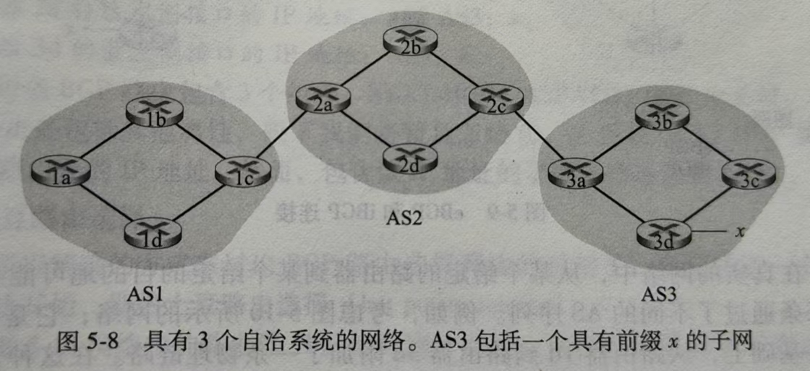

考虑向AS1和AS2中的所有路由器通告前缀x的可达性信息。在这个过程中，网关路由器3a先向网关路由器2c发送一个eBGP报文“AS3 x”。网关路由器2c然后向AS2中的所有其他路由器发送iBGP报文“AS3 x”。网关路由器2a接下来向网关路由器1c发送一个eBGP报文“AS2 AS3 x”。最后，网关路由器1c使用iBGP向AS1中的所有路由器发送报文"AS2 AS3 x"。在这个过程完成后，在AS1和AS2中的每个路由器都知道了x的存在并且也都知道了通往x的AS路径。（在真实网络中，可能有多条路径）

### 确定最好的路由

当路由器通过BGP连接通告前缀时，它在前缀中包含一些**BGP属性**（BGP attribute）。用BGP术语来说，前缀及其属性称为**路由**（route）。

两个重要的属性：

- **AS-PATH**属性包含通告已经通过的AS的列表。为了生成AS-PATH的值，当一个前缀通过某AS时，该AS将其ASN加入AS-PATH中的现有列表。例如，在图5-10中，从AS1到子网x有两条路：其中一条使用AS-PATH "AS2 AS3"，而另一条使用AS-PATH "AS3"。BGP路由器还使用AS-PATH属性来检测和防止通告环路；特别是，如果一台路由器在路径列表中看到包含了它自己的AS，它将拒绝该通告。

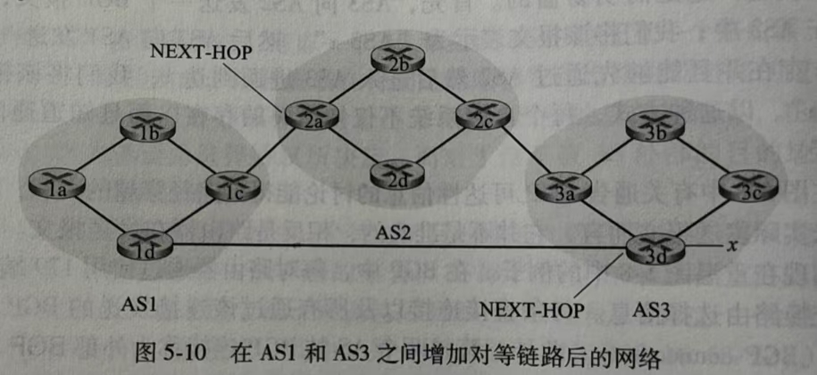

- **NEXT-HOP**是AS-PATH起始的路由器接口的IP地址。如图5-10，对于从AS1通过AS2到x的路由"AS2 AS3 x"，其属性NEXT-HOP是路由器2a左边接口的IP地址。对于从AS1绕过AS2到x的路由"AS3 x"，其NEXT-HOP属性是路由器3d最左边接口的IP地址。NEXT-HOP属性是*不属于*AS1的某路由器的IP地址；然而包含该IP地址的子网直接连接到AS1 。

总的来说，在上述例子中，AS1中的每台路由器都知道了到前缀x的两台BGP路由：

1. 路由器2a的最左侧接口的IP地址：AS2 AS3; x 。
2. 路由器3d的最左侧接口的IP地址：AS3; x 。

#### 1.热土豆路由选择

选择的路由到开始该路由的NEXT-HOP路由器具有最小开销。在上述例子中，路由器1b将查阅它的AS内部路由选择信息，以找到通往NEXT-HOP路由器2a的最低开销AS内部路径以及通往NEXT-HOP路由器3d的最低开销AS间路径。例如2a是最低开销，则路由器1b将查阅它的转发表，并且找到通往路由器2a的位于最低开销路径上的接口I 。1b把（x，I）加到它的转发表中。（当在转发表中增加AS向外前缀时，AS间路由选择协议（BGP）和AS内部路由选择协议（如OSPF）都要用到。）

热土豆路由选择依据的**思想**是：对于路由器1b，用尽可能低的开销将分组送出其AS，而不担心其AS外部到目的地的余下部分的开销。

#### 2.路由选择算法

对于任何给定的目的地前缀，进入BGP的路由选择算法的输入是到某前缀的所有路由的集合。如果到相同的前缀有两条或多条路由，则顺序地调用下列消除规则直到余下一条路由：

​	1）路由被指派一个**本地偏好**（local preference）值作为其属性之一。具有最高本地偏好值的路由器将被选择。

​	2）从余下的路由中（所有都具有相同的最高本地偏好值），将选择具有最短AS-PATH的路由。

​	3）从余下的路由中（所有都具有相同的最高本地偏好值和相同的AS-PATH长度），使用热土豆路由选择。

​	4）如果仍留下多条路由，则路由器使用BGP标识符来选择路由。

### IP任播

除了作为因特网的AS间路由选择协议外，BGP还常被用于实现IP任播（anycast）服务，该服务常用于DNS中。DNS系统能够在遍及全世界的DNS服务器上复制DNS记录。当一个用户要访问该复制的内容，可以将用户指向具有该复制内容的”最近的“服务器。BGP的路由选择算法为做这件事提供了一种最为容易和自然的机制。

IP任播被DNS系统广泛用于将DNS请求指向最近的根DNS服务器。

### 路由选择策略

在路由选择算法中，实际上首先根据本地偏好属性选择路由，本地偏好由本地AS的策略所确定。

### 拼装在一起：在因特网中呈现

1. **IP**。需要与本地ISP签订合同并进行连接。你的公司将有一台网关路由器，该路由器将于本地ISP的一台路由器相连。该连接可以是一条通过现有电话基础设施的DSL连接、一条到ISP路由器的租用线，或则其他接入方案之一。你的本地ISP也将为你提供一个IP地址范围，你将在该地址范围内分配IP地址：一个给你的Web服务器，一个给你的电子邮件服务器，一个给你的DNS服务器，一个给你的网关服务器，并将其他IP地址分配给公司网络中的其他服务器和联网设备。
2. **域名**。需要与一个因特网注册机构签订合同，以便为你的公司获得一个域名。例如，如果你的公司名称比如是Xanadu Inc.，你自然希望获得域名xanadu.com。你的公司还必须呈现在DNS系统中。具体而言，因为外部世界将要联系你的DNS服务器以获得该服务器的IP地址，所以你还需要为注册机构提供你的DNS服务器的IP地址。该注册机构则在 .com顶级域名服务器中为你的DNS服务器设置一个表项（域名和对应的IP地址）。在这个步骤完成后，任何知道你的域名的用户将能经过DNS系统获得你DNS服务器的IP地址。
3. **设置DNS服务器**。为了使人们能够发现你的Web服务器中的IP地址，你需要在你的DNS服务器中包含一个将你的Web服务器的主机名（例如www.xanadu.com）映射到它的IP地址的表项。你还要为公司中其他公共可用的服务器设置类似的表项，包括你的电子邮件服务器。如此一来，如果Alice要浏览你的Web服务器，DNS系统将联系你的DNS服务器，找到你的web服务器的IP地址，并将其给Alice。Alice则能与你的Web服务器创建一个直接的TCP连接。
4. **通告BGP路由信息**。当你与本地ISP签订合同并且获得了分配的前缀（即一个地址范围），你的本地ISP将使用BGP向与之连接的ISP通告你的前缀（或者包含你的前缀的某个聚合项），因而能够将数据报适当的转发到适当的Web和电子邮箱服务器。

## SDN控制平面

SDN体系结构具有4个关键特征：

- **基于流的转发**。SDN控制的交换机的分组转发工作，能够基于运输层、网络层或链路层首部中任意数量的首部字段值进行。回顾图5-2（下面），分组转发规则被精确规定在交换机的流表中；SDN控制平面的工作是计算、管理和安装所有网络交换机的流表项。
- **数据平面与控制平面分离**。这种分离明显地显示在图5-2和图5-14中。数据平面由网络交换机组成，交换机是相对简单（但快速）的设备，该设备在它们的流表中执行“匹配加操作”的规则。控制平面由服务器以及决定和管理交换机流表的软件组成。
- **网络控制功能：位于数据平面交换机外部**。
- **可编程的网络**。

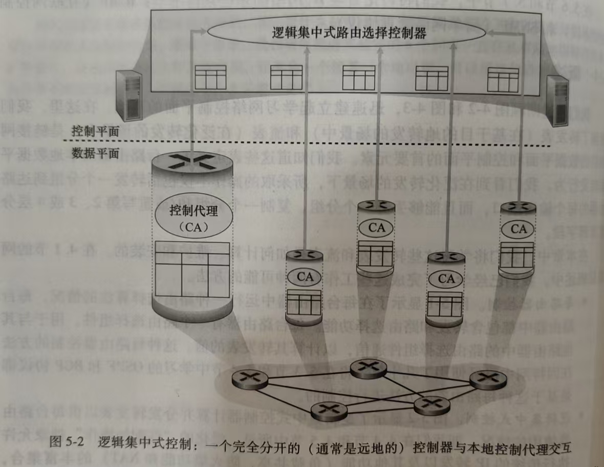

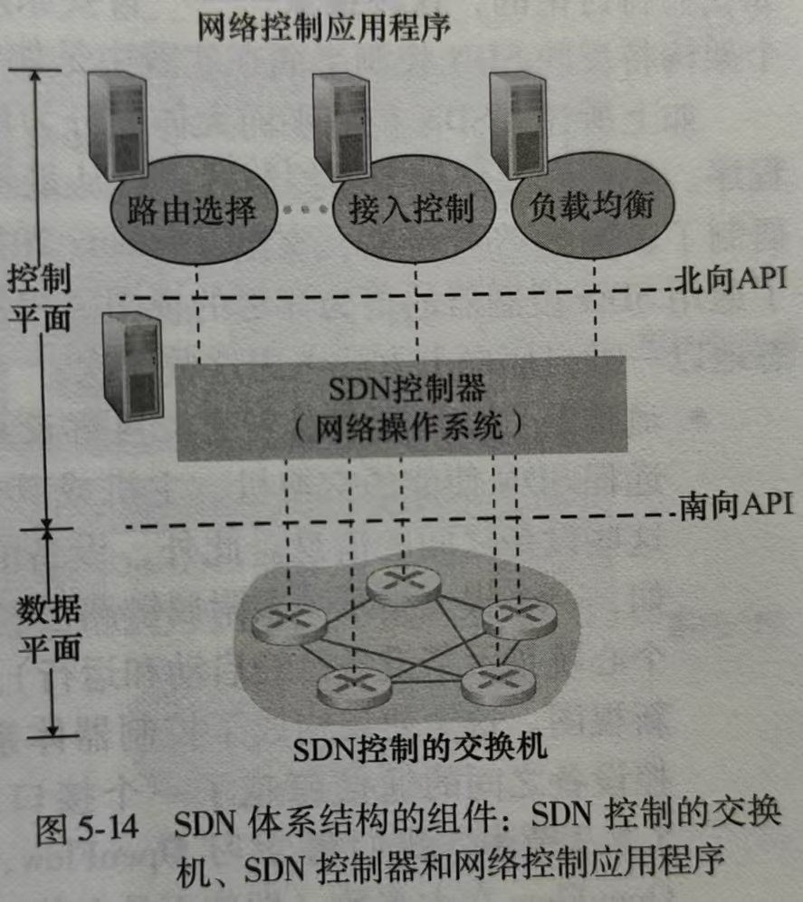

SDN表示了一种意义重大的网络功能的“分类”，即数据平面交换机、SDN控制器和网络控制应用程序是分离的实体，该实体可以由不同厂商和组织机构所提供。

### SDN控制平面：SDN控制器和SDN网络控制应用程序

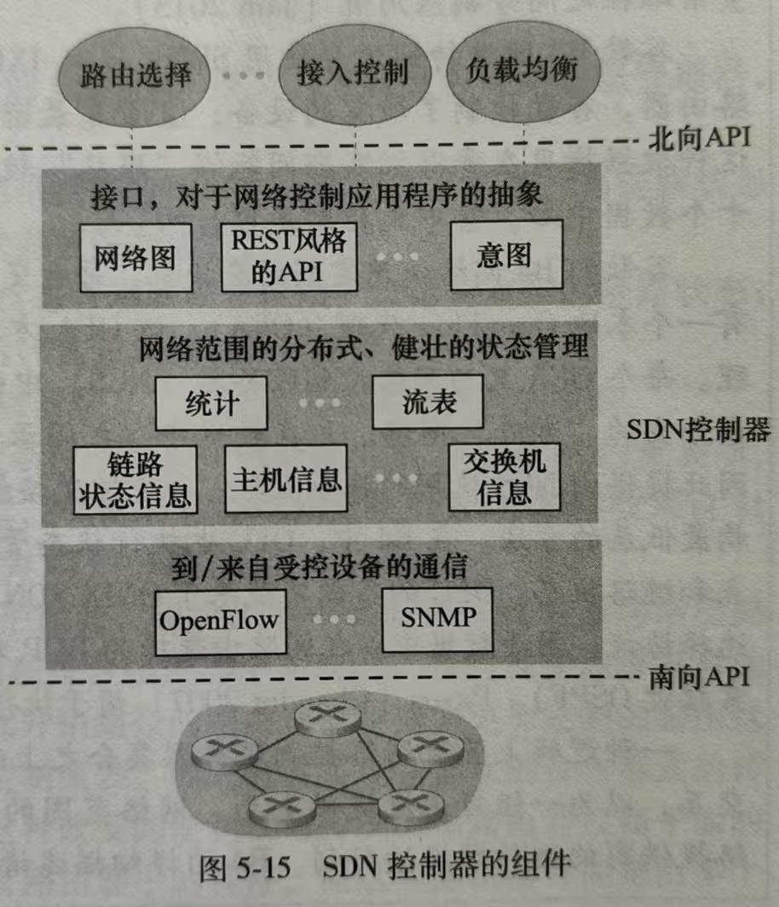

控制器的3个层次：

- **通信层：SDN控制器和受控网络设备之间的通信**。如图5-15所示，控制器和受控设备之间的通信跨越了一个接口，它现在被称为控制器的“南向”接口。**OpenFlow**是一种提供这种通信功能的特定协议。
- **网络范围状态管理层**。由SDN控制平面所做出的最终控制决定（例如配置所有交换机的流表以取得所希望的端到端转发，实现负载均衡，或实现一种特定的防火墙能力），将要求控制器具有有关网络的主机、链路、交换机和其他SDN控制设备的最新状态信息。交换机的流表包含计数器，其值也可以由网络控制应用程序很好地使用，因此这些值应当能为应用程序所用。既然控制平面的终极目标是确定各种受控设备的流表，控制器也就可以维护这些表的拷贝。这些信息都构成了由SDN控制器维护的网络范围“状态”的例子。
- **对于网络控制应用程序层的接口**。控制器通过它的“北向”接口与网络控制应用程序交互。

### OpenFlow协议

OpenFlow协议运行在SDN控制器和SDN控制的交换机或其他实现OpenFlow API的设备之间。OpenFlow协议运行在TCP之上，使用6653的默认端口号。

从控制器流向受控交换机的重要报文如下：

- **配置**。该报文允许控制器查询并设置交换机的配置参数。
- **修改状态。**该报文由控制器所使用，以增加/删除或修改交换机流表中的表项，并且设置交换机端口特性。
- **读状态**。该报文被控制器用于从交换机的流表和端口收集统计数据和计数器值。
- **发送分组**。该报文被控制器用于在受控交换机从特定的端口发送一个特定的报文。

从受控交换机流向控制器的重要报文如下：

- **流删除**。该报文通知控制器已删除一个流表项，例如由于超时，或作为收到“修改状态”报文的结果。
- **端口状态**。交换机用该报文向控制器通知端口状态的变化。
- **分组入**（packet-in）。一个分组到达交换机端口，并且不能与任何流表项匹配，那么这个分组将被发送给控制器进行额外处理。匹配的分组也可能发送给控制器，作为匹配时所采取的一个操作。分组入报文被用于向控制器发送这样的分组。

### 数据平面和控制平面交互的例子

懒得写，自己想

## ICMP：因特网控制报文协议

ICMP被主机和路由器用来彼此沟通网络层的信息。ICMP最典型的用途是差错报告。（eg. 当运行一个HTTP会话时，你也许会遇到一些诸如“目的网络不可达”之类的错误报文。这种报文就来源于ICMP。）

ICMP通常被认为是IP的一部分，但从体系结构上讲它位于IP之上，因为ICMP报文是承载在IP分组中的。这就是说，ICMP报文是作为IP有效承载的，就像TCP与DCP报文段作为IP有效载荷被承载那样。类似的，当一台主机收到一个指名上层协议为ICMP的IP数据报时（上层协议编码为1），它分解出该数据报的内容给ICMP，就像分解出一个数据报的内容给TCP或UDP一样。

ICMP报文有一个类型字段和一个编码字段，并且包含引起该ICMP报文首次生成的IP数据报的首部和前8个字节（以便发送方能确定引发该错误的数据报）

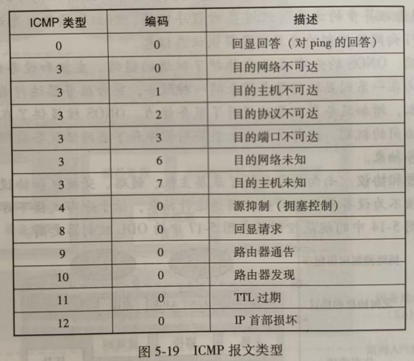

众所周知（我不知道）的ping程序发送一个ICMP类型8编码0的报文到指定主机。看到回显（echo）请求，目的主机发回一个类型0编码0的ICMP回显回答。大多数TCP/IP实现直接在操作系统中支持ping服务器，即该服务器不是一个进程。（客户程序需要能够指示操作系统产生一个类型8编码0的ICMP报文。

Traceroute是用ICMP报文来实现的。为了判断源和目的地之间所有路由器的名字和地址，源主机中的Traceroute向目的地主机发送一系列普通的IP数据报。这些数据报都携带了一个具有不可达UDP端口号的UDP报文段。第一个数据报的TTL为1，第二个的TTL是2，第三个TTL是3，依次类推。该源主机也为每个数据报启动定时器。当n个数据报到达第n台路由器时，第n台路由器观察到这个数据报的TTL正好过期。根据IP协议规则，路由器丢弃该数据报并发送一个ICMP告警报文给源主机（类型11编码0）。该告警报文包含了路由器的名字和它的IP地址。当该ICMP报文返回源主机时，源主机从定时器得到往返时延，从ICMP报文中得到第n台路由器的名字与IP地址。

Traceroute源主机是怎么知道何时停止发送UDP报文段的呢？前面讲过源主机为它发送的每个报文段的TTL字段加1.因此，这些报文段之一将最终沿着这条路到达目的主机。因为该数据报包含了一个具有不可达端口号的UDP报文段，该目的主机将向源发送一个端口不可达的ICMP报文（类型3编码3）。当源主机收到这个特别的ICMP报文时，知道它不需要再发送另外的探测分组。（标准的Traceroute程序实际上用相同的TTL发送3个一组的分组，因此Traceroute输出对每个TTL提供了3个结果。）

以这种方式，源主机知道了位于它与目的主机之间的路由器数量和标识，以及两台主机之间的往返时延。注意到Traceroute客户程序必须能指令操作系统产生特定TTL值的UDP数据报，当ICMP报文段到达时，也必须能够由它的操作系统进行通知。

## 网络管理、SNMP和NETCONF/YANG

网络管理定义：网络管理包含了硬件、软件和人类元素的设置、综合和协调，以监视、测试、轮询、配置、分析、评价和控制网络及网元资源，用合理的成本满足实时性、运营性能和服务质量的要求。

### 网络管理框架

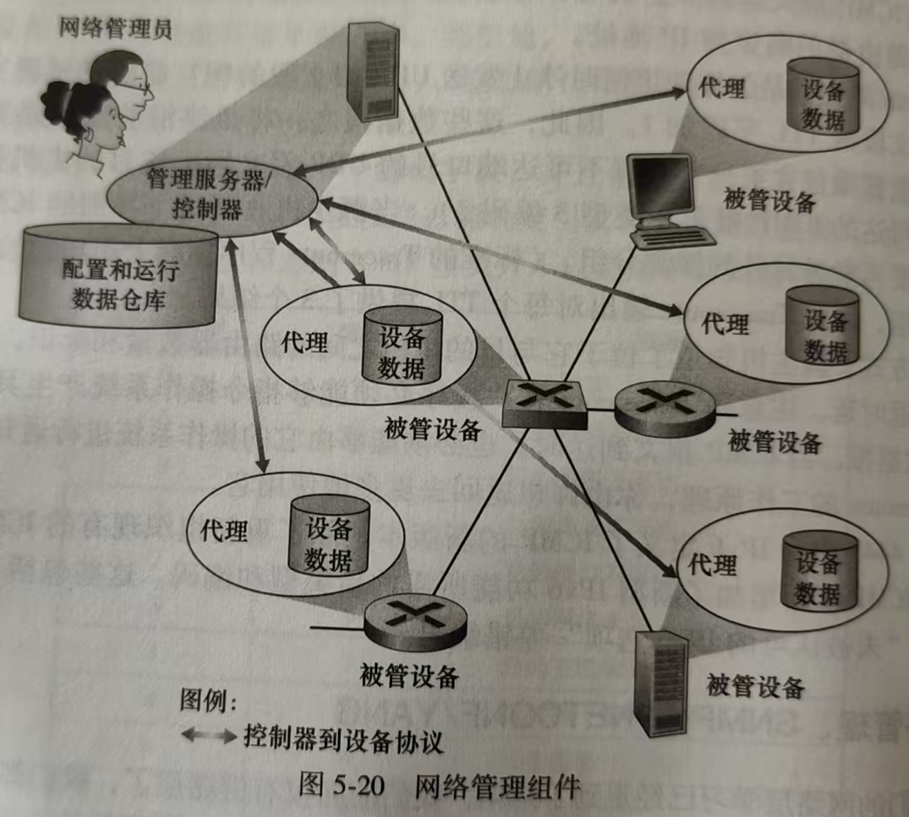

网络管理关键主键：

- 管理服务器（managing server）。管理服务器是一个应用程序，运行在网络运营中心（NOC）的集中式网络管理工作站上，并且通常需要**网络管理员**在环路中。
- 被管设备（managed device）。
- 数据（data）。
- 网络管理代理（network management agent）。是运行在被管设备上的一个软件进程，它与管理服务器通信，在管理服务器的命令和控制下在被管设备上执行本地操作。
- 网络管理协议（network management protocol）。该协议运行在管理服务器和被管设备之间，允许管理服务器查询被管设备的状态，并经过其代理间接地在这些设备上执行操作。代理能够使用网络管理协议向管理服务器通知异常事件（如组件故障或超过了性能阈值）。重要的一点是，网络管理协议自己不能管理网络。相反，它为网络管理员提供了一种能力，使他们能够管理网络。

在实践中，运营商通常采用三种方式来管理网络，所涉及的组件包括：

- CLI（命令行接口，Command Line Interface, CLI）。网络运营商可以直接向设备发出CLI命令。这些命令可以直接在被管设备的控制台上输入，或者通过管理服务器/控制器和被管设备之间的Telnet或安全shell（SSH）连接（可能通过脚本）输入。CIL命令是特定于供应商和设备的。CIL的使用很容易出错，而且很难对大型网络进行自动化或有效的扩展。
- SNMP/MIB。网络运营商可通过**简单网络管理协议**（Simple Network Management Protocol，SNMP）查询/设置设备的**管理信息库**（Management Information Base，MIB）对象中包含的数据。一些MIB是特定于设备和供应商的，而其他的MIB（例如，由于丢弃的IP数据报数量）是与设备无关的，提供了抽象和通用性。网络运营商通常使用这种方法来查询和监控运行状态和设备统计信息，然后使用CLI主动控制/配置设备。重要的是，这两种方法是分别对设备进行管理的。SNMP/MIB在设备配置和网络管理扩展性方面不足。
- NETCONF/YANG。

### 简单网络管理协议和管理数据库

SNMP是一个应用层协议，用于在管理服务器和代表管理服务器执行的代理之间传递网络管理控制和信息报文。

不看了，全跳了🙌

# 6.链路层

广播信道：这种信道用于连接无线局域网、卫星网和混合光纤同轴电缆（Hybrid Fiber Coaxial cable，HFC）接入网中的多台主机。

点到点通信链路

## 概述

为方便讨论，将运行链路层协议的任何设备称为**节点**（node）。节点包括主机、路由器、交换机和WiFi接入点。

把沿着通信路径连接相邻节点的通信信道称为**链路**（link）。

如下图，考虑从无线主机之一向服务器之一发送一个数据报。该数据报将实际通过6段链路：

- 发送主机与WiFi接入点之间的WiFi链路
- 接入点和链路层交换机之间的以太网络链路
- 链路交换机与路由器之间的链路
- 两台路由器之间的链路
- 交换机和服务器之间的以太网链路

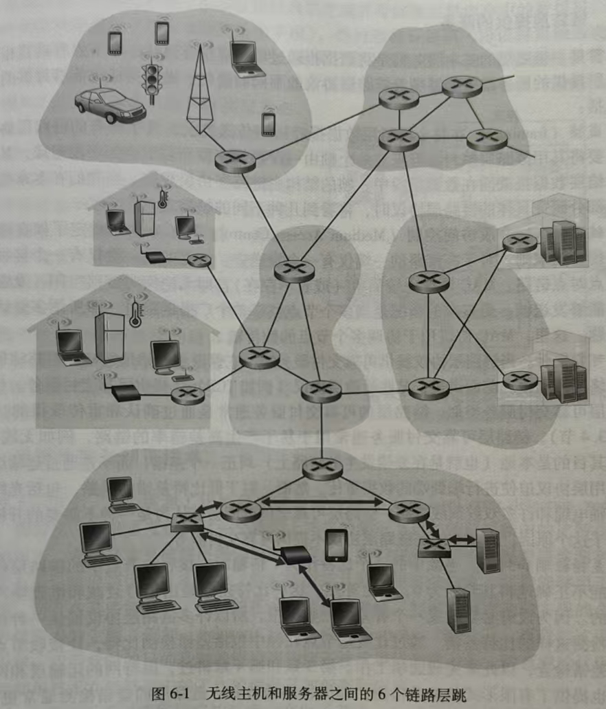

例子：旅客旅游。一个游客好比一个数据报，每个运输区段好比一条链路，每种运输方式好比一种链路层协议，而该旅行社好比一个路由选择协议。

### 链路层提供的服务

- **成帧**（framing）。把数据报封装成链路层帧
- **链路接入**。介质访问控制（Medium Access Control，MAC）协议规定了帧在链路上传输的规则。
- **可靠交付**。链路层可靠交付服务通常用于易于产生高差错率的链路，例如无线链路，其目的是本地（也就是在差错发生的链路上）纠正一个差错，而不是通过运输层或应用层协议迫使进行端到端的数据重传。
- **差错检测和纠正**。链路层的差错检测更复杂，并且用硬件实现。差错纠正不仅能检测出帧中出现的比特差错，而且能够准确地确定帧中的差错出现的位置（并因此纠正这些差错）。

### 链路层在何处实现

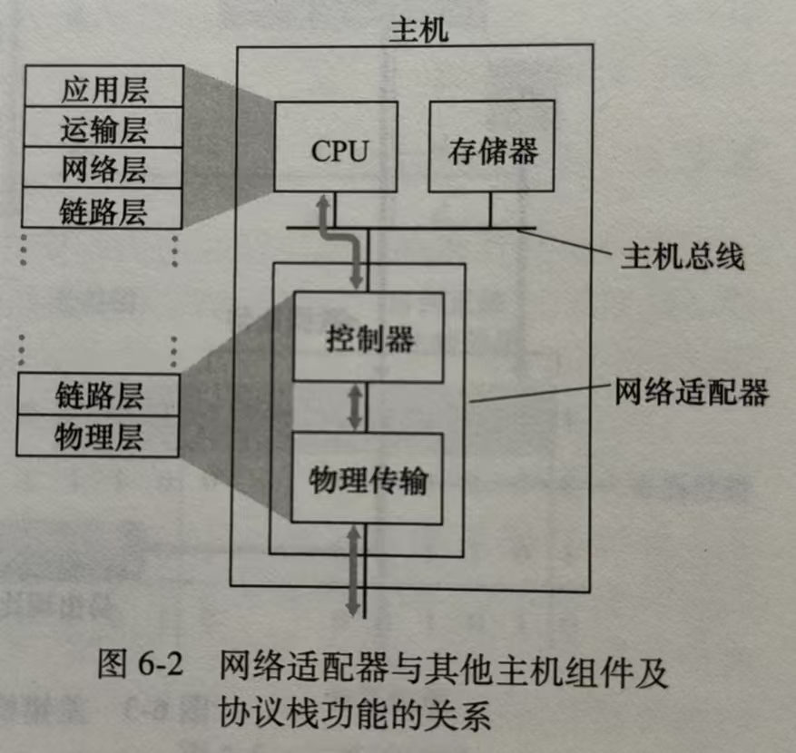

以太网功能要么集成到主板芯片组，要么通过低成本的专用以太网芯片实现。通常，链路层是在被称为**网络适配器**的芯片上实现的，有时也被称为**网络接口控制器**（NIC）。网络适配器实现了许多链路层服务，包括成帧、链路访问、错误检测等。因此，链路层控制器的大部分功能是在硬件中实现的。

在发送端，控制器取得了由协议栈较高层生成并存储在主机内存中的数据报，在链路层帧中封装该数据报，然后遵循链路接入协议将该帧传进通信链路中。在接收端，控制器接收了整个帧，抽取出网络层数据报。如果链路层执行差错检测，则需要发送控制器在该帧的首部设置差错检测比特，由接收控制器执行差错检测。

部分链路层是运行于主机CPU上的软件中实现的。链路层是硬件和软件的结合体，即此处是协议栈中软件和硬件交接的地方。

## 差错检测和纠正技术

**比特级差错检测和纠正**：：对从一个节点发送到另一个物理上连接的邻近节点的链路层帧中的比特损伤进行检测和纠正。

**差错检测和纠正比特**（Error-Detection and-Correction，EDC）。

数据为D。

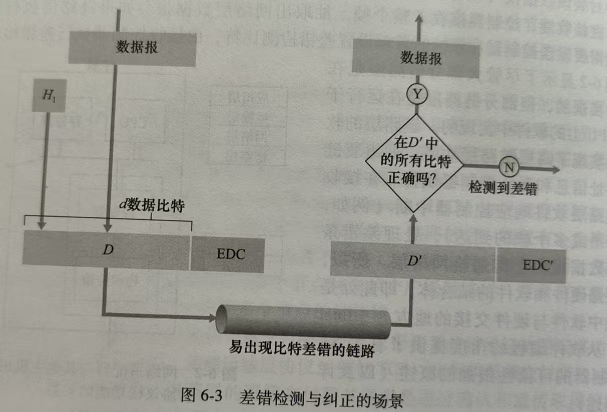

### 奇偶校验

用**单个奇偶校验位**。假设要发送的信息D有d比特，发送方只需加上一个比特，使这d+1比特中1的个数为偶数。若接收方接收到奇数个1，说明出现了奇数个比特差错。

**二维奇偶校验**:如下图。

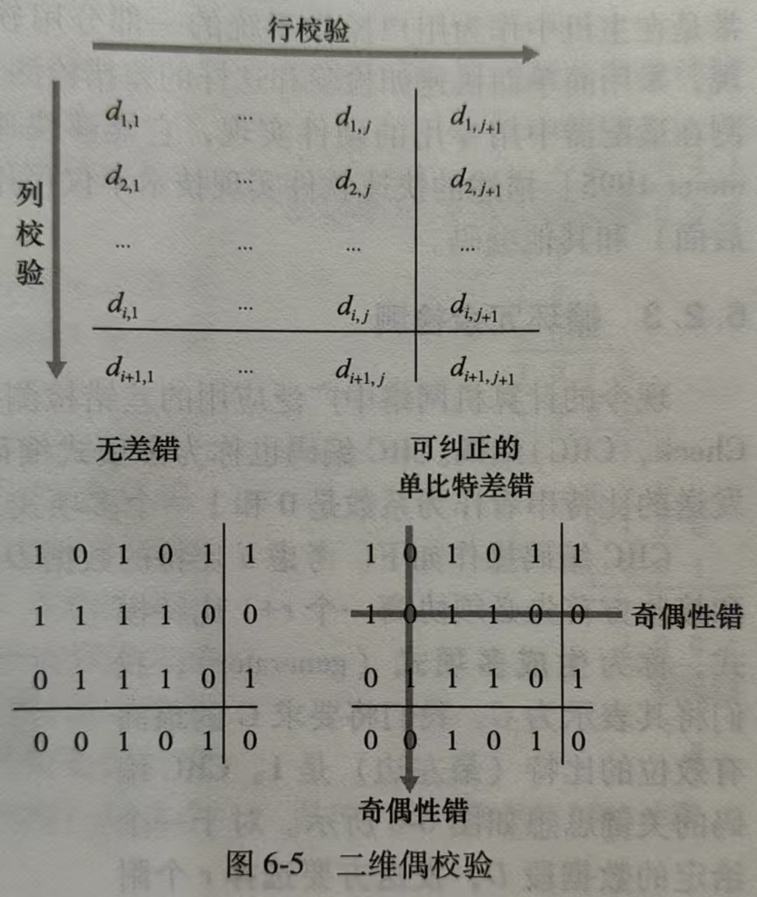

接收方检测和纠正差错的能力被称为**前向纠错**（Forward Error Correction，FEC）。

### 检验和方法

**因特网检验和**基于（“UDP校验和”中提到的方法）

### 循环冗余检测（Cyclic Redundancy Check，CRC)

循环冗余检测编码也称为多项式编码，因为该编码能够将要发送的比特串看作系数是0和1的一个多项式，对比特串的操作被解释为多项式算术。

如上图，数据D为d比特，**生成多项式**（generator）G为r+1比特。要求D最高位（最左边）为1 。

关键思想：对于一个给定的数据段D，发送方要选择r个附加比特R，并将它们附加到D上，使得得到的d+r比特模式用模2算数恰好能被G整除。

CRC差错检测：接收方用G去除接收到的d+r比特。如果除数为非零，出现差错；否则，正确。

模2算术：加法中不进位，减法中不借位。这意味着加法和减法是相同的，且等价于按位异或。乘法和除法也相同。

注：CRC比特可以根据位数求出。eg. G~CRC-32~=100000100110000010001110110110111

## 6.3 多路访问链路和协议

**点对点链路**（point-to-point link）由链路一端的单个发送方和链路另一端的单个接收方组成。

**广播链路**（broadcast link），它能够让多个发送和接受节点都连接到相同的、单一的、共享的广播信道上。

**多路访问问题**（multiple access problem）：如何协调多个发送和接收节点对一个共享广播信道的访问。

**多路访问协议**（multiple access protocol）：节点通过这些协议来规范它们在共享的广播信道上的传输行为。有如下3种：

- 信道划分协议(channel partitioning protocol)
- 随机接入协议(random access protocol)
- 轮流协议(taking-turns protocol)

**碰撞**（collide）：多个节点同时传输帧，导致所有节点同时接到帧。碰撞的所有帧丢失。

在理想情况下，对于速率为 R bps 的广播信道，多路访问协议应该具有以下希望的特性：

1. 当仅有一个节点发送数据时，该节点具有 R bps 的吞吐量
2. 当有M个节点发送数据时，每个节点吞吐量为 R/M bps 。这不必要求M个节点中的每个节点总是有R/M的瞬间速率，而是每个节点在一些适当定义的时间间隔内应该有 R/M 的平均传输速率
3. 协议是去中心化的
4. 协议是简单的

### 6.3.1 信道划分协议

时分多路复用（TDM）

频分多路复用（FDM）

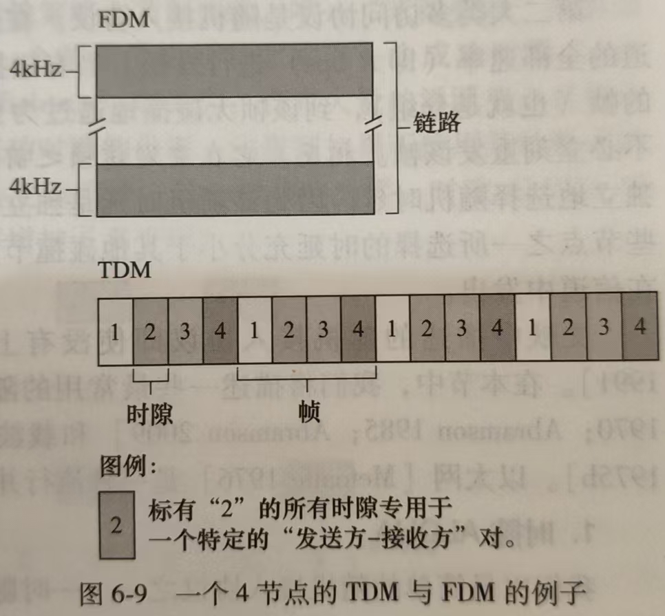

（不应当把TDM时间帧与链路层数据单元帧混淆。在本小节，我们把链路层交换的数据单元称为分组）

**码分多址**（Code Division Multiple Access，CDMA）：对每个节点分配一种不同的编码，然后每个节点用它唯一的编码来对它发送的数据进行编码。

### 6.3.2 随机接入协议

一个传输节点总是以信道的全部速率进行发送，当有碰撞时，涉及碰撞的节点等待一个随机时延后重发它的帧。

#### 1.时隙ALOHA

- 当节点有一个新帧要发送时，它等到下一个时隙开始并在该时隙（假设一个时隙为L/R秒，即一个时隙等于传输一帧的时间）传输整个帧。
- 如果没有碰撞，该节点成功地传输它的帧，从而不需要考虑重传该帧。
- 如果有碰撞，该节点的时隙结束之前检测到这次碰撞。该节点以概率p在后续的每个时隙中重传它的帧，直到该帧无碰撞地传输出去。

缺点：当大量节点有很多帧要传输时，则（最多）仅有37%（1/e）的时隙做有用的工作

#### 2.ALOHA

第一个ALOHA协议是非时隙、完全分散的协议

效率为1/(2e)，为时隙ALOHA的一半，这就是完全去中心化所付出的代价

#### 3.载波侦听多路访问（CSMA）

当一个礼貌的好节点👍，做到以下两个规则：

- **载波侦听**（carrier sensing）：一个节点在传输前先听信道，如果来自另一个节点的帧正向信道上发送，节点等待直到检测到一小段时间没有传输，然后开始传输。
- **碰撞检测**（collision detection）：当一个传输节点在传输时一直侦听此信道，如果它检测到另一个节点正在传输干扰帧，它就停止传播，在重复“侦听-当空闲时间传输”循环之前等待一段随机时间。

这两个规则包含在**载波侦听多路访问**（Carrier Sense Multiple Access，CSMA）和**具有碰撞检测的CSMA**（CSMA with Collision Detection，CSMA/CD）协议族中。

为什么侦听了还是会产生碰撞？原因见下图。

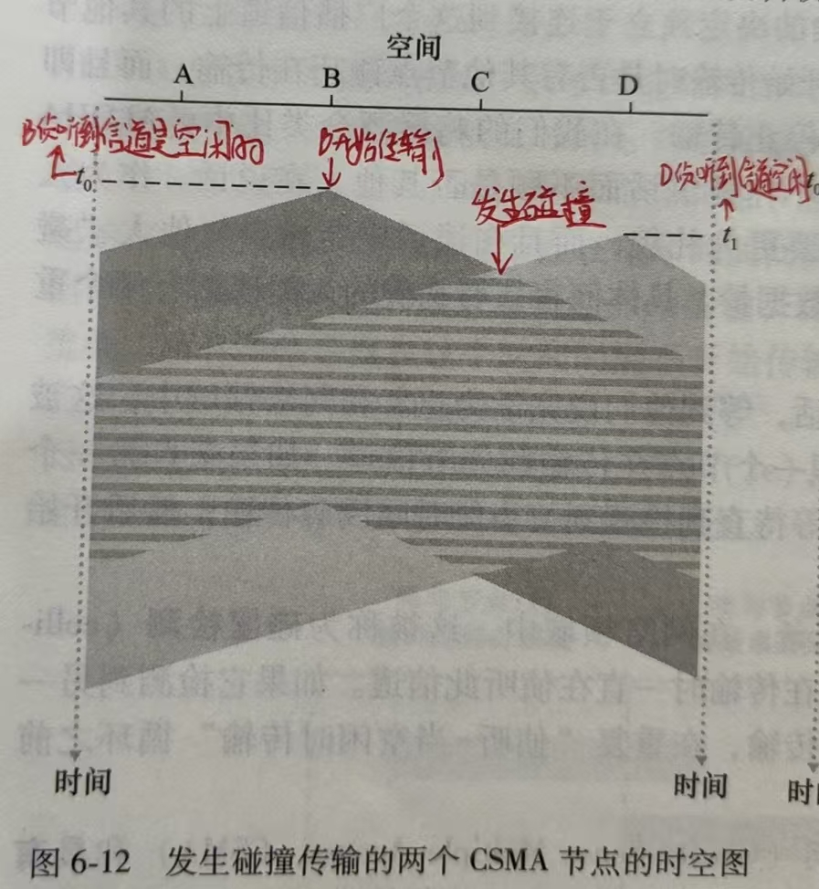

由此可知，广播信道的端到端**信道传播时延**（channel propagation delay）在决定其性能方面起着关键作用。该传播时延越长，载波侦听节点不能侦听到网络中另一个节点已经开始传输的机会就越大。

#### 4.具有碰撞检测的载波侦听多路访问（CSMA/CD）

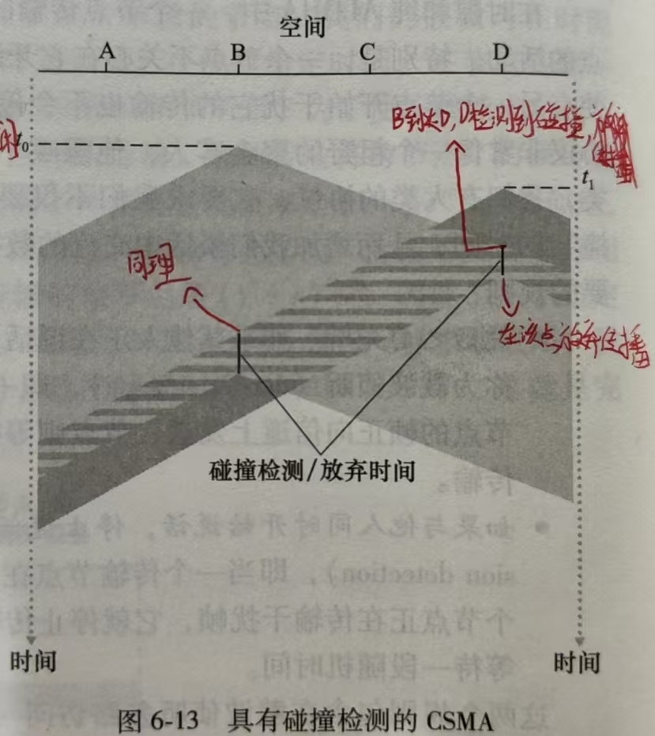

从与广播信道相连的适配器（在节点中）的角度总结它的运行：

1. 适配器从网络层获得数据报，准备链路层帧，并将其放入帧适配器缓存中。
2. 如果适配器侦听到信道空闲，它开始传输帧；否则等待。
3. 在传输过程中，适配器监视来自其他使用该广播信道的适配器的信号能量的存在。
4. 如果适配器传输整个帧而未检测到来自其他适配器的信号能量，该适配器就完成了该帧；否则，它终止传输。
5. 终止传输后，适配器等待一个随机时间量，然后返回步骤2 。

我们希望等待的时间量为：当碰撞节点较少时，时间间隔较短；当碰撞节点数量较大时，时间间隔较长。该问题可通过**二进制指数后退**（binary exponential backoff）算法解决。

**二进制指数后退**（binary exponential backoff）算法：当传输一个给定帧时，在该帧经历了一连串的*n*次碰撞后，节点随机从{0，1，2，... , 2^n^-1}中选择一个K值。因此，一个帧经历的碰撞越多，K选择的间隔越大。

#### 5.CSMA/CD效率

CSMA/CD效率：当有大量的活跃节点，且每个节点有大量的帧要发送时，帧在信道中无碰撞地传输的那部分时间在长期运行时间中所占的份额。

d~prop~表示信号能量在任意两个适配器之间传播所需的最大时间。d~trans~表示传输一个最大长度的以太网帧的时间。

效率 = $\dfrac{1}{1+5d~prop~/d~trans~}$

由此看出，d~prop~越小，效率越高。d~trans~越大，效率越高，因为当一个帧取得信道时，它将占用很长时间，因此减少了碰撞。

### 6.3.3 轮流协议

#### 1.轮询协议（polling protocol）

轮询协议要求这些节点之一要被指定为主节点。主节点以循环的方式**轮询**（poll）每个节点。特别是，主节点首先向节点1发送一个报文，告诉它（节点1）能够传输的帧的最多数量。（主节点能够通过观察在信道上是否缺乏信号，来决定一个节点何时完成了帧的发送。）上述过程以循环的方式轮询了每个节点。

**缺点**：

1. 引入了轮询时延，即通知一个节点“它可以传输”所需的时间。
2. 如果主节点有故障，整个信道都变得不可操作。

#### 2.令牌传递协议（token-passing protocol）

没有主节点。一个称为**令牌**的小的特殊帧在节点之间以某种固定的次序进行交换。当一个节点收到令牌时，仅当它有一些帧要发送时，它才持有这个令牌；否则，它立即向下一个节点转发该令牌。当一个节点收到令牌时，如果它确实有帧要传输，它发送最大数目的帧数，然后把令牌转发给下一节点。令牌传递是分散的，并有很高的效率。

**缺点**：

1. 一个节点的故障可能使整个信道崩溃。
2. 如果一个节点偶然忘记了释放令牌，则必须调用某些恢复步骤使令牌返回到循环中来。

### 6.3.4 DOCSIS: 用于电缆因特网接入的链路层协议

一个电缆接入网通常在电缆网头端将几千个住宅电缆调制解调器与一个**电缆调制解调器端接系统**（Cable Modem Termination System，CMTS）连接。**数据经电缆服务接口**（Data-Over-Cable Service Interface，CMTS）规范定义了电缆数据网络体系结构及其协议。

DOCSIS使用<u>FDM</u>将下行（CMTS到调制解调器）和上行（调制解调器到CMTS）网络段划分为多个频率信道。每个下行信道的宽度在24MHz到192MHz之间，每个信道的最大吞吐量约为1.6Gbps; 每个上行信道的信道宽度在6.4MHz到96MHz之间，最大上行吞吐量约为1Gbps。每个上行和下行信道都是一个<u>广播信道</u>。由<u>CMTS</u>在下行信道上传输的帧被接收该信道的所有电缆调制解调器所接收，然而，由于只有一个CMTS传输到下行信道，因此不存在多路访问问题。

如下图所示，每条上行信道被划分为时间间隔（类似<u>TDM</u>），每个时间间隔包含一个微时隙序列，电缆调制解调器可在该微时隙中向CMTS传输。CMTS显式地准许各个电缆调制解调器在特定的微时隙中进行传输。CMTS在下行信道上通过发送称为MAP报文的控制报文，指定哪个电缆调制解调器（带有要发送的数据）能够在微时隙中传输由控制报文指定的时间间隔。由于微时隙明确分配给电缆调制解调器，故CMTS能够确保在微时隙中没有碰撞传输。

但是CMTS一开始是如何知道哪个电缆调制解调器有数据要发送呢？通过让电缆调制解调器在专用于此目的的一组特殊的微时间间隔内向CMTS发送请求帧来完成该任务。如下图，这些微时隙请求帧以随机接入方式传输，故可能相互碰撞。电缆调制解调器既不能侦听上行信道是否忙，也不能检测碰撞。但是，该电缆调制解调器如果没有在下一个下行控制报文中收到对请求分配的响应的话，就推断出它的微时隙请求帧经历了一次碰撞。当判断出一次碰撞，电缆调制解调器使用二进制指数回退将其微时隙请求帧延缓到以后的时隙重新发送。当在上行信道上有很少的流量，电缆调制解调器可能在名义上分配给微时隙请求帧的时隙内实际传输数据帧（因此避免不得不等待微时隙分配）。

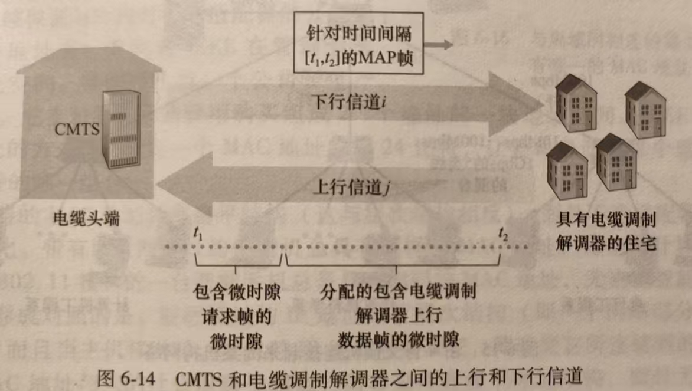

## 6.4 交换局域网

 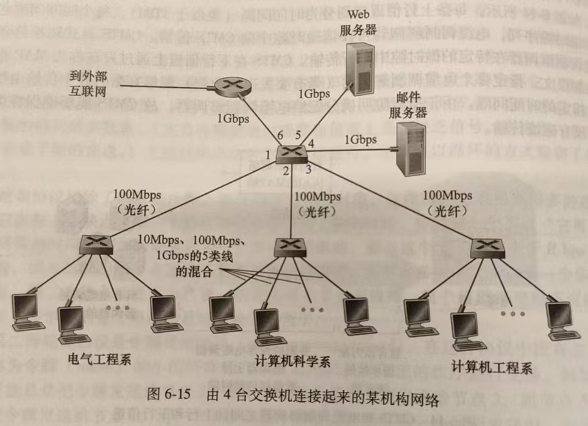

### 6.4.1 链路层寻址和ARP

#### 1. MAC地址

并不是主机或路由器具有链路层地址，而是它们的适配器（即网络接口）具有链路层地址。因此，具有多个网络接口的主机或路由器将具有与之相关联的<u>多个</u>链路层地址。然而，重要的是注意到链路层交换机并不具有与它们的接口（这些接口是与主机和路由器相连的）相关联的链路层地址。这是因为**链路层交换机的任务**是在主机与路由器之间承接数据报；交换机<u>透明</u>地执行该任务，主机或路由器不必明确地将帧寻址到其间的交换机。如下图。

链路层地址有各种不同的称呼：**LAN地址**（LAN address）、**物理地址**(physical address)或**MAC地址**（MAC address）。对于大多数局域网（包括以太网和802.11无线局域网）而言，MAC地址长度为6字节，共有2^48^个可能的MAC地址。尽管MAC地址被设计为永久的，但用软件改变一块适配器的MAC地址现在是可能的。因此，对后面的内容，我们假设某适配器的MAC地址是固定的。

IEEE管理MAC地址空间，因此，没有两块适配器具有相同的地址。

当一个公司购买2^24^个地址的一块地址空间，IEEE分配这块2^24^个地址的方式是：固定一个MAC地址的前24个比特，让公司自己为每个适配器生成后24比特的唯一组合。

- MAC地址（社保号）——扁平结构：适配器不管到哪都不变
- IP地址（邮政地址）——层次结构（一个网络部分和一个主机部分）：当主机移动时，主机的IP地址需要改变，即改变它所连接的网络。

当某适配器要向某些目的适配器<u>发送一个帧</u>时，发送适配器将目的适配器的MAC地址插入到该帧中，并将该帧发送到局域网上。当适配器接收到一个帧时，将检查该帧中的目的MAC地址是否与它自己的MAC地址匹配。如果匹配，则接收；否则，丢弃。

**MAC广播地址**：FF-FF-FF-FF-FF-FF，让局域网上所有适配器来接收并处理

#### 2.地址解析协议（Address Resolution Protocol，ARP）

<u>假设</u>交换机广播所有帧，也就是说，交换机接收一个帧，将在其他所有接口转发该帧。

事件：IP地址为222.222.222.220的主机要向主机222.222.222.222发送IP数据报。

问题：发送主机如何确定IP地址为222.222.222.222的目的主机的MAC地址呢？

解决方法：使用ARP。在发送主机中的ARP模块将取在相同局域网上的任何IP地址作为输入，然后返回相应的MAC地址。在这个例子中，发送主机222.222.222.220向它的ARP模块提供了IP地址222.222.222.222，并且其ARP模块返回了相应的MAC地址49-BD-D2-C7-56-2A。

ARP与DNS区别：

- DNS为在因特网中的任何地方的主机解析主机名
- ARP只为在同一个子网上的主机和路由器接口解析IP地址。

每台主机或路由器在其<u>内存</u>中具有一个**ARP表**。注意：不必为子网中的每台主机和路由器包含一个表项。

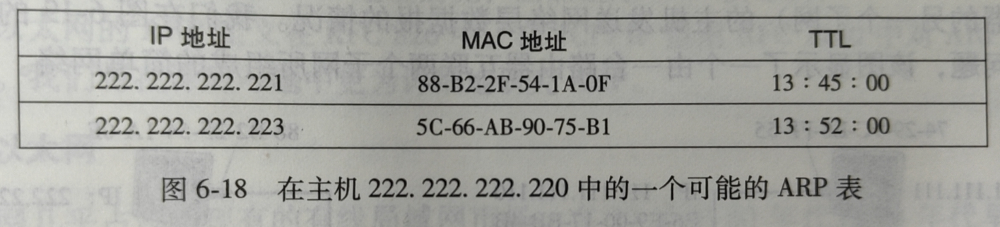

如果表中没有怎么办？

用ARP协议来解析这个地址。首先，发送方构造一个称为**ARP分组**的特殊分组。一个ARP分组有几个字段，包括<u>发送和接收IP地址及MAC地址</u>。ARP查询分组和响应分组都具有相同的格式。ARP查询分组的目的是询问子网上所有其他主机和路由器，以确定对应于要解析的IP地址的那个MAC地址。

例子中，222.222.222.220向它的适配器传递了一个ARP查询分组，并且指示适配器应该用MAC广播地址来发送这个分组。适配器在链路层帧中封装这个ARP分组，用广播地址作为帧的目的地址，并将该帧传输进子网中。包含该ARP查询的帧能被子网中的所有其他适配器接收到，并且（由于广播地址）每个适配器都把在该帧中的ARP分组向上传递给ARP模块。这些ARP模块中的每个都检查它的IP地址是否与ARP分组中的目的IP地址相匹配。与之匹配的一个给查询主机发送回一个带有所希望映射的响应ARP分组。然后查询主机222.222.222.220能够更新它的ARP表，并发送它的IP数据报，该数据报封装在一个链路层帧中，并且该帧的目的MAC就是对先前ARP请求进行响应的主机或路由器的MAC地址。

注意：查询ARP报文在广播帧中发送，响应ARP报文在标准帧中发送。ARP是即插即用的，即一个ARP表是自动建立的，不需要系统管理员来配置。并且如果某主机与子网断开连接，它的表项最终会从留在子网中的节点的表中删除掉（因为TTL）。

ARP分组封装在链路层中，因而在体系结构上位于链路层。然而，一个ARP分组具有包含链路层地址的字段，因而可认为是链路层协议，但它也包含网络层地址，因而也可认为是网络层协议。所以可能最好把ARP看成是<u>跨越链路层和网络层</u>边界两边的协议。

#### 3.发送数据报到子网以外

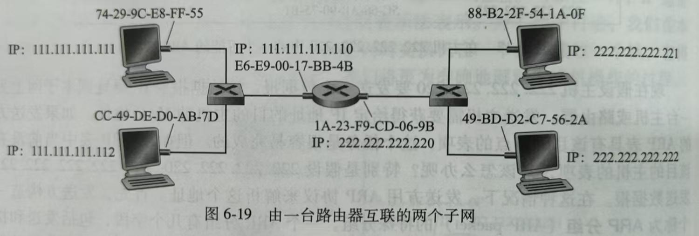

事件：主机111.111.111.111要向主机222.222.222.222发送一个IP数据报。

解决方案：通过ARP，发送主机获得111.111.111.110（路由器接口IP地址）的MAC地址。接着，发送主机创建一个帧（包含了寻址到222.222.222.222的数据报，该帧的目的MAC地址为E6-E9-00-17-BB-4B），并把该帧发送到子网1中。在子网1中的路由器适配器看到该帧是向它寻址的，因此把这个帧传递给路由器中的网络层。转发表告诉路由器该数据报要通过路由器接口222.222.222.220转发。然后该接口把这个数据报传递给它的适配器，适配器把该数据报封装到一个新的帧中（目的MAC地址通过ARP获得），并将帧发送进子网2中。这时，该帧的目的MAC地址确实是最终目的地MAC地址。

### 6.4.2 以太网

#### 1.以太网帧结构

假设发送适配器A的MAC地址是AA-AA-AA-AA-AA-AA，接收适配器B的MAC地址是BB-BB-BB-BB-BB-BB

- 数据字段：承载了IP数据报。
- 目的地址：包含目的适配器的MAC地址。在例子中为BB-BB-BB-BB-BB-BB。适配器接收包含自己MAC地址或广播地址的帧。
- 源地址：包含了传输该帧到局域网上的MAC地址，在例子中为AA-AA-AA-AA-AA-AA
- 类型字段：类型字段允许以太网复用多种网络层协议。（网络层有IP和其他网络层协议，如Novell IPX或AppleTalk，它们都有各自的标准化的类型编号）
- CRC：差错检测
- 前同步码（8字节）：前7个字节值都是10101010；最后一个字节是10101011。前7字节用于“唤醒”接收适配器，并且将它们的时钟和发送方的时钟同步。第8个字符的最后两个比特警告适配器B，“大的要来了”。

所有的以太网技术都向网络层提供**无连接**服务。这就是说，当适配器A要向适配器B发送一个数据报时，适配器A在一个以太网帧中封装该数据报，并且把该帧发送到局域网上，<u>没有先与适配器B握手</u>（类似UDP）。

以太网技术向网络层提供**不可靠**服务。

#### 2.以太网技术

10BASE-T、10BASE-2、100BASE-T、1000BASE-LX、10GBASE-T、40GBASE-T

10、100、1000、10G或40G 是该标准的速度，分别表示10Mbps,100Mbps,1Gbps,10Gbps,40Gbps 。“BASE”指基带以太网，这意味着该物理媒介仅承载以太网流量；几乎所有802.3标准都适用于基带以太网。最后部分指物理媒介本身，“T”指双绞铜线。

转发器（repeater)是一种物理层设备，能在输入端接收信号并在输出端再生该信号。

吉比特以太网是对极为成功的10Mbps和100Mbps以太网标准的扩展。40Gbps以太网提供40 000Mbps的总数据速率，与大量设备兼容。吉比特以太网标准称为IEEE 802.3z，它完成以下工作：

- 使用标准以太网格式，并且向后兼容（见前面图6-20）
- 允许点对点链路以及共享的广播信道。点对点链路使用交换机，而广播信道使用集线器。在吉比特以太网术语中，集线器被称为**带缓存的分配器**。
- 使用CSMA/CD来共享广播信道。
- 对于点对点信道，允许在两个方向上都以40Gbps全双工操作。

现代交换机是全双工的，这使得一台交换机和一个节点能够在同时向对方发送帧而没有干扰。换句话说，在基于交换机的以太局域网，不会有碰撞，因此没有必要使用MAC（Media Access Control）协议（如CSMA/CD协议）。

### 6.4.3 链路层交换机

交换机输出接口有缓存。

#### 1. 转发和过滤

**过滤**（filtering）：决定一个帧应该转发到某个接口还是应当将其丢弃。

**转发**（forwarding）：决定 一个帧应该被导向哪个接口，并把该帧移动到那些接口。

二者借助**交换机表**（swith table）完成。

<u>假定</u>目的地址为DD-DD-DD-DD-DD-DD的帧从交换机接口x到达。交换机用MAC地址DD-DD-DD-DD-DD-DD索引它的表。有三种可能的情况：

- 表中没有对应DD-DD-DD-DD-DD-DD的表项。交换机广播该帧。
- 表中有DD-DD-DD-DD-DD-DD与接口x关联的表项。在这种情况下，该帧从包括适配器DD-DD-DD-DD-DD-DD的局域网到来。交换机通过丢弃该帧执行过滤操作。
- 表中有DD-DD-DD-DD-DD-DD与接口y!=x关联的表项。交换机通过将该帧放到接口y前面的输出缓存完成转发功能。 

#### 2.自学习

1. 交换机表初始为空。
2. 对于在每个接口接收到的每个入帧，该交换机在其表中存储：
   - 在该帧源地址字段中的MAC地址
   - 该帧到达的接口
   - 当前时间

3. 如果一段时间（老化期，aging time）后，交换机没有接收到以该地址作为源地址的帧，就在表中删除这个地址。以这种方式，如果一台PC被另一台PC（具有不同的适配器）代替，原来PC的MAC地址将最终从该交换机表中被清除掉。

交换机是**即插即用设备**（plug-and-play device），要安装交换机的网络管理员除了将局域网段与交换机的接口相连外，不需要做其他任何事。交换机是**双工**的。

#### 3.链路层交换机的性质

- 消除碰撞。
- 异质的链路。交换机将链路彼此隔离，对于原有的设备与新设备混用，交换机是理想的。
- 管理。提供强化的安全性，且易于管理。

交换机毒化（switch poisoning）：向交换机发送大量的具有不同伪造源MAC地址的分组，因而用伪造表项填满了交换机表，没有为合法主机留下空间。这使得交换机广播大多数帧，这些帧能由嗅探器俘获。

#### 4.交换机和路由器比较

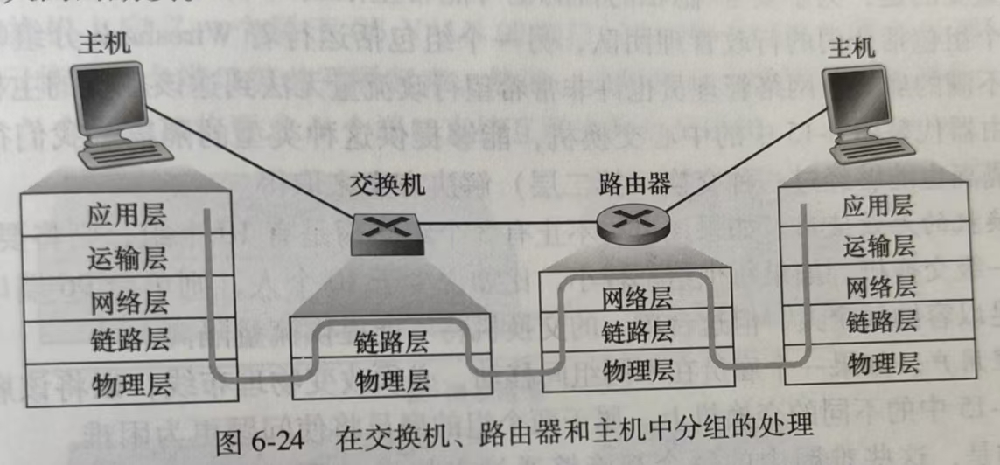

交换机

- 优点：
  - 即插即用
  - 具有相对高的分组过滤和转发速率
- 缺点：

  - 为了防止广播帧的循环，交换网络的活跃拓扑限制为一棵生成树。

  - 一个大型交换网络将要求在主机和路由器中有大的ARP表，这将生成可观的ARP流量和处理量。
  - 对广播风暴不提供任何保护措施

路由器：

- 优点
  - 网络寻址是分层次的，即使网络中存在冗余路径时，分组通常也不会通过路由器循环，所以，分组不会被限制到一棵生成树上。
  - 对第二层的广播风暴提供了防火墙保护

- 缺点
  - 不是即插即用的。即路由器和连接到它的主机都需要人为地配置IP地址
  - 路由器对每个分组的处理时间通常比交换机更长。因为它必须处理高达三层的字段。

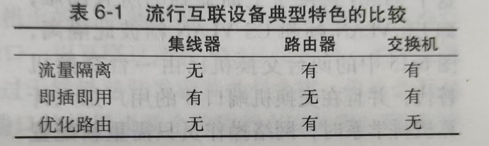

通常，由几百台主机组成的小网络通常有几个局域网网段。对于这种小网络，交换机就足够了，因为它们不要求IP地址的任何配置就能使流量局部化并增加总计吞吐量。但在几千台主机组成的更大网络中通常在网络中（除了交换机之外）还包括路由器。路由器提供了更健壮的流量隔离方式和对广播风暴的控制，并在网络的主机之间使用更“智能的”路由。

### \* 转发表，ARP，交换机表

转发表

| 前缀匹配    | 链路接口 |
| ----------- | -------- |
| 010000110   | 3        |
| 10010100110 | 2        |
| 10111       | 1        |
| ...         | ...      |

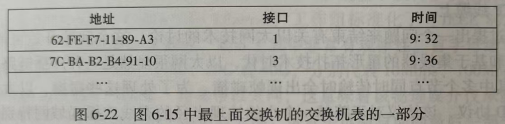

- 转发表：IP前缀——>路由器接口（第三层，路由器中）
- ARP表：IP地址——>MAC地址（第二、三层之间，主机、路由器内存中）
- 交换机表：MAC地址——>交换机接口（第二层，交换机中）

### 6.4.4 虚拟局域网

现代机构的局域网常常是配置为等级结构的，每个工作组（部门）有自己的交换网，经过一个交换机等级结构与其他工作组的交换局域网互联。这有3个缺点：

- **缺乏流量隔离**。希望限制广播流量在局域网中的传播。
- **交换机的无效使用**。如果每个组较小，则单台96端口交换机将足以容纳，但单一的交换机不能提供流量隔离。
- **管理用户**。如果一个雇员在不同组间移动，必须改变物理布线，以将雇员连接到不同的交换机上。

以上问题可通过支持**虚拟局域网**（Virtual Local Network，VLAN）的交换机来处理。

支持VLAN的交换机允许经一个单一的物理局域网基础设施定义多个虚拟局域网。在一个VLAN内的主机彼此通信，仿佛它们（并且没有其他主机）与交换机连接。在一个基于端口的VLAN中，交换机的端口（接口）由网络管理员划分为组。每个组构成一个VLAN，在每个VLAN中的端口形成一个广播域（即来自一个端口的广播流量仅能到达该组中的其他端口）。

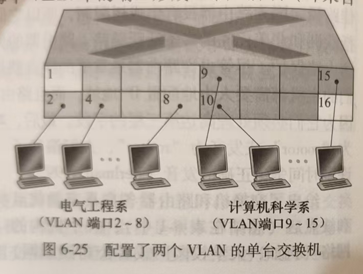

上图显示了具有16个端口的单一交换机。端口2\~8属于电气工程系VLAN，……。这个VLAN解决了上面提到的所有困难。

*如何在两个VLAN中传递信息？*

解决方式1：将VLAN交换机的一个端口与一台外部的路由器相连，并且将该端口配置为EE VLAN和CS VLAN。在此情况下，其逻辑配置看起来也仿佛是电子工程系和计算机科学具有分离的经路由器连接的交换机。

解决方法2：交换机厂商制造了包含一台VLAN交换机和一台路由器的单一设备，这样就不需要分离的外部路由器了。

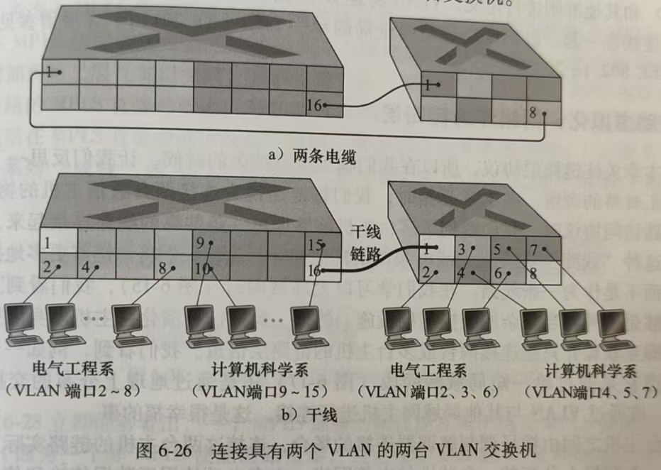

图6-26b中所示互联VLAN的方法称为**VLAN干线连接**（VLAN trunking）。每台交换机上的一个特殊端口（左侧交换机上的端口16，右侧交换机上的端口1）被配置为干线端口，以互联这两台VLAN交换机。该干线端口属于所有VLAN，发送到任何VLAN的帧经过干线链路转发到其他交换机。

*交换机怎么知道到达干线端口的帧属于某个特定的VLAN呢？*

> IEEE定义了一种扩展的以太网帧格式——802.1Q，用于跨越VLAN干线的帧。如下图所示，802.1Q帧由标准以太网帧与加进首部的4字节**VLAN标签**（VLAN tag）组成，而VLAN标签承载着该帧所属的VLAN标识符。VLAN标签由在VLAN干线发送侧的交换机加进帧中，解析后并由在VLAN干线接收侧的交换机删除。VLAN标签自身由一个2字节的**标签协议标识符**（Tag Protocol Identifier，TPID）字段（具有固定的十六进制值81-00）、一个2字节的标签控制信息字段（包含一个12比特的VLAN标识符字段）和一个3比特优先权字段（具有类似于IP数据报TOS字段的目的）组成。

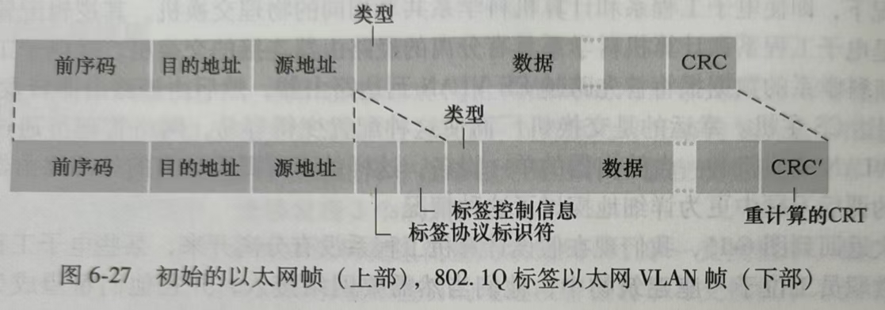

VLAN能够以几种其他方式定义。

- 在基于MAC的VLAN中，网络管理员指点属于每个VLAN的MAC地址的集合；无论何时一个设备与一个端口连接时，端口基于设备的MAC地址将其连接进适当的VLAN。
- VLAN也能基于网络协议和其他准则进行定义。
- VLAN跨越IP路由器扩展也是可能的，这使得多个LAN孤岛能被连接在一起，以形成能够跨越全局的单一LAN。

## 6.5 链路虚拟化：网络作为链路层

### 多协议标签交换（Multiprotocol Label Switching, MPLS）

MPLS本身是一种分组交换的虚电路网络。

采用来自虚电路网络领域的一个关键概念：固定长度标签。其目标是：对于基于固定长度标签和虚电路的技术，在不放弃基于目的地IP数据报转发的基础设施的前提下，当可能时通过选择地标识数据报并允许路由器基于固定长度的标签（而不是目的地IP地址）转发数据报来增强其功能。重要的是：这些技术与IP协同工作，使用IP寻址和路由选择。

上图显示了MPLS使能的路由器之间传输的一个链路层帧，该帧具有一个小的MPLS首部，该首部增加到第二层（如以太网）首部和第三层（即IP）首部之间。

一个MPLS加强的帧仅能在两个均为MPLS使能的路由器之间发送。

一个MPLS使能的路由器常被称为**标签交换路由器**（label-switched router），因为它通过在其转发表中查找MPLS标签，然后立即将数据报传递给适当的输出接口来转发MPLS帧。因此，MPLS使能的路由器不需要提取目的IP地址和在转发表中执行最长前缀匹配的查找。

*路由器怎样才能知道它的邻居是否是MPLS使能的呢？路由器如何知道哪个标签与给定IP目的地相联系呢？*

> 请看下面MPLS使能路由器之间的交互过程

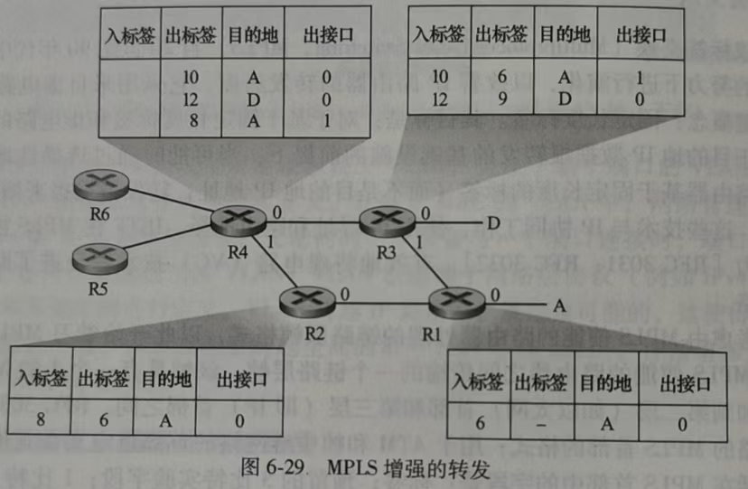

在上图中，路由器R1到R4都是MPLS使能的，R5和R6是标准的IP路由器。R1向R2和R3通告了它（R1）能够路由到目的地A，并且具有MPLS标签6的接收帧将要转发到目的地A。路由器R3已经向路由器R4通告l它能够路由到目的地A和D，分别具有MPLS标签10和12的入帧将朝着这些目的地交换。路由器R2也向路由器R4通告了它（R2）能够到达目的地A，具有MPLS标签8的接收帧将朝着A交换。注意到R4现在处于一个到达A且有两个MPLS路径的令人感兴趣的位置上，经接口0具有出MPLS标签10，经接口1具有出MPLS标签8 。MPLS使能路由器R1到R4完成这些工作时从没有接触分组的IP首部。

真正的优点：MPLS使能的新的流量管理能力。如前所述，R4到A具有两条MPLS路径。如果转发在IP层基于IP地址进行，IP路由协议将只指定到A的单一最小费用的路径。所以，==MPLS提供了沿着多条路由转发分组的能力==，使用标准IP路由选择协议这些路由将是不可能的。这是使用MPLS的一种简单形式的**流量工程**(traffic engineering)，其中网络运行者能够超越普通的IP路由选择，迫使某些流量沿着一条路径朝着某给定的目的地引导，并且朝着相同的目的地的其他流量沿着另一条路径流动。

MPLS能被用于将资源和由用户的VPN使用的寻址方式相隔离，其他用户利用该VPN跨越该ISP网络。

## 6.6 数据中心网络

数据中心用途：

- 向用户提供网页、搜索结果、电子邮箱或流媒体视频等内容
- 用于特定数据处理任务的大规模并行计算基础设施，比如搜索引擎的分布式索引计算
- 为其他公司提供云计算服务

### 6.6.1 数据中心体系结构

数据中心中的主机称为**刀片**（blade），一般是包括CPU、内存和磁盘存储的商用主机。主机被堆叠在机架上，每个机架顶部有一台交换机，称为**机架顶部（Top of Rack，TOR）交换机**。每台主机有一块与TOR交换机连接的网卡，每台TOR交换机有额外的端口能够与其他TOR交换机连接。

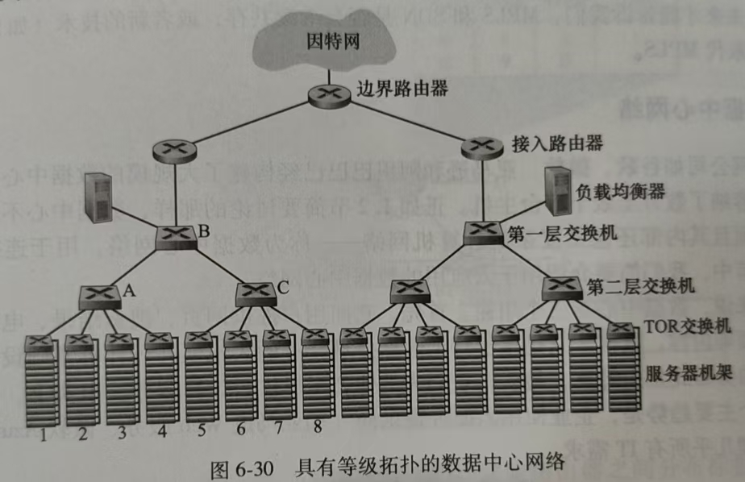

#### 1.负载均衡

为了支持来自外部客户的请求，每一个应用都与一个公开可见的IP地址关联，外部用户向该地址发送其请求并从该地址接收响应。在数据中心内部，外部请求首先被定向到一个**负载均衡器**（load balancer）。负载均衡器的<u>任务</u>是向主机分发请求，以主机当前的负载作为函数来在主机之间负载均衡。一个大型的数据中心通常会有几台负载均衡器，每台服务于一组特定的云应用。由于负载均衡器基于分组的目的端口号（第四层）以及目的IP地址做决策，因此被称为“第四层交换机”。

负载均衡器不仅平衡主机间的工作负载，而且还提供类似NAT的功能，将外部IP地址转换为内部适当主机的IP地址，然后将反方向流向客户的分组按照相反的转换进行处理。这可防止客户直接接触主机，从而具有隐藏网络内部结构和防止客户直接与主机交互等安全性方面的好处。

#### 2. 等级体系结构

对于小型数据中心，一个简单网络就够了。这种简单网络由一台边界路由器、一台负载均衡器和几十个机架组成，这些机架由单一以太网交换机进行互联。当主机规模宽展到几万至几十万的时候，数据中心通常应用**路由器和交换机等级结构**（hierarchy of router and switch），如上图6-30 。

上图等级结构解决了扩展性问题，但是依然存在**主机到主机容量受限**的问题。解决方案：

- 部署速度更快的交换机和路由器。
- 将相关服务和数据放在尽可能近的位置。
- 增强TOR交换机和第二层交换机之间以及第二层交换机和第一层交换机之间的连接。

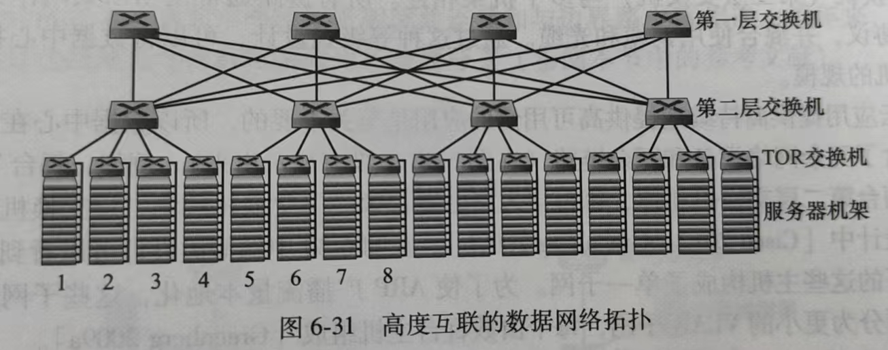

###  6.6.2 数据中心网络的发展趋势

#### 1. 成本降低

#### 2. 集中式SDN控制和管理

#### 3. 虚拟化

#### 4. 物理约束

#### 5. 硬件模块化和定制化

## 6.7 回顾：Web页面请求的历程

事件：一名学生Bob将他的便携机与学校的以太网交换机相连，下载一个Web页面（比如www.google.com主页）。

### 6.7.1 准备：DHCP、UDP、IP和以太网

我们假定Bob启动他的便携机，然后将其一根以太网电缆连接到学校的以太网交换机，交换机又与学校的路由器相连。如下图所示。

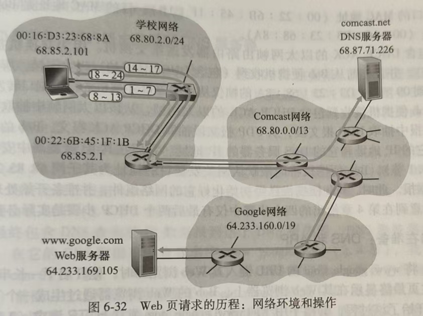

学校的路由器与一个ISP连接，本例中的ISP为comcast.net。在本例中，comcast.net为学校提供了DNS服务（comcast.net是本地DNS服务器）；所以，DNS服务器驻留在Comcast网络中而不是学校网络中。我们假设DHCP服务器运行在路由器中，就像常见情况那样。

当Bob首先将便携机与网络相连时，没有IP地址他就不能做任何事情。所以，Bob的便携机所采取的一个网络相关的操作是运行DHCP协议，以从本地DHCP服务器获得一个IP地址以及其他信息。

1. Bob便携机上的操作系统生成一个**DHCP请求报文**，并将这个报文放入具有目的端口67（DHCP服务器）和源端口68（DHCP客户）的**UDP报文段**。该报文段则被放置在一个具有广播IP目的地址（255.255.255.255）和源IP地址0.0.0.0的**IP数据报**中，因为Bob的便携机还没有一个IP地址。
2. 包含DHCP请求报文的IP数据报则被放置在**以太网帧**中。该以太网帧具有目的MAC地址FF:FF:FF:FF:FF:FF，使该帧将广播到与交换机连接的所有设备（如果顺利的话也包括DHCP服务器）；该帧的源MAC地址是Bob便携机的MAC地址00:16:D3:23:68:8A。
3. 包含DHCP请求的广播以太网帧是第一个由Bob便携机发送到以太网交换机的帧。该交换机在所有的出端口广播入帧，包括连接到路由器的端口。
4. 路由器在它的具有MAC地址00:22:6B:45:1F(:1B,之前没写)的接口接收到该广播以太网帧，该帧包含DHCP请求，并且从该以太网帧中抽取出IP数据报。该数据报的广播IP目的地址指示了这个IP数据报应当由在该节点的高层协议处理，因此该数据报的负载（一个UDP报文段）**被分解**向上到达UDP，DHCP请求报文从此UDP报文段中抽取出来，此时DHCP服务器有了DHCP请求报文。
5. 我们假设运行在路由器中的DHCP服务器能够以**CIDR**块68.85.2.0/24分配IP地址。所以本例中，在学校内使用的所有IP地址都在Comcast的地址块中。我们假设DHCP服务器分配地址68.85.2.101给Bob的便携机。DHCP服务器生成包含这个IP地址以及DNS服务器的IP地址（68.87.71.226）、默认网关路由器的IP地址（68.85.2.1）和子网块（68.85.2.0/24）（等价为“网络掩码”）的一个DHCP ACK**报文**。该DHCP报文被放入一个UDP报文段中，UDP报文段被放入一个IP数据报中，IP数据报再被放入一个以太网帧中。这个以太网帧的源MAC地址是路由器连到归属网络时的MAC地址（00:22:6B:45:1F:1B），目的MAC地址是Bob便携机的MAC地址（00:16:D3:23:68:8A）。
6. 包含DHCP ACK的以太网帧由路由器发送到交换机。因为交换机是**自学习**的，并且先前从Bob便携机收到以太网帧，所以该交换机知道寻址到00:16:D3:23:68:8A的帧仅从通向Bob便携机的输出端口转发。
7. Bob便携机接收到包含DHCP ACK的以太网帧，从该以太网帧中抽取IP数据报，从IP数据报中抽取UDP报文段，从UDP报文段抽取DHCP ACK报文。Bob的DHCP客户则记录下它的IP地址和它的DNS服务器的IP地址。它还在其**IP转发表**中安装默认网关地址。Bob便携机将向默认网关发送目的地址为其子网68.85.2.0/24以外的所有数据报。此时，Bob便携机以及初始化好它的网络组件，并准备开始处理Web网页获取。

### 6.7.2 仍在准备：DNS和ARP

在Bob将www.gogle.com的URL键入其Web浏览器时，他开启了一长串事件，这将导致谷歌主页最终显示在其Web浏览器上。Bob的Web浏览器通过生成一个**TCP套接字**开始了该过程，套接字用于向www.gogle.com发送**HTTP请求**。为了生成该套接字，Bob便携机将需要知道www.gogle.com的IP地址。使用**DNS协议**提供这种名字到IP地址的转换服务。

8. Bob便携机上的操作系统因此生成一个**DNS查询报文**，将字符串www.gogle.com放入DNS报文的问题段中。该UDP报文段则被放入具有IP目的地址68.87.71.226和源IP地址68.85.2.101的IP数据报中。
9. Bob便携机则将包含DNS请求报文的数据报放入一个以太网帧中。该帧将发送（在链路层寻址）到Bob学校网关中的网关路由器。然而，即使Bob便携机经过上述第5步中的DHCP ACK报文知道了学校网关路由器的IP地址（68.85.2.1），但仍不知道该网关路由器的MAC地址。为了获得该网关的MAC地址，Bob便携机将需要使用**ARP协议**。
10. Bob便携机生成一个具有目的IP地址68.85.2.1（默认网关）的**ARP查询报文**，将该报文放置在一个具有广播目的地址（FF:FF:FF:FF:FF:FF）的以太网帧中，并向交换机发送该以太网帧，交换机将该帧交付给所有连接的设备，包括网关路由器。
11. 网关路由器在通往学校网络的接口上接收到包含该ARP查询报文的帧，发现在ARP报文中目标IP地址68.85.2.1匹配其接口的IP地址。网关路由器因此准备一个**ARP回答**，指示它的MAC地址00:22:6B:45:1F:1B对应IP地址68.85.2.1 。它将ARP回答放在一个以太网帧中，其目的地址为00:16:D3:23:68:8A(Bob便携机)，并向交换机发送该帧，再由交换机将该帧交付给Bob便携机。
12. Bob便携机接收包含ARP回答报文的帧，并从ARP回答报文中抽取网关路由器的MAC地址(00:22:6B:45:1F:1B)。
13. Bob便携机现在能够使包含DNS查询的以太网帧寻找到网关路由器的MAC地址。注意到在该帧中的IP数据报具有IP目的地址68.87.71.226（DNS服务器），而该帧具有目的地址00:22:6B:45:1F:1B（网关路由器）。Bob便携机向交换机发送该帧，交换机将该帧交付给网关路由器。

### 仍在准备：域内路由选择到DNS服务器

14. 网关路由器接收该帧并抽取包含DNS查询的IP数据报。路由器查找该数据报的目的地址（68.87.71.226），并根据其转发表决定该数据报应当发送到图6-22的Comcast网络中最左边的路由器。IP数据报放置在链路层帧中，该链路适合将学校路由器连接到最左边Comcast路由器，并且该帧经这条链路发送。
15. 在Comcast网络中最左边的路由器接收到该帧，抽取IP数据报，检查该数据报的目的地址（68.87.71.226），并根据其转发表确定出接口，经过该接口朝着DNS服务器转发数据报，而转发表已根据Comcast的域内协议（如RIP、OSPF或IS-IS）以及**因特网的域间协议BGP**所填写。
16. 最终包含DNS查询的IP数据报到达了DNS服务器。DNS服务器抽取出DNS查询报文，在它的DNS数据库中查找名字www.gogle.com，找到包含对应www.gogle.com的IP地址的**DNS源记录**。（假设它当前缓存在DNS服务器中。）前面讲过这种缓存数据源于gogle.com的**权威DNS服务器**。该DNS服务器形成了一个包含这种主机名到IP地址映射的**DNS回答报文**，将该DNS回答报文放入UDP报文段中，该报文段放入寻址到Bob便携机（68.85.2.101）的IP数据报中。该数据报将通过Comcast网络反向转发到学校的路由器，并从这里经过以太网交换机到Bob便携机。
17. Bob便携机从DNS报文抽取出服务器www.gogle.com的IP地址。最终，Bob便携机此时准备接触www.gogle.com服务器。

### 6.7.4 Web 客户-服务器交互：TCP和HTTP

18. 既然Bob便携机有了www.gogle.com的IP地址，它能够生成**TCP套接字**，该套接字将用于向www.gogle.com发送HTTP GET报文。当Bob生成TCP套接字时，在Bob便携机中的TCP必须首先与www.gogle.com中的TCP执行**三次握手**。Bob便携机因此首先生成一个具有目的端口80（针对HTTP的）的**TCP SYN**报文段，将该TCP报文段放置在具有目的IP地址64.233.169.105（www.gogle.com）的IP数据报中，并将该数据报放置在MAC地址为00:22:6B:45:1F:1B(网关路由器)的帧中，并向交换机发送该帧。
19. 在学校网络、Comcast网络和谷歌网络中的路由器朝着www.gogle.com转发包含TCP SYN的数据报，使用每台路由器中的转发表，如前面步骤14\~16那样。支配分组经Comcast和谷歌网络之间域间链路的路由器转发表项，是由**BGP**协议决定的。
20. 最终，包含TCP SYN的数据报到达www.gogle.com。从数据报抽取出TCP SYN报文并分解到与端口80相联系的欢迎套接字。对于谷歌HTTP服务器和Bob便携机之间的TCP连接生成一个欢迎套接字。产生一个TCP SYNACK报文段，将其放入向Bob便携机寻址的一个数据报中，最后放入链路层帧中，该链路适合将www.gogle.com连接到其第一跳路由器。
21. 包含TCP SYNACK报文段的数据报通过谷歌、Comcast和学校网络，最终到达Bob便携机的以太网卡。数据报在操作系统中分解到步骤18生成的TCP套接字，从而进入连接状态。
22. 借助于Bob便携机上的套接字，现在准备向www.gogle.com发送字节了，Bob的浏览器生成包含要获取的URL的HTTP GET报文。HTTP GET报文则写入套接字，其中GET报文成为一个TCP报文段的载荷。该TCP报文段放置进一个数据报中，并交付到www.gogle.com，如前面步骤18\~20所述。
23. 在www.gogle.com的HTTP服务器从TCP套接字读取HTTP GET报文，生成一个**HTTP 响应**报文，将请求的Web页内容放入HTTP响应体中，并将报文发送进TCP套接字中。
24. 包含HTTP回答报文的数据报通过谷歌、Comcast和学校网络转发，到达Bob便携机。Bob的Web浏览器程序从套接字读取HTTP响应，从HTTP响应体中抽取Web网页的html，并最终显示了Web网页。

# 7. 无线网络和移动网络

## 7.1 概述

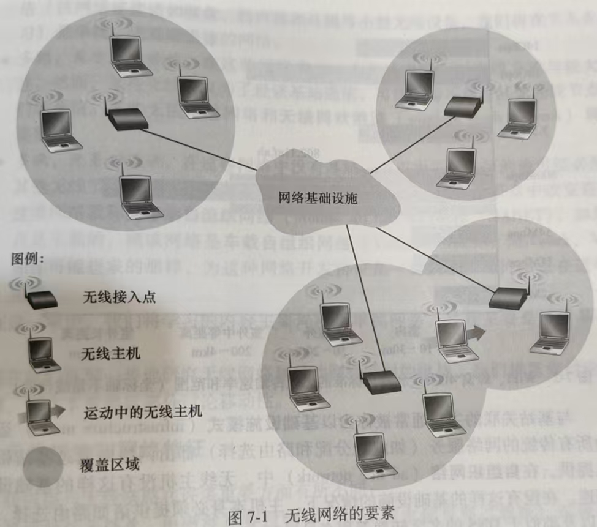

无线网络要素：

- **无线主机**
- **无线链路**
- **基站**（base station）；负责向与之关联的无线主机发送数据并从主机那里接收数据。一台无线主机与某基站“相关联”指
  1. 该主机位于该基站的无线通信覆盖范围内
  2. 该主机使用该基站中继它（该主机）和更大网络之间的数据。

eg。蜂窝网络中的蜂窝塔（cell tower），802.11无线局域网中的接入点（access point）。
与基站相关联的主机通常被称为以**基础设施模式**（infrastructure mode）运行，因为所有传统的网络服务（如地址分配和路由选择）都由网络向通过基站相连的主机提供。在**自组织网络**（ad hoc network）中，无线主机没有这样的基础设施与之相连。在没有这样的基础设施的情况下，主机本身必须提供诸如路由选择、地址分配以及类似于DNS的名字转换等服务。
当一台移动主机超出一个基站的覆盖范围而到达另一个基站的覆盖范围后，它将接入更大网络的连接点（例如，改变与之相关联的基站），这一过程称作**切换**（handoff或handover）。

- **网络基础设施**。这是无线主机希望与之进行通信的更大网络。

对无线网络进行分类的两个准则：

1. 在该无线网络中的分组是否跨越了一个无线跳或多个无线跳。
2. 网络中是否有诸如基站这样的基础设施。

- 单跳，基于基础设施。这些网络具有与较大的有线网络（如因特网）连接的基站。此外，该基站与无线主机之间的所有通信都经过一个无线跳
- 单跳，无基础设施。在这些网络中，不存在与无线网络相连的基站。
- 多跳，基于基础设施。
- 多跳，无基础设施。

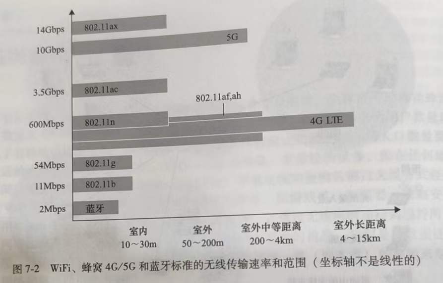

## 7.2 无线链路和网络特征

有线链路和无线链路之间的不同：

- 递减的信号强度。**路径损耗**（path loss）
- 来自其他源的干扰。在同一频段发送信号的电波源将相互干扰。
- 多路径传播。当电磁波的一部分受反射，走了不同路径，会出现**多径传播**（multipath propagation）。

**信噪比**（Signal-to-Noise Ratio，SNR）是所收到的信号（如被传播的信息）和噪声强度的相对测量。单位：分贝（dB)

**比特差错率**(BER)是在接收方收到的有错传输比特的概率。

- **对于给定的调制方案，SNR越高，BER越低**。

- **对于给定的SNR，具有较高比特传输率的调制技术（无论差错与否）将具有较高的BER**。

- 物理层调制技术的动态选择能用于适配对信道条件的调制技术。

  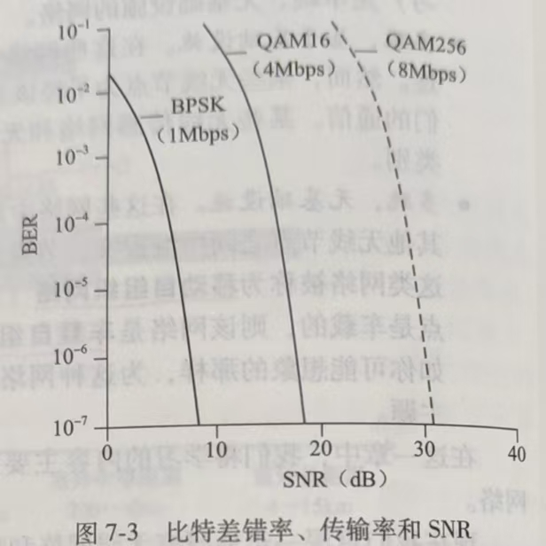

下图为隐藏终端问题。

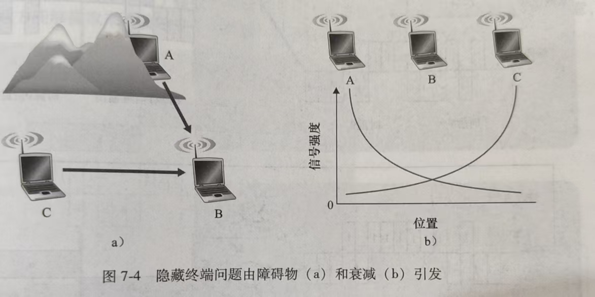

**码分多址**（Code Division Multiple Access，CDMA）：属于信道划分协议的一族协议。在CDMA协议中，要发送的每个比特都通过乘以一个信号（编码）的比特来进行编码，这个信号的变化速率（**码片速率**）比初始数据比特序列速率快的多。CDMA是一个划分协议，因为它划分编码空间（与时间或频率相对），并且给每个节点分配了一段专用的代码空间。

CDMA协议类似于让聚会客人使用多种语言来谈论，在这种情况下，人们实际非常善于锁定他们能听懂语言的谈话，而过滤了其他的谈话。

## 7.3 WIFI：802.11无线局域网

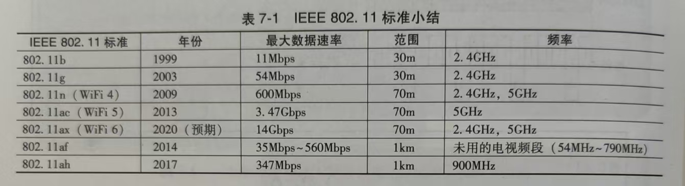

### 7.3.1 802.11无线局域网体系结构

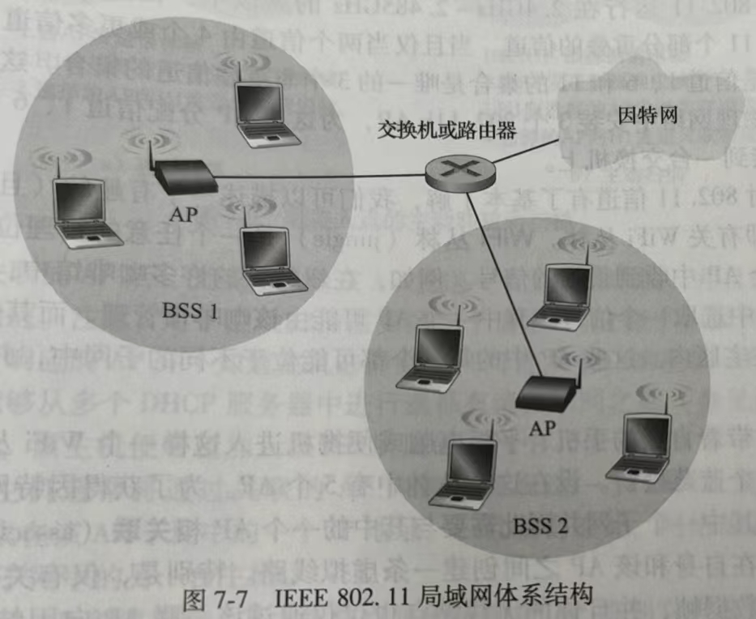

802.11体系结构的基本构件模块是**基本服务集**（Basic Service Set，BSS）。

BSS包含一个或多个无线站点以及一个在802.11术语中称为**接入点**（Access Point，AP）的中央**基站**。

与以太网设备类似，每个802.11无线站点都具有一个6字节的MAC地址，该地址存储在该站适配器（即802.11网络接口卡）的固件中。每个AP的无线接口也具有一个MAC地址。

部署AP的无线局域网被称为**基础设施无线局域网**（infrastructure wireless LAN），其中的“基础设施”是指AP连同互联AP和一台路由器的有线以太网。

下图为**自组织网络**。

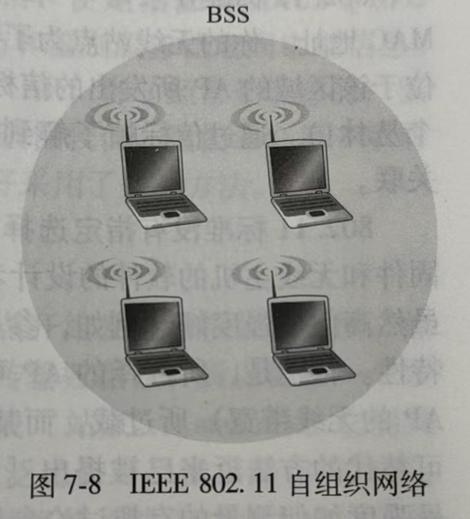

#### 信道与关联

当某网络管理员安装一个AP时，该管理员为该接入点分配一个单字或双字的**服务集标识符**（Service Set Identifier，**SSID**）。管理员还必须为该AP分配一个**信道号**。

信道号理解：802.11运行在2.4GHz\~2.485GHz的频段中，在这个85MHz的频段内，802.11定义了11个<u>部分重叠</u>的信道。当且仅当两个信道由4个或更多信道隔开时它们才无重叠。特别是信道1、6、11的集合是唯一的3个无重叠信道的集合。

WiFi丛林（jungle）是一个任意的<u>物理位置</u>，无线站点能从两个或多个AP中收到很强的信号。

无线站点与一个AP**关联**（associate）：==意味着这一无线站点在自身和该AP之间创建一条虚拟线路==。只有关联的AP才向你的无线站点发送数据帧，并且你的无线站点也仅仅通过该关联AP向因特网发送数据帧。

问题：你的无线站点是如何知道哪个AP位于该丛林呢？

> 802.11标准要求每个AP周期性地发送信标帧，每个信标帧包含该AP的SSID和MAC地址。你的无线站点为了得知正在发送信标帧的AP，扫描11个信道，找出来自可能位于该区域的AP所发出的信标帧。通过信标帧了解到可用AP后，你选择一个AP用于关联。

被动扫描：扫描信道和监听信标的过程。

主动扫描：无线主机向位于自身范围内的所有AP广播探测帧。

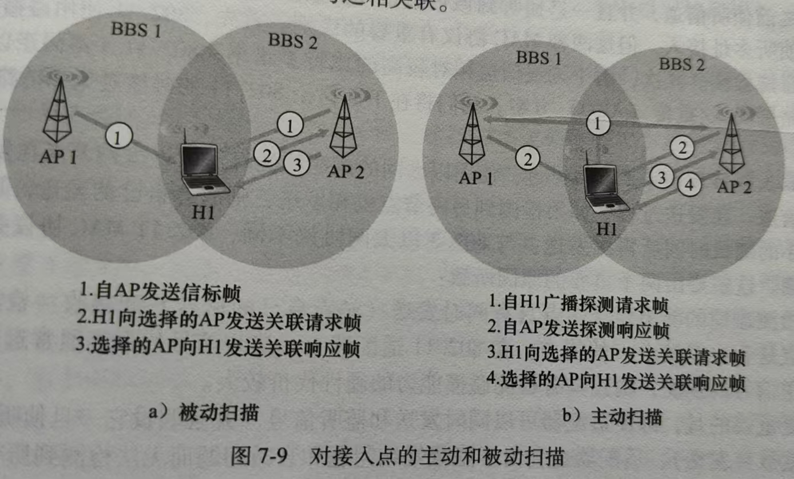

一旦与一个AP关联，该主机便希望加入该AP所属的子网中。因此，该主机通常将通过关联的AP向该子网发送一个DHCP发现报文，以获取在该AP子网中的一个IP地址。一旦获得地址，网络的其他部分将直接视你的主机为该子网中的另一台主机。

为了与特定的AP创建关联，某无线站点可能要向AP鉴别它自身。802.11无线局域网提供了几种不同的鉴别和接入方法：

1. 基于一个站点的MAC地址允许其接入一个无线网络（公司）
2. 应用用户名和口令。（咖啡店）

### 7.3.2 802.11MAC协议

许多无线设备或AP自身希望同时经过相同信道传输数据帧，802.11选择了一种随机接入协议--**带碰撞避免的CSMA**（CSMA with collision avoidance，CSMA/CA）

目的站点收到一个通过CRC的帧后，等待一个被称作**短帧间隔**（Short Inter-frame Spacing，SIFS）的一小段时间。

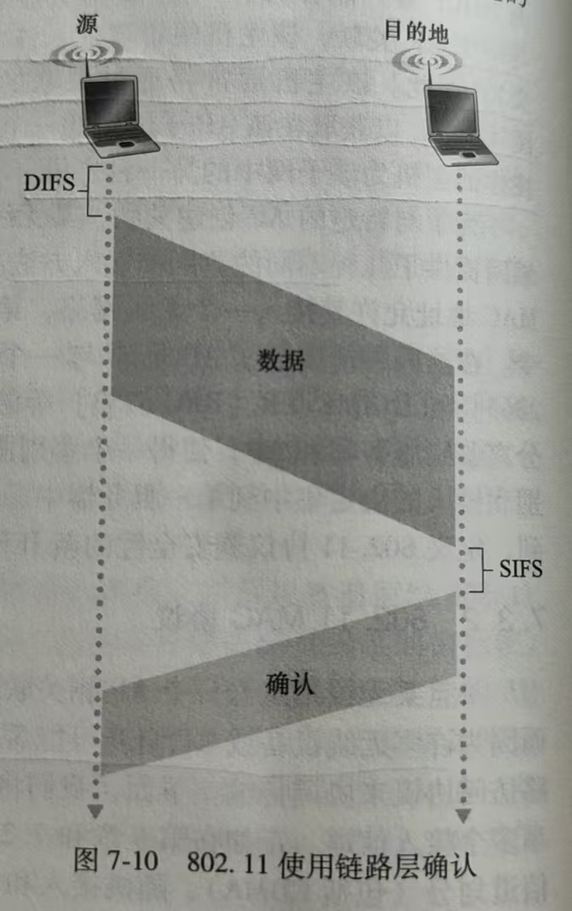

假设一个站点（无线设备或AP）有一个帧要发送：

1. 如果某站点最初监听到信道空闲，它将在一个被称为**分布式帧间间隔**（Distributed Inter-frame Space，DIFS）的短时间段后发送该帧。
2. 否则，该站点选择一个随机回退值(如下)并且在侦听到信道空闲时递减该值。当侦听到信道繁忙时，计数值保持不变。

> **二进制指数后退**（binary exponential backoff）算法：当传输一个给定帧时，在该帧经历了一连串的*n*次碰撞后，节点随机从{0，1，2，... , 2^n^-1}中选择一个K值。因此，一个帧经历的碰撞越多，K选择的间隔越大。

3. 当计数值减为0时（这只可能发送在信道被侦听为空闲时），该站点发送整个数据帧并等待确认。
4. 如果收到确认，传输站知道它的帧已被目的站正确接收了。如果该站点要发送另一帧，它将从第二步开始CSMA/CA协议。如果未收到确认，传输站将重新进入第二步中的回退阶段。

#### 1.处理隐藏终端：RTS和CTS

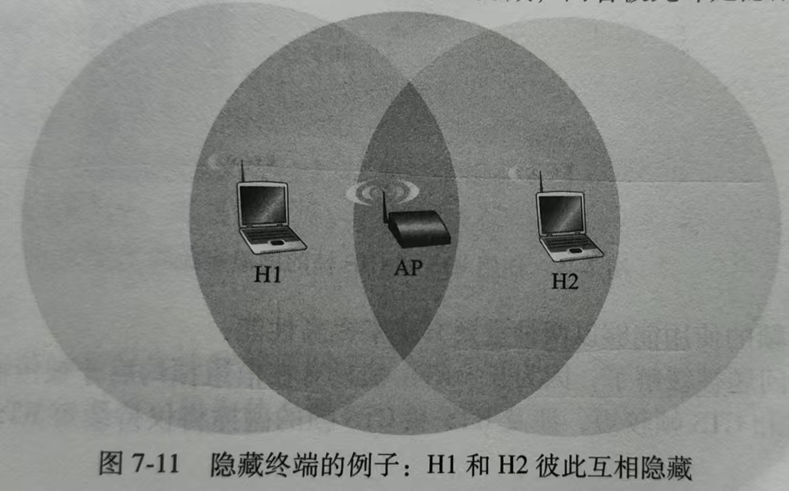

上图中，H1和H2都在AP范围内，但H1和H2两者彼此是隐藏的。

为了避免隐藏终端导致的碰撞，IEEE 802.11协议允许站点使用短**请求发送**（Request to Send，RTS)控制帧和**允许发送**（Clear to Send，CTS）控制帧来预约对信道的访问。

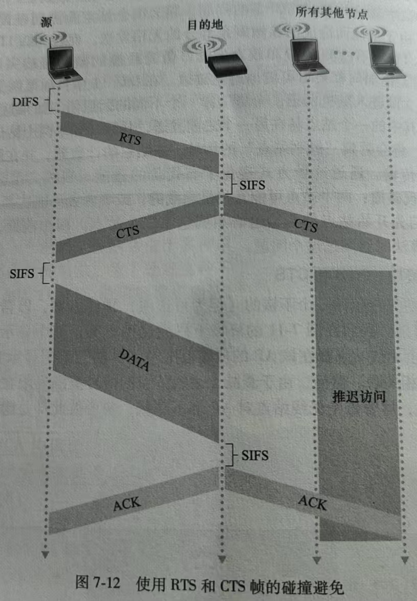

尽管RTS/CTS交换有助于减少碰撞，但它同样引入了时延并消耗了信道资源。因此，RTS/CTS交换仅仅用于为长数据预约信道。在实际中每个无线站点可以设置一个RTS门限值，仅当帧长超过门限值时，才使用RTS/CTS序列。

#### 2. 使用802.11作为一个点对点链路

如果两个节点每个都具有一个定向天线，它们可以将其定向天线指向对方，并基本上是在一个点对点的链路上运行802.11协议。

### 7.3.3 IEEE 802.11帧

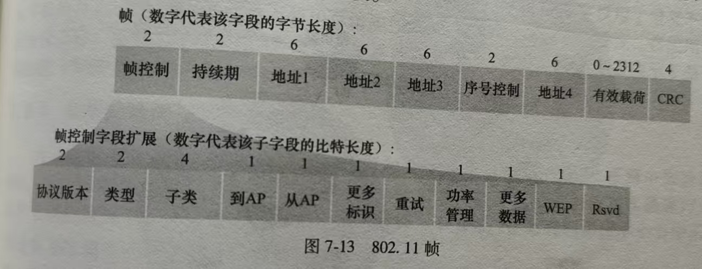

#### 1.有效载荷与CRC字段

#### 2.地址字段

有4个地址字段：

- 地址1是要接收该帧的无线站点的MAC地址。

- 地址2是传输该帧的站点的MAC地址。

- 地址3是路由器接口MAC地址。

假设一个数据报从R1移到H1。当以太帧到达AP后。地址1是H1的MAC地址，地址2是AP的MAC地址，地址3是R1的MAC地址。通过这种方式，H1可以确定（从地址3）将数据报发送到子网中路由器接口的MAC地址。地址3允许

- 路由器知道H1的IP地址，它使用ARP来确定H1的MAC地址。获取H1的MAC地址后，路由器接口R1将该数据报封装在一个**以太网帧**中。该帧的源地址字段包含R1的MAC地址，目的地址包含H1的MAC地址。
- 当该以太网帧到达AP后，该AP在将其传输到无线信道前，先将该802.3以太网帧转换为一个**802.11帧**。如前所述，AP将地址1和地址2分别填上H1的MAC地址和自身的MAC地址。对于地址3，AP插入R1的MAC地址。通过这种方式，<u>H1可以确定（从地址3）将数据报发送到子网中路由器接口的MAC地址。</u>

现在考虑无线站点H1通过从H1移动一个数据报到R1进行响应时发生的情况。

- H1生成一个802.11帧，分别用AP的MAC地址和H1的MAC地址填上地址1和地址2字段，如上所述。对于地址3，H1插入R1的MAC地址。
- 当AP接收该802.11帧，它将其转换为以太网帧。对于该帧，源地址字段是H1的MAC地址，目的字段是R1的MAC地址。因此，<u>地址3允许AP在构建以太网帧时确定目的MAC地址</u>。

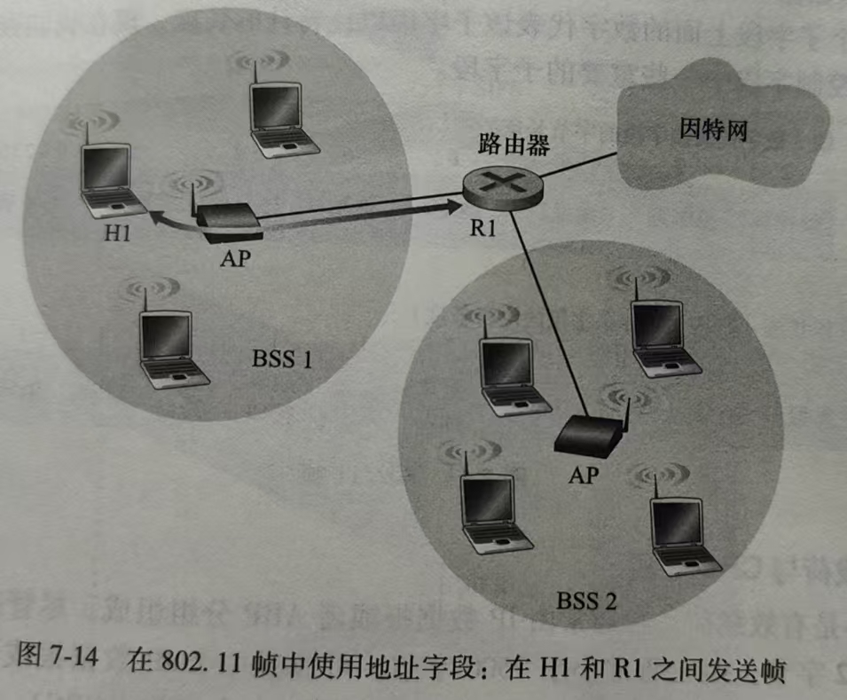

#### 3.序号、持续期和帧控制字段

### 7.3.4 在相同的IP子网中的移动性

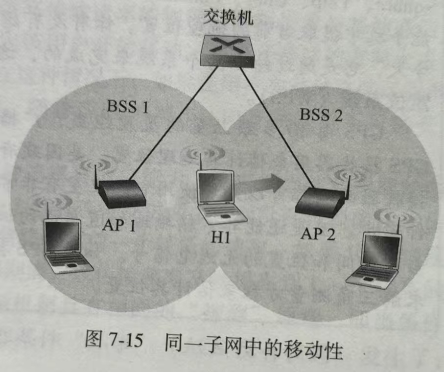

随着H1逐步远离AP1，H1检测到来自AP1的信号逐渐减弱并开始扫描一个更强的信号。H1收到来自AP2的信标帧（在许多公司和大学的设置中它与AP1有相同的SSID）。H1然后与AP1解除关联，并与AP2关联起来，同时保证其IP地址和维持正在进行的TCP会话。

### 7.3.5 802.11中的高级特色

#### 1. 802.11速率适应

类似TCP拥塞控制

#### 2. 功率管理

一个节点能够明确地在睡眠和唤醒状态之间交替。。。。

### 7.3.6 个人域网络：蓝牙

蓝牙网络有时被称为**无线个人区域网络**（WPAN）或**微微网**（piconet）。

蓝牙运行在不需要执照的2.4GHz工业、科学和医疗（ISM）无线电波段，与其他家用电器一起工作。因此，蓝牙网络在设计时明确考虑了噪声和干扰。蓝牙无线信道采用时分复用方式，时隙为625us.在每个时隙期间，发送方在79个信道之一中传输，信道（频率）以已知但伪随机的方式从一个时隙改变到另一个时隙。这种信道跳频的形式被称为**跳频扩频**（Frequency-Hopping Spread Spectrum，FHSS），它的使用是因为来自在ISM频道内操作的其他设备或应用的干扰最多只会干扰这些时隙的一个子集内的蓝牙通信。

蓝牙网络是自组织网络。蓝牙设备必须将自己组织成一个最多有8个活动设备的微微网，如下图所示。其中一个设备被指定为主控设备，其余设备充当客户机。主节点真正控制着微微网，它的时钟决定微微网中的时间（例如，决定TDM时隙边界），它决定时隙到时隙的跳频序列，控制客户设备进入微微网，控制客户设备的传输功率，并在允许客户进入网络后使用轮询来授予客户传输权限。除了有源器件，在微微网中还可以有多达255个“寄放”设备。这些寄放设备通常处于某种形式的“睡眠模式”以节省能源，并根据主服务器的时间表周期性地唤醒，以接收来自主服务器的信标信息。直到寄放设备的状态由主节点从寄放改为活动，它才能通信。

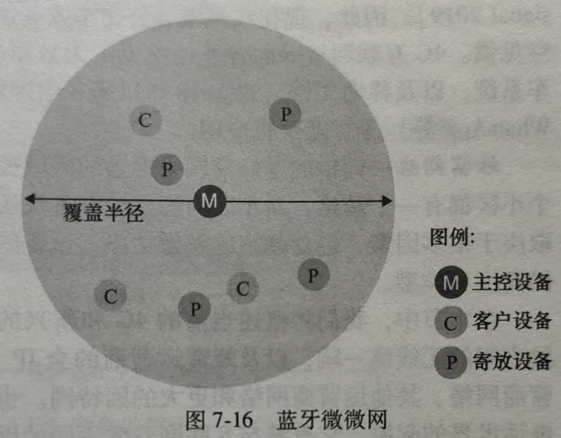

当主节点想要组成蓝牙网络时，必须首先确定哪些蓝牙设备在其覆盖范围内——这是**邻居发送**问题。主节点广播32条询问信息，每条都在不同的频道上，并重复传输序列多达128次。客户设备在它选择的频率上监听，希望在这个频率上听到的主节点的查询消息。当它听到查询消息时，会在0\~0.3s之间返回一个随机的时间量，然后用包含其设备ID的报文来响应主节点。

一旦蓝牙主节点发现了范围内的所有潜在客户，就会邀请那些它希望加入微微网的客户。第二个阶段称为**蓝牙寻呼**，它使人想起与基站相关联的802.11客户。通过寻呼过程，主机将通知客户要使用的跳频模式，以及发送方的时钟。主节点通过再次发送32条相同的寻呼邀请报文开始寻呼过程，每条报文现在都指向一个特定的客户，但再次使用不同的频率，因为客户还没有学会跳频模式。一旦客户回复ACK报文寻呼的邀请报文，主节点就发送跳频信息、时钟同步信息和活跃成员的地址给客户，最后轮询该客户，此时使用跳频模式，以确保客户与网络连接。

## 7.4 蜂窝网络：4G和5G

蜂窝网络覆盖的区域被划分成许多地理覆盖区域，称为**小区**。每个小区都有一个**基站**。向小区内的移动设备发送信号，并从其接收信号。

### 7.4.1 4G LTE 蜂窝网络：架构和部件

4G网络普遍采用4G长期演化（Long-Term Evolution）标准，简称**4G LTE**。

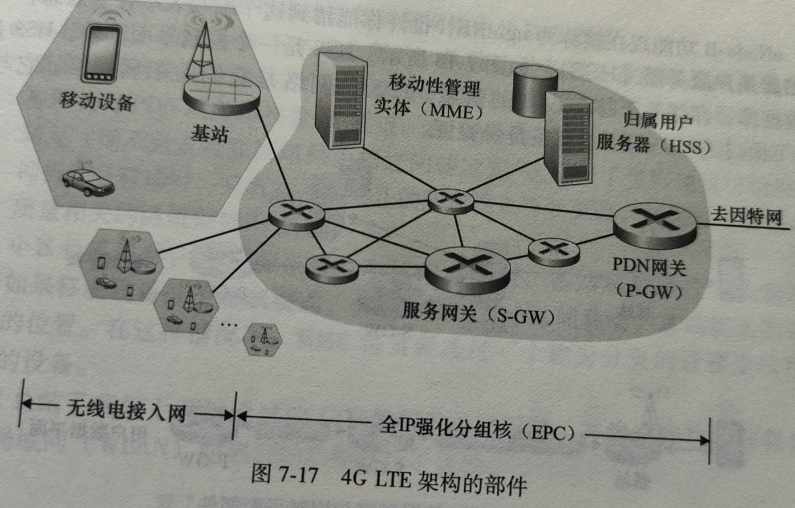

无线网络大致分为位于蜂窝网络边缘的无线网络和核心网络。所有网络部件之间使用我们在第4章中学习的IP协议进行通信。

- **移动设备**。有5层因特网协议栈。移动设备是一个网络端点，有一个IP地址（通过NAT获取）。有全球唯一的64位标识符，称为**国际移动用户身份**（**IMSI**），存储在SIM（用户身份模块）卡上。IMSI在全球蜂窝网络中识别用户，包括用户所属的国家和归属蜂窝网络。在某些方面，IMSI类似于MAC地址。SIM卡还存储着有关用户能够访问的服务的信息，并且为该用户加密密匙信息。
- **基站**。基站位于运营商网络的“边缘”，负责管理无线电资源和其覆盖区域内的移动设备。移动设备将与连接到运营商网络的基站交互。基站协调无线电接入网中的设备认证和资源分配（信道接入）。从这个意义上说，蜂窝基站的功能与无线局域网中的AP具有可比性。但是蜂窝基站还有一些无线局域网中没有的重要作用。基站创建从移动设备到网关的特定设备的IP隧道，并在它们之间进行交互，以处理小区之间的设备移动性。附近的基站也相互协调，以管理无线电频谱，尽量减少各小区之间的干扰。
- **归属用户服务器**（Home Subscriber Server，**HSS**）。如下图，HSS是一个控制平面部件。HSS是一个数据库，存储关于移动设备的信息，HSS的网络是它们的**归属网络**。它与MME一起用于设备身份验证。HSS存储了每个用户的信息，包括全球唯一的设备IP（嵌入在用户的SIM卡中）、用户可能访问的服务信息、用于通信加密的加密密匙以及账单/收费信息。

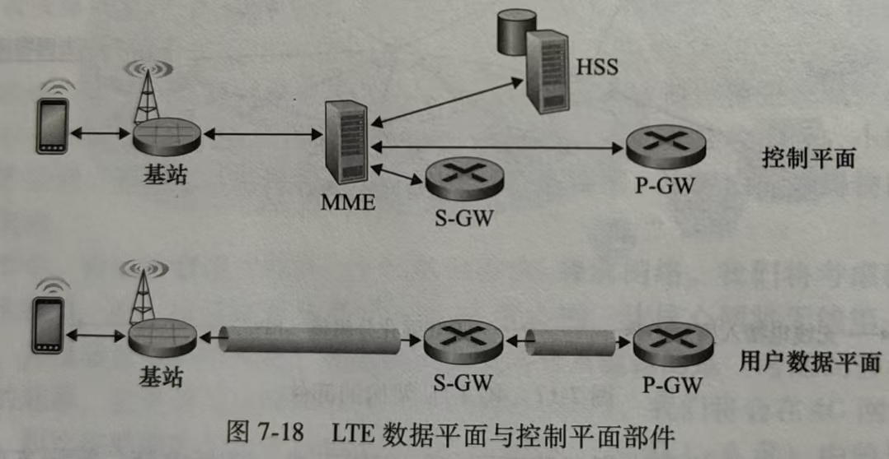

- **服务网关**(S-GW)、**PDN网关**（P-GW）等其他网络路由器。**服务网关**（Services Gateway）和**分组数据网络网关**（Packet Date Network Gateway）是位于移动设备与因特网之间的数据路径上的两台路由器（在实际中通常是并列的）。PDN网关为移动设备提供NAT IP 地址，实现NAT功能。PDN网关是来自移动设备的数据报在进入更大的因特网之前遇到的最后一个LTE部件。在外界看来，P-GW和其他网关没啥不同；移动通信公司LTE网络内移动节点的移动性被隐藏在P-GW之后。除了这些网关路由器，蜂窝运营商的全IP核心还会有额外的路由器，其作用与传统的IP路由器类似，即在它们之间沿着路径转发IP数据报，该路径将通常终止于LTE核心网络的部件。
- **移动性管理实体**（Mobility Management Entity，**MME**）。MME也是一个控制平面部件，如上图。与HSS一起，它在验证想要连接到其网络的设备方面起着重要的作用。它还在从设备到PDN因特网网关路由器的数据路径上建立隧道，并维护有关移动设备在运营商蜂窝网络中的小区位置的信息。它不在移动设备收发因特网数据报的转发路径中。
  - 身份验证。网络中的网络和移动设备的相互验证：网络知道所连接的设备确实与一个给定的IMSI相关联，移动设备知道它所连接的网络是一个合法的蜂窝网络。MME在移动归属网络中的移动设备和归属用户服务（HSS）之间起着中间人的作用。
  - 路径设置。
  - 小区位置跟踪。

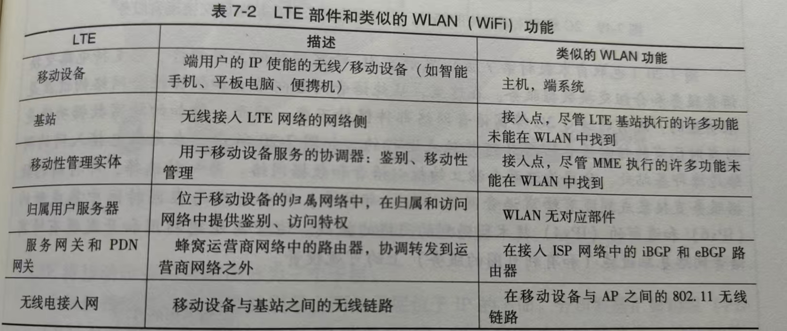

### 7.4.2 LTE协议栈

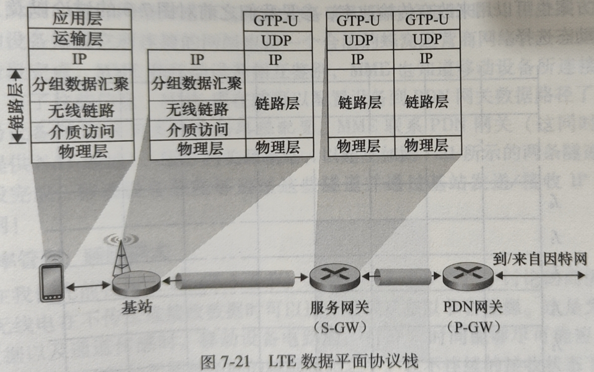

LTE将移动设备的链路层分为三个子层：

- 分组数据汇聚。分组数据汇聚协议（PD-CP）执行IP首部/压缩，以减少通过无线链路发送的比特数，当移动设备第一次连接网络时，LTE移动设备和移动性管理实体之间通过信令报文建立的密匙对IP数据报进行加密/解密。
- 无线链路控制。无线链路（RLC）协议执行两个重要功能：
  1. 拆分（在发送侧）和重新组装（在接收侧）太大的IP数据报，以适合底层链路层帧；
  2. 通过使用某种基于ACL/NAK的ARQ协议，在链路层进行可靠数据传输。
- 介质访问控制（MAC）。MAC层执行传输调度，即7.4.4节中描述的无线电传输时隙的请求和使用。MAC子层还执行额外的错误检测/校正功能，包括使用冗余位传输作为前向纠错技术。冗余量可以根据信道条件进行调整。

如上图，当移动设备第一次连接到网络时，由MME控制下建立这些隧道。两个端点之间的每个隧道都有唯一的隧道端点标识符（TEID）。当基站接收到来自移动设备的数据报时，使用GPRS隧道协议对数据报进行封装，包括TEID，并以UDP段的形式发送给隧道另一侧的服务网关。在接收侧，基站对经过隧道的UDP数据报进行解封装，提取封装后的IP数据报发送到移动设备，并通过无线跳将IP数据报转发到移动设备。

### 7.4.3 LTE无线电接入网

LTE在下行信道上使用正交频分复用（OFDM）。

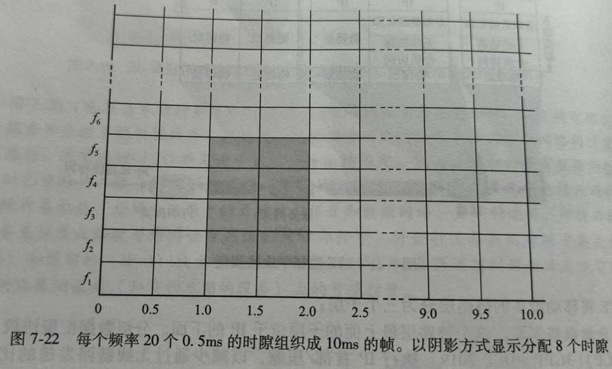

### 7.4.4  LTE附加功能：网络连接和功率管理

#### 1. 网络连接

移动设备连接到蜂窝运营商网络的过程：

- 连接到基站。
- 互相鉴别。
- 移动设备到PDN网关的数据路径配置。MME建立隧道。

#### 2. 功率管理：睡眠模式

### 7.4.5 全球蜂窝网络：网络的网络

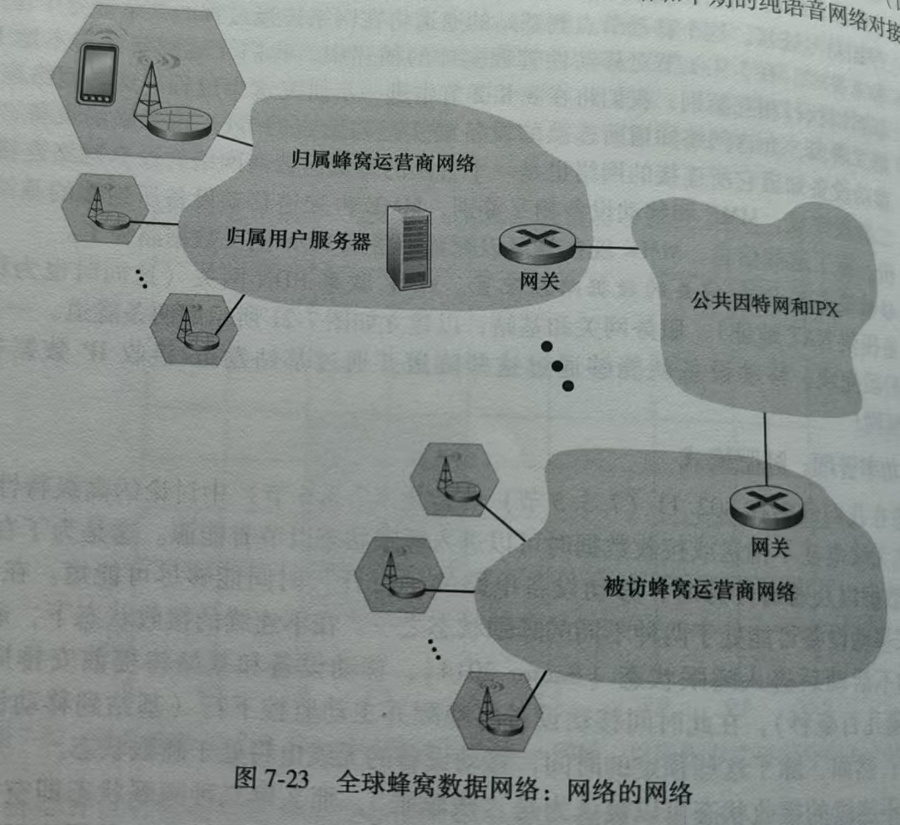

IPX是一种专门用于互联蜂窝运营商的被管网络，类似于因特网交换点用于ISP之间的对等。

### 7.4.6 5G蜂窝网络

5G很牛逼。。。。。。。

## 7.5 移动性管理原理

### 7.5.1 设备移动性：网络层视角

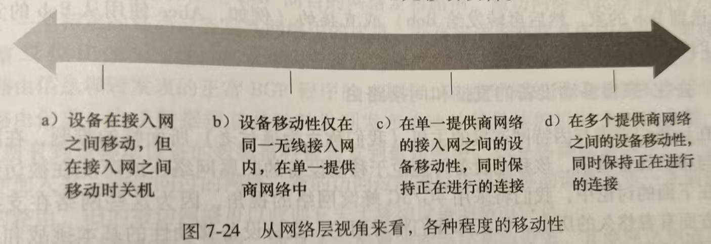

### 7.5.2 归属网络和在被访网络漫游

当一个设备连接到蜂窝网络但未连接到它的**归属网络**（home network）时，这个设备被认为是在**被访网站（visited network）漫游（roaming）**。

因特网对归属网络或被访网络没有明确概念。在实践中，学生的归属网络可能是学校运营的网络；而被访网络可能是他们正在访问的学校网络。

移动设备的归属网络这一概念优点：归属网络提供了可以找到该设备信息的单一位置，并且可以作为与漫游的移动设备通信的协调点。

类比：Bob从家中搬出来，经常换地址。Alice想联系他，可以联系他的家人，因为Bob经常告诉家人他的位置。家庭住宅成了独特的位置。因此，Alice的邮件通信可以是*间接的*（邮件先送到Bob的家，再转发给Bob）或*直接的*（Alice使用从Bob的父母那里获得的地址直接给Bob发送邮件）。

### 7.5.3 去往/来自移动设备的直接和间接路由

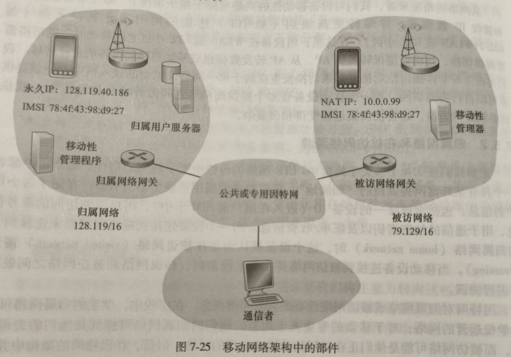

如上图，假设与因特网相连的主机（我们称之为*通信者*）希望与移动设备通信，该移动设备可能位于移动设备的归属网络，或可能在被访网络中漫游。在下面的讨论中，我们将采用4G/5G蜂窝网络的视角。支持设备移动性的基本挑战和基本解决方案同样适用于蜂窝网络和因特网。

假设移动设备有全局唯一的标识符与它相关联。在4G、LTE蜂窝网络中，这将是国际移动用户标识（IMSI）和相关的电话号码，存储在移动设备的SIM卡上。对于移动因特网用户，这将是其归属网络IP地址范围内的一个永久IP地址，就像在移动IP架构中的情况一样。

注：这边的移动因特网就是WiFi的那方面概念。

#### 1.利用现有IP地址的基础设施

移动设备归属网络中的MME可以跟踪移动设备所在的被访网络。该信息可能驻留在HSS数据库中。为了更新移动设备所在的网络，需要在被访网络和归属网络之间运行协议。

在上图，移动设备显然需要被访网络中的IP地址：

- 使用一个移动设备的归属网络相关联的永久地址。
- 在被访网络的地址范围内分配一个新的地址。
- 通过NAT提供一个IP地址。

在后两种情况下，移动设备除了存储在其归属网络的HSS中的永久标识符外，还有一个临时标识符（一个新分配的IP地址）。

数据报应该如何寻址和转发到移动设备？ 间接路由和直接路由。

#### 2. 到移动设备的间接路由

通信者简单地将数据报定位到移动设备的永久地址，并将数据报发送到网络中。

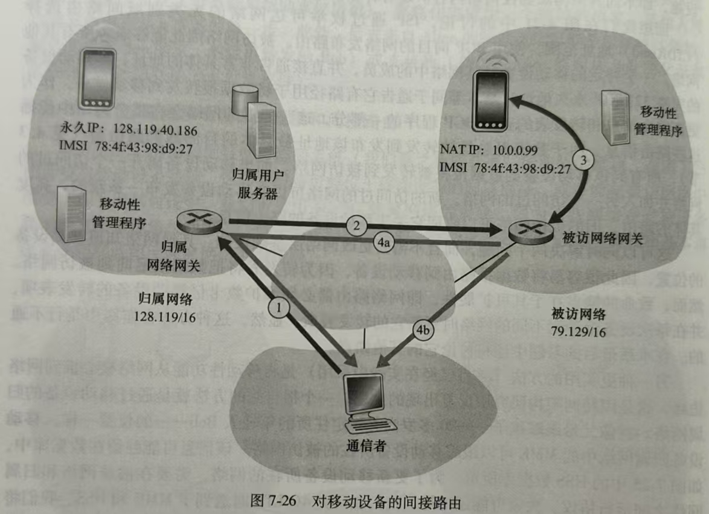

1. 数据报首先被路由到移动设备的归属网络。
2. HSS负责与被访网络进行交互，以跟踪移动设备的位置以及归属网络的网关路由器。这种网关路由器的一项工作是监视到达的数据报，该数据报的地址为本归属网络的某设备，但目前驻留在被访网络中。归属网络网关截获该数据报，与HSS协商确定移动设备所在的被访网络，并将该数据报转发给被访网络的网关路由器。
3. 然后，被访网关的网关路由器将数据报转发给移动设备。如果需要NAT转换，则由被访网络的网关路由器进行NAT转换。

更详细地考虑<u>归属网关的重新路由</u>：显然，归属网络需要将到达的数据报转发到被访网络中的网关路由器。另一方面，最好保持通信者的数据报完整，因为接收数据报的应用程序应该不知道数据报是通过归属网络转发的。这两个目标都可以通过让归属网关将对应的初始完整数据报封装在一个新的（更大的）数据报中来实现。然后，这个较大的数据报被寻址并发送到被访网络的网关路由器，该路由器将对数据报进行解封装，从较大的封装数据报中移除对应的初始数据报，并将初始数据报转发到移动设备。

上段描述的封装/解封装正是隧道的概念，在4.3IPv6相关内容中讨论过。

最后，考虑<u>移动设备是如何向相应设备发送数据报的</u>。在图7-26中，为了执行NAT转换，移动设备显然需要通过被访网关路由器转发数据报。但是，被访网关路由器应该如何将数据报转发给相应的路由器呢？有两个选项：(4a)数据报可以经隧道回到归属网关路由器，并且从那里发送给通信者；(4b)数据报可以直接从被访网络传输给通信者，该方法在LTE中称为**本地突围**（local breakout）。

总结：

- *移动设备到被访网络的关联协议*。移动设备将需要与被访网络相关联，并且在离开被访网络时需要解除关联。
- *被访网络到归属网络HSS注册协议*。被访网络需要向归属网络中的HSS注册移动设备的位置，并可能在执行设备鉴别时使用从HSS获得的信息。
- *在归属网络网关和被访网络网关路由器之间的数据报隧道协议*。发送端对通信方的初始数据报进行封装和转发；在接收端，网关路由器进行解封装、NAT转换，并将初始数据报转发给移动设备。

当设备从一个被访网络漫游到另一个被访网络时，需要在归属网络HSS中更新被访网络信息，并需要移除归属网关路由器到被访网关路由器的隧道端点。只要移动设备从一个被访网络移动到另一个的时间很短，就很少会有数据报丢失。如第3章一样，端到端连接可能会由于网络拥塞而经历数据报丢失，可以恢复，没啥关系。

间接路由存在一个低效的问题，称为**三角路由选择问题**：指即使在通信者与移动节点之间存在一条更有效的路由，发往移动节点的数据报也先要发给归属代理，然后再发送到外部网络。

#### 3. 到移动设备的直接路由

直接路由克服了三角路由选择的低效问题，但却是以增加复杂性为代价的。

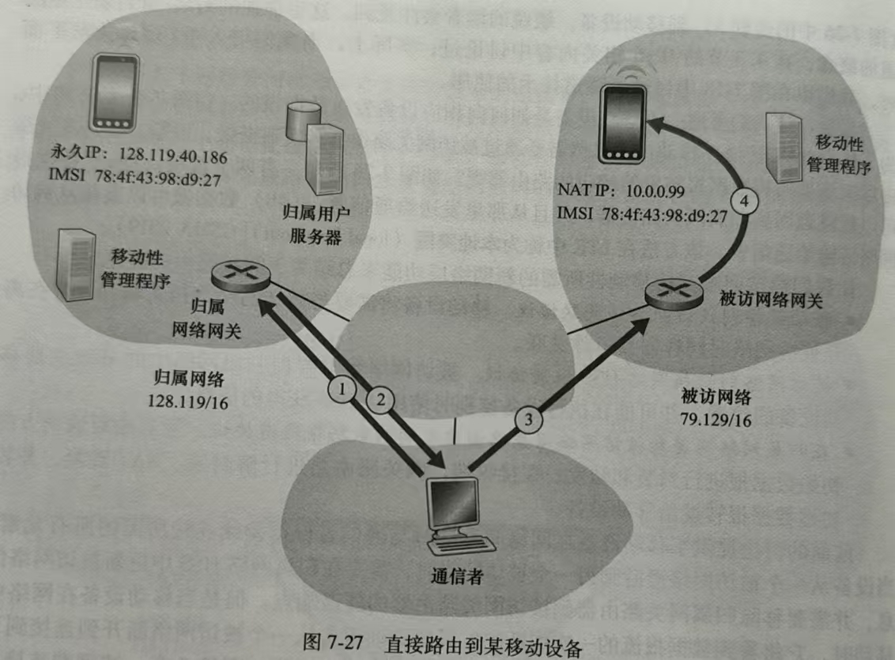

通信者首先发现移动设备所在的被访网络。这是通过在移动设备的归属网络中查询HSS来完成的，假设（如在间接路由的情况下）移动设备的被访网络在HSS中进行了注册，如图中步骤1、2所示。然后通信者将数据报从其网络直接通过隧道发送到移动设备的被访网络的网关路由器。

尽管克服了三角路由选择问题，但它引入了两个重要的挑战：

- 通信者需要一个移动用户定位协议来查询HSS，以获得移动设备的被访网络。这是移动设备向其HSS注册位置所需的协议之外的附加协议。
- 当移动节点从一个外部网路移到另一个内部网络时，如何将数据报转发到新的外部网络？在间接路由的情况下，可通过归属网络中的HSS解决，并且更改隧道端点使其终止与新被访网络的网关路由器。然而，直接路由中，HSS只会在会话开始时由通信者查询。因此，需要额外的协议。

## 7.6 实践中的移动性管理

### 7.6.1 4G/5G网络的移动性管理

考虑一个简单的场景：移动用户（eg. 汽车中的乘客）通过只能手机连接到访问过的4G/5G网络，开始从远程服务器传输高清视频，然后从一个4G/5G基站移动到另一个基站。

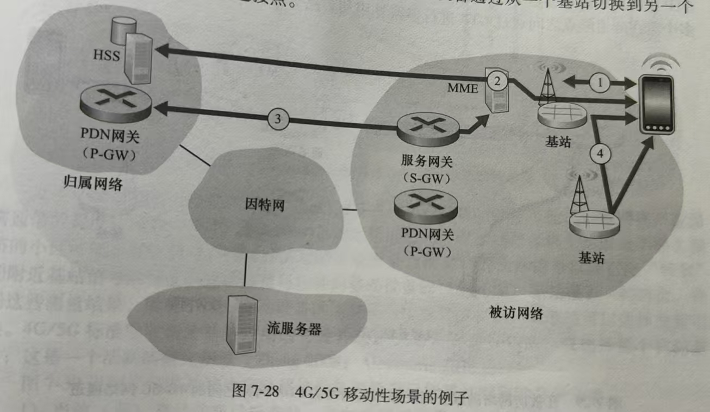

该场景中有四个主要步骤：

1. **移动设备和基站关联**。移动设备与被访网络中的某基站相关联。
2. **移动设备的网元控制平面配置**。被访网络和归属网络建立控制平面状态，指示移动设备驻留在被访网络中。
3. **移动设备转发隧道的数据平面配置**。被访网络和归属网络建立隧道，移动设备和流媒体服务器可以通过归属网络的分组数据网络网关（P-GW）使用间接路由发送/接收IP数据报。
4. **移动设备从一个基站切换到另一个基站**。移动设备通过从一个基站切换到另一个基站来改变它被访网络的连接点。

现在让我们更详细地考虑这四个步骤：

#### 1. 基站关联

移动设备监听所有频率的主要信号，这些信号由其所在地区的基站传输。移动设备逐步获取关于这些基站的更多信息，最终选择与之关联的基站，并自举与该基站的控制信令通道。作为这种关联的一部分，移动设备向基站提供其国际移动用户标识（IMSI），该标识唯一地标识移动设备及其归属网络和其他附加的用户信息。

#### 2. 移动设备的LTE网元的控制平面配置

一旦建立了移动设备到基站的信令通道，基站就可以与被访网络的MME联系。MME将在归属和被访网络中查阅并配置一些4G/5G元素，以代表移动节点建立状态：

- MME将使用IMSI和移动设备提供的其他信息，以为该用户检索认证、加密和可用的网络服务信息。该信息可能在MME的本地缓存中，从移动设备最近接触的另一个MME检索，或从移动设备归属网络的HSS检索。互相鉴别过程（8.8节）确保被访网络确定移动设备的身份，并且该设备可以验证它所连接的网络。
- MME通知移动设备归属网络的HSS，移动设备现在驻留在被访网站中，HSS更新其数据库。
- 基站和移动设备为要在移动设备和基站之间建立的数据平面通道选择参数。

#### 3. 移动设备转发隧道的数据平面配置

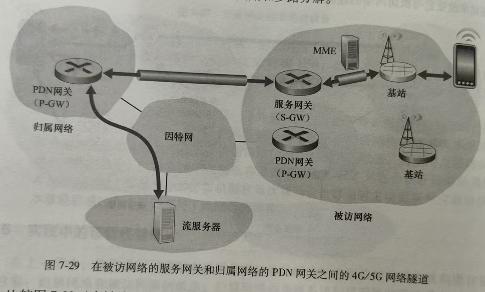

如上图，建立了两条隧道，其中一条隧道位于基站和被访问网络中的服务网关之间，第二条隧道是在服务网关和移动设备归属网络中的PDN网关路由器之间。4G LTE实现了这种对称间接路由，即所有进出设备的流量都将通过设备的归属网络进行隧道传输。4G/5G隧道使用GPRS隧道协议（GTP）。GTP报头中的隧道端点ID（Tunnel Endpoint ID，TEID）指示数据报属于哪个隧道，允许多个流在隧道端点之间通过GTP进行多路复用和多路分解。

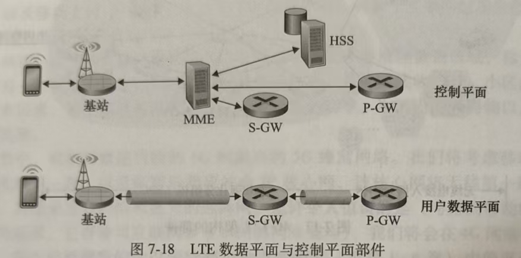

比较图7-29（在被访网络中移动漫游的情况）和图7-18（仅在移动设备的归属网络内移动的情况）。我们看到，在两种情况下，服务网关与移动设备共同驻留在同一个网络中，但PDN网关（在移动设备的归属网络中总是PDN网关）可能与移动设备处于不同的网络中。这正是中间路由。

#### 切换管理

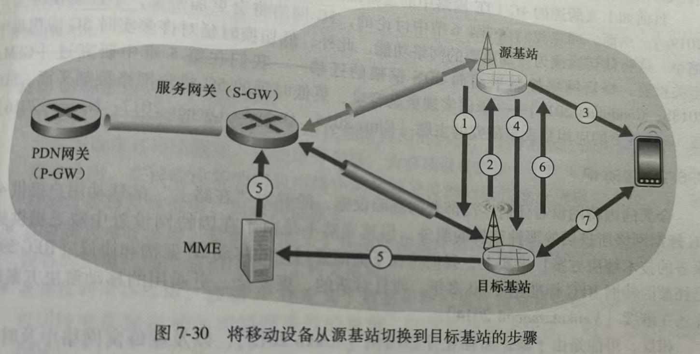

如图7-30，去往/来自设备的数据报最初（切换之前）通过一个基站发到移动设备，我们称该基站为**源基站**，并在切换后通过另一个基站路由到移动设备，我们称该基站为**目标基站**。基站之间的切换不仅会导致移动设备向新基站发送/接收信号，而且还会改变图7-29中服务网关到基站隧道的基站侧。

源基站决定将移动设备切换到目标基站时涉及的步骤：

1. 当前（源）基站选择目标基站，并向目标基站发送切换请求信息。
2. 目标基站检查自己是否有资源来支持移动设备及其业务质量要求。如果是，则在其无线电接入网上为该设备预分配信道资源（例如，时隙）和其他资源。目标基站向源基站确认一个切换请求报文，该报文包含移动设备需要与新基站关联的目标基站的所有信息。
3. 源基站接收到切换请求确认报文，并将目标基站的身份信息和信道接入信息告知移动设备。<u>从移动设备的角度看，切换已完成</u>。
4. 源基站停止向移动设备转发数据报，而是将它接收到的任何隧道化的数据报转发给目标基站，目标基站随后将这些数据报转发给移动设备。
5. 目标基站通知MME它（目标基站）将是为移动设备服务的新基站。MME依次向服务网关和目标基站发出信号，以重新配置服务网关到基站隧道。
6. 目标基站向源基站确认隧道已重新配置，从而允许源基站释放与移动设备相关的资源。
7. 此时，目标基站可以向移动设备发送数据报，还可以将从移动设备接收到的出方向的数据报转发到服务网关的隧道。

### 7.6.2 移动IP

支持移动性的因特网架构和协议统称为移动IP，例如，4G和5G。

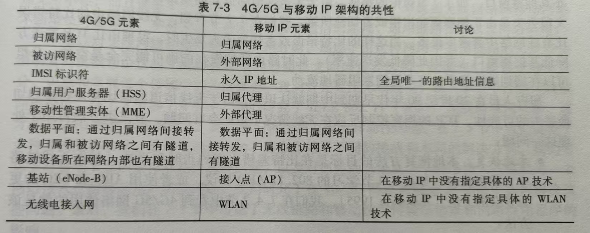

移动IP标准包括三个主要部分：

- 代理发现。
- 在归属代理处注册。
- 数据报的间接路由。

## 7.7 无线和移动性：对高层协议的影响

在本章，我们看到了无线网络在链路层（由于无线信道的衰减、多径、隐藏终端等特性）和网络层（由于移动用户改变与网络的连接点）与有线网络的重大区别。

### TCP层

TCP隐含地假设报文段丢失是由于拥塞导致。但无线网络中比特错误较多，当比特错误发生时，不应该较低其拥塞窗口。有三类方法解决该问题：

- 本地恢复。在比特差错出现的当时和当地（如在无线链路中）将其回复。
- TCP发送方知晓无线链路。
- 分离连接方法。

### 应用层

由于无线频谱的共享特性，带宽被视为稀缺商品。

