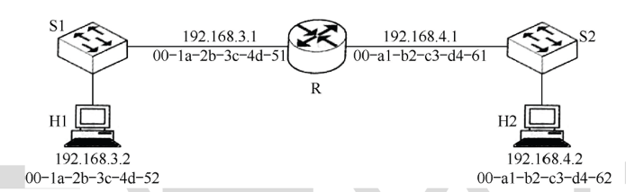

# 列出OSI七层协议和TCP/IP四层协议的名字。举例1种应用层协议，1个物理层设备。

- **OSI 七层模型：** 物理层、数据链路层、网络层、传输层、会话层、表示层、应用层。

| 名称    | 主要功能               | 典型协议                 | 相关设备       |
| ----- | ------------------ | -------------------- | ---------- |
| 应用层   | 提供用户接口，支持网络应用服务    | HTTP, FTP, SMTP, DNS | 网关、代理服务器   |
| 表示层   | 数据格式转换、加密解密、压缩解压   | SSL/TLS, JPEG, ASCLL | -          |
| 会话层   | 建立、管理、终止应用会话       | NetBIOS, RPC, SSH    | -          |
| 传输层   | 提供端到端可靠/不可靠数据传输    | TCP, UDP             | 防火墙、负载均衡器  |
| 网络层   | 逻辑寻址、路由选择、分组转发     | IP、ICMP、ARP、OSPF     | 路由器、三层交换机  |
| 数据链路层 | 物理寻址（MAC）、帧同步、差错控制 | Ethernet、PPP、VLAN    | 交换机、网桥     |
| 物理层   | 传输原始比特流，定义电气/机械特性  | RS-232、光纤、Wi-Fi      | 网卡、集线器、中继器 |

    
- **TCP/IP 四层模型：** 
	- 网络接口层：（物理层+数据链路层）物理基础设施+数据传输
	- 网际层（或IP层/网络层）
	- 传输层
	- 应用层。
    
- **示例：**
    
    - **应用层协议：** **HTTP** (或 DNS, SMTP, FTP)。
        
    - **物理层设备：** **中继器** (Repeater) 或 **集线器** (Hub)。
        

# 若某通信链路的码元传输波特率为4000码元/秒，采用16种振幅等级的调制技术，则该通信链路的最大数据传输速率是多少bps。
- **【涉及知识点】：**
    
    - **奈氏准则公式：** $C = R_{baud} \cdot \log_2(V)$
        
    - 其中 $C$ 为数据传输速率（bps），$R_{baud}$ 为波特率，$V$ 为信号状态数（振幅等级）。
        
- **【解题过程】：**
    
    1. 已知 $R_{baud} = 4000$ Baud，$V = 16$。
        
    2. 代入公式：$C = 4000 \cdot \log_2(16)$。
        
    3. 计算对数：$\log_2(16) = 4$ bit/码元。
        
    4. $C = 4000 \cdot 4 = 16000$。
        
- 【最终答案】：
    
    16000 bps (或 16 kbps)

# 若链路的频率带宽为4000Hz，信噪比为30dB，该链路理论最大数据传输速率是多少bps（香农定理）。

- **【涉及知识点】：**
    
    - **信噪比转换：** $dB = 10 \log_{10}(S/N)$  
        
    - **香农公式：** $C = W \cdot \log_2(1 + S/N)$
    - 香农定理回答了：在一条有干扰的通信线路上，最多能塞进去多少数据，还能保证对方能准确受到
    - 假设你在一个嘈杂的饭馆里和朋友喊话
	    - 带宽(W)：你说话的语速，语速越快，传递的信息越多
	    - 信噪比(S/N)：你的嗓门和周围噪音的比值。嗓门越大，噪音越小，越容易听清
	- $最大可靠速度 = 带宽 \cdot \log_2(1 + 信噪比)$
        
- **【解题过程】：**
    
    1. **转换信噪比：** 已知 $30 \text{ dB}$，则 $30 = 10 \log_{10}(S/N) \Rightarrow \log_{10}(S/N) = 3 \Rightarrow S/N = 1000$。
        
    2. **代入公式：** $C = 4000 \cdot \log_2(1 + 1000)$。
        
    3. **近似计算：** $\log_2(1001) \approx \log_2(1024) = 10$。
        
    4. $C \approx 4000 \cdot 10 = 40000$。
        
- 【最终答案】：
    
    40000 bps (或 40 kbps)

# 站点A,B,C通过CDMA共享链路，A,B,C的码片序列分别是（1,1,1,1）、（1,-1,1,-1）和（1,1,-1,-1）。如果从链路上收到序列是（2，0，2，0，0，-2，0，-2，0，2，0，2），则接收者收到谁发送数据，数据是什么。
- **【涉及知识点】：**
    
    - **正交特性：** 发送数据 $d$ = (接收序列 $S$ $\cdot$ 站点码片序列) / 码片长度 $m$。
        
    - 结果为 $1$ 表示发送了比特 1，$-1$ 表示发送了比特 0，0 表示未发送。
        
- 【解题过程】：
    
    接收序列 $S$ 长度为 12，码片长度 $m=4$，说明传输了 3 位数据。将 $S$ 分为三段：
    
    $S_1=(2,0,2,0)$, $S_2=(0,-2,0,-2)$, $S_3=(0,2,0,2)$。
    
    **分析 A (1,1,1,1):**
    
    - 第1位：$(2+0+2+0)/4 = 1$
        
    - 第2位：$(0-2+0-2)/4 = -1$ (即比特0)
        
    - 第3位：$(0+2+0+2)/4 = 1$
        
    - **A 发送了：1, 0, 1**
        
    
    **分析 B (1,-1,1,-1):**
    
    - 第1位：$(2-0+2-0)/4 = 1$
        
    - 第2位：$(0+2+0+2)/4 = 1$
        
    - 第3位：$(0-2+0-2)/4 = -1$ (即比特0)
        
    - **B 发送了：1, 1, 0**
        
    
    **分析 C (1,1,-1,-1):**
    
    - 第1位：$(2+0-2-0)/4 = 0$
        
    - **C 未发送数据** (后两位验证同理均为0)
        
- **【最终答案】：**
    
    - **站点 A** 发送了数据：**101**
        
    - **站点 B** 发送了数据：**110**
        
    - **站点 C** 未发送数据。

# 假设一台主机要向另一台主机发送一个 1.5 MB（兆字节）的文件。链路带宽：10 Mbps（兆比特/秒）。链路长度：1000 km。信号在光纤中的传播速度：2.0×10^8m/s。求：总时延（发送时延+传输时延）

- **【涉及知识点】：**
    
    - **发送时延 (Transmission Delay)：** $t_{trans} = \text{数据长度} / \text{带宽}$
        
    - **传播时延 (Propagation Delay)：** $t_{prop} = \text{链路长度} / \text{信号速度}$
        
    - **单位换算假设：** 题目未特指，通常计算题中假设 $1 \text{ MB} = 10^6 \text{ Bytes}$（便于计算），若严格按 $2^{20}$ 需说明。此处按 $10^6$ 计算。
        
- **【解题过程】：**
    
    1. 计算发送时延：
        
        数据量 $= 1.5 \text{ MB} = 1.5 \times 8 \times 10^6 \text{ bits} = 12 \times 10^6 \text{ bits}$
        
        带宽 $= 10 \text{ Mbps} = 10 \times 10^6 \text{ bps}$
        
        $t_{trans} = \frac{12 \times 10^6}{10 \times 10^6} = 1.2 \text{ s}$
        
    2. 计算传播时延：
        
        距离 $= 1000 \text{ km} = 10^6 \text{ m}$
        
        速度 $= 2.0 \times 10^8 \text{ m/s}$
        
        $t_{prop} = \frac{10^6}{2.0 \times 10^8} = 0.005 \text{ s} = 5 \text{ ms}$
        
    3. 计算总时延：
        
        $Total = 1.2 + 0.005 = 1.205 \text{ s}$
        
- 【最终答案】：
    
    1.205 秒

# 1.设生成多项式G(x)=x^3+x+1，要发送的数据为101010，求CRC技术产生的余数（写出计算过程）。

- **【涉及知识点】：**
    
    - **模2除法**（异或运算，不借位）。
        
    - **生成多项式转换：** $G(x) = x^3+x+1 \Rightarrow 1 \cdot x^3 + 0 \cdot x^2 + 1 \cdot x + 1 \Rightarrow$ 除数 **1011**。
        
    - **补零规则：** 最高次幂为 3，所以在数据后补 3 个 0。
        
- **【解题过程】：**
    
    1. **被除数：** $101010$ 补零后为 **$101010000$**。
        
    2. **除数：** **$1011$**。
        
    3. **竖式计算（模2除法）：**  
        
    4. 余数为 001（必须与最高次幂位数一致，不足补前导0）。
        
- 【最终答案】：
    
    001
# 2.一个PPP帧的数据部分是7D 5E 26 7D 5D 7D 24 65 7D 5E。试问真正的数据是什么（用十六进制写出）？
- **【涉及知识点】：**
    
    - **PPP 字节填充规则：** 发送端将 `7E` 转为 `7D 5E`，将 `7D` 转为 `7D 5D`，将数值小于 `0x20` 的字符 `x` 转为 `7D (x+20)`。
        
    - **接收端还原（逆运算）：** 遇到 **`7D`** 丢弃，且后一个字节减去 `0x20`（或异或 `0x20`）。
        
- 【解题过程】：
    
    原始序列：7D 5E 26 7D 5D 7D 24 65 7D 5E
    
    1. `7D 5E` $\rightarrow$ 丢弃 7D，`5E` $\oplus$ `20` = **7E**
        
    2. `26` $\rightarrow$ 保持不变 = **26**
        
    3. `7D 5D` $\rightarrow$ 丢弃 7D，`5D` $\oplus$ `20` = **7D**
        
    4. `7D 24` $\rightarrow$ 丢弃 7D，`24` $\oplus$ `20` = **04**
        
    5. `65` $\rightarrow$ 保持不变 = **65**
        
    6. `7D 5E` $\rightarrow$ 丢弃 7D，`5E` $\oplus$ `20` = **7E**
        
- 【最终答案】：
    
    7E 26 7D 04 65 7E

# 3.以太网采用曼彻斯特编码，数据率为100Mb/s在物理媒体上的码元传输速率是多少码元/秒？
- **【涉及知识点】：**
    
    - **曼彻斯特编码特性：** 每个比特中间都有一次跳变（代表0或1）。
        
    - **关系公式：** 1 bit 对应 2 个码元（脉冲）。
        
    - $\text{波特率} = 2 \times \text{数据率}$
        
- **【解题过程】：**
    
    1. 数据率 = $100 \text{ Mb/s}$。
        
    2. $R_{baud} = 2 \times 100 \times 10^6 = 200 \times 10^6$。
        
- 【最终答案】：
    
    200 Mbaud (或 2亿码元/秒)

# 4.CSMA/CD协议以太网中争用期51.2us，某个站在发送数据时检测到碰撞，执行退避算法时选择了随机数r=10。试问这个站需要等待多长时间后才能再次发送数据？
- **【涉及知识点】：**
    
    - **截断二进制指数退避算法**。
        
    - **退避时间公式：** $T = r \times \tau$ （其中 $r$ 为随机数，$\tau$ 为争用期/基本退避时间）。
        
- **【解题过程】：**
    
    1. 已知争用期 $\tau = 51.2 \text{ \mus}$。
        
    2. 选定随机数 $r = 10$。
        
    3. $T = 10 \times 51.2 \text{ \mus} = 512 \text{ \mus}$。
        
- 【最终答案】：
    
    512 \mu s (或 0.512 ms)

# 5.假设2km长的CSMD/CD网络的数据传输率1Gbit/s。设信号传播速率40000km/s，求能够使用此协议的最短帧长。
- **【涉及知识点】：**
    
    - **核心原理：** 帧发送时间必须 $\ge$ 往返传播时间 (RTT)，才能检测到碰撞。
        
    - **公式：** $L_{min} = 2 \cdot \frac{D}{V} \cdot R$
        
    - _(注：题目给定的传播速率为 40000km/s，虽然远低于光速，但计算题必须严格按题目数据计算)_
        
- **【解题过程】：**
    
    1. 计算单程传播时延：
        
        $T_{prop} = \frac{2 \text{ km}}{40000 \text{ km/s}} = 0.00005 \text{ s}$
        
    2. 计算往返传播时延 (RTT)：
        
        $RTT = 2 \times 0.00005 \text{ s} = 0.0001 \text{ s}$
        
    3. 计算最短帧长：
        
        $L_{min} = RTT \times \text{数据率} = 0.0001 \text{ s} \times 10^9 \text{ bit/s}$
        
        $L_{min} = 100,000 \text{ bit}$
        
- 【最终答案】：
    
    100,000 bit (或 100 kbit)

# 1.路由器、交换机、集线器（hub）分别工作在哪层？
- **集线器 (Hub)：** **物理层** (Physical Layer)。
    
    - _特点：_ 傻瓜式转发，广播冲突域。
        
- **交换机 (Switch)：** **数据链路层** (Data Link Layer)。
    
    - _特点：_ 识别 MAC 地址，隔离冲突域。
        
- **路由器 (Router)：** **网络层** (Network Layer)。
    
    - _特点：_ 识别 IP 地址，隔离广播域，路径选择。
# 2.现有两个网络A,B，网络A有两台计算机H1,H2，网络B有3台计算机D1,D2,D3，画出网络设计示意图（包括交换机和路由器）。

# 3.以下三个IP地址分别属于哪类？192.168.1.1，10.5.6.7，128.191.122.1。它们的默认子网掩码是什么？
- **【涉及知识点】：**
    
    - **A类：** 1.0.0.0 - 126.x.x.x (首字节 0xxxxxxx)
        
    - **B类：** 128.0.0.0 - 191.255.x.x (首字节 10xxxxxx)
        
    - **C类：** 192.0.0.0 - 223.255.255.x (首字节 110xxxxx)

虽然大家常用 127.0.0.1，但其实 `127.0.0.1` 到 `127.255.255.254` 都是环回地址，效果一样。
        
- **【最终答案】：**
    

|**IP 地址**|**类别**|**默认子网掩码**|**判定依据 (首字节)**|
|---|---|---|---|
|**192.168.1.1**|**C 类**|**255.255.255.0**|192 ($110...$)|
|**10.5.6.7**|**A 类**|**255.0.0.0**|10 ($0...$)|
|**128.191.122.1**|**B 类**|**255.255.0.0**|128 ($10...$)|
# 4.什么叫分类编址和无分类编址（CIDR）？它们主要区别是什么？
- **核心定义：**
    
    - **分类编址：** IP 地址分为 A、B、C 等**固定类别**，网络号长度固定 (8/16/24位)。
        
    - **CIDR (无分类域间路由选择)：** 消除传统类别概念，使用**“斜线记法”** (如 /20) 指定网络前缀长度，支持变长子网掩码 (VLSM)。
        
- **主要区别：**
    
    - **灵活性：** CIDR 更灵活，能更有效地利用 IP 地址空间（避免浪费）。
        
    - **路由表：** CIDR 支持**路由聚合 (Supernetting)**，能大幅减小路由表规模。
# 5.已知地址块中的一个地址是106.150.86.24/20。这个地址块中的最小地址和最大地址，地址掩码是什么？此地址块共有多少个地址？
- **【涉及知识点】：**
    
    - **子网掩码计算：** /20 表示前20位为1。
        
    - **地址块计算：** 最小地址（主机位全0），最大地址（主机位全1）。
        
    - **地址总数：** $2^{\text{主机位数}}$。
        
- **【解题过程】：**
    
    1. 确定掩码：
        
        /20 意味着前两个字节 (8+8=16) 满，第三个字节前 4 位为 1。
        
        第三字节二进制：11110000 = 240。
        
        掩码：255.255.240.0
        
    2. 计算最小地址 (网络地址)：
        
        将 IP 106.150.86.24 与掩码进行 AND 运算。
        
        关键在第三字节：$86 (01010110)$ AND $240 (11110000) = 80 (01010000)$。
        
        后12位（主机位）全0。
        
        最小地址：106.150.80.0
        
    3. 计算最大地址：
        
        主机位全1。第三字节后4位是1，第四字节全1。
        
        第三字节网络号是 80，加上主机位最大值 (15) $\rightarrow 80 + 15 = 95$。
        
        最大地址：106.150.95.255
        
    4. 计算地址总数：
        
        主机位 = $32 - 20 = 12$ 位。
        
        总数 = $2^{12} = 4096$。
        
- **【最终答案】：**
    
    - **最小地址：** 106.150.80.0
        
    - **最大地址：** 106.150.95.255
        
    - **地址掩码：** 255.255.240.0
        
    - **地址总数：** 4096 个

# 1、“异构网络互联”的“异构”主要体现在哪些层面？“IP-over-Everything”如何解决异构互联？
- **“异构”主要体现在（数据链路层及以下）：**
    
    - **寻址方案不同：** 如以太网 MAC 地址 vs ATM 地址。
        
    - **最大传输单元 (MTU) 不同：** 不同链路允许的最大数据帧长度不同（这是导致 IP 分片的直接原因）。
        
    - **网络接入控制不同：** 如 CSMA/CD (以太网) vs 令牌传递。
        
    - **帧格式不同：** 帧头、帧尾的封装格式不一致。
        
- **“IP-over-Everything” 解决方案：**
    
    - **核心思想：** **网络层抽象**（虚拟互联网络）。
        
    - **机制：** IP 协议在网络层提供统一的 **IP 地址** 和 **IP 数据报格式**。它像一个“信封”，将数据包封装好，下层具体的物理网络（如以太网、WiFi、光纤）被视为透明的传输“管道”，以此屏蔽底层的硬件差异。
# 2、IP数据报长4000字节（首部20字节），MTU为1460字节。应如何分片？各片的数据字段长度、片偏移和MF标志是多少？
**【涉及知识点】**

- **有效载荷计算：** $\text{Payload} = \text{MTU} - \text{IP首部长度}$。
    
- **片偏移 (Fragment Offset) 计算：** $\text{Offset} = \text{该片在原数据中的起始位置} / 8$ （**注意：单位是 8 字节**）。
    
- **MF (More Fragments) 标志：** $1$ 表示后面还有分片，$0$ 表示这是最后一片。
    

**【解题过程】**

1. **提取数据：**
    
    - 总数据量（Payload） $= 4000 - 20 = 3980$ 字节。
        
    - 每片最大载荷（Max Payload） $= 1460 (\text{MTU}) - 20 (\text{Header}) = 1440$ 字节。
        
    - _检查：_ $1440$ 能被 $8$ 整除，符合 IP 分片规范。
        
2. **分片计算：**
    
    - **第 1 片：**
        
        - 数据长度：$1440$ 字节。
            
        - 剩余数据：$3980 - 1440 = 2540$。
            
        - MF = 1。
            
        - 片偏移：$0 / 8 = 0$。
            
    - **第 2 片：**
        
        - 数据长度：$1440$ 字节。
            
        - 剩余数据：$2540 - 1440 = 1100$。
            
        - MF = 1。
            
        - 片偏移：即第 1 片的长度 $1440 / 8 = 180$。
            
    - **第 3 片：**
        
        - 数据长度：剩余的 $1100$ 字节（$< 1440$，无需再分）。
            
        - MF = 0（最后一片）。
            
        - 片偏移：即前两片长度之和 $(1440 + 1440) / 8 = 2880 / 8 = 360$。
            

**【最终答案】**

|**分片序号**|**数据字段长度 (Bytes)**|**片偏移 (Offset)**|**MF 标志**|
|---|---|---|---|
|**第 1 片**|**1440**|**0**|**1**|
|**第 2 片**|**1440**|**180**|**1**|
|**第 3 片**|**1100**|**360**|**0**|
# 3、路由器R通过以太网交换机S1和S2连接两个网络，R的接口、主机H1和H2的IP地址与 MAC地址如下图所示。若 H1向 H2发送1个IP 分组 P，则

a)、此分组源IP和目标IP分别是多少？

b)、H1发出的封装P的以太网帧的目的 MAC 地址、H2收到的封装P的以太网帧的源 MAC 地址分别是多少？

### **【涉及知识点】**

1. **IP地址的不变性：** 在数据报的分组转发过程中，**源IP地址**和**目的IP地址**始终保持不变（除非涉及NAT，本题不涉及）。
    
2. **MAC地址的逐跳性：** 数据链路层的帧每经过一个路由器（下一跳），**源MAC**和**目的MAC**都会发生改变。
    
    - 发送方：封装自己的MAC为源，下一跳（网关）的MAC为目的。
        
    - 接收方：收到帧时，源MAC是上一跳（路由器接口）的MAC。
        

---

### **【解题过程】**

#### **a) IP分组 P 的源 IP 和目标 IP**

- **逻辑：** 通信是从主机 H1 发往主机 H2。无论经过多少路由器，IP首部记录的始终是**起点**和**终点**。
    
- **源 IP：** 主机 H1 的 IP $\rightarrow$ **192.168.3.2**
    
- **目标 IP：** 主机 H2 的 IP $\rightarrow$ **192.168.4.2**
    

#### **b) MAC 地址分析**

**1. H1 发出的以太网帧（目的 MAC）：**

- **逻辑：** H1 检测到 H2 (192.168.4.2) 与自己 (192.168.3.2) 不在同一网段，因此必须将帧发送给**默认网关（路由器 R 的左侧接口）**。
    
- **目标：** 路由器 R 左侧接口 (192.168.3.1)。
    
- **对应的 MAC：** **00-1a-2b-3c-4d-51**
    

**2. H2 收到的以太网帧（源 MAC）：**

- **逻辑：** 路由器 R 收到包后，经过查找路由表，决定从右侧接口转发给 H2。此时路由器重新封装以太网帧，**发送者**变成了路由器的右侧接口。
    
- **来源：** 路由器 R 右侧接口 (192.168.4.1)。
    
- **对应的 MAC：** **00-a1-b2-c3-d4-61**
    

---

### **【最终答案】**

- **a) IP 地址：**
    
    - 源 IP：**192.168.3.2**
        
    - 目标 IP：**192.168.4.2**
        
- **b) MAC 地址：**
    
    - H1 发出的帧目的 MAC：**00-1a-2b-3c-4d-51**
        
    - H2 收到的帧源 MAC：**00-a1-b2-c3-d4-61**

