# Spring Cloud

> 来源：`配套笔记（语雀同款）.pdf`。本文由 PDF 文本层和正文图片转换生成。

## 目录与前置说明

版,小时速通SpringCloud
. 分布式基础
.. 微服务
.. 集群&分布式&节点
.. 远程调用
.. 负载均衡
.. 服务注册/发现&注册中心
.. 配置中心
.. 服务熔断&服务降级
.. API 网关
. Spring Cloud
.. 技术配置
.. 版本
.. 实践
. Nacos - 注册/配置中心
.. 基础入门
... 简介
... 安装
.. 注册中心
... 依赖引入
... 整合配置
... 服务注册
.... 查看效果
.... 注册更多
.... 启动集群
.... 查看集群
... 服务发现
.... DiscoveryClient
.... NacosServiceDiscovery

.... 模拟掉线
... 远程调用
.... 配置 RestTemplate
.... 测试调用
.... 小结
... 负载均衡
.... 依赖导入
.... LoadBalancerClient
.... 注解式负载均衡
.... 小结
... 深入探索
.. 配置中心
... 整合配置
.... 依赖引入
.... 配置文件
.... 配置集-dataId
... 动态刷新
.... @RefreshScope
.... ConfigurationProperties
... NacosConfigManager
... namespace、dataId、group
.... namespace
.... dataId
.... groupId
.... 推荐用法
. OpenFeign - 远程调用
.. 基础入门
... 简介
... 引入依赖
... 开启功能
... 远程调用
.. 进阶配置

... 开启日志
... 超时控制
... 重试机制
... fallback - 兜底返回
. Sentinel - 流量保护
.. 介绍
.. 架构
.. 资源&规则
.. 环境搭建
... 依赖
... 启动控制台
... 配置连接
.. 异常处理
... 自定义 BlockExceptionHandler
... blockHandler
... OpenFeign - 兜底回调
.. 规则 - 流量控制
... 阈值类型
... 流控模式
... 流控效果
.. 规则 - 熔断降级
... 断路器
... 工作原理
... 熔断与兜底
.. 规则 - 热点参数
... 环境搭建
. Gateway - 网关
.. 基础入门
... 功能
... HelloWorld
.... 创建项目
.... 改造微服务

.... 配置网关
... 原理
.. Predicate - 断言
.. Filter - 过滤器
.. CORS - 跨域处理
.. GlobalFilter
. Seata - 分布式事务
.. 环境搭建
... 微服务
... SQL
... seata-server
... 微服务配置
.... 依赖
.... 配置
.. 事务模式
... AT
... XA
... TCC
... Saga
. 总结
前置知识:
1. Java17、Maven
2. SpringBoot、SpringMVC、MyBatis
3. Linux、Docker
4. 云服务器(非必须):
阿里云、百度云、腾讯云、华为云、青云......
## 1. 分布式基础

### 1.1. 微服务
微服务架构风格,就像是把一个单独的应用程序开发为一套小服务,每个小服务运行在自己的进程
中,并使用轻量级机制通信,通常是 HTTP API。这些服务围绕业务能力来构建, 并通过完全自
动化部署机制来独立部署。这些服务使用不同的编程语言书写,以及不同数据存储技术,并保持最
低限度的集中式管理。
简而言之:拒绝大型单体应用,基于业务边界进行服务微化拆分,各个服务独立部署运行。
### 1.2. 集群&分布式&节点
集群是个物理形态,分布式是个工作方式。
只要是一堆机器,就可以叫集群,他们是不是一起协作着干活,这个谁也不知道;
《分布式系统原理与范型》定义:
“分布式系统是若干独立计算机的集合,这些计算机对于用户来说就像单个相关系统”


分布式系统(distributed system)是建立在网络之上的软件系统。
分布式是指将不同的业务分布在不同的地方。
集群指的是将几台服务器集中在一起,实现同一业务。
例如:京东是一个分布式系统,众多业务运行在不同的机器,所有业务构成一个大型的业务集群。
每一个小的业务,比如用户系统,访问压力大的时候一台服务器是不够的。我们就应该将用户系统
部署到多个服务器,也就是每一个业务系统也可以做集群化;
分布式中的每一个节点,都可以做集群。 而集群并不一定就是分布式的。
节点:集群中的一个服务器
### 1.3. 远程调用
在分布式系统中,各个服务可能处于不同主机,但是服务之间不可避免的需要互相调用,我们称为
远程调用。 SpringCloud 中使用 HTTP+JSON 的方式完成远程调用
### 1.4. 负载均衡
分布式系统中,A 服务需要调用 B 服务,B 服务在多台机器中都存在,A 调用任意一个服务器均
可完成功能。 为了使每一个服务器都不要太忙或者太闲,我们可以负载均衡的调用每一个服务
器,提升网站的健壮性。
常见的负载均衡算法:
轮询:为第一个请求选择健康池中的第一个后端服务器,然后按顺序往后依次选择,直到最后
一个,然后循环。

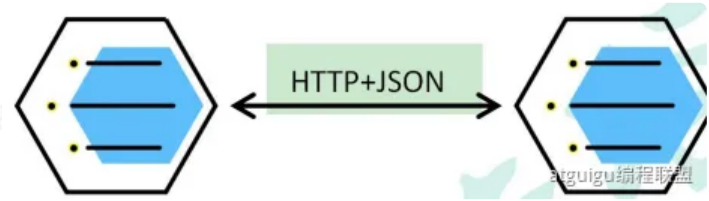

最小连接:优先选择连接数最少,也就是压力最小的后端服务器,在会话较长的情况下可以考
虑采取这种方式。
散列:根据请求源的 IP 的散列(hash)来选择要转发的服务器。这种方式可以一定程度上保
证特定用户能连接到相同的服务器。如果你的应用需要处理状态而要求用户能连接到和之前相
同的服务器,可以考虑采取这种方式。
### 1.5. 服务注册/发现&注册中心
A 服务调用 B 服务,A 服务并不知道 B 服务当前在哪几台服务器有,哪些正常的,哪些服务已经
下线。解决这个问题可以引入注册中心;
如果某些服务下线,我们其他人可以实时的感知到其他服务的状态,从而避免调用不可用的服务

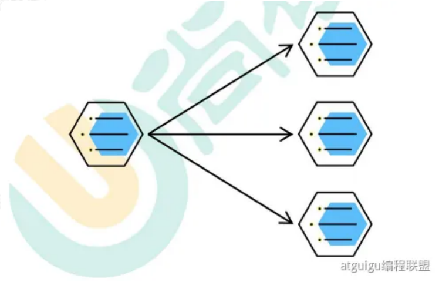

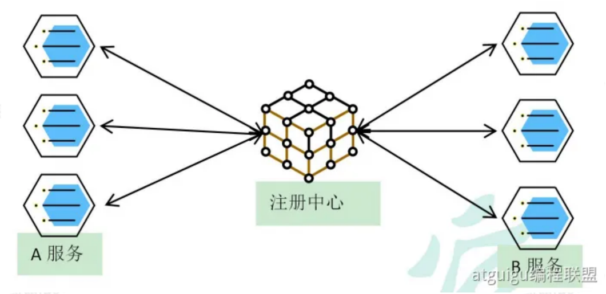

### 1.6. 配置中心
每一个服务最终都有大量的配置,并且每个服务都可能部署在多台机器上。我们经常需要变更配
置,我们可以让每个服务在配置中心获取自己的配置。
配置中心用来集中管理微服务的配置信息
### 1.7. 服务熔断&服务降级
在微服务架构中,微服务之间通过网络进行通信,存在相互依赖,当其中一个服务不可用时,有可
能会造成雪崩效应。要防止这样的情况,必须要有容错机制来保护服务。

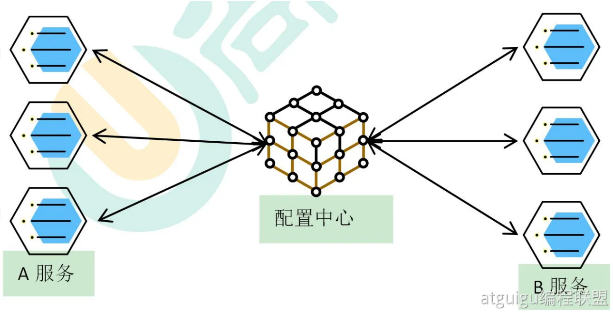

1)、服务熔断
设置服务的超时,当被调用的服务经常失败到达某个阈值,我们可以开启断路保护机制,后来的请
求不再去调用这个服务。本地直接返回默认的数据
2)、服务降级
在运维期间,当系统处于高峰期,系统资源紧张,我们可以让非核心业务降级运行。降级:某些服
务不处理,或者简单处理【抛异常、返回 NULL、调用 Mock 数据、调用 Fallback 处理逻辑】
### 1.8. API 网关
在微服务架构中,API Gateway 作为整体架构的重要组件,它抽象了微服务中都需要的公共功
能,同时提供了客户端负载均衡,服务自动熔断,灰度发布,统一认证,限流流控,日志统计等丰
富的功能,帮助我们解决很多 API 管理难题。

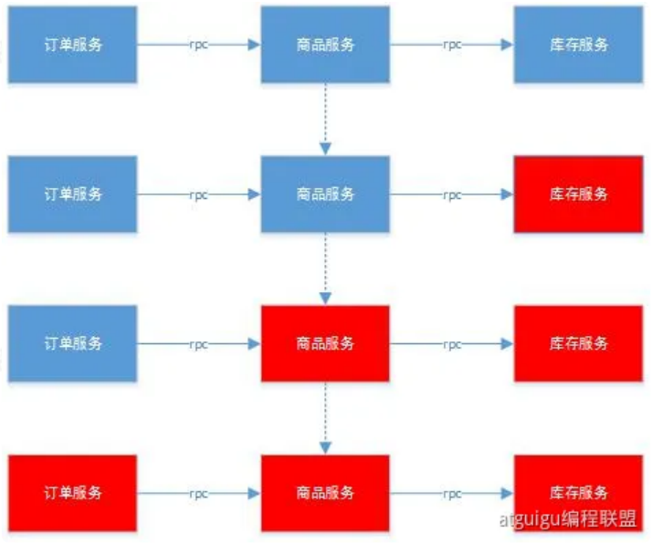

## 2. Spring Cloud
### 2.1. 技术配置
Spring Cloud 系列:
官网:https://spring.io/projects/spring-cloud
远程调用:OpenFeign
网关:Gateway
Spring Cloud Alibaba 系列:
官网:https://sca.aliyun.com/
注册中心/配置中心:Nacos
服务保护:Sentinel
分布式事务:Seata
### 2.2. 版本

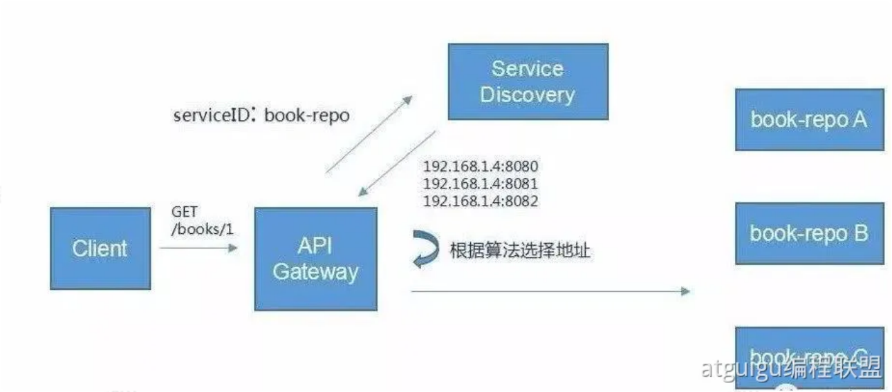

### 2.3. 实践
创建父项目引入公共依赖

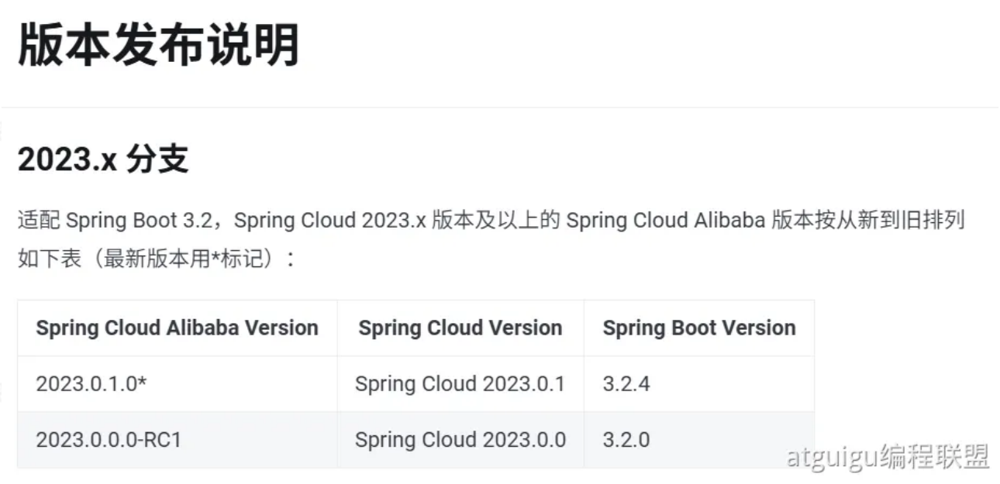

```xml
<?xml version="1.0" encoding="UTF-8"?>
<project xmlns="http://maven.apache.org/POM/4.0.0"
xmlns:xsi="http://www.w3.org/2001/XMLSchema-instance"
xsi:schemaLocation="http://maven.apache.org/POM/4.0.0 http://maven.apache.org/xsd/maven-4.0.0.xsd">
<parent>
<groupId>org.springframework.boot</groupId>
<artifactId>spring-boot-starter-parent</artifactId>
<version>3.3.4</version>
<relativePath/> <!-- lookup parent from repository -->
</parent>
<modelVersion>4.0.0</modelVersion>
<groupId>com.atguigu</groupId>
<artifactId>spring-cloud-demo</artifactId>
<version>1.0-SNAPSHOT</version>
<packaging>pom</packaging>
<properties>
<maven.compiler.source>17</maven.compiler.source>
<maven.compiler.target>17</maven.compiler.target>
<project.build.sourceEncoding>UTF-8</project.build.sourceEncoding>
<spring-cloud.version>2023.0.3</spring-cloud.version>
<spring-cloud-alibaba.version>2023.0.3.2</spring-cloud-alibaba.version>
</properties>
<dependencyManagement>
<dependencies>
<dependency>
<groupId>org.springframework.cloud</groupId>
<artifactId>spring-cloud-dependencies</artifactId>
<version>${spring-cloud.version}</version>
<type>pom</type>
<scope>import</scope>
</dependency>
<dependency>
<groupId>com.alibaba.cloud</groupId>
<artifactId>spring-cloud-alibaba-dependencies</artifactId>
<version>${spring-cloud-alibaba.version}</version>
<type>pom</type>
<scope>import</scope>
</dependency>
</dependencies>
</dependencyManagement>
</project>
```
## 3. Nacos - 注册/配置中心
### 3.1. 基础入门
#### 3.1.1. 简介
官网:https://nacos.io/zh-cn/docs/v2/quickstart/quick-start.html
Nacos /nɑ:kəʊs/ 是 Dynamic Naming and Configuration Service的首字母简称,一个更易于构
建云原生应用的动态服务发现、配置管理和服务管理平台。
#### 3.1.2. 安装
Docker 安装
```bash
docker run -d -p 8848:8848 -p 9848:9848 -e MODE=standalone --name nacos nacos/nacos-server:v2.4.3
```
下载软件包:📎nacos-server-2.4.3.zip
启动:
```bash
startup.cmd -m standalone
```
### 3.2. 注册中心
#### 3.2.1. 依赖引入

```xml
<dependency>
<groupId>com.alibaba.cloud</groupId>
<artifactId>spring-cloud-starter-alibaba-nacos-discovery</artifactId>
</dependency>
```
#### 3.2.2. 整合配置
1、在 application.properties 中配置如下
```properties
spring.cloud.nacos.discovery.server-addr=127.0.0.1:8848
#暂未用到配置中心功能,需要关闭配置检查
#spring.cloud.nacos.config.import-check.enabled=false
```
2、开启服务注册/发现功能
```java
@EnableDiscoveryClient //核心注解
@SpringBootApplication
public class OrderMainApplication {
public static void main(String[] args) {
SpringApplication.run(OrderMainApplication.class, args);
}
}
```
#### 3.2.3. 服务注册
##### 3.2.3.1. 查看效果
访问:http://localhost:8848/nacos 可以看到服务已经注册上来;

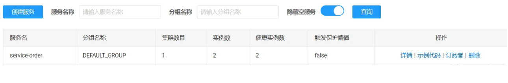

##### 3.2.3.2. 注册更多
1. 创建 service-product 服务
2. 引入 nacos依赖
3. 配置 nacos地址信息
a. 注意:每个微服务端口不一样
4. 启动应用,查看是否注册成功
##### 3.2.3.3. 启动集群
以 service-order 为例,启动 movie 的三个服务。
1. idea 搜索 services 面板,添加 SpringBoot 项目。
2. 复制 OrderMainApplication 三份,每个启动命令重新指定端口
##### 3.2.3.4. 查看集群
#### 3.2.4. 服务发现
##### 3.2.4.1. DiscoveryClient

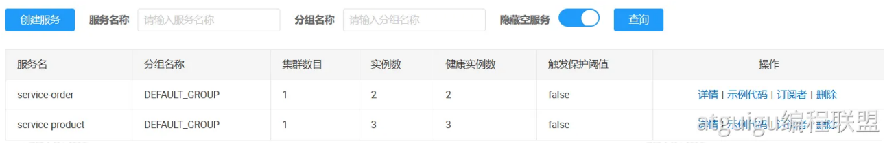

```java
@Autowired
DiscoveryClient discoveryClient;
@Test
void discoveryClientTest(){
for (String service : discoveryClient.getServices()) {
System.out.println("service = " + service);
//获取ip+port
List<ServiceInstance> instances = discoveryClient.getInstances(service);
for (ServiceInstance instance : instances) {
System.out.println("ip:"+instance.getHost()+";"+"port = " +instance.getPort());
}
}
}
```
##### 3.2.4.2. NacosServiceDiscovery
```java
@Autowired
NacosServiceDiscovery nacosServiceDiscovery;
@Test
void nacosServiceDiscoveryTest() throws NacosException {
for (String service : nacosServiceDiscovery.getServices()) {
System.out.println("service = " + service);
List<ServiceInstance> instances = nacosServiceDiscovery.getInstances(service);
for (ServiceInstance instance : instances) {
System.out.println("ip:"+instance.getHost()+";"+"port = " +instance.getPort());
}
}
}
```
##### 3.2.4.3. 模拟掉线
随机中断一个服务,运行代码或在界面查看效果

#### 3.2.5. 远程调用
##### 3.2.5.1. 配置 RestTemplate
```java
@Configuration
public class UserConfiguration {
@Bean
RestTemplate restTemplate() {
return new RestTemplate();
}
}
```
##### 3.2.5.2. 测试调用
```java
@Autowired
RestTemplate restTemplate;
@Test
void testRestTemplate() {
String forObject = restTemplate.getForObject("http://localhost:8080/movie", String.class);
System.out.println(forObject);
System.out.println("-----------------------------");
}
```
##### 3.2.5.3. 小结
1. 使用 RestTemplate 可以获取到远程数据

2. 必须精确指定地址和端口
3. 如果远程宕机将不可用
期望:可以负载均衡调用,不用担心远程宕机
#### 3.2.6. 负载均衡
##### 3.2.6.1. 依赖导入
```xml
<dependency>
<groupId>org.springframework.cloud</groupId>
<artifactId>spring-cloud-starter-loadbalancer</artifactId>
</dependency>
```
##### 3.2.6.2. LoadBalancerClient
```java
// 进阶2:完成负载均衡发送请求
private Product getProductFromRemoteWithLoadBalance(Long productId){
//1、获取到商品服务所在的所有机器IP+port
ServiceInstance choose = loadBalancerClient.choose("service-product");
//远程URL
String url = "http://"+choose.getHost() +":" +choose.getPort() +"/product/"+productId;
log.info("远程请求:{}",url);
//2、给远程发送请求
Product product = restTemplate.getForObject(url, Product.class);
return product;
}
```
##### 3.2.6.3. 注解式负载均衡

```java
@Configuration
public class UserConfiguration {
@LoadBalanced
@Bean
RestTemplate restTemplate() {
return new RestTemplate();
}
}
```
```java
// 进阶3:基于注解的负载均衡
private Product getProductFromRemoteWithLoadBalanceAnnotation(Long productId){
String url = "http://service-product/product/"+productId;
//2、给远程发送请求; service-product 会被动态替换
Product product = restTemplate.getForObject(url, Product.class);
return product;
}
```
##### 3.2.6.4. 小结
1. 负载均衡调用只需要传入 服务名
2. 请求发起之前会自动去注册中心确定微服务地址
3. 如果微服务宕机,会自动剔除在线名单,请求将不会发过去
#### 3.2.7. 深入探索
经典面试题:
如果注册中心宕机,远程调用是否可以成功?

1. 从未调用过,如果宕机,调用会立即失败
2. 调用过,如果宕机,因为会缓存名单,调用会成功
3. 调用过,如果注册中心和对方服务宕机,因为会缓存名单,调用会阻塞后失败(Connection
Refused)
### 3.3. 配置中心
主要提示:

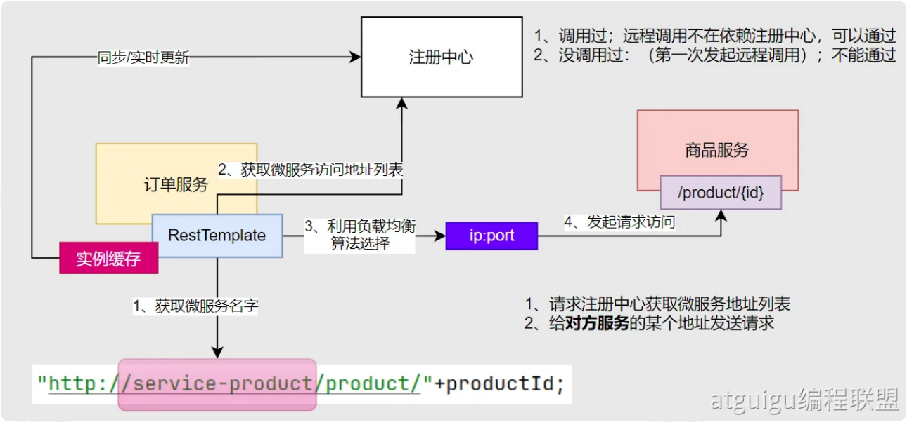

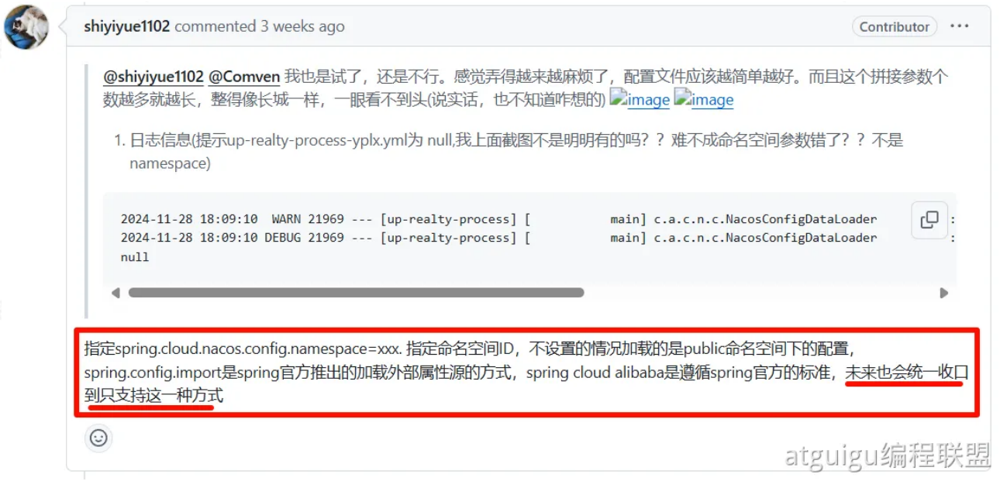

#### 3.3.1. 整合配置
##### 3.3.1.1. 依赖引入
```xml
<dependency>
<groupId>com.alibaba.cloud</groupId>
<artifactId>spring-cloud-starter-alibaba-nacos-config</artifactId>
</dependency>
```
##### 3.3.1.2. 配置文件
application.properties
```properties
# 指定配置中心地址
spring.cloud.nacos.server-addr=localhost:8848
spring.config.import=nacos:service-order.properties
```
##### 3.3.1.3. 配置集-dataId

#### 3.3.2. 动态刷新
##### 3.3.2.1. @RefreshScope

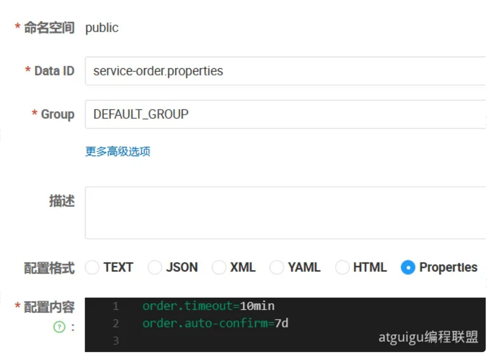

```java
@RefreshScope//自动刷新
@RestController
public class OrderController {
@Autowired
OrderService orderService;
@Value("${order.timeout}")
String orderTimeout;
@Value("${order.auto-confirm}")
String orderAutoConfirm;
@Autowired
OrderProperties orderProperties;
@GetMapping("/config")
public String config(){
return "order.timeout="+orderProperties.getTimeout()+"; " +
"order.auto-confirm="+orderProperties.getAutoConfirm() +";"+
"order.db-url="+orderProperties.getDbUrl();
}
}
```
##### 3.3.2.2. ConfigurationProperties
无需 @RefreshScope,自动绑定配置,动态更新

```java
@Component
@ConfigurationProperties(prefix = "order") //配置批量绑定在nacos下,可以无需@R
```
efreshScope就能实现自动刷新
```java
@Data
public class OrderProperties {
String timeout;
String autoConfirm;
String dbUrl;
}
```
#### 3.3.3. NacosConfigManager
```java
@Bean
ApplicationRunner applicationRunner(NacosConfigManager manager){
return args -> {
ConfigService configService = manager.getConfigService();
configService.addListener("service-order.properties", "DEFAULT_GROUP", new Listener() {
@Override
public Executor getExecutor() {
return Executors.newFixedThreadPool(4);
}
@Override
public void receiveConfigInfo(String configInfo) {
System.out.println("configInfo = " + configInfo);
}
});
};
}
```

#### 3.3.4. namespace、dataId、group
##### 3.3.4.1. namespace
命名空间:实现多环境隔离,如:开发、测试、预发、生产等
##### 3.3.4.2. dataId
数据集id:就是以前配置文件的名字。完整写法: 名字.后缀 如: common.properties
##### 3.3.4.3. groupId
分组id:一般可以用微服务的名字作为自己的组。
##### 3.3.4.4. 推荐用法

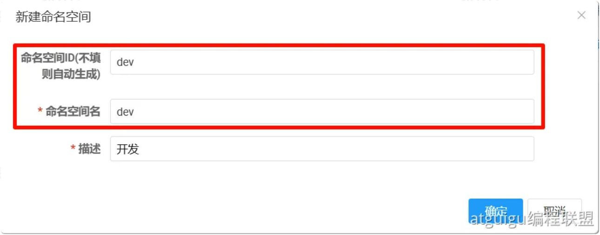

## 4. OpenFeign - 远程调用
### 4.1. 基础入门
官网:https://docs.spring.io/spring-cloud-openfeign/reference/spring-cloud-
openfeign.html#spring-cloud-feign
#### 4.1.1. 简介
OpenFeign 是一个声明式远程调用客户端;
#### 4.1.2. 引入依赖
由于大型项目中,每个项目都可能需要使用远程调用。所以我们可以在父项目中统一引入

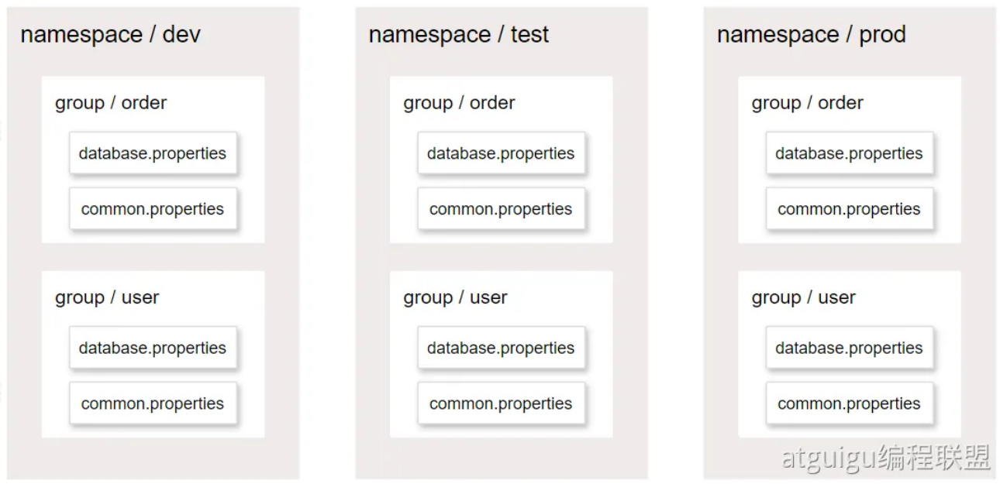

```xml
<dependency>
<groupId>org.springframework.cloud</groupId>
<artifactId>spring-cloud-starter-openfeign</artifactId>
</dependency>
```
#### 4.1.3. 开启功能
```java
@SpringBootApplication
@EnableFeignClients
public class Application {
public static void main(String[] args) {
SpringApplication.run(Application.class, args);
}
}
```
#### 4.1.4. 远程调用

```java
@FeignClient("stores")
public interface StoreClient {
@RequestMapping(method = RequestMethod.GET, value = "/stores")
List<Store> getStores();
@GetMapping("/stores")
Page<Store> getStores(Pageable pageable);
@PostMapping(value = "/stores/{storeId}", consumes = "application/json",
params = "mode=upsert")
Store update(@PathVariable("storeId") Long storeId, Store store);
@DeleteMapping("/stores/{storeId:\\d+}")
void delete(@PathVariable Long storeId);
}
```
注意用法:
@EnableFeignClients
@EnableFeignClients(basePackages = "com.example.clients")
### 4.2. 进阶配置
#### 4.2.1. 开启日志
```yaml
logging:
level:
com.atguigu.order.feign: debug
```

```java
@Bean
Logger.Level feignLoggerLevel() {
return Logger.Level.FULL;
}
```
#### 4.2.2. 超时控制
```yaml
spring:
cloud:
openfeign:
client:
config:
default:
logger-level: full
connect-timeout: 1000
read-timeout: 2000
service-product:
logger-level: full
connect-timeout: 3000
read-timeout: 5000
```
#### 4.2.3. 重试机制
```java
@Bean
Retryer retryer(){
return new Retryer.Default();
}
```
#### 4.2.4. fallback - 兜底返回

1. 引入 sentinel
```xml
<dependency>
<groupId>com.alibaba.cloud</groupId>
<artifactId>spring-cloud-starter-alibaba-sentinel</artifactId>
</dependency>
```
2. 开启熔断
```yaml
feign:
sentinel:
enabled: true
```
3. 编写 fallback 函数
```java
@FeignClient(value = "service-product",fallback = ProductFeignClientFallback.class) // feign客户端
public interface ProductFeignClient {
//mvc注解的两套使用逻辑
//1、标注在Controller上,是接受这样的请求
//2、标注在FeignClient上,是发送这样的请求
@GetMapping("/product/{id}")
Product getProductById(@PathVariable("id") Long id);
}
```

```java
@Component
public class ProductFeignClientFallback implements ProductFeignClient {
@Override
public Product getProductById(Long id) {
System.out.println("兜底回调....");
Product product = new Product();
product.setId(id);
product.setPrice(new BigDecimal("0"));
product.setProductName("未知商品");
product.setNum(0);
return product;
}
}
```
## 5. Sentinel - 流量保护
### 5.1. 介绍
官网:https://sentinelguard.io/zh-cn/index.html
wiki:https://github.com/alibaba/Sentinel/wiki
下载控制台:📎sentinel-dashboard-1.8.8.jar
随着微服务的流行,服务和服务之间的稳定性变得越来越重要。Sentinel 以流量为切入点,从流
量控制、流量路由、熔断降级、系统自适应过载保护、热点流量防护等多个维度保护服务的稳定
性。
Sentinel 具有以下特征:
丰富的应用场景:Sentinel 承接了阿里巴巴近 10 年的双十一大促流量的核心场景,例如秒杀
(即突发流量控制在系统容量可以承受的范围)、消息削峰填谷、集群流量控制、实时熔断下
游不可用应用等。
完备的实时监控:Sentinel 同时提供实时的监控功能。您可以在控制台中看到接入应用的单台
机器秒级数据,甚至 500 台以下规模的集群的汇总运行情况。
广泛的开源生态:Sentinel 提供开箱即用的与其它开源框架/库的整合模块,例如与 Spring

Cloud、Apache Dubbo、gRPC、Quarkus 的整合。您只需要引入相应的依赖并进行简单的
配置即可快速地接入 Sentinel。同时 Sentinel 提供 Java/Go/C++ 等多语言的原生实现。
完善的 SPI 扩展机制:Sentinel 提供简单易用、完善的 SPI 扩展接口。您可以通过实现扩展
接口来快速地定制逻辑。例如定制规则管理、适配动态数据源等。
### 5.2. 架构

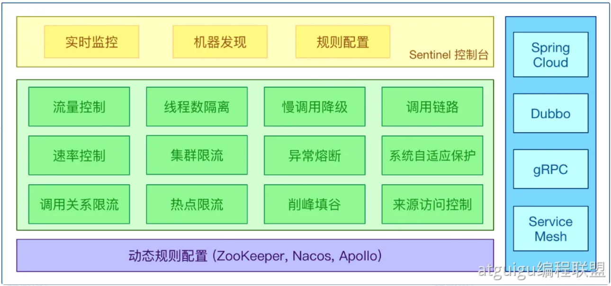

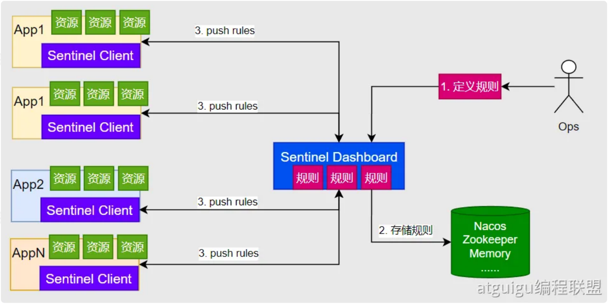

### 5.3. 资源&规则
定义资源:
主流框架自动适配(Web Servlet、Dubbo、Spring Cloud、gRPC、Spring WebFlux、
Reactor);所有Web接口均为资源
编程式:SphU API
声明式:@SentinelResource
定义规则:
流量控制规则
熔断降级规则
系统保护规则
来源访问控制规则
热点参数规则

### 5.4. 环境搭建
#### 5.4.1. 依赖
```xml
<dependency>
<groupId>com.alibaba.cloud</groupId>
<artifactId>spring-cloud-starter-alibaba-sentinel</artifactId>
</dependency>
```
#### 5.4.2. 启动控制台

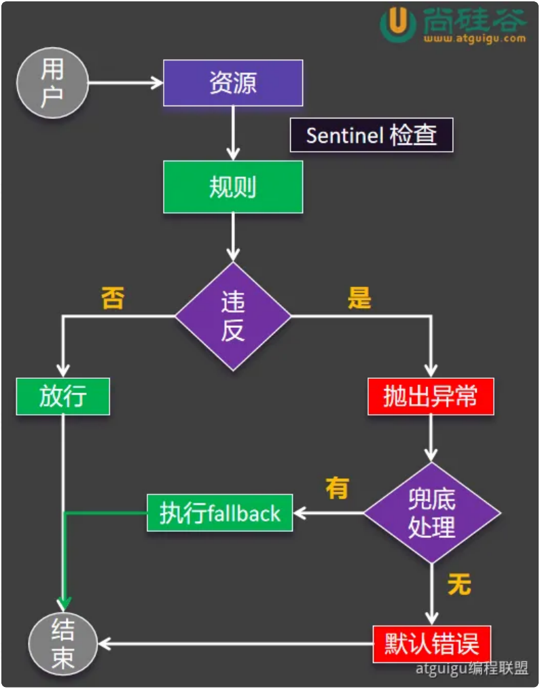

```bash
java -jar sentinel.jar
```
#### 5.4.3. 配置连接
```yaml
spring:
cloud:
sentinel:
transport:
dashboard: localhost:8080
```
### 5.5. 异常处理
#### 5.5.1. 自定义 BlockExceptionHandler

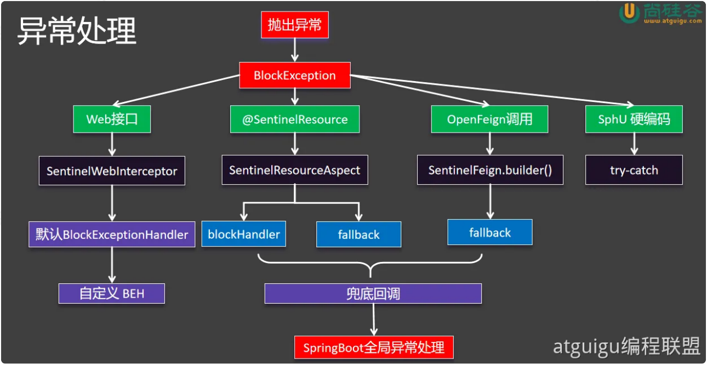

```java
@Component
public class MyBlockExceptionHandler implements BlockExceptionHandler {
private ObjectMapper objectMapper = new ObjectMapper();
@Override
public void handle(HttpServletRequest request, HttpServletResponse response,
String resourceName, BlockException e) throws Exception {
response.setStatus(429); //too many requests
response.setContentType("application/json;charset=utf-8");
PrintWriter writer = response.getWriter();
R error = R.error(500, resourceName + " 被Sentinel限制了,原因:" +e.getClass());
String json = objectMapper.writeValueAsString(error);
writer.write(json);
writer.flush();
writer.close();
}
}
```
#### 5.5.2. blockHandler

```java
@SentinelResource(value = "createOrder", blockHandler = "createOrderFallback")
@Override
public Order createOrder(Long productId, Long userId) {
    // Product product = getProductFromRemoteWithLoadBalanceAnnotation(productId);

    // 使用 Feign 完成远程调用
    Product product = productFeignClient.getProductById(productId);

    Order order = new Order();
    order.setId(1L);
    // 总金额
    order.setTotalAmount(product.getPrice().multiply(new BigDecimal(product.getNum())));
    order.setUserId(userId);
    order.setNickName("zhangsan");
    order.setAddress("尚硅谷");
    // 远程查询商品列表
    order.setProductList(Arrays.asList(product));
    return order;
}

// 兜底回调
public Order createOrderFallback(Long productId, Long userId, BlockException e) {
    Order order = new Order();
    order.setId(0L);
    order.setTotalAmount(new BigDecimal("0"));
    order.setUserId(userId);
    order.setNickName("未知用户");
    order.setAddress("异常信息:" + e.getClass());
    return order;
}
```

#### 5.5.3. OpenFeign - 兜底回调

```java
@FeignClient(value = "service-product",fallback = ProductFeignClientFallback.class) // feign客户端
public interface ProductFeignClient {
//mvc注解的两套使用逻辑
//1、标注在Controller上,是接受这样的请求
//2、标注在FeignClient上,是发送这样的请求
@GetMapping("/product/{id}")
Product getProductById(@PathVariable("id") Long id);
}
```
```java
@Component
public class ProductFeignClientFallback implements ProductFeignClient {
@Override
public Product getProductById(Long id) {
System.out.println("兜底回调....");
Product product = new Product();
product.setId(id);
product.setPrice(new BigDecimal("0"));
product.setProductName("未知商品");
product.setNum(0);
return product;
}
}
```
### 5.6. 规则 - 流量控制

#### 5.6.1. 阈值类型
QPS:统计每秒请求数
并发线程数:统计并发线程数
#### 5.6.2. 流控模式

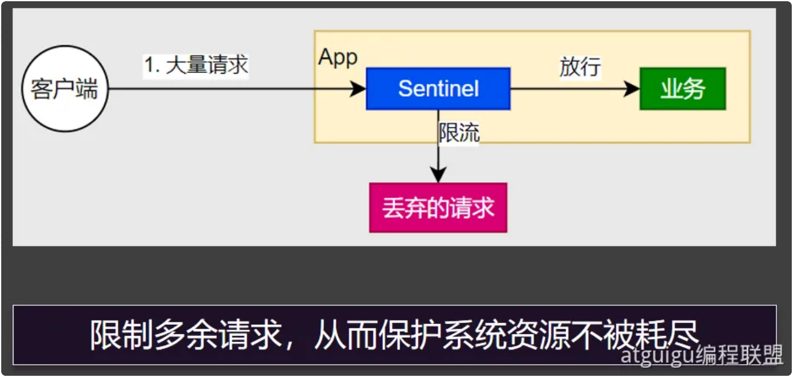

#### 5.6.3. 流控效果

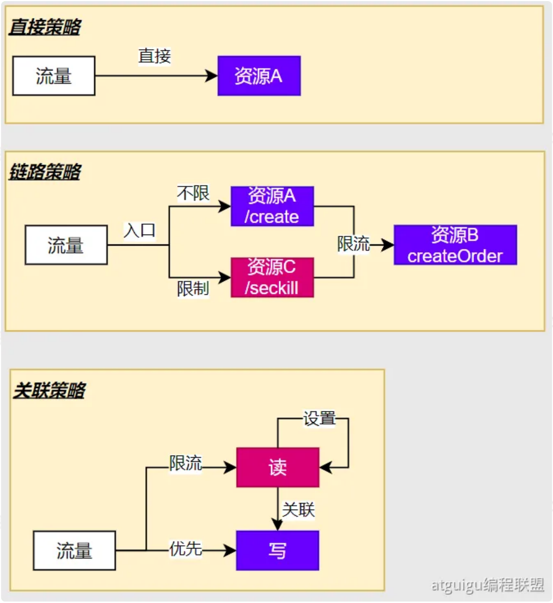

### 5.7. 规则 - 熔断降级
#### 5.7.1. 断路器
#### 5.7.2. 工作原理

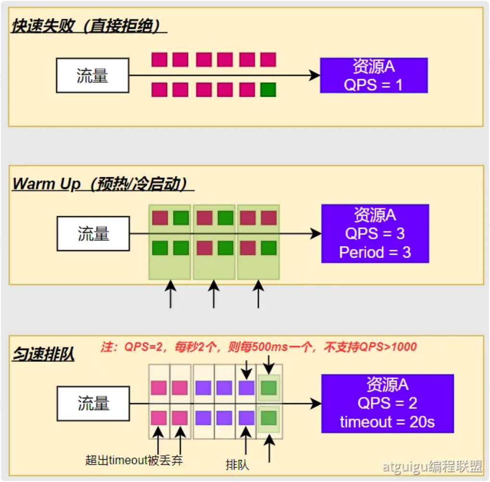

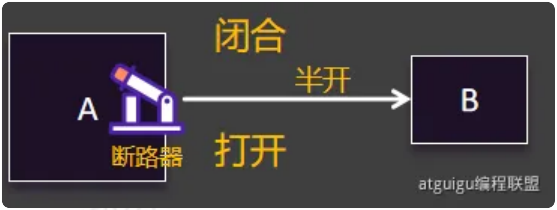

#### 5.7.3. 熔断与兜底
### 5.8. 规则 - 热点参数

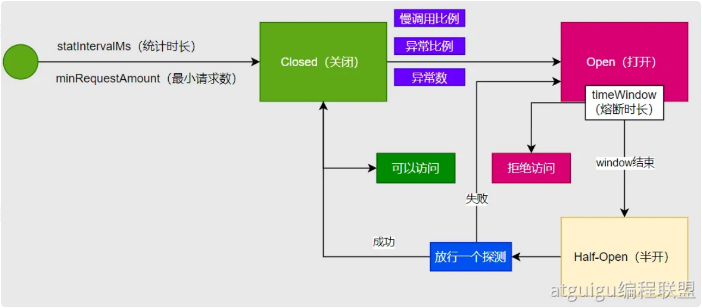

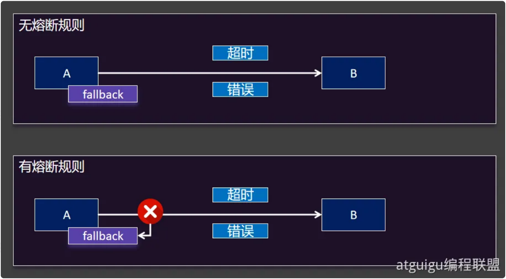

#### 5.8.1. 环境搭建
```java
@GetMapping("/seckill")
@SentinelResource(value = "seckill-order",fallback = "seckillFallback")
public Order seckill(@RequestParam(value = "userId",required = false)
Long userId,
@RequestParam(value = "productId",defaultValue = "1000") Long productId){
Order order = orderService.createOrder(productId, userId);
order.setId(Long.MAX_VALUE);
return order;
}
public Order seckillFallback(Long userId,Long productId, BlockException exception){
System.out.println("seckillFallback....");
Order order = new Order();
order.setId(productId);
order.setUserId(userId);
order.setAddress("异常信息:"+exception.getClass());
return order;
}
```
## 6. Gateway - 网关

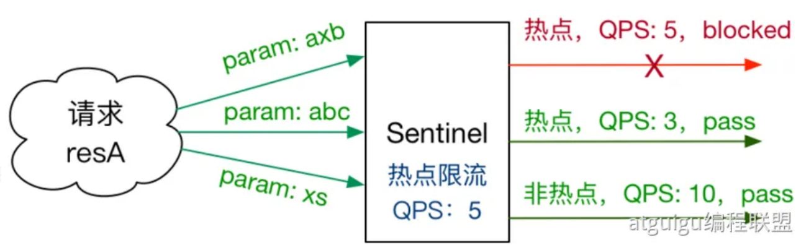

官网:https://spring.io/projects/spring-cloud-gateway
### 6.1. 基础入门
#### 6.1.1. 功能
#### 6.1.2. HelloWorld
/api/order/** 路由给订单
/api/product/** 路由给商品
测试负载均衡
##### 6.1.2.1. 创建项目

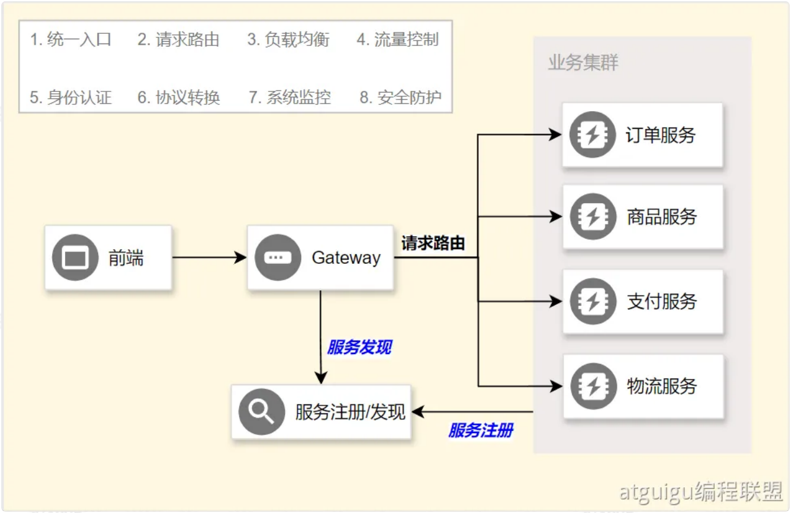

引入 spring-cloud-starter-gateway 、 spring-cloud-starter-alibaba-nacos-disc
overy
```xml
<dependency>
<groupId>org.springframework.cloud</groupId>
<artifactId>spring-cloud-starter-gateway</artifactId>
</dependency>
<dependency>
<groupId>com.alibaba.cloud</groupId>
<artifactId>spring-cloud-starter-alibaba-nacos-discovery</artifactId>
</dependency>
```
##### 6.1.2.2. 改造微服务
- 为 service-order、service-prduct 添加 /api 基础路径
##### 6.1.2.3. 配置网关
创建 application.yml 编写如下配置
```yaml
spring:
cloud:
gateway:
routes:
- id: order
uri: lb://service-order
predicates:
- Path=/api/order/**
- id: product
uri: lb://service-product
predicates:
- Path=/api/product/**
```

#### 6.1.3. 原理
### 6.2. Predicate - 断言
```yaml
spring:
cloud:
gateway:
routes:
- id: after_route
uri: https://example.org
predicates:
- After=2017-01-20T17:42:47.789-07:00[America/Denver]
```
名 参数(个数/类型) 作用
After 1/datetime 在指定时间之后
Before 1/datetime 在指定时间之前
Between 2/datetime 在指定时间区间内

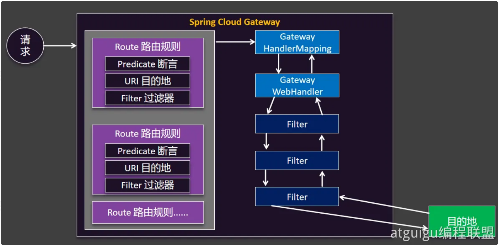

Cookie 2/string,regexp 包含cookie名且必须匹配指定值
Header 2/string,regexp 包含请求头且必须匹配指定值
Host N/string 请求host必须是指定枚举值
Method N/string 请求方式必须是指定枚举值
Path 2/List&lt;String&gt;,bool 请求路径满足规则,是否匹配最后的/
Query 2/string,regexp 包含指定请求参数
RemoteAddr 1/List&lt;String&gt; 请求来源于指定网络域(CIDR写法)
Weight 2/string,int 按指定权重负载均衡
XForwardedRem 1/List&lt;string&gt; 从X-Forwarded-For请求头中解析请求来源,并判断
oteAddr 是否来源于指定网络域
### 6.3. Filter - 过滤器
名 参数(个数/类型) 作用
AddRequestHea 2/string 添加请求头
der
AddRequestHea 1/List&lt;string&gt; 如果没有则添加请求头,key:value方式
dersIfNotPresen
t
AddRequestPar 2/string、string 添加请求参数
ameter
AddResponseHe 2/string、string 添加响应头
ader
CircuitBreaker 1/string 仅支持forward:/inCaseOfFailureUseThis方式进行
熔断

CacheRequestB 1/string 缓存请求体
ody
DedupeRespons 1/string 移除重复响应头,多个用空格分割
eHeader
FallbackHeader 1/string 设置Fallback头
s
JsonToGrpc 请求体Json转为gRPC
LocalResponse 2/string 响应数据本地缓存
Cache
MapRequestHea 2/string 把某个请求头名字变为另一个名字
der
ModifyRequestB 仅 Java 代码方式 修改请求体
ody
ModifyRespons 仅 Java 代码方式 修改响应体
eBody
PrefixPath 1/string 自动添加请求前缀路径
PreserveHostHe 0 保护Host头
ader
RedirectTo 3/string 重定向到指定位置
RemoveJsonAttr 1/string 移除响应体中的某些Json字段,多个用,分割
ibutesResponse
Body
RemoveRequest 1/string 移除请求头
Header
RemoveRequest 1/string 移除请求参数
Parameter
RemoveRespon 1/string 移除响应头
seHeader

RequestHeader 2/string 设置请求大小,超出则响应431状态码
Size
RequestRateLim 1/string 请求限流
iter
RewriteLocation 4/string 重写Location响应头
ResponseHeade
r
RewritePath 2/string 路径重写
RewriteRequest 2/string 请求参数重写
Parameter
RewriteRespons 3/string 响应头重写
eHeader
SaveSession 0 session保存,配合spring-session框架
SecureHeaders 0 安全头设置
SetPath 1/string 路径修改
SetRequestHea 2/string 请求头修改
der
SetResponseHe 2/string 响应头修改
ader
SetStatus 1/int 设置响应状态码
StripPrefix 1/int 路径层级拆除
Retry 7/string 请求重试设置
RequestSize 1/string 请求大小限定
SetRequestHost 1/string 设置Host请求头
Header
TokenRelay 1/string OAuth2的token转发

### 6.4. CORS - 跨域处理
全局跨域
```yaml
spring:
cloud:
gateway:
globalcors:
cors-configurations:
'[/**]':
allowedOrigins: "https://docs.spring.io"
allowedMethods:
- GET
```
局部跨域
```yaml
spring:
cloud:
gateway:
routes:
- id: cors_route
uri: https://example.org
predicates:
- Path=/service/**
metadata:
cors:
allowedOrigins: '*'
allowedMethods:
- GET
- POST
allowedHeaders: '*'
maxAge: 30
```

### 6.5. GlobalFilter
```java
@Bean
public GlobalFilter customFilter() {
return new CustomGlobalFilter();
}
public class CustomGlobalFilter implements GlobalFilter, Ordered {
@Override
public Mono<Void> filter(ServerWebExchange exchange, GatewayFilterChain chain) {
log.info("custom global filter");
return chain.filter(exchange);
}
@Override
public int getOrder() {
return -1;
}
}
```
## 7. Seata - 分布式事务
官网:https://seata.apache.org/zh-cn/
### 7.1. 环境搭建
#### 7.1.1. 微服务
下载 seata 工程文件,导入到项目中,并在 services 中添加 module 聚合
📎seata-demo.zip
#### 7.1.2. SQL

启动一个数据库,然后运行如下sql文件

```sql
CREATE DATABASE IF NOT EXISTS `storage_db`;
USE `storage_db`;
DROP TABLE IF EXISTS `storage_tbl`;
CREATE TABLE `storage_tbl` (
`id` int(11) NOT NULL AUTO_INCREMENT,
`commodity_code` varchar(255) DEFAULT NULL,
`count` int(11) DEFAULT 0,
PRIMARY KEY (`id`),
UNIQUE KEY (`commodity_code`)
) ENGINE=InnoDB DEFAULT CHARSET=utf8;
INSERT INTO storage_tbl (commodity_code, count) VALUES ('P0001', 100);
INSERT INTO storage_tbl (commodity_code, count) VALUES ('B1234', 10);
-- 注意此处0.3.0+ 增加唯一索引 ux_undo_log
DROP TABLE IF EXISTS `undo_log`;
CREATE TABLE `undo_log` (
`id` bigint(20) NOT NULL AUTO_INCREMENT,
`branch_id` bigint(20) NOT NULL,
`xid` varchar(100) NOT NULL,
`context` varchar(128) NOT NULL,
`rollback_info` longblob NOT NULL,
`log_status` int(11) NOT NULL,
`log_created` datetime NOT NULL,
`log_modified` datetime NOT NULL,
`ext` varchar(100) DEFAULT NULL,
PRIMARY KEY (`id`),
UNIQUE KEY `ux_undo_log` (`xid`,`branch_id`)
) ENGINE=InnoDB AUTO_INCREMENT=1 DEFAULT CHARSET=utf8;
CREATE DATABASE IF NOT EXISTS `order_db`;
USE `order_db`;
DROP TABLE IF EXISTS `order_tbl`;
CREATE TABLE `order_tbl` (
`id` int(11) NOT NULL AUTO_INCREMENT,
`user_id` varchar(255) DEFAULT NULL,
`commodity_code` varchar(255) DEFAULT NULL,
`count` int(11) DEFAULT 0,
`money` int(11) DEFAULT 0,
PRIMARY KEY (`id`)
) ENGINE=InnoDB DEFAULT CHARSET=utf8;
-- 注意此处0.3.0+ 增加唯一索引 ux_undo_log
DROP TABLE IF EXISTS `undo_log`;
CREATE TABLE `undo_log` (
`id` bigint(20) NOT NULL AUTO_INCREMENT,
`branch_id` bigint(20) NOT NULL,
`xid` varchar(100) NOT NULL,
`context` varchar(128) NOT NULL,
`rollback_info` longblob NOT NULL,
`log_status` int(11) NOT NULL,
`log_created` datetime NOT NULL,
`log_modified` datetime NOT NULL,
`ext` varchar(100) DEFAULT NULL,
PRIMARY KEY (`id`),
UNIQUE KEY `ux_undo_log` (`xid`,`branch_id`)
) ENGINE=InnoDB AUTO_INCREMENT=1 DEFAULT CHARSET=utf8;
CREATE DATABASE IF NOT EXISTS `account_db`;
USE `account_db`;
DROP TABLE IF EXISTS `account_tbl`;
CREATE TABLE `account_tbl` (
`id` int(11) NOT NULL AUTO_INCREMENT,
`user_id` varchar(255) DEFAULT NULL,
`money` int(11) DEFAULT 0,
PRIMARY KEY (`id`)
) ENGINE=InnoDB DEFAULT CHARSET=utf8;
INSERT INTO account_tbl (user_id, money) VALUES ('1', 10000);
-- 注意此处0.3.0+ 增加唯一索引 ux_undo_log
DROP TABLE IF EXISTS `undo_log`;
CREATE TABLE `undo_log` (
`id` bigint(20) NOT NULL AUTO_INCREMENT,
`branch_id` bigint(20) NOT NULL,
`xid` varchar(100) NOT NULL,
`context` varchar(128) NOT NULL,
`rollback_info` longblob NOT NULL,
`log_status` int(11) NOT NULL,
`log_created` datetime NOT NULL,
`log_modified` datetime NOT NULL,
`ext` varchar(100) DEFAULT NULL,
PRIMARY KEY (`id`),
UNIQUE KEY `ux_undo_log` (`xid`,`branch_id`)
) ENGINE=InnoDB AUTO_INCREMENT=1 DEFAULT CHARSET=utf8;
```
#### 7.1.3. seata-server
1. 下载:https://seata.apache.org/zh-cn/download/seata-server
📎apache-seata-2.1.0-incubating-bin.tar.gz

2. 解压并启动: `seata-server.bat`
#### 7.1.4. 微服务配置
##### 7.1.4.1. 依赖
```xml
<dependency>
<groupId>com.alibaba.cloud</groupId>
<artifactId>spring-cloud-starter-alibaba-seata</artifactId>
</dependency>
```
##### 7.1.4.2. 配置
每个微服务创建 file.conf 文件,完整内容如下;
【微服务只需要复制 service 块 配置即可】

```conf
#
# Licensed to the Apache Software Foundation (ASF) under one or more
# contributor license agreements. See the NOTICE file distributed with
# this work for additional information regarding copyright ownership.
# The ASF licenses this file to You under the Apache License, Version 2.0
# (the "License"); you may not use this file except in compliance with
# the License. You may obtain a copy of the License at
#
# http://www.apache.org/licenses/LICENSE-2.0
#
# Unless required by applicable law or agreed to in writing, software
# distributed under the License is distributed on an "AS IS" BASIS,
# WITHOUT WARRANTIES OR CONDITIONS OF ANY KIND, either express or implied.
# See the License for the specific language governing permissions and
# limitations under the License.
#

transport {
  # tcp, unix-domain-socket
  type = "TCP"
  # NIO, NATIVE
  server = "NIO"
  # enable heartbeat
  heartbeat = true
  # the tm client batch send request enable
  enableTmClientBatchSendRequest = false
  # the rm client batch send request enable
  enableRmClientBatchSendRequest = true
  # the rm client rpc request timeout
  rpcRmRequestTimeout = 2000
  # the tm client rpc request timeout
  rpcTmRequestTimeout = 30000
  # the rm client rpc request timeout
  rpcRmRequestTimeout = 15000
  # thread factory for netty
  threadFactory {
    bossThreadPrefix = "NettyBoss"
    workerThreadPrefix = "NettyServerNIOWorker"
    serverExecutorThread-prefix = "NettyServerBizHandler"
    shareBossWorker = false
    clientSelectorThreadPrefix = "NettyClientSelector"
    clientSelectorThreadSize = 1
    clientWorkerThreadPrefix = "NettyClientWorkerThread"
    # netty boss thread size
    bossThreadSize = 1
    # auto default pin or 8
    workerThreadSize = "default"
  }
  shutdown {
    # when destroy server, wait seconds
    wait = 3
  }
  serialization = "seata"
  compressor = "none"
}

service {
  # transaction service group mapping
  vgroupMapping.default_tx_group = "default"
  # only support when registry.type=file, please don't set multiple addresses
  default.grouplist = "127.0.0.1:8091"
  # degrade, current not support
  enableDegrade = false
  # disable seata
  disableGlobalTransaction = false
}

client {
  rm {
    asyncCommitBufferLimit = 10000
    lock {
      retryInterval = 10
      retryTimes = 30
      retryPolicyBranchRollbackOnConflict = true
    }
    reportRetryCount = 5
    tableMetaCheckEnable = false
    tableMetaCheckerInterval = 60000
    reportSuccessEnable = false
    sagaBranchRegisterEnable = false
    sagaJsonParser = "fastjson"
    sagaRetryPersistModeUpdate = false
    sagaCompensatePersistModeUpdate = false
    tccActionInterceptorOrder = -2147482648 # Ordered.HIGHEST_PRECEDENCE + 1000
    sqlParserType = "druid"
    branchExecutionTimeoutXA = 60000
    connectionTwoPhaseHoldTimeoutXA = 10000
  }
  tm {
    commitRetryCount = 5
    rollbackRetryCount = 5
    defaultGlobalTransactionTimeout = 60000
    degradeCheck = false
    degradeCheckPeriod = 2000
    degradeCheckAllowTimes = 10
    interceptorOrder = -2147482648 # Ordered.HIGHEST_PRECEDENCE + 1000
  }
  undo {
    dataValidation = true
    onlyCareUpdateColumns = true
    logSerialization = "jackson"
    logTable = "undo_log"
    compress {
      enable = true
      # allow zip, gzip, deflater, lz4, bzip2, zstd default is zip
      type = zip
      # if rollback info size > threshold, then will be compress
      # allow k m g t
      threshold = 64k
    }
  }
  loadBalance {
    type = "XID"
    virtualNodes = 10
  }
}

log {
  exceptionRate = 100
}

tcc {
  fence {
    # tcc fence log table name
    logTableName = tcc_fence_log
    # tcc fence log clean period
    cleanPeriod = 1h
  }
}
```

### 7.2. 事务模式
#### 7.2.1. AT
二阶提交协议原理

#### 7.2.2. XA
#### 7.2.3. TCC
#### 7.2.4. Saga
## 8. 总结
