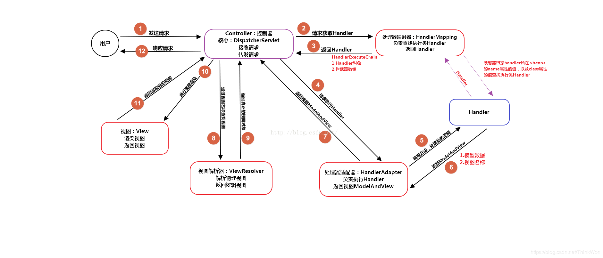

# 9、Spring 系统学习笔记

> 使用方式：你先在主问题和追问的 `回答：` 下面写自己的答案，我负责检查是否正确。默认只在对话中指出问题和建议改写，只有你明确说“直接修改文件”时，才会改这个文件。

> 本文件根据截图中的 Spring + Spring Boot + Spring MVC 知识体系重新整理。当前阶段按你的学习范围，重点学习 **Spring / Spring MVC / Spring Boot**，暂时不展开 **Spring Cloud / 微服务**。截图中偏项目阶段或外部资料链接的内容不逐条搬运，本文以面试复习问题为主。

> 图中橙色或高频内容用 **【重点】** 标记。

## 一、学习目标

学完 Spring 后，需要能讲清楚下面几条主线：

1. **Spring 是什么**，它解决了什么问题，为什么后端开发常用 Spring。
2. **IoC / DI** 是什么，Spring 容器如何创建、管理和装配 Bean。
3. **Bean 生命周期、作用域、循环依赖** 是什么，三级缓存为什么能解决部分循环依赖。
4. **AOP** 是什么，Spring AOP 如何基于代理增强方法，为什么会失效。
5. **Spring 事务** 如何实现，传播行为、回滚规则、事务失效场景怎么理解。
6. **Spring MVC** 请求处理流程是什么，常用注解、参数绑定、异常处理、拦截器和过滤器怎么理解。
7. **Spring Boot** 自动配置、starter、条件装配、SPI / 自动配置加载机制是什么。
8. 能说出 Spring 中常见设计模式和开发中容易踩的坑。

## 二、知识树

### 1. Spring 基础知识概述 **【重点】**

- Spring 是什么
- Spring 解决了什么问题
- Spring Framework、Spring MVC、Spring Boot 的关系
- Spring 的核心模块
- Spring 的优点和局限

### 2. Bean **【重点】**

- Bean 的定义
- Bean 和普通对象的区别
- BeanDefinition
- BeanFactory 和 ApplicationContext
- Bean 的作用域
- 单例 Bean 的线程安全问题
- Bean 生命周期
- BeanPostProcessor
- FactoryBean
- Bean 循环依赖

### 3. IoC **【重点】**

- IoC 控制反转
- DI 依赖注入
- IoC 和 DI 的区别
- IoC 容器职责
- Bean 注册、创建、依赖注入、生命周期管理
- Spring IoC 支持的功能

### 4. AOP **【重点】**

- AOP 是什么
- 横切关注点
- 连接点、切点、通知、切面、织入
- JDK 动态代理
- CGLIB
- Spring AOP 和 AspectJ
- AOP 失效场景

### 5. 三级缓存 / 循环依赖 **【重点】**

- 什么是循环依赖
- 构造器循环依赖
- setter / 字段注入循环依赖
- 一级缓存、二级缓存、三级缓存
- 提前暴露对象
- AOP 代理对象和循环依赖
- 为什么二级缓存不够

### 6. Spring 事务 **【重点】**

- 编程式事务和声明式事务
- `PlatformTransactionManager`
- `TransactionDefinition`
- `TransactionStatus`
- 事务传播行为
- 事务隔离级别
- 回滚规则
- `@Transactional` 失效场景

### 7. Spring 常用注解 **【重点】**

- 组件注册注解
- 依赖注入注解
- 配置类注解
- Web 层注解
- 事务注解
- 属性绑定注解
- 条件装配注解

### 8. Spring MVC

> 截图中标注为“不做重点”，但后端面试仍然常问基础流程，需要掌握主线。

- `DispatcherServlet`
- `HandlerMapping`
- `HandlerAdapter`
- 参数解析
- 消息转换器
- 返回值处理
- 视图解析
- 全局异常处理
- 拦截器
- 过滤器

### 9. Spring Boot **【重点】**

- Spring Boot 是什么
- 自动配置
- starter
- 自定义 starter
- 条件装配
- 配置属性绑定
- Spring Boot SPI / 自动配置加载
- 模式注解
- 常用注解

### 10. Spring 中的设计模式

- 单例模式
- 工厂模式
- 代理模式
- 模板方法模式
- 观察者模式
- 适配器模式
- 策略模式

### 11. MyBatis 相关内容

> 截图中包含 MyBatis，但它不属于 Spring 主线。这里只作为“和 Spring 后端面试常一起出现的扩展内容”保留，不作为当前 Spring 学习重点。

- MyBatis 执行流程
- MyBatis 延迟加载
- MyBatis 一级缓存和二级缓存
- MyBatis SQL 注入
- MyBatis 设计模式
- MyBatis 和 Spring 整合

### 12. Spring 常见错误

- Bean 注入失败
- 单例 Bean 状态共享问题
- 循环依赖问题
- AOP 失效
- 事务失效
- 注解使用错误
- Spring MVC 参数绑定错误
- Spring Boot 自动配置不生效

## 三、学习顺序

| 顺序 | 模块 | 学习目的 |
| --- | --- | --- |
| 1 | Spring 基础概述 | 先知道 Spring 解决什么问题 |
| 2 | IoC / DI | 理解对象创建和依赖管理为什么交给容器 |
| 3 | Bean | 理解 Spring 管理对象的基本单位 |
| 4 | Bean 生命周期 | 理解 Bean 从定义到销毁的完整过程 |
| 5 | 循环依赖 / 三级缓存 | 理解 Spring 容器的高频难点 |
| 6 | AOP | 理解代理增强和横切逻辑 |
| 7 | Spring 事务 | 理解事务代理、传播行为、回滚和失效 |
| 8 | Spring 常用注解 | 把核心概念和日常开发对应起来 |
| 9 | Spring MVC | 理解 Web 请求从进入到响应的完整链路 |
| 10 | Spring Boot | 理解自动配置和 starter 如何简化开发 |
| 11 | 设计模式 / 常见错误 | 用于面试追问和排错 |
| 12 | MyBatis 扩展 | 后续需要时再补充 |

## 四、Bean 源码学习总结 **【重点】**

> 这一部分是 Bean 第一阶段源码学习总结。重点不是背源码每一行，而是能把 **BeanDefinition -> 注册 -> getBean -> 创建 Bean -> 生命周期 -> 循环依赖 -> 扩展点** 这条线讲清楚。

### 1. Bean 学习主线

Bean 这一块可以按下面这条线理解：

```text
解析配置 / 扫描类
 -> 生成 BeanDefinition
 -> 注册到 BeanFactory
 -> getBean
 -> 查单例池
 -> 获取 BeanDefinition
 -> createBean
 -> doCreateBean
 -> 实例化
 -> 属性填充
 -> 初始化
 -> 放入单例池
 -> 使用
 -> 销毁
```

一句话总结：

```text
Spring 不是直接 new 对象，而是先把 Bean 的定义信息保存起来，之后根据这些定义信息创建、注入、初始化和管理 Bean。
```

### 2. `BeanDefinition` 是什么？

`BeanDefinition` 中文可以理解为：**Bean 定义信息 / Bean 元数据 / Bean 图纸**。

它不是 Bean 实例，而是 Spring 创建 Bean 之前保存的一份描述信息。

`BeanDefinition` 中通常保存：

- Bean 对应的 class 信息。
- 作用域，比如 `singleton`、`prototype`。
- 是否懒加载。
- 构造参数。
- 属性依赖。
- 初始化方法。
- 销毁方法。

面试回答：

```text
BeanDefinition 是 Spring 对 Bean 的定义信息，可以理解为 Bean 的图纸。

Spring 在处理 @Component、@Service、@Bean、XML 等配置时，不会一开始就直接创建 Bean，而是先解析成 BeanDefinition，并注册到 BeanFactory 中。

后续创建 Bean 时，Spring 会根据 BeanDefinition 中保存的 class、作用域、构造参数、属性依赖、初始化方法等信息来完成 Bean 的创建和生命周期管理。
```

### 3. `BeanDefinition` 如何注册到容器？

`BeanFactory` 中文可以理解为：**Bean 工厂 / Bean 容器**。

核心实现类：

```text
DefaultListableBeanFactory
```

核心方法：

```text
registerBeanDefinition
```

核心容器：

```text
beanDefinitionMap
```

结构可以理解为：

```text
beanName -> BeanDefinition
```

流程：

```text
扫描 classpath 下的 class 元数据
 -> 找到 @Component、@Service、@Controller、@Repository、@Configuration 等组件
 -> 解析成 BeanDefinition
 -> 调用 DefaultListableBeanFactory#registerBeanDefinition
 -> 放入 beanDefinitionMap
```

如果是 `@Bean` 方法：

```text
先解析 @Configuration 配置类
 -> 找到 @Bean 方法
 -> 生成 BeanDefinition
 -> 注册到 beanDefinitionMap
```

注意：Spring 运行时扫描的是编译后的 `.class` 元数据，不是 `.java` 源文件。

### 4. `getBean()` 创建 Bean 的大致流程

`getBean` 中文可以理解为：**获取 Bean**。

核心源码入口：

```text
AbstractBeanFactory#getBean
AbstractBeanFactory#doGetBean
AbstractAutowireCapableBeanFactory#createBean
AbstractAutowireCapableBeanFactory#doCreateBean
```

主流程：

```text
getBean
 -> doGetBean
 -> 先查 singletonObjects
 -> 获取 BeanDefinition
 -> 根据 scope 判断创建方式
 -> createBean
 -> doCreateBean
 -> 实例化
 -> 属性填充
 -> 初始化
```

`singletonObjects` 中文可以理解为：**单例对象缓存 / 一级缓存**。

如果是单例 Bean：

```text
第一次 getBean：创建 Bean，并放入 singletonObjects。
后续 getBean：直接从 singletonObjects 返回。
```

如果是 prototype Bean：

```text
每次 getBean 都会创建新的 Bean。
```

一句话总结：

```text
getBean 不是简单 new 对象，而是先查缓存，再找 BeanDefinition，再根据作用域进入 Bean 创建流程。
```

### 5. Bean 生命周期源码主流程

核心源码：

```text
AbstractAutowireCapableBeanFactory#doCreateBean
```

`doCreateBean` 可以理解为：**真正创建 Bean 的主流程**。

核心三步：

```text
createBeanInstance -> populateBean -> initializeBean
```

中文含义：

```text
createBeanInstance：创建 Bean 实例，也就是实例化。
populateBean：填充 Bean 属性，也就是依赖注入。
initializeBean：初始化 Bean。
```

更完整的生命周期：

```text
实例化
 -> 属性填充 / 依赖注入
 -> Aware 回调
 -> BeanPostProcessor 前置处理
 -> 初始化方法
 -> BeanPostProcessor 后置处理
 -> 使用
 -> 销毁
```

当前入门 Demo 中先只看这条线：

```text
构造方法
 -> setter 注入
 -> @PostConstruct
 -> 使用 Bean
 -> @PreDestroy
```

对应关系：

```text
构造方法：实例化，对应 createBeanInstance。
setter 注入：属性填充，对应 populateBean。
@PostConstruct：初始化，对应 initializeBean 过程中的扩展处理。
@PreDestroy：销毁，对应容器关闭时的销毁回调。
```

### 6. Spring 如何解决循环依赖？

Spring 主要解决的是：

```text
单例 Bean 的 setter / 字段注入循环依赖
```

不能很好解决的是：

```text
构造器循环依赖
```

原因：

```text
三级缓存解决循环依赖的前提是 Bean 已经完成实例化，可以提前暴露一个半成品对象。

setter / 字段注入是先实例化，再注入属性，所以可以提前暴露。

构造器注入是在实例化阶段就必须拿到依赖对象，如果 A 构造器需要 B，B 构造器又需要 A，双方都无法先完成实例化，也就没有半成品 Bean 可以提前暴露。
```

### 7. 三级缓存分别是什么？

三级缓存源码位置：

```text
DefaultSingletonBeanRegistry
```

三个核心 Map：

```text
singletonObjects
earlySingletonObjects
singletonFactories
```

中文理解：

```text
singletonObjects：一级缓存，存完整创建好的单例 Bean。
earlySingletonObjects：二级缓存，存提前暴露出来的半成品 Bean。
singletonFactories：三级缓存，存 ObjectFactory，用来生成提前暴露对象。
```

`ObjectFactory` 中文可以理解为：**对象工厂**。

循环依赖大致流程：

```text
1. 创建 A。
2. A 完成实例化，但还没有完成属性填充和初始化。
3. Spring 把 A 的 ObjectFactory 放入三级缓存 singletonFactories。
4. A 属性填充时发现需要 B，于是开始创建 B。
5. B 属性填充时发现需要 A。
6. Spring 先查一级缓存 singletonObjects，没有。
7. 再查二级缓存 earlySingletonObjects，没有。
8. 再查三级缓存 singletonFactories，拿到 A 的 ObjectFactory。
9. 通过 ObjectFactory 获取提前暴露的 A，并放入二级缓存。
10. B 注入 A，B 创建完成。
11. 回到 A，A 注入 B。
12. A 创建完成后，放入一级缓存 singletonObjects。
```

注意：

```text
提前暴露的不是“未实例化对象”，而是“已经实例化，但还没有完成属性填充和初始化的半成品对象”。
```

### 8. 为什么需要三级缓存，而不是二级缓存？

如果不考虑 AOP，一级缓存 + 二级缓存理论上也能解决普通 setter / 字段注入循环依赖。

但 Spring 还要考虑：

```text
循环依赖 + AOP 代理对象一致性
```

`AOP` 中文可以理解为：**面向切面编程**。它常通过代理对象给方法增加事务、日志、权限等增强逻辑。

问题是：

```text
如果 B 注入 A 时拿到的是原始 A，而容器最终保存的是 A 的代理对象，那么 B 里面引用的对象和容器中的最终对象就不一致，可能导致 AOP 增强失效。
```

三级缓存中存的是 `ObjectFactory`，可以延迟决定提前暴露什么对象：

```text
可能是原始对象，也可能是代理对象。
```

面试回答：

```text
三级缓存的核心不是简单多一层 Map，而是为了延迟生成提前暴露对象，并处理 AOP 代理对象的一致性问题。
```

### 9. Bean 作用域

`scope` 中文可以理解为：**作用域 / 生效范围**。

常见作用域：

```text
singleton：单例，默认作用域。同一个 Spring 容器中，同一个 beanName 只创建一个 Bean 实例。
prototype：原型 / 多例。每次从容器中获取 Bean 时都会创建一个新的 Bean 实例。
request：Web 环境中，每次 HTTP 请求创建一个 Bean。
session：Web 环境中，同一个 HTTP Session 共享一个 Bean。
```

注意：

```text
prototype 不是“每个使用它的对象里都会自动创建新 Bean”。

如果 prototype Bean 被注入到 singleton Bean 中，默认只会在 singleton Bean 创建时注入一次。
```

### 10. 单例 Bean 是线程安全的吗？

结论：

```text
Spring 单例 Bean 本身不保证线程安全，但也不一定线程不安全。
```

关键看 Bean 内部有没有：

```text
共享可变状态
```

如果 Bean 是无状态的：

```text
通常线程安全。
```

如果 Bean 中有可变成员变量，并且被多个线程同时读写：

```text
可能出现线程安全问题。
```

面试回答：

```text
Spring 的 singleton 只表示同一个容器中同一个 Bean 只有一个实例，不等于线程安全。

单例 Bean 是否线程安全，取决于它内部有没有共享可变状态。无状态 Bean 通常是线程安全的；如果有成员变量保存用户请求数据、临时计算结果等，就可能被多个线程同时访问，产生线程安全问题。

所以实际开发中应尽量让 Controller、Service 这类单例 Bean 保持无状态。
```

### 11. `BeanFactory` 和 `ApplicationContext` 有什么区别？

`BeanFactory` 中文可以理解为：**Bean 工厂 / 基础 IoC 容器**。

`ApplicationContext` 中文可以理解为：**应用上下文 / 更完整的 Spring 容器**。

区别：

```text
BeanFactory 是 Spring 最基础的 IoC 容器接口，提供 Bean 的创建、获取和管理能力，核心方法是 getBean。

ApplicationContext 继承了 BeanFactory，是更完整的应用上下文。它除了具备 BeanFactory 的 Bean 管理能力，还扩展了国际化、事件发布、资源加载、环境配置、自动注册后置处理器等功能。
```

创建时机区别：

```text
BeanFactory 通常在调用 getBean 时才创建 Bean，偏懒加载。

ApplicationContext 在容器启动时，默认会提前创建所有非懒加载的 singleton Bean。
```

注意：

```text
ApplicationContext 是 BeanFactory 的子接口或扩展接口，不是子类。
```

### 12. `FactoryBean` 和 `BeanFactory` 有什么区别？

`FactoryBean` 中文可以理解为：**工厂 Bean / 用来生产对象的特殊 Bean**。

区别：

```text
BeanFactory 是容器，负责创建、获取和管理 Bean。

FactoryBean 是一个特殊 Bean，用来定制复杂对象的创建逻辑。
```

`FactoryBean` 核心方法：

```text
getObject：返回真正暴露给容器使用的对象。
getObjectType：返回对象类型。
isSingleton：返回 FactoryBean 生产的对象是否是单例。
```

获取规则：

```text
getBean("xxx")：默认拿到 FactoryBean#getObject() 返回的对象。
getBean("&xxx")：拿到 FactoryBean 本身。
```

典型场景：

```text
MyBatis 的 MapperFactoryBean。

Mapper 接口没有实现类，但可以被注入，是因为 MapperFactoryBean 会为 Mapper 接口生成代理对象。
```

### 13. `BeanPostProcessor` 是什么？

`BeanPostProcessor` 中文可以理解为：**Bean 后置处理器**。

它是 Spring Bean 生命周期中的扩展点，本身也是一种特殊 Bean，通常会比普通 Bean 更早创建和注册。

两个核心方法：

```text
postProcessBeforeInitialization：初始化前处理。
postProcessAfterInitialization：初始化后处理。
```

在生命周期中的位置：

```text
实例化
 -> 属性填充
 -> Aware 回调
 -> BeanPostProcessor 前置处理
 -> 初始化方法
 -> BeanPostProcessor 后置处理
 -> 使用
```

源码位置：

```text
AbstractAutowireCapableBeanFactory#initializeBean
```

典型作用：

```text
@PostConstruct 通常由 CommonAnnotationBeanPostProcessor 处理。
AOP 代理通常由 AbstractAutoProxyCreator 在初始化后的后置处理阶段创建。
```

### 14. `@Autowired` 注入过程

`@Autowired` 中文可以理解为：**自动装配 / 自动注入**。

它的本质：

```text
Spring 在 Bean 的属性填充阶段，找到依赖 Bean，并注入到当前 Bean 中。
```

源码阶段：

```text
populateBean
```

核心处理器：

```text
AutowiredAnnotationBeanPostProcessor
```

`AutowiredAnnotationBeanPostProcessor` 中文可以理解为：**Autowired 注解处理器**。

注入规则：

```text
默认按类型查找 Bean。
如果只找到一个候选 Bean，就直接注入。
如果找到多个同类型 Bean，会再按字段名或参数名按名称匹配。
如果仍然无法确定，就会报错。
```

解决多个同类型 Bean 的方式：

```text
@Qualifier：限定符，用来指定具体注入哪个 Bean。
@Primary：主要的 / 优先的 Bean，用来指定默认优先注入对象。
```

支持的注入方式：

```text
构造器注入
字段注入
setter 注入
```

注意：

```text
构造器注入发生在实例化阶段，因为创建对象时就必须传入依赖。

字段注入和 setter 注入主要发生在属性填充阶段，也就是 populateBean。
```

面试回答：

```text
@Autowired 在 Bean 生命周期的依赖注入阶段生效。Spring 会通过 AutowiredAnnotationBeanPostProcessor 解析 Bean 中标注了 @Autowired 的字段、构造器或 setter 方法，然后去容器中查找对应的依赖 Bean，并完成注入。

@Autowired 默认按类型查找 Bean。如果有多个同类型 Bean，会再按名称匹配，也可以使用 @Qualifier 指定 Bean，或者使用 @Primary 指定优先注入的 Bean。
```

### 15. Bean 第一阶段总结

Bean 这一阶段需要能说清楚：

```text
1. BeanDefinition 是 Bean 的定义信息，不是 Bean 实例。
2. BeanDefinition 会注册到 DefaultListableBeanFactory 的 beanDefinitionMap 中。
3. getBean 会先查 singletonObjects，再根据 BeanDefinition 创建 Bean。
4. doCreateBean 的核心流程是 createBeanInstance、populateBean、initializeBean。
5. Spring 通过三级缓存解决单例 Bean 的 setter / 字段注入循环依赖。
6. 构造器循环依赖通常解决不了，因为没有半成品对象可以提前暴露。
7. 三级缓存的关键是 ObjectFactory，它可以处理提前暴露对象和 AOP 代理对象一致性问题。
8. singleton 不等于线程安全，是否安全取决于 Bean 是否有共享可变状态。
9. BeanFactory 是基础容器，ApplicationContext 是更完整的应用上下文。
10. FactoryBean 是特殊 Bean，用来生产复杂对象。
11. BeanPostProcessor 是初始化前后的扩展点，@PostConstruct 和 AOP 都和它有关。
12. @Autowired 本质是在依赖注入阶段查找 Bean 并注入。
```

## 五、面试题

#### Bean的生命周期？
1. **实例化 Bean**
2. **属性注入 / 依赖注入**
3. Aware 回调
   - BeanNameAware
   - BeanFactoryAware
   - ApplicationContextAware
4. BeanPostProcessor#postProcessBeforeInitialization
5. 初始化方法
   - @PostConstruct
   - InitializingBean#afterPropertiesSet()
   - **init-method**
6. BeanPostProcessor#postProcessAfterInitialization
7. Bean 可以被**使用**
8. 容器关闭时**销毁 Bean**
   - @PreDestroy
   - DisposableBean#destroy()
   - destroy-method

#### Spring框架中的事务管理
Spring 事务主要通过**声明式事务管理**实现，底层依赖 AOP 动态代理、TransactionInterceptor 和 PlatformTransactionManager。

常见传播行为：

1. **REQUIRED**
   默认传播行为。
   当前有事务就加入当前事务，没有事务就新建事务。
   内外层方法处于同一个事务中，一旦事务最终回滚，所有操作都会回滚。

2. **REQUIRES_NEW**
   每次都会新建一个事务。
   如果外层已经有事务，会先挂起外层事务，再开启一个新的内层事务。
   内层事务和外层事务相互独立，内层提交后，外层回滚不会影响内层。
   但如果内层异常继续向外抛，外层事务仍然可能因为异常而回滚。

3. **NESTED**
   当前有事务时，会在当前事务中创建保存点。
   内层异常时，可以回滚到保存点，只回滚内层操作。
   如果外层捕获异常，外层事务可以继续提交。
   但 NESTED 不是独立事务，如果外层最终回滚，内层成功的操作也会一起回滚。

#### Spring MVC流程
1. 用户发送 HTTP 请求
        ↓
2. 请求到达 DispatcherServlet
        ↓
3. DispatcherServlet 调用 HandlerMapping
        ↓
4. HandlerMapping 找到对应的 Handler，也就是 Controller 方法
        ↓
5. DispatcherServlet 调用 HandlerAdapter
        ↓
6. HandlerAdapter 执行 Controller 方法
        ↓
7. Controller 调用 Service、Mapper 完成业务处理
        ↓
8. Controller 返回 ModelAndView 或 JSON 数据
        ↓
9. 如果返回页面，交给 ViewResolver 解析视图
        ↓
10. 如果返回 JSON，交给 HttpMessageConverter 转换
        ↓
11. DispatcherServlet 返回响应给客户端


#### Spring Boot与Spring的区别？

回答：
1. 自动配置：基于条件注解，比如`@ConditionalOnClass`, `@ConditionalOnMissingBean`, `@ConditionalOnProperty`
2. starter起步依赖
3. 内嵌Web容器
4. 约定大于配置
#### Spring Boot中的自动装配是如何实现的？
Spring Boot 自动装配的核心是 **@EnableAutoConfiguration**。

@SpringBootApplication 是一个组合注解，包含：
1. @SpringBootConfiguration
2. @EnableAutoConfiguration
3. @ComponentScan

其中 @EnableAutoConfiguration 会开启自动配置机制。

Spring Boot 启动时，会通过 AutoConfigurationImportSelector 加载自动配置类。
在 Spring Boot 2 中，自动配置类常通过 META-INF/spring.factories 配置；
在 Spring Boot 3 中，主要通过
META-INF/spring/org.springframework.boot.autoconfigure.AutoConfiguration.imports 配置。

这些自动配置类本质上也是配置类，里面会通过 @Bean 注册默认组件。

但是自动配置类不会无条件生效，而是会配合条件注解判断是否装配，例如：
1. @ConditionalOnClass：classpath 中存在某个类时生效
2. @ConditionalOnMissingBean：容器中没有某个 Bean 时生效
3. @ConditionalOnProperty：配置文件中某个属性满足条件时生效
4. @ConditionalOnWebApplication：当前是 Web 应用时生效

外部配置 application.properties / application.yml 可以修改自动配置的默认属性。

所以 Spring Boot 自动装配的流程是：
启动类开启自动配置
→ 加载自动配置类
→ 条件注解判断是否满足
→ 读取外部配置
→ 注册默认 Bean
→ 如果用户自己定义了 Bean，通常优先使用用户自己的配置。

#### Spring Security中的认证和授权机制是如何工作的？（待完善）
认证解决“你是谁”，授权解决“你能访问什么”。请求进入系统后，会先经过 Spring Security 的过滤器链，认证过滤器会校验用户名密码、Token 等身份信息，认证成功后把用户信息放入 `SecurityContextHolder`；后续授权过滤器再根据当前用户的角色或权限判断是否允许访问目标资源。

#### Spring中的事件和事件监听器是如何工作的？
1. 事件
2. 事件发布
3. 事件监听

Spring 中的事件和事件监听器是一种基于观察者模式的解耦机制。事件表示系统中发生了某个动作，比如用户注册成功、订单创建成功；监听器负责监听这些事件并执行后续逻辑，比如发送邮件、发优惠券、记录日志。

Spring 中可以通过 `ApplicationEventPublisher` 发布事件，通过 `@EventListener` 或实现 `ApplicationListener` 来监听事件。事件发布后，Spring 会通过 `ApplicationEventMulticaster` 找到匹配的监听器并调用对应方法。

默认情况下，Spring 事件是同步执行的，也就是说监听器会在 `publishEvent()` 方法中被调用。如果希望异步执行，可以配合 `@EnableAsync` 和 `@Async`。

如果事件发布发生在事务中，还要注意事务提交问题。普通 `@EventListener` 可能在事务提交前就执行，如果希望事务提交后再处理事件，可以使用 `@TransactionalEventListener(phase = TransactionPhase.AFTER_COMMIT)`。

所以 Spring 事件机制的核心作用是解耦业务逻辑，适合处理一些主流程完成后的扩展动作。

#### Spring MVC和Spring WebFlux的区别


#### `DeferredImportSelector`
##### 两个特点
DeferredImportSelector 两个特点：**延迟**和**排序**

**延迟**：configurationClassParser最后解析
**排序**：如果定义了一个以上的DeferredImportSelector则使用Order接口来进行排序。这一点也是在 `this.deferredImportSelectorHandler.process();` 中进行了排序调用。


ConfigurationClassParser#parse
  -> 逐个 parse 普通配置候选类
      -> processConfigurationClass
          -> doProcessConfigurationClass
              -> processImports
                  -> ==如果是 DeferredImportSelector，先 handle 暂存==
                  -> 如果是普通 ImportSelector，立刻 selectImports
  -> 所有候选配置类这一轮解析完
  -> ==deferredImportSelectorHandler.process==
      -> ==sort== 排序
      -> group 分组
      -> processGroupImports
      -> 再 processImports 导入最终配置类


##### 为什么需要Group
Group class 相同的会合并处理，Group class 不同的会分开处理，没有 Group 的默认各自单独处理。

getImportGroup
  -> 返回 AutoConfigurationGroup
      -> process：收集每个自动配置入口
      -> selectImports：统一去重、排序、返回最终导入类


##### 源码
```java
public interface DeferredImportSelector extends ImportSelector {  
    @Nullable  
    default Class<? extends Group> getImportGroup() {  
	    // 表示交给某个Group处理
        return null;  
    }  
  
    public interface Group {  
	    // 收集信息
        void process(AnnotationMetadata metadata, DeferredImportSelector selector);  
  
        Iterable<Entry> selectImports();  
  
        public static class Entry {  
            private final AnnotationMetadata metadata;  
            private final String importClassName;  
  
            public Entry(AnnotationMetadata metadata, String importClassName) {  
                this.metadata = metadata;  
                this.importClassName = importClassName;  
            }  
  
            public AnnotationMetadata getMetadata() {  
                return this.metadata;  
            }  
  
            public String getImportClassName() {  
                return this.importClassName;  
            }  
  
            public boolean equals(@Nullable Object other) {  
                if (this == other) {  
                    return true;  
                } else if (other != null && this.getClass() == other.getClass()) {  
                    Entry entry = (Entry)other;  
                    return this.metadata.equals(entry.metadata) && this.importClassName.equals(entry.importClassName);  
                } else {  
                    return false;  
                }  
            }  
  
            public int hashCode() {  
                return this.metadata.hashCode() * 31 + this.importClassName.hashCode();  
            }  
  
            public String toString() {  
                return this.importClassName;  
            }  
        }  
    }  
}
```


#### 自动配置重要语句

```java
AutoConfigurationEntry autoConfigurationEntry = ((AutoConfigurationImportSelector) deferredImportSelector)  
       .getAutoConfigurationEntry(annotationMetadata);
```
- getAutoConfigurationEntry：获取配置类


```java
protected AutoConfigurationEntry getAutoConfigurationEntry(AnnotationMetadata annotationMetadata) {  
    if (!isEnabled(annotationMetadata)) {  
       return EMPTY_ENTRY;  
    }  
    // 拿到注解。例如: @SpringBootApplication(exclude = DataSourceAutoConfiguration.class)
    AnnotationAttributes attributes = getAttributes(annotationMetadata);  
	// 从"META-INF/spring.factories"读取配置类
    List<String> configurations = getCandidateConfigurations(annotationMetadata, attributes);  
    configurations = removeDuplicates(configurations);  
    Set<String> exclusions = getExclusions(annotationMetadata, attributes);  
    checkExcludedClasses(configurations, exclusions);  
    configurations.removeAll(exclusions);  
    configurations = getConfigurationClassFilter().filter(configurations);  
    fireAutoConfigurationImportEvents(configurations, exclusions);  
    return new AutoConfigurationEntry(configurations, exclusions);  
}
```
AutoConfigurationImportSelector#==getCandidateConfigurations==
    -> SpringFactoriesLoader#loadFactoryNames
        -> SpringFactoriesLoader#loadSpringFactories
            -> classLoader.getResources("==META-INF/spring.factories==")
            -> PropertiesLoaderUtils.loadProperties(...)


读取“META-INF/spring.factories”后的处理：
```
读取 META-INF/spring.factories
-> 取出 EnableAutoConfiguration 对应的类名
-> 去重
-> 处理 exclude
-> 条件过滤
-> 排序
-> 导入自动配置类
-> 解析 @Bean
-> 注册 BeanDefinition
-> 创建 Bean
```

## 七、待自查易错方向

> 这里只列检查方向，不写答案。你写完后，我会按这些点帮你抓错。

- Spring 是生态和框架，不要只说“Spring 是 IOC 和 AOP”。
- IoC 是思想，DI 是实现方式之一。
- BeanDefinition 不是 Bean 实例。
- BeanFactory 是容器底层接口，ApplicationContext 是更完整的应用上下文。
- 实例化、属性填充、初始化不是同一步。
- 单例 Bean 不等于线程安全，关键看是否有共享可变状态。
- Spring 只能解决部分循环依赖，主要是单例 Bean 的 setter / 字段注入循环依赖。
- 三级缓存的核心不是“多一层 Map”，而是为了提前暴露对象工厂，处理代理对象一致性问题。
- AOP 基于代理时，自调用会绕过代理。
- JDK 动态代理基于接口，CGLIB 基于继承生成子类。
- `@Transactional` 默认只回滚 `RuntimeException` 和 `Error`。
- 事务是否生效要看调用是否经过 Spring 代理对象。
- 异常被 catch 后没有继续抛出，事务管理器可能感知不到异常。
- `private` 方法、`final` 方法、同类内部调用都可能导致代理增强失效。
- Spring MVC 的核心入口是 `DispatcherServlet`。
- `@RequestBody` / `@ResponseBody` 的核心和 `HttpMessageConverter` 有关。
- Filter 属于 Servlet 规范，Interceptor 属于 Spring MVC。
- Spring Boot 自动配置本质是条件满足时自动注册 Bean。
- starter 不是魔法，主要是依赖聚合 + 自动配置入口。
- Spring Boot 3 的自动配置加载文件和 Spring Boot 2 有差异。

## 八、20 题自测

1. Spring 主要解决了什么问题？
2. IoC 和 DI 分别是什么？
3. BeanFactory 和 ApplicationContext 有什么区别？
4. BeanDefinition 和 Bean 实例有什么区别？
5. Bean 的生命周期完整流程是什么？
6. Spring 单例 Bean 是线程安全的吗？
7. Spring 如何解决 setter 循环依赖？
8. 三级缓存分别存什么，为什么需要第三级缓存？
9. AOP 中连接点、切点、通知、切面分别是什么？
10. JDK 动态代理和 CGLIB 有什么区别？
11. Spring AOP、AspectJ、CGLIB 分别是什么关系？
12. 为什么自调用会导致 AOP 或事务失效？
13. Spring 声明式事务是怎么实现的？
14. `REQUIRED` 和 `REQUIRES_NEW` 有什么区别？
15. `@Transactional` 默认什么异常会回滚？
16. `@Transactional` 有哪些常见失效场景？
17. Spring 常用注解可以分成哪几类？
18. Spring MVC 请求处理流程是什么？
19. Spring Boot 自动配置原理是什么？
20. 自定义 starter 大致需要哪些步骤？
