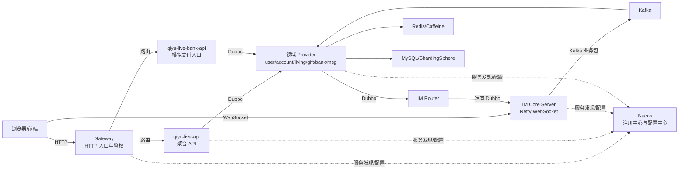
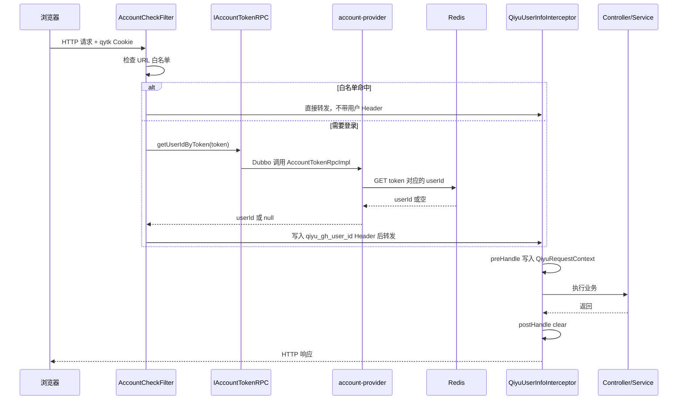

## 当天目标与时间安排

| 时间 | 任务 | 必须产出 |
| --- | --- | --- |
| 0～2 小时 | 架构、模块、四种通信方式 | 手画架构图 |
| 2～5 小时 | 用户、登录、Gateway 鉴权、缓存和分片 | 手写完整鉴权链路 |
| 5～7 小时 | Nacos、Dubbo、Gateway、ThreadLocal、缓存八股 | 两段 2 分钟口述 |
| 最后 30 分钟 | 闭卷追问 | 源码问题清单 |

## 核心结论

旗鱼直播是教学型微服务直播后端。浏览器的普通请求先进入 Gateway，再到聚合 API，由 API 通过 Dubbo 编排领域 provider；聊天和业务推送走独立的 Netty WebSocket IM 链路；Kafka 承担异步解耦和削峰；Redis 同时承担缓存、登录状态、在线路由、余额和库存等不同职责；MySQL 保存核心业务数据。

不要把它描述成完整流媒体服务器。当前源码重点是直播业务和 IM 消息，视频推拉流主要是教程中的补充思路。

## 项目整体架构图



## 模块分层

| 层次 | 模块 | 作用 |
| --- | --- | --- |
| 接入层 | `qiyu-live-gateway` | HTTP 路由、白名单、Cookie token 校验、用户 Header 透传 |
| 接入层 | `qiyu-live-api`、`qiyu-live-bank-api` | Controller、登录上下文、多个 RPC 的业务编排 |
| RPC 契约层 | 各 `*-interface` | 暴露 DTO、常量和 RPC 接口，隔离 provider 实现 |
| 领域服务层 | user、account、living、gift、bank、msg provider | 领域逻辑、缓存、数据库和 Kafka 消费 |
| IM 层 | im-core-server、im-router、im-provider | 长连接、协议 Handler、精确路由、IM token |
| 公共基础层 | common、framework starters | 通用响应、Redis key、数据源、Web 拦截器和请求上下文 |

先记一句：`interface` 定义远程契约，`provider` 实现领域能力，`api` 面向前端做编排。

## 第一天源码阅读顺序

1. [聚合 pom.xml](../../后端代码/qiyu-live-app/pom.xml)：确认 23 个模块、Java 17、Spring Boot 3.0.4、Dubbo 3.2.0-beta.3。
2. [Gateway bootstrap.yml](../../后端代码/qiyu-live-app/qiyu-live-gateway/src/main/resources/bootstrap.yml)：确认端口 8088、Nacos 注册和配置导入。
3. [AccountCheckFilter.java](../../后端代码/qiyu-live-app/qiyu-live-gateway/src/main/java/org/qiyu/live/gateway/filter/AccountCheckFilter.java)：HTTP 鉴权入口。
4. [IAccountTokenRPC.java](../../后端代码/qiyu-live-app/qiyu-live-account-interface/src/main/java/org/qiyu/live/account/interfaces/IAccountTokenRPC.java) → [AccountTokenRpcImpl.java](../../后端代码/qiyu-live-app/qiyu-live-account-provider/src/main/java/org/qiyu/live/account/provider/rpc/AccountTokenRpcImpl.java) → [AccountTokenServiceImpl.java](../../后端代码/qiyu-live-app/qiyu-live-account-provider/src/main/java/org/qiyu/live/account/provider/service/impl/AccountTokenServiceImpl.java)。
5. [QiyuUserInfoInterceptor.java](../../后端代码/qiyu-live-app/qiyu-live-framework/qiyu-live-framework-web-starter/src/main/java/org/qiyu/live/web/starter/context/QiyuUserInfoInterceptor.java) → [QiyuRequestContext.java](../../后端代码/qiyu-live-app/qiyu-live-framework/qiyu-live-framework-web-starter/src/main/java/org/qiyu/live/web/starter/context/QiyuRequestContext.java)。
6. [UserServiceImpl.java](../../后端代码/qiyu-live-app/qiyu-live-user-provider/src/main/java/org/qiyu/live/user/provider/service/impl/UserServiceImpl.java) 和 [UserPhoneServiceImpl.java](../../后端代码/qiyu-live-app/qiyu-live-user-provider/src/main/java/org/qiyu/live/user/provider/service/impl/UserPhoneServiceImpl.java)。
7. [UserDelayDeleteConsumer.java](../../后端代码/qiyu-live-app/qiyu-live-user-provider/src/main/java/org/qiyu/live/user/provider/kafka/UserDelayDeleteConsumer.java)。

教程只补读：

- 第一份教程的 `2.5 Dubbo技术介绍`。
- `3.3 Sharding-JDBC`、`3.9 将Nacos作为配置中心`、`3.11 引入Gateway网关`。
- Redis 单用户缓存、批量缓存和延迟双删相关小节。

## 登录鉴权真实链路



### 当前源码逐步解释

1. 登录成功时，`AccountTokenServiceImpl#createAndSaveLoginToken` 生成 UUID，把 `token -> userId` 写入 Redis，TTL 为 30 天。
2. 浏览器后续用名为 `qytk` 的 Cookie 携带 token。
3. `AccountCheckFilter` 是 `GlobalFilter`。路径以 Nacos 配置的白名单前缀开头时直接放行，否则取 Cookie。
4. Gateway 通过 `IAccountTokenRPC#getUserIdByToken` 同步调用 account-provider，后者从 Redis 查用户 ID。
5. 校验成功后，Gateway 写入内部 Header `qiyu_gh_user_id`。
6. Servlet 业务服务中的 `QiyuUserInfoInterceptor#preHandle` 读取 Header，写入 `QiyuRequestContext`。
7. Controller 或 Service 用 `QiyuRequestContext#getUserId` 获取当前登录用户。
8. `postHandle` 调用 `clear()`，移除 ThreadLocal 数据。

边界：白名单请求没有用户 Header，因此请求上下文中的用户 ID 可能是 `null`。业务代码不能假设所有请求都有登录用户。

## Nacos 的基本使用

### 核心概念

Nacos 在微服务中主要承担两个角色：

- 注册中心：provider 启动后注册实例；consumer 查询健康实例，用于服务发现和负载均衡。
- 配置中心：把数据库、Redis、Kafka、Dubbo、Gateway 白名单等配置放在服务外部，支持按 Data ID、Group、Namespace 隔离。

### 当前项目示例

Gateway 的 `bootstrap.yml` 同时配置：

```yaml
spring:
  application:
    name: qiyu-live-gateway
  cloud:
    nacos:
      discovery:
        server-addr: localhost:8848
      config:
        server-addr: localhost:8848
  config:
    import:
      - optional:nacos:${spring.application.name}.yml
```

因此它会导入 `qiyu-live-gateway.yml`。`GatewayApplicationProperties` 使用 `@ConfigurationProperties(prefix = "qiyu.gateway")` 接收白名单，并通过 `@RefreshScope`支持刷新。

多数服务采用同样模式，但仓库没有保存完整的 Nacos 配置，不能猜测所有服务端口、数据源和路由内容。

### 服务发现、远程调用和负载均衡

通用过程是：

```text
provider 启动 -> 向 Nacos 注册服务名、IP、端口和健康状态
consumer 启动/调用 -> 获取可用实例列表
负载均衡器 -> 按策略选择一个实例
HTTP 客户端或 Dubbo -> 向选中的实例发起远程调用
```

Nacos负责“有哪些实例”，不负责执行 Java 方法。实际远程调用由 Dubbo、OpenFeign 或基于 Spring Cloud LoadBalancer 的 HTTP 客户端完成；负载均衡也由调用框架侧完成。

本项目主要用 Dubbo 完成 provider 远程调用。Gateway 到 account-provider 的 token 校验就是例子。IM Router 是特殊情况：它不能随机负载均衡，而要定向选择持有目标 Channel 的 IM 实例，第二天会学习自定义 Cluster。

### 面试边界

- 配置刷新不等于所有 Bean 都能安全热更新；连接池、线程池、端口等配置通常要判断组件是否支持刷新。
- Namespace 常用于环境隔离，Group/Data ID 用于业务和配置维度划分。
- 注册中心短暂不可用时，已有消费者是否还能调用取决于客户端缓存、框架容错和实例状态，不能只回答“肯定不可用”。

## Dubbo 的基本使用

### 当前项目写法

契约模块：

```java
public interface IAccountTokenRPC {
    Long getUserIdByToken(String tokenKey);
}
```

provider：

```java
@DubboService
public class AccountTokenRpcImpl implements IAccountTokenRPC {
    // 委托领域 Service
}
```

consumer：

```java
@DubboReference
private IAccountTokenRPC accountTokenRPC;
```

调用 `accountTokenRPC.getUserIdByToken(token)` 时，consumer 持有的是代理对象。代理完成服务发现、序列化、网络发送、provider 方法调用和结果反序列化。

### 必会配置和风险

- `timeout`：限制一次调用等待时间，防止线程长期占用。
- `retries`：失败重试可能扩大流量；非幂等写操作不能盲目重试。
- `loadbalance`：随机、轮询、最少活跃等策略适用于普通无状态 provider。
- `check`：启动时是否检查 provider 可用。
- `version/group`：同一接口的版本或业务隔离。

Gateway 使用 Reactor 非阻塞模型，但这里直接进行同步 Dubbo 调用。高并发下慢 RPC 会占用 Gateway 执行资源，需要明确超时、隔离和降级；也可考虑异步 RPC 或将认证能力设计成可本地校验的签名 token，但会带来注销和权限变更即时生效问题。

## Gateway 的基本使用

Gateway 的三个核心概念：

- Route：请求要转发到哪个目标服务。
- Predicate：什么请求匹配这条路由，例如 Path、Method、Header。
- Filter：匹配前后做什么，例如鉴权、加 Header、限流、改写路径。

`AccountCheckFilter` 是全局过滤器，对所有路由生效；`getOrder()` 返回 0 控制顺序。项目的动态路由配置主要外置到 Nacos，仓库内不能完整验证每一条 Route。

生产鉴权一般还要完成：标准 401/403 响应、CORS 统一配置、伪造内部 Header 防护、超时/熔断、日志脱敏和监控。

## 用户缓存、穿透和分片

### 单用户查询

`UserServiceImpl#getUserById` 使用 Cache Aside：

```text
先查 Redis -> 命中直接返回 -> 未命中查 MySQL -> 非空写 Redis 30 分钟
```

注意：这个方法没有缓存空对象。因此不能笼统说“所有用户查询都防了缓存穿透”。

### 手机号空值缓存

`UserPhoneServiceImpl#queryByPhone` 在数据库也查不到时，写入一个空 `UserPhoneDTO`，TTL 1 分钟；再次命中时通过 `userId == null` 判断空值。这是项目中明确的缓存穿透例子。注册成功后会删除该空值缓存。

### 批量查询和随机过期

`batchQueryUserInfo`：

1. Redis `multiGet` 批量查。
2. 找出未命中的 userId。
3. 按 `userId % 100` 分组后分别查 MySQL，减少 ShardingSphere 对多个分片组合路由的开销。
4. Redis `multiSet` 批量回填。
5. Pipeline 为每个 key 设置 `30 分钟 + 0～999 秒` 的随机 TTL，降低同一时刻大批 key 过期造成雪崩的概率。

### 更新与延迟双删

`updateUserInfo` 的顺序是：

```text
更新 MySQL -> 删除 Redis -> Kafka user-delete-cache
-> UserDelayDeleteConsumer -> 本地 DelayQueue 等 1 秒 -> 再删 Redis
```

第二次删除用于处理“并发读在数据库更新前读到旧值，却在第一次删除后把旧值写回缓存”的窗口。

它的局限：

- Kafka 消息发送失败时没有可靠补偿。
- consumer 把任务转入进程内 `DelayQueue` 后，重启恢复依赖 Kafka 提交行为和任务是否已确认，源码没有形成完整可靠延迟任务方案。
- 固定 1 秒不保证覆盖所有慢查询。
- 它降低不一致概率，不提供严格一致性。

## ThreadLocal 必会点

`QiyuRequestContext` 实际使用自定义 `InheritableThreadLocal<Map<Object,Object>>`，让创建出的子线程继承父线程上下文副本。

风险：

- Tomcat 工作线程会复用，不清理会把上一个请求的用户信息带到下一个请求并长期持有对象。
- 当前只在 `postHandle` 清理。Controller 抛异常时，`postHandle` 不一定执行；更稳妥的位置是 `afterCompletion` 或统一 `finally`。
- 线程池线程通常早已创建，不会像 `new Thread` 那样可靠继承当前请求值。
- 在线程池中传播登录上下文应显式传参，或使用受控的上下文包装方案，并确保任务结束清理。

## 当前源码问题与生产改进

| 当前源码 | 触发条件与影响 | 生产改进 |
| --- | --- | --- |
| 鉴权失败多处返回 `Mono.empty()` | 客户端得不到规范状态码和错误体 | 返回 401/403、统一 JSON、记录指标 |
| Gateway 同步调用 Dubbo 校验 token | account-provider/Redis 变慢会拖慢入口 | 短超时、隔离、熔断、缓存或可本地校验 token |
| 白名单用 `startsWith` | 前缀边界不严可能误放行 | 使用规范路径匹配并做配置校验 |
| 内部用户 Header 缺少可信边界说明 | 若业务服务可被外网直连，Header 可伪造 | 网络隔离、入口清洗同名 Header、服务间认证 |
| ThreadLocal 只在 `postHandle` 清理 | 异常请求可能残留登录上下文 | 在 `afterCompletion`/`finally` 清理 |
| `RequestLimitInterceptor` 第一行直接 `return true` | `@RequestLimit` 当前完全不生效 | 恢复实现，并用 Lua/网关限流保证计数原子性 |
| `getUserById` 不缓存空对象 | 恶意查询不存在 ID 可能持续打 DB | 合理空值缓存、布隆过滤器、参数校验 |
| 延迟双删依赖 Kafka + 本地 `DelayQueue` | 发送失败、重启和固定延迟造成不一致窗口 | Outbox/Canal、可重试延迟消息、版本号或对账 |
| 运行配置大量只在 Nacos | 本地无法直接完整启动和审计 | 提供脱敏配置模板、环境清单和启动检查 |

## 2 分钟“项目整体架构”口述

我学习的旗鱼直播是一个基于 Spring Boot 3 和 Spring Cloud Alibaba 的教学型微服务项目，使用 Java 17。普通 HTTP 请求先进入 Spring Cloud Gateway，网关负责路由和登录鉴权，然后转发到聚合 API。API 层主要处理前端参数、登录上下文和服务编排，具体领域能力由 user、account、living、gift、bank 等 provider 提供，跨服务同步调用使用 Dubbo，接口统一放在各自的 interface 模块中。

即时通信链路与普通 HTTP 分开。浏览器通过 WebSocket 连接 Netty IM Core，登录后本机保存用户 Channel，并把用户所连接的 IM 实例地址写入 Redis。聊天业务消息先进入 Kafka，再由消息服务查询直播间在线用户，通过 Router 定向调用正确的 IM 实例，最后写回目标 Channel。

项目中 Kafka 主要负责异步解耦和削峰，Redis 不只做缓存，还保存 token、在线状态、IM 路由、余额、红包和库存，MySQL保存核心业务数据，Nacos负责注册发现和外部配置。这个项目是教学实现，我会区分当前源码和生产方案，例如本地 DelayQueue、短 TTL 幂等和余额异步写库都还需要可靠任务、持久化幂等和对账补偿。

## 2 分钟“登录鉴权链路”口述

用户登录后，account-provider 生成 UUID token，把 token 到 userId 的映射存进 Redis，过期时间是 30 天，并由浏览器通过 `qytk` Cookie 携带。后续请求先经过 Gateway 的 `AccountCheckFilter`。过滤器先判断请求路径是否在白名单中；不在白名单就读取 Cookie，通过 Dubbo 调用 `IAccountTokenRPC#getUserIdByToken`，由 account-provider 查询 Redis。

如果 token 有效，Gateway 不把 token 继续交给业务，而是把 userId 写入内部 Header `qiyu_gh_user_id`。业务服务中的 `QiyuUserInfoInterceptor` 在 `preHandle` 读取 Header，把 userId 写进 `QiyuRequestContext`，Controller 和 Service 就能获得当前用户。请求完成后清理 ThreadLocal。

这条链路的优点是认证集中在网关，业务服务不需要重复解析 token；问题是鉴权失败当前多处只返回 `Mono.empty()`，没有标准 401 响应；同步 Dubbo 校验会受下游延迟影响；内部 Header 还要依赖网络隔离防伪造；ThreadLocal 当前在 `postHandle` 清理，异常路径有残留风险。生产上我会补充标准错误响应、超时熔断、入口 Header 清洗，并把清理放到 `afterCompletion` 或 `finally`。

## 常见追问

### 1. Nacos 和 Dubbo 分别做什么？

Nacos提供服务实例目录和配置；Dubbo根据接口代理完成远程调用、序列化、网络通信、负载均衡和容错。Nacos不直接调用 Java 方法。

### 2. 为什么不让每个业务服务自己校验 Cookie？

集中鉴权能减少重复逻辑并统一策略；代价是 Gateway 和 account-provider 成为关键链路，需要高可用、低延迟和故障隔离。业务服务仍要做授权，认证通过不等于有权执行任何操作。

### 3. Dubbo 写接口为什么不建议默认重试？

写操作可能已经在 provider 成功，只是响应丢失；自动重试会重复扣款或创建订单。只有具备稳定幂等键和去重状态后，才能安全重试。

### 4. 随机 TTL 解决了缓存击穿吗？

主要缓解大量 key 同时过期导致的缓存雪崩。单个热点 key 失效后大量请求并发回源属于击穿，通常要互斥重建、逻辑过期或热点永不过期等方案。

### 5. 延迟双删能保证强一致吗？

不能。它通过第二次删除缩小并发旧值回填的窗口，消息失败、延迟选择和服务重启仍会产生不一致。强一致或更可靠的最终一致需要版本控制、可靠事件、CDC/Canal 和对账修复等机制。

### 6. `InheritableThreadLocal` 为什么在线程池里可能失效？

继承发生在线程创建时，而线程池工作线程通常早已创建；提交任务时不会自动复制当前请求上下文。还可能把旧上下文留在线程池线程中，因此更推荐显式参数传递。

## 当天闭卷验收

不看源码，在纸上完成：

1. 画出 Gateway、API、provider、IM、Kafka、Redis、MySQL、Nacos。
2. 写出 `qytk -> Dubbo -> Redis -> Header -> ThreadLocal`。
3. 解释 `interface -> provider -> api`。
4. 各用一句话区分缓存穿透、击穿、雪崩和不一致。
5. 指出至少 5 个源码问题，并写出触发条件，不能只写“性能不好”。

合格标准：两段口述均在 90～150 秒，且主动说出“当前源码”和“生产改进”的边界。
