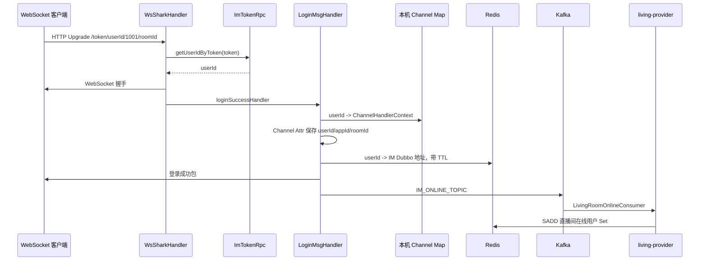
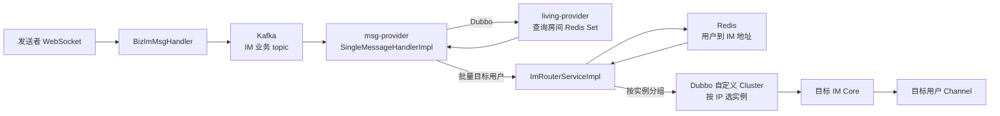

## 当天目标与时间安排

| 时间 | 任务 | 必须产出 |
| --- | --- | --- |
| 0～3 小时 | Netty 启动、WebSocket 握手、协议分发、登录心跳 | IM 登录时序图 |
| 3～6 小时 | Kafka、在线 Set、Router、自定义 Cluster、Channel 推送 | 群聊转发图 |
| 6～7.5 小时 | ACK、消息可靠性、扩容问题、口述 | 两段 2 分钟口述 |

## 核心结论

IM 集群的核心难题不是“如何调用一个 IM 服务”，而是“如何找到持有目标用户 Channel 的那一台 IM 实例”。本项目在 IM 本机用内存保存 `userId -> ChannelHandlerContext`，在 Redis 保存 `userId -> IM 实例地址`；Router 读取地址后，用 Dubbo 上下文和自定义 Cluster 定向调用该实例。

聊天链路通过 Kafka 解耦接收和扇出，但“进入 Kafka”不等于消息绝不丢失，也不等于严格有序。必须继续分析生产确认、消费提交、幂等、分区 key、ACK 和失败补偿。

## 第二天源码阅读顺序

1. [WsNettyImServerStarter.java](../../后端代码/qiyu-live-app/qiyu-live-im-core-server/src/main/java/org/qiyu/live/im/core/server/starter/WsNettyImServerStarter.java)：EventLoopGroup 和 Pipeline。
2. [WsSharkHandler.java](../../后端代码/qiyu-live-app/qiyu-live-im-core-server/src/main/java/org/qiyu/live/im/core/server/handler/ws/WsSharkHandler.java)：HTTP Upgrade、URL token 校验。
3. [WsImServerCoreHandler.java](../../后端代码/qiyu-live-app/qiyu-live-im-core-server/src/main/java/org/qiyu/live/im/core/server/handler/ws/WsImServerCoreHandler.java)：文本帧转 `ImMsg`。
4. [ImHandlerFactoryImpl.java](../../后端代码/qiyu-live-app/qiyu-live-im-core-server/src/main/java/org/qiyu/live/im/core/server/handler/impl/ImHandlerFactoryImpl.java)：按消息 code 分发。
5. [LoginMsgHandler.java](../../后端代码/qiyu-live-app/qiyu-live-im-core-server/src/main/java/org/qiyu/live/im/core/server/handler/impl/LoginMsgHandler.java)、[HeartBeatImMsgHandler.java](../../后端代码/qiyu-live-app/qiyu-live-im-core-server/src/main/java/org/qiyu/live/im/core/server/handler/impl/HeartBeatImMsgHandler.java)、[BizImMsgHandler.java](../../后端代码/qiyu-live-app/qiyu-live-im-core-server/src/main/java/org/qiyu/live/im/core/server/handler/impl/BizImMsgHandler.java)、[AckImMsgHandler.java](../../后端代码/qiyu-live-app/qiyu-live-im-core-server/src/main/java/org/qiyu/live/im/core/server/handler/impl/AckImMsgHandler.java)、[LogoutMsgHandler.java](../../后端代码/qiyu-live-app/qiyu-live-im-core-server/src/main/java/org/qiyu/live/im/core/server/handler/impl/LogoutMsgHandler.java)。
6. [ImBizMsgKafkaConsumer.java](../../后端代码/qiyu-live-app/qiyu-live-msg-provider/src/main/java/org/qiyu/live/msg/provider/kafka/ImBizMsgKafkaConsumer.java) → [SingleMessageHandlerImpl.java](../../后端代码/qiyu-live-app/qiyu-live-msg-provider/src/main/java/org/qiyu/live/msg/provider/kafka/handler/impl/SingleMessageHandlerImpl.java)。
7. [ImRouterServiceImpl.java](../../后端代码/qiyu-live-app/qiyu-live-im-router-provider/src/main/java/org/qiyu/live/im/router/provider/service/impl/ImRouterServiceImpl.java) → [ImRouterClusterInvoker.java](../../后端代码/qiyu-live-app/qiyu-live-im-router-provider/src/main/java/org/qiyu/live/im/router/provider/cluster/ImRouterClusterInvoker.java) → [RouterHandlerServiceImpl.java](../../后端代码/qiyu-live-app/qiyu-live-im-core-server/src/main/java/org/qiyu/live/im/core/server/service/impl/RouterHandlerServiceImpl.java)。
8. [LivingRoomOnlineConsumer.java](../../后端代码/qiyu-live-app/qiyu-live-living-provider/src/main/java/org/qiyu/live/living/provider/kafka/LivingRoomOnlineConsumer.java)、[LivingRoomOfflineConsumer.java](../../后端代码/qiyu-live-app/qiyu-live-living-provider/src/main/java/org/qiyu/live/living/provider/kafka/LivingRoomOfflineConsumer.java) 和 living-provider 的 [LivingRoomServiceImpl.java](../../后端代码/qiyu-live-app/qiyu-live-living-provider/src/main/java/org/qiyu/live/living/provider/service/impl/LivingRoomServiceImpl.java)。
9. [IMsgAckCheckServiceImpl.java](../../后端代码/qiyu-live-app/qiyu-live-im-core-server/src/main/java/org/qiyu/live/im/core/server/service/impl/IMsgAckCheckServiceImpl.java) → [ImAckConsumer.java](../../后端代码/qiyu-live-app/qiyu-live-im-core-server/src/main/java/org/qiyu/live/im/core/server/kafka/ImAckConsumer.java)。

当前有效启动器是 WebSocket 版 `WsNettyImServerStarter`。`NettyImServerStarter.java` 的 TCP 版本整文件已注释，不得表述成同时运行 TCP 和 WebSocket 两套服务。

## Netty 启动与线程模型

`WsNettyImServerStarter` 创建两个 `NioEventLoopGroup`：

- BossGroup：接收新连接。
- WorkerGroup：处理已建立连接的读写事件。

每个新 Channel 的 Pipeline 顺序是：

```text
HttpServerCodec
-> ChunkedWriteHandler
-> HttpObjectAggregator(8192)
-> WebsocketEncoder
-> WsSharkHandler
-> WsImServerCoreHandler
```

通俗理解：Pipeline 是这条连接上的处理器流水线；入站数据按顺序解码、聚合、握手或分发，出站数据经过编码后写回网络。

启动还要求：

- `qiyu.im.ws.port`：WebSocket 监听端口。
- `DUBBO_IP_TO_REGISTRY` 和 `DUBBO_PORT_TO_REGISTRY`：拼出 Router 应定向调用的 Dubbo 实例地址。

这两个 Dubbo 参数不是 WebSocket 监听地址本身，而是该 IM 进程作为 Dubbo provider 注册和暴露的地址。

## HTTP 升级 WebSocket

WebSocket 开始时仍是 HTTP 请求。客户端请求带 `Upgrade: websocket` 等 Header，服务端返回 101 后，同一条 TCP 连接进入 WebSocket 帧通信。

项目中 `WsSharkHandler`：

1. 接收 `FullHttpRequest`。
2. 从 URL `/token/userId/code/param` 解析 token、userId、业务 code 和可选 roomId。
3. 通过 `ImTokenRpc` 校验 token 对应的 userId。
4. 使用 `WebSocketServerHandshakerFactory` 完成握手。
5. 握手成功后直接调用 `LoginMsgHandler#loginSuccessHandler`。

因此 WebSocket 入口已有一次 token 校验，并不是先建立匿名长连接后再完全依赖登录包。

## IM 登录时序图



### 登录后的三份状态

| 状态 | 保存位置 | 用途 |
| --- | --- | --- |
| `userId -> ChannelHandlerContext` | 当前 IM 实例内存 | 最终向客户端写消息 |
| `userId/appId/roomId` | Netty Channel Attribute | 心跳、登出和业务包识别当前连接 |
| `appId + userId -> IM Dubbo IP:port%userId` | Redis，带 TTL | Router 找到正确 IM 实例 |

为什么 Redis 里也要保存绑定？因为 Router 是独立服务，它看不到其他 JVM 的内存 Map；IM 集群扩容后，随机调用某台实例很可能找不到目标 Channel。

## 消息 code 如何分发

`WsImServerCoreHandler` 只接受文本 WebSocket Frame，把 JSON 的 `magic/code/len/body` 组装为 `ImMsg`，再交给 `ImHandlerFactoryImpl`。

工厂当前注册：

| code 类型 | Handler | 作用 |
| --- | --- | --- |
| 登录 | `LoginMsgHandler` | token 校验、Channel 绑定、上线通知 |
| 登出 | `LogoutMsgHandler` | 清理绑定、离线通知、关闭 Channel |
| 业务 | `BizImMsgHandler` | 把 body 投递到 Kafka |
| 心跳 | `HeartBeatImMsgHandler` | 更新在线时间和绑定 TTL |
| ACK | `AckImMsgHandler` | 删除未确认消息记录 |

Handler 工厂避免在核心 Handler 中堆积大量 `if/else`，新增协议类型时可增加 Handler 并注册映射。

## 心跳与在线状态

`HeartBeatImMsgHandler` 做两类续期：

1. Redis ZSet 中以当前时间为 score 记录用户最近心跳，并清理超时 score。
2. 延长 `appId + userId -> IM 地址` 绑定 key 的 TTL。

心跳解决“连接异常断开时服务端不能立刻知道”的问题。TCP KeepAlive 的检测周期和业务语义通常不够，因此应用层仍需要心跳。

注意：心跳只能说明最近收到过包，不能单独保证业务消息已到客户端；消息到达需要 ACK 或其他投递状态机制。

## 直播间群聊完整链路



### 逐步解释

1. `BizImMsgHandler` 校验 Channel 上已有 userId/appId，然后把 body 发到 Kafka。
2. `ImBizMsgKafkaConsumer` 反序列化为 `ImMsgBody`，交给 `SingleMessageHandlerImpl`。
3. 直播间聊天分支从消息 data 取 roomId，通过 `ILivingRoomRpc` 查询在线用户，并排除发送者。
4. living-provider 从 Redis Set 使用 `SSCAN` 分批迭代用户 ID。
5. msg-provider 为每个接收者构造一个目标 `ImMsgBody`，调用 Router 批量发送。
6. Router `multiGet` 用户绑定地址，按 IM IP:port 分组，减少 RPC 次数。
7. Router 把目标 IP 放入 `RpcContext`；`ImRouterClusterInvoker` 从 Dubbo provider 列表中精确匹配实例。
8. 目标 IM 实例的 `RouterHandlerServiceImpl` 从本机 Map 找 Channel，写入消息。

## Router 为什么不能普通负载均衡

普通无状态服务的任意实例都能处理请求，因此可随机或轮询。IM 的 Channel 是有状态连接，只存在于建立连接的 JVM 中：

```text
用户 10001 -> IM-A
用户 10002 -> IM-B
```

要给 10001 发消息却负载到 IM-B，IM-B 的本机 Map 中没有该 Channel，消息就无法推送。因此 Router 必须先查绑定再定向。

项目使用 Dubbo SPI 文件把 `imRouter` 映射到自定义 `ImRouterCluster`。Cluster 从 `RpcContext` 读取 IP，在 provider 列表中匹配 `host:port` 并直接调用。

## 直播间在线用户 Set

登录成功后，`LoginMsgHandler` 发送上线 Kafka 消息；living-provider 消费后 `SADD` 用户。断开时 `LogoutMsgHandler` 发送离线消息；living-provider `SREM` 用户。

Redis Set 的优点：

- 用户 ID 天然去重。
- 添加、删除和成员判断通常是 O(1)。
- 适合表示“房间有哪些在线用户”。

源码用 `SSCAN count 100` 迭代，避免一次 `SMEMBERS` 把超大集合全部返回造成单次阻塞。但 `SCAN`：

- `count` 是提示，不保证每次恰好返回 100 个。
- 遍历期间集合变化可能带来弱一致视图和重复元素。
- 最终仍把全部用户放入 JVM List；超大直播间仍有内存和扇出压力。

生产上可按 IM 实例维护房间订阅关系，让一条房间消息先发送到相关 IM 实例，再由各实例本地广播，避免为每个用户构造一条 Router 消息。

## ACK 当前链路

```text
RouterHandlerServiceImpl
-> 生成 msgId
-> 写客户端
-> Redis Hash 记录 msgId 和重试次数
-> Kafka ACK topic
-> ImAckConsumer 放入本地 DelayQueue，延迟 4 秒
-> 未收到客户端 ACK 时重发一次
-> 收到 ACK 后 AckImMsgHandler 删除 Redis Hash 字段
```

这里要精确表述：

- ACK 状态本身在 Redis，不完全在本地内存。
- 延迟调度在进程内 `DelayQueue`。
- `ImAckConsumer` 把 Kafka 的 `Acknowledgment` 带进延迟任务，4 秒后才提交；重启是否恢复取决于 listener ack 配置、offset 是否提交和 Kafka 重投。
- 因此不能简单说“重启一定丢”或“Kafka 一定恢复”。正确说法是：本地延迟任务没有独立持久化，可靠恢复依赖 Kafka 提交配置，且离线程提交 acknowledgment、rebalance 和重复调度需要专门验证。

ACK 只证明客户端收到了某个服务端消息，不自动保证客户端已经展示或业务处理成功。若需要业务确认，要设计另一层状态。

## 当前源码问题与生产改进

| 当前源码 | 触发条件与影响 | 生产改进 |
| --- | --- | --- |
| `ChannelHandlerContextCache` 使用静态 `HashMap` | 多 EventLoop 并发读写可能不安全 | `ConcurrentHashMap`，连接生命周期原子管理 |
| 同一 userId 新连接直接覆盖旧 Channel | 多端登录或重连时旧连接和新连接状态冲突 | 连接 ID/设备维度、踢旧策略、CAS 绑定 |
| `WsSharkHandler` 标记 `@Sharable`，却把 handshaker 放实例字段 | 多连接并发握手/关闭可能互相覆盖 | handshaker 使用局部变量或 Channel Attribute |
| URL 参数直接按固定下标解析 | 缺段、非法数字会抛异常 | 长度、格式、上限校验和统一关闭码 |
| Router `batchSendMsg` 对 `multiGet` 结果直接调用 `substring` | 用户离线、绑定过期返回 null 时 NPE | 过滤 null，记录离线/失败目标 |
| 自定义 Cluster 找不到 IP 直接抛异常 | 实例下线或注册地址变化导致整组失败 | 绑定版本、连接迁移、失败重查和受控降级 |
| 在线/离线事件可能乱序或重复 | 断线重连时旧离线事件可能删除新在线状态 | 连接 ID + 登录时间/version，Lua 条件更新 |
| 群聊把全量用户加载到 JVM 并逐用户建消息 | 超大房间产生内存和网络放大 | 按 IM 实例维护房间订阅、分层扇出 |
| Kafka 业务消息未展示稳定业务 msgId 和消费幂等 | 重投可能重复推送 | 入口生成 msgId、消费去重、客户端去重 |
| ACK 本地 DelayQueue 的恢复边界未验证 | 重启、rebalance、异步提交可能造成重复或漏重试 | 可靠延迟消息/持久化任务，规范提交线程与状态机 |
| 无离线消息存储 | 用户不在线时 Router 返回失败，消息不可补拉 | 会话/消息表、游标、按需离线拉取 |

## 2 分钟“为什么使用 Netty”口述

直播聊天需要服务端主动向大量客户端推送消息，因此普通的一问一答 HTTP 不够合适，项目使用 WebSocket 保持双向长连接，并用 Netty 实现 IM Core。Netty 基于 NIO 和 Reactor 模型，BossGroup 负责接收连接，WorkerGroup 负责已连接 Channel 的读写，一个 EventLoop 可以管理多个连接，避免传统阻塞 IO 为每个连接长期占用一个线程。

项目启动时为每个 Channel 配置 HTTP 编解码、聚合、WebSocket 编码、握手和核心业务 Handler。首次请求通过 HTTP Upgrade 升级为 WebSocket，校验 IM token 后把 userId、appId 和 roomId 绑定到 Channel。后续文本帧被解析为统一的 `ImMsg`，再按 code 分发到登录、心跳、业务、ACK 和登出 Handler。

Netty解决的是高效连接和事件处理，不自动解决集群路由、消息可靠性和业务线程阻塞。项目还需要 Redis 保存用户所连接的 IM 实例、Kafka 解耦业务消息、Router 定向调用正确机器。生产上还要避免在 EventLoop 执行阻塞 RPC，使用线程安全的 Channel Map，并处理重连、多端登录、离线消息和优雅迁移。

## 2 分钟“IM 集群如何发到正确机器”口述

每个 WebSocket Channel 只存在于建立连接的 IM 进程内，所以 IM 集群不能像普通无状态服务一样随机负载均衡。用户登录成功后，当前 IM 实例先在本机保存 `userId -> ChannelHandlerContext`，同时把 `appId + userId -> 当前 IM 的 Dubbo IP 和端口` 写入 Redis，并通过心跳续期。

业务服务要推送消息时调用 IM Router。Router 根据目标 userId 批量查询 Redis 绑定地址，按 IM 实例分组，把目标 IP 写入 Dubbo `RpcContext`。项目自定义了 Dubbo Cluster，它从所有 IM provider 中精确匹配这个 IP，而不是随机选择。请求到达目标 IM 后，再从本机 Channel Map 找到用户连接并写回。

群聊在当前实现中先由 living-provider 查询直播间 Redis Set，再为每个在线用户构造消息，Router 按 IM 实例分组转发。这个方案能讲清基本路由，但大房间会有全量用户加载和消息放大。生产上可让每台 IM 维护房间订阅，只向相关 IM 实例发送一份房间消息，再在实例内本地广播，同时用连接 ID 和版本解决重连时旧离线事件覆盖新连接的问题。

## 常见追问

### 1. WebSocket 和 HTTP 长轮询有什么区别？

WebSocket 握手后在一条连接上双向传输帧，服务端可主动推送；长轮询仍是客户端不断发 HTTP 请求，服务端延迟响应，连接和 Header 开销更高。

### 2. 为什么不能把 Channel 放 Redis？

Channel 是 JVM 内的网络对象，不能跨进程序列化后继续使用。Redis 只保存“Channel 在哪台机器”的可共享定位信息，真正写网络仍由那台 IM 进程完成。

### 3. 心跳间隔越短越好吗？

越短发现故障更快，但客户端耗电、网络包和 Redis 写压力更高。要结合业务容忍时间、移动网络情况和服务容量选择，并允许短暂抖动。

### 4. Kafka 如何保证直播间消息有序？

Kafka只保证单分区内有序。应以 roomId 或 conversationId 作为消息 key，使同一会话进入同一分区；消费者并行处理时也要保持该会话串行。全局有序通常代价过高。

### 5. ACK 能做到 exactly-once 吗？

不能。响应丢失会触发重发，客户端可能收到重复消息，因此仍需 msgId 去重。ACK提高可达性，典型目标是至少一次投递加业务去重。

### 6. IM 实例滚动发布怎样迁移连接？

先从注册/接入层摘除实例，停止新连接；通知客户端重连或等待现有连接自然迁移；设置排空时间；Router 对旧绑定失败后重查；关键未确认消息保存在外部存储。

## 当天闭卷验收

1. 画出登录时序图，标明本机 Map、Channel Attr、Redis 和 Kafka 四份状态。
2. 写出 `WebSocket -> Kafka -> msg-provider -> living-provider -> Router -> IM -> Channel`。
3. 解释为什么普通 Dubbo 负载均衡不适合 IM Router。
4. 说出 `SSCAN` 的优势和弱一致边界。
5. 说出至少 5 个生产问题，并为每个问题给出状态放置位置。

合格标准：不把 Channel 说成存入 Redis，不把 ACK 说成 exactly-once，不把本地 DelayQueue 说成可靠延迟队列。
