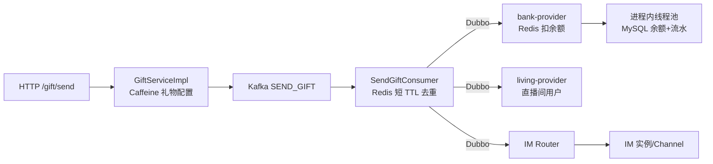
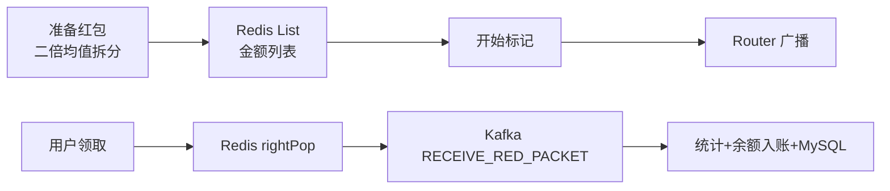
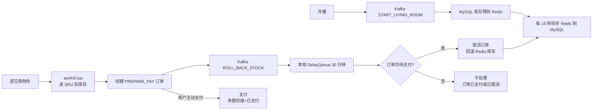
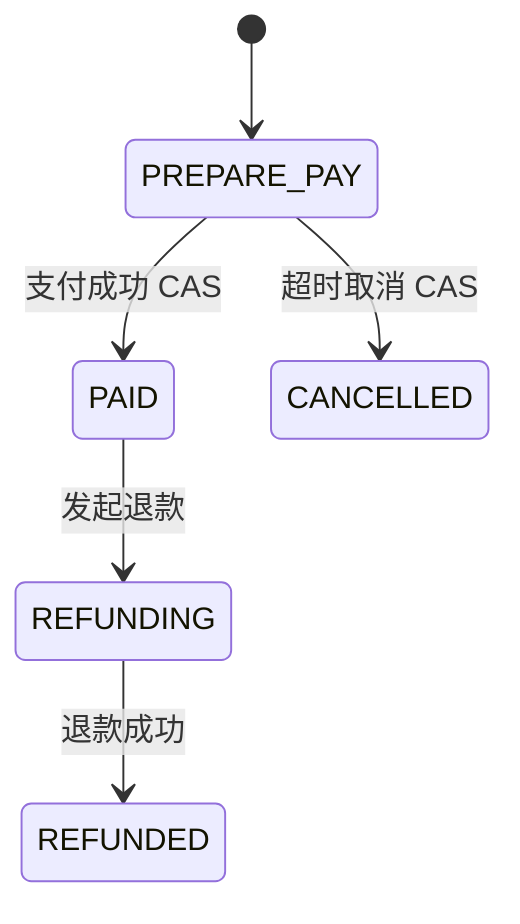

## 当天目标与时间安排

| 时间 | 任务 | 必须产出 |
| --- | --- | --- |
| 0～2.5 小时 | 送礼、Kafka、钱包、支付回调 | 送礼和余额链路 |
| 2.5～5.5 小时 | 红包、PK、Lua、秒杀、订单回滚 | 三条业务链路 |
| 5.5～7.5 小时 | 可靠性改进、六段口述、闭卷自测 | 一致性方案表 |

## 核心结论

第三天要分清三个层次：

1. Redis 原子操作或 Lua 解决一次操作内的并发竞争。
2. 幂等解决请求或消息重复执行。
3. 状态机、可靠事件和补偿解决 Redis、Kafka、MySQL、支付之间的跨系统一致性。

三者不能互相替代。Lua 能防止单个库存 key 被扣成负数，但不能保证“扣库存、建订单、付款、超时回滚”整体原子；Redis 去重 key 能挡住短时间重复消费，但不等于端到端 exactly-once。

## 第三天源码阅读顺序

### 送礼和钱包

1. [GiftController.java](../../后端代码/qiyu-live-app/qiyu-live-api/src/main/java/org/qiyu/live/api/controller/GiftController.java) → [GiftServiceImpl.java](../../后端代码/qiyu-live-app/qiyu-live-api/src/main/java/org/qiyu/live/api/service/impl/GiftServiceImpl.java)。
2. [SendGiftConsumer.java](../../后端代码/qiyu-live-app/qiyu-live-gift-provider/src/main/java/org/qiyu/live/gift/provider/kafka/SendGiftConsumer.java)。
3. [QiyuCurrencyAccountServiceImpl.java](../../后端代码/qiyu-live-app/qiyu-live-bank-provider/src/main/java/org/qiyu/live/bank/provider/service/impl/QiyuCurrencyAccountServiceImpl.java)。
4. [PayOrderServiceImpl.java](../../后端代码/qiyu-live-app/qiyu-live-bank-provider/src/main/java/org/qiyu/live/bank/provider/service/impl/PayOrderServiceImpl.java)。

### 红包和 PK

1. [RedPacketConfigServiceImpl.java](../../后端代码/qiyu-live-app/qiyu-live-gift-provider/src/main/java/org/qiyu/live/gift/provider/service/impl/RedPacketConfigServiceImpl.java)。
2. [ReceiveRedPacketConsumer.java](../../后端代码/qiyu-live-app/qiyu-live-gift-provider/src/main/java/org/qiyu/live/gift/provider/kafka/ReceiveRedPacketConsumer.java)。
3. [getPkNumAndSeqId.lua](../../后端代码/qiyu-live-app/qiyu-live-gift-provider/src/main/resources/getPkNumAndSeqId.lua) 和 `SendGiftConsumer#pkImMsgSend`。

### 秒杀和订单

1. 开播预热：[LivingRoomServiceImpl.java](../../后端代码/qiyu-live-app/qiyu-live-living-provider/src/main/java/org/qiyu/live/living/provider/service/impl/LivingRoomServiceImpl.java) → [StartLivingRoomConsumer.java](../../后端代码/qiyu-live-app/qiyu-live-gift-provider/src/main/java/org/qiyu/live/gift/provider/kafka/StartLivingRoomConsumer.java) → [SkuStockInfoRpcImpl.java](../../后端代码/qiyu-live-app/qiyu-live-gift-provider/src/main/java/org/qiyu/live/gift/provider/rpc/SkuStockInfoRpcImpl.java)。
2. 扣库存：[SkuStockInfoServiceImpl.java](../../后端代码/qiyu-live-app/qiyu-live-gift-provider/src/main/java/org/qiyu/live/gift/provider/service/impl/SkuStockInfoServiceImpl.java) 和 [secKill.lua](../../后端代码/qiyu-live-app/qiyu-live-gift-provider/src/main/resources/secKill.lua)。
3. 建单和支付：[SkuOrderInfoRpcImpl.java](../../后端代码/qiyu-live-app/qiyu-live-gift-provider/src/main/java/org/qiyu/live/gift/provider/rpc/SkuOrderInfoRpcImpl.java) 和 [SkuOrderInfoServiceImpl.java](../../后端代码/qiyu-live-app/qiyu-live-gift-provider/src/main/java/org/qiyu/live/gift/provider/service/impl/SkuOrderInfoServiceImpl.java)。
4. 超时回滚：[StockRollBackConsumer.java](../../后端代码/qiyu-live-app/qiyu-live-gift-provider/src/main/java/org/qiyu/live/gift/provider/kafka/StockRollBackConsumer.java)。
5. 定时同步：[RefreshStockNumConfig.java](../../后端代码/qiyu-live-app/qiyu-live-gift-provider/src/main/java/org/qiyu/live/gift/provider/config/RefreshStockNumConfig.java)。

## 送礼完整链路



### 当前源码逐步解释

1. `/gift/send` 进入 `GiftServiceImpl#send`。
2. 先从 Caffeine 查 `giftId -> GiftConfigDTO`；未命中时通过 Dubbo 查询 gift-provider。
3. 使用 `QiyuRequestContext#getUserId` 作为真实发送者，组装 `SendGiftMq`，生成随机 UUID。
4. 把消息发送到 `SEND_GIFT` Kafka topic，HTTP 方法立即返回 `true`，并不等待扣款和推送完成。
5. `SendGiftConsumer` 批量消费，按 UUID 建 Redis key，使用 `setIfAbsent` 和 5 分钟 TTL 做短期去重。
6. 通过 Dubbo 调用 bank-provider 的 `consumeForSendGift`。
7. 扣款成功后查询直播间在线用户，通过 Router 广播礼物特效；PK 礼物还会执行 Lua 更新进度。

为什么先写 Kafka：

- HTTP 线程不用同步等待扣款、查询房间用户和批量推送。
- 瞬时送礼流量先进入 Kafka，消费者按能力处理，起到削峰作用。
- gift API 与钱包、IM 推送解耦。

代价是结果变成异步：接口返回成功只代表请求被接受或消息发送已发起，不代表最终送礼成功。客户端需要通过 IM 结果通知或查询状态获得最终结果。

## 送礼消费幂等边界

当前 Redis 去重 key 的能力：

- 同一 UUID 在 5 分钟内重复投递时，大概率只进入一次后续逻辑。
- 操作 `setIfAbsent` 本身是原子的。

它不能解决：

- API 每次重试都生成新 UUID，业务上同一次点击可能变成多个不同消息。
- 5 分钟后相同消息仍可能再次执行。
- 去重 key 在扣款前就写入；若扣款或推送异常后 Kafka 重投，消息会因 key 已存在被跳过，可能形成业务丢失。
- 去重状态只有“存在”，没有 `PROCESSING/SUCCESS/FAILED`。
- Redis 数据丢失或切换时无法作为资金业务唯一凭证。

生产上应由客户端或服务端入口生成稳定 `requestId/orderId`，数据库用唯一索引或幂等表保存处理状态；消费成功后再转为 `SUCCESS`，失败可安全重试。去重记录的保存时间至少覆盖消息最大重试和追溯周期。

## 钱包余额的当前实现

`consumeForSendGift`：

1. 对用户构造 Redis 锁 key，`setIfAbsent`，TTL 2 秒。
2. 获取 Redis 缓存余额；未命中时查 MySQL并回填。
3. 余额足够就 Redis `decrement`。
4. 把 MySQL 条件扣减和流水写入交给进程内线程池异步执行，方法立即返回。

MySQL 层的余额扣减与流水在同一个 Spring 事务方法中，但 Redis 扣减、线程池任务和这个数据库事务不在一个分布式事务里。

### 一致性风险

- Redis 扣成功后进程崩溃，线程池任务未执行，Redis 与 MySQL 永久不一致。
- 线程池队列满会抛拒绝异常，源码没有可靠重试。
- 数据库条件扣减结果未检查，仍可能继续写流水。
- 锁 value 固定为 1，释放时直接删除；锁过期后另一个请求拿到新锁，旧请求可能删除新锁。
- 获取锁失败时递归重试，但没有返回递归结果，且持续竞争可能造成深递归；外层最后仍构造成功响应。
- 5 分钟消息去重过期后，重复消费可能再次扣款。

### 生产改进

较稳妥的资金方案：

```text
稳定交易号
-> MySQL 交易流水唯一索引
-> 条件更新余额 current_balance >= amount
-> 同一数据库事务写余额和流水
-> Outbox 事件
-> 可靠发布 Kafka
-> IM 通知
-> 定时对账与补偿
```

资金账户通常让持久化账本成为最终事实来源，Redis用于读缓存、限流或额度预检查。若必须把 Redis 作为高并发扣减主路径，则要有持久化操作日志、可靠异步落库、重放、对账、冻结/可用余额模型和明确的故障恢复流程。

## 支付回调幂等

`PayOrderServiceImpl#payNotify` 当前先更新订单为已支付，再为虚拟币商品增加余额并发送 Kafka。状态更新没有“仅从待支付变为已支付”的条件，重复回调可能重复增加余额。

生产做法：

```sql
UPDATE pay_order
SET status = 'PAID'
WHERE order_id = ?
  AND status = 'WAIT_PAY';
```

只有影响行数为 1 的线程执行入账；同时以支付平台交易号建立唯一索引，验签并校验订单金额、商户和用户。订单状态变化与 Outbox 事件同事务，消息重复消费仍按订单号幂等。

当前源码还有一个明显边界：查不到支付订单时创建的是币账户，随后再次查询原订单仍可能为 `null`，后续处理存在空指针风险。这应作为源码问题陈述，不能包装成“自动补单”。

## PK 链路

```text
PK 用户上线
-> living-provider 用 setIfAbsent 保存房间的 pkObjId
-> Router 广播 PK 上线
-> PK 送礼进入 SEND_GIFT Kafka
-> 扣余额成功
-> getPkNumAndSeqId.lua 更新进度
-> Router 广播进度和礼物特效
```

Lua 的价值：检查进度、初始化 key、设置过期和 `INCRBY` 在 Redis 单线程执行中不可被其他命令插入，避免 Java 中“先 GET 再 SET”的竞态。

当前边界：

- 脚本先检查旧值是否在范围内，再执行增减，单次可越过 0 或 100。
- `buildLivingPkIsOver` 只在消费时被检查，当前源码未找到设置结束标记的路径。
- `sendGiftSeqNum` 使用当前毫秒时间，不是严格唯一、连续的房间序列号。
- Kafka 生产时按 roomId 设置 key 的代码被注释，同一房间消息不保证进入同一分区，客户端可能看到进度乱序。

生产上应以 roomId 作为 Kafka key，使用 Redis `INCR` 或数据库版本生成房间序列号，Lua 在更新后做上下界裁剪并原子设置结束状态；客户端只接受大于最后序列号的更新。

## 红包雨完整链路



### 当前源码逐步解释

1. `prepareRedPacket` 用一个 3 秒 `setIfAbsent` 锁防重复准备。
2. 二倍均值法生成金额数组，按每 100 个一组写入 Redis List，TTL 1 天。
3. 设置准备完成标记，数据库状态改为已准备。
4. `startRedPacket` 先写“已通知”标记，再查询房间用户并通过 Router 广播。
5. `receiveRedPacket` 使用 `rightPop` 原子取走一份金额。
6. 金额取出后发送 Kafka；consumer 更新 Redis 统计、MySQL 统计并调用 bank-provider 增加余额。

### 原子弹出不等于一人一份

List 的原子 `rightPop` 只能保证同一份金额不会被两个请求同时取走，也能保证总领取次数不超过 List 元素数。它没有记录用户是否领过，同一用户并发请求可以弹出多份。

生产上可用 Lua 一次完成：

```text
检查活动状态
-> HSETNX claimedUsers userId 1
-> 成功才 LPOP/RPOP 金额
-> 写领取结果 Hash/Stream
-> 返回金额
```

领取结果应持久化并以 `activityId + userId` 建唯一键，消费端按领取记录 ID 幂等入账。

### 当前红包风险

| 风险 | 影响 | 改进 |
| --- | --- | --- |
| 没有“一人一份”检查 | 同一用户可多次领取 | Lua + 用户领取集合/Hash + DB 唯一键 |
| 金额先 pop，Kafka 异步发送失败 | 金额已消失但没有入账 | 原子领取记录、Outbox/Redis Stream、补偿回列表 |
| `whenComplete` 异步失败不在外层 `try/catch` 控制流中 | 接口仍可能返回领取成功 | 等待 broker 确认或返回处理中，可靠状态查询 |
| consumer 捕获异常后只记日志 | 默认提交语义下失败消息可能不再重试 | 让异常触发重试，配置 DLT，消费幂等 |
| 开始标记在查询用户和广播前写入 | 用户列表为空/广播失败后无法正常重试 | 状态机：PREPARED -> NOTIFYING -> STARTED |
| Redis、账户和红包 MySQL 统计分步执行 | 部分成功造成金额和统计不一致 | 领取流水、幂等入账、对账补偿 |

## 秒杀和订单完整链路



### 库存预热

开播时 living-provider 发 `START_LIVING_ROOM` Kafka 消息，gift-provider 查询主播关联 SKU，把 MySQL 库存批量写入 Redis，并设置 1 天 TTL。

### Lua 扣库存

`secKill.lua` 对一个库存 key 完成：

```text
key 存在
-> 读取库存
-> 库存 >= 请求数量
-> DECRBY 并返回剩余库存
-> 否则返回 -1
```

Redis执行脚本期间不会插入其他命令，因此同一个 key 不会因为并发“都读到库存 1”而被扣成负数。

当前脚本在 key 不存在时没有显式 `return`，Java 侧直接用返回值比较 `>= 0`，可能因 `null` 触发异常。生产上要明确返回错误码，区分“库存 key 未预热”和“库存不足”。

### 多 SKU 不是一个原子事务

`prepareOrder` 逐个 SKU 调用 Lua：

- 前几个 SKU 成功、后一个失败时，前面的扣减不会自动回滚。
- 失败的 SKU 被从列表移除，代码仍可能为剩余商品甚至空列表创建订单。
- 一张订单内多个 key 的一致扣减需要同一 Redis Slot 下的一段 Lua、库存预占记录，或失败时可靠补偿已扣清单。

### 超时回滚

建单后发 `ROLL_BACK_STOCK` Kafka 消息。`StockRollBackConsumer` 收到后立即把任务放入本机 `DelayQueue`，30 分钟后检查订单仍为待支付才取消并增加 Redis 库存。

这里可以明确说本地 `DelayQueue` 不可靠：

- listener 返回后，默认 Kafka 容器可能提交 offset，但真正任务只在 JVM 内存。
- 服务在 30 分钟内重启，任务会消失，库存不回滚。
- 多实例、rebalance、重复消息会带来归属和重复回滚问题。
- 没有独立可查询的延迟任务状态。

生产可使用支持延迟投递的 MQ，或创建订单时写 `expire_time`，由分布式定时扫描/时间轮处理。无论哪种方式，执行端必须用订单状态 CAS：

```sql
UPDATE sku_order
SET status = 'CANCELLED'
WHERE id = ?
  AND status = 'PREPARE_PAY';
```

只有更新成功者回滚库存。

### 支付和回滚竞争

正确状态机：



支付和取消都以 `WHERE status = PREPARE_PAY` 条件更新，谁先成功谁获得状态迁移权。失败方重新读取状态，不再扣款或回滚。

当前源码是先查状态再执行后续，更新只按主键，没有旧状态条件，因此两个线程可能都读到待支付。`SkuOrderInfoRpcImpl#updateOrderStatus` 还直接调用自身，形成无限递归；真正的 `SkuOrderInfoServiceImpl#updateOrderStatus` 更新后固定返回 `false`。这两个是必须如实指出的当前源码问题。

### Redis 与 MySQL 库存同步

`RefreshStockNumConfig` 每 15 秒抢一个 15 秒 TTL 的 Redis key，然后把 Redis 库存覆盖到 MySQL。

风险：

- 任务超过锁 TTL 时另一个实例可同时执行。
- 锁没有唯一 owner 和安全释放语义，不过当前任务不主动删除，主要依赖过期。
- 同步期间仍有扣减和回滚，逐个读取后覆盖 MySQL 可能得到不同时间点快照。
- Redis 数据丢失时缺少从订单/库存流水重建的依据。

生产上应记录每次库存预占、确认和释放流水，以订单为幂等键；MySQL保存总量/已售/预占状态，Redis作为高并发前置。定时任务负责对账修复，不把定时覆盖当作唯一可靠落库方式。

## 第三天重点源码问题清单

| 模块 | 当前问题 | 可能后果 |
| --- | --- | --- |
| Gift API | HTTP 在 Kafka 异步结果完成前返回 `true` | 客户端误把“已受理”当“已成功” |
| Gift API | 禁止送给自己的校验使用请求中的 `senderUserId`，实际发送者来自上下文 | 客户端参数可导致校验语义不一致 |
| SendGiftConsumer | 去重 key 在业务完成前写入且只有 5 分钟 | 失败重投被跳过，过期后又可重复扣款 |
| Bank | 普通 Redis 锁无 owner，递归重试结果未返回 | 错删锁、深递归、错误成功响应 |
| Bank | Redis 扣款后本地线程池异步写库 | 崩溃或拒绝任务导致余额/流水不一致 |
| Pay | 支付状态更新无旧状态条件 | 重复回调可能重复入账 |
| PK | Kafka roomId key 被注释，时间戳作序列 | 进度消息乱序或同毫秒冲突 |
| Red packet | `rightPop` 不限制用户 | 一人可领多份 |
| Red packet | pop 后 Kafka 失败无补偿 | 金额消失但未入账 |
| Stock Lua | key 不存在无返回值 | Java 侧可能空指针 |
| Order | 多 SKU 逐个扣，没有整单原子或失败补偿 | 部分扣减 |
| Order RPC | `updateOrderStatus` 自调用 | 无限递归、栈溢出 |
| Order Service | 更新状态固定返回 `false`，且无状态 CAS | 调用结果错误、支付回滚竞争 |
| Delay task | Kafka 后转本地 30 分钟 `DelayQueue` | 重启丢任务、库存不回滚 |
| Stock sync | 定时把 Redis 当前值覆盖 MySQL | 缺少可审计库存流水和一致快照 |

## 六段面试口述

### Kafka 如何实现送礼削峰

送礼接口只校验礼物配置、组装带 UUID 的消息并写 Kafka，不同步完成扣余额、查询直播间用户和 IM 广播。高峰流量先进入 Kafka，消费者按自身吞吐批量处理，并可水平扩容，保护钱包和 IM 下游。代价是结果异步，HTTP 返回只能表示已受理，最终成功要通过 IM 通知或状态查询。生产上还要配置 producer `acks`、重试和幂等，监控堆积，并设计消费幂等、死信和补偿。

### 如何保证送礼消费幂等

当前源码用消息 UUID 加 Redis `setIfAbsent` 和 5 分钟 TTL 做短期去重，但这不是完整幂等，因为入口重试会生成新 UUID，失败前已写去重标记，TTL 后还能重复。生产上会生成稳定业务交易号，在数据库建立唯一索引和处理状态，扣款流水也以交易号唯一。消费者先查询或插入 `PROCESSING`，成功后改 `SUCCESS`，失败记录原因并允许安全重试，最终通过对账补偿。

### Redis Lua 如何防止库存超卖

Lua把“检查库存是否足够”和“扣减库存”放进一次 Redis 脚本执行，脚本执行期间不会插入其他命令，所以多个并发请求不会都读到同一个旧库存并分别扣减。它保证的是单个 Redis key 上这段操作的原子性，不保证扣库存、创建订单、支付和回滚的跨系统事务。还要配合稳定订单号、状态机、可靠超时任务和库存流水。

### 红包雨如何高并发领取

当前源码预先用二倍均值法生成金额并写入 Redis List，领取用原子 `rightPop`，同一份金额不会被两个请求拿到，Redis承担高并发分配，后续统计和入账走 Kafka。它只限制红包份数，没有限制一人一份。生产上会用 Lua 同时检查活动、`HSETNX` 用户领取标记和弹出金额，生成持久化领取记录；MQ 重复按领取 ID 幂等，发送失败可从领取记录补发或补偿。

### 为什么本地 DelayQueue 不可靠

DelayQueue 的任务只存在当前 JVM 内存，进程重启就消失；服务多实例和 Kafka rebalance 时还会出现任务归属、重复执行和状态不可查询问题。本项目库存回滚 consumer 收到 Kafka 后就转入本地队列等待 30 分钟，若 offset 已提交而进程重启，任务无法恢复。生产上应使用可靠延迟消息，或把订单过期时间持久化后分布式扫描；执行时通过订单状态 CAS 保证重复任务不会重复回滚。

### 余额最终一致性如何升级

当前源码先扣 Redis，再用本地线程池异步更新 MySQL 余额和流水，崩溃会丢任务。升级时我会以稳定交易号为幂等键，在 MySQL事务内做余额条件更新、写不可重复的交易流水和 Outbox 事件，再可靠发布 Kafka；Redis作为缓存或预检查而不是唯一账本。消费者重复时由交易号唯一索引拦截，并通过定时对账比较账户、流水和消息状态，发现差异后补偿。

## 常见追问

### 1. Kafka 本身会不会重复消息？

可能。producer 重试、consumer 在处理成功但提交 offset 前宕机、rebalance 都会造成重复。业务必须以稳定幂等键去重。

### 2. Kafka 设置 `acks=all` 就绝不丢吗？

不是。它提高 broker 持久化确认强度，还要结合副本、`min.insync.replicas`、producer 重试、幂等生产、消费提交和业务落库处理。

### 3. Redis 单线程为什么 Lua 仍可能拖慢系统？

脚本执行期间其他命令不能插入。复杂循环、访问大量 key 或执行时间过长会阻塞 Redis，所以脚本必须短小，并限制输入规模。

### 4. 库存为什么要有“预占”状态？

下单到支付有时间窗口。预占把库存暂时留给订单；支付成功转已售，超时转释放。这样状态可追踪，也能处理支付和取消竞争。

### 5. 支付回调为什么要验签和验金额？

防止伪造回调或把小额支付用于大额订单。除验签外，还要核对商户号、订单号、支付金额、币种和平台交易号，并幂等更新状态。

## 当天闭卷验收

1. 写出送礼链路，标明 HTTP 返回时业务实际进行到哪一步。
2. 对比“Redis 短 TTL 去重”和“数据库业务幂等状态机”。
3. 解释 Lua 能保证什么、不能保证什么。
4. 写出红包一人一份 Lua 的五个步骤。
5. 画出订单 `PREPARE_PAY -> PAID/CANCELLED` 状态机。
6. 为消息重复、Kafka 发送失败、服务重启、并发支付、Redis 数据丢失各给一个可落地方案。

合格标准：不能回答“用了 Kafka 所以不丢”“用了 Redis 所以不超卖”“加分布式锁就强一致”。
