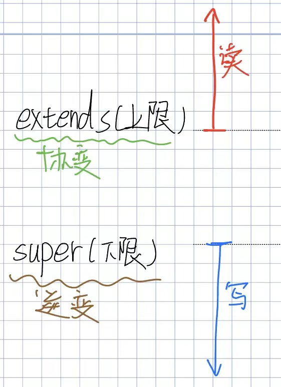
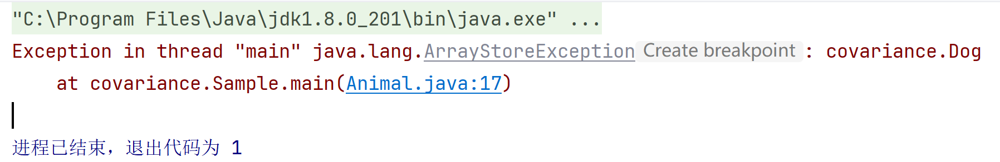
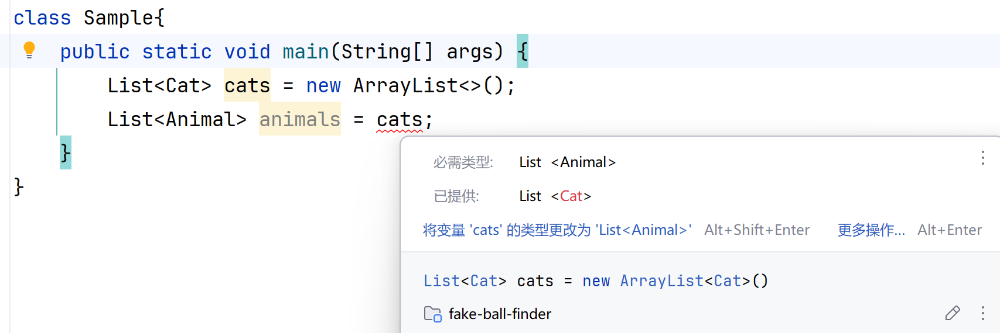
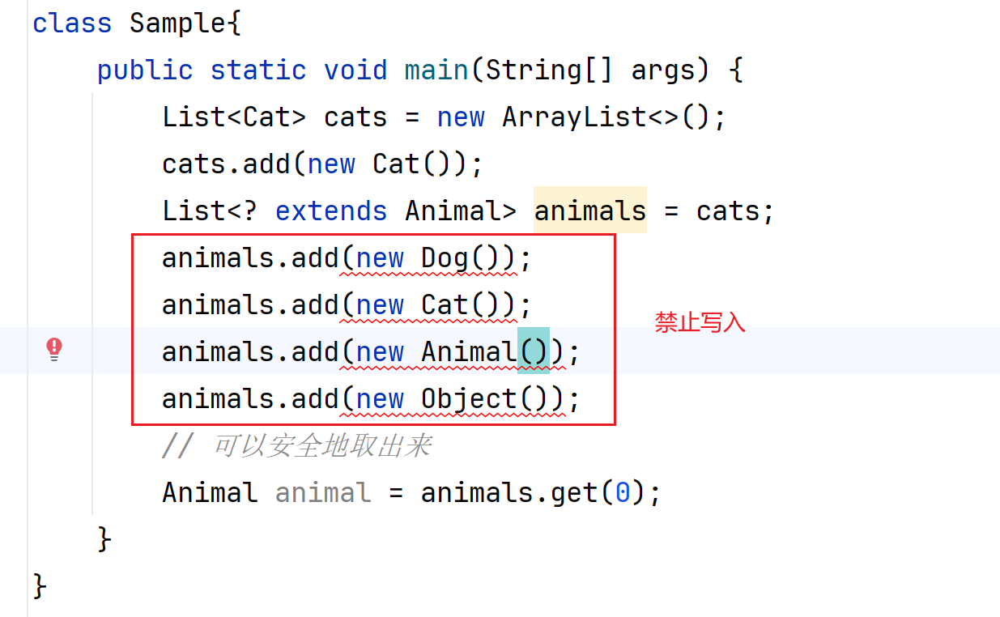
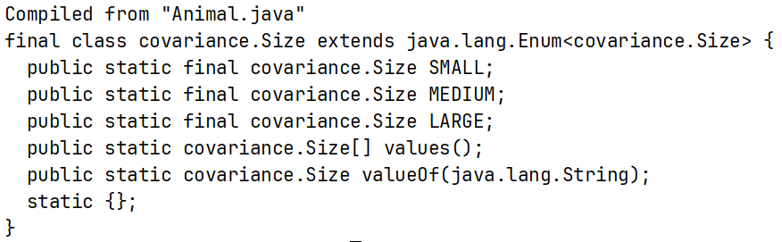

## JVM 中多态的本质

### 方法多态

**Java 代码示例**

Java

```
public class Person {  
    public void methodA() {}  
    public void methodB() {}  
}  

class Boy extends Person {  
    @Override
    public void methodA() {}  
}  

class Party {  
    public void party() {  
        Person bp = new Boy();  
        bp.methodA();  
    }  
}
```

**字节码分析 (`Party.party` 方法)**

```bash
 0 new #2 <Boy>                              # 在堆中为Boy分配空间，将对象引用压入栈顶        操作数栈:[boy_ref（未初始化）]
 3 dup                                       # 复制栈顶引用并压入栈顶（用于后续初始化和存储） 操作数栈:[boy_ref（未初始化）, boy_ref（未初始化）]
 4 invokespecial #3 <Boy.<init> : ()V>       # 弹出栈顶引用，调用其构造器(非多态调用)         操作数栈:[boy_ref（已初始化）]
 7 astore_1                                  # 弹出栈顶引用，存入局部变量表索引为1的位置(bp)  操作数栈:[]
 8 aload_1                                   # 将局部变量表索引1的变量加载并压入操作数栈      操作数栈:[boy_ref（已初始化）]
 9 invokevirtual #4 <Person.methodA : ()V>   # 弹出栈顶对象引用，通过动态分派调用methodA      操作数栈:[]
12 return
```

**这段字节码是如何体现多态的？**

最关键的指令是第 9 行的 `invokevirtual`。

- **静态类型（编译期）**：在编译阶段，编译器只知道局部变量 `bp` 的声明类型是 `Person`。因此，生成的字节码中，常量池引用被写死为 `#4 <Person.methodA : ()V>`。这就是所谓的“编译看左边”。
    
- **实际类型（运行期）与动态分派**：当 JVM 运行到 `invokevirtual` 指令时，它并不会盲目调用 `Person` 的方法，而是根据操作数栈顶弹出的对象引用（Receiver）的实际类型进行方法查找。
    

**通过虚方法表（vtable）的角度深入理解**：

1. **常量池解析（符号引用转直接引用）**： JVM 首次遇到 `#4 <Person.methodA>` 这个符号引用时，会进行解析。它计算出 `methodA` 在 `Person` 类的虚方法表（vtable）中的**偏移量**（例如：槽位索引为 5）。此后，这个指令在运行时会被重写/优化（内联缓存），直接携带这个偏移量 5，避免重复解析。
    
2. **获取接收者对象（Receiver）**： JVM 从操作数栈顶弹出对象引用，该引用在实际运行时指向堆内存中的 `Boy` 实例。
    
3. **顺藤摸瓜找 vtable**： JVM 通过该 `Boy` 对象的对象头（Object Header）中的类型指针（Klass Pointer），找到方法区（Java 8+ 中的元空间 Metaspace）里 `Boy` 类的类元数据，进而获取 `Boy` 类的 vtable。
    
4. **利用偏移量“精准打击”（核心所在）**： **由于子类会完全继承父类的 vtable 布局**，`Boy` 类的 vtable 前半部分与 `Person` 一模一样。因此，`methodA` 在 `Boy` 的 vtable 中**同样处于第 5 个槽位**。JVM 拿着步骤 1 得到的偏移量 5，直接去查 `Boy` 类的 vtable 第 5 项。
    
5. **执行目标方法**：
    
    - 因为 `Boy` 重写了 `methodA`，`Boy` 类的 vtable 第 5 个槽位里存的已经是 `Boy.methodA` 的实际内存地址。
        
    - 如果 `Boy` 没有重写该方法，第 5 个槽位存的依然是 `Person.methodA` 的地址。 最终，JVM 拿到目标地址，直接跳转过去执行，完美实现了多态！

### 接口多态与 `invokeinterface` 指令

在 Java 中，由于单继承和多实现的特性，通过接口调用方法与通过父类调用方法在 JVM 底层的处理方式是不同的。

**Java 代码示例**

Java

```
public interface Animal {
    void speak();
}

class Dog implements Animal {
    @Override
    public void speak() {}
}

class Party {
    public void party() {
        Animal a = new Dog();
        a.speak();
    }
}
```

**字节码核心差异**

如果你查看上述 `party` 方法的字节码，会发现调用 `speak()` 方法时，使用的不再是 `invokevirtual`，而是 **`invokeinterface`** 指令：

```
...
9 invokeinterface #4 <Animal.speak : ()V> count 1  # 调用接口方法
...
```

**为什么需要区分 `invokevirtual` 和 `invokeinterface`？**

核心原因在于 **Java 允许实现多个接口，导致无法使用固定的偏移量**。

- 在类继承（`invokevirtual`）中，`Boy` 只有一个父类 `Person`，所以 `Boy` 可以完美复刻 `Person` 的 `vtable` 布局，方法的偏移量是绝对固定的。
    
- 但是，一个类可以实现多个毫无关系的接口（例如 `Dog` 可以同时实现 `Animal` 和 `Runnable`）。不同的类实现相同接口的顺序可能五花八门，这就导致 **`speak()` 方法在不同实现类的虚方法表中的相对位置（偏移量）是不固定的**。JVM 无法像之前那样“利用固定的偏移量精准打击”。
    

**通过接口方法表（itable）的角度深入理解：**

为了解决这个问题，JVM 引入了 **`itable`（Interface Method Table，接口方法表）**。

1. **查找对象与类元数据**： 当 JVM 执行到 `invokeinterface` 时，同样先从操作数栈顶拿到实际对象（`Dog` 实例），通过对象头找到方法区中的 `Dog` 类元数据。
    
2. **扫描 `itable`（核心性能差异）**： JVM 不再直接使用偏移量，而是去查找 `Dog` 类的 `itable`。`itable` 中包含两部分：
    
    - **Offset 表**：记录了该类实现了哪些接口。JVM 需要在这里**遍历搜索**，确认 `Dog` 确实实现了 `Animal` 接口，并找到 `Animal` 接口方法在该类中的偏移基址。
        
    - **Method 表**：找到接口后，再结合具体方法（`speak`）在接口内部的相对偏移，最终定位到实际的方法内存地址。
        
3. **执行目标方法**： 拿到具体的 `Dog.speak` 方法地址后，跳转执行。

**`itable` 的核心内存布局**

`itable` 实际上由两个数组拼接而成：**接口偏移索引表（Offset Table）** 和 **接口方法表（Method Table）**。

假设你的 `Dog` 类实现了两个接口：`Animal`（包含 `speak()` 方法）和 `Pet`（包含 `play()` 和 `eat()` 方法）。它的 `itable` 结构在内存中大致长这样：


```
+-----------------------------------+
|  vtable (虚方法表)                  | <-- 类继承的方法表，itable 通常紧随其后
+===================================+  <-- itable 开始
|  itableOffsetEntry 1 (对应 Animal) | \
|  itableOffsetEntry 2 (对应 Pet)    |  |-- 1. 接口偏移索引表 (Offset Table)
|  null (结束标记)                   | /
+-----------------------------------+
|  itableMethodEntry (Animal.speak) | \
+-----------------------------------+  |-- 2. 接口方法表 (Method Table)
|  itableMethodEntry (Pet.play)     |  |
|  itableMethodEntry (Pet.eat)      | /
+-----------------------------------+
```

#### 两大组成部分详细解析

##### 1. 接口偏移索引表 (`itableOffsetEntry`)

这个表的作用是**解决类实现了哪些接口，以及该接口的方法存在哪里**的问题。表里的每一个元素（Entry）包含两个关键信息：

- **Interface Klass Pointer**：指向对应接口的类元数据的指针（比如指向 `Animal` 接口的指针）。JVM 用它来进行对比验证。
    
- **Offset**：一个数值，表示这个接口的“实际方法表”距离 `Dog` 对象元数据起始地址的偏移量。
    

**注意**：这个表必须有一个 `null` 结尾，因为 JVM 在扫描时不知道一个类到底实现了多少个接口，它需要通过遇到 `null` 来判断遍历是否结束。

##### 2. 接口方法表 (`itableMethodEntry`)

这个表就是存放**真实方法内存地址**的地方。 它将该类实现的所有接口的方法平铺开来。虽然看起来是连在一起的，但实际上它是按接口分块的。比如上面的一块属于 `Animal`，下面的一块属于 `Pet`。

---

##### 结合结构，重演 `invokeinterface` 的执行过程

当你调用 `Animal a = new Dog(); a.speak();` 时，底层利用这个结构的步骤如下：

1. **获取信息**：JVM 从常量池中知道你要调用的是 `Animal` 接口的 `speak()` 方法，并且 `speak()` 在 `Animal` 接口内部排在第 **0** 位（这是编译期就确定的相对索引）。
    
2. **扫描索引表（线性搜索）**：JVM 拿着对象的引用找到 `Dog` 类的 `itable` 的起点。它开始遍历 `itableOffsetEntry`。
    
    - 第一次对比：取出第一个 Entry，比对 Interface 指针发现正好是 `Animal`。**命中！**（如果没命中，就继续往下找，直到遇到 `null` 抛出 `IncompatibleClassChangeError`）。
        
3. **获取基准偏移量**：既然找到了 `Animal`，JVM 就从这个 Entry 中读出 Offset。
    
4. **精准定位方法**：JVM 根据读取到的 Offset，直接跳到下面 `itableMethodEntry` 中属于 `Animal` 的那块区域的起始位置。然后再结合第一步知道的相对索引（第 **0** 位），拿到里面存储的 `Dog.speak()` 的真实内存地址。
    
5. **执行**：跳转执行实际代码。
    

### 总结对比

- **`vtable` (类多态 / `invokevirtual`)**：基于**固定偏移量**直接访问，时间复杂度接近 O(1)，非常快。
    
- **`itable` (接口多态 / `invokeinterface`)**：需要先**搜索**接口，再定位方法，理论上比 `vtable` 多了一步查找过程，性能略微逊色（但在现代 JVM 的内联缓存机制下，这种性能损耗已经被极大地优化，日常开发中几乎感知不到）。


## Java是值传递还是引用传递？

**定义：**
值传递：实参把自己的值复制一份给形参
引用传递：实参直接将自身的内存地址暴露给形参，形参和实参本质上是**同一个变量的两个别名**。对形参的任何操作（包括重新赋值）都会直接作用于实参。

**例子**
```java
public class Person{  
    private String name;  
    Person(String name){  
        this.name = name;  
    }  
    public static void change(Person person){  
        person = new Person("222");  
    }  
  
    public static void main(String[] args) {  
        Person person = new Person("111");  // 创建一个Person对象，让引用person指向它
        change(person);  // 1. 如果是值传递：复制一个引用person给形参。结果：在方法中形参重新指向另一个对象并不影响实参
					    // 2. 如果是引用传递：将引用person的内存地址传入。结果：形参和实参相同，都重新指向另一个对象
        System.out.println(person.name);  // 111
    }  
}
```
person是一个引用，在值传递中被复制一份给形参。此时形参和实参是不同的两个引用，只是指向的堆中对象是同一个。


## 泛型擦除
[Java泛型类型擦除以及类型擦除带来的问题 - 蜗牛大师 - 博客园](https://www.cnblogs.com/wuqinglong/p/9456193.html)
代码：
```java
public class Person{  
    class Boy<T>{  
        T name;  
        Boy(T name){  
            this.name = name;  
        }  
        public T getName(){  
            return name;  
        }  
    }  
  
    public static void main(String[] args) {  
        Person person = new Person();  
        Boy<String> boy = person.new Boy<>("jack");  
        String name = boy.getName();  
        System.out.println(name);  
    }  
}
```

字节码（**重点注意标黄部分**）：

| **行号** | **字节码指令**                                                                          | **操作数栈状态 [栈底 -> 栈顶]**         | **详细解释**                                                                                                                                    |
| ------ | ---------------------------------------------------------------------------------- | ----------------------------- | ------------------------------------------------------------------------------------------------------------------------------------------- |
| **0**  | `new #2 <Person>`                                                                  | `[未初始化的 Person引用]`            | 在堆内存中开辟 `Person` 对象的空间，并将该空间的引用压入操作数栈顶。此时对象尚未调用构造器。                                                                                         |
| **3**  | `dup`                                                                              | `[Person引用, Person引用]`        | 复制栈顶的 `Person` 引用。为什么？因为下一步调用构造器会消耗掉一个引用，我们需要保留一个副本来赋值给变量。                                                                                  |
| **4**  | `invokespecial #3`<br><br>  <br><br>`<Person.<init>:()V>`                          | `[Person引用]`                  | 调用 `Person` 的无参构造方法 `<init>`。该指令消耗了栈顶的一个引用，此时剩下的引用指向的是一个**已初始化**的 `Person` 对象。                                                              |
| **7**  | `astore_1`                                                                         | `[]` _(空)_                    | 将栈顶的 `Person` 引用存入局部变量表的索引 1 位置。对应 Java 代码：`Person person = ...`。此时局部变量表：`[0:args, 1:person]`。                                              |
| **8**  | `new #4 <Person$Boy>`                                                              | `[未初始化的 Boy引用]`               | 准备创建内部类 `Boy` 对象，分配内存，将引用压栈。                                                                                                                |
| **11** | `dup`                                                                              | `[Boy引用, Boy引用]`              | 复制栈顶的 `Boy` 引用，目的与第 3 行相同。                                                                                                                  |
| **12** | `aload_1`                                                                          | `[Boy引用, Boy引用, person]`      | 将局部变量 1（即 `person`）压入栈顶。**重要**：非静态内部类的实例化必须依赖外部类的实例，所以这里要把 `person` 拿出来准备传给内部类构造器。                                                          |
| **13** | `dup`                                                                              | `[Boy, Boy, person, person]`  | 将 `person` 引用再复制一份压栈。这是为接下来的特殊操作做准备。                                                                                                        |
| **14** | `invokevirtual #5`<br><br>  <br><br>`<Object.getClass:...>`                        | `[Boy, Boy, person, Class对象]` | **编译器魔法**：调用栈顶 `person` 引用的 `getClass()` 方法。如果 `person` 为 `null`，这里会立刻抛出 `NullPointerException`。这是编译器（通常是 JDK 9+）隐式生成的空指针安全检查机制，确保外部类实例不为空。 |
| **17** | `pop`                                                                              | `[Boy, Boy, person]`          | 弹出栈顶的 `Class` 对象。空指针检查完毕，这个 `Class` 对象对后续逻辑没用了。                                                                                             |
| **18** | `ldc #6 <jack>`                                                                    | `[Boy, Boy, person, "jack"]`  | 从常量池中将字符串常量 `"jack"` 加载到栈顶。                                                                                                                 |
| **20** | `invokespecial #7`<br><br>  <br><br>`<Boy.<init>:(LPerson;Ljava/lang/Object;)V>`   | `[Boy引用]`                     | 调用 `Boy` 的构造器。注意它的参数签名！它消耗了栈顶的 3 个元素：未初始化的 `Boy` 引用（目标对象）、`person`（外部类实例的隐藏参数）和 `"jack"`（实际传入的参数）。执行后，剩下的那个 `Boy` 引用被初始化完成。                 |
| **23** | `astore_2`                                                                         | `[]` _(空)_                    | 将初始化好的 `Boy` 引用存入局部变量表索引 2 的位置。对应：`Boy boy = ...`。此时局部变量表：`[0:args, 1:person, 2:boy]`。                                                      |
| **24** | `aload_2`                                                                          | `[boy]`                       | 将局部变量 2 (`boy`) 压入栈顶，准备调用它的方法。                                                                                                              |
| **25** | `invokevirtual #8`<br><br>  <br><br>`<Boy.getName:()Ljava/lang/Object;>`           | `[Object引用 (即 "jack")]`       | ==调用 `getName()` 方法。该指令消耗栈顶的 `boy` 引用，将返回值压栈。**注意返回类型是 Object**，因为泛型 `T` 已经被类型擦除了。==                                                        |
| **28** | `checkcast #9`<br><br>  <br><br>`<java/lang/String>`                               | `[String引用 (即 "jack")]`       | ==**泛型机制的核心体现**：虽然 `getName()` 物理层面返回的是 `Object`，但编译器知道你的泛型是 `String`，所以在这里强制插入了强转指令。如果这里不是 `String` 就会报 `ClassCastException`。==            |
| **31** | `astore_3`                                                                         | `[]` _(空)_                    | 将强转后的 `String` 引用存入局部变量表 3。对应：`String name = ...`。局部变量表：`[0:args, 1:person, 2:boy, 3:name]`。                                                |
| **32** | `getstatic #10`<br><br>  <br><br>`<System.out...>`                                 | `[PrintStream引用]`             | 获取静态变量 `System.out` 并压栈。                                                                                                                    |
| **35** | `aload_3`                                                                          | `[PrintStream引用, name]`       | 将局部变量 3 (`name`) 压栈。                                                                                                                        |
| **36** | `invokevirtual #11`<br><br>  <br><br>`<PrintStream.println:(Ljava/lang/String;)V>` | `[]` _(空)_                    | 调用 `println` 方法。消耗栈顶的 `PrintStream` 实例和要打印的 `name` 字符串。在控制台输出 "jack"。                                                                       |
| **39** | `return`                                                                           | `[]` _(空)_                    | `main` 方法执行完毕，正常返回。                                                                                                                         |

## 协变和逆变

### 个人理解
- 协变：当A<=B时，f(A)<=f(B)    ` ? extends X <= X`，假设 X <= Y，`List<? extends X>` <= `List<Y>`
- 逆变：当A<=B时，f(A)>=f(B)    ` ? super X  >=  X`，假设 X >= Y，`List<? super X>`     >= `List<Y>`


- 类的类型在红色范围中，表示它可以消费（读取）`List<? extends X>`对象的数据
- 类的类型在蓝色范围中，表示它可以生产（写入）`List<? super X>`对象的数据
	- 蓝色范围内的类实际也可以消费（读取）`List<? super X>`对象的数据，但读到的数据一定为Object类型

### 数组是协变的

存在如下class

```java
public class Animal {  
}  
class Cat extends Animal{  
}  
class Dog extends Animal{  
}
```

```java
class Sample{  
    public static void main(String[] args) {  
        Animal[] animals = new Cat[3];  
        animals[0] = new Cat();  
        animals[1] = new Dog();  

    }  
}
```
运行上面的代码，编译能过，运行报错：
**

原因：在Java中，Cat是Animal的子类，则Cat\[] 是 Animal\[]的子类，这样的性质被称为**协变**，==数组是协变的==。

### 泛型的不变性



泛型中 List\<Cat> 不是 List\<Animal> 的子类。编译期直接报错。**泛型不是协变的**。

### 消费场合的协变

```java
List<Cat> cats = new ArrayList<>();  
cats.add(new Cat());  
List<? extends Animal> animals = cats;  
// 可以安全地取出来  
Animal animal = animals.get(0);
```

`List<Cat>` 是 `List<? extends animal>` 的子类。Java通过通配符实现了**泛型的协变**。但在编译器层面通过**禁止写入**的方式（如下图所示），保证了协变的安全性。
为什么协变下不能写入呢？因为**协变下写入是不安全的**，想想文章最开头那个数组的协变的例子。



### 生产场景的逆变
```java
// 下面这行代码编译不通过
// List<? super Animal> animals = new LinkedList<Cat>();
// 下面都是OK的写法
// List<? super Animal> animals = new LinkedList<Object>();
// List<? super Animal> animals = new LinkedList<Animal>();
// 等价于上面一行的写法
List<? super Animal> animals = new LinkedList<>();
animals.add(new Cat());
animals.add(new Dog());
// 取出来一定是Object
Object object = animals.get(0);

// 这样写是OK的
List<? super Cat> cats = new LinkedList<Animal>();

```

逆变可以写入数据。

### Collection源码解读
```java
boolean add(E e); 
boolean addAll(Collection<? extends E> c); 
boolean contains(Object o); 
boolean containsAll(Collection<?> c);
```


## 枚举

```java
enum Size {  
    SMALL, MEDIUM, LARGE  
}
```




## PECS
### 1. Producer Extends (生产者用 extends)

**适用场景：** 当你需要一个集合去**提供数据**（你是读取方，集合是生产者）时，使用 `<? extends T>`。

假设你写了一个方法，用来处理一筐水果：


```Java

// 这里的 List 就是生产者，它向外提供 Fruit 进行处理
public void processFruits(List<? extends Fruit> basket) {
    // 【✅ 允许读取】—— 无论筐里是 Apple 还是 Banana，它肯定是个 Fruit
    Fruit f = basket.get(0); 
    
    // 【❌ 禁止写入】—— 编译器会报错！
    // basket.add(new Apple()); 
    // basket.add(new Fruit()); 
}
```
### 2. Consumer Super (消费者用 super)

**适用场景：** 当你需要一个集合去**接收数据**（你是写入方，集合是消费者）时，使用 `<? super T>`。

假设你写了一个方法，负责往筐里装苹果：


```Java

// 这里的 List 就是消费者，它消费（接收）你递给它的 Apple
public void addApples(List<? super Apple> basket) {
    // 【✅ 允许写入】—— 只要是 Apple 或 Apple 的子类，都可以安全装入
    basket.add(new Apple());
    basket.add(new RedApple()); // 假设有红富士
    
    // 【❌ 读取受限】—— 只能用 Object 接收
    Object obj = basket.get(0); 
    // Apple a = basket.get(0); // 编译报错！
}
```


## java集合
List
- ArrayList：扩容，大小乘1.5。
- LinkedList：略
- CopyonWriteArrayList：写时复制。执行写操作时会在复制的数组中执行写操作，该操作需加锁。缺点：写时复制需要大量空间，且需要频繁垃圾回收；弱一致性，读到的数据可能不是实时的

Map
- HashMap：数组+链表/红黑树。除初始扩容，普通扩容大小乘2 。
- TreeMap：红黑树实现，能按顺序迭代。增删改查时间复杂度都是O(logn)。
- ConcurrentHashMap：线程安全。空桶使用**CAS**插入，非空桶使用synchronized插入。在并发高时，使用数组统计size。使用volatile关键字让读操作能保证实时性。扩容时，若读取数据还未移到新table，直接读取；若读取到ForwardingNode节点，说明数据移到新table，此时去新table读取数据。如果是写操作碰到扩容，若写到ForwardingNode节点，则判断是否去协助扩容；若写到未被移到新table的数据，则直接在旧table中插入。

Set
- HashSet：实际是所有value都为相同Object()的hashMap
- TreeSet：实际是所有value都为相同Object()的TreeMap


Queue/并发队列体系：非阻塞采用 CAS 无锁（`ConcurrentLinkedQueue`），阻塞队列（`BlockingQueue`）采用 `ReentrantLock` + `Condition` (AQS 体系 + 操作系统 futex)。
- **ArrayBlockingQueue**：有界。环形物理数组。**单锁**（`put`/`take` 互斥）。对 CPU Cache 友好，但在高并发下有伪共享问题。
- **LinkedBlockingQueue**：**有界（必须指定，默认 Integer.MAX_VALUE 会导致 OOM）**。单向链表结构。**双锁分离**（`putLock` + `takeLock`）实现读写并发，配合 `AtomicInteger` 维护计数。吞吐量高于 ABQ。
- **DelayQueue**：无界。内部封装 `PriorityQueue` (小顶堆)。基于单锁 + `Condition` 的限时等待。核心考点是 **Leader-Follower 线程模型**：仅 Leader 线程限时等待堆顶元素，Follower 无限期等待被 Leader 唤醒，以此从架构层面解决唤醒时的惊群效应。
- ConcurrentLinkedQueue
- SynchronousQueue


## volatile
作用：
1. 保证内存可见性：一旦修改值，JVM要求强制把新值刷新到内存中
2. 禁止指令重排：插入内存屏障，屏障前的指令到不了屏障后面，屏障后面的指令到不了前面


## 同步：
全量同步  需要复制的数据太多  --->  增量同步
一次性同步 --> 分批处理 
同步时，有一个已同步的数据被修改，如果采用 limit 2 offset 1 的形式读取，会产生数据漏读。 --> 使用游标，先把数据按主键从小到大排，游标记录已同步的主键。使用游标还能解决大数据分页产生的性能问题

进一步优化同步速度的方式：
- 使用批量插入 
- 多线程处理

企业级优化：
- 使用CDC（Change Data Capture）和消息队列

问题和解决：
- 消息重复：幂等机制，给消息一个唯一编号，处理过的消息不会重复处理
- 消息乱序：把相关消息放到同一分区，让相关消息按顺序处理
- 消息堆积：搭建集群和动态扩容

企业级工具：DataX, Canal, Debezium 
## MySQL


|      | redo log                 | undo log                      |
| ---- | ------------------------ | ----------------------------- |
| 存储位置 | 先写在内存中，每秒刷盘。commit时，强制刷盘 | 事务开启时写在内存中，事务结束后等线程把它存到磁盘或文件中 |
|      |                          |                               |

redo log和undo log关系：
- redo log存储mysql的每一步操作
- 往undo log中写数据也是一种操作
- 增删数据流程：
1. **开启事务。**
2. **改写 Undo 内存页：** 往 Buffer Pool 的 Undo Log 页中写入原数据。
    - _(此时崩溃：全部都在内存里，随风飘散。事务未提交，丢了就丢了，符合一致性。)_
3. **记录 Undo 的 Redo：** 在 Redo Log Buffer 中记录“我修改了 Undo 页”这个物理操作。
    - _(此时崩溃：如果这段 Redo 已经被后台线程刷入磁盘，重启时 Redo 会**前滚**恢复出这个 Undo 页。但因为没 Commit，接着触发 Undo **回滚**，抹除一切。)_
4. **改写 Data 内存页：** 在 Buffer Pool 中更新真实数据（产生脏页）。
    - _(此时崩溃：同上，内存数据丢失，无所谓。)_
5. **记录 Data 的 Redo：** 在 Redo Log Buffer 中记录“我修改了 Data 页”这个物理操作。
    - _(此时崩溃：如果 Redo 已落盘，重启时 Redo 先**前滚**复原出 Data 脏页和 Undo 页，然后发现没有 Commit 标记，再用 Undo **回滚**掉 Data 脏页。)_
6. **执行 COMMIT**：进行两阶段提交
    - _(此时崩溃：Redo **前滚**复原出现场，发现该事务**有 Commit 标记**，OK，大功告成，跳过回滚阶段。至此，数据真正安全。)_

