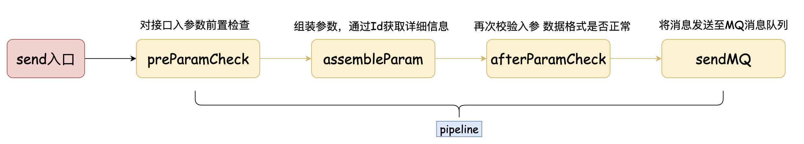
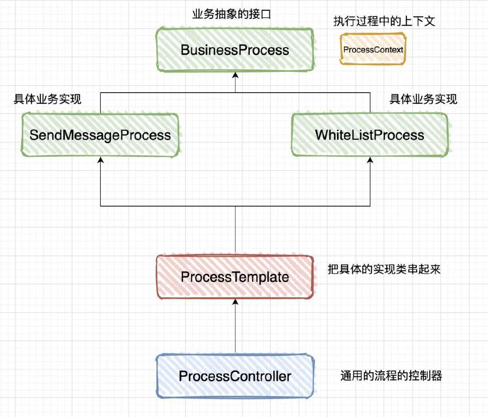
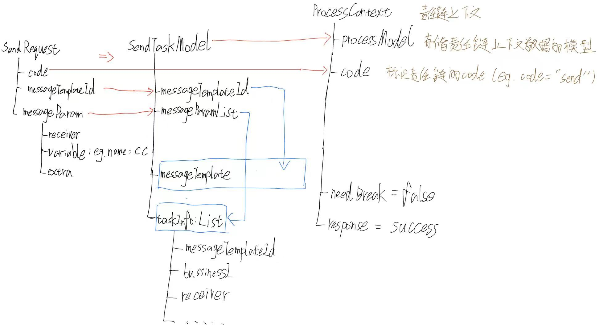
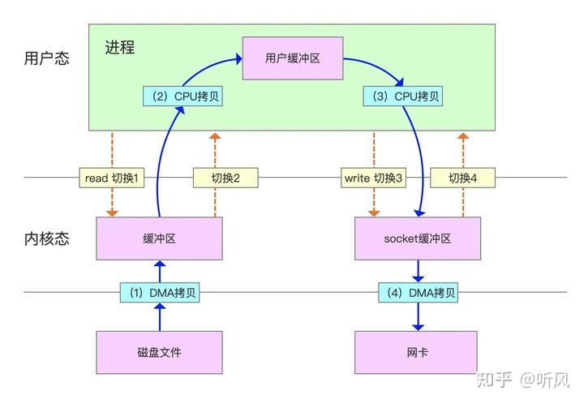
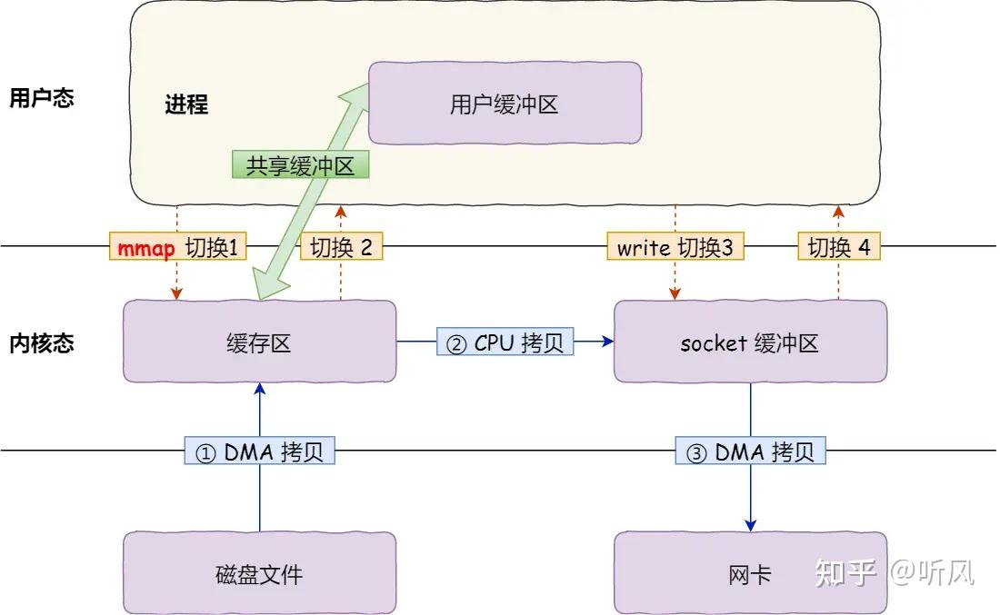
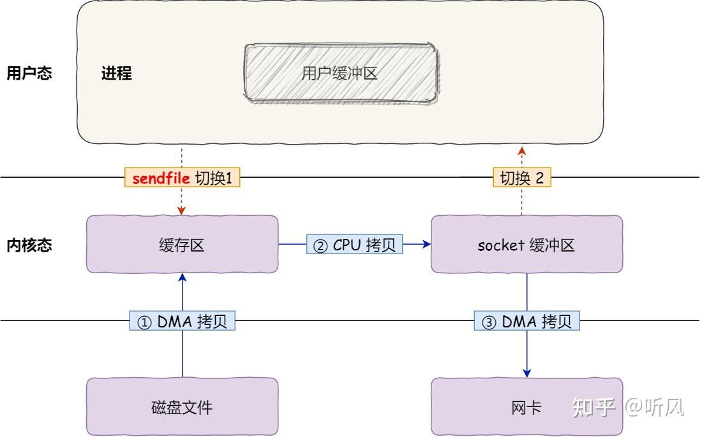
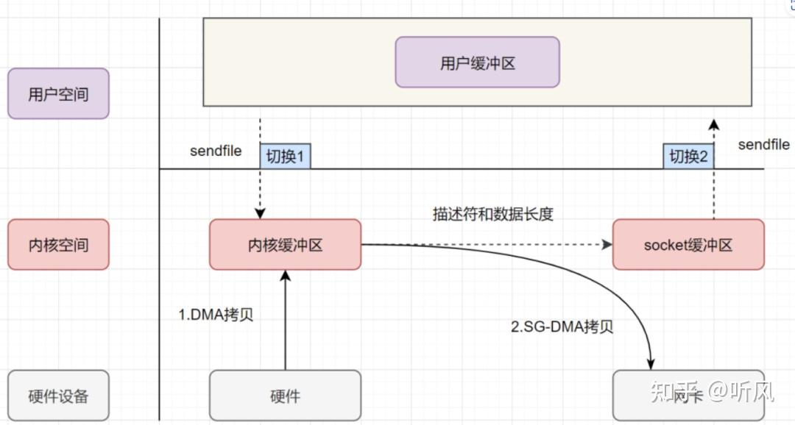
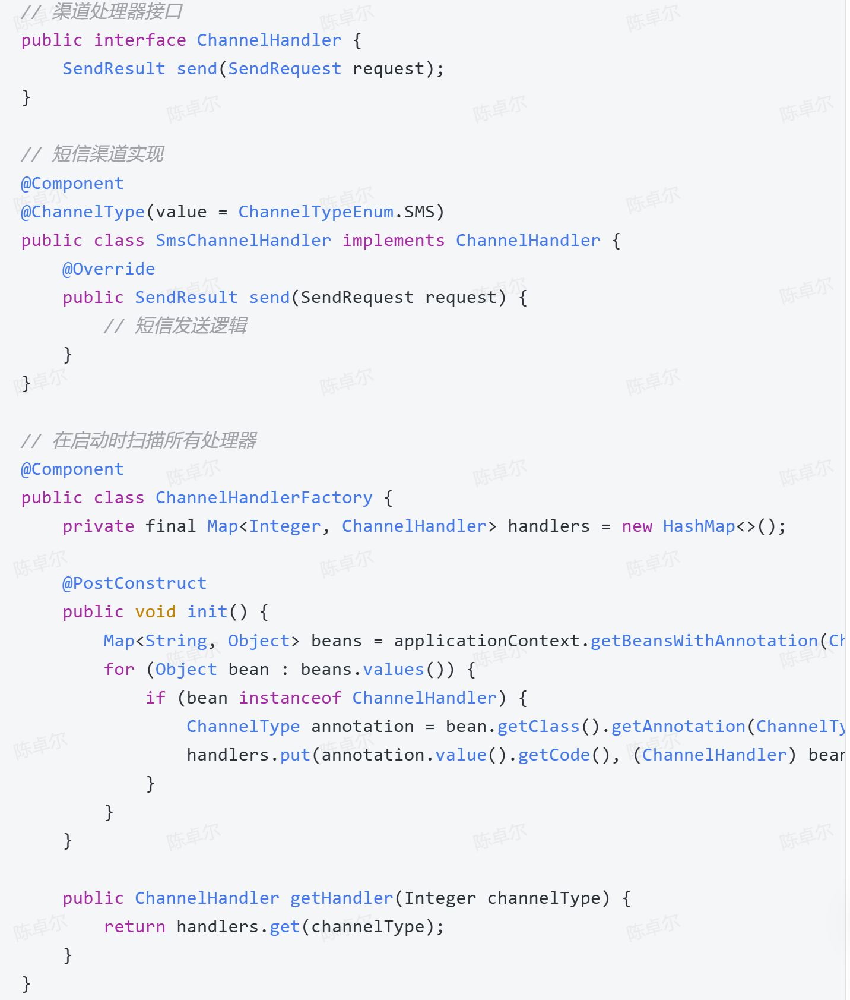
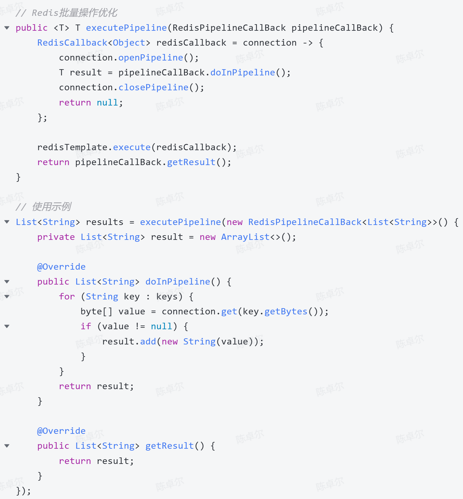

## 1. 架构
- common：枚举、公共类
- API：接入层接口。RPC调用时，只需提供API层，不需要提供APIImpl
- APIImpl：接入层接口的实现
- Support：中间件接入
- Stream：Flink实时清洗
- cron：定时任务逻辑
- handler：逻辑层
- Web：后台管理接口


## 2. 外部工具包
- hutool
- guava
- fastjson
- lombok

## 3. 责任链模式
参数校验 -> 组装参数 -> 业务校验 -> 发送MQ



### send流程
```java
send()
->创建SendTaskModel实例
->创建ProcessContext实例
->processController.process(context);
	->templateConfig.get(context.getCode()).getProcessList()  
```

**参数装配图例**



### 零拷贝

### 传统数据传输方式（4 次上下文切换 + 4 次数据拷贝）


### mmap + write（4 次上下文切换 + 3 次数据拷贝）
**操作流程**：
```
1. 用户进程调用 mmap，将文件的一段内容映射到用户进程的虚拟地址空间。（因为mmap是懒加载的，此时文件内容还在磁盘中，所以虚拟地址未与物理地址对应）
2. 当用户访问这段内存时，如果数据还不在内存，会触发缺页异常。(懒加载)
3. 内核通过 DMA 将磁盘数据读入 Page Cache。
4. 内核建立用户虚拟地址和 Page Cache 中物理页的映射关系，用户进程可以像访问内存一样访问文件内容。
5. 如果再调用 write 写入 socket，数据仍然需要从 Page Cache 拷贝到 socket 缓冲区。
6. 最后 DMA 将 socket 缓冲区的数据发送到网卡。
```



### sendfile（2 次上下文切换 + 3 次数据拷贝）
**操作流程**：
1. **系统调用**：用户进程通过`sendfile`系统调用发起文件传输请求。这一步需要从用户态切换到内核态。  
2. **DMA传输数据到内核缓冲区**：DMA将磁盘上的数据拷贝到内核缓冲区。  
3. **内核拷贝数据到网络缓冲区**：内核将内核缓冲区的数据拷贝到网络协议栈的缓冲区。  
4. **DMA传输数据到网卡**：DMA将网络协议栈的缓冲区数据拷贝到网卡。  
5. **系统调用返回**：系统调用返回，从内核态切换到用户态。



### sendfile + DMA Scatter/Gather（2 次上下文切换 + 2 次数据拷贝）
**操作流程**：

1. **系统调用**：用户进程通过`sendfile`系统调用发起文件传输请求。这一步需要从用户态切换到内核态。
2. **DMA传输数据到内核缓冲区**：DMA将磁盘上的数据拷贝到内核缓冲区。
3. **DMA根据描述信息传输数据到网卡**：DMA根据网络缓冲区中的数据描述信息，直接从内核缓冲区传输数据到网卡。
4. **系统调用返回**：系统调用返回，从内核态切换到用户态。



### 总结
|技术|数据拷贝次数|上下文切换次数|优点|缺点|
|---|---|---|---|---|
|传统I/O|4次|4次|简单易用|性能较差，频繁上下文切换和数据拷贝|
|mmap + write|3次|4次|减少了一次CPU拷贝|仍需上下文切换，适合大文件传输|
|sendfile|2次|2次|减少了上下文切换和CPU拷贝|需要硬件支持，适用场景有限|
|sendfile + DMA|2次|2次|完全避免CPU拷贝，性能最佳|依赖硬件支持，适用场景有限|
|splice|2次|2次|数据传输完全在内核空间完成，灵活性高|实现复杂，适用场景较广但效率稍逊|
|tee|2次|2次|数据可以同时发送到多个目标，灵活性高|实现复杂，适用场景较广但效率稍逊|

### 应用场景与选择建议
- **小文件传输**：推荐使用`sendfile`或`sendfile + DMA`，性能最优。
- **大文件传输**：`mmap + write`适合大文件传输，因为它可以避免用户缓冲区的拷贝。
- **多目标传输**：`tee`适合需要将数据同时发送到多个目标的场景，如日志记录和实时数据分析。
- **灵活场景**：`splice`适合需要在内核空间直接传递数据的场景，但实现复杂度较高。

## 4. Kafka

如何在项目中使用kafka：
1. pom中导入
2. 配置文件中添加kafka相关配置

Products 使用 `KafkaTemplate` 发消息
Costomers 使用 `@KafkaListener` 消费消息

### 项目源码分析
#### Products 使用 `KafkaTemplate` 发消息
```java
// Products 使用 `KafkaTemplate` 发消息
public void send(String topic, String jsonValue, String tagId) {  
    if (StrUtil.isNotBlank(tagId)) {  
        List<Header> headers = Arrays.asList(new RecordHeader(tagIdKey, tagId.getBytes(StandardCharsets.UTF_8)));  
        kafkaTemplate.send(new ProducerRecord(topic, null, null, null, jsonValue, headers));  
    } else {  
        kafkaTemplate.send(topic, jsonValue);  
    }  
}
```

#### Costomers 使用 `@KafkaListener` 消费消息
```java
// Costomers 使用 `@KafkaListener` 消费消息
@KafkaListener(topics = "#{'${austin.business.topic.name}'}", containerFactory = "filterContainerFactory")  
public void consumer(ConsumerRecord<?, String> consumerRecord, @Header(KafkaHeaders.GROUP_ID) String topicGroupId) {  
    Optional<String> kafkaMessage = Optional.ofNullable(consumerRecord.value());  
    if (kafkaMessage.isPresent()) {  
  
        List<TaskInfo> taskInfoLists = JSON.parseArray(kafkaMessage.get(), TaskInfo.class);  
        String messageGroupId = GroupIdMappingUtils.getGroupIdByTaskInfo(CollUtil.getFirst(taskInfoLists.iterator()));  
        /**  
         * 每个消费者组 只消费 他们自身关心的消息  
         */  
        if (topicGroupId.equals(messageGroupId)) {  
            log.info("groupId:{},params:{}", messageGroupId, JSON.toJSONString(taskInfoLists));  
            consumeService.consume2Send(taskInfoLists);  
        }  
    }  
}
```

#### `@KafkaListener`的`containerFactory`过滤
过滤tagIdKey
```java
@Bean  
public ConcurrentKafkaListenerContainerFactory filterContainerFactory(@Value("${austin.business.tagId.key}") String tagIdKey,  
                                                                      @Value("${austin.business.tagId.value}") String tagIdValue) {  
    ConcurrentKafkaListenerContainerFactory factory = new ConcurrentKafkaListenerContainerFactory();  
    factory.setConsumerFactory(consumerFactory);  
    factory.setAckDiscarded(true);  
  
    factory.setRecordFilterStrategy(consumerRecord -> {  
        if (Optional.ofNullable(consumerRecord.value()).isPresent()) {  
            for (Header header : consumerRecord.headers()) {  
                if (header.key().equals(tagIdKey) && new String(header.value()).equals(new String(tagIdValue.getBytes(StandardCharsets.UTF_8)))) {  
                    return false;  
                }  
            }  
        }  
        //返回true将会被丢弃  
        return true;  
    });  
    return factory;  
}
```
#### `KafkaListenerAnnotationBeanPostProcessor.AnnotationEnhancer` 动态修改注解里的属性
KafkaListenerAnnotationBeanPostProcessor.AnnotationEnhancer 是 Spring Kafka 提供的一个扩展点，用来在 Spring 解析 @KafkaListener 注解时，动态修改注解里的属性。

```java
/**  
 * 给每个Receiver对象的consumer方法 @KafkaListener赋值相应的groupId  
 */
 @Bean  
public static KafkaListenerAnnotationBeanPostProcessor.AnnotationEnhancer groupIdEnhancer() {  
    return (attrs, element) -> {  
    // attrs：表示 @KafkaListener 注解上的属性 Map，比如：groupId、topics、containerFactory；
    // element：表示当前被处理的 Java 元素，这里通常是被 @KafkaListener 标注的方法。
        if (element instanceof Method) {  
            String name = ((Method) element).getDeclaringClass().getSimpleName() + "." + ((Method) element).getName();  
            if (RECEIVER_METHOD_NAME.equals(name)) {  
                attrs.put("groupId", groupIds.get(index++));  
            }  
        }  
        return attrs;  
    };  
}
```


## 面试题

### 1. 介绍项目？


### 2. 项目的主要数据库表都有哪些？当时为什么这么设计？

### 3. 请介绍一下项目中你是如何实现消息的幂等性处理的？
- 内容去重：md5(templateId + receiver + ==content==)
- 频次去重：FRE_receiver_templateId_==sendChannel==。滑动窗口实现。使用Redis ZSet + Lua
```lua
--KEYS[1]: 限流 key--ARGV[1]: 限流窗口,毫秒  
--ARGV[2]: 当前时间戳（作为score）  
--ARGV[3]: 阈值  
--ARGV[4]: score 对应的唯一value  
-- 1\. 移除开始时间窗口之前的数据  
redis.call('zremrangeByScore', KEYS[1], 0, ARGV[2]-ARGV[1])  
-- 2\. 统计当前元素数量  
local res = redis.call('zcard', KEYS[1])  
-- 3\. 是否超过阈值  
if (res == nil) or (res < tonumber(ARGV[3])) then  
    redis.call('zadd', KEYS[1], ARGV[2], ARGV[4])  
    redis.call('expire', KEYS[1], ARGV[1]/1000)  
    return 0  
else  
    return 1  
end
```

#### 面试口述版

> 严格来说，当前项目做的主要是发送前的业务去重和频次控制，而不是基于消息 ID 的完整消费幂等。消息进入消费端后，会先执行去重规则：内容去重使用 `templateId + receiver + content` 生成 MD5 Key，避免同一内容短时间重复触达；频次去重使用 `receiver + templateId + sendChannel` 作为 Key，限制用户在时间窗口内接收同类消息的次数。命中去重规则的接收者会从任务中移除，剩余接收者才会进入具体渠道下发。对于精确时间窗口，项目使用 Redis ZSet 和 Lua 脚本保证清理、计数和写入的原子性。  
> 不过我不会把它包装成严格消息幂等，因为当前版本没有以 `messageId` 为中心的 `PROCESSING/SUCCESS` 状态机；如果要应对 MQ 重复投递，需要补充消息 ID 幂等记录、原子抢占，以及数据库唯一约束或渠道侧幂等键。

常见追问：“那真正的消息幂等你会怎么补？”

> 1. 先设计稳定的幂等Key: messageId + consumerName + receiver + sendChannel
> 2. 数据库作为最终事实来源：主键为幂等key。分三种状态：失败、运行中、成功。
> 假设最后发送失败了，重要的消息通过全链路追踪获得messageId手动重发。


### 4. 你们项目中渠道管理是怎么实现的？为什么选择这种方式？
`@ChannelType(value = ChannelTypeEnum.SMS)`
动态添加渠道到handler中。每个渠道创建一个实现handler接口的bean。


### 5. 在高并发场景下如何进行性能优化？
1. 数据库分表
2. redis缓存。针对Redis批量操作，实现RedisPipelineCallBack接口来优化
   
3. 渠道处理用线程池隔离
4. 自适应限流


### 6. 项目是如何处理消息发送失败后的重试机制的
- 即使重试
- 延迟重试：基于XXL-JOB