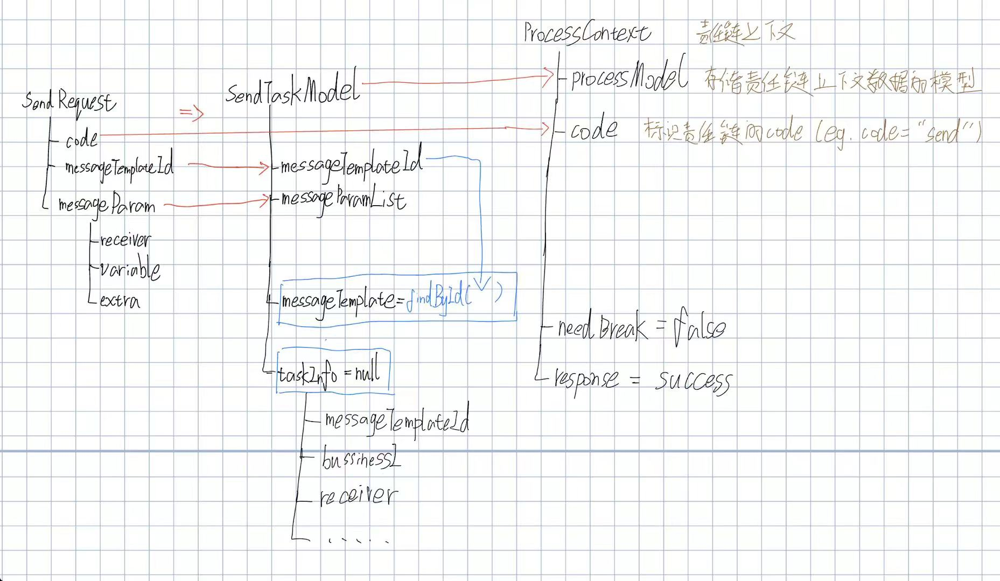

## 1. 架构
- common：枚举、公共类
- API：接入层接口。RPC调用时，只需提供API层，不需要提供APIImpl
- APIImpl：接入层接口的实现
- Support：中间件接入
- Stream：Flink实时清洗
- cron：定时任务逻辑
- handler：逻辑层
- Web：后台管理接口


## 2. 外部工具包
- hutool
- guava
- fastjson
- lombok

## 责任链模式
参数校验 -> 组装参数 -> 业务校验 -> 发送MQ


### send流程
```java
send()
->创建SendTaskModel实例
->创建ProcessContext实例
->processController.process(context);
	->templateConfig.get(context.getCode()).getProcessList()  
```




### 零拷贝

### 传统数据传输方式


### mmap + write
**操作流程**：
1. **映射文件到内存**：用户进程通过`mmap`系统调用将文件映射到内存。
2. **DMA传输数据到内核缓冲区**：DMA将磁盘上的数据拷贝到内核缓冲区。
3. **建立用户空间和内核缓冲区的映射关系**：内核建立用户空间的进程缓冲区和内核缓冲区的映射关系。
4. **写入网络协议栈**：用户进程通过`write`系统调用将映射的内核缓冲区数据写入网络协议栈的缓冲区。
5. **DMA传输数据到网卡**：DMA将网络协议栈的缓冲区数据拷贝到网卡。
```
1. 用户进程调用 mmap，将文件的一段内容映射到用户进程的虚拟地址空间。
2. 当用户访问这段内存时，如果数据还不在内存，会触发缺页异常。
3. 内核通过 DMA 将磁盘数据读入 Page Cache。
4. 内核建立用户虚拟地址和 Page Cache 中物理页的映射关系，用户进程可以像访问内存一样访问文件内容。
5. 如果再调用 write 写入 socket，数据仍然需要从 Page Cache 拷贝到 socket 缓冲区。
6. 最后 DMA 将 socket 缓冲区的数据发送到网卡。
```


### sendfile


