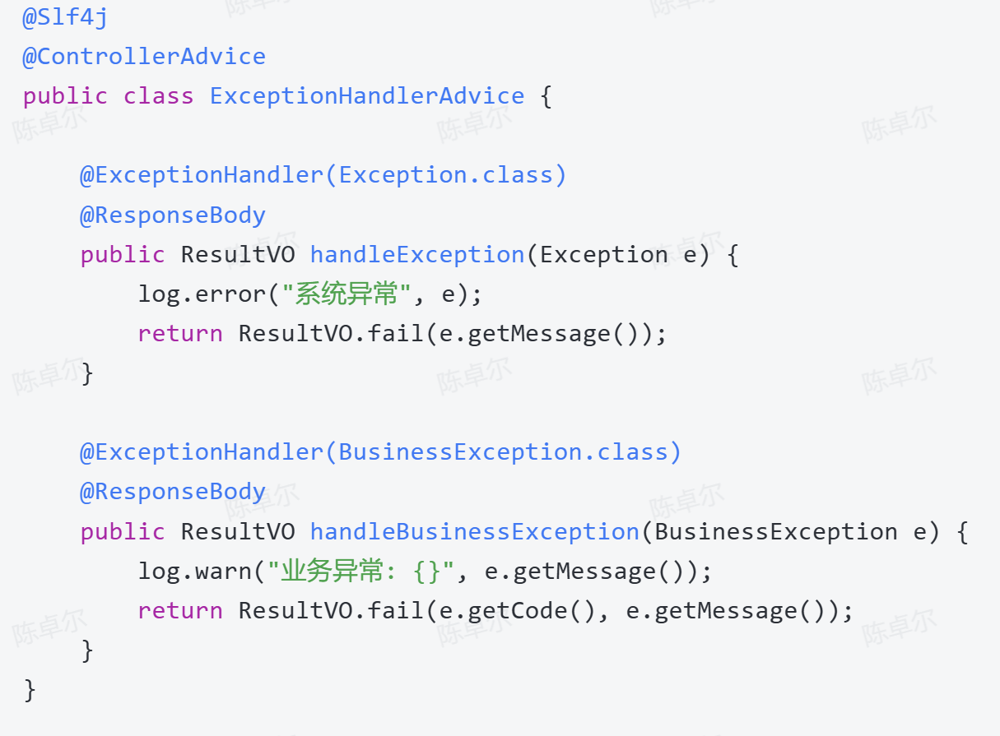

## 1. 架构
- common：枚举、公共类
- API：接入层接口。RPC调用时，只需提供API层，不需要提供APIImpl
- APIImpl：接入层接口的实现
- Support：中间件接入
- Stream：Flink实时清洗
- cron：定时任务逻辑
- handler：逻辑层
- Web：后台管理接口


## 2. 外部工具包
- hutool
- guava
- fastjson
- lombok

## 3. 责任链模式
参数校验 -> 组装参数 -> 业务校验 -> 发送MQ


### send流程
```java
send()
->创建SendTaskModel实例
->创建ProcessContext实例
->processController.process(context);
	->templateConfig.get(context.getCode()).getProcessList()  
```

**参数装配图例**


### 零拷贝

### 传统数据传输方式（4 次上下文切换 + 4 次数据拷贝）


### mmap + write（4 次上下文切换 + 3 次数据拷贝）
**操作流程**：
```
1. 用户进程调用 mmap，将文件的一段内容映射到用户进程的虚拟地址空间。（因为mmap是懒加载的，此时文件内容还在磁盘中，所以虚拟地址未与物理地址对应）
2. 当用户访问这段内存时，如果数据还不在内存，会触发缺页异常。(懒加载)
3. 内核通过 DMA 将磁盘数据读入 Page Cache。
4. 内核建立用户虚拟地址和 Page Cache 中物理页的映射关系，用户进程可以像访问内存一样访问文件内容。
5. 如果再调用 write 写入 socket，数据仍然需要从 Page Cache 拷贝到 socket 缓冲区。
6. 最后 DMA 将 socket 缓冲区的数据发送到网卡。
```


### sendfile（2 次上下文切换 + 3 次数据拷贝）
**操作流程**：
1. **系统调用**：用户进程通过`sendfile`系统调用发起文件传输请求。这一步需要从用户态切换到内核态。  
2. **DMA传输数据到内核缓冲区**：DMA将磁盘上的数据拷贝到内核缓冲区。  
3. **内核拷贝数据到网络缓冲区**：内核将内核缓冲区的数据拷贝到网络协议栈的缓冲区。  
4. **DMA传输数据到网卡**：DMA将网络协议栈的缓冲区数据拷贝到网卡。  
5. **系统调用返回**：系统调用返回，从内核态切换到用户态。


### sendfile + DMA Scatter/Gather（2 次上下文切换 + 2 次数据拷贝）
**操作流程**：

1. **系统调用**：用户进程通过`sendfile`系统调用发起文件传输请求。这一步需要从用户态切换到内核态。
2. **DMA传输数据到内核缓冲区**：DMA将磁盘上的数据拷贝到内核缓冲区。
3. **DMA根据描述信息传输数据到网卡**：DMA根据网络缓冲区中的数据描述信息，直接从内核缓冲区传输数据到网卡。
4. **系统调用返回**：系统调用返回，从内核态切换到用户态。


### 总结
|技术|数据拷贝次数|上下文切换次数|优点|缺点|
|---|---|---|---|---|
|传统I/O|4次|4次|简单易用|性能较差，频繁上下文切换和数据拷贝|
|mmap + write|3次|4次|减少了一次CPU拷贝|仍需上下文切换，适合大文件传输|
|sendfile|2次|2次|减少了上下文切换和CPU拷贝|需要硬件支持，适用场景有限|
|sendfile + DMA|2次|2次|完全避免CPU拷贝，性能最佳|依赖硬件支持，适用场景有限|
|splice|2次|2次|数据传输完全在内核空间完成，灵活性高|实现复杂，适用场景较广但效率稍逊|
|tee|2次|2次|数据可以同时发送到多个目标，灵活性高|实现复杂，适用场景较广但效率稍逊|

### 应用场景与选择建议
- **小文件传输**：推荐使用`sendfile`或`sendfile + DMA`，性能最优。
- **大文件传输**：`mmap + write`适合大文件传输，因为它可以避免用户缓冲区的拷贝。
- **多目标传输**：`tee`适合需要将数据同时发送到多个目标的场景，如日志记录和实时数据分析。
- **灵活场景**：`splice`适合需要在内核空间直接传递数据的场景，但实现复杂度较高。

## 4. Kafka

如何在项目中使用kafka：
1. pom中导入
2. 配置文件中添加kafka相关配置

Products 使用 `KafkaTemplate` 发消息
Costomers 使用 `@KafkaListener` 消费消息

### 项目源码分析
#### Products 使用 `KafkaTemplate` 发消息
```java
// Products 使用 `KafkaTemplate` 发消息
public void send(String topic, String jsonValue, String tagId) {  
    if (StrUtil.isNotBlank(tagId)) {  
        List<Header> headers = Arrays.asList(new RecordHeader(tagIdKey, tagId.getBytes(StandardCharsets.UTF_8)));  
        kafkaTemplate.send(new ProducerRecord(topic, null, null, null, jsonValue, headers));  
    } else {  
        kafkaTemplate.send(topic, jsonValue);  
    }  
}
```

#### Costomers 使用 `@KafkaListener` 消费消息
```java
// Costomers 使用 `@KafkaListener` 消费消息
@KafkaListener(topics = "#{'${austin.business.topic.name}'}", containerFactory = "filterContainerFactory")  
public void consumer(ConsumerRecord<?, String> consumerRecord, @Header(KafkaHeaders.GROUP_ID) String topicGroupId) {  
    Optional<String> kafkaMessage = Optional.ofNullable(consumerRecord.value());  
    if (kafkaMessage.isPresent()) {  
  
        List<TaskInfo> taskInfoLists = JSON.parseArray(kafkaMessage.get(), TaskInfo.class);  
        String messageGroupId = GroupIdMappingUtils.getGroupIdByTaskInfo(CollUtil.getFirst(taskInfoLists.iterator()));  
        /**  
         * 每个消费者组 只消费 他们自身关心的消息  
         */  
        if (topicGroupId.equals(messageGroupId)) {  
            log.info("groupId:{},params:{}", messageGroupId, JSON.toJSONString(taskInfoLists));  
            consumeService.consume2Send(taskInfoLists);  
        }  
    }  
}
```

#### `@KafkaListener`的`containerFactory`过滤
过滤tagIdKey
```java
@Bean  
public ConcurrentKafkaListenerContainerFactory filterContainerFactory(@Value("${austin.business.tagId.key}") String tagIdKey,  
                                                                      @Value("${austin.business.tagId.value}") String tagIdValue) {  
    ConcurrentKafkaListenerContainerFactory factory = new ConcurrentKafkaListenerContainerFactory();  
    factory.setConsumerFactory(consumerFactory);  
    factory.setAckDiscarded(true);  
  
    factory.setRecordFilterStrategy(consumerRecord -> {  
        if (Optional.ofNullable(consumerRecord.value()).isPresent()) {  
            for (Header header : consumerRecord.headers()) {  
                if (header.key().equals(tagIdKey) && new String(header.value()).equals(new String(tagIdValue.getBytes(StandardCharsets.UTF_8)))) {  
                    return false;  
                }  
            }  
        }  
        //返回true将会被丢弃  
        return true;  
    });  
    return factory;  
}
```
#### `KafkaListenerAnnotationBeanPostProcessor.AnnotationEnhancer` 动态修改注解里的属性
KafkaListenerAnnotationBeanPostProcessor.AnnotationEnhancer 是 Spring Kafka 提供的一个扩展点，用来在 Spring 解析 @KafkaListener 注解时，动态修改注解里的属性。

```java
/**  
 * 给每个Receiver对象的consumer方法 @KafkaListener赋值相应的groupId  
 */
 @Bean  
public static KafkaListenerAnnotationBeanPostProcessor.AnnotationEnhancer groupIdEnhancer() {  
    return (attrs, element) -> {  
    // attrs：表示 @KafkaListener 注解上的属性 Map，比如：groupId、topics、containerFactory；
    // element：表示当前被处理的 Java 元素，这里通常是被 @KafkaListener 标注的方法。
        if (element instanceof Method) {  
            String name = ((Method) element).getDeclaringClass().getSimpleName() + "." + ((Method) element).getName();  
            if (RECEIVER_METHOD_NAME.equals(name)) {  
                attrs.put("groupId", groupIds.get(index++));  
            }  
        }  
        return attrs;  
    };  
}
```


## 面试题

### 1. 介绍项目？（TODO）


### 2. 项目的主要数据库表都有哪些？当时为什么这么设计？（TODO）

### 3. 请介绍一下项目中你是如何实现消息的幂等性处理的？
- 内容去重：md5(templateId + receiver + ==content==)
- 频次去重：FRE_receiver_templateId_==sendChannel==。滑动窗口实现。使用Redis ZSet + Lua
```lua
--KEYS[1]: 限流 key--ARGV[1]: 限流窗口,毫秒  
--ARGV[2]: 当前时间戳（作为score）  
--ARGV[3]: 阈值  
--ARGV[4]: score 对应的唯一value  
-- 1\. 移除开始时间窗口之前的数据  
redis.call('zremrangeByScore', KEYS[1], 0, ARGV[2]-ARGV[1])  
-- 2\. 统计当前元素数量  
local res = redis.call('zcard', KEYS[1])  
-- 3\. 是否超过阈值  
if (res == nil) or (res < tonumber(ARGV[3])) then  
    redis.call('zadd', KEYS[1], ARGV[2], ARGV[4])  
    redis.call('expire', KEYS[1], ARGV[1]/1000)  
    return 0  
else  
    return 1  
end
```

#### 面试口述版

> 严格来说，当前项目做的主要是发送前的业务去重和频次控制，而不是基于消息 ID 的完整消费幂等。消息进入消费端后，会先执行去重规则：内容去重使用 `templateId + receiver + content` 生成 MD5 Key，避免同一内容短时间重复触达；频次去重使用 `receiver + templateId + sendChannel` 作为 Key，限制用户在时间窗口内接收同类消息的次数。命中去重规则的接收者会从任务中移除，剩余接收者才会进入具体渠道下发。对于精确时间窗口，项目使用 Redis ZSet 和 Lua 脚本保证清理、计数和写入的原子性。  
> 不过我不会把它包装成严格消息幂等，因为当前版本没有以 `messageId` 为中心的 `PROCESSING/SUCCESS` 状态机；如果要应对 MQ 重复投递，需要补充消息 ID 幂等记录、原子抢占，以及数据库唯一约束或渠道侧幂等键。

常见追问：“那真正的消息幂等你会怎么补？”

> 1. 先设计稳定的幂等Key: messageId + consumerName + receiver + sendChannel
> 2. 数据库作为最终事实来源：主键为幂等key。分三种状态：失败、运行中、成功。
> 假设最后发送失败了，重要的消息通过全链路追踪获得messageId手动重发。


### 4. 你们项目中渠道管理是怎么实现的？为什么选择这种方式？
`@ChannelType(value = ChannelTypeEnum.SMS)`
动态添加渠道到handler中。每个渠道创建一个实现handler接口的bean。


### 5. 在高并发场景下如何进行性能优化？
1. 数据库分表
2. redis缓存。针对Redis批量操作，实现RedisPipelineCallBack接口来优化
   
3. 渠道处理用线程池隔离
4. 自适应限流：全局限流+渠道限流


### 6. 项目是如何处理消息发送失败后的重试机制的
- 即时重试
- 延迟重试：基于XXL-JOB，指数退避策略。

### 15. 为什么单topic多group改成多topic单group
优点：
1. 优先级抢占
2. 消息窃取模型


### 16. 项目划分了几个微服务，各个模块如何协调工作？


### 18. 模板未审批状态下无法使用的问题，如何解决？
引入版本号

### 20. 如何基于分布式作业分片实现延时消息功能？
1. 接收延时消息后，计算预期发送时间，把消息保存到延时任务表，同时写入Redis的ZSet，时间戳作为score
2. 用XXL-JOB创建分布式任务，定期扫描Redis，取出已到期的消息进行处理。采用“分片广播”路由策略
3. 为了处理消息堆积问题，设计了优先级队列和动态扩容机制

### 21. 关于消息幂等性的实现，你提到了解决业务逻辑失败导致Redis键增加的问题，具体说说？
问题：设置完key后，如果后续业务失败，key不会删除。
导致：
1. key累积，内存占用变大。
2. 消息处理后无法重试，因为重试时发现key已存在，就会跳过。

解决：
1. 设置key时增加过期时间
2. 处理失败删除key
3. 增加定时任务清理处于“PROCESSING”状态的key

### 22. 介绍项目的整体架构设计？在设计过程中，你是如何考虑高并发和系统稳定性的？
整体架构：接入层、业务层、存储层、调度层
- 接入层：austin-web模块
- 业务层：austin-service-api，包含所有业务逻辑处理。
- 存储层：使用mysql存业务数据，Redis做缓存，Kafka做消息队列
- 调度层：XXL-JOB实现分布式任务调度。

应对高并发：
1. 消息异步化处理
2. 多级缓存：模板配置、账号信息
3. 批量操作接口：通过pipeline机制一次性处理多个命令
4. 熔断级降级机制

稳定性：
1. 全链路追踪
2. 幂等处理


### 24. 能详细说说你们项目中基于责任链模式的流程控制引擎是如何实现的？它解决了什么问题？
项目在发送接口层使用了责任链模式实现流程控制引擎。核心是定义统一的 `BusinessProcess` 接口，每个处理节点只负责一个明确职责；通过 `ProcessContext` 在节点之间传递业务数据、响应结果和中断标记；再由 `ProcessController` 根据业务编码选择对应的 `ProcessTemplate`，按顺序执行其中的处理节点。

普通消息发送链路包括前置参数校验、模板和任务组装、接收者后置校验，以及投递 MQ。任一步发现异常或校验不通过，都会设置 `needBreak`，控制器立即停止后续步骤并返回统一结果。

这种设计避免了把所有发送逻辑堆在一个方法中。后续要增加限流、黑名单、风控或审计时，只需要新增一个 Action 并插入流程模板，不需要修改核心流程控制代码。


### 28. 异常处理和监控？


在高并发消息系统中，我们把异常处理和监控拆成了分层闭环。接口层通过 `@ControllerAdvice` 统一捕获异常并返回标准结果；异步消费和渠道发送层则根据异常类型区分可重试、不可重试和未知异常，对网络超时、渠道 5xx、限流等可恢复问题采用退避重试，超过阈值后进入失败队列或人工补偿。

稳定性方面，我们为不同渠道配置独立线程池和限流策略，防止一个渠道异常影响全局。消息生命周期中会记录接收、去重、屏蔽、发送成功和发送失败等锚点事件，携带 `businessId` 和 `messageId`，并发送到日志 Topic 做实时链路聚合。

监控层通过 Prometheus 采集 JVM、线程池、MQ 积压、Redis、渠道成功率和耗时等指标，通过 Graylog 集中检索错误日志，并针对失败率、积压量、超时率和资源使用率设置持续窗口告警，实现从异常发现到定位、重试和恢复的闭环。


### 如何保证消息的可靠性？
    

#### 实现流程
    

1. 从Kafka拉取消息（一次批量拉取500条，这里主要看配置）
    
2. 为每条拉取的消息分配一个msgId（递增）
    
3. 将msgId存入内存队列（sortSet）中
    
4. 使用Map存储msgId与msg（有offset相关的信息）的映射关系
    
5. 当业务处理完消息后，ack时，获取当前处理的消息msgId，然后从sortSet删除该msgId（此时代表已经处理过了）
    
6. 接着与sortSet队列的首部第一个Id比较（最小的msgId），如果当前msgId<=sort Set第一个Id，则提交当前offset
    
7. 系统即便挂了，在下次重启时就会从sortSet队首的消息开始拉取，实现至少处理一次语义。
    
8. 会有少量的消息重复，下游要做幂等
    

注意：

流程中使用全局递增 `msgId` 并不严谨。Kafka offset 是按 `Topic + Partition` 独立维护的，所以正确跟踪粒度应该是：

```Plain
TopicPartition → 当前未完成的offset集合
```

不能把不同分区的消息放在一个全局 `SortSet` 中比较。

#### 前置（kafka每次处理单条消息）
    

kafka手动提交。

首先关闭 Kafka 自动提交：

```Plain
spring.kafka.consumer.enable-auto-commit=false
```

设置手动确认模式：

```Plain
@Bean
public ConcurrentKafkaListenerContainerFactory<String, String>
        filterContainerFactory(ConsumerFactory<String, String> consumerFactory) {

    ConcurrentKafkaListenerContainerFactory<String, String> factory =
            new ConcurrentKafkaListenerContainerFactory<>();

    factory.setConsumerFactory(consumerFactory);

    factory.getContainerProperties().setAckMode(
            ContainerProperties.AckMode.MANUAL_IMMEDIATE
    );

    return factory;
}
```

`Acknowledgment`（Kafka 手动确认对象）只有在业务真正成功后才调用。

简化后的消费者：

```Java
@KafkaListener(
        topics = "${austin.business.topic.name}",
        containerFactory = "filterContainerFactory"
)
public void consumer(ConsumerRecord<String, String> record,
                     Acknowledgment acknowledgment) {

    TaskInfo taskInfo =
            JSON.parseObject(record.value(), TaskInfo.class);

    IdempotencyResult result =
            idempotencyService.tryStart(taskInfo);

    // 之前已经成功处理过，直接确认，避免重复发送
    if (result == IdempotencyResult.SUCCESS) {
        acknowledgment.acknowledge();
        return;
    }

    // 其他消费者正在处理，交给重试机制稍后再处理
    if (result == IdempotencyResult.PROCESSING) {
        throw new RetryableException("message is processing");
    }

    try {
        // 必须等待渠道处理完成，不能只是提交线程池
        boolean sendSuccess = taskService.processSynchronously(taskInfo);

        if (!sendSuccess) {
            throw new RuntimeException("channel send failed");
        }

        // 先写 Redis SUCCESS
        idempotencyService.markSuccess(taskInfo);

        // 最后确认 Kafka
        acknowledgment.acknowledge();

    } catch (Exception e) {
        // 删除 PROCESSING，允许后续重试
        idempotencyService.release(taskInfo);

        // 不确认 offset，并抛出异常交给重试/死信机制
        throw e;
    }
}
```

正确顺序是：

```Plain
收到 MQ 消息
→ Redis 抢占处理权
→ 执行业务去重
→ 调用短信/邮件渠道
→ 渠道返回成功
→ Redis 写 SUCCESS
→ 手动提交 Kafka offset
```

如果提交 offset 失败，Kafka 再次投递时，消费者会看到 Redis 中已经是 `SUCCESS`，跳过渠道发送并重新提交 offset。

  

#### kafka一次处理多条消息
    

##### 配置一次最多拉取500条
    

```Properties
# 一次poll最多返回500条
spring.kafka.consumer.max-poll-records=500

# 关闭Kafka自动提交
spring.kafka.consumer.enable-auto-commit=false

# 如果一次批处理比较耗时，需要适当调大
spring.kafka.consumer.properties.max.poll.interval.ms=300000
```

##### 配置批量监听容器
    

```Java
@Configuration
public class KafkaBatchConsumerConfig {

    @Bean("batchContainerFactory")
    public ConcurrentKafkaListenerContainerFactory<String, String>
            batchContainerFactory(
                ConsumerFactory<String, String> consumerFactory) {

        ConcurrentKafkaListenerContainerFactory<String, String> factory =
                new ConcurrentKafkaListenerContainerFactory<>();

        // 设置消费者工厂
        factory.setConsumerFactory(consumerFactory);

        // 开启批量监听
        factory.setBatchListener(true);

        // 使用手动确认
        factory.getContainerProperties().setAckMode(
                ContainerProperties.AckMode.MANUAL_IMMEDIATE
        );

        return factory;
    }
}
```

其中：

- `ConcurrentKafkaListenerContainerFactory`：并发Kafka监听容器工厂
    
- `setBatchListener(true)`：把一批消息整体传给监听方法
    
- `MANUAL_IMMEDIATE`：由业务代码手动确认消费结果
    

  

##### 监听方法接收消息集合
    

```Java
@KafkaListener(
        topics = "${austin.business.topic.name}",
        groupId = "austin-batch-handler",
        containerFactory = "batchContainerFactory"
)
public void consumer(
        List<ConsumerRecord<String, String>> records,
        Acknowledgment acknowledgment) {

    try {
        log.info("本次从Kafka拉取到{}条消息", records.size());

        for (ConsumerRecord<String, String> record : records) {

            log.info(
                    "partition:{}, offset:{}, value:{}",
                    record.partition(),
                    record.offset(),
                    record.value()
            );

            List<TaskInfo> taskInfos =
                    JSON.parseArray(record.value(), TaskInfo.class);

            consumeService.consume2Send(taskInfos);
        }

        // 整批业务全部成功后再确认
        acknowledgment.acknowledge();

    } catch (Exception e) {
        // 不确认offset，并抛出异常
        throw e;
    }
}
```

  

  

#### Kafka手动提交offset (消息可靠性的具体实践）
    

核心实现思路是：

> 不使用全局`msgId`，而是为每个`TopicPartition`（主题分区）维护一个有序的“未完成offset集合”。只有最小offset开始形成连续完成区间，才能提交该分区的新offset。

Kafka已经提供了唯一坐标：`Topic + Partition + Offset`

##### 0) 配置

```Properties
# 一次poll最多返回500条
spring.kafka.consumer.max-poll-records=500

# 关闭Kafka自动提交
spring.kafka.consumer.enable-auto-commit=false

# 如果一次批处理比较耗时，需要适当调大
spring.kafka.consumer.properties.max.poll.interval.ms=300000
```

##### 使用 `@KafkaListener` 接收批量消息

上面的配置只规定了 Kafka 的拉取和提交方式，真正的消费入口仍然由 `@KafkaListener`（Kafka 监听注解）提供。Spring Kafka 容器会在内部循环执行 `poll()`，拉取到一批消息后调用下面的方法：

```Java
@Component
@RequiredArgsConstructor
public class ReliableKafkaConsumer {

    private final PartitionOffsetTracker offsetTracker;
    private final ExecutorService executor;
    private final MessageService messageService;

    @KafkaListener(
            topics = "${austin.business.topic.name}",
            groupId = "austin-reliable-handler",
            containerFactory = "batchContainerFactory"
    )
    public void consumer(
            List<ConsumerRecord<String, String>> records,
            Consumer<String, String> consumer) {

        if (records == null || records.isEmpty()) {
            return;
        }

        // 当前方法由 Kafka 消费线程调用：先登记整批 offset，
        // 再交给工作线程处理，最后仍由当前消费线程提交安全 offset。
        processBatch(records, consumer);
    }

    // processBatch(...)、commitReadyOffsets(...) 和
    // PartitionOffsetTracker 的实现见下文。
}
```

这里的 `Consumer`（Kafka 消费者接口）由 Spring 注入，只能在当前 Kafka 消费线程中使用，不能传给业务线程池。工作线程只执行业务并调用 `offsetTracker.markCompleted(record)`；真正的 `consumer.commitSync(offsets)` 仍由监听线程执行。

该方案已经通过 `commitSync(offsets)` 按分区提交精确位点，因此不要再调用整批 `Acknowledgment.acknowledge()`，否则会绕过连续完成 offset 的计算。下面的 `processBatch` 是原理简化代码；如果处理可能超过 `max.poll.interval.ms`，生产环境还要通过限制在途数量、`pause/resume`、持续 `poll` 和重平衡状态清理来保证消费者不会被移出消费组。

  

##### **1) 数据结构**

使用`Map<TopicPartition, PartitionState>`

每个分区对应一个状态：

```Java
PartitionState
├── 有序的offset状态表
├── 当前可以提交到哪里
└── 上一次成功提交到哪里
```

例如：

```Java
Partition 0：

100 → 未完成
101 → 已完成
102 → 已完成
```

  

##### 2) offset跟踪器

```Java
public class PartitionOffsetTracker {

    /**
     * 每个TopicPartition独立维护状态
     */
    private final ConcurrentMap<TopicPartition, PartitionState> states =
            new ConcurrentHashMap<>();

    /**
     * 收到一批消息后，必须先登记全部offset，
     * 然后才能把任务提交给线程池。
     */
    public void registerBatch(
            Collection<? extends ConsumerRecord<?, ?>> records) {

        for (ConsumerRecord<?, ?> record : records) {
            TopicPartition topicPartition =
                    new TopicPartition(
                            record.topic(),
                            record.partition()
                    );

            states.computeIfAbsent(
                    topicPartition,
                    key -> new PartitionState()
            ).register(record.offset());
        }
    }

    /**
     * 工作线程处理成功后调用
     */
    public void markCompleted(ConsumerRecord<?, ?> record) {

        TopicPartition topicPartition =
                new TopicPartition(
                        record.topic(),
                        record.partition()
                );

        PartitionState state = states.get(topicPartition);

        if (state != null) {
            state.complete(record.offset());
        }
    }

    /**
     * 获取当前各分区可以安全提交的offset
     */
    public Map<TopicPartition, OffsetAndMetadata>
            snapshotCommitOffsets() {

        Map<TopicPartition, OffsetAndMetadata> result =
                new HashMap<>();

        states.forEach((topicPartition, state) -> {
            Long offset = state.commitCandidate();

            if (offset != null) {
                result.put(
                        topicPartition,
                        new OffsetAndMetadata(offset)
                );
            }
        });

        return result;
    }

    /**
     * Kafka提交成功后更新本地记录
     */
    public void markCommitSucceeded(
            Map<TopicPartition, OffsetAndMetadata> offsets) {

        offsets.forEach((topicPartition, metadata) -> {
            PartitionState state = states.get(topicPartition);

            if (state != null) {
                state.commitSucceeded(metadata.offset());
            }
        });
    }

    private static class PartitionState {

        /**
         * offset -> 是否处理完成
         *
         * TreeMap保证offset从小到大排列
         */
        private final NavigableMap<Long, Boolean> offsetStates =
                new TreeMap<>();

        /**
         * 当前计算出的可提交位置
         */
        private long committableOffset = -1;

        /**
         * 已经成功提交到Kafka的位置
         */
        private long committedOffset = -1;

        public synchronized void register(long offset) {
            if (offset >= committedOffset) {
                offsetStates.putIfAbsent(offset, false);
            }
        }

        public synchronized void complete(long offset) {

            if (!offsetStates.containsKey(offset)) {
                return;
            }

            offsetStates.put(offset, true);

            Long lastRemovedOffset = null;

            /*
             * 只能从最小offset开始连续删除已完成记录
             */
            while (!offsetStates.isEmpty()
                    && Boolean.TRUE.equals(
                    offsetStates.firstEntry().getValue())) {

                lastRemovedOffset =
                        offsetStates.pollFirstEntry().getKey();
            }

            /*
             * 没有形成新的连续完成区间
             */
            if (lastRemovedOffset == null) {
                return;
            }

            /*
             * Kafka提交的是“下一条需要消费的位置”
             */
            long nextOffset;

            if (offsetStates.isEmpty()) {
                nextOffset = lastRemovedOffset + 1;
            } else {
                nextOffset = offsetStates.firstKey();
            }

            committableOffset =
                    Math.max(committableOffset, nextOffset);
        }

        public synchronized Long commitCandidate() {

            if (committableOffset > committedOffset) {
                return committableOffset;
            }

            return null;
        }

        public synchronized void commitSucceeded(long offset) {
            committedOffset =
                    Math.max(committedOffset, offset);
        }
    }
}
```

  

##### 3) 先登记再提交线程池

```Java
// 1. 先登记本批所有offset
offsetTracker.registerBatch(records);

// 2. 再提交并行任务
for (ConsumerRecord<String, String> record : records) {
    executor.submit(() -> {
        process(record);
        offsetTracker.markCompleted(record);
    });
}
```

  

##### 4) 工作线程不能直接提交Kafka offset

`KafkaConsumer`（Kafka 消费者）不是线程安全的。

因此不能在线程池中这样做：

```Plain
executor.submit(() -> {
    process(record);

    // 错误：工作线程直接操作KafkaConsumer
    consumer.commitSync();
});
```

正确职责划分是：

```Plain
工作线程：
只负责处理业务
→ 完成后调用offsetTracker.markCompleted()

Kafka消费线程：
定期读取offsetTracker中的安全提交位置
→ 调用consumer.commitSync()
```

提交代码：

```Plain
private void commitReadyOffsets(
        Consumer<String, String> consumer,
        PartitionOffsetTracker tracker) {

    Map<TopicPartition, OffsetAndMetadata> offsets =
            tracker.snapshotCommitOffsets();

    if (offsets.isEmpty()) {
        return;
    }

    consumer.commitSync(offsets);

    tracker.markCommitSucceeded(offsets);
}
```

注意提交的不是某条“已完成消息”的 offset，而是：

```Plain
该分区下一条应该消费的位置
```

  

##### 5) 批量并行处理流程

```Java
poll最多500条消息
        ↓
按TopicPartition登记全部offset
        ↓
把消息提交给业务线程池
        ↓
工作线程乱序完成
        ↓
每完成一条就更新对应PartitionState
        ↓
Kafka消费线程检查连续完成区间
        ↓
按分区提交安全offset
```

例如：

```Java
public void processBatch(
        List<ConsumerRecord<String, String>> records,
        Consumer<String, String> consumer) {

    offsetTracker.registerBatch(records);

    CountDownLatch latch =
            new CountDownLatch(records.size());

    AtomicReference<Throwable> error =
            new AtomicReference<>();

    for (ConsumerRecord<String, String> record : records) {

        executor.submit(() -> {
            try {
                messageService.process(record.value());

                // 只有业务成功才标记完成
                offsetTracker.markCompleted(record);

            } catch (Throwable throwable) {
                error.compareAndSet(null, throwable);

                // 失败消息不能标记完成
                
                // 省略失败应对措施
            } finally {
                latch.countDown();
            }
        });
    }

    while (latch.getCount() > 0) {
        // 只能由Kafka消费线程执行提交
        commitReadyOffsets(consumer, offsetTracker);

        try {
            latch.await(100, TimeUnit.MILLISECONDS);
        } catch (InterruptedException e) {
            Thread.currentThread().interrupt();
            throw new RuntimeException(e);
        }
    }

    commitReadyOffsets(consumer, offsetTracker);

    if (error.get() != null) {
        throw new RuntimeException(
                "batch process failed",
                error.get()
        );
    }
}
```

这是用于解释原理的简化代码。真实项目还要**处理超时、重平衡和失败重试**。
