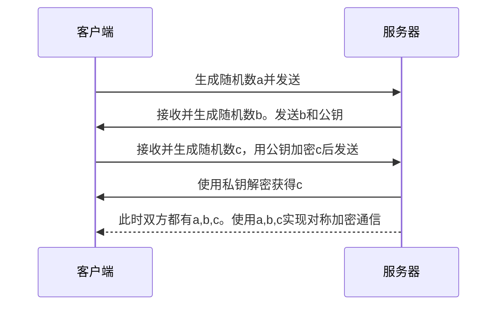
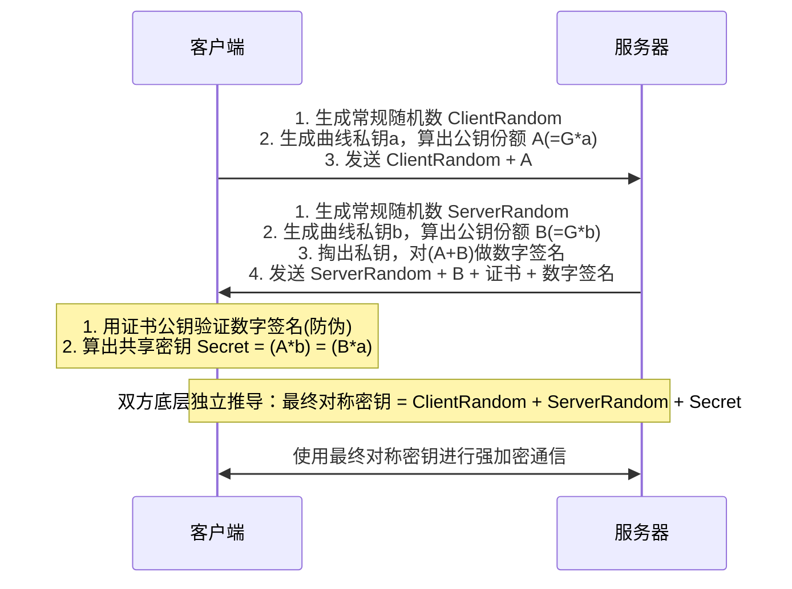

#### OSI七层模型和TCP/IP 4层模型

#### TLS
RSA：

```mermaid
sequenceDiagram
    客户端 ->> 服务器: 生成随机数a并发送
    服务器 ->> 客户端: 接收并生成随机数b。发送b和公钥
    客户端 ->> 服务器: 接收并生成随机数c，用公钥加密c后发送
    服务器 ->> 客户端: 使用私钥解密获得c
    服务器 -->> 客户端: 此时双方都有a,b,c。使用a,b,c实现对称加密通信
```

ECDHE:

```mermaid
sequenceDiagram
    participant Client as 客户端
    participant Server as 服务器
    
    Client->>Server: 1. 生成常规随机数 ClientRandom<br/>2. 生成曲线私钥a，算出公钥份额 A(=G*a)<br/>3. 发送 ClientRandom + A
    
    Server->>Client: 1. 生成常规随机数 ServerRandom<br/>2. 生成曲线私钥b，算出公钥份额 B(=G*b)<br/>3. 掏出私钥，对(A+B)做数字签名<br/>4. 发送 ServerRandom + B + 证书 + 数字签名
    
    Note over Client: 1. 用证书公钥验证数字签名(防伪)<br/>2. 算出共享密钥 Secret = (A*b) = (B*a)
    
    Note over Client,Server: 双方底层独立推导：最终对称密钥 = ClientRandom + ServerRandom + Secret
    
    Client<<->>Server: 使用最终对称密钥进行强加密通信
```
