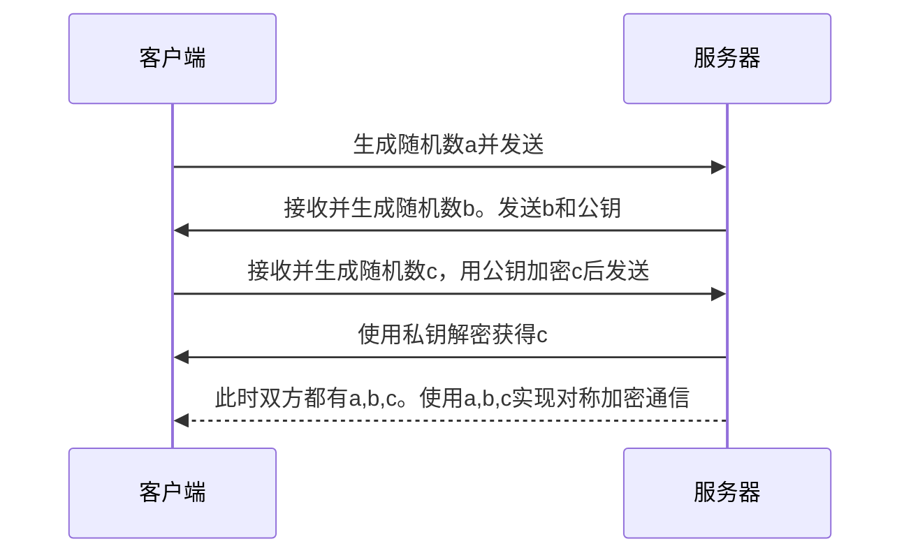
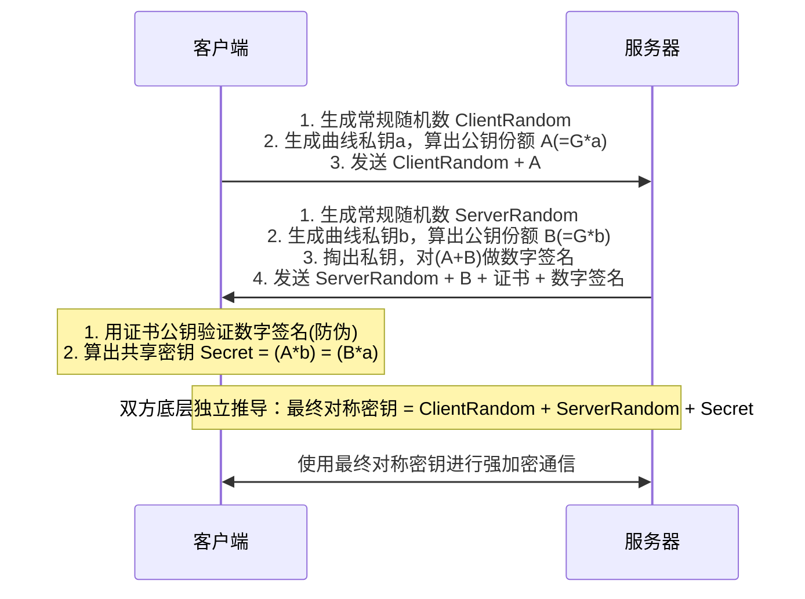

#### OSI七层模型和TCP/IP 4层模型

#### TLS
RSA：

ECDHE:
- ClientRandom和ServerRandom不用其实也不会被重放攻击，加上是为了增加混乱度

#### HTTP1.0, 1.1, 2.0

#### HTTP3.0和2.0的区别
1. **传输层协议**：
   - 2.0 tcp  
   - 3.0 udp
2. **彻底解决队头阻塞**：
   - 2.0 Stream A 的包丢了，TCP会暂停所有流的传输，等待重传；
   - 3.0 Stream A的包丢了，应用层会阻塞Stream A，其他Stream不影响
3. **建连速度**：
   - 2.0：TCP三次握手（1RTT）+TLS握手（1/2 RTT）
   - 3.0：QUIC把传输层握手和加密握手合并了（1RTT）。如果之前连过，且执行幂等操作，可以直接0RTT发送数据。QUIC建连具体过程如下：
	   - **首次连接 (1-RTT):** 客户端发送 `QUIC Initial Packet`（内含 TLS ClientHello, ClientRandom, 公钥份额 A）。服务端回复 `Initial/Handshake Packet`（内含 ServerHello, ServerRandom, 公钥份额 B, 身份签名）。客户端验证通过，算出 Secret 即可发送加密业务数据。
	   - **复用连接 (0-RTT):** 客户端利用缓存的 Ticket 直接加密业务数据，与 Initial Packet 一并发送（Early Data）。为防重放攻击，服务端网关必须配置严格规则：仅允许 GET/HEAD 等幂等 HTTP 请求走 0-RTT，非幂等请求强制降级重试。
4. **连接迁移**：
   - 2.0：基于四元组识别。当你从wifi切到4G，IP变了，连接就断了，必须重连。
   - 3.0：基于**Connection ID**。
5. **头部压缩算法升级**：
   - 2.0：使用HPACK，依赖TCP的有序传输。
   - 3.0：使用QPACK。使用专门的流来传输动态表更新指令。发送数据时若使用了接收端未确认的索引，可以选择直接发送字面量。

#### cookie, session, token
- cookie：保存在本地
- session：本地保存session id，服务器存储具体信息
- token：信息加密保存在本地，服务器检查是否正确