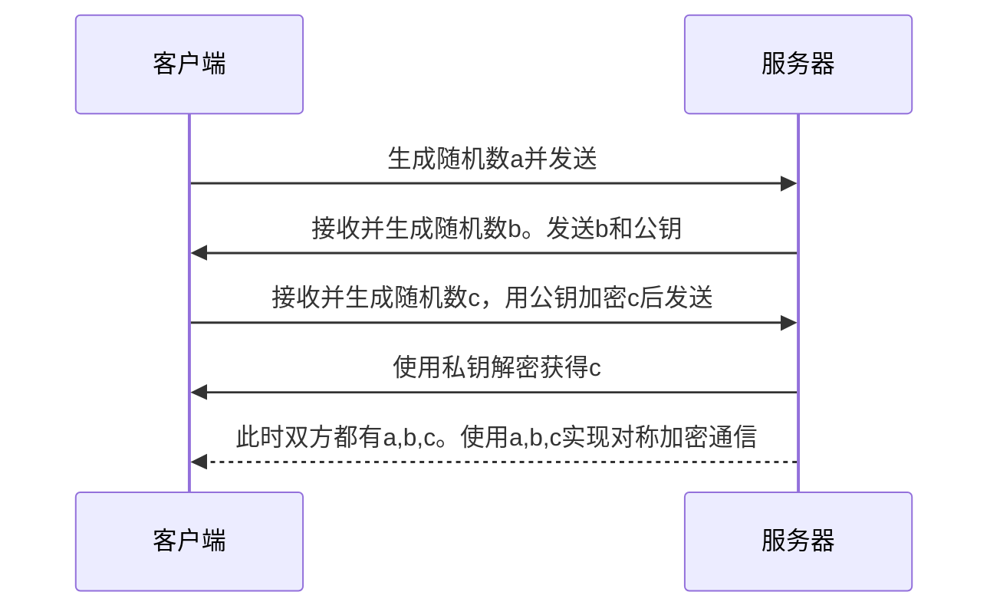
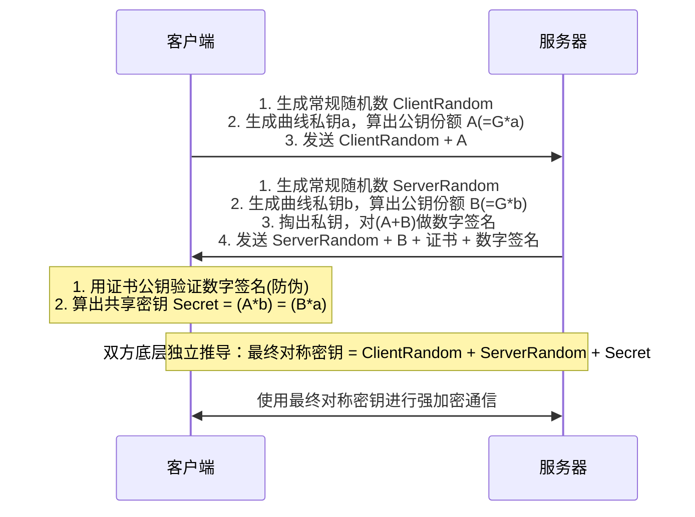
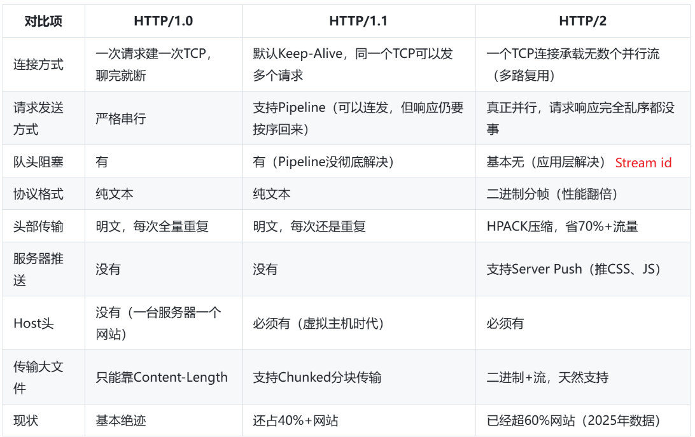

#### OSI七层模型和TCP/IP 4层模型

#### TLS
RSA：

ECDHE:
- ClientRandom和ServerRandom不用其实也不会被重放攻击，加上是为了增加混乱度

#### HTTP1.0, 1.1, 2.0

#### HTTP3.0和2.0的区别
1. **传输层协议**：
   - 2.0 tcp  
   - 3.0 udp
2. **彻底解决队头阻塞**：
   - 2.0 Stream A 的包丢了，TCP会暂停所有流的传输，等待重传；
   - 3.0 Stream A的包丢了，应用层会阻塞Stream A，其他Stream不影响
3. **建连速度**：
   - 2.0：TCP三次握手（1RTT）+TLS握手（1/2 RTT）
   - 3.0：QUIC把传输层握手和加密握手合并了（1RTT）。如果之前连过，且执行幂等操作，可以直接0RTT发送数据。QUIC建连具体过程如下：
	   - **首次连接 (1-RTT):** 客户端发送 `QUIC Initial Packet`（内含 TLS ClientHello, ClientRandom, 公钥份额 A）。服务端回复 `Initial/Handshake Packet`（内含 ServerHello, ServerRandom, 公钥份额 B, 身份签名）。客户端验证通过，算出 Secret 即可发送加密业务数据。
	   - **复用连接 (0-RTT):** 客户端利用缓存的 Ticket 直接加密业务数据，与 Initial Packet 一并发送（Early Data）。为防重放攻击，服务端网关必须配置严格规则：仅允许 GET/HEAD 等幂等 HTTP 请求走 0-RTT，非幂等请求强制降级重试。
4. **连接迁移**：
   - 2.0：基于四元组识别。当你从wifi切到4G，IP变了，连接就断了，必须重连。
   - 3.0：基于**Connection ID**。
5. **头部压缩算法升级**：
   - 2.0：使用HPACK，依赖TCP的有序传输。
   - 3.0：使用QPACK。使用专门的流来传输动态表更新指令。发送数据时若使用了接收端未确认的索引，可以选择直接发送字面量。

#### cookie, session, token
- cookie：保存在本地
- session：本地保存session id，服务器存储具体信息
- token：信息加密保存在本地，服务器检查是否正确

|**维度**|**Cookie**|**Session**|**Token (JWT)**|
|---|---|---|---|
|**存储位置**|客户端（浏览器 OS 文件系统）|服务端（JVM 内存或 Redis）|客户端（Local Storage 或 Cookie）|
|**防篡改机制**|极弱（除非加密），不可信任|强，只暴露 SessionID|极强，基于密码学签名不可伪造|
|**服务端压力**|无|高（消耗内存，强依赖 Redis I/O）|中（消耗 CPU 用于加解密计算）|
|**分布式支持**|天生支持|需引入分布式会话管理（复杂）|天生支持，极其契合微服务网关鉴权|
|**核心应用场景**|存储非敏感偏好设置|传统单体企业级应用 (SSR 渲染)|前后端分离、微服务架构、开放 API|

#### 网络攻击：XSS和CSRF的区别
- **XSS (跨站脚本) = 注入并执行了恶意代码。** 黑客是真的把一段 JavaScript 代码“塞”进了网页里。当你的浏览器渲染这个网页时，**你的浏览器**把这段恶意代码当成了网站原本的代码，乖乖执行了。
    
- **CSRF (跨站请求伪造) = 没有执行任何新代码，只是“骗”你发了个请求。** 黑客**没有**在你信任的网站（比如银行）里注入任何代码。恶意代码是运行在黑客自己的钓鱼网站上的。这个钓鱼网站只是利用了你浏览器里现成的 Cookie，向银行发送了一个合法的 HTTP 请求。银行的服务器收到请求，以为是你本人点的，就处理了。整个过程中，银行网站本身的代码干干净净，没有任何恶意脚本被执行。

**XSS 防的是“内容输入”，CSRF 防的是“请求来源”。**

**🛡️ XSS 防御核心：永远不要信任用户的输入**

XSS 的本质是黑客把代码“注入”到了你的网页里。所以防御的重点是**消毒**和**隔离**。

- **输入过滤与清理 (Sanitization)** 在数据存入数据库之前，严格检查用户输入的内容。如果是纯文本框（比如用户名），就剥离掉所有的 HTML 标签；如果是富文本编辑器，就使用白名单机制，只允许安全的标签（如 `<b>`, `<i>`），坚决剔除 `<script>`、`<iframe>` 或 `onerror` 等危险属性。
    
- **输出转义 (Escaping/Encoding)** 这是防范 XSS 最重要的一步。在把后端取出的数据渲染到前端页面时，把特殊字符转义成普通文本。例如，把 `<` 转成 `&lt;`，把 `>` 转成 `&gt;`。这样浏览器只会把它当成一行文字显示，而不会当成代码去执行。
    
- **内容安全策略 (Content Security Policy, CSP)** 这是终极的安全网。通过在 HTTP 响应头中设置 `Content-Security-Policy`，服务器可以给浏览器下达严格的指令：“这个页面只允许加载我自己域名下的 JavaScript，绝对禁止执行任何直接写在 HTML 里的内联脚本”。这能直接掐死绝大多数 XSS 攻击。
    
- **设置 HttpOnly 属性** 这是一种“止损”手段。给敏感的 Cookie（如用户的登录 Session）加上 `HttpOnly` 标志后，就算网页不幸发生了 XSS 漏洞，黑客的 JavaScript 代码也无法读取到这个 Cookie，从而防止了账号被直接盗用。
    

**🛡️ CSRF 防御核心：确认请求真的是用户本人发起的**

CSRF 的本质是黑客利用浏览器自动带 Cookie 的机制“伪造”了请求。所以防御的重点是**验证身份的唯一性**和**限制 Cookie 的发送**。

- **使用 CSRF Token (同步令牌)** 最经典的防御手段。服务器在页面中嵌入一个随机且不可预测的 Token。用户每次提交表单或发起重要请求时，必须携带这个 Token。因为黑客在跨站环境下（受同源策略限制）无法读取到你页面里的 Token，他伪造的请求就会因为“暗号不对”被服务器拦截。
    
- **设置 SameSite Cookie 属性** 这是现代浏览器的强大防线。在发放 Cookie 时设置 `SameSite=Lax` 或 `SameSite=Strict`。这会明确告诉浏览器：“如果这个请求是从第三方网站发起的（跨站请求），请不要把我的 Cookie 带过去”。没有了 Cookie，黑客的伪造请求就成了无源之水。
    
- **验证 Referer 和 Origin 头** 每次浏览器发起请求时，都会在 HTTP 头中带上 `Origin`（我从哪个域名来）或 `Referer`（我从哪个具体页面来）。后端服务器可以检查这两个字段，如果发现请求是从 `evil.com` 发过来的，直接拒绝处理。
#### DNS
- 1.1.1.1：递归DNS服务器
- 根域名服务器
- TLD 服务器
- 一级域名服务器：权威域名服务器