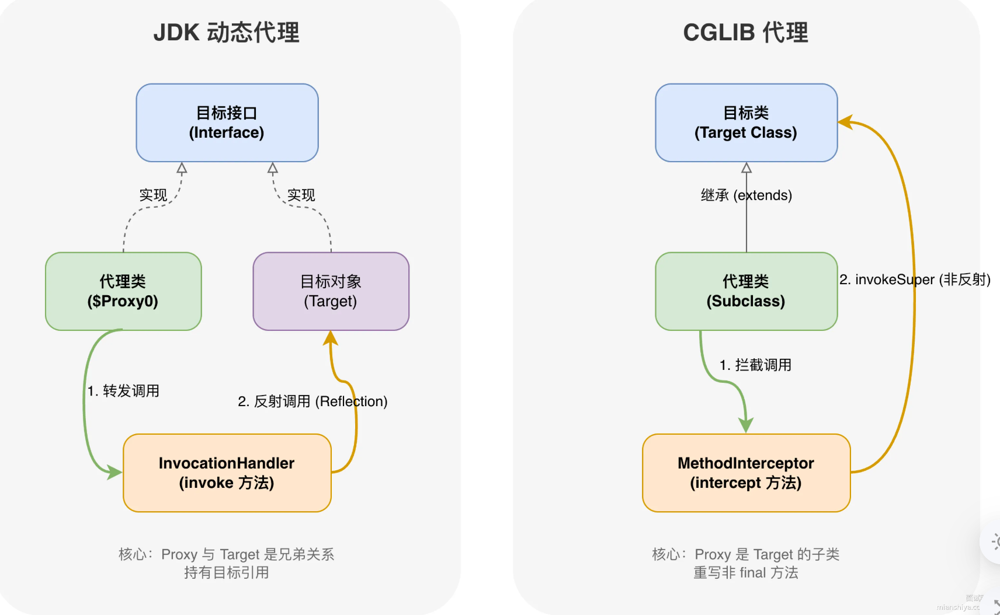
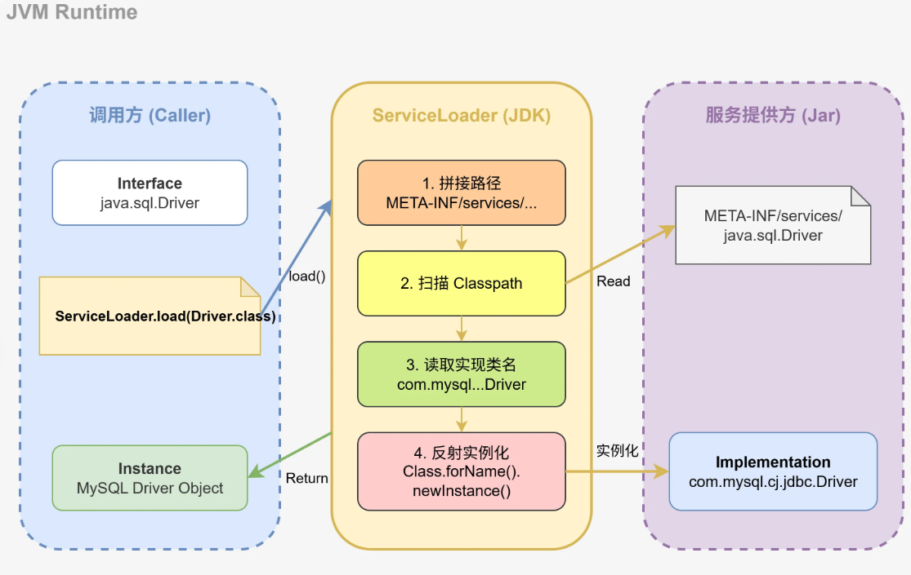
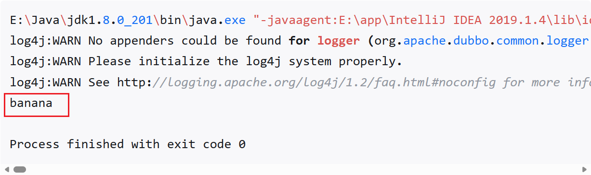
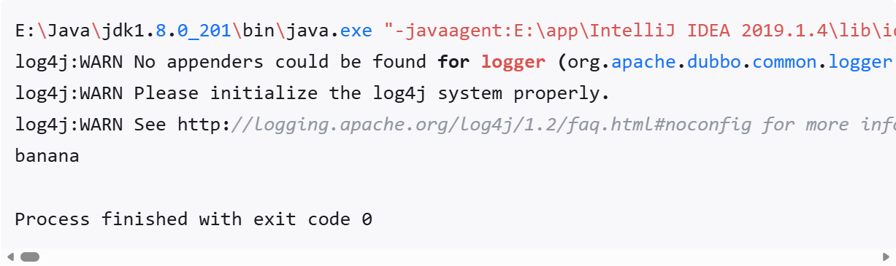

## 1. Java中的序列化和反序列化是什么？
- **序列化**就是把内存中的**Java对象**转成**二进制字节流**，这样才能存到硬盘或者通过网络发给别的机器。
- **反序列化**就是把字节流还原成Java对象。

1. 怎么做：类必须实现Serializable接口，类似许可证，没它JDK序列化机制压根不让你序列化
2. 怎么防：敏感字段比如密码，加个transient关键字，序列化的时候自动跳过
3. 怎么稳：显式定义serialVersionUID，相当于给类打个版本戳，防止改了类结构后反序列化旧数据时报错
```java
public class User implements Serializable {
	private static final long serialVersionUID = 1L;
	
	private String username;
	private transient String password; 
	private int age;
}
```
### transient 和 static 修饰的字段都不会被序列化，它们有什么区别？
本质不同。static字段属于类，压根就不是对象状态的一部分。transient是专门告诉序列化机制“这个实例字段我不想存”。

### 如果父类没有实现Serializable，子类实现了，序列化子类对象时父类的字段会怎样？
父类的字段不会被存进去。反序列化时，子类字段正常恢复，但父类字段会调用父类的可访问无参构造器重新初始化。如果父类没有可访问无参构造器，反序列化直接报错。

### Externalizable接口和Serializable有什么区别？
Serializable是自动序列化，JDK帮你搞定所有字段。Externalizable是手动挡，必须自己实现writeExternal和readExternal方法，一个字段一个字段地写出去、读进来。好处是完全可控，可以做定时优化；坏处是麻烦，漏写一个字段就丢数据。性能要求高的场景可以考虑，一般业务代码用Serializable就够了。

### 为什么说反序列化是Java安全漏洞的重灾区？
反序列化会触发对象的构造过程，如果恶意构造的字节流能让某些特定的方法被执行，就可能造成远程代码执行。典型的就是利用Commons-Collections, Fastjson这些库里的gadget chain，攻击者只要找到一条能从反序列化入口通往危险方法的调用链，就能在服务器上执行任意代码。防御手段包括：升级有漏洞的依赖库、配置反序列化白名单、用JSON替代Java原生序列化。

## 2. Java8有哪些新特性
1. 元空间替代了永久代
2. Lambda表达式。方法引用可以看作是Lambda的一种简写形式，如`System.out::println`
3. 函数式接口，只有一个抽象方法的接口，比如Function，是Lambda的载体。Lambda表达式的本质是函数式接口的匿名实现。
4. 新的日期时间API
5. 接口默认方法和静态方法
6. Stream流式接口
7. Optional类
8. 新增了CompletableFuture、StampedLock等并发实现类

### Optional应该用在什么场景？
主要用在方法返回值中。别用在字段上，增加复杂度。
```java
int pageNum = Optional.ofNullable(params.getPageNum())
    .orElseThrow(() -> new RuntimeException("pageNum不能为空"));
```
### 3. JDK动态代理和CGLIB动态代理有什么区别？
**JDK动态代理**基于接口，代理类必须实现至少一个接口，通过`Proxy.newProxyInstance()`生成代理对象，底层靠反射调用目标方法。
**CGLIB**基于ASM字节码生成工具，通过继承目标生成子类来实现代理，所以不需要接口，但final类和final方法没法代理。
JDK动态代理：代理类实现目标接口，持有目标对象引用，方法调用时通过InvocationHandler转发，最终用反射调用目标方法。

```java
// 接口
public interface Service {
    void perform();
}

// 需要被代理的实现类
public class ServiceImpl implements Service {
    @Override
    public void perform() {
        System.out.println("执行业务逻辑");
    }
}

// InvocationHandler 实现
public class ServiceInvocationHandler implements InvocationHandler {
    private final Object target;

    public ServiceInvocationHandler(Object target) {
        this.target = target;
    }

    @Override
    public Object invoke(Object proxy, Method method, Object[] args) throws Throwable {
        System.out.println("Before method invoke");
        Object result = method.invoke(target, args);
        System.out.println("After method invoke");
        return result;
    }
}

// 创建代理
Service target = new ServiceImpl();
Service proxy = (Service) Proxy.newProxyInstance(
        target.getClass().getClassLoader(),
        target.getClass().getInterfaces(),
        new ServiceInvocationHandler(target)
);
proxy.perform();

```

```java
// 目标类，不需要接口
public class Service {
    public void perform() {
        System.out.println("执行业务逻辑");
    }
}

// MethodInterceptor 实现
public class ServiceMethodInterceptor implements MethodInterceptor {
    @Override
    public Object intercept(Object obj, Method method, Object[] args, MethodProxy proxy) throws Throwable {
        System.out.println("Before method invoke");
        Object result = proxy.invokeSuper(obj, args);  // 直接调用父类方法，不走反射
        System.out.println("After method invoke");
        return result;
    }
}

// 创建代理
Enhancer enhancer = new Enhancer();
enhancer.setSuperclass(Service.class);
enhancer.setCallback(new ServiceMethodInterceptor());
Service proxy = (Service) enhancer.create();
proxy.perform();

```

## 3. 什么是Java的SPI（Service Provider Interface）机制
[Java SPI与Spring SPI全面解析（源码级别讲解）-CSDN博客](https://blog.csdn.net/qq_43599126/article/details/135329933)
SPI是JDK内置的一套**服务发现机制**，核心思想是接口定义在调用方，实现类放在服务提供方，运行时通过配置文件动态加载。调用方完全不知道具体实现类是什么，只要实现方按规矩在META-INF/services目录下放个配置文件，ServiceLoader就能自动发现并下载。

SPI的工作流程：
1. 调用方定义服务接口，比如`java.sql.Driver`
2. 服务提供方实现接口，比如MySQL驱动的`com.mysql.cj.jdbc.Driver`
3. 服务提供方在jar包的 META-INF/services/ 目录下创建以接口全限定名命名的文件
4. 文件内容写实现类的全限定名，一行一个
5. 调用方通过`ServiceLoader.load()`加载所有实现类


```java
// 1. 定义服务接口
public interface PaymentService {
    void pay(BigDecimal amount);
}

// 2. 实现类
public class AlipayService implements PaymentService {
    @Override
    public void pay(BigDecimal amount) {
        System.out.println("支付宝支付: " + amount);
    }
}

// 3. 配置文件 META-INF/services/com.example.PaymentService
// 内容：com.example.AlipayService

// 4. 加载使用
ServiceLoader<PaymentService> loader = ServiceLoader.load(PaymentService.class);
for (PaymentService service : loader) {
    service.pay(new BigDecimal("100"));
}

```

### SPI的缺陷和增强方案
缺陷：
1. **无法按需加载**：ServiceLoader会加载所有实现类，没法指定只要哪一个
2. **没有依赖注入**：实现类只能通过无参构造器创建，想注入参数得自己想办法
3. **扩展性有限**：无法给实现类排序、分组、加条件判断

增强方案：Dubbo的 ExtensionLoader 就是典型的SPI增强版，支持按key获取指定实现、自动注入依赖、支持AOP包装。Spring也有自己的 spring.factories 机制，思路和SPI一样，但功能更强大。

### Dubbo扩展-`@SPI`、`@adaptive`和`Activate`
#### @SPI
- 新建一个interface，并标上注解@SPI（value = "XXX"）

```java
@SPI(value = "apple")
public interface Fruit {
    void printName();
}
```

- 新建两个实现类

```java
public class AppleFruitImpl implements Fruit {
    @Override
    public void printName() {
        System.out.println("apple");
    }
}
```

```java
public class BananaFruitImpl implements Fruit {
    @Override
    public void printName() {
        System.out.println("banana");
    }
}
```

- 在resources下的META-INF目录下新建services文件夹，没有目录就新建，在services下新建文件，文件名为包名+interface名，例如我这个，文件名就叫org.apache.dubbo.registry.zookeeper.Fruit，文件类型选择txt就可以了，内容为key=alue的形式填写，用换行隔开，key可以填任意值，但不能为空，value为实现类的全路径名。例如：

```ymal
apple=org.apache.dubbo.registry.zookeeper.AppleFruitImpl
banana=org.apache.dubbo.registry.zookeeper.BananaFruitImpl
```

- 现在要注意Fruit的@SPI注解的value的值，如果value="apple"，通过ExtensionLoader，得到的应该是AppleFruitImpl，如果是banana，得到的应该是BananaFruitImpl，这与上面填的txt文件相关联。ok，这里填“apple”，然后跑个main方法验证：

```java
public class MainTest {
    public static void main(String[] args) {
        ExtensionLoader<Fruit> extensionLoader = ExtensionLoader.getExtensionLoader(Fruit.class);
        Fruit fruit = extensionLoader.getDefaultExtension();
        fruit.printName();
    }
}
```

- 运行结果

```java
log4j:WARN No appenders could be found for logger (org.apache.dubbo.common.logger.LoggerFactory).
log4j:WARN Please initialize the log4j system properly.
log4j:WARN See http://logging.apache.org/log4j/1.2/faq.html#noconfig for more info.
apple

Process finished with exit code 0
```
#### @adaptive
@adaptive标注一般标注在接口的方法上，也可以标注在类，枚举类，方法上，但是比较少见，@adaptive标注在接口方法上时，要求接口方法入参中有一个URL，这个URL类是org.apache.dubbo.common.URL**，**注解的功能是可以根据方法中URL的入参，来选择对哪一个实现进行调用，使用如下：

- 首先给interface加上入参，然后给接口方法加上@adaptive注解，设置value的默认值是“key1”

```java
@SPI(value = "apple")
public interface Fruit {

    @Adaptive(value = "key1")
    void printName(URL url);
}
```

- 再给它的两个实现类加上入参

```java
public class AppleFruitImpl implements Fruit {
    @Override
    public void printName(URL url) {
        System.out.println("apple");
    }
}
```

```java
public class BananaFruitImpl implements Fruit {
    @Override
    public void printName(URL url) {
        System.out.println("banana");
    }
}
```

- 对main方法做一些改动：new一个URL实例，注意url后面的“key1”=“banana”，然后通过getAdaptiveExtension（）方法获得实例。main方法改造后如下：

```java
public class MainTest {
    public static void main(String[] args) {
        URL url = URL.valueOf("dubbo://127.0.0.1:20880?key1=banana");
        ExtensionLoader<Fruit> extensionLoader = ExtensionLoader.getExtensionLoader(Fruit.class);
        Fruit fruit = extensionLoader.getAdaptiveExtension(); //注意这个方法有改动！！
        fruit.printName(url);
    }
}
```

- 虽然指定了@SPI(value="apple")，默认获得的实现类是AppleFruitImpl，但是由于在url中指定了"key1"="banana"，并且在@Adaptive注解上设置了关键字“key1”，那么@Adaptive的优先级应该高于@SPI，结果如下：

```java
log4j:WARN No appenders could be found for logger (org.apache.dubbo.common.logger.LoggerFactory).
log4j:WARN Please initialize the log4j system properly.
log4j:WARN See http://logging.apache.org/log4j/1.2/faq.html#noconfig for more info.
banana

Process finished with exit code 0
```
#### @Activate
这个注解相比前面两个就复杂了很多，它既可以通过value值去匹配，同时也可以通过group值去匹配，注解源码如下：

```java
@Documented
@Retention(RetentionPolicy.RUNTIME)
@Target({ElementType.TYPE, ElementType.METHOD})
public @interface Activate {
    String[] group() default {};

    String[] value() default {};

    @Deprecated
    String[] before() default {};

    @Deprecated
    String[] after() default {};

    int order() default 0;
}
```

可以看到，他有五个参数可选，分别是：

- group：URL中的分组如果匹配就会被激活，可以设置多个。
- value ：查找URL中如果含有该key的值，就会激活。
- before：这是用来排序的，表示哪些扩展点要在被扩展点之前。
- after：也是用来排序的，表示哪些扩展点要在本扩展点之后。
- order：这是一个int类型，用来表示正序/倒序。

下面用一个简单demo来说明group和value是如何使用的：

- 将接口Fruit恢复如下，设置默认实现类是apple：

```java
package org.apache.dubbo.registry.zookeeper;

import org.apache.dubbo.common.URL;
import org.apache.dubbo.common.extension.SPI;

@SPI(value = "apple")
public interface Fruit {
    
    void printName(URL url);
}
```

- AppleFruitImpl 不变

```java
public class AppleFruitImpl implements Fruit {
    @Override
    public void printName(URL url) {
        System.out.println("apple");
    }
}
```

- BananaFruitImpl加上@Activate注解，先测试group，所以先设置group="2"

```java
@Activate(group = "2")
public class BananaFruitImpl implements Fruit {
    @Override
    public void printName(URL url) {
        System.out.println("banana");
    }
}
```

- main方法如下：

```java
public class MainTest {
    public static void main(String[] args) {
        URL url = URL.valueOf("dubbo://127.0.0.1:20880");
        ExtensionLoader<Fruit> extensionLoader = ExtensionLoader.getExtensionLoader(Fruit.class);
        List<Fruit> fruitList = extensionLoader.getActivateExtension(url, new String[]{}, "2");
        fruitList.forEach(fruit -> fruit.printName(url));
    }
}
```

- 通过getActivateExtension方法获取实现类，入参一个group：“2”，这时会激活所有group为“2”的扩展类，结果如下：



- 将BananaFruitImpl的@Activate注解中的group去掉，加上value=“kk”

```java
@Activate(value = "kk")
public class BananaFruitImpl implements Fruit {
    @Override
    public void printName(URL url) {
        System.out.println("banana");
    }
}
```

- 将main方法中的URL加入参数“kk”：

```java
    public static void main(String[] args) {
        URL url = URL.valueOf("dubbo://127.0.0.1:20880");
        url = url.addParameter("kk", "564"); //564是我随便填的
        
        ExtensionLoader<Fruit> extensionLoader = ExtensionLoader.getExtensionLoader(Fruit.class);
        List<Fruit> fruitList = extensionLoader.getActivateExtension(url, new String[]{}, "");
        for (Fruit fruit : fruitList) {
            fruit.printName(url);
        }
    }
```

- 输出如下，实际上，group的优先级是要大于value的，先用group筛选一遍，然后如果有value，在通过value匹配。



  

三个注解的使用方法到这就写完了，他们的使用难度，灵活性和复杂度都是层层递进的，这使得扩展机制在dubbo这个框架里发挥了很大的作用，它能够根据url灵活的判断该使用哪个实现，这也是dubbo比Java SPI强大的地方。后面会逐一解析各个注解的原理。

### ServiceLoader是线程安全的吗？
ServiceLoader实例本身不是线程安全的，多线程并发迭代会出问题。每次调用ServiceLoader.load()都会返回新实例，内部状态不共享。如果要在多线程环境用，要么每个线程各自load一份，要么把加载结果缓存到线程安全的容器里。


## 4. Java的类加载过程是怎样的？

- **加载**：把二进制流读进内存，在方法区生成类的运行时数据结构，同时在堆里创建一个Class对象作为访问入口。
- 连接
	- **验证**
	- **准备**：给类变量（static修饰的变量）分配内存并设置初始零值。（注意：如果是`static final int a = 123`，编译期就确定了，准备阶段直接赋值123）
	- **解析**：把常量池里的符号引用替换成直接引用。符号引用就是一个字符串形式的标识，比如`java/lang/Object`；直接引用是真正的内存地址或偏移量，能直接定位到目标。
- **初始化**：执行构造器`<clinit>()`方法，该方法顺序执行静态变量的赋值和静态代码块中的内容。

### 类加载器的层次结构
JVM的类加载采用双亲委派模型，有三种内置的类加载器：
1. **Bootstrap ClassLoader**：最顶层的加载器，C++实现的，负责加载`JAVA_HOME/lib`目录下的核心类库，比如`rt.jar`、`tools.jar`。在Java代码里拿不到它的引用，返回的是null
2. **Extension ClassLoader**：负责加载`JAVA_HOME/lib/ext`目录下的扩展库类
3. **Application ClassLoader**：加载classpath下的类，也就是我们自己写的代码和引入的第三方jar包

### 打破双亲委派的场景
1. **SPI机制**。JDBC的Driver接口定义在rt.jar里，由Bootstrap ClassLoader加载，但具体实现（比如MySQL驱动）在classpath下，Bootstrap ClassLoader加载不到。这时候用Thread.currentThread().getContextClassLoader()获取线程上下文类加载器来加载。
2. **热部署**。Tomcat为了让不同Web应用的同名类互不干扰，每个应用都有自己的WebAppClassLoader，而且是优先自己加载，加载不到才委派给父加载器。
3. **模块化系统**。JDK 9引入的模块化打破了原来的双亲委派，类加载变成了在模块图中按依赖关系找。