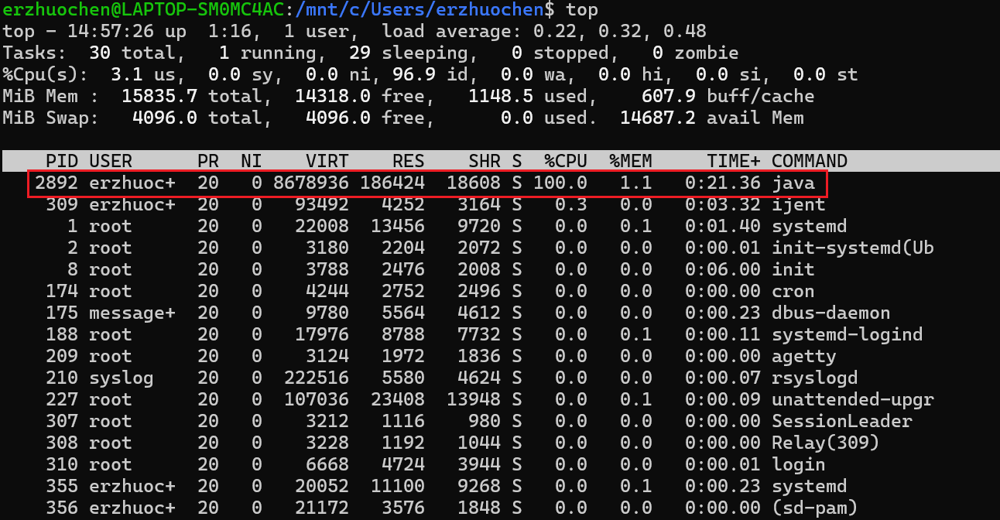
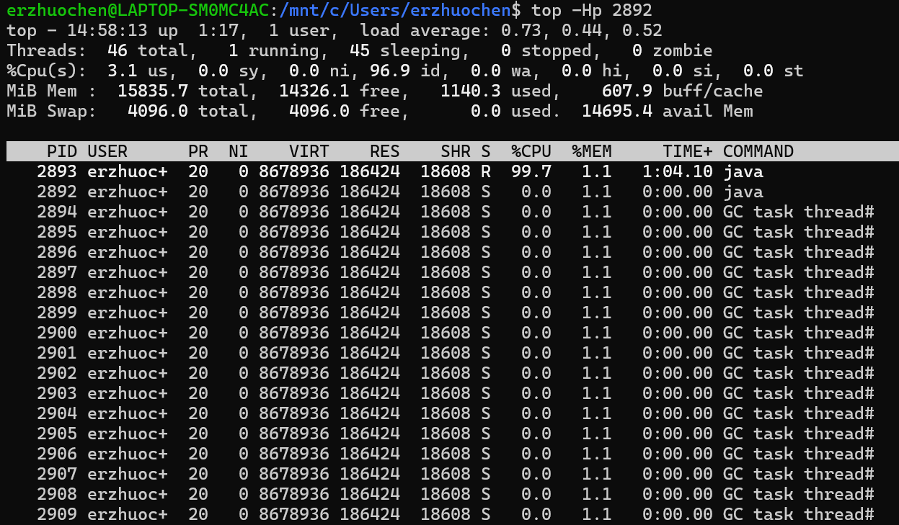
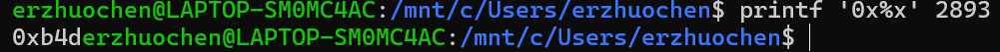
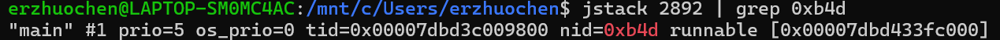
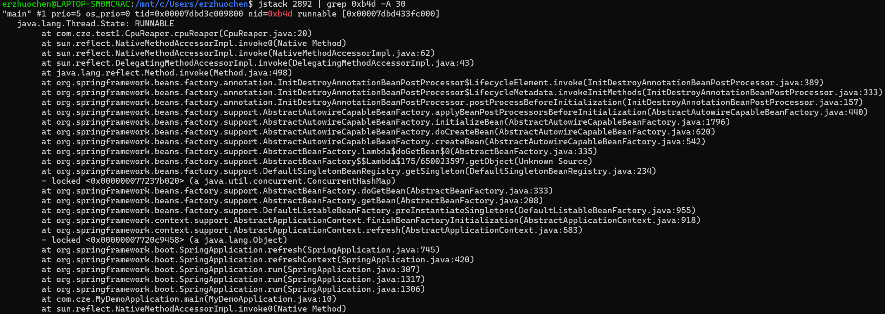
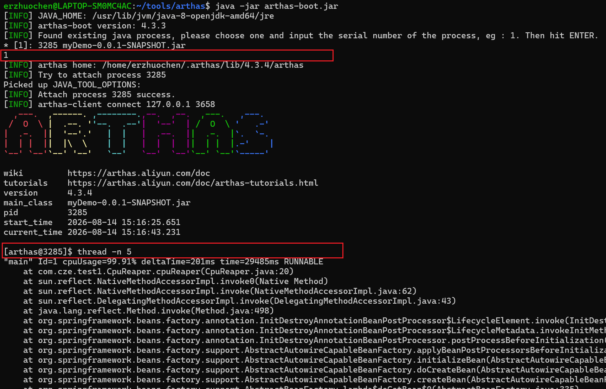

# 1. Java基础、线程池、JVM
[Java 应用线上问题排查思路、常用工具小结_java线上调试工具 查询静态map的数据-CSDN博客](https://blog.csdn.net/zl1zl2zl3/article/details/107309983)

## CPU利用率高/飙升
**常见原因**：
- 频繁gc
- 死循环、线程阻塞、io wait

**第一步：定位出问题的线程**
方法a：传统的方法
1. top定位CPU最高的进程
   执行top命令，查看所有进程占系统CPU的排序，定位是哪个进程搞的鬼。
2. `top -Hp pid` 定位使用CPU最高的线程
3. printf '0x%x' pid
4. jstack pid | grep tid 找到线程堆栈
方法b:arthas thread


**后续**
情况一：发现使用CPU最高的都是GC线程
```shell
GC task thread#0 (ParallelGC)" os_prio=0 tid=0x00007fd99001f800 nid=0x779 runnableGC task thread#1 (ParallelGC)" os_prio=0 tid=0x00007fd990021800 nid=0x77a runnable GC task thread#2 (ParallelGC)" os_prio=0 tid=0x00007fd990023000 nid=0x77b runnable GC task thread#3 (ParallelGC)" os_prio=0 tid=0x00007fd990025000 nid=0x77c runnabl
```
情况二：发现使用CPU最高的是业务线程
- io wait
	- 比如此例中，就是因为磁盘空间不够导致的io阻塞
- 锁竞争导致CPU大量消耗，阻塞时不消耗CPU
	- jstack -l pid | grep BLOCKED 查看阻塞态线程堆栈
	- dump线程栈，分析线程持锁情况
	- arthas提供了thread -b，可以找出**当前阻塞其他线程的线程**。针对synchronized情况
## 频繁GC
- 方法a：查看gc日志
- 方法b：jstat -gcutil 进程号 统计间隔毫秒 统计次数
- 方法c：如果所有公司有对应用进行监控的组件当然更方便（比如Prometheus + Grafana）

> HotSpot JVM有一类特别的参数叫做可管理的参数。对于这些参数，可以在运行时修改他们的值。我们这里所讨论的所有参数以及以“PrintGC”开头的参数都是可管理的参数。这样在任何时候我们都可以开启或是关闭GC日志。比如我们可以使用JDK自带的**jinfo**工具来设置这些参数，或者是通过JMX客户端调用`HotSpotDiagnostic MXBean`的**setVMOption**方法来设置这些参数。
> 这里再次大赞arthas，它提供的`vmoption`命令可以直接查看，更新VM诊断相关的参数。

获取到gc日志后，可以上传到GC easy帮助分析，得到可视化的图标分析结果

### GC原因及定位

**prommotion failed**
从S区晋升的对象在老年代也放不下导致FullGC（fgc回收无效则抛OOM）
可能原因：
- survivor区太小，对象过早进入老年代：查看SurvivorRatio参数
- 大对象分配：没有足够的内存：dump堆，profiler/MAT分析对象占用情况
- old区存在大量对象：dump堆，profiler/MAT分析对象占用情况
你也可以从full GC 的效果来推断问题，正常情况下，一次full GC应该会回收大量内存，所以 **正常的堆内存曲线应该是呈锯齿形**。如果你发现full gc 之后堆内存几乎没有下降，那么可以推断：**堆中有大量不能回收的对象且在不停膨胀，使堆的使用占比超过full GC的触发阈值，但又回收不掉，导致full GC一直执行。换句话来说，可能是内存泄露了。

一般来说，GC相关的异常推断都需要涉及到**内存分析**，使用`jmap`之类的工具dump出内存快照（或者 Arthas的`heapdump`）命令，然后使用MAT、JProfiler、JVisualVM等可视化内存分析工具。

至于内存分析之后的步骤，就需要小伙伴们根据具体问题具体分析啦。

## 线程池异常
#### 场景预设：

业务监控突然告警，或者外部反馈提示大量请求执行失败。

#### 异常说明：

Java 线程池以有界队列的线程池为例，当新任务提交时，如果运行的线程少于 corePoolSize，则创建新线程来处理请求。如果正在运行的线程数等于 corePoolSize 时，则新任务被添加到队列中，直到队列满。当队列满了后，会继续开辟新线程来处理任务，但不超过 maximumPoolSize。当任务队列满了并且已开辟了最大线程数，此时又来了新任务，ThreadPoolExecutor 会拒绝服务。

#### 常见问题和原因

这种线程池异常，一般可以通过开发查看日志查出原因，有以下几种原因：

1. 下游服务 响应时间（RT）过长
    
    这种情况有可能是因为下游服务异常导致的，作为消费者我们要设置合适的超时时间和熔断降级机制。
    
    另外针对这种情况，一般都要有对应的监控机制：比如日志监控、metrics监控告警等，不要等到目标用户感觉到异常，从外部反映进来问题才去看日志查。
    
2. 数据库慢 sql 或者数据库死锁
    

查看日志中相关的关键词。

1. Java 代码死锁
    
    `jstack –l pid | grep -i –E 'BLOCKED | deadlock'`

## Arthas
- dashboard ：系统实时数据面板, 可查看线程，内存，gc 等信息
    
- thread ：查看当前线程信息，查看线程的堆栈，如查看最繁忙的前 n 线程
    
- getstatic：获取静态属性值，如 `getstatic className attrName` 可用于查看线上开关真实值
    
- sc：查看 jvm 已加载类信息，可用于排查 jar 包冲突
    
- sm：查看 jvm 已加载类的方法信息
    
- jad：反编译 jvm 加载类信息,排查代码逻辑没执行原因
    
- logger：查看logger信息，更新logger level
    
- watch：观测方法执行数据，包含出参、入参、异常等
    
- trace：方法内部调用时长，并输出每个节点的耗时，用于性能分析
    
- tt：用于记录方法，并做回放

# 2. MySQL死锁、事务、编码、慢查询


# 3. Redis高可用、高性能、分布式锁


# 4. Kafka


# 5. Spring Boot


# 6. 网络