# 项目相关

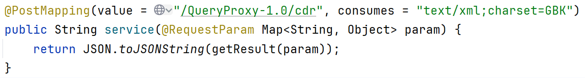


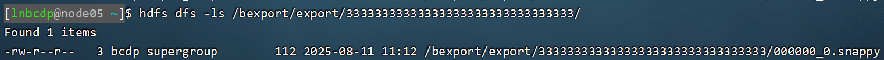

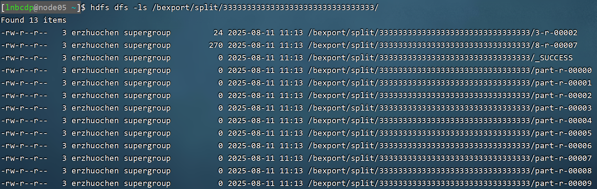

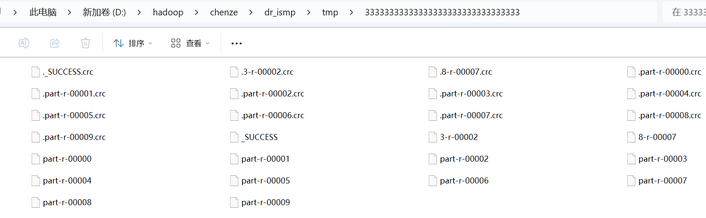

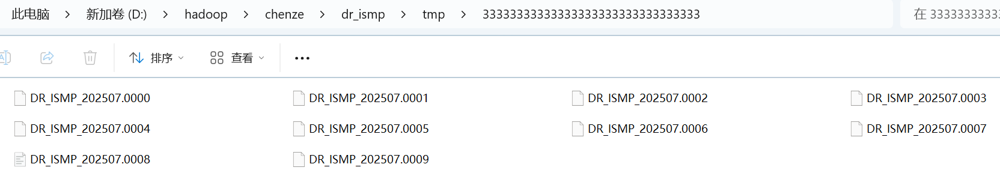

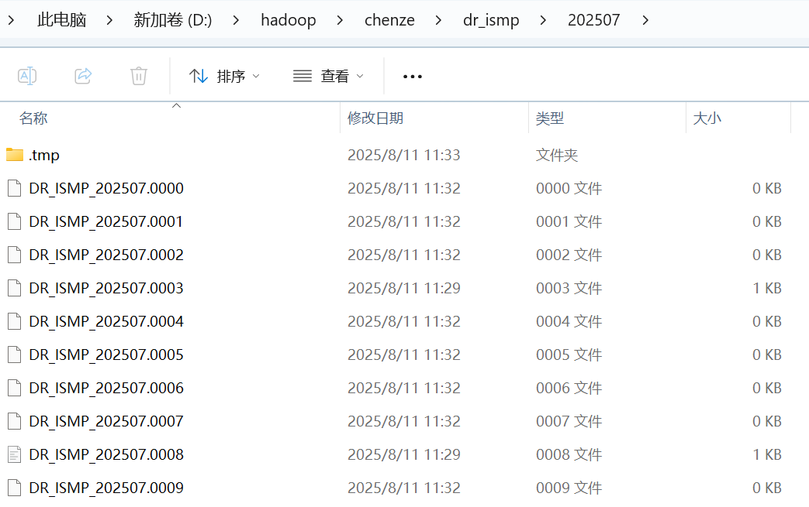


```
INSERT OVERWRITE DIRECTORY '%s' ROW FORMAT DELIMITED FIELDS TERMINATED BY '%s' SELECT %s FROM %s WHERE %s
```

## 改动

1. 增加子表对应的父表的导出配置编号。（若编号等于0，则它是父表）
2. 在日志表中增加文件大小字段


## 报错

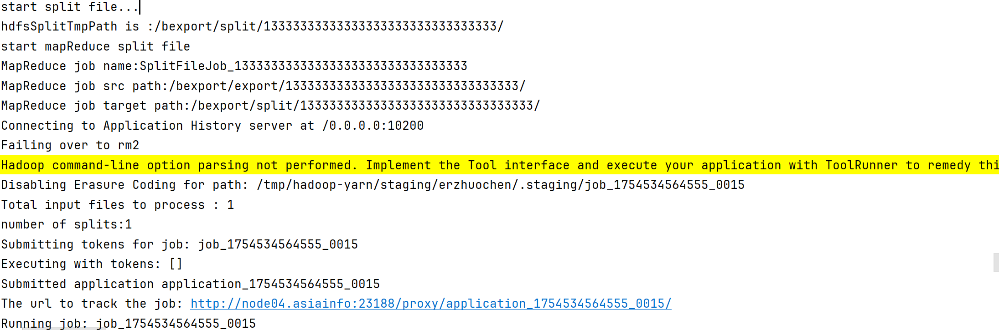


## 需要修改的地方

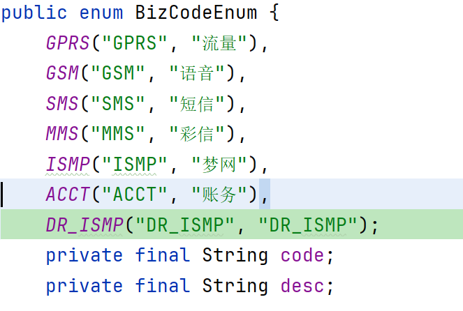

# 一、Quartz框架

Quartz的核心类有以下三部分：

- 任务**Job**：需要实现的任务类，实现`execute()`方法，执行后完成任务
- 触发器**Trigger**：包括`SimpleTrigger`和`CronTrigger`。
- 调用器**Scheduler**：任务调度器，负责基于`Trigger`触发器，来执行Job任务

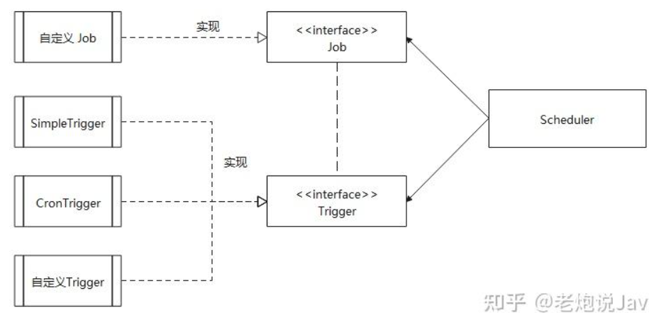

## 1、Demo

依赖：

```java
<!-- 核心包 -->
<dependency>
    <groupId>org.quartz-scheduler</groupId>
    <artifactId>quartz</artifactId>
    <version>2.3.0</version>
</dependency>
<!-- 工具包 -->
<dependency>
    <groupId>org.quartz-scheduler</groupId>
    <artifactId>quartz-jobs</artifactId>
    <version>2.3.0</version>
</dependency>
```

新建一个任务，实现了`org.quartz.Job·接口：

```java
public class MyJob implements Job {
    @Override
    public void execute(JobExecutionContext context) throws JobExecutionException {
        System.out.println("任务被执行了。。。");
    }
}
```

main方法，创建调度器、jobDetail实例、trigger实例、执行：

```java
public static void main(String[] args) throws Exception {
    // 1.创建调度器 Scheduler
    SchedulerFactory factory = new StdSchedulerFactory();
    Scheduler scheduler = factory.getScheduler();

    // 2.创建JobDetail实例，并与MyJob类绑定(Job执行内容)
    JobDetail job = JobBuilder.newJob(MyJob.class)
        .withIdentity("job1", "group1")
        .build();

    // 3.构建Trigger实例,每隔30s执行一次
    Trigger trigger = TriggerBuilder.newTrigger()
        .withIdentity("trigger1", "group1")
        .startNow()
        .withSchedule(simpleSchedule()
                      .withIntervalInSeconds(30)
                      .repeatForever())
        .build();

    // 4.执行，开启调度器
    scheduler.scheduleJob(job, trigger);
    System.out.println(System.currentTimeMillis());
    scheduler.start();

    //主线程睡眠1分钟，然后关闭调度器
    TimeUnit.MINUTES.sleep(1);
    scheduler.shutdown();
    System.out.println(System.currentTimeMillis());
}
```

日志：

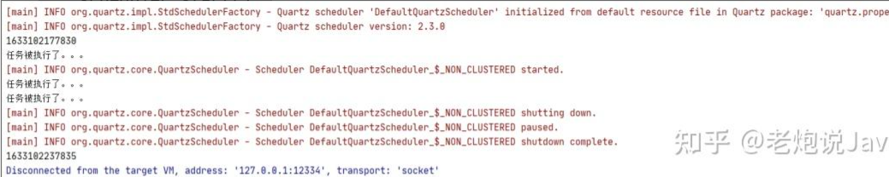


## 2. JobDetail

JobDetail的作用是绑定Job，是一个任务实例，它为Job添加了许多扩展参数。

| 主要字段   | 通义、作用                                                   |
| ---------- | ------------------------------------------------------------ |
| name       | 任务名称                                                     |
| group      | 任务分组，默认分组DEFAULT                                    |
| jobClass   | 任务类，就是上面Demo中的`MyJob`的路径                        |
| jobDataMap | 任务参数信息。JobDetail、Trigger都可以使用JobDataMap来设置一些参数或信息 |

### 为什么设计成JobDetail + Job，不直接使用Job

JobDetail定义的是任务数据，而真正的执行逻辑是在Job中。

这是因为任务可能并发执行，如果Scheduler直接使用Job，就会存在对同一个Job实例并发访问的问题。

而 JobDetail & Job 方式，Sheduler每次执行，都会根据JobDetail创建一个新的Job实例，这样就可以规避并发访问的问题。


### JobExecutionContext

- 当`Scheduler`调用一个job，就会将`JobExecutionContext`传递给Job的`execute()`方法
- Job能通过`JobExecutionContext`对象访问到Quartz运行时候的环境以及Job本身的明细数据。

```text
public interface Job {
    void execute(JobExecutionContext context)
        throws JobExecutionException;
}
```


在`Builder`建造过程中，可以使用如下方法：

```java
usingJobData("tiggerDataMap", "测试传参")
```

在`execute`方法中获取：

```text
context.getTrigger().getJobDataMap().get("tiggerDataMap");
context.getJobDetail().getJobDataMap().get("tiggerDataMap");
```


### Job状态参数

有状态的job可以理解为多次job调用期间可以持有一些状态信息，这些信息存储在`JobDataMap`中。

而默认的无状态job，每次调用时都会创建一个新的`JobDataMap`。

示例如下：

```java
//多次调用 Job 的时候，将参数保留在 JobDataMap
@PersistJobDataAfterExecution // 该注解标识的Job类会在每次执行后自动将JobDataMap的修改持久化到数据库或内存
public class JobStatus implements Job {
    @Override
    public void execute(JobExecutionContext context) throws JobExecutionException {
        long count = (long) context.getJobDetail().getJobDataMap().get("count");
        System.out.println("当前执行，第" + count + "次");
        context.getJobDetail().getJobDataMap().put("count", ++count);
    }
}

JobDetail job = JobBuilder.newJob(JobStatus.class)
                .withIdentity("statusJob", "group1")
                .usingJobData("count", 1L)
                .build();
```

输出结果：

```text
当前执行，第1次
[main] INFO org.quartz.core.QuartzScheduler - Scheduler DefaultQuartzScheduler_$_NON_CLUSTERED started.
当前执行，第2次
当前执行，第3次
```


## 3. Trigger


### 定时启动/关闭

```java
Calendar instance = Calendar.getInstance();
Date startTime = instance.getTime();
instance.add(Calendar.MINUTE, 1);
Date endTime = instance.getTime();

// 3.构建Trigger实例
Trigger trigger = TriggerBuilder.newTrigger()
    .withIdentity("trigger1", "group1")
    // 开始时间
    .startAt(startTime)
    // 结束时间
    .endAt(endTime)
    .build();
```


在job中也能拿到对应的时间，并进行业务判断

```java
public void execute(JobExecutionContext context) throws JobExecutionException {
    System.out.println("任务执行。。。");
    System.out.println(context.getTrigger().getStartTime());
    System.out.println(context.getTrigger().getEndTime());
}
```

运行结果：

```text
[main] INFO org.quartz.impl.StdSchedulerFactory - Quartz scheduler version: 2.3.0
1633149326723
任务执行。。。
Sat Oct 02 12:35:26 CST 2021
Sat Oct 02 12:36:26 CST 2021
[main] INFO org.quartz.core.QuartzScheduler - Scheduler DefaultQuartzScheduler_$_NON_CLUSTERED started.
```

### SimpleTrigger

使用场景：

- **在指定时间段，执行一次任务**：最基础的Trigger不设置循环，设置开始时间
- **在指定时间段内，循环执行任务**：在上一条基础上加上循环间隔。可以指定永远循环、运行指定次数

```java
TriggerBuilder.newTrigger()
    .withSchedule(SimpleScheduleBuilder
                  .simpleSchedule()
                  .withIntervalInSeconds(30)
                  .repeatForever())
```

`withRepeatCount(count)`是重复次数，实际运行次数为`count+1`

```java
TriggerBuilder.newTrigger()
    .withSchedule(SimpleScheduleBuilder
                  .simpleSchedule()
                  .withIntervalInSeconds(30)
                  .withRepeatCount(5))
```

- 立即开始，指定时间结束

略


### CronTrigger

基于日历的任务调度器

```java
TriggerBuilder.newTrigger().withSchedule(CronScheduleBuilder.cronSchedule("* * * * * ?"))
```

**通配符：**

\* 表示所有值； 

? 表示未说明的值，即不关心它为何值； 

\- 表示一个指定的范围； 

, 表示附加一个可能值； 

/ 符号前表示开始时间，符号后表示每次递增的值；

**cron表达式案例：**

*/5 * * * * ? 每隔5秒执行一次

0 */1 * * * ? 每隔1分钟执行一次

0 0 5-15 * * ? 每天5-15点整点触发

0 0/3 * * * ? 每三分钟触发一次

0 0-5 14 * * ? 在每天下午2点到下午2:05期间的每1分钟触发 

0 0/5 14 * * ? 在每天下午2点到下午2:55期间的每5分钟触发

0 0/5 14,18 * * ? 在每天下午2点到2:55期间和下午6点到6:55期间的每5分钟触发

0 0/30 9-17 * * ? 朝九晚五工作时间内每半小时

0 0 10,14,16 * * ? 每天上午10点，下午2点，4点 


# 二、hive


## 1. 名词解释

### 1.1 metadata和metastore

metadata：元数据，包含用hive创建的database、table等的元信息

Metastore的作用：客户端连接metastore服务，metastore再去连接MySQL数据库来存取元数据。有了metastore服务，就可以有多个客户端同时连接，而且这些客户端不需要知道MySQL数据库的用户名和密码，只需要连接metastore服务即可。

Metastore有三种配置方式，分别是：

- Embedded Metastore Database(Derby) **内嵌模式**：使用内嵌的Derby数据库来存储元数据，也不需要额外起Metastore服务。这个是默认的，配置简单，但是一次只能一个客户端连接，适用于用来实验，不适用于生产环境。
- Local Metastore Server **本地元存储**：采用外部数据库来存储元数据，不需要单独起metastore服务，用的是跟hive在同一个进程里的metastore服务。
- RemoteMetastore Server **远程元存储**：采用外部数据库来存储元数据，需要单独起metastore服务，然后每个客户端都在配置文件里配置连接到该metastore服务。远程元存储的metastore服务和hive运行在不同的进程里。

### 1.2 Yarn

Yarn是一个JS包管理工具

## 2. hive本质

Hive是一个Hadoop客户端，用于将HQL（Hive SQL）转化成MapReduce程序

1. Hive中每张表的数据存储在HDFS
2. Hive分析数据底层的实现是MapReduce（也可配置为Spark或者Tez）
3. 执行程序运行在Yarn上

## 3. hive架构

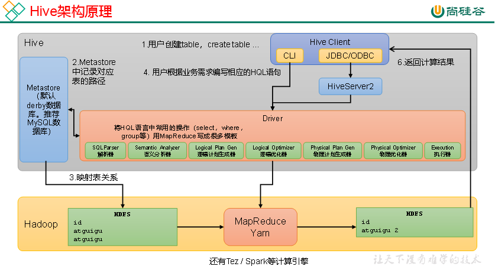

1. 用户接口：Client
   CLI（command-line interface）、JDBC/ODBC。
   说明：JDBC和ODBC的区别
   （1）

1. 元数据：Metastore
   存储元数据，包括表的名字、表的属性、表的列和分区及其属性、表的数据所在目录等。元数据被存储在单独的关系型数据库中。MetaStore提供Thrift界面供用户查询和管理元数据。
2. 驱动器：Driver


## 4. Hive的数据存储模型

Hive主要包括数据模型：表（Table）、分区（Partition）、桶（Bucket）

Hive中的表类似关系数据库中的表。表的数据一般存储在HDFS的目录中，Hive的表实质上对应Hadoop文件系统上的一个目录。Hive将表的元数据存储在关系型数据库中，实现了元数据与数据的分离存储。

Hive根据分区列（Partition Column）的值将表以分区的形式进行划分，例如具有“日期”分区列的表可以根据日期分为多个分区。表中的一个分区对应表所在目录下的一个子目录。

### 1）Hive的分区和分桶

当表数据量较大时，Hive通过列值（如日期、地区等）对表进行分区处理（Partition），便于局部数据的查询操作。每个分区是一个目录，将相同属性的数据放在同一个目录下，可提高查询效率。分区数量不固定，分区下可再有分区或者进一步细化为桶。

Hive可将表或分区进一步组织成桶，桶是比分区粒度更细的数据划分方式。每个桶是一个文件，用户可指定划分桶的个数。在分桶的过程中，Hive针对某一列进行哈希计算，根据哈希值将这一列中的数据划分到不同的桶中。分桶为表提供了额外的结构，Hive在处理某些查询（如join、表的合并）时利用这个结构可以提高效率，使数据抽样更高效。


### 2）Hive的托管表和外部表

- 托管表（内部表）：Hive默认创建托管表，托管表由Hive来管理数据，意味着Hive会将数据移动到数据仓库的目录中。在做删除表的操作时，托管表的元数据和数据会被一起删除。需要使用桶时，必须使用托管表。
- 外部表：若创建外部表，Hive仅记录数据所在路径，不将其移动到数据仓库目录中。在读取外部表时，Hive会在数据仓库之外读取数据。在做删除表的操作时，外部表仅删除元数据。外部表更安全，也利于数据的共享。


# 三、hive分区

## 1.基本概念

hive中分区表分为：范围分区、列表分区、hash分区、混合分区等。

**分区列**：分区列不是表中的一个实际的字段，而是一个或者多个伪列。翻译一下就是：“<u>在表的数据文件中实际上并不保存分区列的信息和数据</u>”


### 1.1 创建数据表

```hive
create table partition_test(
  member_id string,
  name string
)
partitioned by //下面的是分区列
(
  stat_date string, 
  province string
)
ROW FORMAT DELIMITED FIELDS TERMINATED BY ',';
```

### 1.2 创建分区

如果要添加数据，通常情况下我们需要先创建好分区，然后才能使用该分区。例如：

```hive
alter table partition_test add partition (stat_date='20141113',province='jilin');
```

这样就创建好了一个分区。我们会看到hive在HDFS存储中创建了一个相应的文件夹：

```hive
hive> dfs -ls /user/ticketdev/hive/warehouse/partition_test/stat_date=20141113;
Found 1 items
drwxr-xr-x   - ticketdev ticketdev          0 2014-11-13 17:50 /user/ticketdev/hive/warehouse/partition_test/stat_date=20141113/province=jilin
h
```

每个分区都会有一个独立的文件夹，在这个例子中stat_date是主文件夹，province是子文件夹，如：

```hive
hive> alter table partition_test add partition (stat_date='20141113',province='beijing');     
OK
Time taken: 0.119 seconds
hive> dfs -ls /user/ticketdev/hive/warehouse/partition_test/stat_date=20141113/;              
Found 2 items
drwxr-xr-x   - ticketdev ticketdev          0 2014-11-13 18:06 /user/ticketdev/hive/warehouse/partition_test/stat_date=20141113/province=beijing
drwxr-xr-x   - ticketdev ticketdev          0 2014-11-13 17:50 /user/ticketdev/hive/warehouse/partition_test/stat_date=20141113/province=jilin
```

## 2. 静态分区

### 2.1 数据准备

使用一个辅助的非分区表partition_test_input准备向partition_test中插入数据：

```hive
hive> desc partition_test_input;
OK
stat_date string
member_id string
name string
province string

hive> select * from partition_test_input;
OK
20110526 1 liujiannan liaoning
20110526 2 wangchaoqun hubei
20110728 3 xuhongxing sichuan
20110728 4 zhudaoyong henan
20110728 5 zhouchengyu heilongjiang
```


### 2.2 添加数据

向partition_test的分区中插入数据：

```hive
hive> insert overwrite table partition_test partition(stat_date='20110728',province='henan') select member_id,name from partition_test_input where stat_date='20141113' and province='beijing';
Total MapReduce jobs = 2
...
1 Rows loaded to partition_test
OK
```

还可以向多个分区插入数据：

```hive
hive>
> from partition_test_input
> insert overwrite table partition_test partition (stat_date='20110526',province='liaoning')
> select member_id,name where stat_date='20110526' and province='liaoning'
> insert overwrite table partition_test partition (stat_date='20110728',province='sichuan')
> select member_id,name where stat_date='20110728' and province='sichuan'
> insert overwrite table partition_test partition (stat_date='20110728',province='heilongjiang')
> select member_id,name where stat_date='20110728' and province='heilongjiang';
Total MapReduce jobs = 4
...
3 Rows loaded to partition_test
OK
```


## 3. 动态分区

使用动态分区要先设置`hive.exec.dynamic.partition`参数为true，默认值为false

动态分区的使用：

```hive
hive> insert overwrite table partition_test partition(stat_date='20110728',province)
> select member_id,name,province from partition_test_input where stat_date='20110728';
Total MapReduce jobs = 2
...
3 Rows loaded to partition_test
OK
```


## 4. 其他参数

- hive.exec.max.dynamic.partitions.pernode （缺省值100）：每一个mapreduce job允许创建的分区的最大数量，如果超过了这个数量就会报错
- hive.exec.max.dynamic.partitions （缺省值1000）：一个dml语句允许创建的所有分区的最大数量
- hive.exec.max.created.files （缺省值100000）：所有的mapreduce job允许创建的文件的最大数量


# 四、B树

为什么使用B树？
假设我们的数据量达到了亿级别，主存中存不下，我们只能以块的形式从磁盘读取数据，磁盘的I/O操作相当耗时，而提出B-树的主要目的就是减少磁盘的I/O操作。对于B-树，树的高度不再是logn，而是一个我们可控的高度h（通过调整B-树中节点所包含的键【也可以叫数据库中的索引，本质上就是在磁盘上的一个位置信息】的数目，使得B-树的高度保持一个较小的值）。一般而言，B-树的节点所包含的键的数目和磁盘块大小一样，从数个到数千不等。由于B-树的高度h可控（一般远小于logn），所以与AVL树和红黑树相比，B-树的磁盘访问时间将极大地降低。

### 2.1 B树的特性


# 五、mysql 索引

## 1. 应该创建索引的类

- 经常需要搜索的列
- 主键的列：强调该列的唯一性和组织表中数据的排列结构
- 经常用在连接（JOIN）的列
- 经常需要根据范围（<, <=, =, >, >=, BETWEEN, IN）进行搜索的列：因为索引已经排序，其指定的范围是连续的
- 经常需要排序的列
- 经常使用在WHERE子句中的列

## 2. 不该创建索引的列

- 很少使用或者参考的列
- 很少数据值或者重复值多的列
- text，image和bit数据类型的列：这些列的数据量要么相当打，要么取值很少
- 修改性能要求远远高于检索性能的列

## 3. 索引分类

MySQL的索引有两种分类方式：逻辑分类和物理分类

### 3.1 逻辑分类

#### 按功能划分

- 主键索引：一张表只能有一个主键索引，不允许重复、不允许为NULL

  ```sql
  ALTER TABLE TableName ADD PRIMARY KEY(column_list); 
  ```

- 唯一索引：数据不允许重复，允许为NULL值，一张表可有多个唯一索引，索引列的值必须唯一，但允许有空值。如果是组合索引，则列值的组合必须唯一。
  ```sql
  CREATE UNIQUE INDEX IndexName ON `TableName`(`字段名`(length));
  # 或者
  ALTER TABLE TableName ADD UNIQUE (column_list); 
  ```

- 普通索引：一张表可以创建多个普通索引，一个普通索引可以包含多个字段，允许数据重复，允许NULL值插入

  ```sql
  CREATE INDEX index_name
  ON table_name (column1 [ASC|DESC], column2 [ASC|DESC], ...);
  ```

  - CREATE INDEX：用于创建普通索引的关键字
  - index_name:指定要创建的索引的名称。索引名称在表中必须是唯一的
  - table_name：指定要在哪个表上创建索引
  - （column1，column2，……）：指定要索引的表列名。你可以指定一个或多个列作为索引的组合。这些列的数据类型通常是数值、文本或日期
  - ASC和DESC（可选）：用于指定索引的排序顺序。默认ASC（升序）

  

  ```sql
  ALTER TABLE table_name
  ADD INDEX index_name (column1 [ASC|DESC], column2 [ASC|DESC], ...);
  ```


  ```sql
  CREATE TABLE table_name (
    column1 data_type,
    column2 data_type,
    ...,
    INDEX index_name (column1 [ASC|DESC], column2 [ASC|DESC], ...)
  );
  
  ```

  


- 全文索引：它查找的是文本中的关键词，主要用于全文检索。（详见下文）


#### 按列数划分

- 单例索引：一个索引只包含一个列
- 组合索引：一个组合索引包含两个或两个以上的列。查询的时候遵循mysql组合索引的“最左前缀”原则，即使用where时条件要按照建立索引的时候字段的排列方式放置索引才会生效。


### 2. 物理分类

- 聚簇索引（clustered index）不是单独的一种索引类型，而是一种数据存储方式。这种存储方式是依靠B+树来实现的，根据表的主键构造一棵B+树且B+树叶子节点存放的都是表的行记录数据时，方可称该主键索引为聚簇索引。


# 六、MapReduce

## 1. MapReduce编程规范

- **Map阶段2个步骤**

1. 设置InputFormat类，将数据切分为Key-Value（K1和V1）对
2. 自定义Map逻辑，将第一步的结果转换成另外的Key-Value（K2和V2）对，输出结果

- **Shuffle4个步骤**

3. 对输出的Key-Value进行**分区**
4. 对不同分区的数据按相同的Key排序
5. （可选）对分组过的数据初步**规约**，降低数据的网络拷贝
6. 对数据进行**分组**，相同Key的Value放入一个集合中

- **Reduce阶段2个步骤**

7. 对多个Map任务的结果进行排序以及合并，编写Reduce函数实现自己的逻辑，对输入的Key-Value进行处理，转为新的Key-Value（K3和V3）输出
8. 设置OutputFormat处理并保存Reduce输出的Key-Value数据

## 2. WordCount样例

### 2.1 Map

```java
public class  WordCountMapper extends Mapper<LongWritable, Text, Text, LongWritable> {
      private final static IntWritable one = new IntWritable(1);
      private Text word = new Text();

public void map(LongWritable key, Text value, Context context) throws IOException, InterruptedException {
        String line = value.toString();
        StringTokenizer tokenizer = new StringTokenizer(line);
        while (tokenizer.hasMoreTokens()) {
        word.set(tokenizer.nextToken());
        context.write(word, one);
    }
  }
}
```


# 七、FileSystem

FileSystem类提供文件系统的接口，用于访问文件系统中的文件和其他对象的工厂类。

1、FileSystem实例的获取：
    FileSystem定义了protected权限的构造器，所以用户不能通过new关键字直接构造FileSystem的实例。在FileSystems类中，定义了一系列获取FileSystem实例的方法：

    1）getDefault()：返回默认的文件系统，默认的文件系统，创建的对象可以提供对“能被JVM访问的文件系统”的访问，它的工作目录是系统属性"user.dir"指定的目录，允许和File类的互操作性。
    
    2）getFileSystem(URI uri)：返回一个指向已存在的FileSystem的引用。如果找不到对应的已存在的FileSystem，则会抛出异常ProviderNotFoundException。
    
    3）newFileSystem(URI uri, Map<String,?> env)：根据URI创建一个信息文件系统。遍历已安装的FileSystemProvider实例们，并根据uri的scheme （不区分大小写）从中找到对应的供应者。如果能找到，就调用该provider的相应方法去创建FileSystem；否则会抛出异常ProviderNotFoundException。
    
    一旦文件系统关闭，根据provider的具体实现来决定，是否允许重新根据这个URI的scheme来创建一个文件系统。
    
    4）newFileSystem(URI uri, Map<String,?> env, ClassLoader loader)：和上面的方法比，如果找不到对应的provider，会在抛出异常前先尝试根据给定的ClassLoader去定位provider。
    
    5）newFileSystem(Path path, ClassLoader loader)：构建一个文件系统去访问path指定的文件的内容。这个方法使用的是专门用来创建虚拟文件系统的providers，在它们创建的虚拟文件系统中一个或多个文件的内容被像文件系统一样对待。（这个地方翻译出来很奇怪，请参考JDK中的介绍：This method makes use of specialized providers that create pseudo file systems where the contents of one or more files is treated as a file system）。

2、FileSystem类的方法：
    1）getFileStores()：返回一个Iterable<FileStore>，用来遍历该文件系统的各个FileStore。

    2）getPath(String first,String... more)：将字符串拼接成一个路径，并根据路径生成Path的实例。作用和Paths的get(String first,String... more)方法基本类似。
    
    3）getPathMatcher(String syntaxAndPattern)：返回一个 PathMatcher。
    
    4）getRootDirectories()：返回一个Iterable<Path>，用来遍历根目录的路径。代码示例：


# 八、`CountDownLatch`

## 8.1 概念

`CountDownLatch`是一个同步工具类，用来协调多个进程之间的同步，或者说起到线程之间的通信（而不是作互斥的作用）。

`CountDownLatch`能够使一个线程在等待另一个线程完成各自工作之后，再继续执行。使用一个计数器进行实现。计数器初始值为线程的数量。当每一个线程完成自己任务后，计数器的值就会减一。当计数器的值为0时，表示所有的线程都已经完成了任务，然后在`CountDownLatch`上等待的线程就可以恢复执行接下来的任务。


## 8.2 方法

- CountDownLatch(int count)：count为计数器的初始值（一般需要多少个线程执行，count就设为几）。
- countDown(): 每调用一次计数器值-1，直到count被减为0，代表所有线程全部执行完毕。
- getCount()：获取当前计数器的值。
- await(): 等待计数器变为0，即等待所有异步线程执行完毕。
- boolean await(long timeout, TimeUnit unit)： 此方法与await()区别：
  ①此方法至多会等待指定的时间，超时后会自动唤醒，若 timeout 小于等于零，则不会等待
  ②boolean 类型返回值：若计数器变为零了，则返回 true；若指定的等待时间过去了，则返回 false


## 8.3 两种用法

1. 某一线程在开始运行前等待n个线程执行完毕。将`CountDownLatch`的计数器初始化为`new CountDownLatch(n)`，每当一个任务线程执行完毕，就将计数器减一（`countdownLatch.countDown()`），当计数器的值变为0时，在执行`countDownLatch.await()`的线程就会被唤醒。

```java
//多线程处理文件，读取行数和文件名
LinkedBlockingDeque<String> fileDeque = new LinkedBlockingDeque<>(fileNameList);
CountDownLatch countDownLatch = new CountDownLatch(exportConfig.getThreadNum());
for (int num = 0; num < exportConfig.getThreadNum(); num++) {
    Thread thread = new Thread(() -> {
        String fileName = null;
        while ((fileName = fileDeque.poll()) != null) {
            String path = localExportTmpPath + fileName;
            String exportFilePath = CharSequenceUtil.appendIfMissingIgnoreCase(exportTargetPath, Constant.SLASH_CHARACTER) + fileName;
            File file = new File(path);
            Integer recordsNum = null;
            if (needFileRow) {
                //获取文件行数,0行的会读成1行，所以减一
                recordsNum = FileUtil.getTotalLines(file) - 1;
            }
            //填充日志对象
            ExportLog fillExportLog = converter.toExportLog(exportLog, exportJob, fileName, exportFilePath, recordsNum);
            exportLogList.add(fillExportLog);
        }
        countDownLatch.countDown();
    });
    thread.start();
}
countDownLatch.await();
```

2. 实现多个线程开始执行任务的最大并行性。注意是并行性，不是并发，强调的是多个线程在某一时刻同时开始执行。类似于赛跑，将多个线程放到起点，等待发令枪响，然后同时开跑。做法是初始化一个共享的`CountDownLatch(1)`，将其计算器初始化为1，多个线程在开始执行任务前首先`countDownLatch.await()`，当主线程调用`countDown()`时，计数器变为0，多个线程同时被唤醒。

```java
package com.example.demo.CountDownLatchDemo;

import java.util.concurrent.CountDownLatch;
import java.util.concurrent.ExecutorService;
import java.util.concurrent.Executors;

public class CountdownLatchTest2 {
    public static void main(String[] args) {
        ExecutorService service = Executors.newCachedThreadPool();
        final CountDownLatch cdOrder = new CountDownLatch(1);
        final CountDownLatch cdAnswer = new CountDownLatch(4);
        for (int i = 0; i < 4; i++) {
            Runnable runnable = new Runnable() {
                @Override
                public void run() {
                    try {
                        System.out.println("选手" + Thread.currentThread().getName() + "正在等待裁判发布口令");
                        cdOrder.await();
                        System.out.println("选手" + Thread.currentThread().getName() + "已接受裁判口令");
                        Thread.sleep((long) (Math.random() * 10000));
                        System.out.println("选手" + Thread.currentThread().getName() + "到达终点");
                        cdAnswer.countDown();
                    } catch (InterruptedException e) {
                        e.printStackTrace();
                    }
                }
            };
            service.execute(runnable);
        }
        try {
            Thread.sleep((long) (Math.random() * 10000));
            System.out.println("裁判"+Thread.currentThread().getName()+"即将发布口令");
            cdOrder.countDown();
            System.out.println("裁判"+Thread.currentThread().getName()+"已发送口令，正在等待所有选手到达终点");
            cdAnswer.await();
            System.out.println("所有选手都到达终点");
            System.out.println("裁判"+Thread.currentThread().getName()+"汇总成绩排名");
        } catch (InterruptedException e) {
            e.printStackTrace();
        }
        service.shutdown();
    }
}
```


## 8.4 不足

`CountDownLatch`是一次性的，计算器的值只能在构造方法中初始化一次，之后没有任何机制再次对其设置值，当CoutDownLatch使用完毕后，它不能再次被使用。


# 九 NESMA功能点估算法

## 分类

NESMA估算法有三种类型的功能点估算:

- 预估功能点分析法: 前期
- 估算功能点分析法: 中期
- 详细功能点分析法: 后期


功能点的分类:

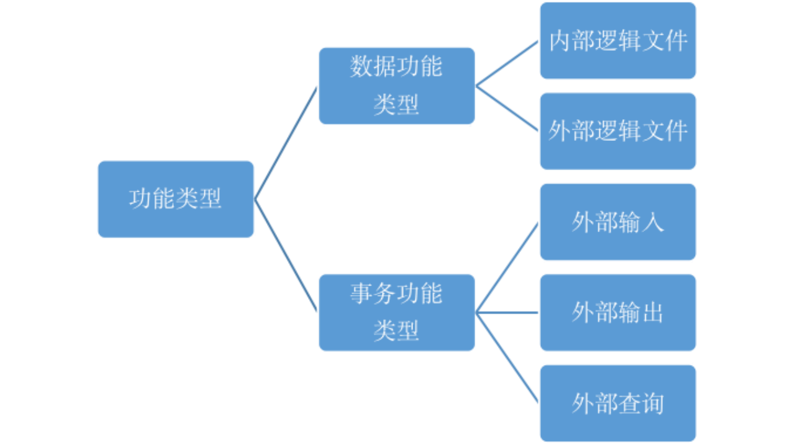

- 事务类型(Transaction Function): 对最终用户可见
- 数据功能(Data Function): 对最终用户不可见


- 外部输入(External Input, EI): 应用程序对来自其边界以外的数据或控制信息的基本处理
- 外部查询(External Query, EQ): 是指应用程序向其边界之外提供数据或控制信息的基本处理，与外部输出（EO）不同的是，处理逻辑中既不可以包含数学计算也不产生衍生数据，处理过程中不可以维护内部逻辑文件，也不可以改变系统行为。
- 外部输出(External Output, EO): 应用程序向其边界之外提供数据或控制信息的基本处理,可能包含数据计算或衍生数据


- 内部逻辑文件(Internal Logic File, ILF)
- 外部接口文件(External Interface File, EIF)


