# 项目步骤

## MySQL中创建表


## 在线开发 -> Online表单开发 -> 导入数据库表


## 根据文档图片编辑 -> 代码生成 -> 把代码复制到对用前后端

表单风格: 两列

页面属性: 根据文档

## 修改前后端代码


## 菜单管理 -> 引导式配置 -> 更多 -> 添加下级

carrier_activation_relation_t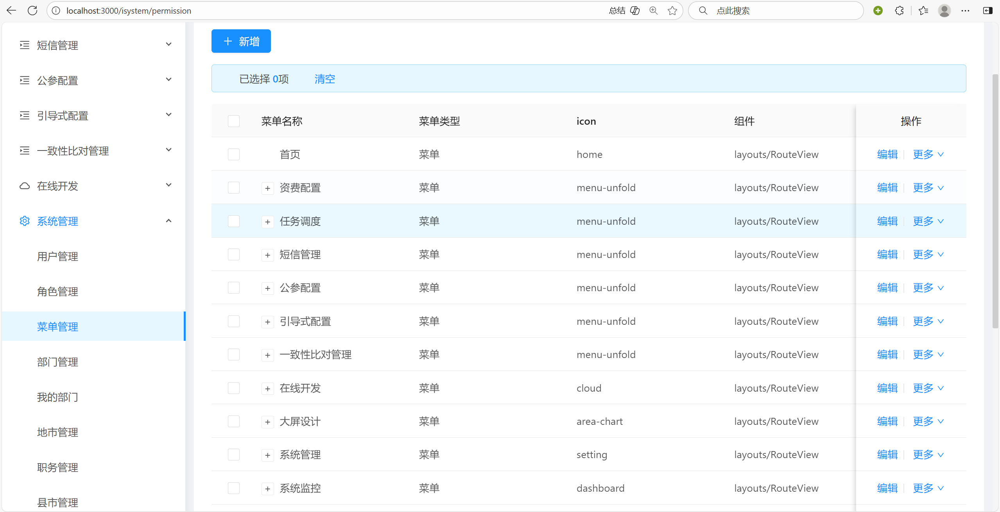


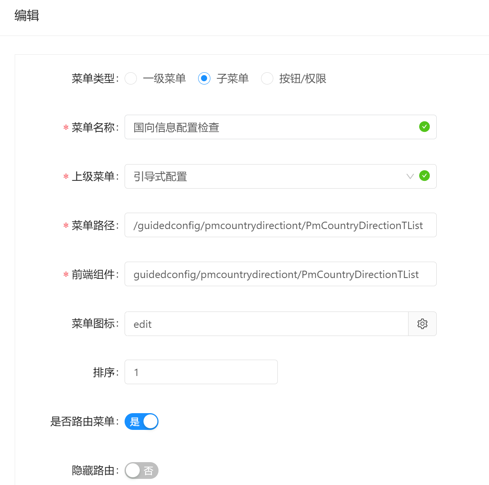


## 角色管理 -> 更多 -> 授权 -> 打勾 -> 保存并关闭


# 问题记录


## 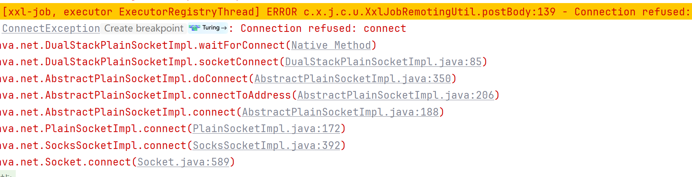

1. 根据PM_COUNTRY_DIRECTION_T的carrier_cd查询两张表GMBD.RS_CARRIERS_BASE和GMBD.RS_CARRIERS_DUAL_BASE，将表中信息填入rs_carriers_base_t

问题：

1. openDt会有多个吗
1. 前端配置（数据字典、是否为空校验）

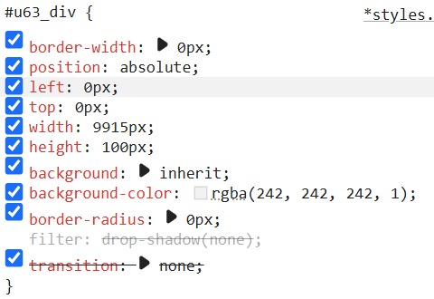


- [x] 根据工单号查询每个页面数据，实现串联
- [x] 去掉开始的工单号
- [x] 造数据，根据工单号
- [x] 从3开始，加校验判断，如果该页面数据为空不能点下一步
- [x] 检查-》配置
- [ ] 审核页面，去除功能，只留查询
- [x] 改名：pmworkorderconfig
- [ ] 不一致不能点下一步


https://f0fuiz.axshare.com/?id=tq16rn&p=%E8%BF%90%E8%90%A5%E5%95%86%E5%BC%80%E9%80%9A%E5%85%B3%E7%B3%BB%E6%A3%80%E6%9F%A5


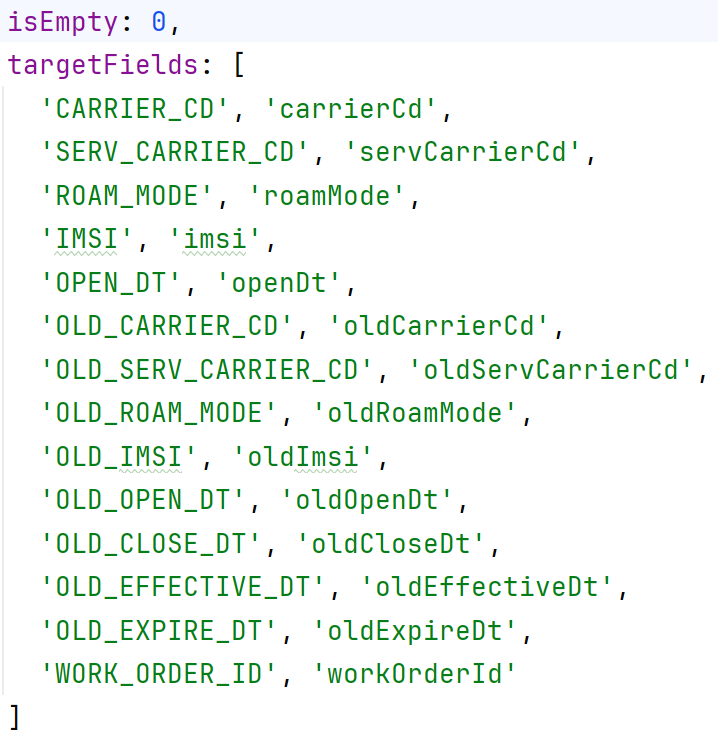

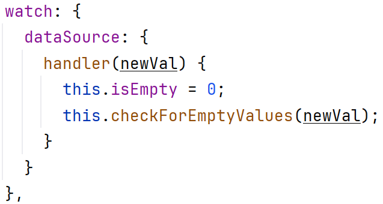

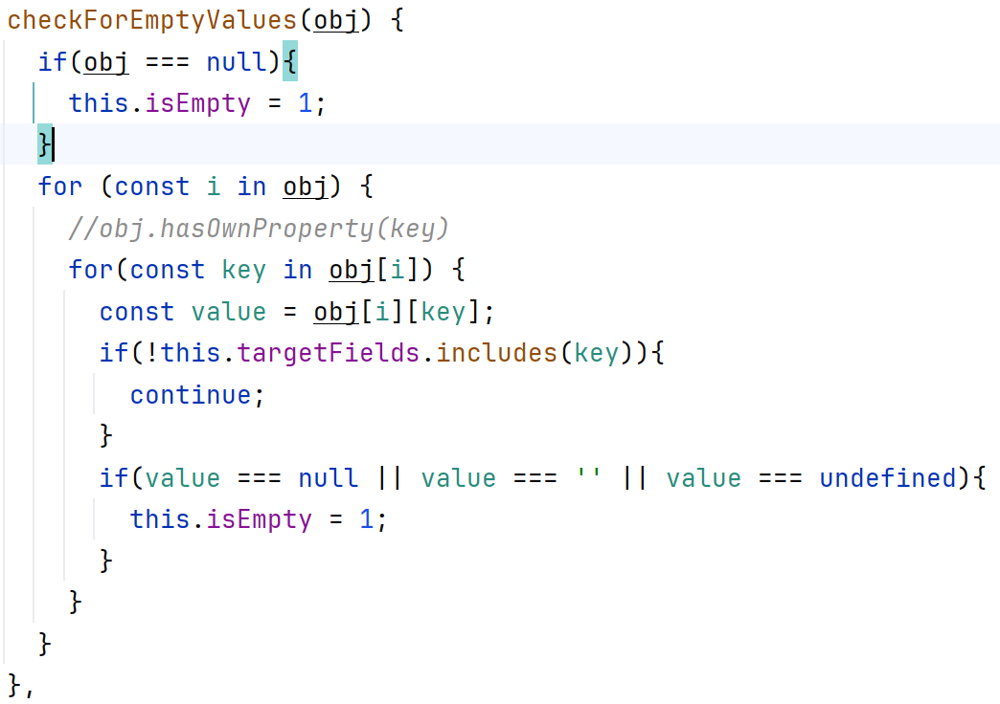

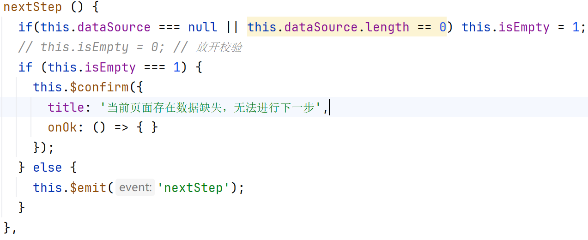


# 一 登录界面

## 1.1 验证码

`http://localhost:9051/jeecg-boot/sys/randomImage/1757661008823?_t=1757661008`

```java
@RestController
@RequestMapping("/sys")
@Api(tags="用户登录")
@Slf4j
public class LoginController {
    /**
	 * 后台生成图形验证码 ：有效
	 * @param response
	 * @param key
	 */
	@ApiOperation("获取验证码")
	@GetMapping(value = "/randomImage/{key}")
	public Result<String> randomImage(HttpServletResponse response,@PathVariable String key){
		Result<String> res = new Result<String>();
		try {
			String code = RandomUtil.randomString(BASE_CHECK_CODES,4);
			String lowerCaseCode = code.toLowerCase();
			String realKey = MD5Util.MD5Encode(lowerCaseCode+key, "utf-8");
			redisUtil.set(realKey, lowerCaseCode, 60);
			String base64 = RandImageUtil.generate(code);
			res.setSuccess(true);
			res.setResult(base64);
		} catch (Exception e) {
			res.error500("获取验证码出错"+e.getMessage());
			e.printStackTrace();
		}
		return res;
	}
}
```

## 1.2 token

`import { ACCESS_TOKEN } from "@/store/mutation-types"`

`tokenHeader: {'X-Access-Token': Vue.ls.get(ACCESS_TOKEN)}`


# 二 上传国际公司开通信息

## 2.1 导入PDF

`http://localhost:9051/jeecg-boot/guidedconfig.pmpdfinfot/pmPdfInfoT/importExcel?workOrderId=111`

```java
@Api(tags = "国际公司开通信息表")
@RestController
@RequestMapping("/guidedconfig.pmpdfinfot/pmPdfInfoT")
@Slf4j
public class PmPdfInfoTController extends JeecgController<PmPdfInfoT, IPmPdfInfoTService>{
	@RequestMapping(value = "/importExcel", method = RequestMethod.POST)
    public Result<?> importExcel(HttpServletRequest request, HttpServletResponse response) {
        try {
            // 获取工单号
            String workOrderId = request.getParameter("workOrderId");
            // 1. 从请求中获取上传的PDF文件
            MultipartHttpServletRequest multipartRequest = (MultipartHttpServletRequest) request;
            MultipartFile file = multipartRequest.getFile("file"); // 前端上传的文件字段名
            if (file == null || file.isEmpty()) {
                return Result.error("请上传PDF文件");
            }

            String filename = file.getOriginalFilename();

            // 2. 检查文件类型是否为PDF
            if (!file.getContentType().equals("application/pdf")) {
                return Result.error("仅支持PDF文件");
            }
            // 3. 解析PDF文本内容,去除水印
            String pdfText;
            try (PDDocument document = PDDocument.load(file.getInputStream())) {
                PDFTextStripper stripper = new PDFTextStripper(){
                    // 重写writeString方法过滤水印
                    @Override
                    protected void writeString(String text, List<TextPosition> textPositions) throws IOException {
                        // 假设水印有特殊特征（如字体大小、颜色或位置）
                        boolean isWatermark = false;

                        // 检查文本特征判断是否为水印
                        for (TextPosition textPosition : textPositions) {
                            // 示例：字体大小小于20可能是水印
                            if (textPosition.getFontSize() < 20) {
                                isWatermark = true;
                                break;
                            }
                            // 还可以检查其他特征如字体名称、颜色等
                        }

                        if (!isWatermark) {
                            super.writeString(text, textPositions);
                        }
                    }
                };

                pdfText = stripper.getText(document);
            }

            // 去除空格及页码
            pdfText = pdfText.replaceAll("[\\s\\u3000]+", "")
                    . replaceAll("－\\d+－", "");

            // 2. 分割行并处理
            String[] lines = pdfText.split("\r?\n");
            StringBuilder result = new StringBuilder();

            for (String line : lines) {
                line = line.trim();
                if (!line.isEmpty()) {
                    if (result.length() > 0) {
                        result.append("\n");
                    }
                    result.append(line);
                }
            }

            pmPdfInfoTService.dealPdf(String.valueOf(result),filename, workOrderId);

            return Result.OK("PDF导入成功");

        } catch (IOException e) {
            return Result.error("解析PDF失败: " + e.getMessage());
        }
    }
}
```


```java
public void dealPdf(String pdfText, String filename, String workOrderId) {
        List<PmPdfInfoT> pdfInfoTList = new ArrayList<>();

        // 提取各章节内容
    	// extractChapterContent: 自写的方法,实际是substring
        String chapterFirstContent = extractChapterContent(pdfText, CHAPTER_1, CHAPTER_2);
        String chapterSecondContent = extractChapterContent(pdfText, CHAPTER_2, CHAPTER_3);
        String chapterThirdContent = extractChapterContent(pdfText, CHAPTER_3, CHAPTER_4);

        // 处理第一章节
        if (chapterFirstContent != null) {
            processGsmGprsChapter(chapterFirstContent.replace(" ", ""), filename, workOrderId, pdfInfoTList);
        }
        // 处理第二章节
        if (chapterSecondContent != null) {
            processLteChapter(chapterSecondContent.replace(" ", ""), filename,  workOrderId, pdfInfoTList);
        }
        // 处理第三章节
        if (chapterThirdContent != null) {
            processVolteChapter(chapterThirdContent.replace(" ", ""), filename, workOrderId, pdfInfoTList);
        }

        // 入库
        this.saveBatch(pdfInfoTList);
    }
```


```css
<a-upload
	name="file" <!-- 发到后台的文件参数名 -->
	accept=".pdf" <!-- 接受上传的文件类型 -->
	:showUploadList="false" <!-- 是否在 a-upload 组件下方显示已上传文件的列表 -->
	:multiple="false" <!-- 是否支持多选文件 -->
	:headers="tokenHeader" <!-- 添加进请求头. 在这里的header是 tokenHeader: {'X-Access-Token': Vue.ls.get(ACCESS_TOKEN)} -->
	:action="importExcelUrl" <!-- 上传的地址 -->
	:beforeUpload="beforePdfUpload" <!-- 在上传前实施的方法 -->
	@change="handleImportExcel" <!-- 更新状态(info.file.status)改变时调用 -->
>
    <a-button type="primary" icon="upload">
        {{ uploading ? '上传中...' : '导入PDF' }}  <!-- 上传状态反馈 -->
    </a-button>
</a-upload>
```


### 2.1.1 MultipartHttpServletRequest

```java
interface MultipartHttpServletRequest extends HttpServletRequest{

public MultipartFile getFile(String name);

public Map getFileMap();

public Iterator getFileNames();

}
```


### 2.1.2 importExcelUrl

前端:

```css
computed: {
      importExcelUrl: function(){
          <!-- 把全局配置里的域名前缀 window._CONFIG['domianURL'] -->
          <!-- 与当前组件 this.url.importExcelUrl 拼接成一个完整的 URL 字符串并返回。-->
        return `${window._CONFIG['domianURL']}/${this.url.importExcelUrl}`;
      },
    }
```


### 2.1.3 handleImportExcel

前端:

```css
handleImportExcel(info) {
    if (info.file.status === 'done') {
    	this.$message.success('PDF 导入成功！');
    } else if (info.file.status === 'error') {
    	this.$message.error('PDF 导入失败！');
    }
},
```


### 2.1.4 PDFBox

#### 2.1.4.1 导入

```html
<dependency>
    <groupId>org.apache.pdfbox</groupId>
    <artifactId>pdfbox</artifactId>
    <version>2.0.28</version>
</dependency>
```


#### 2.1.4.2 创建PDF文档

我们可以使用以下代码创建一个简单的PDF文档：

```java
import java.io.File;
import java.io.IOException;

import org.apache.pdfbox.pdmodel.PDDocument;
import org.apache.pdfbox.pdmodel.PDPage;
import org.apache.pdfbox.pdmodel.font.PDType1Font;

public class CreatePDF {
	
    public static void main(String[] args) {
        
		PDDocument document = new PDDocument();
        PDPage page = new PDPage();
        document.addPage(page);

        PDType1Font font = PDType1Font.HELVETICA_BOLD;

        try {
   
   
            PDPageContentStream contentStream = new PDPageContentStream(document, page);
            contentStream.beginText();
            contentStream.setFont(font, 12);
            contentStream.newLineAtOffset(100, 700);
            contentStream.showText("Hello, World!");
            contentStream.endText();
            contentStream.close();

            document.save(new File("one-more.pdf"));
            document.close();

            System.out.println("PDF created successfully.");
        } catch (IOException e) {
   
   
            e.printStackTrace();
        }
    }
}
```

这个代码段创建一个新的PDF文档，并在其第一页上写入"Hello, World!"。我使用了Helvetica Bold字体，并将其大小设置为12。

接下来，我将文本显示在PDF页面上，并使用`contentStream.close()`方法关闭`PDPageContentStream`对象。

最后，我将文档保存为"one-more.pdf"文件，然后关闭PDDocument对象。效果如下图：

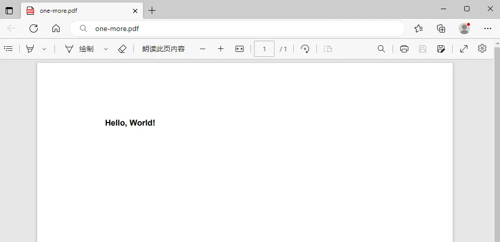

#### 

#### 2.1.4.3 读取PDF文件

我们可以使用以下代码读取PDF文件中的全部内容：

```java
import java.io.File;
import java.io.IOException;
import org.apache.pdfbox.pdmodel.PDDocument;
import org.apache.pdfbox.text.PDFTextStripper;

public class ReadPDFExample {
   
   
    public static void main(String[] args) {
   
   
        // 创建文件对象
        File file = new File("one-more.pdf");

        try {
   
   
            // 创建 PDF 文档对象
            PDDocument document = PDDocument.load(file);

            // 创建 PDF 文本剥离器
            PDFTextStripper stripper = new PDFTextStripper();

            // 获取 PDF 文件的全部内容
            String text = stripper.getText(document);

            // 输出 PDF 文件的全部内容
            System.out.println(text);

            // 关闭 PDF 文档对象
            document.close();
        } catch (IOException e) {
   
   
            e.printStackTrace();
        }
    }
}
```

首先，创建一个文件对象，然后使用 PDDocument 类的静态方法 load() 加载 PDF 文件并创建一个 PDF 文档对象。

然后，我们创建一个 PDFTextStripper 对象，并使用它的 getText() 方法获取 PDF 文件的全部内容。

最后，我们输出 PDF 文件的全部内容，并关闭 PDF 文档对象。

输出内容就是之前我们写入的：

```autohotkey
Hello, World!
```


#### 2.1.4.4 插入图片

我们可以使用以下代码在PDF文件中插入图片：

```java
import java.io.File;
import java.io.IOException;

import org.apache.pdfbox.pdmodel.PDDocument;
import org.apache.pdfbox.pdmodel.PDPage;
import org.apache.pdfbox.pdmodel.graphics.image.PDImageXObject;

public class InsertImageInPDF {
   
   
    public static void main(String[] args) {
   
   
        try {
   
   
            // 加载PDF文件
            PDDocument document = PDDocument.load(new File("one-more.pdf"));

            // 获取第一页
            PDPage page = document.getPage(0);

            // 加载图像文件
            PDImageXObject image = PDImageXObject.createFromFile("one-more.jpg", document);

            // 在指定位置插入图像
            PDPageContentStream contentStream = new PDPageContentStream(document, page, AppendMode.APPEND, true, true);
            contentStream.drawImage(image, 200, 500, image.getWidth(), image.getHeight());

            // 关闭流
            contentStream.close();

            // 保存修改后的PDF文件
            document.save("one-more-jpg.pdf");

            // 关闭文档
            document.close();
            System.out.println("PDF created successfully.");
        } catch (IOException e) {
   
   
            e.printStackTrace();
        }
    }
}
```

在这个例子中，我们加载了一个名为“one-more.pdf”的PDF文件，获取了第一页，并加载了一个名为“one-more.jpg”的图像文件。

然后，我们使用`drawImage()`方法在PDF文档中的指定位置插入了图像。

最后，我们将修改后的文档保存到名为“one-more-jpg.pdf”的新文件中，并关闭文档。效果如下图：

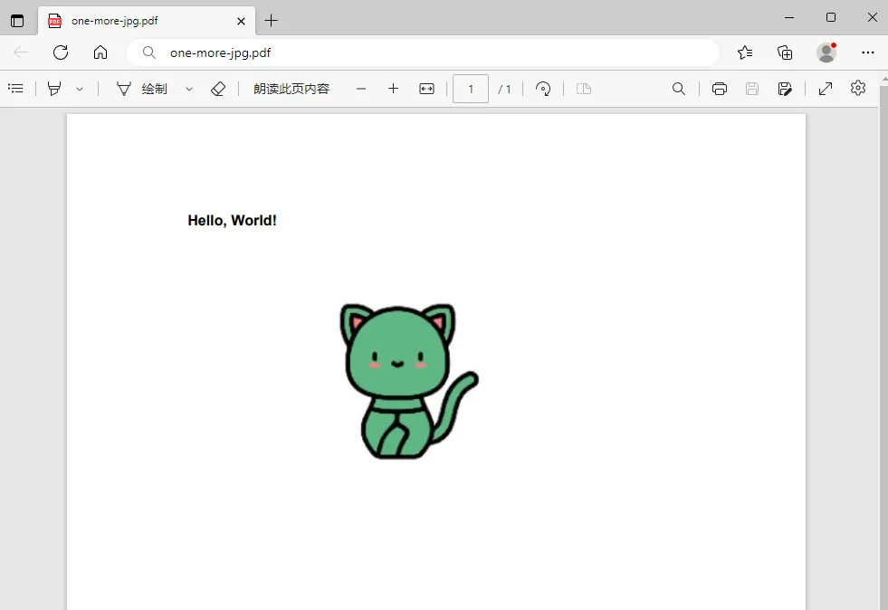


#### 2.1.4.5 读取图片

我们可以使用以下代码在PDF文件中读取图片：

```java
import java.io.IOException;
import java.util.List;

import org.apache.pdfbox.pdmodel.PDDocument;
import org.apache.pdfbox.pdmodel.PDPage;
import org.apache.pdfbox.pdmodel.graphics.image.PDImageXObject;

public class ReadPDFImagesExample {
   
   

    public static void main(String[] args) {
   
   
        try {
   
   
            // 加载PDF文件
            PDDocument document = PDDocument.load(new File("one-more-jpg.pdf"));

            PDPageTree pageTree = document.getPages();

            // 遍历每个页面
            for (PDPage page : pageTree) {
   
   
                int pageNum = pageTree.indexOf(page) + 1;
                int count = 1;
                System.out.println("Page " + pageNum + ":");
                for (COSName xObjectName : page.getResources().getXObjectNames()) {
   
   

                    PDXObject pdxObject = page.getResources().getXObject(xObjectName);
                    if (pdxObject instanceof PDImageXObject) {
   
   
                        PDImageXObject image = (PDImageXObject) pdxObject;
                        System.out.println("Found image with width "
                                + image.getWidth()
                                + "px and height "
                                + image.getHeight()
                                + "px.");
                        String fileName = "one-more-" + pageNum + "-" + count + ".jpg";
                        ImageIO.write(image.getImage(), "jpg", new File(fileName));
                        count++;
                    }
                }
            }

            document.close();
        } catch (IOException e) {
   
   
            e.printStackTrace();
        }
    }
}
```

在此示例中，我们使用`PDDocument`类从指定的PDF文件中加载文档，并遍历每个页面以查找其中的图像。

对于每个页面，我们获取其资源（包括图像）并检查其中是否存在图像。

如果存在，则我们遍历它们，并使用`PDImageXObject`对象获取它们的属性，例如宽度和高度。

然后，使用ImageIO把图片保存到本地文件系统。

输出如下：

```apache
Page 1:
Found image with width 150px and height 150px.
```


# 三、国向

## 3.1 导入EXCEL


### 3.1.1 checkFile

```java
private void checkFile(MultipartFile file) {
        if (file.getSize() > SIZE_10M) {
            throw new BusinessException(BusinessCodeEnum.FILE_TOO_LARGE.getCode(), BusinessCodeEnum.FILE_TOO_LARGE.getDesc());
        }
        if (!EXCEL_PATTERN.matcher(file.getOriginalFilename()).matches()) {
            throw new BusinessException(BusinessCodeEnum.IS_NOT_EXCEL.getCode(), BusinessCodeEnum.IS_NOT_EXCEL.getDesc());
        }
    }
```

`matches()`: 检测字符串是否匹配给定的正则表达式

matcher 是 Pattern 类的方法，用于根据正则表达式创建一个匹配器（Matcher 对象），这个匹配器可以在指定字符串（这里是文件名）上进行正则匹配操作。
matches 是 Matcher 类的方法，用于判断整个字符串是否完全匹配正则表达式。如果完全匹配，返回 true，否则返回 false。


# 四、前端排序按钮


相关代码链路如下（你加上 sorter: true 后会触发这些逻辑）:
列定义
你在 defColumns 里给某列加 sorter: true，Ant Design Vue 会让该列表头可点排序，并在排序时把 sorter 对象通过 @change 事件抛出。
a-table 组件
<a-table ... @change="handleTableChange">
排序点击后会调用 handleTableChange(pagination, filters, sorter)。
JeecgListMixin.js 中的 handleTableChange
代码：
if (Object.keys(sorter).length > 0) {
this.isorter.column = sorter.field;
this.isorter.order = "ascend" == sorter.order ? "asc" : "desc"
}
然后 this.loadData(); 触发重新请求。
排序参数传递
getQueryParams() 中把 this.isorter 合并到请求参数：
var param = Object.assign(sqp, this.queryParam, this.isorter ,this.filters);
后端就会收到 column, order 这两个参数。
初始默认排序
data 里 isorter 初值：{ column:'createTime', order:'desc' }。首次加载按 createTime desc。


# 五、查询相关

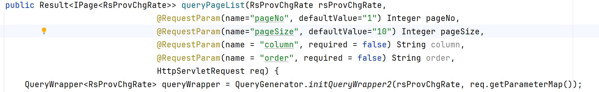

可以把前端传来的参数用 req.getParameterMap() 获取，然后遍历这个map，把值赋给queryWrapper


简易方法：如果字段名称相同，也可以直接使用 new QueryWrapper<>(Object) 把要查的东西直接传进去
