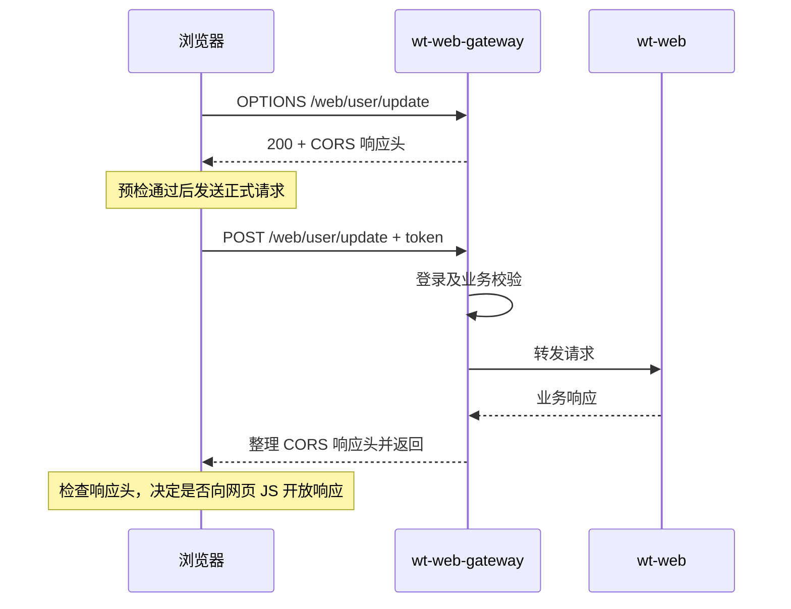

## 扩展：跨域处理
当前项目把跨域处理集中在 **`wt-web-gateway` 的 [CorsFilterConfig.java (line 30)](/D:/workspace/wh/wt/wt-web-gateway/src/main/java/com/wotransfer/webgateway/configuration/CorsFilterConfig.java:30)**：网关响应预检请求，并给业务响应添加 CORS 头。

不过，当前代码同时返回 `Allow-Origin: *` 和 `Allow-Credentials: true`，**这会导致开启凭据模式的浏览器跨域请求失败**。

**先理解浏览器为什么需要跨域处理**

网页和接口的**协议、域名、端口**任一不同，就是不同源。例如网页运行在 `http://localhost:5173`，访问 `https://api.example.com`。

CORS 通过接口响应头，告诉浏览器是否允许网页读取响应。JSON 请求或携带自定义 `token` 头的请求，通常还会先发 `OPTIONS` 预检。[浏览器 CORS 规则](https://developer.mozilla.org/en-US/docs/Web/HTTP/Guides/CORS)

以项目的用户更新接口为例，流程是：

````

````

**1．预检请求由网关直接响应**

[corsFilter() (line 40)](/D:/workspace/wh/wt/wt-web-gateway/src/main/java/com/wotransfer/webgateway/configuration/CorsFilterConfig.java:40) 是一个 WebFlux `WebFilter`，先判断是否为跨域请求：

```
if (!CorsUtils.isCorsRequest(request)) {
    return chain.filter(ctx);
}
```

假设浏览器准备发送 JSON 和 `token`，会先询问：

```
OPTIONS /web/user/update
Origin: http://localhost:5173
Access-Control-Request-Method: POST
Access-Control-Request-Headers: content-type,token
```

网关根据请求生成这些响应头：

|响应头|当前代码的行为|
|---|---|
|`Access-Control-Allow-Origin`|固定为 `*`，允许任意来源|
|`Access-Control-Allow-Methods`|回填浏览器请求的 method，例如 `POST`|
|`Access-Control-Allow-Headers`|回填浏览器申请的 header 名称，例如 `content-type,token`|
|`Access-Control-Allow-Credentials`|固定为 `true`|
|`Access-Control-Expose-Headers`|固定为 `*`|
|`Access-Control-Max-Age`|`18000` 秒，即申请缓存预检结果 5 小时，实际受浏览器上限限制|

它没有在这里检查来源、方法、请求头白名单，而是直接允许浏览器申请的方法和头。

遇到跨域 `OPTIONS` 时：

```
if (request.getMethod() == HttpMethod.OPTIONS) {
    response.setStatusCode(HttpStatus.OK);
    return Mono.empty();
}
```

因为没有继续执行过滤链，**预检不会进入网关的 Token 业务过滤器，也不会转发到 wt-web**。这符合预检只询问访问规则的用途。

**2．正式请求继续认证、路由和业务处理**

正式的 `POST` 请求会继续执行过滤链，进入 [Pre20TokenGlobalFilter (line 52)](/D:/workspace/wh/wt/wt-web-gateway/src/main/java/com/wotransfer/webgateway/filters/Pre20TokenGlobalFilter.java:52)。它读取 `token` 请求头，再按路径白名单、Token 有效性、会话配置等规则处理。

本地 [路由配置 (line 115)](/D:/workspace/wh/wt/wt-web-gateway/src/main/resources/bootstrap.yml:115) 将普通 `/web/**` 请求转发给 `consumer-web`；wt-web 的 [上下文路径配置 (line 38)](/D:/workspace/wh/wt/wt-web/src/main/resources/bootstrap.properties:38) 也是 `/web`。

所以，CORS 允许请求继续，并不意味着用户获得了业务权限。登录校验和“能否操作他人的数据”仍由网关及业务代码负责。

**3．业务返回后，网关再次整理跨域头**

[corsPostFilter() (line 78)](/D:/workspace/wh/wt/wt-web-gateway/src/main/java/com/wotransfer/webgateway/configuration/CorsFilterConfig.java:78) 是一个 Gateway `GlobalFilter`：

```
return (exchange, chain) -> chain.filter(exchange)
    .then(Mono.just(exchange))
    .map(serverWebExchange -> {
        // 删除已有 CORS 响应头
        // 重新设置网关的 CORS 响应头
    })
    .then();
```

在这条正常完成的响应链路里，它先移除已有跨域头，再写入自己的规则，目的是避免下游和网关重复添加。

wt-web 本身没有完整的全局 CORS 配置。只有 [用户等级接口 (line 742)](/D:/workspace/wh/wt/wt-web/src/main/java/com/wotransfer/web/payer/controller/UserController.java:742) 单独添加了 `Access-Control-Max-Age: 1800`；经过上述网关响应过滤器时，这个值会被重设为 `18000`。

**4．为什么配置了跨域，浏览器仍可能报错**

当前代码的这组响应头有冲突：

```
Access-Control-Allow-Origin: *
Access-Control-Allow-Credentials: true
```

如果前端使用：

```
fetch(url, { credentials: "include" })
```

或 Axios 的 `withCredentials: true`，浏览器要求 `Allow-Origin` 返回**具体来源**，不能是 `*`。否则，即使服务端返回了 `200`，网页仍不能读取响应。在凭据模式下，`Expose-Headers: *` 也不会作为通配符开放所有响应头。[Fetch 标准](https://fetch.spec.whatwg.org/#cors-protocol-and-credentials)

但**手动添加 `token` 请求头，不等于开启凭据模式**。如果前端只传 `token`，没有启用跨域 Cookie 凭据模式，那么当前配置可能正常工作：预检允许 `token` 头，正式响应的 `Allow-Origin: *` 也能被接受。

排查时，在浏览器 Network 中分别看 `OPTIONS` 和正式请求：确认预检响应允许了所需 method/header，再检查正式响应的 `Allow-Origin`，以及前端是否开启了 `credentials`。

如果项目需要跨域 Cookie，应使用可信来源白名单，返回匹配的具体 `Origin` 和 `Allow-Credentials: true`；如果只使用手动 Token，也应明确允许的来源、方法和请求头。以上是本地代码的行为，实际部署还需核对 Nacos 配置和前置代理是否调整了这些响应头。