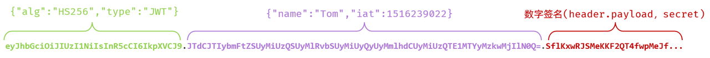
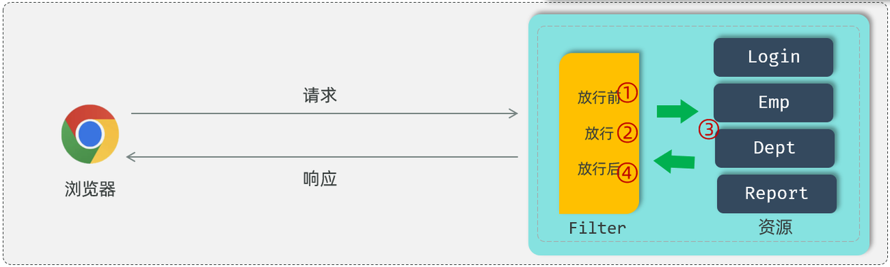
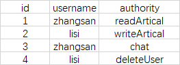

# 一、认证模块
## 1.2 用户登录/注册
### 1.2.1前端(登陆)
#### **scr/views/Login.vue**
```javascript
	// 向后端发送登录请求
	const res = await login(form.value.phone, form.value.code)
```

#### **src/api/user.ts**
```javascript
export const login = (phone: string, code: string) => {
	// <ApiResponse<LoginResponse>>：指定响应数据的类型结构
	// 实际请求URL:baseURL+'/auth/login'
	// 请求体数据：{ phone, code }
	return request.post<ApiResponse<LoginResponse>>('/auth/login', { phone, code })

}
```

#### **src/api/request.ts**
```javascript
// 创建axios实例

const request = axios.create({
	baseURL: '/api',
	timeout: 30000,
	headers: {
	'Content-Type': 'application/json'
	}
})
```

#### **src/types/index.ts**
```javascript
export interface ApiResponse<T> {
	code: number
	message: string
	data: T
	timestamp: string
}

export interface LoginResponse {
	token: string
	expiresIn: number
	user: {
		id: string
		phone: string
		memberStatus: string
		memberExpireTime?: string
		registerTime: string
	}
}
```

### 1.2.2 后端（登陆）
#### login(.../controller/AuthController.java)
```java
@PostMapping("/login")  
public ApiResponse<LoginResponse> login(@Valid @RequestBody LoginRequest request) {  
    LoginResponse response = userService.login(request);  
    return ApiResponse.success("登录成功", response);  
}
```

#### 补充: @Valid 和 @Validated
- @Valid 对类对象进行数据校验，使用方法：
```java
@Data  
public class LoginRequest {  
      
    @NotBlank(message = "手机号不能为空")  
    @Pattern(regexp = "^1[3-9]\\d{9}$", message = "手机号格式错误")  
    private String phone;  
      
    @NotBlank(message = "验证码不能为空")  
    @Size(min = 6, max = 6, message = "验证码必须为6位")  
    private String code;  
}
```
- @Validated
```java
@RestController
@Validated  // 在类上添加此注解
public class UserController {
    
    // 对单个参数进行校验
    @GetMapping("/user/{id}")
    public Result getUserById(
        @PathVariable @Min(value = 1, message = "ID必须大于0") Long id,
        @RequestParam @NotBlank String name) {
        return userService.getUserById(id, name);
    }
}
```
---
#### login(.../service/impl/UserServiceImpl.java)
```java
@Override  
@Transactional  
public LoginResponse login(LoginRequest request) {  
    String phone = request.getPhone();  
    String code = request.getCode();  
      
    // 验证验证码
    String codeKey = CODE_KEY_PREFIX + phone;  
    Object storedCode = redisTemplate.opsForValue().get(codeKey);  
      
    if (storedCode == null || !code.equals(storedCode.toString())) {  
        throw BusinessException.badRequest("验证码错误或已过期");  
    }  
      
    // 验证成功，删除验证码  
    redisTemplate.delete(codeKey);  
      
    // 查询或创建用户  
    String phoneHash = PhoneUtil.hash(phone);  
    User user = userRepository.findByPhoneHash(phoneHash);  
      
    boolean isNewUser = false;  
    if (user == null) {  
        // 新用户注册  
        user = new User();  
        user.setPhone(aesUtil.encrypt(phone));  
        user.setPhoneHash(phoneHash);  
        user.setMemberStatus("FREE");  
        user.setDeleted(0);  
        userRepository.insert(user);  
        isNewUser = true;  
        log.info("新用户注册: {}", PhoneUtil.mask(phone));  
    }  
      
    // 更新最后登录时间  
    user.setLastLoginTime(LocalDateTime.now());  
    userRepository.updateById(user);  
      
    // 生成JWT Token  
    String token = jwtUtil.generateToken(user.getId());  
      
    // 构建响应  
    LoginResponse response = new LoginResponse();  
    response.setToken(token);  
    response.setExpiresIn(jwtUtil.getExpirationSeconds());  
      
    LoginResponse.UserInfo userInfo = new LoginResponse.UserInfo();  
    userInfo.setId(user.getId());  
    userInfo.setPhone(PhoneUtil.mask(phone));  
    userInfo.setMemberStatus(user.getMemberStatus());  
    userInfo.setMemberExpireTime(user.getMemberExpireTime());  
    userInfo.setRegisterTime(user.getRegisterTime());  
    response.setUser(userInfo);  
      
    log.info("用户登录成功: userId={}, isNewUser={}", user.getId(), isNewUser);  
    return response;  
}
```
#### 补充：DigestUtil
```java
/**  
 * 生成手机号哈希(用于数据库查询)  
 */public static String hash(String phone) {  
    return DigestUtil.sha256Hex(phone);  
}
```
**md5和sha256算法的区别**

相同点：

1、都是密码散列函数，加密不可逆。

2、都可以实现对任意长度对象加密，都不能防止碰撞。

_安全性方面：_

1、SHA256（⼜称SHA2）的安全性最⾼，但是耗时要⽐其他两种多很多。

2、md5相对来说比较容易碰撞，安全性没这么高。

_性能方面：_

以⼀个60M的⽂件为测试样本，经过1000次的测试平均值，这两种算法的表现如下：

MD5算法运⾏1000次的平均时间为：226ms

[SHA256算法](https://zhida.zhihu.com/search?content_id=201524285&content_type=Article&match_order=1&q=SHA256%E7%AE%97%E6%B3%95&zhida_source=entity)运⾏1000次的平均时间为：473ms


#### 补充：非对称加密（RSA），对称加密（AES)
- 对称加密算法
加密和解密用到的密钥是相同的，这种加密方式加密速度非常快，适合经常发送数据的场合。缺点是密钥的传输比较麻烦。

- 非对称加密算法
加密和解密用的密钥是不同的，这种加密方式是用数学上的难解问题构造的，通常加密解密的速度比较慢，适合偶尔发送数据的场合。优点是密钥传输方便。常见的非对称加密算法为RSA、ECC和EIGamal。

实际中，一般是通过RSA加密AES的密钥，传输到接收方，接收方解密得到AES密钥，然后发送方和接收方用AES密钥来通信。

```java
@Component  
public class AESUtil {  
      
    @Value("${aes.key}")  
    private String aesKey;  
      
    @Value("${aes.iv}")  
    private String aesIv;  
      
    private AES aes;  
      
    @PostConstruct  
    public void init() {  
        // 确保key和iv为16字节  
        byte[] keyBytes = padOrTrim(aesKey.getBytes(StandardCharsets.UTF_8), 16);  
        byte[] ivBytes = padOrTrim(aesIv.getBytes(StandardCharsets.UTF_8), 16);  
        // 使用 PKCS5Padding (JDK标准支持，与PKCS7Padding在16字节块大小时等效)  
        this.aes = new AES("CBC", "PKCS5Padding", keyBytes, ivBytes);  
    }  
      
    /**  
     * 加密  
     */  
    public String encrypt(String plainText) {  
        if (plainText == null || plainText.isEmpty()) {  
            return plainText;  
        }  
        return aes.encryptBase64(plainText);  
    }  
      
    /**  
     * 解密  
     */  
    public String decrypt(String encryptedText) {  
        if (encryptedText == null || encryptedText.isEmpty()) {  
            return encryptedText;  
        }  
        return aes.decryptStr(encryptedText);  
    }  
      
    /**  
     * 填充或截断到指定长度  
     */  
    private byte[] padOrTrim(byte[] bytes, int length) {  
        byte[] result = new byte[length];  
        System.arraycopy(bytes, 0, result, 0, Math.min(bytes.length, length));  
        return result;  
    }  
}
```
#### 补充：JWT令牌
JWT的组成： （JWT令牌由三个部分组成，三个部分之间使用英文的点来分割）

- 第一部分：Header(头）， 记录令牌类型、签名算法等。 例如：{"alg":"HS256","type":"JWT"}
    
- 第二部分：Payload(有效载荷），携带一些自定义信息、默认信息等。 例如：{"id":"1","username":"Tom"}
    
- 第三部分：Signature(签名），防止Token被篡改、确保安全性。将header、payload，并加入指定秘钥，通过指定签名算法计算而来。


**问题**：token放进LoginResponse里，为什么不存在数据库中？
答：在前端用的，后端返回给前端后，前端存到本地，每次发送请求时都会带上令牌
##### 代码示例

```java
/**  
 * JWT工具类  
 */  
@Component  
public class JwtUtil {  
      
    @Value("${jwt.secret}")  
    private String secret;  
      
    @Value("${jwt.expiration}")  
    private Long expiration;  
      
    @Value("${jwt.refresh-threshold}")  
    private Long refreshThreshold;  
      
    private SecretKey secretKey;  
      
    @PostConstruct  
    public void init() {  
        this.secretKey = Keys.hmacShaKeyFor(secret.getBytes(StandardCharsets.UTF_8));  
    }  
      
    /**  
     * 生成JWT Token  
     */    
     public String generateToken(String userId) {  
        Date now = new Date();  
        Date expiryDate = new Date(now.getTime() + expiration);  
          
        return Jwts.builder()  
                .subject(userId)  
                .issuedAt(now)  
                .expiration(expiryDate)  
                .signWith(secretKey)  
                .compact();  
    }  
      
    /**  
     * 从Token中获取用户ID  
     */    public String getUserIdFromToken(String token) {  
        Claims claims = parseToken(token);  
        return claims != null ? claims.getSubject() : null;  
    }  
      
    /**  
     * 验证Token是否有效  
     */  
    public boolean validateToken(String token) {  
        try {  
            parseToken(token);  
            return true;  
        } catch (JwtException | IllegalArgumentException e) {  
            return false;  
        }  
    }  
      
    /**  
     * 检查Token是否可以刷新(过期前1天内)  
     */    public boolean canRefresh(String token) {  
        try {  
            Claims claims = parseToken(token);  
            if (claims == null) {  
                return false;  
            }  
            Date expiry = claims.getExpiration();  
            long timeUntilExpiry = expiry.getTime() - System.currentTimeMillis();  
            // 在过期前refreshThreshold毫秒内可以刷新  
            return timeUntilExpiry > 0 && timeUntilExpiry <= refreshThreshold;  
        } catch (ExpiredJwtException e) {  
            // Token已过期但在刷新阈值内，也允许刷新  
            long expiredTime = System.currentTimeMillis() - e.getClaims().getExpiration().getTime();  
            return expiredTime <= 3600000; // 过期1小时内也可刷新  
        } catch (JwtException | IllegalArgumentException e) {  
            return false;  
        }  
    }  
      
    /**  
     * 获取Token过期时间(秒)  
     */    public Long getExpirationSeconds() {  
        return expiration / 1000;  
    }  
      
    /**  
     * 解析Token  
     */    private Claims parseToken(String token) {  
        try {  
            return Jwts.parser()  
                    .verifyWith(secretKey)  
                    .build()  
                    .parseSignedClaims(token)  
                    .getPayload();  
        } catch (ExpiredJwtException e) {  
            throw e; // 让调用方处理过期情况  
        } catch (JwtException | IllegalArgumentException e) {  
            return null;  
        }  
    }  
      
    /**  
     * 从过期Token中获取用户ID(用于刷新)  
     */    public String getUserIdFromExpiredToken(String token) {  
        try {  
            parseToken(token);  
            return null;  
        } catch (ExpiredJwtException e) {  
            return e.getClaims().getSubject();  
        }  
    }  
}
```


#### 补充：Filter 和 OncePerRequestFilter
##### Filter
基本使用操作：
1. 定义过滤器Filter：定义一个类，实现Filter接口，并重写其所有方法
2. 配置过滤器Filter：Filter类加上@WebFilter注解，配置拦截资源的路径。引导类上加@ServletComponentScan 开启Servlet组件支持
###### 1). 定义过滤器
```java
public class DemoFilter implements Filter {
    //初始化方法, web服务器启动, 创建Filter实例时调用, 只调用一次
    public void init(FilterConfig filterConfig) throws ServletException {
        System.out.println("init ...");
    }

    //拦截到请求时,调用该方法,可以调用多次
    public void doFilter(ServletRequest servletRequest, ServletResponse servletResponse, FilterChain chain) throws IOException, ServletException {
        System.out.println("拦截到了请求...");
        chain.doFilter(request, response); // 放行
    }

    //销毁方法, web服务器关闭时调用, 只调用一次
    public void destroy() {
        System.out.println("destroy ... ");
    }
}
```
- init方法：过滤器的初始化方法。在web服务器启动的时候会自动的创建Filter过滤器对象，在创建过滤器对象的时候会自动调用init初始化方法，这个方法只会被调用一次。
    
- doFilter方法：这个方法是在每一次拦截到请求之后都会被调用，所以这个方法是会被调用多次的，每拦截到一次请求就会调用一次doFilter()方法。
    
- destroy方法： 是销毁的方法。当我们关闭服务器的时候，它会自动的调用销毁方法destroy，而这个销毁方法也只会被调用一次。
###### 2). 配置过滤器
在定义完Filter之后，Filter其实并不会生效，还需要完成Filter的配置，Filter的配置非常简单，只需要在Filter类上添加一个注解：`@WebFilter`，并指定属性`urlPatterns`，通过这个属性指定过滤器要拦截哪些请求
```Java
@WebFilter(urlPatterns = "/*") //配置过滤器要拦截的请求路径（ /* 表示拦截浏览器的所有请求 ）
public class DemoFilter implements Filter {
    // ...
}
```
当我们在Filter类上面加了@WebFilter注解之后，接下来我们还需要在启动类上面加上一个注解`@ServletComponentScan`，通过这个`@ServletComponentScan`注解来开启SpringBoot项目对于Servlet组件的支持。
```Java
@ServletComponentScan //开启对Servlet组件的支持
@SpringBootApplication
public class TliasManagementApplication {
    public static void main(String[] args) {
        SpringApplication.run(TliasManagementApplication.class, args);
    }
}
```
###### Filter执行流程

过滤器当中我们拦截到了请求之后，如果希望继续访问后面的web资源，就要执行放行操作，放行就是调用 FilterChain对象当中的doFilter()方法，在调用doFilter()这个方法之前所编写的代码属于放行之前的逻辑。

在放行后访问完 web 资源之后还会回到过滤器当中，回到过滤器之后如有需求还可以执行放行之后的逻辑，放行之后的逻辑我们写在doFilter()这行代码之后。

##### OncePerRequestFilter
###### 1、概览

本文将带你了解 [Spring](https://springdoc.cn/spring/) 中一种特殊类型的 Filter（过滤器）`OncePerRequestFilter`。

通过实例了解它的功能和用法。

###### 2、`OncePerRequestFilter` 是什么？

回顾一下 `Filter` 的工作原理。`Filter` 可以在 `Servlet` 执行之前或之后调用。当请求被调度给一个 `Servlet` 时，`RequestDispatcher` 可能会将其转发给另一个 `Servlet`。另一个 `Servlet` 也有可能使用相同的 `Filter`。在这种情况下，**同一个 `Filter` 会被调用多次**。

但是，有时需要确保每个请求只调用一次特定的 Filter。一个常见的用例是在使用 [Spring Security](https://springdoc.cn/spring-security/) 时。当请求通过过滤器链（Filter Chain）时，对请求的身份证认证应该只执行一次。

在这种情况下，可以继承 `OncePerRequestFilter`。Spring 保证 `OncePerRequestFilter` 只对指定请求执行一次。

###### 3、使用 `OncePerRequestFilter` 处理同步请求

定义一个继承了 `OncePerRequestFilter` 的 `AuthenticationFilter` Filter 类，并覆写 `doFilterInternal()` 方法：

```java
public class AuthenticationFilter extends OncePerRequestFilter {
    @Override
    protected void doFilterInternal(HttpServletRequest request, HttpServletResponse response,
      FilterChain filterChain) throws ServletException, IOException {
        String usrName = request.getHeader(“userName”);
        logger.info("Successfully authenticated user  " +
                userName);
        filterChain.doFilter(request, response);
    }
}
```

由于 `OncePerRequestFilter` 仅支持 HTTP 请求，因此无需像直接实现 `Filter` 接口时那样对 `request` 和 `response` 对象进行强制转换。

###### 4、使用 `OncePerRequestFilter` 处理异步请求

对于异步请求，默认情况下不会应用 `OncePerRequestFilter`。

需要覆写 `shouldNotFilterAsyncDispatch()` 和 `shouldNotFilterErrorDispatch()` 方法来支持这一点。

有时，只需要在初始请求线程中应用 Filter，而不需要在异步调度中创建的其他线程中应用 Filter。其他时候，可能需要在每个额外线程中至少调用一次 Filter。在这种情况下，需要覆写 `shouldNotFilterAsyncDispatch()` 方法。

如果 `shouldNotFilterAsyncDispatch()` 方法返回 `true`，那么后续的异步调度不会调用 Filter。但是，如果该方法返回 `false`，则 `Filter` 会在每次异步调度中调用，每个线程正好调用一次。

类似地，可以覆写 `shouldNotFilterErrorDispatch()` 方法，并根据是否希望过滤 Error Dispatch 来返回 `true` 或 `false`：

```java
@Component
public class AuthenticationFilter extends OncePerRequestFilter {
    @Override
    protected void doFilterInternal(HttpServletRequest request, HttpServletResponse response,
      FilterChain filterChain) throws ServletException, IOException {
        String usrName = request.getHeader("userName");
        logger.info("Successfully authenticated user  " +
          usrName);
        filterChain.doFilter(request, response);
    }

    @Override
    protected boolean shouldNotFilterAsyncDispatch() {
        return false;
    }

    @Override
    protected boolean shouldNotFilterErrorDispatch() {
        return false;
    }
}
```

###### 5、有条件地跳过请求

可以通过覆写 `shouldNotFilter()` 方法，让 `Filter` 有条件地只适用于某些特定请求，而跳过其他请求：

```java
@Override
protected boolean shouldNotFilter(HttpServletRequest request) throws ServletException {
    return Boolean.TRUE.equals(request.getAttribute(SHOULD_NOT_FILTER));
}
```

###### 6、快速示例

通过一个快速示例来了解 `OncePerRequestFilter`。

首先，定义一个 Controller，使用 Spring 的 `DeferredResult` 异步处理请求：

```java
@Controller
public class HelloController  {
    @GetMapping(path = "/greeting")
    public DeferredResult<String> hello(HttpServletResponse response) throws Exception {
        DeferredResult<String> deferredResult = new DeferredResult<>();
        executorService.submit(() -> perform(deferredResult));
        return deferredResult;
    }
    private void perform(DeferredResult<String> dr) {
        // some processing 
        dr.setResult("OK");
    }
}
```

异步处理请求时，两个线程都会经过相同的过滤器链（Filter Chain）。因此，Filter 会被调用两次：第一次是容器线程处理请求时，第二次是异步调度器（Async Dispatcher）完成后。异步处理完成后，响应将返回给客户端。

现在，定义一个继承 `OncePerRequestFilter` 的 Filter：

```java
@Component
public class MyOncePerRequestFilter extends OncePerRequestFilter {
    @Override
    protected void doFilterInternal(HttpServletRequest request, HttpServletResponse response, 
      FilterChain filterChain) throws ServletException, IOException {
        logger.info("Inside Once Per Request Filter originated by request {}", request.getRequestURI());
        filterChain.doFilter(request, response);
    }

    @Override
    protected boolean shouldNotFilterAsyncDispatch() {
        return true;
    }
}
```

如上，故意从 `shouldNotFilterAsyncDispatch()` 方法中返回 `true`。这是为了证明过滤器只在容器线程中调用一次，而不会在后续的异步线程中调用。

测试，调用端点：

```sh
curl -X GET http://localhost:8082/greeting 
```

输出如下：

```txt
10:23:24.175 [http-nio-8082-exec-1] INFO  o.a.c.c.C.[Tomcat].[localhost].[/] - Initializing Spring DispatcherServlet 'dispatcherServlet'
10:23:24.175 [http-nio-8082-exec-1] INFO  o.s.web.servlet.DispatcherServlet - Initializing Servlet 'dispatcherServlet'
10:23:24.176 [http-nio-8082-exec-1] INFO  o.s.web.servlet.DispatcherServlet - Completed initialization in 1 ms
10:23:26.814 [http-nio-8082-exec-1] INFO  c.b.O.MyOncePerRequestFilter - Inside OncePer Request Filter originated by request /greeting
```

现在，来看看请求和异步调度都调用 `Filter` 的情况。只需覆写 `shouldNotFilterAsyncDispatch()` 方法，返回 `false` 即可：

```java
@Override
protected boolean shouldNotFilterAsyncDispatch() {
    return false;
}
```

输出如下：

```txt
2:53.616 [http-nio-8082-exec-1] INFO  o.a.c.c.C.[Tomcat].[localhost].[/] - Initializing Spring DispatcherServlet 'dispatcherServlet'
10:32:53.616 [http-nio-8082-exec-1] INFO  o.s.web.servlet.DispatcherServlet - Initializing Servlet 'dispatcherServlet'
10:32:53.617 [http-nio-8082-exec-1] INFO  o.s.web.servlet.DispatcherServlet - Completed initialization in 1 ms
10:32:53.633 [http-nio-8082-exec-1] INFO  c.b.O.MyOncePerRequestFilter - Inside OncePer Request Filter originated by request /greeting
10:32:53.663 [http-nio-8082-exec-2] INFO  c.b.O.MyOncePerRequestFilter - Inside OncePer Request Filter originated by request /greeting
```

从上面的输出可以看出，`Filter` 被调用了两次 - 首先是容器线程，然后是另一个线程。

###### 7、总结

本文介绍了 `OncePerRequestFilter` 的功能以及在实际中的用法。

---

Ref：`https://www.baeldung.com/spring-onceperrequestfilter`

#### 补充：GrantedAuthority接口
权限：一个字符串，一般不会重复
权限检查：查看用户权限列表中是否含有匹配的字符串
在Security中，角色和权限共用GrantedAuthority接口，唯一的不同角色就是多了个前缀"ROLE_"，而且它没有Shiro的那种从属关系，即一个角色包含哪些权限等等。在Security看来角色和权限时一样的，它认证的时候，把所有权限（角色、权限）都取出来，而不是分开验证。

所以，在Security提供的UserDetailsService默认实现JdbcDaoImpl中，角色和权限都存储在auhtorities表中。而不是像Shiro那样，角色有个roles表，权限有个permissions表。以及相关的管理表等等。
##### GrantedAuthority接口的默认实现SimpleGrantedAuthority
```java
public final class SimpleGrantedAuthority implements GrantedAuthority {  
  
    private static final long serialVersionUID = SpringSecurityCoreVersion.SERIAL_VERSION_UID;  
  
    private final String role;  
  
    public SimpleGrantedAuthority(String role) {  
       Assert.hasText(role, "A granted authority textual representation is required");  
       this.role = role;  
    }  
  
    @Override  
    public String getAuthority() {  
       return this.role;  
    }  
  
    @Override  
    public boolean equals(Object obj) {  
       if (this == obj) {  
          return true;  
       }  
       if (obj instanceof SimpleGrantedAuthority sga) {  
          return this.role.equals(sga.getAuthority());  
       }  
       return false;  
    }  
  
    @Override  
    public int hashCode() {  
       return this.role.hashCode();  
    }  
  
    @Override  
    public String toString() {  
       return this.role;  
    }  
  
}
```
##### 角色和权限能否分开存储？角色能不能不带"ROLE_"前缀？
当然可以分开存储，你可以定义两张表，一张存角色，一张存权限。但是你自定义UserDetailsService的时候，需要保证把这两张表的数据都取出来，放到UserDails的权限集合中。当然你数据库中存储的角色也可以不带"ROLE_"前缀，就像这样。

但是前面说到了，Security才不管你是角色，还是权限。它只比对字符串。

比如它有个表达式hasRole("ADMIN")。那它实际上查询的是用户权限集合中是否存在字符串"ROLE_ADMIN"。如果你从角色表中取出用户所拥有的角色时不加上"ROLE_"前缀，那验证的时候就匹配不上了。

所以角色信息存储的时候可以没有"ROLE_"前缀，但是包装成GrantedAuthority对象的时候必须要有。

##### 权限检查/访问控制方式
权限检查有两种方式，一种是在配置类中，指定粗粒度的访问控制，另一种是使用注解细粒度的控制访问。

**粗粒度访问控制**，所有URL以"/admin"开头的用户必须拥有角色"ADMIN"才能访问。实际上操作的时候hasRole表达式，会判断参数是否包含"ROLE_"前缀，如果没有则加上去，然后再去校验。有这个前缀则直接校验。
```java
protected void configure(HttpSecurity http) throws Exception {
        http.authorizeRequests()
                .antMatchers("/admin/**").access("hasRole('ADMIN')")
                .antMatchers("/user/**").access("hasRole('USER')")
                .anyRequest().authenticated();
    
}
```
**细粒度的访问控制**

 注：需要使用注解@EnableGlobalMethodSecurity(prePostEnabled=true) 开启
 ```java
 @PreAuthoritze("hasAuthority('readArtical')")
public List<Artical> getAll() {
    //...
}
 ```
 这个注解，会从SecurityContext中取出Authencation对象，然后再取出Collection<GrantedAuthority> authorites集合。然后比对当前用户是否有权限"readArtical"。实际上就是比对集合中是否有那个GrantedAuthority的getAuthority()方法返回的字符串与"radArtical"匹配。


### 1.2.3 前端(获取用户信息)
```javascript
const handleLogin = async () => {

	if (!agreed.value) {
	ElMessage.warning('请先同意用户协议和隐私政策')
	return
	}
	
	// 表单校验
	const valid = await formRef.value?.validate().catch(() => false)
	if (!valid) return
	  
	loading.value = true
	try {
		// 向后端发送登录请求	
		const res = await login(form.value.phone, form.value.code)
		
		// 保存Token
		userStore.setToken(res.data.data.token)
		
		// 获取用户信息
		await userStore.fetchUserProfile()
		
		ElMessage.success('登录成功')
		
		// 跳转到目标页面
		const redirect = route.query.redirect as string
		
		router.push(redirect || '/diary')
	
	} catch (error) {
	console.error('登录失败:', error)
	
	} finally {
	loading.value = false
	
	}

}
```

#### userStore.fetchUserProfile() -> getUserProfile
```javascript
/**
* 获取用户信息
*/

export const getUserProfile = () => {
	return request.get<ApiResponse<UserProfile>>('/user/profile').then(res => res.data)
}
```

### 1.2.4 后端(获取用户信息)
#### getProfile(.../controller/UserController.java)
```java

private final UserService userService;  
private final SecurityContext securityContext;
/**  
 * 获取用户信息  
 */  
@GetMapping("/profile")  
public ApiResponse<UserProfileResponse> getProfile() {  
    String userId = securityContext.getCurrentUserId();  
    UserProfileResponse response = userService.getProfile(userId);  
    return ApiResponse.success(response);  
}
```

#### SecurityContext
```java
/**  
 * 安全上下文工具类  
 * 获取当前登录用户信息  
 */  
@Component  
public class SecurityContext {  
      
    /**  
     * 获取当前登录用户  
     */  
    public User getCurrentUser() {  
        Authentication authentication = SecurityContextHolder.getContext().getAuthentication();  
        if (authentication != null && authentication.getPrincipal() instanceof User) {  
            return (User) authentication.getPrincipal();  
        }  
        return null;  
    }  
      
    /**  
     * 获取当前登录用户ID  
     */    public String getCurrentUserId() {  
        User user = getCurrentUser();  
        return user != null ? user.getId() : null;  
    }  
      
    /**  
     * 判断当前用户是否为Pro会员  
     */  
    public boolean isProMember() {  
        User user = getCurrentUser();  
        return user != null && "PRO".equals(user.getMemberStatus());  
    }  
      
    /**  
     * 判断是否已登录  
     */  
    public boolean isAuthenticated() {  
        Authentication authentication = SecurityContextHolder.getContext().getAuthentication();  
        return authentication != null &&   
               authentication.isAuthenticated() &&   
               authentication.getPrincipal() instanceof User;  
    }  
}
```

#### 补充：SecurityContextHolder
##### 1. 工作模式
- MODE_THREADLOCAL：默认，使用`ThreadLocal`，一个线程使用一个安全上下文
- MODE_GLOBAL：所有线程使用同一个安全上下文
- MODE_INHERITABLETHREADLOCAL：一些应用会有自己的线程创建，并且希望这些新建线程也能使用创建者的安全上下文
##### 2. 配置工作模式
两种方法：
1. 在配置文件中配置：spring.security.strategy
2. 调用`SecurityContextHolder`静态方法`setStrategyName()`

##### 3. 代码例子
```java

// 获取安全上下文对象，就是那个保存在 ThreadLocal 里面的安全上下文对象
// 总是不为null(如果不存在，则创建一个authentication属性为null的empty安全上下文对象)
SecurityContext securityContext = SecurityContextHolder.getContext();

// 获取当前认证了的 principal(当事人),或者 request token (令牌)
// 如果没有认证，会是 null,该例子是认证之后的情况
Authentication authentication = securityContext.getAuthentication()

// 获取当事人信息对象，返回结果是 Object 类型，但实际上可以是应用程序自定义的带有更多应用相关信息的某个类型。
// 很多情况下，该对象是 Spring Security 核心接口 UserDetails 的一个实现类，你可以把 UserDetails 想像
// 成我们数据库中保存的一个用户信息到 SecurityContextHolder 中 Spring Security 需要的用户信息格式的
// 一个适配器。
Object principal = authentication.getPrincipal();
if (principal instanceof UserDetails) {
	String username = ((UserDetails)principal).getUsername();
} else {
	String username = principal.toString();
}

```

项目中的使用：
```java
/**  
 * 获取当前登录用户  
 */  
public User getCurrentUser() {  
    Authentication authentication = SecurityContextHolder.getContext().getAuthentication();  
    if (authentication != null && authentication.getPrincipal() instanceof User) {  
        return (User) authentication.getPrincipal();  
    }  
    return null;  
}
```


